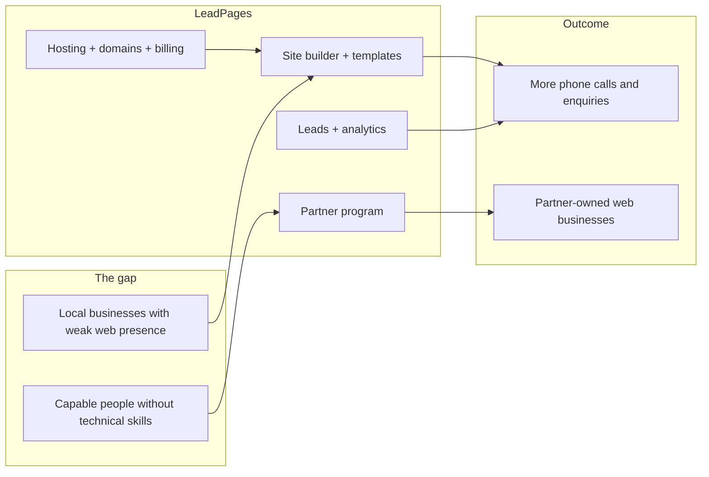
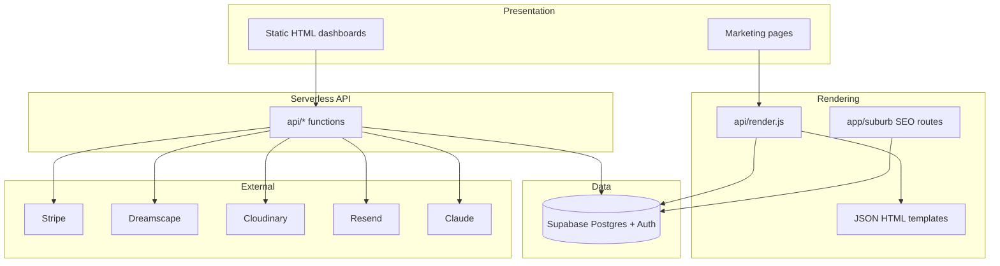
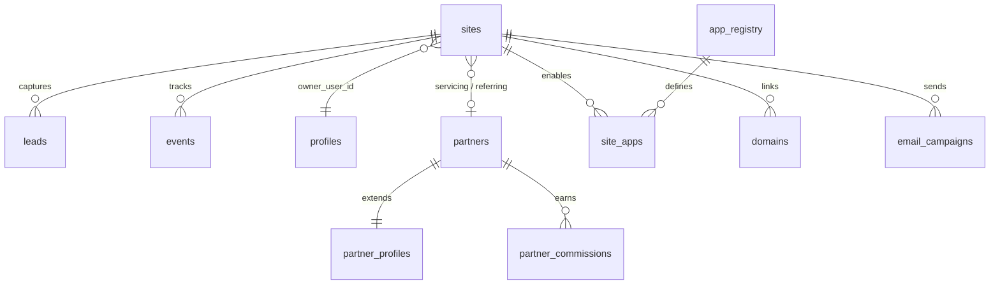
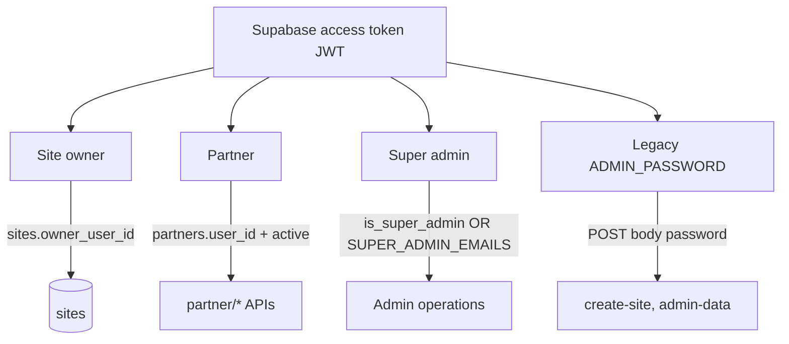
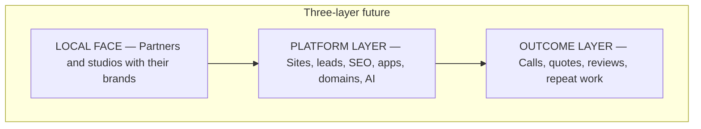

# LeadPages — Platform Vision

**Document:** `00-VISION`  
**Status:** Foundational reference — source of truth for product and engineering intent  
**Audience:** Engineers, product owners, partners, operators, and AI development agents  
**Entity:** Bean Culture Pty Ltd trading as Web Culture (ABN 33 600 754 676)  
**Tagline:** *Smart sites. More leads. Built in Canberra, Australia.*

---

## Overview

LeadPages is an **Australian multi-tenant SaaS platform** that helps local businesses get more work from the web — and helps non-technical operators build a web design business around delivering that outcome.

The platform combines:

- **Industry-ready website templates** with professional copy and conversion layouts
- **A visual site builder** (`/manage`) for partners and site owners
- **Native lead capture and analytics** (forms, call tracking, dashboards)
- **Partner distribution** (commissions, training, client management)
- **Integrated operations** (hosting, billing, domains, email, marketplace apps)
- **AI-assisted content** (trade packs, suburb intros, copy drafts)

LeadPages is **not** a generic global page builder. It is purpose-built for Australian tradies, service businesses, mortgage brokers, and the partners who serve them locally.



---

## Purpose

### Why this document exists

This is the **first document** in the LeadPages engineering canon. Every subsequent doc (`01-ARCHITECTURE` through `13-ROADMAP`) assumes the reader understands the intent described here.

Future developers and AI agents must read this file **before** modifying the platform. When a technical decision conflicts with a principle here, **stop and escalate** — do not silently optimise against product intent.

### What problem LeadPages solves

Two gaps exist in the Australian small-business market:

1. **Demand gap** — Good local businesses lose work to competitors who simply show up better online. Many still rely on Facebook-only presence, outdated DIY sites, or no site at all. They cannot capture enquiries reliably.

2. **Supply gap** — Capable people (parents at home, career changers, local networkers) have the relationships to fix that problem but lack the technical means to deliver professional websites at agency speed and price.

LeadPages bridges both gaps with **one integrated platform**: partners sell and support; the platform builds, hosts, and measures.

### Product promise

> **Professional websites that make the phone ring.**

Every feature — templates, marketplace apps, suburb SEO, analytics — is judged by whether it moves a visitor toward calling, quoting, or enquiring.

---

## Business Context

### Business model

| Revenue stream | Description | Who pays |
|----------------|-------------|----------|
| **Platform fees** | Flat per-site cost to partners/operators | Partner or direct operator |
| **Hosting subscriptions** | Monthly care plans via Stripe | End-customer (via partner invoice or direct) |
| **Setup / build fees** | One-off site launch | End-customer — partner sets price |
| **Partner commissions** | 50% upfront build, 20% recurring (program terms) | LeadPages pays partner |
| **Domain resale** | `.com.au` registration and DNS add-ons | End-customer |
| **Marketplace apps** | Optional per-site app subscriptions | End-customer |

**Critical business rule:** Partners invoice clients directly and **keep what they charge**. LeadPages does not take a revenue split on partner pricing. Platform cost is flat and predictable. This is explicit in partner onboarding: *"You keep everything you charge."*

### Partner model rules

These rules are **non-negotiable** product constraints:

| Rule | Rationale |
|------|-----------|
| Partners own the client relationship at the surface | Local trust drives sales |
| LeadPages owns the platform and ultimate customer record | Continuity if partner leaves |
| LeadPages can assist, reassign, or transfer accounts | No stranded customers |
| Partners must meet service standards | Brand and client protection |
| Commissions are measurable and auditable | Partner trust and finance compliance |
| Demo sites close deals — show, don't describe | Sales motion encoded in product |

### Typical economics (partner channel)

| Item | Typical range (AUD) |
|------|---------------------|
| Setup fee per site | $800 – $1,500 |
| Monthly care plan | $49 – $99 / month |
| First-year revenue (10 clients, illustrative) | ~$14,000+ |

Figures are examples from partner marketing materials — not guarantees. Partners set their own rates.

### Competitive positioning

LeadPages competes against:

| Alternative | Weakness LeadPages addresses |
|-------------|------------------------------|
| DIY builders (Wix, Squarespace) | Blank canvas, no industry content, plugin sprawl |
| Facebook-only presence | No lead capture, poor SEO, unprofessional |
| Local agencies | $5k+, months of delivery, no partner scalability |
| Offshore cheap sites | No local support, poor conversion design |

LeadPages wins on **speed**, **industry content**, **native lead infrastructure**, **Australian domain integration**, and **partner economics**.

---

## Architecture

At vision level, LeadPages is a **hybrid serverless application**:



**Architectural principle (vision level):** The system is intentionally pragmatic — static HTML admin UIs, serverless APIs, config-driven rendering. Do not rewrite into a heavy framework without explicit approval. Safe evolution favours documentation, modular extraction, schema versioning, and shared auth helpers.

Detailed architecture: [`01-ARCHITECTURE.md`](./01-ARCHITECTURE.md).

---

## Important Files

Vision-level entry points — not an exhaustive file list.

| File | Why it matters |
|------|----------------|
| [`home.html`](../home.html) | Primary marketing positioning and partner CTA |
| [`partners.html`](../partners.html) | Partner program economics and standards |
| [`start-your-business.html`](../start-your-business.html) | Partner onboarding narrative |
| [`tradies.html`](../tradies.html) | Direct B2B tradie channel |
| [`manage.html`](../manage.html) | Production site builder ("App Command Centre") |
| [`partner-dashboard.html`](../partner-dashboard.html) | Partner client management |
| [`api/render.js`](../api/render.js) | Central tenant page renderer |
| [`api/leads.js`](../api/leads.js) | Lead capture — encodes "never lose a lead" ethic |
| [`vercel.json`](../vercel.json) | Routing and deployment contract |
| [`trade.template.json`](../trade.template.json) | Primary tradie landing template |
| [`AGENTS.md`](../AGENTS.md) | Instructions for AI coding agents |
| [`CLAUDE.md`](../CLAUDE.md) | Extended agent and developer context |

---

## Important Functions

At vision level, these **capabilities** map to critical code paths. Function-level detail lives in downstream docs.

| Capability | Primary implementation | Business reason |
|------------|---------------------|-----------------|
| Tenant page render | `api/render.js` → `module.exports` handler | Public sites must be fast, cached, gated correctly |
| Site autosave | `manage.html` → `lpSaveDB()` | Editors must not lose work |
| Lead ingest | `api/leads.js` | Revenue depends on captured enquiries |
| Analytics ingest | `api/events.js` | Owners must see what drives calls |
| Partner identity | `api/partner/me.js` | Partner claim-by-email onboarding |
| Billing enforcement | `api/render.js` → `suspendedPage()` | Revenue protection without broken pages |
| Trade pack generation | `api/api-trade-generate.js` | Expand industry library without engineering |
| Suburb SEO | `app/[site]/[suburb]/route.js` | Geographic reach with integrity guardrails |

---

## Data Flow

### High-level platform data flow

```mermaid
flowchart TD
  subgraph create [Site creation]
    P[Partner / owner] -->|create site| SITES[(sites table)]
    SITES -->|config JSONB| CFG[Page content + sections]
  end

  subgraph publish [Publishing]
    CFG --> RENDER[api/render.js]
    RENDER -->|HTML| VIS[Visitor]
  end

  subgraph convert [Conversion]
    VIS -->|form submit| LEADS[(leads)]
    VIS -->|call click| EVENTS[(events)]
    LEADS -->|email| OWNER[Site owner inbox]
    LEADS --> MGMT[/manage dashboard]
    EVENTS --> MGMT
  end

  subgraph bill [Billing]
    STRIPE[Stripe webhook] --> SITES
    SITES -->|billing_status| RENDER
  end
```

### Central data concept: `sites.config`

Almost all page content lives in a single JSONB document per tenant. **Config is the product** — templates are shells; editors write config; renderers read config. See [`03-TEMPLATE-SYSTEM.md`](./03-TEMPLATE-SYSTEM.md) and [`10-EDITOR.md`](./10-EDITOR.md).

---

## Database Tables

Vision-level view of the data model. Full schema: [`02-DATABASE.md`](./02-DATABASE.md).



| Table group | Core tables | Purpose |
|-------------|-------------|---------|
| **Tenant** | `sites`, `site_backups` | Every customer website |
| **Auth** | `profiles` | User roles (`is_super_admin`) |
| **CRM** | `leads`, `events`, `email_optouts` | Enquiries and analytics |
| **Partners** | `partners`, `partner_profiles`, `partner_commissions` | Distribution network |
| **Billing** | `billing_plans`, `billing_customers`, `site_app_subscriptions` | Stripe lifecycle |
| **Marketplace** | `app_registry`, `site_apps`, `service_packs`, `catalog_*` | Extensible features |
| **Domains** | `domains`, `domain_orders`, `domain_pricing` | Dreamscape resale |
| **SEO** | `suburb_intros` | Cached AI suburb copy |
| **Instagram** | `ig_connections` | Per-site Graph API tokens |

**Schema risk:** Only `suburb_intros` and `ig_connections` are versioned in `db/*.sql`. Most tables are maintained in Supabase directly — see Known Risks.

---

## API Endpoints

Vision-level API map. Full endpoint reference: [`01-ARCHITECTURE.md`](./01-ARCHITECTURE.md).

| Domain | Example paths | Auth | Vision-level purpose |
|--------|---------------|------|---------------------|
| **Render** | `GET /api/render` | Public (+ preview cookie) | Serve tenant HTML |
| **Leads** | `POST /api/leads` | Public | Capture enquiries — always 200 |
| **Events** | `POST /api/events` | Public | Analytics beacons — always 200 |
| **Billing** | `/api/billing/*` | Bearer + ownership | Stripe subscriptions |
| **Domains** | `/api/domains/*` | Bearer / webhook | Domain search and DNS |
| **Partners** | `/api/partner/*` | Bearer + active partner | Client and quote CRUD |
| **Platform** | `/api/api-*` | Mixed | Apps registry, trade generation |
| **Cron** | `/api/billing/cron` | `CRON_SECRET` | Daily maintenance |

**~73 serverless functions** live under `api/`. No application-level middleware — each handler enforces auth independently.

---

## Authentication

### Actor model



| Actor | Sign-in | Authorization |
|-------|---------|---------------|
| **Public visitor** | None | Public endpoints only |
| **Site owner** | Supabase email/password or OTP in `/manage` | Bearer token + RLS / ownership |
| **Partner** | Supabase in `/partner-dashboard` | Bearer + `partners.status = active` |
| **Super admin** | Supabase + `profiles.is_super_admin` or `SUPER_ADMIN_EMAILS` | Billing admin, system pages |
| **Legacy admin** | `ADMIN_PASSWORD` in POST body | `builder.html`, `admin.html` |
| **Cron / webhooks** | `CRON_SECRET`, Stripe HMAC | Scheduled jobs, payment events |

**Design decision:** No custom JWT library — Supabase access tokens validated via `GET /auth/v1/user`. Session stored client-side; APIs are stateless.

**Security note:** Supabase anon key is embedded in HTML pages (standard for Supabase client apps). Real protection is RLS + server-side service role for privileged ops.

---

## Dependencies

### Runtime (`package.json`)

| Package | Version | Purpose |
|---------|---------|---------|
| `@supabase/supabase-js` | ^2.45.0 | Server-side Supabase client in `api/` |

**Intentional minimalism:** Stripe, Anthropic, Dreamscape, Resend, and Cloudinary are called via raw `fetch` — no SDKs in `package.json`. Next.js is used for `app/` routes but is not declared as a dependency (Vercel framework detection).

### External services

| Service | Role | Failure impact |
|---------|------|----------------|
| **Supabase** | Database, auth, storage | Platform down |
| **Vercel** | Hosting, serverless, cron | Platform down |
| **Stripe** | Payments | Cannot bill; webhooks stall |
| **Dreamscape** | Domain registration/DNS | Domain features fail |
| **Cloudinary** | Image uploads | Media upload fails |
| **Resend** | Transactional + campaign email | Leads stored but not emailed |
| **LeadPages Brain / LLM providers** | Landing drafts (Brain); trade packs, suburb intros, assist (still direct Anthropic) | Degrade per feature; Brain has mock fallback when configured — [AI/00-STATUS](AI/00-STATUS.md) |
| **Instagram Graph API** | Project feed sync | Instagram apps show stale/empty |

---

## Configuration

Vision-level environment variable groups. Full list: [`01-ARCHITECTURE.md`](./01-ARCHITECTURE.md).

| Group | Key variables | Sensitivity |
|-------|---------------|-------------|
| **Supabase** | `SUPABASE_URL`, `SUPABASE_ANON_KEY`, `SUPABASE_SERVICE_ROLE_KEY` | Service role is secret |
| **Stripe** | `STRIPE_SECRET_KEY`, `STRIPE_WEBHOOK_SECRET` | Secret |
| **Dreamscape** | `DREAMSCAPE_API_TOKEN`, `DREAMSCAPE_RESELLER_ID` | Secret |
| **Cloudinary** | `CLOUDINARY_URL`, `CLOUDINARY_API_SECRET` | Secret |
| **Email** | `RESEND_API_KEY`, `LEADS_FROM` | Secret |
| **AI** | `ANTHROPIC_API_KEY`, `OPENAI_API_KEY`, `GEMINI_API_KEY`, `BRAIN_*`, `SEO_TEMPLATE_URL` | Secret / URL — see [AI/00-STATUS](AI/00-STATUS.md) |
| **Ops** | `CRON_SECRET`, `ADMIN_PASSWORD`, `SUPER_ADMIN_EMAILS` | Secret |
| **Routing** | `PRIMARY_HOSTS`, `SHOWCASE_BASES`, `PUBLIC_BASE_URL` | Config |

**No `.env.example` in repository** — documented risk for onboarding. See [`12-CODING-STANDARDS.md`](./12-CODING-STANDARDS.md).

---

## Security Considerations

| Area | Current state | Vision requirement |
|------|---------------|-------------------|
| **Lead capture** | Public, no rate limit | Must never lose leads; abuse protection planned |
| **Auth consistency** | Two admin mechanisms (`is_super_admin` vs `SUPER_ADMIN_EMAILS`) | Should converge |
| **Service-role endpoints** | Some `api-*` routes lack Bearer checks | Must not expand; should harden |
| **Legacy password** | `ADMIN_PASSWORD` still active | Should retire |
| **Preview passwords** | SHA1 cookie gate | Acceptable for demos; not for production secrets |
| **RLS** | Client-side reads rely on RLS | Policies must match product ownership rules |
| **Webhook verification** | Stripe HMAC enforced | Must remain mandatory |
| **PII** | Leads store name, email, phone | Australian Privacy Act compliance — see `privacy-policy.html` |

---

## Performance Considerations

| Layer | Strategy | Tradeoff |
|-------|----------|----------|
| **Live tenant pages** | CDN cache `s-maxage=30` | Fast updates vs cache hit rate |
| **Preview pages** | `no-store`, `noindex` | Correctness over speed |
| **Suburb SEO pages** | `s-maxage=86400` | AI intro cached in DB |
| **Static admin HTML** | Large monolithic files (`manage.html` ~5.4k lines) | No build step; slower editor load |
| **Template size** | `trade.template.json` ~276 KB | Bundled at deploy; no per-request fetch for main render |
| **Analytics** | `keepalive: true` on beacon fetch | Fire-and-forget; may drop under stress |

**Vision goal:** Tenant pages must feel instant on mobile — most tradie enquiries come from phones.

---

## Known Risks

| Risk | Severity | Description |
|------|----------|-------------|
| **Schema drift** | High | Most SQL not in repo; code and DB can diverge |
| **Monolithic editor** | High | `manage.html` is hard to maintain and test |
| **Routing collision** | Medium | `/:slug/:page` vs `/{site}/{suburb}` compete for two-segment URLs |
| **Dual admin auth** | Medium | `is_super_admin` and `SUPER_ADMIN_EMAILS` used inconsistently |
| **Unauthenticated APIs** | Medium | Some service-role endpoints lack Bearer checks |
| **Missing crons** | Low | `send-due`, `sync-instagram` not in `vercel.json` |
| **Legacy builder** | Low | `builder.html` + `ADMIN_PASSWORD` parallel to modern flow |
| **AI dependency** | Medium | Trade packs and suburb intros require Anthropic availability |
| **Partner churn** | Business | Client transfer mechanics must work — `client_transfer_events` |

---

## Future Improvements

Vision-level roadmap themes. Detailed tracking: [`13-ROADMAP.md`](./13-ROADMAP.md).

### Product

- Deeper CRM (lead stages, follow-up, SMS)
- Partner territory tooling and density maps
- Vertical-specific direct storefronts beyond tradies
- Revenue reporting ("jobs won from site")

### Platform

- Full database schema versioning in `db/migrations/`
- Component-level templates (replace monolithic JSON)
- Unified admin authorization
- Unified site creation path (retire legacy builder)
- `.env.example` and deployment runbook

### Distribution

- White-label partner branding depth
- Review syndication across marketplace
- Expanded Find-a-Partner matching

### AI safety

- Human approval gates for generated copy
- Template versioning per site (pin at creation)

---

## Related Documents

| Document | Relationship |
|----------|--------------|
| [`01-ARCHITECTURE.md`](./01-ARCHITECTURE.md) | How the platform is built — read next |
| [`02-DATABASE.md`](./02-DATABASE.md) | Full data model and tables |
| [`03-TEMPLATE-SYSTEM.md`](./03-TEMPLATE-SYSTEM.md) | HTML templates and token rendering |
| [`04-SITE-BUILDER.md`](./04-SITE-BUILDER.md) | Site creation and lifecycle |
| [`05-PARTNERS.md`](./05-PARTNERS.md) | Partner program implementation |
| [`13-ROADMAP.md`](./13-ROADMAP.md) | Prioritised future work |
| [`../AGENTS.md`](../AGENTS.md) | AI agent operating instructions |
| [`../CLAUDE.md`](../CLAUDE.md) | Extended developer context |

---

## Core Principles

These ten principles govern all product and engineering decisions. When in doubt, defer to them.

| # | Principle | Implication |
|---|-----------|-------------|
| 1 | **Leads are sacred** | Store first; notify second; never return error to visitor |
| 2 | **Config is the product** | `sites.config` is source of truth for page content |
| 3 | **Templates are chosen, not forked** | One trade template serves thousands of plumbers |
| 4 | **Preview is not production** | Drafts are `noindex`, uncached; publish is deliberate |
| 5 | **Billing state is enforced** | Suspended sites show professional 503, not broken HTML |
| 6 | **Partners are force multipliers** | Features that help partners sell are first-class |
| 7 | **AI writes drafts; humans own truth** | Licences, prices, claims must be verified |
| 8 | **No doorway pages** | Suburb SEO only for declared service areas |
| 9 | **Flat platform cost, partner-owned margin** | Partners set prices; LeadPages is supplier |
| 10 | **Australian practical tone** | `.com.au`, local copy, direct language |

---

## Long-Term Vision

LeadPages aims to become **Australia's default infrastructure for local web presence** — the platform behind thousands of small businesses that would never hire a traditional agency.



**Partners scale geographically.** Every suburb can have trusted local operators. Find-a-Partner, showcase subdomains (`slug.leadpages.com.au`), and directory listings make the network discoverable.

**The content library compounds.** AI trade packs and variant libraries expand the industry catalogue without engineering for each new trade.

**Local SEO becomes a moat.** Per-suburb pages with unique AI intros and service-area gating give tradies legitimate geographic reach.

**Marketplace apps deepen value.** Instagram, project feeds, email campaigns, and reviews turn a "website" into an **operating system for local customer acquisition**.

---

## Summary

LeadPages exists to remove the technical barrier between local businesses and online lead generation — and to give capable people a **business in a box** for delivering that outcome.

| Dimension | LeadPages position |
|-----------|-------------------|
| **What** | Multi-tenant, lead-focused website platform for Australia |
| **Who** | Partners (primary), end-customers, site owners, operators |
| **Why** | Local businesses lose work online; capable people lack technical delivery |
| **How** | Config-driven templates + serverless render + Supabase + partner network |
| **Promise** | Professional websites that make the phone ring |
| **Unique angle** | Distribution platform disguised as a site builder |

Every engineering decision in this documentation set should be traceable to that outcome.

---

*Document series: `00-VISION` (this file) → [`01-ARCHITECTURE`](./01-ARCHITECTURE.md) → … → [`13-ROADMAP`](./13-ROADMAP.md)*
