# LeadPages — Technical Architecture

**Document:** `01-ARCHITECTURE`  
**Status:** Definitive technical architecture reference  
**Audience:** Engineers, operators, security reviewers, and AI development agents  
**Entity:** Bean Culture Pty Ltd trading as Web Culture  
**Prerequisite:** Read [00-VISION](00-VISION.md) first for product intent and business constraints

---

## 1. Executive Summary

LeadPages is an **Australian multi-tenant SaaS platform** for building, hosting, and operating SEO-focused websites for tradies, service businesses, mortgage brokers, and partner resellers. The architecture is deliberately **pragmatic and serverless-first**: static HTML dashboards, Vercel serverless functions for backend logic, Supabase for data and auth, and a small Next.js App Router slice for advanced local SEO.

### Why this architecture exists

| Design choice | Rationale |
|---------------|-----------|
| **One row per tenant in `sites`** | Simple mental model; partners and clients understand "one website = one record" |
| **`sites.config` JSONB for content** | Ship new sections and editor fields without a migration for every content tweak; preserve backwards compatibility for live customer sites |
| **Static HTML editors (`manage.html`)** | Fast to build and deploy; no SPA build step for the control plane; accessible to non-React contributors |
| **`api/render.js` serverless renderer** | Single function serves all tenant URLs (slug, custom domain, sub-pages); CDN-cacheable HTML |
| **Bundled JSON templates** | Templates ship with the deployment; zero per-request template fetch latency for the main render path |
| **Supabase service role on server** | Public endpoints (leads, events, render) must write reliably without depending on visitor auth or RLS edge cases |
| **Dual admin gates** | Historical evolution: billing uses email allowlist; domains/system pages use DB `is_super_admin` flag |
| **App Router for suburb SEO only** | Isolates expensive AI intro generation and 24h CDN caching from the fast-moving tenant renderer |

### Architectural invariants

1. **Never break live customer sites** — `sites.config` is append-only in spirit; unknown fields must survive round-trips.
2. **GitHub → Vercel is the deployment path** — no manual hot-patching of production logic.
3. **Visitor-facing endpoints fail safe** — lead capture and analytics always return success to the browser.
4. **No framework rewrite without approval** — the platform is not a React SPA and must not be converted silently.

---

## 2. High Level Architecture

LeadPages spans four cooperating layers:

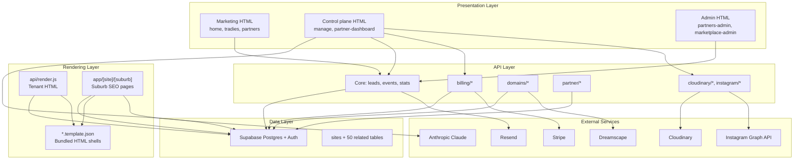

### Request taxonomy

| Traffic type | Entry | Handler |
|--------------|-------|---------|
| Marketing homepage | `leadpages.com.au/` | `home.html` (host-gated rewrite) |
| Platform app pages | `/manage`, `/billing`, etc. | Static HTML via `vercel.json` |
| Tenant site (slug) | `/{slug}`, `/s/{slug}` | `api/render.js` |
| Tenant site (custom domain) | `https://client.com.au/` | `api/render.js` (Host header lookup) |
| Tenant sub-page | `/{slug}/{page}` | `api/render.js` (`config.pages`) |
| Local SEO suburb page | `/{site}/{suburb}` | `app/[site]/[suburb]/route.js` |
| SEO sitemap | `/seo-sitemap.xml` | `app/seo-sitemap.xml/route.js` (index → live `/{slug}/sitemap.xml`) |
| Partner showcase | `{slug}.leadpages.com.au` | `api/render.js` (showcase mode) |
| API / webhooks | `/api/*` | Matching `api/**/*.js` function |

**Cross-reference:** Partner showcase and billing suspension behaviour are detailed in [05-PARTNERS](05-PARTNERS.md) and [02-DATABASE](02-DATABASE.md).

---

## 3. Technology Stack

| Layer | Technology | Version / notes |
|-------|------------|-----------------|
| **Hosting & compute** | Vercel | Serverless functions, rewrites, cron, CDN |
| **Primary UI** | Static HTML + vanilla JS | No bundler for `manage.html` |
| **SEO routes** | Next.js App Router | `app/[site]/[suburb]`, `app/seo-sitemap.xml` |
| **Database** | Supabase (PostgreSQL) | ~51 tables; JSONB `config` |
| **Auth** | Supabase Auth | OTP, password, magic link |
| **Payments** | Stripe REST API | No Stripe SDK; raw fetch in `_stripe.js` |
| **Domains** | Dreamscape reseller API | Signed requests via `dreamscape.js` |
| **Images** | Cloudinary | Signed direct browser uploads |
| **Email** | Resend | Leads, campaigns, notifications |
| **AI** | Anthropic Claude API | Assist, trade generation, suburb intros |
| **Social** | Instagram Graph API | Per-site project feed |
| **Runtime dependency** | `@supabase/supabase-js` ^2.45 | Only npm dependency in `package.json` |

### Why not a unified framework?

LeadPages predates and outgrew a typical Next.js monolith. The current split optimises for:

- **Deploy speed** — edit `manage.html`, push, live in minutes
- **Tenant render performance** — one cold-started function, bundled templates
- **Partner operability** — operators can reason about "an HTML file and an API folder"
- **Risk containment** — billing/domain/partner logic changes do not require rebuilding a SPA

See [13-ROADMAP](13-ROADMAP.md) for planned modularisation without a full rewrite.

---

## 4. Repository Structure

```
/workspace
├── *.html                    # Platform UI (manage, billing, partners, marketing)
├── *.template.json           # Tenant HTML templates (trade, broker, agency, broker-app)
├── vercel.json               # Rewrites + cron — routing source of truth
├── package.json              # Minimal Node deps
├── CLAUDE.md / AGENTS.md     # AI agent instructions
├── dreamscape.js             # Dreamscape API client (not a route)
├── events.js / stats.js      # Client-side analytics helpers for tenant pages
├── icons.js                  # Shared SVG icon definitions
│
├── api/                      # Vercel serverless functions (~70 routes)
│   ├── render.js             # Central tenant renderer
│   ├── leads.js / events.js  # Public visitor endpoints
│   ├── billing/              # Stripe subscriptions, contra, cron
│   ├── domains/              # Dreamscape integration
│   ├── partner/              # Partner dashboard APIs
│   ├── cloudinary/           # Signed uploads
│   ├── instagram/            # OAuth + token storage
│   ├── cron/                 # Scheduled workers
│   └── site/                 # Site-scoped helpers
│
├── app/                      # Next.js App Router (SEO only)
│   ├── [site]/[suburb]/route.js
│   └── seo-sitemap.xml/route.js
│
├── lib/
│   ├── seo/                  # Suburb page generation (store, tokens, template, intro)
│   └── ig/                   # Instagram sync workers
│
├── db/                       # Versioned SQL migrations (partial)
│   ├── suburb_intros.sql
│   └── instagram_schema.sql
│
├── marketplace/demos/        # Marketplace feature HTML demos
├── docs/                     # Engineering canon (00–13)
└── playground/               # Non-production experiments
```

---

## 5. Request Lifecycle

### 5.1 Tenant page request (primary path)

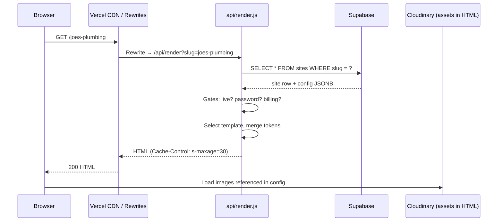

### 5.2 Editor save request

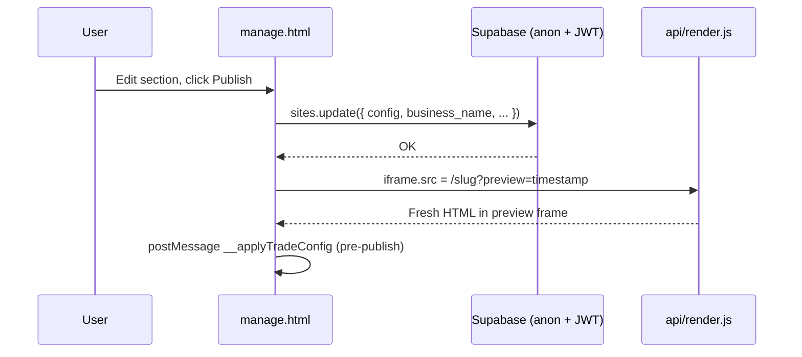

### 5.3 Lead capture request

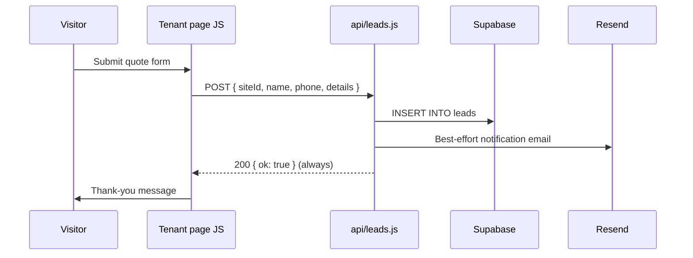

**Why always-200 on leads:** A backend failure must never tell a prospective customer their enquiry failed. Storage is prioritised; email is best-effort. See [09-CRM](09-CRM.md).

---

## 6. Rendering Pipeline

`api/render.js` is the **central tenant renderer**. It is invoked by Vercel rewrites for slug paths, custom domains, and legacy `/s/:slug` URLs.

### 6.1 Resolution order

1. **Partner showcase subdomain** — `{showcase_slug}.leadpages.com.au` → showcase HTML (not a `sites` row).
2. **Primary host guard** — `/` on `leadpages.com.au` redirects to static homepage; never serves a tenant.
3. **Site lookup:**
   - Custom domain → `sites.custom_domain = Host` (path segment becomes sub-page).
   - Slug path → `sites.slug = slug`.
4. **Fallback** — If no site: try partner showcase by domain or path slug; else 404.
5. **Gates** — Live status, preview password, billing suspension.
6. **Template branch** — `broker-app`, `is_partner_home` (agency), or token template (`trade` / `broker-leads`).
7. **Response** — `sendHtml()` with cache headers.

### 6.2 Gate logic

| Gate | Condition | Behaviour | Why |
|------|-----------|-----------|-----|
| **Draft hidden** | `status !== 'live'` and no `?preview=1` | 404 | Partner mockups must not leak on clean URLs |
| **Preview password** | `preview_password` set | Cookie gate (SHA1) or form | Per-prospect demo isolation |
| **Billing suspended** | `billing_status` in `suspended`, `flagged_deletion` | 503 system page from `system_pages` | Hosting enforcement without data loss |
| **Demo buy bar** | `is_mockup` + sale price | Injects Stripe CTA before `</body>` | Closes partner sales loop |

### 6.3 Caching headers (`sendHtml`)

| Site state | `Cache-Control` | `X-Robots-Tag` |
|------------|-----------------|----------------|
| Live | `public, s-maxage=900, stale-while-revalidate=3600` + `Vercel-Cache-Tag: lp-site-{slug},lp-siteid-{uuid}` | (template default) |
| Draft / preview | `no-store` | `noindex, nofollow` |
| Suspended | `no-store` | `noindex` + `retry-after: 86400` |

**Why 15 minutes for live tenants:** Long enough for CDN to absorb most traffic without re-running `api/render.js` on every hit. **Publish** calls `POST /api/purge-site-cache`, which invalidates the site’s cache tags so visitors still see updates within seconds. Without `VERCEL_TOKEN` + `VERCEL_PROJECT_ID`, purge soft-skips and content falls back to the 15-minute TTL. Suburb pages use 24h cache because AI intros are expensive and geographically stable — see [08-SEO](08-SEO.md).

### 6.3.1 Capacity band (current architecture)

| Band | Guidance |
|------|----------|
| **Hundreds of live sites** | Smooth with CDN tags + purge-on-publish |
| **~1–2k sites** | Stretch target with Supabase plan sizing + event archival |
| **10k+** | Needs stronger write-side controls (rate limits, aggregation) and domain ops hygiene — not blocked by “one project per site” |

Site *count* is cheap (one `sites` row each). Shared Postgres writes (`events`/`leads`) and custom-domain quotas bind first — mitigated early with soft IP rate limits on `/api/events` and `/api/leads`, plus soft Vercel domain-capacity awareness via `GET /api/domain-quota` (super-admin hint under Custom domain; never blocks `custom_domain` saves).

### 6.4 Sub-page routing

`/:slug/:page` resolves against `config.pages[]` where `status === 'published'`. Unpublished or unknown slugs return **hard 404** (no soft-404 SEO).

### 6.5 Parallel path: App Router suburb pages

`app/[site]/[suburb]/route.js` is a **separate rendering pipeline** for local SEO:

- Validates suburb against `config.sections.serviceAreas.areas` — prevents doorway pages.
- Generates unique AI intro via `getOrCreateIntro()` → cached in `suburb_intros`.
- Server-side SEO head injection (title, description, canonical, OG tags).
- Uses `{single-brace}` tokens (`{suburb}`, `{trade}`) distinct from render.js `{{double-brace}}` tokens.

**Routing collision risk:** Both `vercel.json` `/:slug/:page` and App Router `/{site}/{suburb}` match two-segment URLs. On Vercel, App Router filesystem routes typically take precedence, so `/joes-plumbing/belconnen` likely hits the suburb route while `/joes-plumbing/my-landing-page` hits `api/render` if published in `config.pages`.

---

## 7. Site Builder Architecture

The production editor is **`manage.html`** (~5,400 lines) — a single-page application using Supabase Auth and direct Postgres access via the anon key + user JWT.

### 7.1 Why `manage.html` is monolithic

The editor grew organically to support trade, broker-leads, and broker-app templates, plus analytics, domains, mailer, backups, marketplace apps, and billing — all in one operational surface. Extracting to a framework is a [13-ROADMAP](13-ROADMAP.md) item; until then, the monolith is the **control plane**.

### 7.2 Boot sequence

1. Initialise Supabase client (`window.__LP` URL + anon key).
2. `bootAuth()` — magic link, session check, or login form.
3. `afterLogin()` — load `profiles.is_super_admin`, fetch sites, apply role gating.
4. Route to site switcher (multi-site) or straight into editor (single-site client).

### 7.3 Role matrix

| Role | Source | Capabilities |
|------|--------|--------------|
| **super** | `profiles.is_super_admin` | All sites, billing admin, demo flags, delete, service packs |
| **broker** | Default authenticated user | Partner-scoped sites; calculator rates |
| **leads** | Legacy demo role | Calculator rates only |

Template-specific nav is enforced via `TEMPLATE_NAV` — trade sites see Dashboard/Details/Landing/Apps/Mailer; broker-app sees calculator-focused tabs.

### 7.4 Save model

| Layer | Function | When | Target |
|-------|----------|------|--------|
| **Local** | `persist()` | Every field change | `localStorage` |
| **Autosave** | `lpAutosave()` → `lpSaveDB()` | SEO landing page fields (1s debounce) | `sites.config.pages` subset |
| **Publish** | `publishToDB()` | User clicks Publish | Full `sites` row |

**Why explicit publish for trade sites:** Prevents half-edited sections reaching live visitors. Broker-app SEO pages autosave because they are lower-risk sub-pages within an already-live calculator suite.

### 7.5 Live preview

Preview iframe loads `/{slug}?preview={timestamp}` — the **same render path** as production, with `?preview=1` bypassing the live-only gate. Before publish, `previewApply()` calls `__applyTradeConfig(data)` inside the iframe for instant WYSIWYG.

### 7.6 Integrated subsystems in the editor

| Tab / panel | Data source | API |
|-------------|-------------|-----|
| Analytics | `events`, `leads` | `/api/stats` (Bearer) |
| Domains | `domains`, `custom_domain` | Links to `/manage-domains.html` |
| Mailer | `leads`, `email_campaigns` | `/api/send-campaign` |
| Backups | `site_backups` | Direct Supabase |
| Billing | `sites.billing_status` | `/api/billing/*` |
| Marketplace apps | `site_apps`, `app_registry` | `/api/api-apps`, `/api/api-site-apps` |
| Images | Cloudinary | `/api/cloudinary/sign` |

**Cross-reference:** Full editor UX patterns in [10-EDITOR](10-EDITOR.md) and [04-SITE-BUILDER](04-SITE-BUILDER.md).

### 7.7 Legacy builder

`builder.html` + `api/create-site.js` remain for password-gated admin site creation. `manage.html` supersedes this with in-editor site creation, trade packs, and Supabase session auth.

---

## 8. Template Engine

Templates are **JSON files containing a single `html` string** — not React components.

| File | Template key | Use case |
|------|--------------|----------|
| `trade.template.json` | `trade` | Tradies & service businesses |
| `broker.template.json` | `broker-leads` | Mortgage broker landing pages |
| `brokerapp.template.json` | `broker-app` | Calculator suite mini-sites |
| `agency.template.json` | — | Partner homepage (`is_partner_home`) |

### 8.1 Server-side injection (render.js)

1. `require()` bundles templates at deploy — **zero per-request fetch**.
2. Replace `__SITE_CONFIG__` with `safeJson(config)` (escapes `<` to prevent `</script>` breakout).
3. Replace `{{businessName}}`, `{{phone}}`, `{{pageTitle}}`, `{{pageDesc}}`, `{{favicon}}`, etc.
4. Client-side `window.__applyTradeConfig(cfg)` hydrates all sections from config.

### 8.2 Client-side hydration

The template HTML embeds section markers (`data-sec="hero"`, `data-sec="services"`, etc.). JavaScript reads `config.sections`, `config.sectionOrder`, and list fields (`reviews`, `crew`, `badges`) to show/hide and populate content.

**Why hydration:** Keeps the template shell stable across 100+ trade packs while allowing rich per-site customisation without server-side rendering of every section variant.

### 8.3 Broker-app variant

Injects `__BROKERAPP_CONFIG__` as JSON. Calculator states, appearance, and page routing are entirely config-driven. Demo bar supports theme switching for sales demos.

### 8.4 Token systems (important distinction)

| System | Syntax | Used by |
|--------|--------|---------|
| Tenant shell tokens | `{{businessName}}`, `{{pageTitle}}` | `api/render.js` |
| Local SEO tokens | `{suburb}`, `{trade}`, `{business}` | `lib/seo/tokens.js`, suburb pages |

Do not mix these syntaxes when adding new features.

**Cross-reference:** [03-TEMPLATE-SYSTEM](03-TEMPLATE-SYSTEM.md)

---

## 9. Authentication Flow

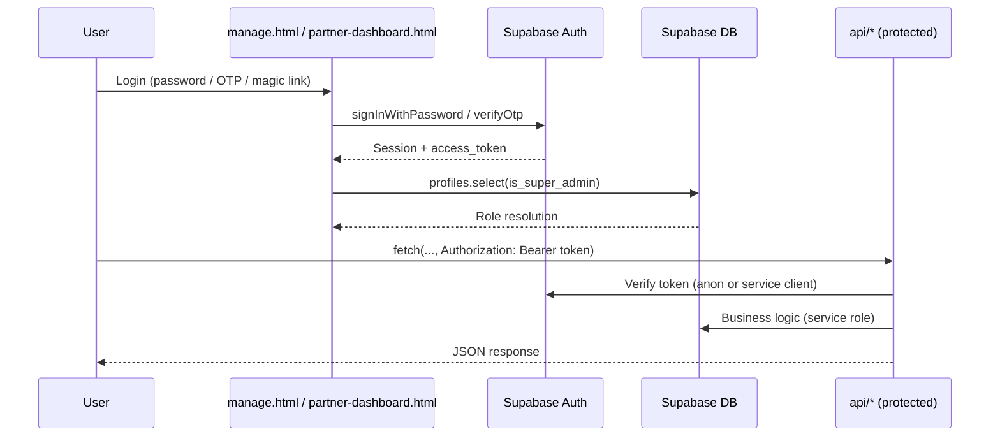

### 9.1 Auth mechanisms in use

| Mechanism | Where | Purpose |
|-----------|-------|---------|
| **Supabase Bearer session** | Most protected APIs, Cloudinary, billing | Caller identity |
| **`profiles.is_super_admin`** | Domains admin, system-pages, assist | Database super-admin |
| **`SUPER_ADMIN_EMAILS` env** | `billing/*` admin actions | Billing operator allowlist |
| **`ADMIN_PASSWORD` body field** | `create-site.js`, `admin-data.js` | Legacy admin gate |
| **`CRON_SECRET` Bearer** | `billing/cron.js`, `cron/send-due.js` | Scheduled job auth |
| **Stripe webhook HMAC** | `billing/webhook.js`, `domains/webhook.js` | Payment event verification |
| **Preview password + cookie** | `api/render.js` | Per-demo access control |

### 9.2 Why service role on the server

Nearly every `api/*.js` file creates a Supabase client with `SUPABASE_SERVICE_ROLE_KEY`. This bypasses Row Level Security so that:

- Public visitors can submit leads without accounts.
- The renderer can read any live site.
- Webhooks can update billing state atomically.

**Caller auth is enforced per-endpoint**, not via RLS. This is a deliberate trade-off: simpler serverless functions, but each new endpoint must implement its own authorization checks.

### 9.3 Known auth gaps (technical debt)

| Endpoint | Issue |
|----------|-------|
| `api/api-site-apps.js` | No Bearer check in handler |
| `api/api-partner-templates.js` | No Bearer check in handler |
| `api/api-apps.js?all=1` | Exposes draft apps without auth |

See §22 Risks.

---

## 10. Supabase Architecture

### 10.1 Central model

```
sites (1 row = 1 tenant website)
  ├── config JSONB     ← 90% of editable content
  ├── slug             ← leadpages.com.au/{slug}
  ├── custom_domain    ← client's own domain
  ├── template         ← trade | broker-leads | broker-app
  ├── status           ← live | draft
  ├── billing_status   ← active | suspended | flagged_deletion
  ├── owner_user_id    ← Supabase Auth user
  └── partner fields   ← servicing_partner_id, referring_partner_id, ...
```

### 10.2 Table domains (~51 tables)

| Domain | Tables | Doc |
|--------|--------|-----|
| Core | `sites`, `profiles`, `site_backups`, `system_pages`, `service_packs`, `demo_themes`, `suburb_intros` | [02-DATABASE](02-DATABASE.md) |
| CRM | `leads`, `events`, `email_campaigns`, `campaign_recipients`, `email_optouts`, `conversations`, `messages`, `wiki_articles` | [09-CRM](09-CRM.md) |
| Partners | `partners`, `partner_profiles`, `partner_quotes`, `partner_commissions`, `partner_directory`, … | [05-PARTNERS](05-PARTNERS.md) |
| Billing | `billing_plans`, `billing_customers`, `site_app_subscriptions`, `contra_accounts`, `contra_ledger` | [02-DATABASE](02-DATABASE.md) |
| Domains | `domains`, `domain_orders`, `domain_pricing`, `domain_registrants`, `domain_events` | [06-DOMAINS](06-DOMAINS.md) |
| Marketplace | `catalog_*`, `app_registry`, `app_schemas`, `site_apps` | [04-SITE-BUILDER](04-SITE-BUILDER.md) |
| Integrations | `ig_connections` | [db/instagram_schema.sql](../db/instagram_schema.sql) |

### 10.3 Versioned migrations

Only two SQL files live in-repo:

- `db/suburb_intros.sql` — AI intro cache for suburb pages
- `db/instagram_schema.sql` — per-site Instagram tokens (RLS enabled, no policies = service-role only)

Other schema changes are applied directly in the Supabase SQL editor. **Risk:** drift between environments. Future improvement: full migration history in `db/`.

### 10.4 Access patterns

| Client | Key | Used by |
|--------|-----|---------|
| Browser (editor) | Anon key + user JWT | `manage.html`, partner dashboards |
| Serverless | Service role key | All `api/*.js`, `lib/seo/store.js` |
| App Router | Service role via REST fetch | `lib/seo/store.js` (no SDK) |

---

## 11. API Layer

~70 Vercel serverless routes under `api/`. Files prefixed with `_` (`_stripe.js`, `_accrual.js`) are **shared modules**, not routes.

### 11.1 Organisation

| Group | Routes | Auth model |
|-------|--------|------------|
| **Core tenant** | `render`, `leads`, `events`, `ig-media`, `site/support-contact` | Public |
| **Client dashboard** | `stats`, `send-campaign`, `unsubscribe`, `notify-message`, `assist` | Bearer session |
| **Legacy admin** | `create-site`, `admin-data` | `ADMIN_PASSWORD` |
| **Partner** | `partner/*`, `partner-directory*`, `partner-onboarding`, `partner-apply` | Bearer + active partner (or public for buy-site, quote-get) |
| **Billing** | `billing/*` | Bearer + owner or `SUPER_ADMIN_EMAILS`; webhooks use Stripe sig |
| **Domains** | `domains/*` | Bearer + owner; super-admin elevated; `availability` public |
| **Marketplace** | `catalog`, `api-apps`, `api-site-apps*` | Mostly public reads |
| **Cloudinary** | `cloudinary/sign`, `delete`, `diag` | Bearer session |
| **Instagram** | `instagram/*` | OAuth flow; `save-token` origin-gated |
| **Cron** | `billing/cron`, `cron/send-due` | `CRON_SECRET` |
| **AI / content** | `api-trade-generate`, `api-trade-stats`, `assist` | Mixed |

### 11.2 Response conventions

| Pattern | Example endpoints |
|---------|-------------------|
| `{ ok: true, ... }` | Most JSON APIs |
| `{ error: '...' }` with 4xx/5xx | Auth failures, validation |
| Always `200` for visitors | `leads.js`, `events.js` |
| Raw HTML | `render.js`, `instagram/callback.js` |

### 11.3 Webhook flows

**Stripe billing webhook** (`billing/webhook.js`):

- `checkout.session.completed` → activate site, set plan, create auth user for self-signup
- `invoice.payment_succeeded/failed` → update `billing_status`
- `customer.subscription.updated/deleted` → sync subscription state
- Partner commissions inserted into `partner_commissions`

**Stripe domains webhook** (`domains/webhook.js`):

- Fulfils paid domain orders via Dreamscape registration API

---

## 12. Vercel Routing

`vercel.json` is the **routing source of truth**.

### 12.1 Static page rewrites

Platform HTML pages are served via clean URLs:

| URL | File |
|-----|------|
| `/manage` | `manage.html` |
| `/partner-dashboard` | `partner-dashboard.html` |
| `/billing` | `billing.html` |
| `/domains` | `domains.html` |
| `/marketplace` | `marketplace.html` |
| `/partners-admin` | `partners-admin.html` |
| … | (see `vercel.json` for full list) |

### 12.2 Tenant rewrites

| Pattern | Destination |
|---------|-------------|
| `/` (leadpages hosts) | `home.html` |
| `/` (other hosts) | `/api/render` |
| `/s/:slug` | `/api/render?slug=:slug` |
| `/:slug` | `/api/render?slug=:slug` |
| `/:slug/:page` | `/api/render?slug=:slug&page=:page` |

### 12.3 Cron

| Path | Schedule | Purpose |
|------|----------|---------|
| `/api/billing/cron` | `0 3 * * *` (daily 03:00 UTC) | Contra accrual; flag 90-day suspended sites |
| `/api/cron/events-rollup` | `15 4 * * *` (daily 04:15 UTC) | Roll raw `events` older than ~90 days into `event_daily`, then delete |

`cron/send-due.js` exists for email campaigns but is **not** registered in `vercel.json` — may require manual cron setup or external trigger.

**Events retention:** apply `db/event_daily.sql` in Supabase once. Override keep window with `EVENTS_RAW_KEEP_DAYS` (default 90, minimum 14). `/api/stats` merges `event_daily` + recent raw rows so dashboards keep long-range totals.

### 12.4 Environment variables

Set in Vercel project settings (never committed):

| Category | Examples |
|----------|----------|
| Supabase | `SUPABASE_URL`, `SUPABASE_ANON_KEY`, `SUPABASE_SERVICE_ROLE_KEY` |
| Stripe | `STRIPE_SECRET_KEY`, `STRIPE_BILLING_WEBHOOK_SECRET`, `STRIPE_WEBHOOK_SECRET` |
| Dreamscape | `DREAMSCAPE_API_TOKEN`, `DREAMSCAPE_RESELLER_ID` |
| Cloudinary | `CLOUDINARY_CLOUD_NAME`, `CLOUDINARY_API_KEY`, `CLOUDINARY_API_SECRET` |
| Email | `RESEND_API_KEY`, `LEADS_FROM` |
| AI | `ANTHROPIC_API_KEY` |
| Instagram | `INSTAGRAM_APP_ID`, `INSTAGRAM_APP_SECRET` |
| Auth / ops | `SUPER_ADMIN_EMAILS`, `ADMIN_PASSWORD`, `CRON_SECRET`, `PRIMARY_HOSTS` |
| Vercel CDN purge | `VERCEL_TOKEN`, `VERCEL_PROJECT_ID` (or `VERCEL_PROJECT_ID_OR_NAME`), optional `VERCEL_TEAM_ID` |
| Vercel domain quota awareness | `VERCEL_DOMAIN_SOFT_LIMIT` (default 80; `0` off), `VERCEL_DOMAIN_HARD_LIMIT` (default 100; `0` off), optional `VERCEL_DOMAIN_QUOTA_CACHE_MS` |

---

## 13. Deployment Flow

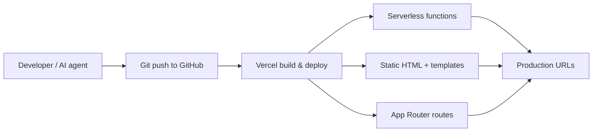

### 13.1 What deploys together

Every push to the connected branch deploys:

- All `api/*.js` serverless functions (cold start bundles include `*.template.json`)
- All root HTML files
- `app/` Next.js routes
- `vercel.json` rewrites

### 13.2 What does NOT deploy from git

- Supabase schema (manual SQL editor or future migrations)
- Vercel environment variables
- Stripe/Dreamscape/Cloudinary dashboard configuration
- DNS records for custom domains

### 13.3 Rollback

Vercel instant rollback to a prior deployment. Because `sites.config` lives in Supabase, **rolling back code does not roll back customer content**.

---

## 14. External Integrations

| Service | Role | Integration point | Failure mode |
|---------|------|-------------------|--------------|
| **Supabase** | Database, auth | All layers | Platform down — no sites, no editor |
| **Vercel** | Hosting, CDN, cron | All layers | Platform down |
| **Stripe** | Subscriptions, checkout | `api/billing/*`, webhooks | Billing out of sync; sites may suspend |
| **Dreamscape** | Domain search/register/DNS | `dreamscape.js`, `api/domains/*` | Domain purchase fails; existing domains may still resolve |
| **Cloudinary** | Image CDN | `api/cloudinary/*`, URLs in config | Upload fails; images may 404 |
| **Resend** | Transactional email | `api/leads.js`, `api/send-campaign.js` | Leads still stored; email notification missed |
| **Anthropic** | AI copy | `api/assist.js`, `lib/seo/suburbIntro.js`, `api-trade-generate.js` | Fallback template copy used |
| **Instagram** | Social feed | `api/instagram/*`, `lib/ig/*` | Gallery section empty |

### 14.1 Dreamscape client (`dreamscape.js`)

Server-only module implementing signed requests:

```
request_id = md5(unique)
signature  = md5(request_id + apiKey)
```

Exports domain registration, DNS management, email hosting products, pricing helpers, and balance evaluation. Not exposed as an HTTP route.

---

## 15. Caching Strategy

| Asset / response | TTL | Invalidation |
|------------------|-----|--------------|
| Live tenant HTML | `s-maxage=30`, SWR 300s | Natural expiry; publish visible within ~30s |
| Draft / preview HTML | `no-store` | N/A |
| Suburb SEO pages | `s-maxage=86400`, SWR 43200s | AI intro cached in DB; page stable |
| SEO sitemap XML | `s-maxage=86400` | Regenerated on request |
| Partner showcase | `s-maxage=5`, SWR 20s | Fresher for demo grids |
| Bundled templates | Deploy lifetime | New deploy |
| `suburb_intros` DB cache | Permanent per (site, suburb) | Manual delete or suburb rename |
| Cloudinary images | CDN default | URL change on re-upload |

**Why asymmetric TTLs:** Tenant pages change frequently during editing sessions; suburb pages are generated once per suburb and are expensive (Claude API call).

---

## 16. Security Model

### 16.1 Layers

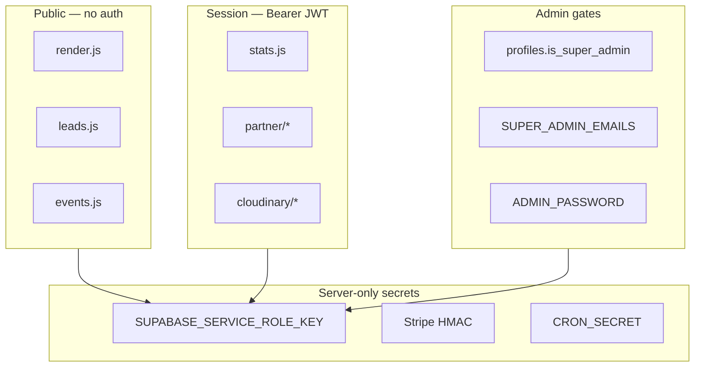

### 16.2 Principles

1. **Service role key never in browser** — only anon key in `manage.html`.
2. **Input sanitisation** — `esc()` on HTML tokens; `safeJson()` for script embedding.
3. **Webhook signature verification** — Stripe events rejected without valid HMAC.
4. **Origin checks** — light guards on `partner-lead.js`, `instagram/save-token.js`.
5. **Rate limiting** — IP-based on `domains/availability.js` (~12 req/10s).
6. **RLS on sensitive tables** — `ig_connections`, `suburb_intros` locked to service role.

### 16.3 Threat considerations

| Threat | Mitigation | Gap |
|--------|------------|-----|
| XSS in tenant content | Token escaping, `safeJson` | User-supplied HTML in some sections |
| Lead spam | Always-200 (no error feedback) | No CAPTCHA on forms |
| Unauthorized API access | Per-endpoint Bearer checks | Some endpoints missing checks |
| Service role key leak | Server-only env | Single key = full DB access |
| Partner data cross-access | Partner ID scoping in queries | Depends on correct query filters |

**Cross-reference:** [12-CODING-STANDARDS](12-CODING-STANDARDS.md)

---

## 17. Performance Strategy

| Technique | Where | Why |
|-----------|-------|-----|
| Bundled templates (`require`) | `api/render.js` | No S3/template fetch per request |
| CDN edge caching | Live tenant HTML (30s) | Reduce function invocations |
| `stale-while-revalidate` | All cached HTML | Serve stale fast while revalidating |
| Direct browser → Cloudinary upload | `manage.html` | Avoid funnelling images through serverless |
| Service role single query | `render.js` site lookup | One DB round-trip for full row |
| Suburb intro DB cache | `suburb_intros` | Avoid repeated Claude calls |
| `force-cache` template fetch | `lib/seo/template.js` | App Router path reuses CDN-cached template |
| Event batch limits | `stats.js` (10k–20k rows) | Cap query size for dashboard |

### 17.1 Cold start considerations

Serverless functions cold-start on first request after idle. `render.js` is large (bundled templates ~1MB+). Keeping one function for all tenant types avoids multiplying cold starts across template variants.

### 17.2 Client-side performance

Tenant templates use vanilla JS hydration — no React runtime on public pages. Analytics beacons (`events.js`) are lightweight POST payloads.

---

## 18. Folder-by-Folder Breakdown

| Folder / area | Responsibility |
|---------------|----------------|
| **`/` (root HTML)** | Platform UI — marketing, editor, admin dashboards, legal pages |
| **`/` (root templates)** | Tenant HTML shells bundled into `render.js` |
| **`api/`** | All serverless HTTP handlers |
| **`api/billing/`** | Stripe subscriptions, contra ledger, billing cron, suspended pages |
| **`api/domains/`** | Dreamscape domain lifecycle, DNS, pricing admin |
| **`api/partner/`** | Partner identity, customers, mockups, quotes, showcase |
| **`api/cloudinary/`** | Signed upload params, asset deletion, diagnostics |
| **`api/instagram/`** | OAuth relay, token exchange, save/disconnect |
| **`api/cron/`** | Scheduled email delivery, Instagram sync |
| **`api/site/`** | Site-scoped public helpers (support contact) |
| **`app/`** | Next.js App Router — suburb SEO pages and sitemap only |
| **`lib/seo/`** | Suburb page generation library (REST-based Supabase access) |
| **`lib/ig/`** | Instagram sync worker modules |
| **`db/`** | Versioned SQL for `suburb_intros` and `ig_connections` |
| **`marketplace/demos/`** | Static HTML demos for marketplace feature previews |
| **`docs/`** | Engineering documentation canon |
| **`playground/`** | Non-production experiments (not deployed) |

---

## 19. Important Files and Their Responsibilities

| File | Responsibility |
|------|----------------|
| **`api/render.js`** | Central tenant renderer — lookup, gates, templates, showcase, caching |
| **`manage.html`** | Primary site editor and operational command centre |
| **`partner-dashboard.html`** | Partner client management, mockups, showcase settings |
| **`vercel.json`** | URL rewrites and cron schedule |
| **`trade.template.json`** | Tradie landing page HTML shell + hydration JS |
| **`broker.template.json`** | Broker lead-gen landing page shell |
| **`brokerapp.template.json`** | Calculator suite shell |
| **`agency.template.json`** | Partner agency homepage shell |
| **`api/leads.js`** | Public lead capture — always returns 200 |
| **`api/events.js`** | Public analytics beacons |
| **`api/billing/webhook.js`** | Stripe subscription lifecycle + commissions |
| **`api/billing/_stripe.js`** | Shared Stripe REST helpers (not a route) |
| **`api/billing/cron.js`** | Daily contra accrual + suspension flagging |
| **`dreamscape.js`** | Dreamscape reseller API client |
| **`lib/seo/store.js`** | Supabase REST access for SEO routes |
| **`lib/seo/suburbIntro.js`** | AI intro generation with DB cache |
| **`app/[site]/[suburb]/route.js`** | Server-rendered suburb SEO pages |
| **`app/seo-sitemap.xml/route.js`** | Dynamic XML sitemap for suburb URLs |
| **`events.js`** | Client-side beacon helper embedded in tenant pages |
| **`CLAUDE.md`** | Non-negotiable rules for AI agents |

---

## 20. Data Flow Diagrams

### 20.1 Site publish flow

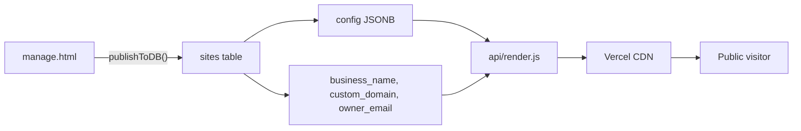

### 20.2 Partner commission flow

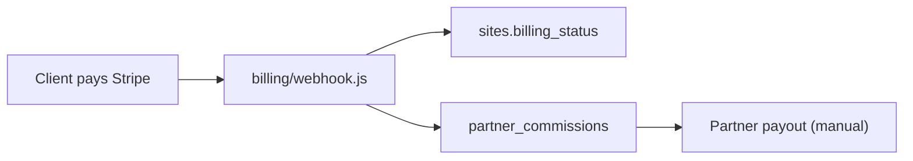

### 20.3 Domain purchase flow

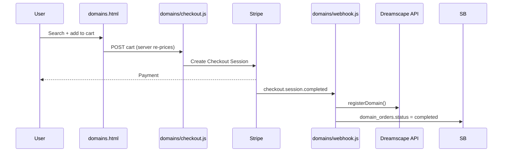

### 20.4 Marketplace app activation

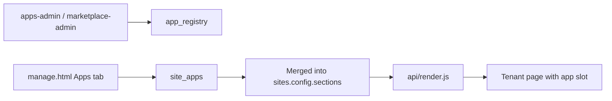

---

## 21. Mermaid Architecture Diagrams

### 21.1 Multi-tenant data model

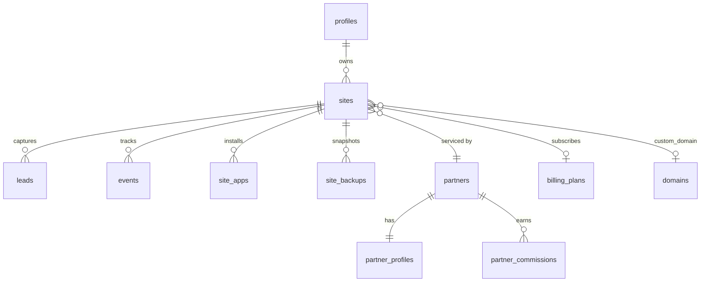

### 21.2 Rendering path decision

```mermaid
flowchart TD
  REQ[HTTP Request] --> HOST{Host type?}
  HOST -->|leadpages.com.au /| HOME[home.html]
  HOST -->|showcase subdomain| SC[Partner showcase]
  HOST -->|custom domain| CD[Lookup custom_domain]
  HOST -->|/{slug}| SL[Lookup slug]

  CD --> FOUND{Site found?}
  SL --> FOUND

  FOUND -->|no| FB[Showcase fallback or 404]
  FOUND -->|yes| GATE{Gates pass?}
  GATE -->|no| BLOCK[404 / 503 / password]
  GATE -->|yes| TPL{template}

  TPL -->|trade / broker-leads| TOK[Token template + hydration]
  TPL -->|broker-app| BA[Calculator config inject]
  TPL -->|is_partner_home| AG[Agency template]

  TOK --> OUT[HTML response]
  BA --> OUT
  AG --> OUT
  SC --> OUT
```

---

## 22. Risks and Technical Debt

| Risk | Severity | Description | Mitigation direction |
|------|----------|-------------|---------------------|
| **Monolithic `manage.html`** | Medium | 5,400-line single file; hard to test and refactor | Incremental extraction per [13-ROADMAP](13-ROADMAP.md) |
| **No central auth middleware** | High | Each API reimplements `getUser`; inconsistent | Shared `api/_auth.js` module |
| **Unprotected app APIs** | High | `api-site-apps.js`, `api-partner-templates.js` lack Bearer checks | Add session verification |
| **Dual admin model** | Medium | `is_super_admin` vs `SUPER_ADMIN_EMAILS` confuses operators | Unify admin gate |
| **Schema not fully versioned** | Medium | Most tables lack in-repo migrations | Expand `db/` migrations |
| **Routing collision** | Medium | `/:slug/:page` vs `/{site}/{suburb}` | Document precedence; consider explicit prefix |
| **Service role everywhere** | High | Key leak = full DB compromise | Secret rotation; least-privilege views |
| **Anon key in HTML** | Low | Expected for Supabase; relies on RLS | Audit RLS policies |
| **`cron/send-due` not in vercel.json** | Low | Scheduled campaigns may not fire | Register cron or document manual trigger |
| **Sitemap includes non-live sites** | Done | `/seo-sitemap.xml` is a live-only index of `/{slug}/sitemap.xml` |
| **Two token syntaxes** | Low | `{{}}` vs `{}` — developer confusion | Document (this file) and lint |
| **Legacy `ADMIN_PASSWORD`** | Medium | Shared secret in body | Migrate to Supabase admin role |

---

## 23. Future Architectural Improvements

Prioritised from [13-ROADMAP](13-ROADMAP.md) and codebase analysis:

| Improvement | Benefit | Risk if done carelessly |
|-------------|---------|-------------------------|
| **Shared auth module** (`api/_auth.js`) | Consistent security | Breaking existing auth flows |
| **Full `db/` migration history** | Reproducible environments | Migration ordering conflicts |
| **`.env.example`** | Onboarding for developers/agents | None |
| **Extract `manage.html` modules** | Maintainability | Regression in editor |
| **Filter sitemap by live status** | SEO quality | Missing legitimate pages |
| **Register `cron/send-due` in vercel.json** | Reliable campaign delivery | Duplicate sends if not idempotent |
| **Unified admin gate** | Simpler operations | Locking out billing admins |
| **Render path integration test** | Catch template regressions | CI setup on Vercel |
| **Config schema versioning** | Safe evolution of `sites.config` | Breaking old sites |
| **Rate limiting on public forms** | Spam reduction | Blocking legitimate leads |

**Explicit non-goals without approval:** Rewriting to React/Next.js monolith, replacing Supabase, changing `sites.config` root structure, removing partner/billing features.

---

## 24. Related Documentation

| Document | Relationship |
|----------|--------------|
| [00-VISION](00-VISION.md) | Product intent — read first |
| [02-DATABASE](02-DATABASE.md) | Full table reference and `config` schema |
| [03-TEMPLATE-SYSTEM](03-TEMPLATE-SYSTEM.md) | Template format, sections, hydration |
| [04-SITE-BUILDER](04-SITE-BUILDER.md) | `manage.html` deep dive |
| [05-PARTNERS](05-PARTNERS.md) | Partner program, showcase, commissions |
| [06-DOMAINS](06-DOMAINS.md) | Dreamscape integration detail |
| [07-TRACKING](07-TRACKING.md) | Events, analytics, stats API |
| [08-SEO](08-SEO.md) | Suburb pages, sitemaps, meta strategy |
| [09-CRM](09-CRM.md) | Leads, campaigns, messaging |
| [10-EDITOR](10-EDITOR.md) | Editor UX patterns |
| [11-DESIGN-SYSTEM](11-DESIGN-SYSTEM.md) | Visual language |
| [12-CODING-STANDARDS](12-CODING-STANDARDS.md) | Code conventions for changes |
| [13-ROADMAP](13-ROADMAP.md) | Planned improvements |
| [CLAUDE.md](../CLAUDE.md) | AI agent non-negotiable rules |
| [AGENTS.md](../AGENTS.md) | Agent workflow expectations |

---

## 25. Summary

LeadPages architecture is a **config-driven, serverless multi-tenant platform** built for speed, partner operability, and Australian small-business SEO.

**Five things every engineer must internalise:**

1. **`sites.config` is sacred** — one JSONB document holds almost all tenant content; never wipe unknown fields.
2. **`api/render.js` is the public face** — every slug, custom domain, and sub-page flows through it with explicit gates.
3. **`manage.html` is the control plane** — auth, editing, preview, analytics, billing, and ops live in one HTML file.
4. **The server trusts itself** — service role on all APIs; caller auth is per-endpoint, not RLS-driven.
5. **Evolution is incremental** — document first, extract modules second, rewrite never without approval.

When in doubt, read [00-VISION](00-VISION.md) for *why* a feature exists, then return to this document for *how* the platform is wired.

---

*Document maintained as part of the LeadPages engineering canon. Update this file when architecture changes — not when individual features ship.*
