# LeadPages — System Architecture

**Document:** `01-ARCHITECTURE`  
**Status:** Technical reference  
**Audience:** Engineers and operators  
**Prerequisite:** [`00-VISION.md`](./00-VISION.md)

---

## Preface

This chapter describes how LeadPages is built: where code lives, how requests move through the system, how tenant pages are rendered, and how Vercel, Supabase, and third-party services connect.

LeadPages is a **hybrid serverless application**. It is not a monolithic Next.js app. Most of the product is static HTML dashboards plus Vercel serverless functions (`api/*.js`). A small **Next.js App Router** slice (`app/`) handles programmatic local SEO. All persistent state lives in **Supabase** (Postgres + Auth).

---

## High-Level Architecture

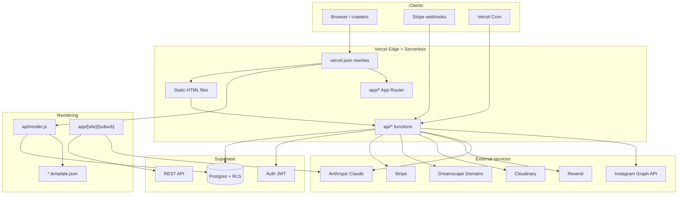

### Architectural characteristics

| Property | Implementation |
|----------|----------------|
| **Hosting** | Vercel (static assets + serverless functions + partial Next.js) |
| **Database** | Supabase Postgres |
| **Auth** | Supabase Auth (JWT access tokens) |
| **Tenant rendering** | Server-side HTML from `sites` row + JSON templates |
| **Admin UIs** | Vanilla JS in root-level `*.html` files |
| **Dependencies** | Minimal `package.json` — only `@supabase/supabase-js`; most integrations use `fetch` |
| **Module systems** | CommonJS in `api/`; ESM in `app/` and `lib/` |

---

## Folder Structure

```
/workspace/
│
├── docs/                          # Engineering documentation (this series)
│   ├── 00-VISION.md
│   └── 01-ARCHITECTURE.md
│
├── *.html                         # Marketing + admin single-page applications
│   ├── home.html                  # Marketing homepage
│   ├── manage.html                # App Command Centre (~5.4k lines)
│   ├── partner-dashboard.html     # Partner client management
│   ├── billing.html, domains.html # Owner self-service
│   ├── partners-admin.html        # Super-admin partner ops
│   ├── marketplace.html           # Feature catalogue
│   └── tradies.html, broker.html  # Vertical storefronts
│
├── *.template.json                # HTML shell templates (loaded by render.js)
│   ├── trade.template.json        # Tradie landing pages
│   ├── broker.template.json       # Broker lead-gen pages
│   ├── brokerapp.template.json    # Full broker calculator suite
│   └── agency.template.json       # Partner studio homepage
│
├── vercel.json                    # Rewrites, host rules, cron schedule
├── package.json                   # @supabase/supabase-js only
├── dreamscape.js                  # Dreamscape reseller API client
├── events.js, stats.js, icons.js  # Shared client utilities
│
├── api/                           # Vercel serverless functions (73 routes)
│   ├── render.js                  # ★ Central tenant page renderer
│   ├── leads.js, events.js        # Public ingestion (always 200)
│   ├── create-site.js             # Legacy password-gated site creation
│   ├── admin-data.js              # Legacy admin password gate
│   ├── assist.js                  # Help centre AI assistant
│   ├── catalog.js                 # Marketplace catalogue
│   │
│   ├── billing/                   # Stripe subscriptions
│   │   ├── _stripe.js             # Shared helpers (NOT a route — underscore prefix)
│   │   ├── _accrual.js            # Contra accrual logic
│   │   ├── checkout.js, portal.js, webhook.js, cron.js, …
│   │
│   ├── domains/                   # Dreamscape domain reseller
│   │   ├── availability.js, checkout.js, dns.js, webhook.js, …
│   │
│   ├── partner/                   # Partner-authenticated CRUD
│   │   ├── me.js, add-customer.js, buy-site.js, quote-create.js, …
│   │
│   ├── instagram/                 # OAuth + token exchange
│   ├── cloudinary/                # Signed upload URLs
│   ├── cron/                      # send-due, sync-instagram (manual/cron trigger)
│   └── api-*.js                   # Apps registry, trade generation, site-apps
│
├── app/                           # Next.js App Router (2 routes)
│   ├── [site]/[suburb]/route.js   # Per-suburb SEO landing pages
│   └── seo-sitemap.xml/route.js   # Dynamic suburb URL sitemap
│
├── lib/
│   ├── seo/                       # Suburb page generator (ESM)
│   │   ├── store.js               # Supabase REST access
│   │   ├── tokens.js              # Token merge, suburb lookup
│   │   ├── suburbIntro.js         # Claude AI intro + cache
│   │   └── template.js            # Template fetch + SSR injection
│   └── ig/                        # Instagram sync worker (ESM .mjs)
│       ├── store.mjs, igSync.mjs, instagramApi.mjs, enrich.mjs
│
├── db/                            # SQL migrations (partial — most schema external)
│   ├── suburb_intros.sql
│   └── instagram_schema.sql
│
├── marketplace/demos/             # Static demo HTML for marketplace features
└── playground/                    # Dev fixtures
```

### File naming conventions

| Pattern | Meaning |
|---------|---------|
| `api/billing/_*.js` | Shared modules; underscore prevents Vercel from exposing them as routes |
| `api/*.mjs` / `lib/**/*.mjs` | ESM modules (Instagram cron, sync workers) |
| `app/**/route.js` | Next.js App Router handlers (ESM `export`) |
| `api/api-*.js` | Platform registry endpoints (apps, templates, trade stats) |

---

## Request Lifecycle

Every inbound HTTP request passes through Vercel's edge, then `vercel.json` rewrites, then one of four handlers.

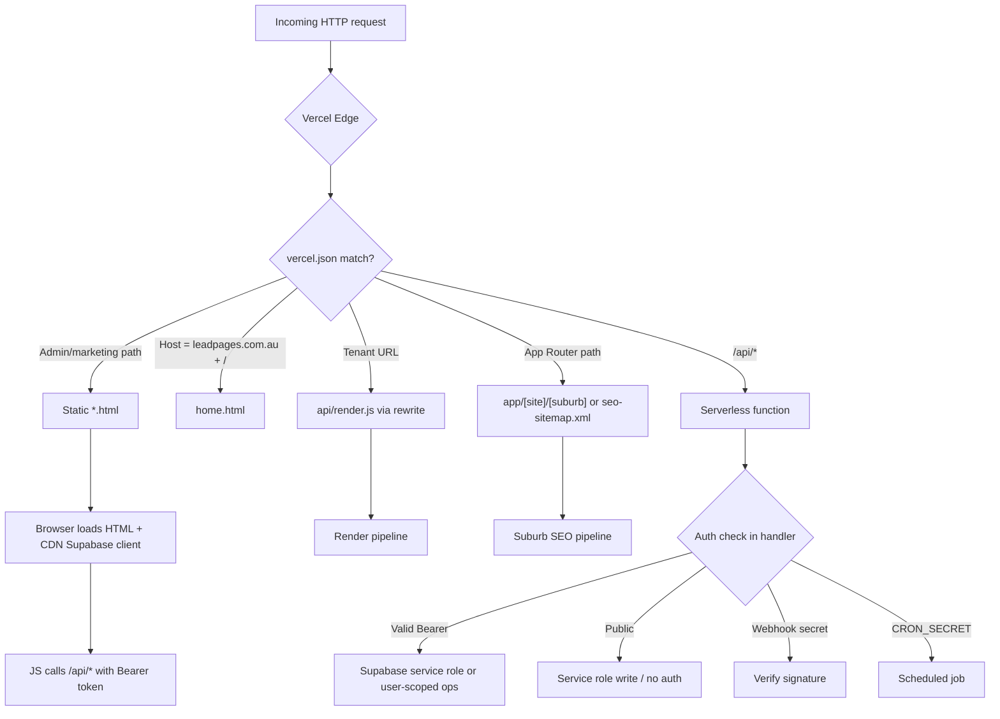

### Handler selection summary

| Request example | Handler |
|-----------------|---------|
| `GET /manage` | `manage.html` (rewrite) |
| `GET /` on `leadpages.com.au` | `home.html` (host-gated rewrite) |
| `GET /s/joes-plumbing` | `api/render.js?slug=joes-plumbing` |
| `GET /joes-plumbing` on custom domain | `api/render.js` (lookup by Host) |
| `GET /joes-plumbing/belconnen` | **Conflict zone** — see [Routing tension](#routing-tension) |
| `GET /api/leads` | `api/leads.js` |
| `POST /api/billing/checkout` | `api/billing/checkout.js` |
| `GET /seo-sitemap.xml` | `app/seo-sitemap.xml/route.js` |

### Routing tension

`vercel.json` rewrites `/:slug/:page` to `api/render?slug=:slug&page=:page` for **published landing pages** stored in `config.pages[]`. The App Router route `app/[site]/[suburb]/route.js` handles **suburb SEO pages** at the same URL shape (`/{site}/{suburb}`).

On Vercel, App Router routes typically take precedence over rewrites for matching paths. In practice:

- `/{slug}/{published-page-slug}` → intended for `api/render.js` sub-page routing
- `/{site}/{suburb-slug}` → intended for App Router suburb SEO

Both systems compete for two-segment URLs. Production behaviour should be verified when adding new page types.

---

## Render Lifecycle

`api/render.js` is the central rendering engine for tenant sites, partner showcases, and agency homepages.

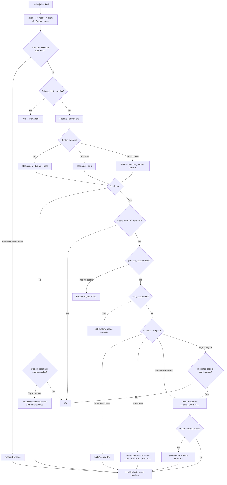

### Site resolution rules

From `api/render.js`:

1. **Showcase subdomain** — `{slug}.leadpages.com.au` → partner showcase or agency home
2. **Primary marketing host** — `/` on `leadpages.com.au` never serves a tenant; redirects to static homepage
3. **Custom domain** — `sites.custom_domain` matches `Host` (www stripped); path segment is a **page slug**
4. **Platform slug** — `?slug=` or `/s/:slug` rewrite → `sites.slug`
5. **Fallback** — unknown slug on primary host may resolve to partner showcase by slug

### Gates before HTML is produced

| Gate | Condition | Response |
|------|-----------|----------|
| **Not found** | No matching site | 404 HTML |
| **Draft** | `status !== 'live'` and no `?preview=` | 404 |
| **Preview password** | `preview_password` set, cookie missing | Password form (`demoGateHtml`) |
| **Suspended** | `billing_status` in `suspended`, `flagged_deletion` | 503 + `system_pages` content |
| **Sub-page** | `?page=` set but no published `config.pages[]` match | 404 |

### Cache policy (`sendHtml`)

| Site state | `Cache-Control` | Indexing |
|------------|-----------------|----------|
| Live | `public, s-maxage=30, stale-while-revalidate=300` | Normal |
| Preview / draft | `no-store` | `X-Robots-Tag: noindex, nofollow` |

---

## Rendering Engine

The rendering engine has **three distinct strategies**, selected by `sites.template` (with fallback from `sites.vertical`).

### Template routing

```javascript
// api/render.js
function templateFor(site) {
  if (site.template) return site.template;
  return site.vertical === 'trade' ? 'trade' : 'broker-leads';
}
```

| `template` value | Source file | Mechanism |
|------------------|-------------|-----------|
| `trade` | `trade.template.json` | Token substitution + `__SITE_CONFIG__` |
| `broker-leads` | `broker.template.json` | Token substitution + `__SITE_CONFIG__` |
| `broker-app` | `brokerapp.template.json` | `__BROKERAPP_CONFIG__` JSON injection |
| Partner home (`is_partner_home`) | `agency.template.json` | `buildAgencyHtml()` server assembly |
| Showcase (no tenant site) | Inline HTML in `render.js` | `showcaseHtml()` / `buildAgencyHtml()` |

### Strategy A — Token templates

Used for `trade` and `broker-leads`:

1. Merge `site.config` with `{ business, slug, siteId }`
2. Replace `__SITE_CONFIG__` with JSON-safe embedded config (prevents `</script>` breakout via `safeJson`)
3. Replace `{{businessName}}`, `{{phone}}`, `{{domain}}`, `{{pageTitle}}`, etc.
4. Client-side hydration via `window.__applyTradeConfig(cfg)` (live preview in `/manage` calls the same function in an iframe)

### Strategy B — Broker app

Full calculator mini-site:

1. Merge config with business metadata
2. Replace `__BROKERAPP_CONFIG__` in `brokerapp.template.json`
3. Optional `<!--DEMO_BAR-->` injection for theme switcher on demo sites
4. Demo themes loaded from `demo_themes` table when `site.slug === 'demo'`

### Strategy C — Agency / partner home

`buildAgencyHtml()` fills `agency.template.json` placeholders (`{{STUDIO}}`, `{{HERO_TITLE}}`, `{{SERVICES}}`, `{{WORK}}`, etc.) and embeds partner demo cards from mockup sites.

### Strategy D — Suburb SEO (parallel path)

`app/[site]/[suburb]/route.js` does **not** use `api/render.js`. It:

1. Loads `sites.config` via `lib/seo/store.js`
2. Validates suburb against `config.sections.serviceAreas.areas` (`findSuburb` — 404 if not served)
3. Builds token map (`lib/seo/tokens.js`)
4. Gets or creates AI intro (`lib/seo/suburbIntro.js` → `suburb_intros` table)
5. Fetches trade template from `SEO_TEMPLATE_URL`
6. Server-injects SEO head, hero, and bootstrap script (`lib/seo/template.js`)
7. Returns HTML with `Cache-Control: public, s-maxage=86400`

---

## Authentication

LeadPages has **no application-level middleware**. Every serverless function enforces auth at its entry point.

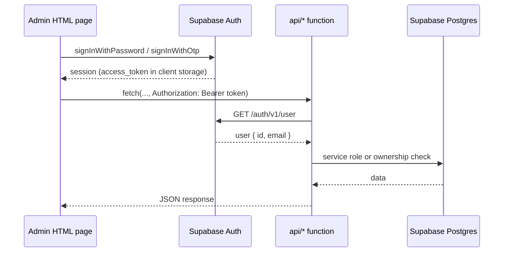

### Auth mechanisms by actor

| Actor | Client auth | API validation | Privilege source |
|-------|-------------|----------------|------------------|
| **Public visitor** | None | N/A | Public endpoints only |
| **Site owner** | Supabase session in `/manage` | `GET /auth/v1/user` | `sites.owner_user_id`, RLS on direct reads |
| **Partner** | Supabase session in `/partner-dashboard` | Bearer + `partners.user_id` + `status = active` | Partner tables |
| **Super admin (DB)** | Supabase session | `profiles.is_super_admin` | UI gates, some APIs |
| **Super admin (env)** | Supabase session | `SUPER_ADMIN_EMAILS` allowlist | Billing admin, owner linking |
| **Legacy admin** | `ADMIN_PASSWORD` in POST body | String compare | `create-site.js`, `admin-data.js` |
| **Cron** | `CRON_SECRET` Bearer or `?key=` | Header/query match | `billing/cron.js`, `cron/send-due.js` |
| **Stripe** | Webhook signature | HMAC verify | `billing/webhook.js`, `domains/webhook.js` |
| **Preview gate** | HttpOnly cookie `lp_pw_{slug}` | SHA1 hash of password+slug | `api/render.js` only |

### Shared `getUser` pattern

Most protected APIs duplicate this pattern (centralised in `api/billing/_stripe.js`):

```javascript
async function getUser(req) {
  const token = String(req.headers.authorization || '').replace(/^Bearer\s+/i, '');
  if (!token) return null;
  const r = await fetch(process.env.SUPABASE_URL + '/auth/v1/user', {
    headers: { apikey: process.env.SUPABASE_ANON_KEY, Authorization: 'Bearer ' + token },
  });
  if (!r.ok) return null;
  return await r.json();
}
```

The access token is a Supabase-issued JWT, but the application **never decodes it locally** — validation is delegated to Supabase Auth.

### Partner claim flow

`api/partner/me.js` implements email-based partner claiming: if a partner row exists with matching email but `user_id` is null, the first authenticated login stamps `partners.user_id` — mirroring how `api/billing/owner.js` links `sites.owner_user_id`.

### Browser credential embedding

Admin HTML pages embed Supabase project URL and anon key in `window.__LP` and load the Supabase UMD client from CDN. Security relies on **Row Level Security** for client-side reads and **service role** for server-side privileged operations.

---

## Serverless Architecture

### Function inventory by domain

| Domain | Path prefix | Auth model | Key responsibility |
|--------|-------------|------------|-------------------|
| **Rendering** | `render.js` | Public (+ preview cookie) | Tenant HTML |
| **CRM** | `leads.js`, `events.js`, `stats.js` | Public ingest / Bearer read | Leads and analytics |
| **Billing** | `billing/*` | Bearer + ownership / admin | Stripe subscriptions |
| **Domains** | `domains/*` | Bearer / webhook / diag key | Dreamscape reseller |
| **Partners** | `partner/*`, `partner-*.js` | Bearer + active partner | Partner CRUD, quotes, buy flow |
| **Media** | `cloudinary/*` | Bearer | Signed uploads |
| **Instagram** | `instagram/*`, `ig-media.js` | OAuth state / origin check | Feed sync |
| **Platform** | `api-apps.js`, `api-site-apps*.js` | Mixed (some unauthenticated) | Marketplace registry |
| **AI** | `api-trade-generate.js`, `assist.js` | Service role / Bearer | Content generation |
| **Cron** | `billing/cron.js`, `cron/*` | `CRON_SECRET` | Scheduled maintenance |
| **Legacy** | `create-site.js`, `admin-data.js` | `ADMIN_PASSWORD` | Minimal admin tools |

### Design patterns

**Always-200 public ingest.** `api/leads.js` and `api/events.js` return `{"ok":true}` even on internal failure so visitor-facing pages never surface backend errors.

**Underscore shared modules.** `api/billing/_stripe.js` and `_accrual.js` are `require()`'d by sibling functions; Vercel ignores `_`-prefixed files as routes.

**Raw Stripe REST.** No Stripe SDK in `package.json`; `stripe()` helper posts form-encoded bodies to `api.stripe.com/v1/`.

**Service role by default on server.** Serverless functions use `SUPABASE_SERVICE_ROLE_KEY` to bypass RLS for rendering, lead capture, and admin operations.

**ESM/CJS split.** `api/` is CommonJS (`module.exports`); `app/` and `lib/seo/` use ESM (`import`/`export`); `lib/ig/` uses `.mjs`.

### Scheduled jobs

| Endpoint | In `vercel.json`? | Schedule | Purpose |
|----------|-------------------|----------|---------|
| `/api/billing/cron` | Yes | `0 3 * * *` | Contra accrual; flag sites suspended >90 days |
| `/api/cron/send-due` | No | Manual / external | Email campaign dispatch |
| `/api/cron/sync-instagram.mjs` | No | Manual / external | Instagram feed sync |

---

## Vercel Routing

`vercel.json` defines all URL behaviour. There is no `next.config.js`.

### Rewrite categories

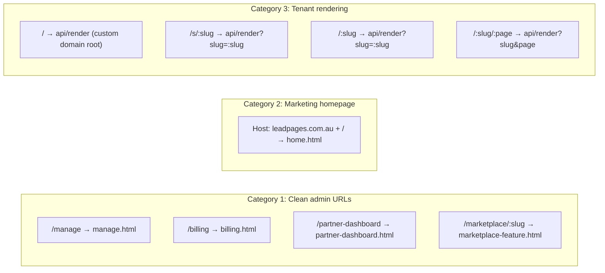

### Full rewrite table (admin and marketing)

| Source | Destination |
|--------|-------------|
| `/manage` | `manage.html` |
| `/partner-dashboard` | `partner-dashboard.html` |
| `/billing` | `billing.html` |
| `/domains` | `domains.html` |
| `/marketplace` | `marketplace.html` |
| `/marketplace/:slug` | `marketplace-feature.html` |
| `/partners` | `partners.html` |
| `/find-a-partner` | `find-a-partner.html` |
| `/help` | `help.html` |
| `/` + host `leadpages.com.au` | `home.html` |

### Tenant rewrite chain

For a request to `https://customplumber.com.au/emergency`:

1. Host `customplumber.com.au` → not primary host → custom domain mode
2. Rewrite `/:slug/:page` → `/api/render?slug=emergency&page=` (slug becomes page on custom domain)
3. `render.js` looks up site by `custom_domain`, treats `emergency` as `config.pages[]` slug

For `https://leadpages.com.au/s/joes-plumbing`:

1. Rewrite `/s/:slug` → `/api/render?slug=joes-plumbing`
2. `render.js` looks up by slug on primary host

### Cron configuration

```json
{
  "crons": [{
    "path": "/api/billing/cron",
    "schedule": "0 3 * * *"
  }]
}
```

Vercel sends `Authorization: Bearer <CRON_SECRET>` when the env var is set.

---

## Supabase Interaction

### Access patterns

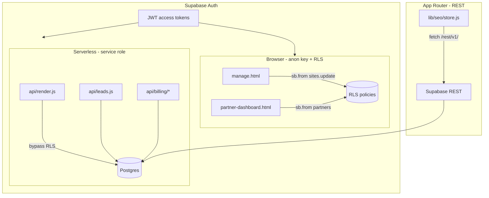

### Central data model: `sites`

| Column | Role |
|--------|------|
| `id`, `slug`, `business_name` | Identity and routing |
| `vertical` | `broker` \| `trade` |
| `template` | `trade`, `broker-leads`, `broker-app` |
| `theme` | Preset name |
| `config` (JSONB) | All page content, sections, SEO, pages |
| `status` | `live` vs draft |
| `custom_domain` | Custom domain mapping |
| `owner_user_id`, `owner_email` | Ownership and billing |
| `billing_status` | Suspension enforcement at render |
| `preview_password` | Per-demo password gate |
| Partner flags | `is_partner_home`, `is_mockup`, `servicing_partner_id`, etc. |

### Other key tables

| Domain | Tables |
|--------|--------|
| Auth | `profiles` |
| CRM | `leads`, `events`, `email_optouts` |
| Partners | `partners`, `partner_profiles`, `partner_commissions`, `partner_directory` |
| Billing | `billing_plans`, `contra_accounts` |
| Marketplace | `site_apps`, `app_registry`, `service_packs`, `catalog_*` |
| Domains | `domains`, `domain_pricing` |
| SEO | `suburb_intros` |
| Instagram | `ig_connections` |
| Ops | `system_pages`, `site_backups`, `demo_themes` |

### Environment variables

| Variable | Used by |
|----------|---------|
| `SUPABASE_URL` | All DB access |
| `SUPABASE_ANON_KEY` | Browser clients, token validation |
| `SUPABASE_SERVICE_ROLE_KEY` | Serverless, SEO lib, cron workers |
| `SEO_SITES_TABLE`, `SEO_SITE_SLUG_COLUMN`, `SEO_SITE_CONFIG_COLUMN` | Override table/column names in `lib/seo/store.js` |
| `IG_SITES_TABLE`, `IG_SITE_SLUG_COLUMN`, etc. | Instagram worker table overrides |

### Schema versioning

Only `db/suburb_intros.sql` and `db/instagram_schema.sql` are versioned in-repo. The main application schema is maintained in Supabase directly; table shapes are inferred from application code.

---

## Data Flow

### Lead capture flow

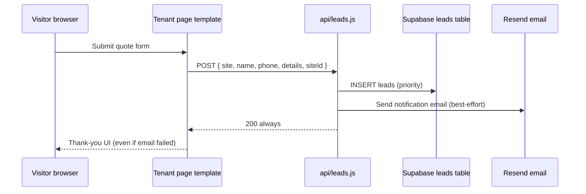

### Site edit and preview flow

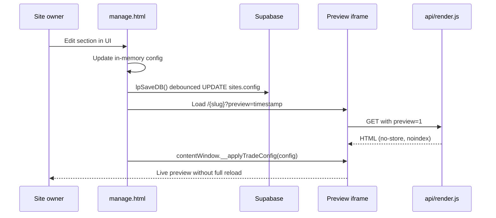

### Partner client creation flow

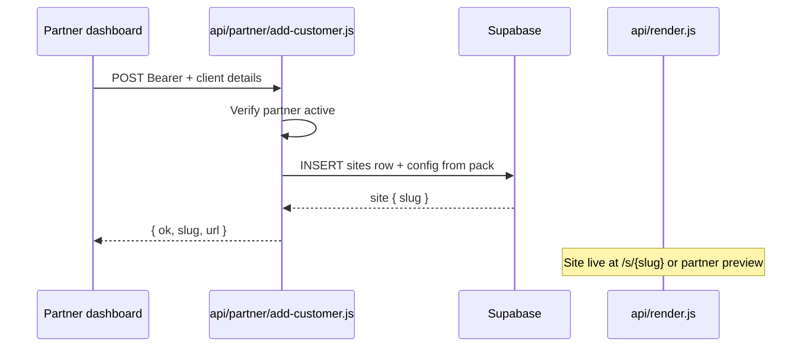

### Billing webhook flow

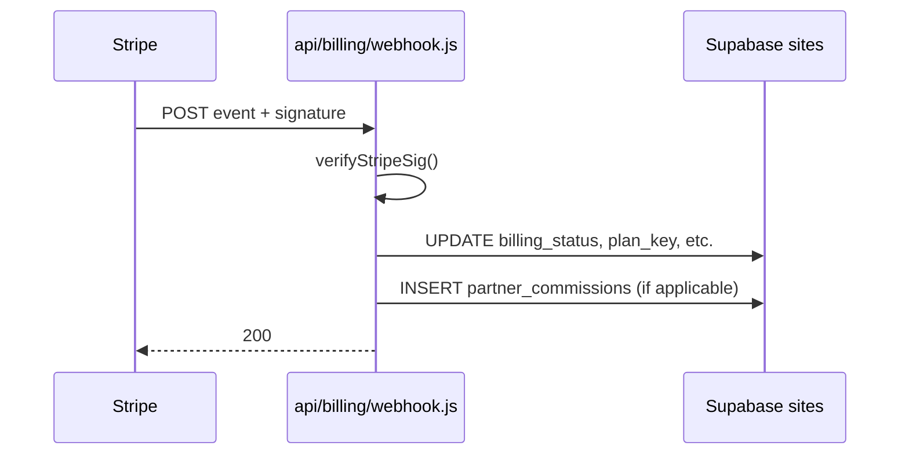

Note: suspended `billing_status` is enforced at **render time** in `api/render.js`, not only at the API layer.

### Suburb SEO generation flow

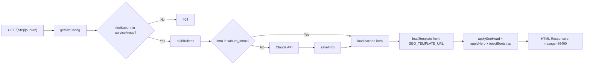

---

## Deployment Flow

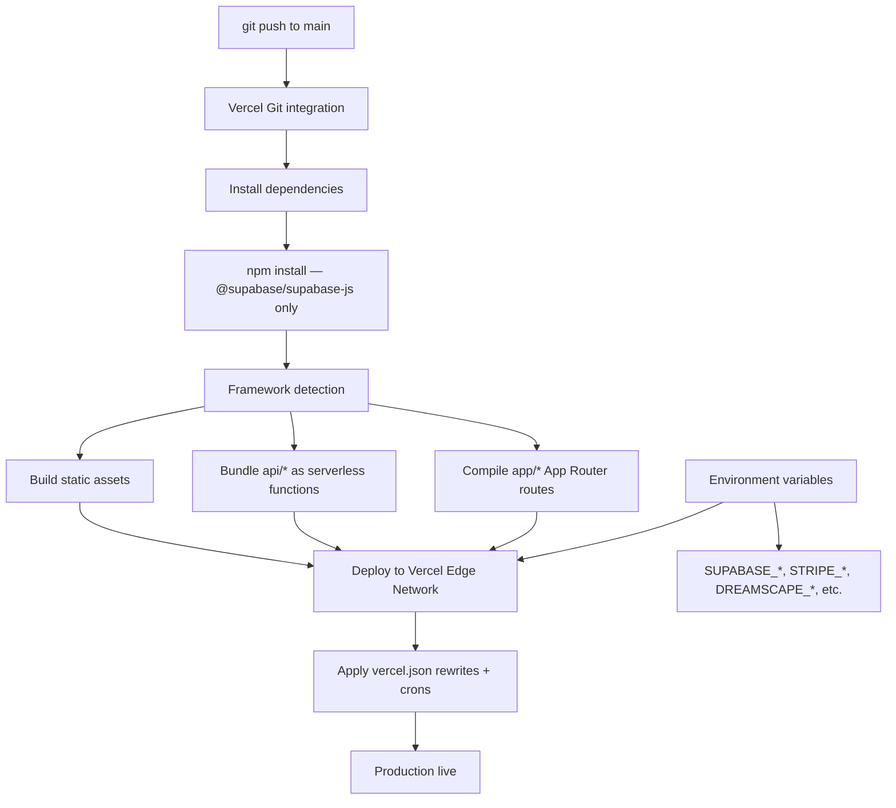

### Deployment checklist

| Step | Detail |
|------|--------|
| **Trigger** | Push to connected Git branch (typically `main`) |
| **Build** | No custom build script; Vercel auto-detects static + functions + partial Next.js |
| **Static files** | Root `*.html`, `*.template.json`, `marketplace/demos/` served as static assets |
| **Functions** | Each `api/**/*.js` (except `_` prefix) becomes an isolated serverless function |
| **App Router** | `app/[site]/[suburb]/route.js` and `app/seo-sitemap.xml/route.js` compiled as Next.js routes |
| **Crons** | `vercel.json` registers `/api/billing/cron` at 03:00 UTC daily |
| **Secrets** | All third-party credentials in Vercel project environment variables (no `.env` in repo) |

### Runtime environment groups

| Group | Variables (representative) |
|-------|---------------------------|
| **Supabase** | `SUPABASE_URL`, `SUPABASE_ANON_KEY`, `SUPABASE_SERVICE_ROLE_KEY` |
| **Stripe** | `STRIPE_SECRET_KEY`, `STRIPE_WEBHOOK_SECRET`, `STRIPE_BILLING_WEBHOOK_SECRET` |
| **Dreamscape** | `DREAMSCAPE_API_TOKEN`, `DREAMSCAPE_RESELLER_ID`, `DREAMSCAPE_DIAG_KEY` |
| **Cloudinary** | `CLOUDINARY_URL`, `CLOUDINARY_API_KEY`, `CLOUDINARY_API_SECRET` |
| **Email** | `RESEND_API_KEY`, `LEADS_FROM`, `CAMPAIGN_FROM` |
| **AI** | `ANTHROPIC_API_KEY`, `ANTHROPIC_MODEL`, `SEO_TEMPLATE_URL` |
| **Instagram** | `INSTAGRAM_APP_ID`, `INSTAGRAM_APP_SECRET`, `IG_STATE_SECRET` |
| **Ops** | `CRON_SECRET`, `ADMIN_PASSWORD`, `SUPER_ADMIN_EMAILS`, `PRIMARY_HOSTS` |

### Post-deploy verification

1. Marketing homepage loads on `leadpages.com.au`
2. `/manage` serves `manage.html` and Supabase auth works
3. A known live tenant slug renders via `/s/{slug}`
4. Custom domain tenant resolves at `/` on client domain
5. `POST /api/events` returns 200 from a tenant page
6. Stripe webhook endpoints respond to test events
7. Cron endpoint rejects requests without `CRON_SECRET`

---

## Key File Reference

| Concern | Path |
|---------|------|
| Deployment config | `vercel.json` |
| Tenant renderer | `api/render.js` |
| Suburb SEO route | `app/[site]/[suburb]/route.js` |
| SEO data access | `lib/seo/store.js` |
| Auth helpers | `api/billing/_stripe.js` |
| Lead ingest | `api/leads.js` |
| Analytics ingest | `api/events.js` |
| Partner identity | `api/partner/me.js` |
| Dreamscape client | `dreamscape.js` |
| Trade templates | `trade.template.json`, `broker.template.json` |
| Main editor UI | `manage.html` |
| DB migrations (partial) | `db/*.sql` |

---

## Related Documents

| Document | Topic |
|----------|-------|
| [`00-VISION.md`](./00-VISION.md) | Product vision, principles, roadmap |
| `02-DATABASE.md` | *(planned)* Full schema reference |
| `03-TEMPLATES.md` | *(planned)* Template system deep dive |
| `04-AUTH.md` | *(planned)* Auth and RLS policies |

---

*This document reflects the repository as deployed on Vercel with Supabase as of the current `main` branch structure.*
