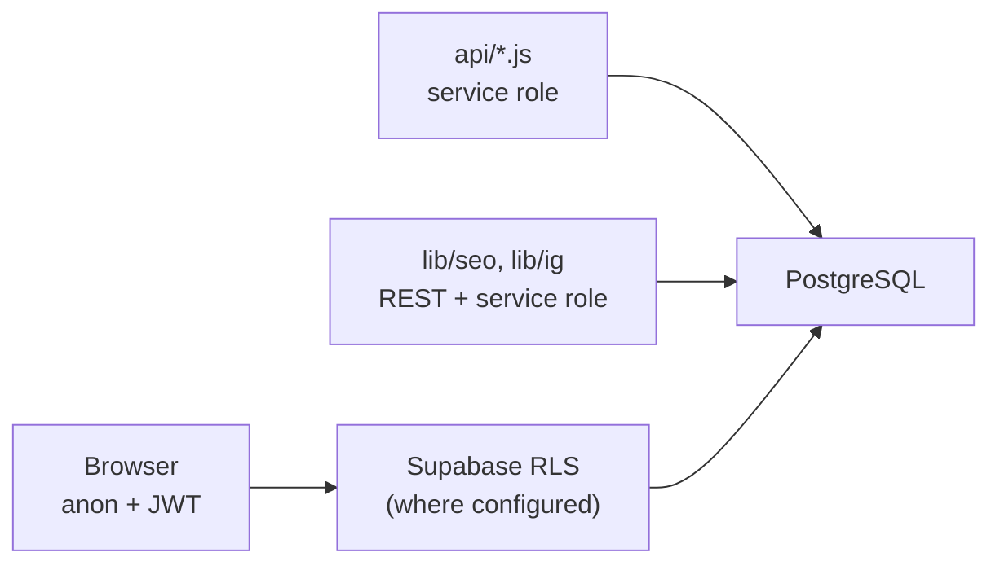
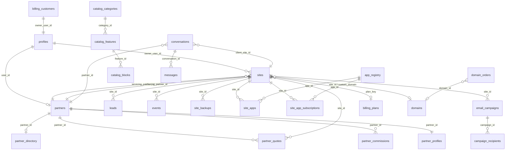
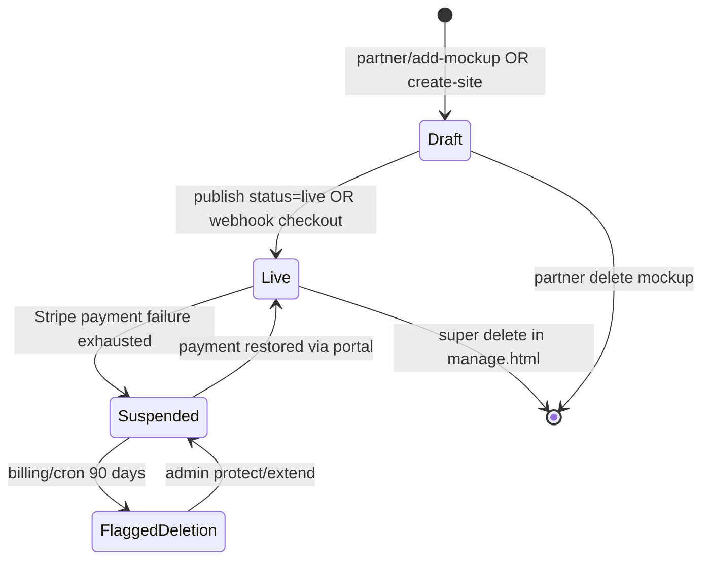
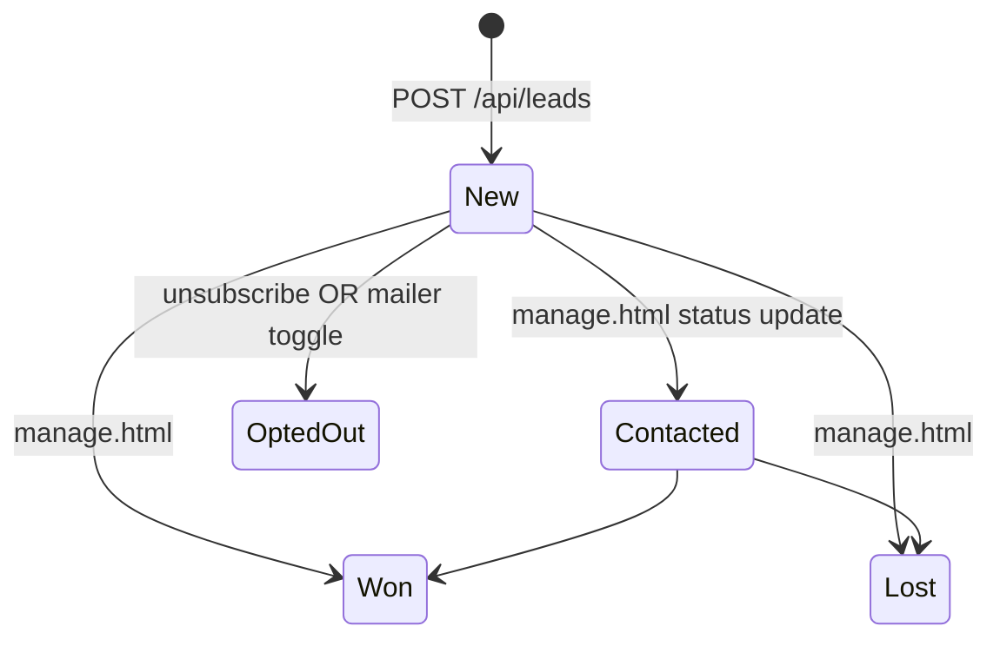
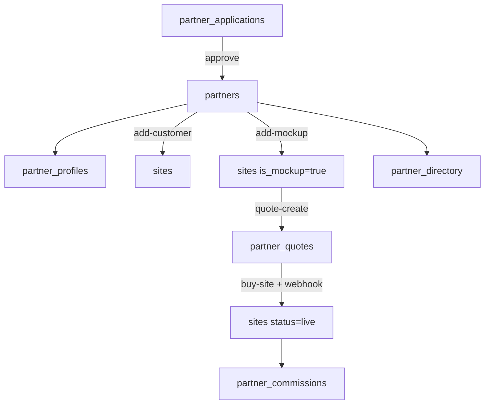
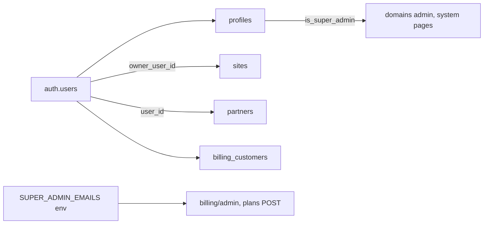
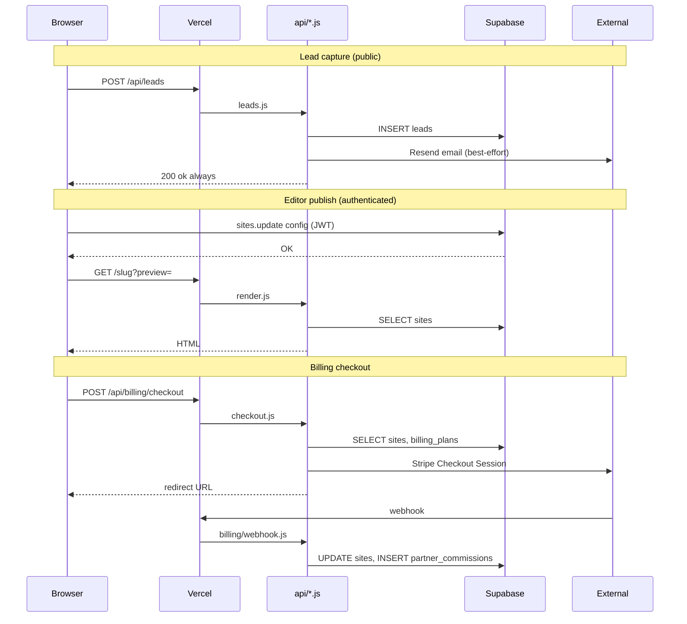

# LeadPages — Database Reference

**Document:** `02-DATABASE`  
**Status:** Definitive database reference for the LeadPages platform  
**Audience:** Engineers, DBAs, security reviewers, and AI development agents  
**Prerequisites:** [00-VISION](00-VISION.md), [01-ARCHITECTURE](01-ARCHITECTURE.md)

---

## Database Overview

LeadPages stores all persistent platform state in **Supabase PostgreSQL**. The database is accessed through three client patterns:

| Access pattern | Key used | Where |
|----------------|----------|-------|
| **Browser (editor UIs)** | Anon key + user JWT | `manage.html`, `partner-dashboard.html`, admin HTML pages |
| **Serverless APIs** | Service role key | All `api/**/*.js` handlers |
| **App Router / workers** | Service role via REST `fetch` | `lib/seo/store.js`, `lib/ig/store.mjs` |

### Design philosophy

| Principle | Why |
|-----------|-----|
| **One row per tenant in `sites`** | Simple multi-tenancy; partners and clients understand "one website = one record" |
| **`sites.config` JSONB for content** | Ship editor features without a migration per section; preserve backwards compatibility |
| **Service role on server** | Public endpoints (leads, events, render) must write reliably without visitor auth |
| **Normalized tables for operations** | Billing, domains, partners, CRM — auditable relational data |
| **RLS on sensitive tables** | `ig_connections`, `suburb_intros` locked down; most tables rely on server-side auth |

### Scale (inferred from codebase)

- **51 tables** referenced in application code
- **2 versioned SQL files** in `db/` (`suburb_intros`, `ig_connections`)
- **~109 code references** to `sites` alone across API, HTML, and lib layers

### Access model summary



**Critical rule:** Serverless functions use the **service role** and bypass RLS. Caller authorization is enforced **per API endpoint**, not via database policies alone.

---

## Entity Relationship Overview



### Relationship narrative

- **`sites`** is the hub: tenant content (`config`), billing state, partner attribution, and domain linkage radiate from it.
- **`partners`** + **`partner_profiles`** form the reseller identity; **`sites.servicing_partner_id`** / **`referring_partner_id`** link clients to partners.
- **`billing_customers`** bridges Supabase Auth users to Stripe; **`sites.plan_key`** links to **`billing_plans`**.
- **`site_apps`** + **`site_app_subscriptions`** connect marketplace features to tenants and Stripe billing.
- **`leads`** and **`events`** are append-mostly operational data keyed by **`site_id`**.

---

## Naming Conventions

| Convention | Example | Notes |
|------------|---------|-------|
| Table names | `snake_case`, plural | `partner_profiles`, `site_backups` |
| Primary keys | `id` (UUID) or natural key | `billing_plans.key`, `ig_connections.slug` |
| Foreign keys | `{entity}_id` | `site_id`, `partner_id`, `owner_user_id` |
| Timestamps | `created_at`, `updated_at` | ISO timestamptz |
| Status fields | `status`, `billing_status` | String enums enforced in application code |
| JSON content | `config`, `pack`, `payload` | JSONB columns |
| Boolean flags | `is_*`, `enabled`, `published` | `is_mockup`, `is_live` |
| Stripe refs | `stripe_*` | `stripe_customer_id`, `stripe_item_id` |
| Dreamscape refs | `dreamscape_*` | `dreamscape_domain_id` |

---

## Migrations & SQL Scripts

### Versioned in repository

| File | Table | PK | RLS |
|------|-------|-----|-----|
| [db/suburb_intros.sql](../db/suburb_intros.sql) | `suburb_intros` | `(site, suburb)` composite | Enabled, no policies → service role only |
| [db/instagram_schema.sql](../db/instagram_schema.sql) | `ig_connections` | `slug` (text) | Enabled, no policies → service role only |

### Not versioned (applied in Supabase console)

All other tables (`sites`, `leads`, `partners`, `billing_*`, `domains`, `catalog_*`, etc.) exist in production Supabase but **lack in-repo migration files**. Schema must be inferred from application `select`/`insert`/`update` column lists.

### Indexes & constraints (inferred)

| Table | Likely constraints | Evidence |
|-------|-------------------|----------|
| `sites` | UNIQUE `slug`, UNIQUE `custom_domain` | `23505` duplicate handling in `create-site.js`, `showcase-check.js` |
| `billing_plans` | PK `key` (text) | `onConflict: 'key'` in `plans.js` |
| `billing_customers` | UNIQUE `owner_user_id` | `onConflict: 'owner_user_id'` in webhooks |
| `email_optouts` | UNIQUE `(site_id, email)` | `onConflict: 'site_id,email'` in `unsubscribe.js` |
| `partner_onboarding` | UNIQUE `partner_id` + `step` | upsert pattern |
| `site_apps` | UNIQUE `(site_id, app_id)` | upsert in `api-site-apps.js` |
| `service_packs` | UNIQUE `slug` | `onConflict: 'slug'` in `manage.html` |
| `system_pages` | PK `key` | `onConflict: 'key'` |
| `suburb_intros` | PK `(site, suburb)` | explicit in SQL |
| `ig_connections` | PK `slug` | explicit in SQL |

**Recommendation:** Export full schema from Supabase and commit to `db/migrations/`.

---

## Configuration Storage — `sites.config`

The `sites.config` JSONB column is the **primary content store** for tenant websites. Top-level columns (`business_name`, `custom_domain`, `owner_email`) duplicate some config fields for querying and display; **`config` is authoritative for page content**.

### Rules (non-negotiable)

1. **Never wipe `config`** — merge updates only.
2. **Never remove unknown keys** — older sites may have legacy fields.
3. **Strip editor-only keys on export** — `savedThemes`, `users` removed before live publish for `broker-app`.
4. **Append new fields with defaults** — document new structures here and in [03-TEMPLATE-SYSTEM](03-TEMPLATE-SYSTEM.md).

### Top-level `config` shape by template

#### Shared fields (all templates)

```json
{
  "phone": "+61261000000",
  "phoneText": "(02) 6100 0000",
  "email": "hello@business.com.au",
  "region": "Canberra & the ACT",
  "suburb": "Canberra",
  "licence": "ACT Licence 0000000",
  "favicon": "https://res.cloudinary.com/.../favicon.ico",
  "seoTitle": "",
  "seoDescription": ""
}
```

#### `trade` template

```json
{
  "trade": "Plumber",
  "theme": { "pipe": "#1f7bb8", "hivis": "#ff6a1f", "steel": "#1a2230", "safety": "#ffc400", "lightBg": "#eef2f6", "presetKey": "charcoal-hivis" },
  "layout": "classic",
  "sectionOrder": ["emerg", "hero", "trustBar", "services", "why", "area", "reviews", "quote", "faq", "footer"],
  "services": [{ "on": true, "icon": "wrench", "title": "Blocked drains", "body": "..." }],
  "sections": { "...": "see sections below" },
  "badges": [], "why": [], "reviews": [], "trustBar": [], "crew": [], "faq": [],
  "logo": { "mode": "text", "text": "", "imageUrl": "", "_pid": "" },
  "scope": { "description": "", "items": [{ "text": "", "done": false }] }
}
```

#### `broker-leads` template

```json
{
  "rates": { "variableRate": 6.04, "comparisonRate": 6.18, "updatedAt": "Mar 2026", "rateSource": "override" },
  "suburb": "Canberra"
}
```

#### `broker-app` template

```json
{
  "business": "Example Broker",
  "states": { "ACT": { "name": "ACT", "brackets": [], "fhog": {}, "foreign": {} } },
  "calculators": { "repay": true, "borrow": true, "costs": true },
  "appearance": { "brand": "#...", "brandDeep": "#...", "accent": "#...", "fonts": {} },
  "pages": [{ "id": "uuid", "title": "", "slug": "", "meta": "", "h1": "", "body": "", "menu": true, "status": "published", "img": "", "img_pid": "" }],
  "scope": { "description": "", "items": [] }
}
```

### `sections` object (trade template)

Each key is a section ID. Common pattern: `{ "on": true, "eyebrow": "", "heading": "", "intro": "", ... }`.

| Section key | Purpose | Toggle default |
|-------------|---------|----------------|
| `hero` | Main headline, CTA | on |
| `quote` | Lead capture form | on |
| `services` | Service cards grid | on |
| `why` | Value propositions | on |
| `area` | Service suburbs list | on |
| `reviews` | Testimonials | on |
| `faq` | FAQ accordion | on |
| `footer` | Footer blurb + legal | on |
| `trustBar` | Icon badges below hero | layout-dependent |
| `seoTokens` | Local SEO token config | off until configured |
| `serviceAreas` | Suburb list for SEO pages | off |
| `heroSlider`, `splitHero` | Alternate hero layouts | off |
| `projectFeed`, `igProjectFeed` | Instagram/manual feeds | off |
| `estimateBuilder`, `finance` | Conversion tools | off |
| `promotions` | Timed offers | off |
| `mobileBar` | Sticky mobile CTA | off |
| `lpFooter` | Extended footer options | — |

Full defaults live in `DEFAULT_TRADE_SECTIONS` in `manage.html` (~40 section types).

### `theme` object

Colour tokens applied across the trade template:

| Key | UI role |
|-----|---------|
| `pipe` | Brand — buttons, links, accents |
| `hivis` | Call-to-action orange buttons |
| `steel` | Header, hero, footer dark bands |
| `safety` | Badges, small highlights |
| `lightBg` | Page background behind sections |
| `presetKey` | Named preset identifier |

### `services` array

```json
[{ "on": true, "icon": "wrench", "title": "Service name", "body": "Description" }]
```

Populated from trade packs (`service_packs` table) or manual editor entry.

### `pages` array (broker-app SEO sub-pages)

```json
[{ "id": "...", "title": "...", "slug": "rates", "meta": "...", "h1": "...", "body": "...", "menu": true, "status": "published|draft", "img": "", "img_pid": "" }]
```

Autosaved via `lpAutosave()` in `manage.html`. Published pages resolve at `/{slug}/{page}` via `api/render.js`.

### `seo` / `seoTokens` (local SEO)

Inside `sections.seoTokens`:

```json
{
  "trade": "Plumber",
  "city": "Canberra",
  "region": "ACT",
  "suburb": "Canberra",
  "enableUrlSuburb": false,
  "updateTitle": false,
  "titleTemplate": "{trade} in {suburb} | {business}",
  "metaTemplate": "..."
}
```

`sections.serviceAreas.areas` — array of suburb names; drives `app/[site]/[suburb]` page generation.

Top-level `seoTitle` / `seoDescription` — site-wide fallbacks injected by `api/render.js`.

### `forms` / quote section

Inside `sections.quote`:

| Field | Purpose |
|-------|---------|
| `button`, `formTitle`, `lblName`, `lblPhone`, `lblJob`, `lblSuburb`, `lblDetail` | Form labels |
| `reqName`, `reqPhone`, `reqJob`, `reqSuburb` | Required field toggles |
| `formStyle` | `default` or `feature` |
| `callOn` | Show call button alongside form |
| `notifyMode`, `notifyEmail` | Override notification email |
| `bg`, `btnBg`, `btnText` | Form styling |

Submissions POST to `/api/leads` → `leads` table.

### `analytics` (client-side, not in config)

Analytics are **not stored in config**. Tenant pages fire beacons via `events.js`:

- `page_view`, `call_click`, `lead_submit`, `quote_open`, `cta_click`

Stored in `events` table keyed by `site_id`.

### Feature toggles

| Mechanism | Storage | Purpose |
|-----------|---------|---------|
| `sections.{id}.on` | `config.sections` | Show/hide page sections |
| `site_apps.enabled` | `site_apps` table | Marketplace app activation |
| `site_apps.position_slot` | `site_apps` table | `hero`, `upper`, `mid`, `lower`, `footer` |
| `calculators.{name}` | `config` (broker-app) | Enable/disable calculator tools |
| `layout` | `config` (trade) | Preset section order (`classic`, `quote-first`, etc.) |

---

## Core Tables

### `sites`

| Attribute | Value |
|-----------|-------|
| **Purpose** | Central tenant record — one row = one website |
| **Business purpose** | Stores identity, billing state, partner attribution, publish status, and all page content in `config` |
| **Primary key** | `id` (UUID, inferred) |
| **Unique keys** | `slug`, `custom_domain` (inferred) |
| **Foreign keys** | `owner_user_id` → `profiles.id`; `referring_partner_id`, `servicing_partner_id`, `commission_partner_id` → `partners.id`; `plan_key` → `billing_plans.key` |

**Important columns**

| Column | Type (inferred) | Purpose |
|--------|-----------------|---------|
| `id` | UUID | Primary key |
| `slug` | text | URL path on leadpages host |
| `business_name` | text | Display name |
| `config` | JSONB | **All editable page content** |
| `template` | text | `trade`, `broker-leads`, `broker-app` |
| `vertical` | text | Legacy: `trade`, `broker` |
| `theme` | text | Theme preset name |
| `status` | text | `live` or draft — non-live 404s without `?preview=1` |
| `custom_domain` | text | Client's own domain |
| `owner_email` | text | Client login / notification email |
| `owner_user_id` | UUID | Supabase Auth user |
| `plan_key` | text | Active hosting plan |
| `monthly_amount` | numeric | Cached plan amount (cents or dollars per code) |
| `billing_status` | text | `active`, `suspended`, `flagged_deletion` |
| `stripe_item_id` | text | Stripe subscription item |
| `preview_password` | text | Per-demo password gate |
| `is_mockup` | boolean | Partner demo site |
| `is_partner_home` | boolean | Partner agency homepage |
| `is_demo` | boolean | Platform demo flag |
| `show_on_showcase` | boolean | Visible on partner showcase |
| `servicing_partner_id` | UUID | Partner who supports client |
| `referring_partner_id` | UUID | Partner who sold the site |
| `sale_price` | integer | Demo buy-bar price (cents) |
| `suspended_at` | timestamptz | When billing suspended |
| `delete_protected` | boolean | Cron skip for deletion flag |
| `created_at`, `updated_at` | timestamptz | Audit |

**How populated:** `manage.html` insert/update; `api/create-site.js`; `api/partner/add-customer.js`, `add-mockup.js`, `ensure-home.js`; Stripe webhooks; billing admin APIs.

**API endpoints:** `render`, `leads`, `events`, `stats`, `create-site`, all `partner/*`, all `billing/*`, `domains/webhook`, `domains/list`, `send-campaign`, `ig-media`, `admin-data`, `site/support-contact`

**HTML pages:** `manage.html`, `partner-dashboard.html`, `partner.html`, `billing.html`, `partners-admin.html`, `messages.html`

**Auth:** Browser — JWT + RLS (site list scoped by role). APIs — service role.

**RLS:** Expected on browser reads; server bypasses via service role.

**Security:** `config` may contain PII; `preview_password` protects demos; `owner_user_id` links billing.

**Future improvements:** Config schema versioning; generated TypeScript types; filter SEO sitemap by `status = live`.

---

## Authentication Tables

### `profiles`

| Attribute | Value |
|-----------|-------|
| **Purpose** | Extends Supabase Auth users with platform roles |
| **Business purpose** | Identifies super-admins for elevated operations |
| **Primary key** | `id` (matches `auth.users.id`) |
| **Foreign keys** | `id` → Supabase `auth.users` |

**Important columns:** `id`, `is_super_admin` (boolean)

**How populated:** Supabase trigger on signup (assumed); manual admin updates.

**API endpoints:** Read in `system-pages`, `billing/system-pages`, all `domains/*` admin checks, `assist`, `notify-message`, `partner-onboarding`

**HTML pages:** `manage.html`, `marketplace-admin.html`, `partners-admin.html`, `apps-admin.html`

**Auth:** Bearer JWT; super-admin check via service role query.

**RLS:** Should restrict users to own profile; super-admin flag readable by authenticated user.

**Security:** `is_super_admin` gates domain reseller admin and system page editing.

**Future improvements:** Expand roles beyond boolean super-admin; partner role in profiles.

---

## CRM Tables

### `leads`

| Attribute | Value |
|-----------|-------|
| **Purpose** | Quote form submissions from tenant pages |
| **Business purpose** | Core CRM — every enquiry is stored and emailed to the site owner |
| **Primary key** | `id` (UUID, inferred) |
| **Foreign keys** | `site_id` → `sites.id`; `owner_user_id` → `profiles.id` (inferred) |

**Important columns:** `id`, `site_id`, `name`, `email`, `phone`, `kind`, `details` (JSONB), `message`, `status` (`new`, `contacted`, `won`, `lost`), `email_opt_out`, `source`, `created_at`

**How populated:** `POST /api/leads` (public); status updates from `manage.html`; opt-out from `unsubscribe.js` and mailer UI.

**API:** `leads` (INSERT), `stats` (SELECT), `send-campaign` (SELECT emails), `unsubscribe` (UPDATE), `admin-data` (SELECT)

**HTML:** `manage.html` (CRM tab, mailer recipients), `partner-dashboard.html`

**Auth:** Public INSERT via service role; SELECT/UPDATE requires JWT in browser or Bearer in `stats`.

**Security:** PII — name, email, phone. Never expose bulk export without auth.

---

### `events`

| Attribute | Value |
|-----------|-------|
| **Purpose** | Analytics beacons from tenant pages |
| **Business purpose** | Powers Visitors/Calls/Forms dashboard in `/manage` |
| **Primary key** | `id` (inferred) |
| **Foreign keys** | `site_id` → `sites.id` |

**Important columns:** `event` (`page_view`, `call_click`, `lead_submit`, `quote_open`, `cta_click`), `site_id`, `props` (JSONB), `created_at`, legacy `site` (text)

**How populated:** `POST /api/events` (public, always 200).

**API:** `events` (INSERT), `stats` (SELECT), `admin-data` (SELECT)

**HTML:** `manage.html` (analytics — via `/api/stats` or direct query fallback)

---

### `email_campaigns`

| Attribute | Value |
|-----------|-------|
| **Purpose** | Bulk email campaigns to site leads |
| **Business purpose** | Mini-newsletter / client mailer in manage.html |
| **Primary key** | `id` |
| **Foreign keys** | `site_id` → `sites.id`; `created_by` → user |

**Important columns:** `subject`, `body_html`, `image_url`, `recipient_mode`, `recipient_list`, `send_at`, `timezone`, `status` (`draft`, `scheduled`, `sending`, `sent`, `failed`), `total_recipients`, `sent_count`, `failed_count`

**How populated:** `POST /api/send-campaign`; `cron/send-due.js` claims scheduled rows.

**API only** — `manage.html` uses `/api/send-campaign`, no direct `.from()`.

---

### `campaign_recipients`

| Attribute | Value |
|-----------|-------|
| **Purpose** | Per-recipient send tracking |
| **Foreign keys** | `campaign_id` → `email_campaigns.id` |

**Columns:** `campaign_id`, `email`, `status`, `error`, `sent_at`

**Operations:** INSERT, DELETE (idempotent re-send cleanup) in `send-campaign.js`

---

### `email_optouts`

| Attribute | Value |
|-----------|-------|
| **Purpose** | Per-site email unsubscribe list |
| **Primary key** | `(site_id, email)` composite (inferred) |
| **Foreign keys** | `site_id` → `sites.id` |

**How populated:** `unsubscribe.js` (public link); `manage.html` mailer toggles; `send-campaign.js` checks before send.

---

### `conversations` / `messages` / `conversation_reads`

| Table | Purpose |
|-------|---------|
| `conversations` | Partner ↔ client message threads |
| `messages` | Individual messages |
| `conversation_reads` | Read receipts per user |

**Foreign keys:** `conversations.partner_id` → `partners.id`; `conversations.client_site_id` → `sites.id`; `messages.conversation_id` → `conversations.id`

**HTML:** `messages.html`, `partner.html` (direct Supabase); `notify-message.js` (email heads-up on new message)

**Auth:** Bearer JWT; participants must be partner or site owner.

---

### `wiki_articles`

| Attribute | Value |
|-----------|-------|
| **Purpose** | Help centre content |
| **HTML:** `help.html` (public read), `partners-admin.html` (CRUD) |
| **API:** `assist.js` (AI context) |

**Columns:** `title`, `category`, `audience`, `body`, `sort`, `published`

---

## Partner Tables

### `partners`

| Attribute | Value |
|-----------|-------|
| **Purpose** | Partner/reseller account |
| **Business purpose** | Agencies who sell and support LeadPages sites |
| **Primary key** | `id` |
| **Foreign keys** | `user_id` → `profiles.id`; `application_id` → `partner_applications.id` |

**Important columns:** `display_name`, `email`, `phone`, `status` (`active`, etc.), `user_id`

**How populated:** Admin approval in `partners-admin.html`; claim-by-email in `partner/me.js`; `partner-welcome.js`.

**API:** `partner/me`, all `partner/*`, `billing/webhook`, `render` (showcase), `assist`, `notify-message`

**HTML:** `partners-admin.html`, `manage.html`, `messages.html`, `partner.html`

---

### `partner_profiles`

| Attribute | Value |
|-----------|-------|
| **Purpose** | Extended partner settings — showcase, support contact, billing |
| **Primary key** | `partner_id` (inferred) |
| **Foreign keys** | `partner_id` → `partners.id` |

**Important columns:** `showcase_slug`, `showcase_domain`, `showcase_enabled`, `showcase_headline`, `showcase_config`, `showcase_password`, `support_name`, `support_email`, `support_phone`, `default_plan_key`, `gst_registered`, `abn`, `notify_new_message`

**How populated:** `partner/save-showcase.js`, `partners-admin.html`, auto-created in `partner/me.js`.

---

### `partner_applications`

**Purpose:** Incoming partner program applications from `partners.html`.  
**API:** `partner-apply.js` (INSERT); `partners-admin.html` (SELECT, UPDATE, approve → creates `partners` row).

---

### `partner_quotes`

**Purpose:** Tokenised client quotes tied to demo sites.  
**Columns:** `token`, `partner_id`, `site_id`, `price`, `plan_key`, `status`, `sent_at`, `paid_at`  
**API:** `quote-create`, `quote-get`, `buy-site`, `billing/webhook` (marks paid, converts demo to live).

---

### `partner_commissions`

**Purpose:** Build + recurring commission ledger.  
**Columns:** `partner_id`, `site_id`, `type` (`build`, `recurring`), `rate`, `gross_amount`, `commission_amount`, `stripe_invoice_id`, `status`, `paid_date`  
**API:** `billing/webhook.js` (INSERT on payment events).  
**HTML:** `partner.html`, `partners-admin.html` (SELECT).

---

### `partner_directory`

**Purpose:** Public "find a partner" listings.  
**API:** `partner-directory.js` (public SELECT `is_live=true`); `partner-directory-self.js` (partner CRUD own listing).  
**HTML:** `find-a-partner.html` (via API).

---

### `partner_leads`

**Purpose:** Business-owner enquiries submitted to partners.  
**API:** `partner-lead.js` (INSERT only, origin-gated).

---

### `partner_themes`

**Purpose:** Saved site themes partners can apply to mockups/customers.  
**Columns:** `partner_id`, `name`, `config` (JSONB), `shared_with_partners`, `source_site_id`  
**HTML:** `manage.html`, `partner.html`, `partners-admin.html`  
**API:** `partner/add-customer.js`, `partner/add-mockup.js`

---

### `partner_templates`

**Purpose:** Saved marketplace app layouts per partner.  
**API:** `api-partner-templates.js`  
**HTML:** `partner-dashboard.html`

---

### `partner_onboarding`

**Purpose:** Training step progress per partner.  
**Columns:** `partner_id`, `step`, `completed_at`, `data`  
**API:** `partner-onboarding.js` (UPSERT)

---

### `partner_courses` / `partner_training_modules` / `partner_training_progress` / `partner_resources`

**Purpose:** Partner training academy content and completion tracking.  
**HTML only:** `partner.html` (read progress), `partners-admin.html` (CRUD content). No API routes.

---

### `partner_audit_logs`

**Purpose:** Admin audit trail for partner actions.  
**HTML:** `partners-admin.html` (INSERT on status change).

---

### `client_transfer_events`

**Purpose:** Record site ownership transfers between partners.  
**HTML:** `partners-admin.html` (INSERT, SELECT).

---

## Billing Tables

### `billing_plans`

| Attribute | Value |
|-----------|-------|
| **Primary key** | `key` (text) |
| **Purpose** | Hosting plan definitions |
| **Columns:** `name`, `description`, `features`, `monthly_amount`, `setup_amount`, `stripe_price_id`, `stripe_setup_price_id`, `volume_tiers`, `sort`, `active`, `is_free` |
| **API:** `billing/plans`, `billing/checkout`, `billing/webhook`, `render` (showcase pricing), `partner/buy-site`, `partner/add-customer` |

---

### `billing_customers`

| Attribute | Value |
|-----------|-------|
| **Primary key** | `owner_user_id` (inferred) |
| **Purpose** | Maps Supabase user → Stripe customer |
| **Columns:** `stripe_customer_id`, `stripe_subscription_id`, `owner_email`, `status` |
| **API:** All `billing/*` checkout, portal, account, webhook |

---

### `site_app_subscriptions`

| Attribute | Value |
|-----------|-------|
| **Purpose** | Per-app Stripe subscriptions |
| **Foreign keys** | `site_id` → `sites.id`; `app_id` → `app_registry.id` |
| **Columns:** `billing_cycle`, `price_aud`, `status`, `stripe_subscription_item_id`, `access_until`, `cancelled_at` |
| **API:** `billing/app-checkout`, `app-status`, `app-cancel`, `webhook` |

---

### `contra_accounts` / `contra_ledger`

| Attribute | Value |
|-----------|-------|
| **Purpose** | Barter/contra billing arrangements |
| **Accounts columns:** `owner_user_id`, `enabled`, `mode`, `limit_cents`, `accrue_monthly`, `over_limit` |
| **Ledger columns:** `direction`, `amount_cents`, `kind`, `description`, `ref`, `created_by` |
| **API:** `billing/contra`, `billing/_accrual`, `billing/cron` |

---

## Marketplace Tables

### `catalog_categories` / `catalog_features` / `catalog_blocks`

| Table | Purpose |
|-------|---------|
| `catalog_categories` | Marketplace taxonomy (`slug`, `name`, `sort_order`, `is_live`) |
| `catalog_features` | Feature listings (`section_key` links to template sections) |
| `catalog_blocks` | Demo block payloads per feature |

**API:** `catalog.js` (public read live only)  
**HTML:** `marketplace-admin.html` (CRUD)

---

### `app_registry` / `app_schemas` / `app_presets`

| Table | Purpose |
|-------|---------|
| `app_registry` | Installable app definitions, Stripe price IDs, marketplace status |
| `app_schemas` | JSON schema for app config (`app_id`, `schema`, `version`) |
| `app_presets` | Default config presets per app |

**API:** `api-apps.js`, `billing/app-checkout`, `billing/app-status`  
**HTML:** `apps-admin.html`

---

### `site_apps`

| Attribute | Value |
|-----------|-------|
| **Purpose** | Apps installed on a specific site |
| **Foreign keys** | `site_id` → `sites.id`; `app_id` → `app_registry.id` |
| **Columns:** `enabled`, `position_slot`, `position_order`, `config` (JSONB), `placed_at` |
| **API:** `api-site-apps.js`, `api-site-apps-config.js`, `api-partner-templates.js` |
| **Note:** Merged into `sites.config.sections` by `manage.html` `_reconcileSiteApps()` |

---

### `service_packs`

| Attribute | Value |
|-----------|-------|
| **Purpose** | Trade starter content packs (AI-generated or manual) |
| **Columns:** `slug`, `category`, `label`, `pack` (JSONB), `variant`, `use_count`, `is_approved`, `generated_by` |
| **HTML:** `manage.html` (super-admin editor) |
| **API:** `api-trade-generate.js` |

---

## SEO Tables

### `suburb_intros`

| Attribute | Value |
|-----------|-------|
| **Purpose** | Cache one AI-written intro per (site, suburb) |
| **Primary key** | `(site, suburb)` — see [db/suburb_intros.sql](../db/suburb_intros.sql) |
| **Columns:** `site` (text slug), `suburb`, `intro`, `updated_at` |
| **Populated by:** `lib/seo/suburbIntro.js` via Claude API, REST upsert |
| **Consumed by:** `app/[site]/[suburb]/route.js` |
| **RLS:** Enabled, no policies — service role only |
| **Security:** No PII; public content cache |

---

## Domain Tables

### `domains`

| Attribute | Value |
|-----------|-------|
| **Purpose** | Platform-registered domains owned by users |
| **Foreign keys** | `user_id` → auth user; `site_id` → `sites.id` (optional link) |
| **Columns:** `domain_name`, `dreamscape_domain_id`, `status`, `managed_external`, `expiry_date`, `privacy_enabled` |
| **API:** `domains/list`, `detail`, `dns`, `webhook` |
| **HTML:** `manage.html` (chips), `manage-domains.html` (via API) |

---

### `domain_orders`

**Purpose:** Checkout → registration order rows (one per domain in cart).  
**Columns:** `order_group`, `domain_name`, `status`, `stripe_session_id`, `sell_price`, `dreamscape_response_id`  
**API:** `domains/checkout`, `order`, `webhook`

---

### `domain_pricing`

**Purpose:** TLD retail price overrides (wholesale from Dreamscape API).  
**Columns:** `tld`, `retail`, `updated_by`  
**API:** `domains/availability`, `checkout`, `pricing`

---

### `domain_registrants` / `domain_customers` / `domain_events`

| Table | Purpose |
|-------|---------|
| `domain_registrants` | WHOIS registrant details (INSERT on webhook fulfilment) |
| `domain_customers` | Dreamscape client account mapping per user |
| `domain_events` | Domain lifecycle audit log |

**API:** `domains/webhook.js` only.

---

## Analytics Tables

`events` (documented under CRM) is the primary analytics store. Aggregations run in:

- `api/stats.js` — server-side with Bearer auth
- `manage.html` — dashboard via `/api/stats` or direct Supabase fallback

No separate analytics warehouse — all queries hit `events` and `leads` directly.

---

## Backup Tables

### `site_backups`

| Attribute | Value |
|-----------|-------|
| **Purpose** | Point-in-time `config` snapshots |
| **Foreign keys** | `site_id` → `sites.id` |
| **Columns:** `label`, `config` (JSONB copy), `created_at`, `size_bytes` |
| **HTML:** `manage.html` (save, restore, download, delete) |
| **Auth:** JWT in browser; no dedicated API |

---

## Integration & Platform Tables

### `system_pages`

| Attribute | Value |
|-----------|-------|
| **Purpose** | Platform HTML fragments (suspended page, etc.) |
| **Primary key** | `key` (text) |
| **Keys used:** `suspended_client`, `suspended_demo`, `suspended_system` |
| **API:** `system-pages.js`, `billing/system-pages.js`, `render.js` (503 page) |

---

### `demo_themes`

**Purpose:** Calculator demo appearance presets.  
**Columns:** `name`, `label`, `appearance` (JSONB), `enabled`, `sort`  
**HTML:** `manage.html`; **API:** `render.js` (demo bar on `slug=demo`).

---

### `ig_connections`

| Attribute | Value |
|-----------|-------|
| **Purpose** | Per-site Instagram API credentials |
| **Primary key** | `slug` (matches `sites.slug`) — [db/instagram_schema.sql](../db/instagram_schema.sql) |
| **Columns:** `ig_user_id`, `access_token` (**SENSITIVE**), `token_expires`, `enabled`, `last_sync`, `ig_cache` |
| **API:** `instagram/exchange`, `save-token`, `ig-media` |
| **Lib:** `lib/ig/store.mjs` (REST) |
| **RLS:** Enabled, no policies |
| **Security:** Tokens must never reach browser; service role only |

---

## Lifecycle Diagrams

### Site lifecycle



### Lead lifecycle



### Partner relationships



### Authentication relationships



---

## Complete Data Flow

### Browser → API → Supabase → Browser



---

## API Endpoint Database Operations

Complete reference of **SELECT / INSERT / UPDATE / DELETE / UPSERT** by endpoint.

### Core tenant

| Endpoint | Table | SELECT | INSERT | UPDATE | DELETE | UPSERT |
|----------|-------|--------|--------|--------|--------|--------|
| `render.js` | `sites` | ✓ | | | | |
| | `partners`, `partner_profiles` | ✓ | | | | |
| | `billing_plans` | ✓ | | | | |
| | `demo_themes` | ✓ | | | | |
| | `system_pages` | ✓ | | | | |
| `leads.js` | `sites` | ✓ | | | | |
| | `leads` | | ✓ | | | |
| `events.js` | `sites` | ✓ | | | | |
| | `events` | | ✓ | | | |
| `create-site.js` | `sites` | | ✓ | | | |
| `stats.js` | `events`, `leads` | ✓ | | | | |
| `admin-data.js` | `sites`, `leads`, `events` | ✓ | | | | |
| `ig-media.js` | `sites`, `ig_connections` | ✓ | | | | |
| `site/support-contact.js` | `sites`, `partners`, `partner_profiles` | ✓ | | | | |

### CRM & email

| Endpoint | Table | SELECT | INSERT | UPDATE | DELETE | UPSERT |
|----------|-------|--------|--------|--------|--------|--------|
| `send-campaign.js` | `sites`, `leads`, `email_optouts` | ✓ | | | | |
| | `email_campaigns` | ✓ | ✓ | ✓ | | |
| | `campaign_recipients` | | ✓ | | ✓ | |
| `unsubscribe.js` | `email_optouts` | | | | | ✓ |
| | `leads` | | | ✓ | | |
| `cron/send-due.js` | `email_campaigns` | ✓ | | ✓ | | |
| `notify-message.js` | `conversations`, `partners`, `partner_profiles`, `sites`, `profiles` | ✓ | | | | |
| `assist.js` | `profiles`, `wiki_articles` | ✓ | | | | |

### Partner

| Endpoint | Table | SELECT | INSERT | UPDATE | DELETE | UPSERT |
|----------|-------|--------|--------|--------|--------|--------|
| `partner/me.js` | `partners`, `partner_profiles` | ✓ | ✓ | ✓ | | |
| `partner/add-customer.js` | `sites`, `partners`, `billing_plans`, `partner_themes` | ✓ | ✓ | | | |
| `partner/add-mockup.js` | `sites`, `partners`, `partner_themes` | ✓ | ✓ | | | |
| `partner/ensure-home.js` | `sites`, `partners` | ✓ | ✓ | | | |
| `partner/save-showcase.js` | `partner_profiles`, `sites` | ✓ | | ✓ | | |
| `partner/quote-create.js` | `partners`, `sites`, `partner_profiles`, `partner_quotes` | ✓ | ✓ | | | |
| `partner/quote-get.js` | `partner_quotes`, `sites`, `partners`, `partner_profiles` | ✓ | | | | |
| `partner/buy-site.js` | `partner_quotes`, `sites`, `partner_profiles`, `billing_plans` | ✓ | | | | |
| `partner/showcase-check.js` | `partner_profiles`, `sites`, `partners` | ✓ | | | | |
| `partner-apply.js` | `partner_applications` | | ✓ | | | |
| `partner-directory.js` | `partner_directory` | ✓ | | | | |
| `partner-directory-self.js` | `partners`, `partner_directory` | ✓ | ✓ | ✓ | | |
| `partner-onboarding.js` | `partners`, `profiles`, `partner_onboarding` | ✓ | | | | ✓ |
| `partner-welcome.js` | `partners` | | | ✓ | | |
| `partner-lead.js` | `partner_leads` | | ✓ | | | |

### Billing

| Endpoint | Table | SELECT | INSERT | UPDATE | DELETE | UPSERT |
|----------|-------|--------|--------|--------|--------|--------|
| `billing/webhook.js` | `sites`, `billing_customers`, `billing_plans`, `partner_commissions`, `partners`, `partner_profiles`, `partner_quotes`, `site_app_subscriptions` | ✓ | ✓ | ✓ | | ✓ |
| `billing/checkout.js` | `sites`, `billing_plans`, `billing_customers` | ✓ | | ✓ | | ✓ |
| `billing/status.js` | `sites`, `billing_customers` | ✓ | | | | |
| `billing/account.js` | `sites`, `billing_customers` | ✓ | | | | |
| `billing/portal.js` | `billing_customers` | ✓ | | | | |
| `billing/owner.js` | `sites` | ✓ | | ✓ | | |
| `billing/admin.js` | `sites` | | | ✓ | | |
| `billing/plans.js` | `billing_plans` | ✓ | ✓ | | ✓ | ✓ |
| `billing/contra.js` | `sites`, `contra_accounts`, `contra_ledger` | ✓ | ✓ | | ✓ | ✓ |
| `billing/cron.js` | `contra_accounts`, `sites` | ✓ | | ✓ | | |
| `billing/app-checkout.js` | `sites`, `app_registry`, `site_app_subscriptions`, `billing_customers` | ✓ | | ✓ | | ✓ |
| `billing/app-status.js` | `sites`, `site_app_subscriptions` | ✓ | | | | |
| `billing/app-cancel.js` | `sites`, `site_app_subscriptions` | ✓ | | ✓ | | |
| `billing/system-pages.js` | `profiles`, `system_pages` | ✓ | | | | ✓ |

### Domains

| Endpoint | Table | SELECT | INSERT | UPDATE | DELETE | UPSERT |
|----------|-------|--------|--------|--------|--------|--------|
| `domains/availability.js` | `domain_pricing` | ✓ | | | | |
| `domains/checkout.js` | `domain_pricing`, `domain_orders` | ✓ | ✓ | ✓ | | |
| `domains/webhook.js` | `domain_orders`, `domains`, `domain_registrants`, `domain_customers`, `domain_events`, `sites` | ✓ | ✓ | ✓ | | ✓ |
| `domains/list.js` | `domains`, `profiles` | ✓ | | | | |
| `domains/detail.js` | `domains`, `profiles` | ✓ | | | | |
| `domains/dns.js` | `domains`, `profiles` | ✓ | | | | |
| `domains/order.js` | `domain_orders` | ✓ | | | | |
| `domains/pricing.js` | `domain_pricing`, `profiles` | ✓ | | | | ✓ |
| `domains/account.js` | `profiles` | ✓ | | | | |
| `domains/customers.js` | `profiles` | ✓ | | | | |
| `domains/invoices.js` | `profiles` | ✓ | | | | |

### Marketplace & apps

| Endpoint | Table | SELECT | INSERT | UPDATE | DELETE | UPSERT |
|----------|-------|--------|--------|--------|--------|--------|
| `catalog.js` | `catalog_categories`, `catalog_features`, `catalog_blocks` | ✓ | | | | |
| `api-apps.js` | `app_registry`, `app_schemas`, `app_presets` | ✓ | ✓ | ✓ | ✓ | |
| `api-site-apps.js` | `site_apps` | ✓ | | ✓ | | ✓ |
| `api-site-apps-config.js` | `site_apps`, `app_registry` | ✓ | | | | |
| `api-partner-templates.js` | `partner_templates`, `site_apps` | ✓ | ✓ | ✓ | ✓ | |
| `api-trade-generate.js` | `service_packs` | ✓ | ✓ | ✓ | | ✓ |
| `api-trade-stats.js` | (aggregates `sites` count) | ✓ | | | | |

### Cloudinary & Instagram

| Endpoint | Table | SELECT | INSERT | UPDATE | DELETE | UPSERT |
|----------|-------|--------|--------|--------|--------|--------|
| `instagram/exchange.js` | `ig_connections` | | ✓ | | | |
| `instagram/save-token.js` | `ig_connections` | ✓ | ✓ | ✓ | ✓ | |
| `system-pages.js` | `profiles`, `system_pages` | ✓ | | | | ✓ |

### App Router (REST, not `.from()`)

| Route | Table | Operations |
|-------|-------|------------|
| `app/[site]/[suburb]/route.js` | `sites` (config), `suburb_intros` | SELECT, UPSERT intro |
| `app/seo-sitemap.xml/route.js` | `sites` | SELECT slug, config |

### HTML direct Supabase access (browser JWT)

| Page | Tables | Operations |
|------|--------|------------|
| `manage.html` | `sites`, `profiles`, `leads`, `events`, `partners`, `domains`, `site_backups`, `demo_themes`, `partner_themes`, `service_packs`, `email_optouts` | SELECT, INSERT, UPDATE, DELETE |
| `partner-dashboard.html` | `sites`, `partners`, `site_app_subscriptions` | SELECT, INSERT |
| `partner.html` | `sites`, `partners`, `partner_commissions`, `partner_themes`, `partner_courses`, `partner_training_*`, `partner_resources`, `conversations`, `conversation_reads` | Mixed |
| `partners-admin.html` | `partners`, `partner_profiles`, `partner_applications`, `partner_commissions`, `sites`, `partner_audit_logs`, `client_transfer_events`, `wiki_articles`, `partner_courses`, `partner_training_*`, `partner_resources` | Mixed |
| `marketplace-admin.html` | `catalog_*`, `profiles` | CRUD |
| `apps-admin.html` | `app_registry`, `app_presets`, `site_app_subscriptions`, `profiles` | Mixed |
| `messages.html` | `conversations`, `messages`, `sites`, `partners` | SELECT, INSERT, UPSERT |
| `help.html` | `wiki_articles` | SELECT |
| `billing.html` | `sites` | SELECT (rest via APIs) |

---

## Complete Table Reference (All 51 Tables)

Each row summarizes purpose, keys, consumers, and auth. Columns inferred from application code unless noted in `db/*.sql`.

| Table | PK | Key FKs | Populated by | API routes | HTML pages | Auth |
|-------|-----|---------|--------------|------------|------------|------|
| `sites` | `id` | `owner_user_id`, `*_partner_id`, `plan_key` | Editor, partners, webhooks | 25+ routes | `manage.html`, `partner*.html` | JWT / service role |
| `profiles` | `id` | → `auth.users` | Signup trigger | 11 routes | Admin HTML | JWT |
| `leads` | `id` | `site_id` | `/api/leads`, editor | `leads`, `stats`, `send-campaign` | `manage.html` | Public INSERT |
| `events` | `id` | `site_id` | `/api/events` | `events`, `stats` | `manage.html` | Public INSERT |
| `partners` | `id` | `user_id` | Admin approve, `partner/me` | 14 routes | `partners-admin.html` | Bearer + partner |
| `partner_profiles` | `partner_id` | → `partners` | `partner/me`, showcase save | 10 routes | `partner.html` | Bearer + partner |
| `partner_applications` | `id` | `partner_id` | `partner-apply`, admin | `partner-apply` | `partners-admin.html` | Public INSERT |
| `partner_quotes` | `id` | `partner_id`, `site_id` | Quote flow, webhook | 4 routes | `partner.html` | Token / Bearer |
| `partner_commissions` | `id` | `partner_id`, `site_id` | Stripe webhook | `billing/webhook` | `partner.html` | Service role |
| `partner_directory` | `id` | `partner_id` | Partner self-serve | `partner-directory*` | `find-a-partner.html` | Public read |
| `partner_leads` | `id` | — | `partner-lead` | `partner-lead` | — | Origin-gated |
| `partner_themes` | `id` | `partner_id` | Editor, mockup APIs | `add-customer`, `add-mockup` | `manage.html` | Bearer |
| `partner_templates` | `id` | `partner_id` | Partner dashboard | `api-partner-templates` | `partner-dashboard.html` | ⚠️ No API auth |
| `partner_onboarding` | composite | `partner_id` | Onboarding wizard | `partner-onboarding` | `partner-onboarding.html` | Bearer |
| `partner_audit_logs` | `id` | `partner_id` | Admin actions | — | `partners-admin.html` | Super JWT |
| `partner_courses` | `id` | — | Admin CRUD | — | `partner.html` | JWT |
| `partner_training_modules` | `id` | `course_id` | Admin CRUD | — | `partner.html` | JWT |
| `partner_training_progress` | composite | `partner_id`, `module_id` | Partner completion | — | `partner.html` | JWT |
| `partner_resources` | `id` | — | Admin CRUD | — | `partner.html` | JWT |
| `client_transfer_events` | `id` | `site_id`, `*_partner_id` | Admin transfer | — | `partners-admin.html` | Super JWT |
| `billing_plans` | `key` | — | Admin plan builder | `billing/plans`, checkout | `partner.html` | Admin email |
| `billing_customers` | `owner_user_id` | → user | Stripe webhooks | 6 billing routes | — | Bearer / webhook |
| `site_app_subscriptions` | composite | `site_id`, `app_id` | App checkout | `billing/app-*` | `apps-admin.html` | Bearer |
| `contra_accounts` | `owner_user_id` | → user | Admin contra | `billing/contra`, cron | — | Admin email |
| `contra_ledger` | `id` | `owner_user_id` | Contra entries | `billing/contra` | — | Admin email |
| `domains` | `id` | `user_id`, `site_id` | Domain webhook | `domains/*` | `manage.html` | Bearer |
| `domain_orders` | `id` | `user_id` | Checkout, webhook | `domains/checkout` | `domains.html` | Bearer |
| `domain_pricing` | `tld` | — | Admin pricing | `domains/pricing` | — | Super admin |
| `domain_registrants` | `id` | `user_id` | Webhook fulfilment | `domains/webhook` | — | Service role |
| `domain_customers` | `user_id` | → user | Webhook | `domains/webhook` | — | Service role |
| `domain_events` | `id` | `domain_id` | Webhook audit | `domains/webhook` | — | Service role |
| `catalog_categories` | `id` | — | Marketplace admin | `catalog` | `marketplace-admin.html` | Super JWT |
| `catalog_features` | `id` | `category_id` | Marketplace admin | `catalog` | `marketplace-admin.html` | Super JWT |
| `catalog_blocks` | `id` | `feature_id` | Marketplace admin | `catalog` | `marketplace-admin.html` | Super JWT |
| `app_registry` | `id` | — | Apps admin | `api-apps`, billing | `apps-admin.html` | Mixed |
| `app_schemas` | composite | `app_id` | Apps admin | `api-apps` | — | Public read |
| `app_presets` | `id` | `app_id` | Apps admin | `api-apps` | `apps-admin.html` | Super JWT |
| `site_apps` | `id` | `site_id`, `app_id` | Editor marketplace | `api-site-apps*` | `partner-dashboard.html` | ⚠️ Weak auth |
| `service_packs` | `id` | — | AI generate, editor | `api-trade-generate` | `manage.html` | JWT / service |
| `system_pages` | `key` | — | Admin editor | `system-pages`, render | — | Super admin |
| `site_backups` | `id` | `site_id` | Editor backup UI | — | `manage.html` | JWT |
| `demo_themes` | `id` | — | Editor, render demo | `render` | `manage.html` | JWT |
| `email_campaigns` | `id` | `site_id` | Mailer API | `send-campaign`, cron | `manage.html` | Bearer |
| `campaign_recipients` | composite | `campaign_id` | Send pipeline | `send-campaign` | — | Service role |
| `email_optouts` | composite | `site_id` | Unsubscribe, mailer | `unsubscribe`, send | `manage.html` | Public / JWT |
| `conversations` | `id` | `partner_id`, `client_site_id` | Messages UI | `notify-message` | `messages.html` | JWT |
| `messages` | `id` | `conversation_id` | Messages UI | — | `messages.html` | JWT |
| `conversation_reads` | composite | `conversation_id`, `user_id` | Messages UI | — | `messages.html` | JWT |
| `wiki_articles` | `id` | — | Help admin | `assist` | `help.html` | Public read |
| `ig_connections` | `slug` | → `sites.slug` | Instagram OAuth | `instagram/*`, `ig-media` | — | Service role only |
| `suburb_intros` | `(site,suburb)` | → `sites.slug` | AI suburb generator | App Router | — | Service role only |

### Per-table security summary

| Sensitivity | Tables |
|-------------|--------|
| **Critical secrets** | `ig_connections.access_token`, Stripe IDs in `billing_customers` |
| **PII** | `leads`, `partner_applications`, `domain_registrants`, `messages` |
| **Financial** | `partner_commissions`, `contra_ledger`, `domain_orders`, `site_app_subscriptions` |
| **Public read OK** | `catalog_*` (live), `partner_directory` (live), `wiki_articles` (published) |
| **Service role only** | `ig_connections`, `suburb_intros`, most webhook writes |

### Per-table RLS status (known)

| Table | RLS | Policies in repo |
|-------|-----|------------------|
| `suburb_intros` | Enabled | None documented — service role only |
| `ig_connections` | Enabled | None documented — service role only |
| All others | Unknown | Not in repo — assume browser JWT policies in Supabase console |

---

## Known Technical Debt

| Issue | Impact | Recommendation |
|-------|--------|----------------|
| **49 tables lack in-repo migrations** | Schema drift between environments | Export Supabase schema to `db/migrations/` |
| **Service role bypasses all RLS** | Single key compromise = full DB | Least-privilege views; rotate keys |
| **Dual admin model** | `is_super_admin` vs `SUPER_ADMIN_EMAILS` | Unify admin authorization |
| **Unprotected app APIs** | `api-site-apps.js`, `api-partner-templates.js` | Add Bearer verification |
| **`api-apps.js?all=1`** | Draft apps exposed without auth | Gate behind super-admin |
| **Legacy `site` text column** | `events`, `leads` may have legacy `site` field alongside `site_id` | Migration to drop legacy column |
| **No FK constraints in repo** | Referential integrity assumed by app | Add FK constraints in migrations |
| **Sitemap lists non-live sites** | SEO noise | Filter `sites.status = 'live'` |
| **Anon key hardcoded in HTML** | Key rotation requires HTML deploy | Move to env injection at build |
| **Partner training tables browser-only** | No API validation on writes | Add server-side APIs |

---

## Missing Migrations

Tables referenced in code but **without** versioned SQL in `db/`:

`sites`, `profiles`, `leads`, `events`, `partners`, `partner_profiles`, `partner_applications`, `partner_quotes`, `partner_commissions`, `partner_directory`, `partner_leads`, `partner_themes`, `partner_templates`, `partner_onboarding`, `partner_audit_logs`, `partner_courses`, `partner_training_modules`, `partner_training_progress`, `partner_resources`, `client_transfer_events`, `billing_plans`, `billing_customers`, `site_app_subscriptions`, `contra_accounts`, `contra_ledger`, `domains`, `domain_orders`, `domain_pricing`, `domain_registrants`, `domain_customers`, `domain_events`, `catalog_categories`, `catalog_features`, `catalog_blocks`, `app_registry`, `app_schemas`, `app_presets`, `site_apps`, `service_packs`, `system_pages`, `site_backups`, `demo_themes`, `email_campaigns`, `campaign_recipients`, `email_optouts`, `conversations`, `messages`, `conversation_reads`, `wiki_articles`

**Action:** Run `pg_dump --schema-only` from Supabase and commit as `db/migrations/001_initial_schema.sql`.

---

## Recommendations

1. **Commit full schema** — single source of truth for all 51 tables with PKs, FKs, indexes, RLS policies.
2. **Add `db/migrations/` workflow** — numbered migrations; never manual console-only changes.
3. **Generate types** — `supabase gen types` → `types/database.ts` for editor and API safety.
4. **Document RLS policies** — per-table policy listing in this doc once exported.
5. **Config JSON Schema** — validate `sites.config` on publish to catch corruption early.
6. **Audit direct HTML writes** — migrate sensitive CRUD to API layer with consistent auth.
7. **Index hot paths** — `events(site_id, created_at)`, `leads(site_id, created_at)`, `sites(slug)`, `sites(custom_domain)`.
8. **Archive old events** — apply `db/event_daily.sql`; nightly `/api/cron/events-rollup` aggregates raw rows older than ~90 days into `event_daily` and deletes them. `/api/stats` merges both so dashboards stay accurate.

---

## Future Improvements

| Improvement | Benefit |
|-------------|---------|
| Full migration history in `db/` | Reproducible environments, AI-safe schema changes |
| Config schema versioning (`config_version` column) | Safe evolution of JSONB structure |
| Read replicas for analytics | Offload heavy `stats.js` queries |
| Event aggregation table | Pre-computed daily rollups per site |
| Soft-delete for `sites` | Recovery from accidental deletion |
| Encrypted columns for `ig_connections.access_token` | Defense in depth for social tokens |
| Row-level partner scoping in RLS | Defense if service role key leaks |

---

## Related Documentation

| Document | Relationship |
|----------|--------------|
| [01-ARCHITECTURE](01-ARCHITECTURE.md) | Runtime architecture, request flow, caching |
| [03-TEMPLATE-SYSTEM](03-TEMPLATE-SYSTEM.md) | How `config` maps to rendered HTML |
| [04-SITE-BUILDER](04-SITE-BUILDER.md) | Editor save/publish patterns |
| [05-PARTNERS](05-PARTNERS.md) | Partner business rules and commissions |
| [06-DOMAINS](06-DOMAINS.md) | Dreamscape integration detail |
| [07-TRACKING](07-TRACKING.md) | Events schema and analytics |
| [08-SEO](08-SEO.md) | Suburb pages and `suburb_intros` |
| [09-CRM](09-CRM.md) | Leads, campaigns, messaging |
| [12-CODING-STANDARDS](12-CODING-STANDARDS.md) | Database change procedures |

---

## Summary

LeadPages persistence is built around **`sites`** with **`sites.config` JSONB** holding tenant content, surrounded by **normalized operational tables** for CRM, billing, partners, domains, and marketplace features. **51 tables** are referenced in application code; only **2** have versioned SQL in the repository.

**Five rules for every database change:**

1. **Never wipe `sites.config`** — merge only.
2. **Add migrations to `db/`** — no console-only schema changes.
3. **Document new columns and tables** in this file.
4. **Assume service role on server** — enforce caller auth in API handlers.
5. **Test backwards compatibility** — live customer sites must survive the change.

---

*Document maintained as part of the LeadPages engineering canon. Update when schema or access patterns change.*
