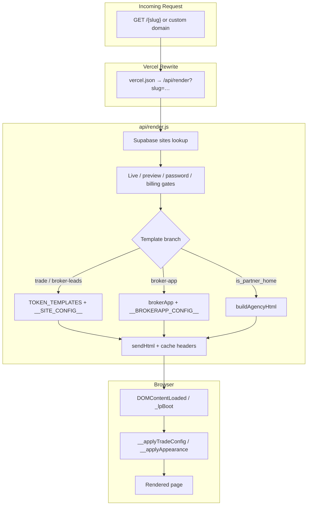
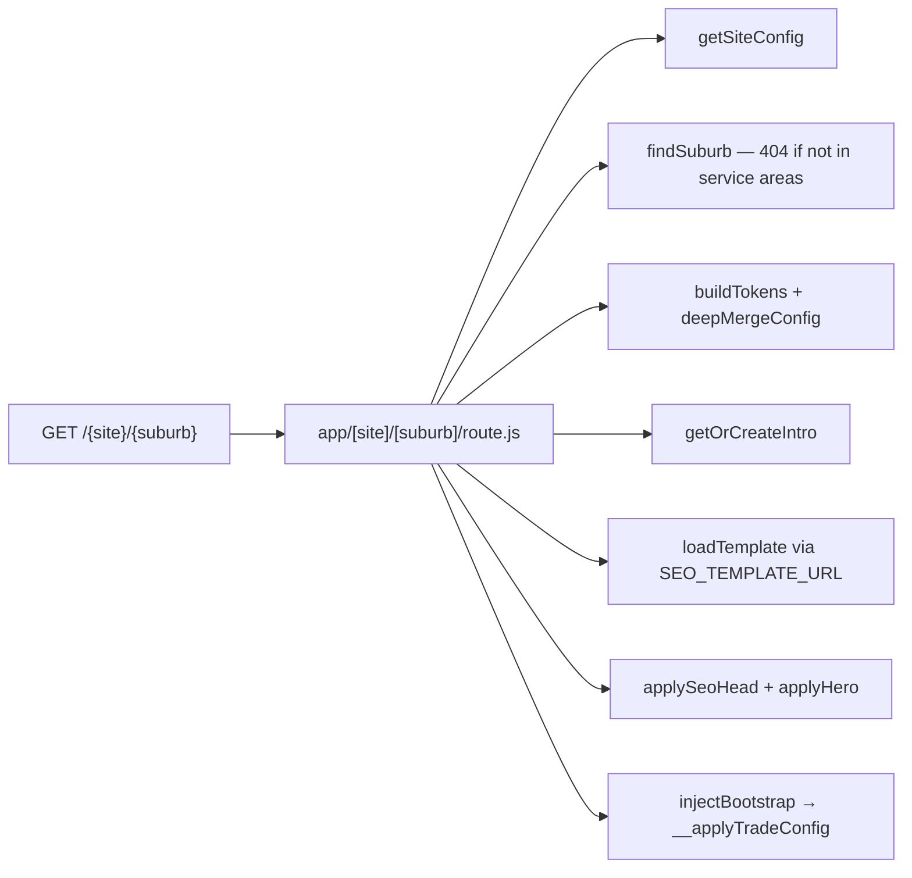
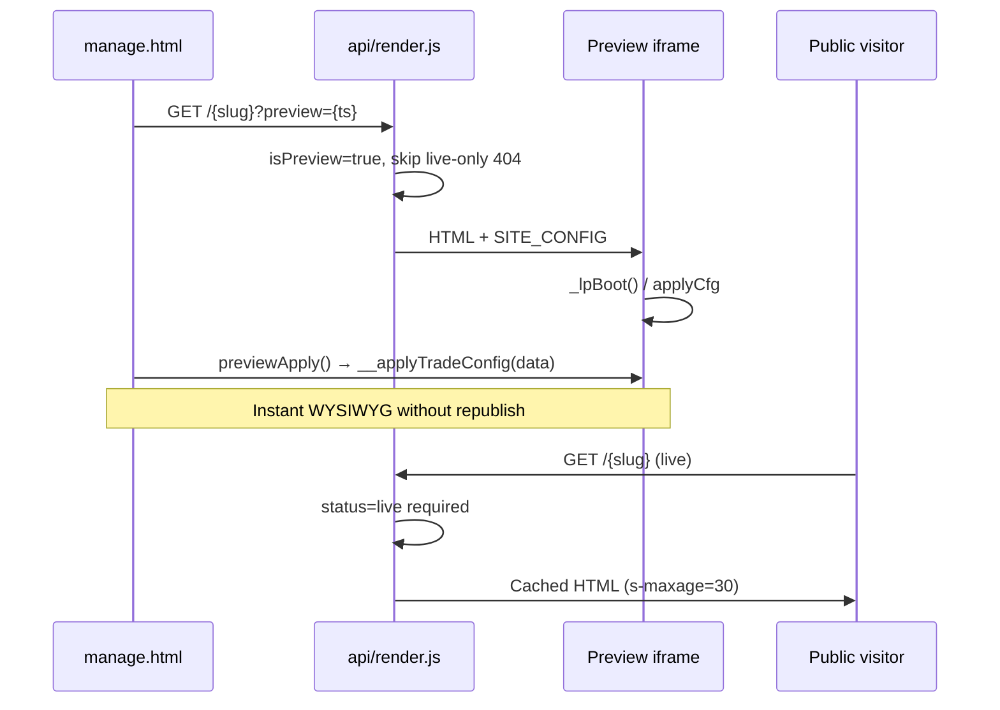

# LeadPages Template System

**Document:** `03-TEMPLATE-SYSTEM`  
**Status:** Definitive reference for tenant HTML templates and rendering  
**Audience:** Engineers building, extending, or debugging public pages; AI development agents  
**Prerequisites:** [00-VISION](00-VISION.md), [01-ARCHITECTURE](01-ARCHITECTURE.md), [02-DATABASE](02-DATABASE.md), [10-EDITOR](10-EDITOR.md)

> Tenant websites are **HTML shells + JSON config**. Templates ship as `*.template.json` files bundled into `api/render.js` at deploy time. Content lives in `sites.config` JSONB; the renderer injects config and the browser hydrates sections client-side.

---

## Executive Summary

LeadPages serves every customer website through **four template families** and **two rendering strategies**:

| Strategy | Templates | Mechanism |
|----------|-----------|-----------|
| **Token + hydration** | `trade`, `broker-leads` | Server replaces `__SITE_CONFIG__` and `{{tokens}}`; client `__applyTradeConfig` / inline JS fills sections |
| **Config blob + hydration** | `broker-app` | Server replaces `__BROKERAPP_CONFIG__`; client `__applyAppearance` + `__applyCalcs` |
| **Server assembly** | Agency (`is_partner_home`) | `buildAgencyHtml()` reads config and fills `{{TOKENS}}` in `agency.template.json` |
| **Suburb SEO (parallel)** | `trade` (fetched) | Next.js `app/[site]/[suburb]` merges `{single-brace}` tokens + AI intro |

### Why it was designed this way

| Decision | Rationale |
|----------|-----------|
| **JSON files, not React components** | Zero runtime framework on public pages; fast TTFB; templates editable as HTML |
| **Bundled at deploy** | No per-request template fetch on main render path; predictable latency |
| **Client hydration for trade** | One stable HTML shell supports 100+ trade packs and 40+ optional sections without server-side variant explosion |
| **Double-brace server tokens** | Simple string replace for identity fields (business name, phone, SEO title) before JS runs |
| **Single-brace client tokens** | Suburb SEO and copy templates use `{suburb}`, `{trade}` resolved at hydration or App Router |
| **Separate agency builder** | Partner home pages need portfolio grids and domain search — awkward to hydrate from empty shells |
| **Preview = production path** | `?preview=1` uses same `api/render.js`; editor calls hydration fns on iframe for instant WYSIWYG |

### Architectural invariants

1. **Never break live sites** — unknown `config` keys survive round-trips; templates tolerate missing images/text.
2. **No hardcoded client brands** — templates are generic; all branding comes from `sites.config`.
3. **Same HTML for preview and live** — only cache headers and gates differ.
4. **Append-only config evolution** — new section keys default safely; old sites keep working.

---

## Template Inventory

| File | `sites.template` | Size (approx.) | Top-level keys | Primary use |
|------|------------------|----------------|----------------|-------------|
| `trade.template.json` | `trade` | ~276 KB | `{ "html": "..." }` | Tradies & service businesses |
| `broker.template.json` | `broker-leads` | ~45 KB | `{ "html": "..." }` | Mortgage broker lead-gen landing |
| `brokerapp.template.json` | `broker-app` | ~158 KB | `{ "html": "..." }` | Calculator suite mini-site |
| `agency.template.json` | — (`is_partner_home`) | ~18 KB | `{ "name", "label", "html" }` | Partner web-studio homepage |

### Related reference files

| File | Role |
|------|------|
| `api/render.js` | Central serverless renderer — template selection, gates, injection |
| `marketplace/demos/demo-shared.js` | Canonical `applyCfg` / `__applyTradeConfig` reference (mirrors trade template) |
| `lib/seo/template.js` | Suburb SEO: fetch template, SSR head/hero, bootstrap hydration |
| `lib/seo/tokens.js` | `{suburb}`, `{trade}`, `deepMergeConfig` vocabulary |
| `lib/seo/store.js` | `getSiteConfig(slug)` for App Router |
| `lib/seo/suburbIntro.js` | AI intro cache in `suburb_intros` |
| `app/[site]/[suburb]/route.js` | Suburb landing pages |
| `icons.js` | `window.LP_ICONS` — SVG paths for service/section icons |
| `plumber.html` | Human-readable trade example (legacy; no `data-sec` markers) |

---

## Rendering Architecture



### Parallel path: suburb SEO



**Routing note:** Both `vercel.json` `/:slug/:page` and App Router `/{site}/{suburb}` match two-segment URLs. On Vercel, App Router filesystem routes typically take precedence — `/joes-plumbing/belconnen` may hit suburb SEO while `/joes-plumbing/my-landing-page` hits `api/render` if published in `config.pages`.

---

## `api/render.js` — Complete Reference

**File:** `api/render.js` (~700 lines)  
**Entry:** `module.exports` async handler (line 524)

### Template loading (deploy time)

```javascript
const brokerTpl   = require('../broker.template.json');
const tradeTpl    = require('../trade.template.json');
const agencyTpl   = require('../agency.template.json');
const brokerApp   = require('../brokerapp.template.json');

const TOKEN_TEMPLATES = {
  'broker-leads': brokerTpl.html,
  'trade': tradeTpl.html
};
```

Templates are **bundled into the serverless function** — no S3 or network fetch per request.

### Key constants

| Constant | Default | Purpose |
|----------|---------|---------|
| `PRIMARY_HOSTS` | `leadpages.webculture.au,leadpages.com.au` | Marketing host — `/` redirects to `/index.html` |
| `SHOWCASE_SUFFIXES` | `leadpages.com.au,leadpages.webculture.au` | Partner showcase subdomains |
| `DEFAULT_FAVICON` | Cloudinary URL | Fallback favicon when `cfg.favicon` empty |
| `SC_SELECT` | partner profile columns | Showcase page query |

### Core functions

| Function | Lines | Purpose | Inputs | Outputs | Side effects |
|----------|-------|---------|--------|---------|--------------|
| `templateFor(site)` | 73–76 | Resolve template key | `site` row | `'trade'` \| `'broker-leads'` \| `site.template` | — |
| `sendHtml(res, html, isLive)` | 48–57 | Set headers + body | response, HTML, live flag | HTTP 200 | Cache-Control, X-Robots-Tag |
| `safeJson(obj)` | 44 | JSON safe for `<script>` | object | string | Escapes `<` → `\u003c` |
| `esc(s)` | 40–41 | HTML escape | string | string | — |
| `buildAgencyHtml(site, host, demos, base)` | 285–354 | Assemble agency page | site, host, demo list | HTML string | — |
| `buildTradeHtml(site, host)` | 356–374 | Token path helper | site, host | HTML | **Unused** by main handler (duplicate logic) |
| `injectBuyBar(html, bar)` | 519–522 | Mockup sale CTA | HTML, bar HTML | HTML | — |
| `suspendedPage(res, site, tpl)` | 84–109 | Billing suspension 503 | site, system_pages content | 503 HTML | — |
| `demoGateHtml(site, tried)` | 143–157 | Preview password form | site | HTML | — |
| `showcaseHtml` / `renderShowcase` | 193–428 | Partner portfolio pages | partner profile | HTML | Supabase reads |

### Request resolution order

1. **Showcase subdomain** — `{slug}.leadpages.com.au` → `renderShowcase`
2. **Primary host `/`** — redirect to `/index.html` (never tenant page)
3. **Site lookup:**
   - Custom domain → `sites.custom_domain = Host` (path segment = sub-page)
   - Slug path → `sites.slug = ?slug`
4. **Not found** → showcase fallback or 404
5. **Gates:** live status, preview password, billing suspension
6. **Template branch:** `is_partner_home` → agency; `broker-app` → calculator; else token template

### Config merge (token templates)

```javascript
const cfg = Object.assign(
  { business: site.business_name, slug: site.slug, siteId: site.id },
  site.config || {}
);
if (template === 'trade' && !cfg.trade) cfg.trade = '';

let html = tpl.replaceAll('__SITE_CONFIG__', safeJson(cfg));
```

The browser receives:

```html
<script>const SITE_CONFIG = {"business":"Joe's Plumbing",...};</script>
```

### Sub-page routing

`/:slug/:page` or custom domain `/:page` resolves `config.pages[]` where `status === 'published'`. Unpublished or unknown slugs return **hard 404** (no soft-404).

SEO title/description for sub-pages:

```javascript
if (_pageRow.title) pageTitle = `${_pageRow.title} — ${_biz}`;
if (_pageRow.meta)  pageDesc  = _pageRow.meta;
```

### Server-side double-brace tokens

Applied after `__SITE_CONFIG__` injection (lines 676–688):

| Token | Source |
|-------|--------|
| `{{businessName}}` | `site.business_name` |
| `{{phoneText}}` | `cfg.phoneText` |
| `{{email}}` | `cfg.email` |
| `{{phone}}` | `cfg.phone` |
| `{{domain}}` | request host |
| `{{initial}}` | first letter of business name |
| `{{trade}}` | `cfg.trade` |
| `{{pageTitle}}` | `cfg.seoTitle` or computed default |
| `{{pageDesc}}` | `cfg.seoDescription` or computed default |
| `{{favicon}}` | `cfg.favicon` or `DEFAULT_FAVICON` |

**Default SEO computation** (trade):

- Title: `{business} — {trade} in Canberra & the ACT` (or without trade segment)
- Description: licensed local service copy with trade name lowercased

### Cache and indexing

| Condition | Cache-Control | Robots |
|-----------|---------------|--------|
| `status === 'live'` | `public, s-maxage=30, stale-while-revalidate=300` | template default `index,follow` |
| Draft / `?preview=` | `no-store` | `X-Robots-Tag: noindex, nofollow` |

---

## Template: `trade` (`trade.template.json`)

### Purpose

The **primary revenue template** — mobile-first landing pages for tradies and service businesses with lead capture, reviews, service areas, and 40+ optional marketing sections.

### Document structure

Single minified `html` string containing:

- **`<head>`** — `{{pageTitle}}`, `{{pageDesc}}`, `{{domain}}`, `{{favicon}}`, OG tags, fonts, JSON-LD
- **Design tokens** — CSS variables (`--pipe`, `--hivis`, `--steel`, etc.) set by hydration
- **`<main id="top">`** — section shells with `data-sec="..."` attributes
- **Embedded JS** — `applyCfg`, `__applyTradeConfig`, `_lpBoot`, lead form, analytics hooks

### Config injection

```html
<script>const SITE_CONFIG = __SITE_CONFIG__;</script>
```

Placeholder `__SITE_CONFIG__` replaced server-side with `safeJson(cfg)`.

### Section model (`data-sec`)

Every editable block is a `<section>` (or equivalent) with `data-sec="{id}"`. Hydration walks `config.sections[id]`:

| Property | Effect |
|----------|--------|
| `on: false` | `display: none` |
| `eyebrow`, `heading`, `intro` | Section header copy |
| `title`, `titleHl`, `sub` | Hero-specific fields |
| List fields at config root | `services`, `reviews`, `faq`, `crew`, etc. |

### Core sections (layout `classic`)

| ID | Purpose |
|----|---------|
| `emerg` | Emergency / urgency banner |
| `hero` | Main headline + CTAs |
| `services` | Service cards grid |
| `why` | Value proposition grid |
| `area` | Service suburbs |
| `reviews` | Testimonials + review sources |
| `quote` | Lead capture form |
| `faq` | Accordion FAQ |
| `footer` | Footer links + legal |

### Optional sections (`OPTIONAL_COMPONENTS`)

Off by default unless `sections.{id}.on === true`:

`instaGallery`, `igProjectFeed`, `lpFooter`, `beforeAfter`, `responseCards`, `projectStats`, `serviceAreas`, `reviewHighlights`, `featuredProjects`, `specialOffer`, `heroBeforeAfter`, `heroSlider`, `splitHero`, `activityCounter`, `proofStream`, `projectFeed`, `jobsFeed`, `beforeAfterFeed`, `videoReels`, `activityTimeline`, `customerReactions`, `textBox`, `navMenu`, `mobileBar`, `emergencyAvailability`, `estimateBuilder`, `finance`, `serviceAreaMap`, `certifications`, `crew`, `promotions`, `trustBar`, `serviceProcess`, and more.

**Toggle logic** (`manage.html`):

```javascript
// ON by default unless in OFF_BY_DEFAULT_SECTIONS
function _secOn(c, id) {
  return (OFF_BY_DEFAULT_SECTIONS.indexOf(id) >= 0)
    ? (s.on === true)
    : (s.on !== false);
}
```

### Layout presets (`LAYOUTS` in `manage.html`)

| Layout ID | Description | Section order highlight |
|-----------|-------------|-------------------------|
| `classic` | Default conversion page | emerg → hero → services → why → area → reviews → quote → faq → footer |
| `quote-first` | Paid traffic — quote above fold | hero + quote early |
| `photo-proof` | Before/after gallery early | `beforeAfter` after services |
| `emergency-response` | Urgency trades | `responseCards` high |
| `authority-builder` | Trust/credentials focus | certifications, crew |
| `service-area-dominator` | Geographic SEO emphasis | `serviceAreas` prominent |
| `reviews-first` | Social proof lead | reviews before quote |
| `premium-showcase` | Portfolio-led | featured projects |
| `offer-funnel` | Promotion-led | `specialOffer` |
| `ba-hero-slider` | Before/after hero | `heroBeforeAfter` |
| `hero-image-slider` | Image carousel hero | `heroSlider` |
| `social-proof-feed` | Activity feeds | `proofStream`, feeds |

Each layout defines `sections[]` order and `features[]` (optional components to enable).

### Theme tokens (`config.theme`)

| Key | CSS variable | UI role |
|-----|--------------|---------|
| `pipe` | `--pipe` | Brand / primary colour |
| `hivis` | `--hivis` | CTA buttons |
| `steel` | `--steel-900` etc. | Header/footer dark |
| `safety` | `--safety` | Badges |
| `lightBg` | `--light` | Page background |
| `presetKey` | — | Named preset id for editor |

### Hydration: `__applyTradeConfig`

Defined inside `trade.template.json` (mirrors `marketplace/demos/demo-shared.js`):

```javascript
window.__applyTradeConfig = function(_c) {
  applyCfg(_c);
  _lpFooterApply(_c);
  _lpRichWalk(document.body);
};
```

**`applyCfg(C)` responsibilities:**

1. Set `layout-{id}` class on `<html>`
2. Reorder `<main>` children via `config.sectionOrder` + CSS `order`
3. Apply theme → CSS custom properties
4. Render `services` grid from `config.services[]`
5. Apply logo (image/text modes, header styles: sticky, float, shrink)
6. Walk every `[data-sec]` — show/hide, copy, lists
7. Hero CTA wiring (`callOn`, `quoteOn`, actions, colours)
8. Optional components (sliders, feeds, maps, etc.)
9. Token replace `{{businessName}}`, `{{phoneText}}` in DOM strings
10. Single-brace tokens `{business}`, `{trade}`, `{suburb}`, … in text nodes
11. **Preview mode:** `.lp-seclabel` overlays when `?preview=` in URL

### Boot sequence

```javascript
function _lpBoot() {
  applyCfg(SITE_CONFIG);
  // wire forms, analytics, etc.
}
document.addEventListener('DOMContentLoaded', _lpBoot);
```

Editor preview calls `__applyTradeConfig(data)` on iframe `contentWindow` without reload.

---

## Template: `broker-leads` (`broker.template.json`)

### Purpose

Mortgage broker **lead-generation landing page** — fixed content structure with live repayment calculator and assessment form. Theme: "eucalypt & brass".

### Rendering model

- **Token injection** — same as trade (`__SITE_CONFIG__`, `{{businessName}}`, etc.)
- **No section hydration** — HTML copy is largely static; only calculator rates and phone links read from config
- **No `__applyTradeConfig`**

### Key sections (static HTML)

| Section | ID / anchor | Config-driven |
|---------|-------------|---------------|
| Header | `.site` | Phone links from `SITE_CONFIG.phone` |
| Hero + calculator | `#calc` | `SITE_CONFIG.rates.variableRate`, `comparisonRate` |
| Value cards | `.values` | Static |
| Steps | `.steps` | Static |
| Lenders strip | `.lenders` | Static |
| Testimonial | `.quote-wrap` | Static |
| Lead form | `#assessment` | POST `/api/leads` |
| FAQ | `.faq` | Static |
| Footer | `footer.site` | `{{businessName}}`, `{{phoneText}}`, `{{email}}` |

### Config shape

```json
{
  "rates": {
    "variableRate": 6.04,
    "comparisonRate": 6.18,
    "updatedAt": "Mar 2026",
    "rateSource": "override"
  },
  "phone": "+61…",
  "phoneText": "(02) …",
  "email": "broker@…"
}
```

### Client behaviour

- `wirePhones()` — sets `tel:` hrefs from `SITE_CONFIG.phone`
- Calculator seeds rate from `SITE_CONFIG.rates.variableRate`
- `submitLead()` → POST `/api/leads` with `kind: "broker"`
- `trackEvent()` → POST `/api/events` (non-blocking)

---

## Template: `broker-app` (`brokerapp.template.json`)

### Purpose

Full **calculator suite** mini-site — repay, borrow, stamp duty, FHOG, etc. Edited via broker-app tabs in `manage.html`.

### Config injection

```html
<script>const BROKERAPP_CONFIG = __BROKERAPP_CONFIG__;</script>
```

Server replaces `__BROKERAPP_CONFIG__` with full merged config:

```javascript
cfg.business = cfg.business || site.business_name;
cfg.slug = site.slug;
cfg.siteId = site.id;
```

### Demo bar

Placeholder `<!--DEMO_BAR-->` replaced with theme switcher when `site.slug === 'demo'` or `cfg.demo`:

```javascript
demoBar = demoBarHtml(themes); // from demo_themes table
```

### Hydration functions

| Function | Purpose |
|----------|---------|
| `window.__applyAppearance(a)` | Maps `appearance` object → CSS variables (`--brand`, `--amber`, `--panel-bg`, fonts) |
| `window.__applyCalcs(calculators)` | Show/hide calculator tabs from `config.calculators` |

Editor `previewApply()` calls `__applyAppearance(curAppr())` on iframe.

### Config shape

See [02-DATABASE](02-DATABASE.md) — `states`, `calculators`, `appearance`, `pages[]`, `scope`.

---

## Template: `agency` (`agency.template.json`)

### Purpose

**Partner web-studio homepage** — portfolio grid, domain search, services, about, contact. Used when `sites.is_partner_home === true`.

### Metadata

```json
{
  "name": "agency",
  "label": "Web studio homepage",
  "html": "…"
}
```

### Rendering: server assembly (not hydration-first)

Production uses `buildAgencyHtml()` in `api/render.js` — **not** raw template tokens alone. Function reads `site.config` and builds HTML fragments, then replaces agency tokens:

| Token | Source |
|-------|--------|
| `{{ACCENT}}` | `theme.hivis` |
| `{{INK}}` | `theme.steel` |
| `{{BRAND}}` | `theme.pipe` |
| `{{STUDIO}}` | `site.business_name` |
| `{{LOGO}}` | logo image or text |
| `{{HERO_EYEBROW}}`, `{{HERO_TITLE}}`, `{{HERO_SUB}}` | `sections.hero` |
| `{{HERO_CALL}}` | phone/email CTA |
| `{{DOMAIN_ACTION}}` | domains search URL |
| `{{SERVICES}}` | `config.services[]` grid HTML |
| `{{WORK}}` | partner demo sites cards |
| `{{ABOUT_*}}` | `sections.textBox` |
| `{{CONTACT_*}}` | contact section |
| `{{YEAR}}` | current year |

### Client preview: `__applyAgencyConfig`

Embedded at end of `agency.template.json` for editor iframe live updates — theme colours, logo, hero, services, about, contact buttons.

---

## Token Systems

LeadPages uses **three token vocabularies**. Do not mix them casually.

### 1. Config placeholders (not user-facing)

| Placeholder | Replaced with |
|-------------|---------------|
| `__SITE_CONFIG__` | Full JSON → `const SITE_CONFIG = …` |
| `__BROKERAPP_CONFIG__` | Full JSON → broker-app config |
| `<!--DEMO_BAR-->` | Demo theme bar HTML |

### 2. Double-brace `{{token}}` — server-side

Resolved in `api/render.js` (and `lib/seo/template.js` `applyTenantTokens` for suburb path):

`{{businessName}}`, `{{phoneText}}`, `{{phone}}`, `{{email}}`, `{{domain}}`, `{{initial}}`, `{{trade}}`, `{{pageTitle}}`, `{{pageDesc}}`, `{{favicon}}`

Agency-only: `{{ACCENT}}`, `{{INK}}`, `{{BRAND}}`, `{{STUDIO}}`, `{{LOGO}}`, `{{HERO_*}}`, `{{SERVICES}}`, `{{WORK}}`, `{{ABOUT_*}}`, `{{CONTACT_*}}`, `{{YEAR}}`, `{{DOMAIN_ACTION}}`

**Also during client hydration:** `{{businessName}}`, `{{phoneText}}`, `{{phone}}` in footer/reviews/hero defaults.

### 3. Single-brace `{token}` — SEO & copy templates

Defined in `lib/seo/tokens.js` `buildTokens()`:

| Token | Meaning |
|-------|---------|
| `{business}` | Business name |
| `{trade}` | Trade type (from `sections.seoTokens.trade`) |
| `{suburb}` | Target suburb |
| `{suburbs}` | Comma-separated service areas |
| `{city}` | City |
| `{region}` | State/region |
| `{phone}` | Phone |
| `{year}` | Current year |

Used in:

- `sections.seoTokens.titleTemplate`, `metaTemplate`
- `deepMergeConfig()` for suburb pages
- DOM text walk during `applyCfg`

---

## Config → Template Mapping

Full schema: [02-DATABASE](02-DATABASE.md) § Configuration Storage.

### Merge rules

1. Server adds `business`, `slug`, `siteId` to every config blob.
2. Editor mutates in-memory `data`; `publishToDB()` writes to `sites.config`.
3. `siteConfigForSave()` strips editor-only keys (`savedThemes`, `users`) for broker-app publish.
4. Unknown keys **must survive** — templates and hydration ignore what they don't understand.

### `sectionOrder`

Array of section IDs controlling DOM order. Layout preset provides default; user reorder persists in config. Hydration applies CSS `order` on `<main>` children.

### List schemas

Repeatable content (services, reviews, FAQ, crew, slides, etc.) stored as arrays at `config` root or under `sections.{id}`. Editor `listEditor()` and hydration `rlist()` share field conventions: `on`, `title`, `body`, `icon`.

---

## Preview vs Production



| Aspect | Production | Preview |
|--------|------------|---------|
| URL | `/{slug}` | `/{slug}?preview=1` |
| Gate | `status === 'live'` | Draft/mockup visible |
| Cache | CDN 30s + SWR | `no-store` |
| Robots | index | noindex |
| HTML source | Same `api/render.js` | Same |
| Instant edits | Requires publish | `previewApply()` hydration |
| Section labels | Hidden | `.lp-seclabel` overlays |

**No postMessage** — editor calls same-origin `contentWindow.__applyTradeConfig` directly.

---

## Suburb SEO Pipeline (`lib/seo/*`)

Separate from main renderer — used by `app/[site]/[suburb]/route.js`.

### `loadTemplate()`

Fetches `trade.template.json` from `SEO_TEMPLATE_URL` env (CDN-cached). Unlike `render.js`, this path **does** network-fetch the template.

### `applyTenantTokens(html, tok, host)`

Replaces `{{businessName}}`, `{{phoneText}}`, `{{domain}}`.

### `applySeoHead(html, { title, description, canonical, image, robots })`

Server-renders `<title>`, meta description, canonical, OG tags — **crawlers see localized SEO in raw HTML**.

### `applyHero(html, { title, titleHl, intro })`

Server-renders hero H1 and intro paragraph for suburb uniqueness.

### `injectBootstrap(html, mergedConfig)`

Appends script that polls for `window.__applyTradeConfig` and calls it with suburb-merged config.

### `findSuburb(config, slug)`

Returns suburb name only if slug matches a **real** entry in `sections.serviceAreas.areas` — prevents doorway pages for unserved locations.

### `getOrCreateIntro(site, suburb, tok)`

Anthropic-generated intro cached in `suburb_intros` table; becomes hero subheading.

---

## `icons.js`

**File:** `icons.js` (~307 KB)  
**Export:** `window.LP_ICONS` — map of icon slug → SVG path data

Used by:

- Trade template hydration (`lpIcon()`)
- Editor section icon picker
- Marketplace demos

Icons referenced by slug in `config.services[].icon` (e.g. `"wrench"`).

---

## Showcase & Partner Pages

Not tenant templates but rendered by `api/render.js`:

| Mode | Trigger | Output |
|------|---------|--------|
| Showcase subdomain | `{slug}.leadpages.com.au` | Partner portfolio or agency home |
| Showcase path | `leadpages.com.au/{showcase-slug}` | Same |
| Custom domain showcase | `partner_profiles.showcase_domain` | Studio page |

`showcaseHtml()` — built-in HTML for partners without `is_partner_home` site.  
`buildAgencyHtml()` — when partner has `is_partner_home` site row.

---

## Buy Bar (Mockup Sales)

Injected on priced mockups (`is_mockup && sale_price > 0 && partner_id`):

- `buyBarHtml()` — fixed bottom CTA + Stripe checkout modal
- POST `/api/partner/buy-site`

---

## Function Reference — Hydration & SEO

| Function | Location | Signature | Purpose |
|----------|----------|-----------|---------|
| `applyCfg` | trade template / demo-shared.js | `(C) => void` | Full trade page hydration |
| `__applyTradeConfig` | trade template | `(_c) => void` | Public API for editor + bootstrap |
| `__applyAppearance` | brokerapp template | `(a) => void` | Broker-app theme CSS vars |
| `__applyCalcs` | brokerapp template | `(calcs) => void` | Calculator visibility |
| `__applyAgencyConfig` | agency template | `(cfg) => void` | Agency preview updates |
| `loadTemplate` | lib/seo/template.js | `async () => html` | Fetch trade template for suburbs |
| `applyTenantTokens` | lib/seo/template.js | `(html, tok, host) => html` | Double-brace replace |
| `applySeoHead` | lib/seo/template.js | `(html, seo) => html` | SSR head tags |
| `applyHero` | lib/seo/template.js | `(html, hero) => html` | SSR hero content |
| `injectBootstrap` | lib/seo/template.js | `(html, cfg) => html` | Client hydration script |
| `buildTokens` | lib/seo/tokens.js | `(config, suburb) => tok` | Single-brace map |
| `deepMergeConfig` | lib/seo/tokens.js | `(config, tok) => config` | Resolve all `{tokens}` in strings |
| `findSuburb` | lib/seo/tokens.js | `(config, slug) => name\|null` | Service area guard |
| `mergeStr` | lib/seo/tokens.js | `(str, tok) => str` | Single string token replace |

---

## Rules for Template Changes

From product intent and production constraints:

1. **Existing sites must not break** — new sections default off or inherit safe defaults.
2. **Missing images/text** — hydration shows placeholders or hides blocks; no thrown errors.
3. **Unknown config fields preserved** — never delete keys in editor or publish.
4. **Templates stay generic** — no client-specific hardcoding in shared files.
5. **Token renames** — keep old tokens working or migrate with care; dual-support during transition.
6. **New `data-sec` IDs** — add to `DEFAULT_TRADE_SECTIONS`, `OPTIONAL_COMPONENTS` if needed, and `applyCfg` branch.
7. **Test preview + live** — same HTML path; verify hydration handles empty config.
8. **Bundle size** — `trade.template.json` is already ~276 KB; avoid gratuitous inline assets.

### Checklist for new trade section

- [ ] HTML shell with `data-sec="{id}"` in `trade.template.json`
- [ ] `applyCfg` branch in template JS (and `demo-shared.js` if used for demos)
- [ ] `DEFAULT_TRADE_SECTIONS[id]` defaults in `manage.html`
- [ ] `OFF_BY_DEFAULT_SECTIONS` if opt-in
- [ ] Editor subtab / `secCard` + `wireSec` / `listEditor` in `manage.html`
- [ ] Document in [02-DATABASE](02-DATABASE.md) and [10-EDITOR](10-EDITOR.md)

---

## Performance Strategy

| Technique | Where | Effect |
|-----------|-------|--------|
| Bundled templates | `require()` in render.js | Zero template fetch latency |
| CDN cache (live) | `sendHtml` 30s + SWR 300s | Edge caching for tenant HTML |
| No React on public pages | All templates | Minimal JS payload vs SPA |
| Client hydration once | `_lpBoot` on load | No SSR per-section cost |
| `force-cache` template fetch | suburb SEO path | Reuse CDN-cached template JSON |
| 24h suburb page cache | App Router response | `s-maxage=86400` |

**Cold start note:** `render.js` bundles all templates (~500 KB+ JS string). One function for all types avoids multiplying cold starts.

---

## Security Considerations

| Risk | Mitigation |
|------|------------|
| `</script>` breakout | `safeJson()` escapes `<` |
| XSS in user copy | `esc()` on server tokens; hydration uses `esc()` on inserted text |
| Preview password bypass | SHA1 cookie `lp_pw_{slug}`; HttpOnly |
| Draft site leakage | 404 without `?preview=` |
| Suburb doorway pages | `findSuburb` 404 guard |
| Service role in render | Required for reliable public serve; no user input in SQL |

---

## Technical Debt

| Item | Impact | Notes |
|------|--------|-------|
| `buildTradeHtml` unused | Confusion | Duplicate of main handler logic |
| `trade.template.json` monolith | Maintainability | 276 KB single line; hard to diff |
| `demo-shared.js` duplication | Drift risk | Should stay in sync with template embedded JS |
| Dual token systems | Cognitive load | `{{}}` vs `{}` documented here |
| No template versioning | Upgrade risk | All sites get latest template on deploy |
| `plumber.html` legacy | Confusion | Not used in production path |
| App Router vs render collision | Routing ambiguity | Two-segment URL precedence |
| Suburb path fetches template | Extra latency | Unlike bundled render path |

---

## Future Improvements

From [00-VISION](00-VISION.md) and [13-ROADMAP](13-ROADMAP.md):

- **Template versioning** — pin template at site creation
- **JSON Schema** for `sites.config` per template
- **Component extraction** — gradual modularization of trade sections
- **Visual regression tests** — core templates per layout
- **Unify hydration** — single `applyCfg` source imported by template
- **Reduce bundle size** — externalize rarely-used section JS
- **Explicit routing table** — resolve suburb vs sub-page collision

---

## Related Documentation

| Doc | Topic |
|-----|-------|
| [01-ARCHITECTURE](01-ARCHITECTURE.md) | Platform architecture, render pipeline overview |
| [02-DATABASE](02-DATABASE.md) | `sites.config` schema, section keys |
| [04-SITE-BUILDER](04-SITE-BUILDER.md) | Site builder product surface |
| [08-SEO](08-SEO.md) | SEO system, suburb pages, tokens |
| [10-EDITOR](10-EDITOR.md) | Editor preview, publish, trade subtabs |
| [11-DESIGN-SYSTEM](11-DESIGN-SYSTEM.md) | Visual tokens, typography |

---

## Summary

The LeadPages template system is **config-driven HTML**:

1. **Four template files** cover trade, broker-leads, broker-app, and agency partner homes.
2. **`api/render.js`** selects template, applies gates, injects config, replaces tokens, sets cache headers.
3. **Trade sites hydrate client-side** via `__applyTradeConfig` / `applyCfg` walking `data-sec` markers.
4. **Broker-leads** is mostly static HTML with calculator + leads wired to config.
5. **Broker-app** hydrates appearance and calculator visibility.
6. **Agency** is server-assembled HTML with optional client preview hydration.
7. **Suburb SEO** is a parallel Next.js path using `lib/seo/*` for SSR head + token merge.

A developer rebuilding this system needs: **JSONB config**, **bundled HTML shells**, **a single render function with explicit branches**, **client hydration for variable sections**, and **strict config backwards compatibility**.

---

*Document maintained as part of the LeadPages engineering canon. Update when templates or `api/render.js` behavior changes.*
