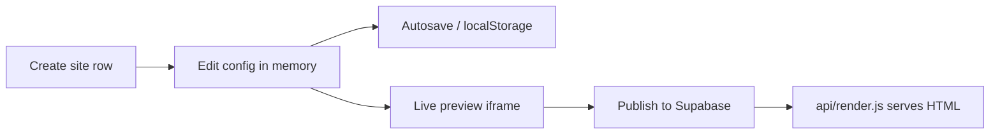
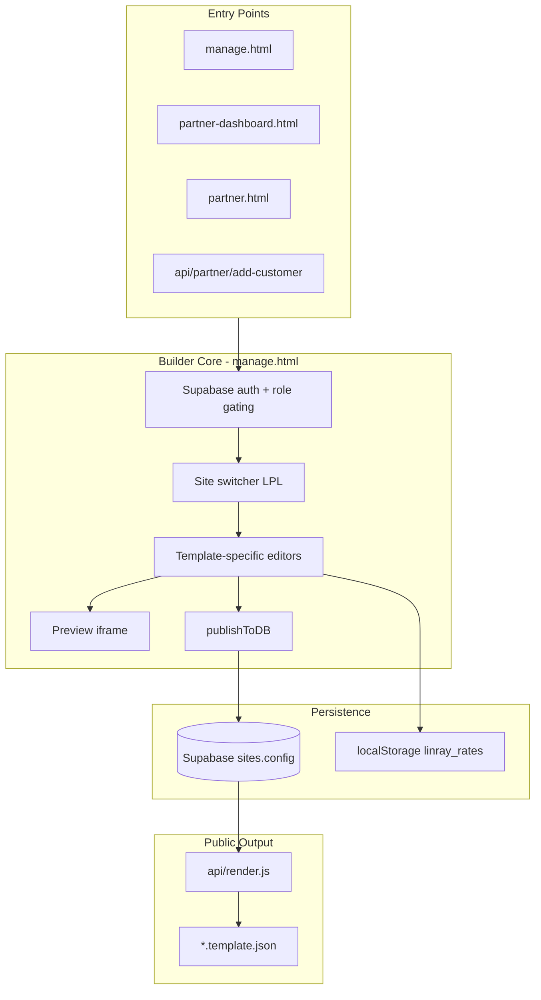
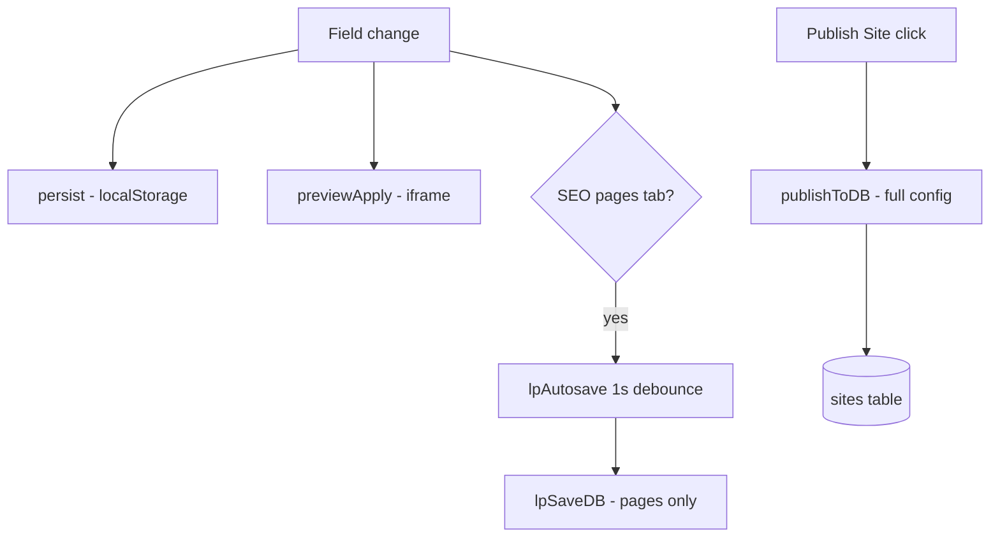
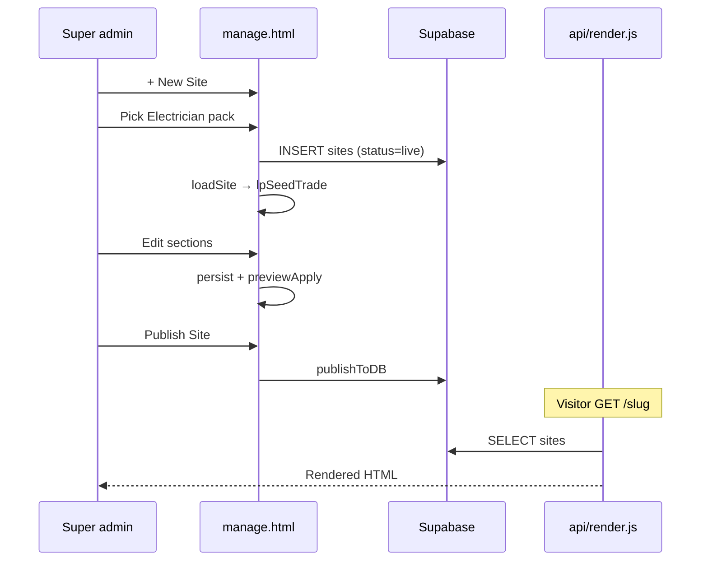

# LeadPages Site Builder

**Document:** `04-SITE-BUILDER`  
**Status:** Definitive reference for site creation, configuration, and publishing  
**Audience:** Engineers and product owners building or extending the site builder  
**Prerequisites:** [00-VISION](00-VISION.md), [01-ARCHITECTURE](01-ARCHITECTURE.md), [02-DATABASE](02-DATABASE.md), [03-TEMPLATE-SYSTEM](03-TEMPLATE-SYSTEM.md), [10-EDITOR](10-EDITOR.md)

> The **production site builder** is `manage.html` — the App Command Centre where sites are created, edited, previewed, and published. Partners also create sites via `partner-dashboard.html` and `partner.html`, then edit in the same builder.

---

## Executive Summary

LeadPages site building follows a simple lifecycle:



### Why this model

| Decision | Rationale |
|----------|-----------|
| **One `sites` row per website** | Partners and clients understand "one site = one record" |
| **`sites.config` JSONB** | Ship new sections without schema migrations for every content tweak |
| **Explicit publish (trade)** | Prevents half-edited sections reaching visitors |
| **Draft + live status** | Partners control when clients go public |
| **Trade packs at creation** | New tradie sites launch with professional defaults in seconds |
| **Same builder for all templates** | One `manage.html` with role × template gating |

### Site types

| `sites.template` | Product name | Builder focus |
|------------------|--------------|---------------|
| `trade` | Trade landing page | 40+ sections, trade packs, marketplace apps |
| `broker-leads` | Broker lead page | Details + rates + mailer |
| `broker-app` | Calculator suite | Rates, appearance, calculators, SEO pages |

Special flags on `sites`:

| Flag | Effect |
|------|--------|
| `is_partner_home` | Agency homepage — not edited as trade |
| `is_mockup` | Demo for sale — buy bar, no owner |
| `is_demo` | Demo calculator themes |
| `status` | `live` vs `draft` — public visibility gate |

---

## Site Builder Architecture



---

## Site Creation

### Super-admin: `openCreateSite()` → `createSiteSubmit()`

**Location:** `manage.html` (~2878–2950)

**Modal fields:**

| Field | ID | Purpose |
|-------|-----|---------|
| Business name | `#cs-biz` | `sites.business_name` |
| Web address | `#cs-slug` | `sites.slug` — auto-generated until manually edited |
| Type | `#cs-tpl` | `trade` \| `broker-leads` \| `broker-app` |
| Trade pack | `#cs-pack` | Shown when type = trade |
| Phone, email, region | — | Seed `config` |

**Slug validation:**

- `csCleanSlug(v)` — lowercase, hyphenate
- `csCheckSlug()` — debounced uniqueness against `sites.slug`
- `csSuggest()` — offers `slug-2`, `slug-3` on collision

**Insert payload:**

```javascript
{
  slug, business_name, template,
  config: { phone, phoneText, email, region, /* + trade pack */ },
  status: 'live',  // super-admin creates live immediately
  vertical: template.startsWith('broker') ? 'broker' : 'trade'
}
```

**Trade pack merge:** `packToConfig(packKey, businessName)` substitutes `{{businessName}}` in pack copy and copies `theme`, `services`, `sections`, `trade`.

### Partner: `partner-dashboard.html`

Direct Supabase insert:

- `status: 'draft'`
- Minimal `config`
- `referring_partner_id`, `servicing_partner_id` stamped
- Redirect: `/manage?site={slug}`

### Partner: `POST /api/partner/add-customer`

**File:** `api/partner/add-customer.js`

- `template: 'trade'`, `status: 'draft'`
- Partner IDs on site row
- Optional `partner_themes` seed
- `_intake` metadata in config

### Partner: `POST /api/partner/add-mockup`

Creates `is_mockup: true` demo for showcase and sale.

### Partner: `POST /api/partner/ensure-home`

Creates `is_partner_home: true` agency site for partner portfolio URL.

### Legacy: `api/create-site.js`

Password-gated API — prefer UI flows above.

---

## Trade Packs & Service Packs

### In-memory catalogue: `TRADE_PACKS`

**Location:** `manage.html` (~2130+)

Large object keyed by slug (`electrician`, `plumber`, `hvac`, …). Each pack:

```javascript
{
  label: "Electrician",
  tradeType: "Electrician",
  theme: { pipe, hivis, steel, safety },
  services: [ { on, icon, title, body } × 6 ],
  sections: { header, emerg, hero, services, why, area, reviews, quote, faq, footer, ... }
}
```

**Supporting constants:**

| Constant | Purpose |
|----------|---------|
| `TRADE_COLOUR_PRESETS` | Colour library per trade category |
| `DEFAULT_TRADE_SECTIONS` | Fallback defaults for ~40 section types |
| `LAYOUTS` | 12 layout presets (classic, quote-first, …) |
| `__TRADE_CATS` | 14 categorized trade lists for picker UI |
| `OFF_BY_DEFAULT_SECTIONS` | Opt-in optional components |

### Database: `service_packs` table

| Column | Purpose |
|--------|---------|
| `slug` | Unique pack id |
| `category` | Picker category |
| `label` | Display name |
| `pack` | JSONB — same shape as `TRADE_PACKS` entry |
| `variant`, `use_count`, `is_approved`, `generated_by` | AI variant tracking |

**Boot flow:** `lpLoadServicePacks()` merges DB rows into `TRADE_PACKS` via `__registerTradePack()`.

**Super-admin trade builder:** Settings overlay — paste JSON → `__wireTradeBuilder()` → `lpSaveServicePack()`.

**AI generation:** `POST /api/api-trade-generate` — Claude drafts pack → validate → insert `service_packs`.

### Key functions

| Function | Purpose |
|----------|---------|
| `packToConfig(key, biz)` | Pack → site config for creation |
| `applyTradePack(key)` | Load pack into current editor `data` |
| `themeFromPreset(tradeKey)` | Map trade → theme colours |
| `lpSeedTrade(d)` | Fill missing section keys from defaults |
| `__initTradePicker(opts)` | Searchable picker (create modal) |
| `__initTradePicker2(opts)` | Two-pane picker (settings) |
| `__registerTradePack(slug, cat, pack)` | Register in memory + `__TRADE_CATS` |
| `lpLoadServicePacks(cb)` | Load DB packs on boot |
| `lpSaveServicePack(slug, cat, pack)` | Upsert to `service_packs` |
| `__buildTradePrompt(name, cat)` | AI prompt for trade generation |

---

## Editing Model

### In-memory state

| Symbol | Purpose |
|--------|---------|
| `data` | Working copy of `sites.config` (+ broker rates) |
| `currentSiteId` | Active site UUID |
| `currentSiteTemplate` | `trade` \| `broker-leads` \| `broker-app` |
| `currentRole` | `super` \| `broker` \| `leads` |

### `loadSite(site)` (~2146)

1. Set globals from site row
2. **broker-app:** merge `DEFAULT_RATES` + config → `init()` rates editor
3. **trade:** `lpSeedTrade(data)` — fill missing sections
4. **trade:** `_reconcileSiteApps()` — merge marketplace apps into `config.sections`
5. `applyTemplateChrome()` — broker bar vs command card
6. `applyRoleGating()` → `showView()` first allowed tab
7. `ensureSiteBar()` — publish/preview/settings buttons

### Template-specific editor tabs

```javascript
TEMPLATE_NAV = {
  'broker-app': ['rates','landing','appearance','contact','logo','users','demothemes','mailer'],
  'broker-leads': ['details','mailer'],
  'trade': ['dashboard','details','landing','apps','mailer']
};
```

Effective tabs = `ALLOWED[currentRole] ∩ TEMPLATE_NAV[template]`.

See [10-EDITOR](10-EDITOR.md) for complete navigation hierarchy.

---

## Persistence Tiers



| Tier | Function | Scope | When |
|------|----------|-------|------|
| **Local backup** | `persist()` | Full `data` → `localStorage` key `linray_rates` | Every edit |
| **Autosave** | `lpSaveDB()` via `lpAutosave()` | `config.pages` only | SEO landing pages tab, 1s debounce |
| **Publish** | `publishToDB()` | Full config + metadata | User clicks Publish Site |

### `publishToDB()` (~4046)

**broker-app:**

```javascript
{ config: siteConfigForSave(), updated_at }
// siteConfigForSave strips: users, states, savedThemes
```

**trade / broker-leads:**

```javascript
{
  config: data,
  business_name: currentBusinessName,
  custom_domain: currentCustomDomain,
  owner_email: currentOwnerEmail,  // super only
  updated_at
}
```

**Does not update `sites.status`.** Toast: "Published — live on your site".

### Partner live gate

Partners additionally toggle `sites.status` between `live` and `draft` in `partner.html` — separate from config publish.

| Action | Effect |
|--------|--------|
| Builder Publish | Writes `config` — content on DB |
| Partner Publish | Sets `status: 'live'` — publicly visible |
| Partner Unpublish | Sets `status: 'draft'` — 404 without `?preview=` |

---

## Preview System

| Function | Purpose |
|----------|---------|
| `previewOpen()` / `previewClose()` | Toggle `#lp-prev-dock` |
| `previewLoad()` | `iframe.src = '/{slug}?preview=' + Date.now()` |
| `previewApply()` | Hydrate iframe: `__applyTradeConfig`, `__applyAppearance`, `__applyAgencyConfig` |
| `previewDock()` | Side panel if viewport ≥ 1680px |
| `lpLiveUrl()` | Public URL (custom domain or `leadpages.com.au/{slug}`) |

Preview uses **same `api/render.js` path** as production with `?preview=1` bypassing live-only gate. Instant edits via same-origin hydration — no postMessage.

See [03-TEMPLATE-SYSTEM](03-TEMPLATE-SYSTEM.md) § Preview vs Production.

---

## Marketplace Integration

Trade sites support marketplace apps via `site_apps` table.

**`_reconcileSiteApps()`** on `loadSite()`:

1. Fetch `/api/api-site-apps?siteId=…`
2. Merge enabled apps into `config.sections` and `sectionOrder`
3. Paid apps without subscription get `__ghost` flag (visible in editor, hidden on live)

**`_toggleApp(appId, on)`** — POST `api-site-apps`, may trigger Stripe for paid apps.

---

## Partner Templates

Saved layout presets in `partner_templates` table.

**`_applyPartnerTemplate(name)`** — load saved config fragment into current site.

**API:** `/api/api-partner-templates.js` (known auth gap — see [01-ARCHITECTURE](01-ARCHITECTURE.md)).

---

## Site Lifecycle Flows

### Super-admin: create trade site



### Partner: onboard client

1. `partner.html` → Add customer → draft site with partner IDs
2. Open builder → `/manage?site={slug}`
3. Customize → Publish Site (config)
4. `partner.html` → Publish (status = live)
5. Client signs in with `owner_email` → limited editor access

### Broker calculator app

1. Create type `broker-app`
2. `loadSite` → `DEFAULT_RATES` merge → rates editor
3. Edit appearance, calculators, demo themes
4. Preview → `__applyAppearance` live
5. Publish → full calculator config

---

## Related Surfaces

| File | Role |
|------|------|
| `manage.html` | **Primary builder** |
| `api/manage.html` | Legacy duplicate — avoid editing |
| `partner-dashboard.html` | Partner site grid, deep-link to builder |
| `partner.html` | Client CRUD, publish/unpublish, mockups, quotes |
| `manage-domains.html` | Domain linking (opened from builder) |
| `billing.html` | Hosting plans (`openBillingPage`) |
| `marketplace.html` | App registry for trade sites |
| `builder.html` | Legacy simpler builder UI |

---

## Database Touchpoints

| Table | Builder usage |
|-------|---------------|
| `sites` | CRUD — all site data |
| `profiles` | Role (`is_super_admin`) |
| `service_packs` | Trade starter catalogue |
| `site_apps` | Marketplace placement |
| `site_backups` | Config snapshots (`lpBk*`) |
| `leads`, `events` | CRM + analytics strips |
| `domains` | Domain chips |
| `demo_themes`, `partner_themes` | Theme libraries |
| `partner_templates` | Saved layout presets |
| `billing_plans`, `billing_customers` | Hosting billing gate |

---

## Image & Media

Cloudinary pipeline in builder:

| Function | Purpose |
|----------|---------|
| `cwToken()` | Get signed upload params |
| `cwUpload(file, folder)` | Upload to Cloudinary |
| `cwDelete(publicId)` | Remove asset |
| `cwPick(opts)` | File picker + upload |

Used in logos, section images, SEO page hero images, gallery sections.

---

## Backups & Recovery

| Function | Purpose |
|----------|---------|
| `lpBkSave()` | INSERT `site_backups` snapshot |
| `lpBkLoad(id)` | Restore config from backup |
| `lpBkOpen()` | Backup panel UI |
| `lpBkDelete(id)` | Remove backup row |

---

## Scope Checklist (Demo Projects)

| Function | Purpose |
|----------|---------|
| `lpScopeOpen()` | Demo scope panel |
| `lpScopeToggle(item)` | Check off deliverables |
| `lpScopeSave()` | Persist `config.scope` |

Used for partner mockup project tracking.

---

## Public Visibility Gates

From `api/render.js` — what makes a published config actually visible:

| Gate | Rule |
|------|------|
| `sites.status` | Must be `live` (unless `?preview=1`) |
| `preview_password` | Per-demo password cookie |
| `billing_status` | `suspended` → 503 page |
| `config.pages[].status` | Sub-pages must be `published` |

---

## Safe Improvement Path

From product intent — how to evolve the builder without breaking sites:

1. **Document** behaviour before changing (this doc series)
2. **Group settings** in UI without removing options
3. **Extract CSS/JS** incrementally if needed
4. **Add integration tests** for create → publish → render
5. **Framework migration** only with explicit approval ([00-VISION](00-VISION.md))

### Editor rules (non-negotiable)

- Do not remove settings — reorganise only
- Preserve all functionality when refactoring UI
- Never wipe `config` or unknown keys
- Test preview + live render after template changes

---

## Technical Debt

| Item | Notes |
|------|-------|
| `api/manage.html` duplicate | Same as root `manage.html` |
| Monolithic `manage.html` | ~5,400 lines — see [10-EDITOR](10-EDITOR.md) |
| `vertical` vs `template` | Legacy column; rendering uses `template` |
| Publish vs status split | Confusing for partners — two-step go-live |
| `api-partner-templates` no auth | Security gap |

---

## Related Documentation

| Doc | Topic |
|-----|-------|
| [10-EDITOR](10-EDITOR.md) | Complete editor manual |
| [03-TEMPLATE-SYSTEM](03-TEMPLATE-SYSTEM.md) | Templates and rendering |
| [05-PARTNERS](05-PARTNERS.md) | Partner workflows |
| [02-DATABASE](02-DATABASE.md) | `sites.config` schema |
| [08-SEO](08-SEO.md) | SEO pages and suburb routes |

---

## Summary

The LeadPages site builder is **`manage.html`** plus partner creation surfaces:

1. **Create** a `sites` row with template, trade pack seed, and partner attribution.
2. **Edit** in-memory `data` mirroring `sites.config`.
3. **Preview** via same-origin iframe hydration.
4. **Persist** through localStorage, optional SEO autosave, and explicit Publish.
5. **Go live** via `sites.status` (partner) and public render via `api/render.js`.

A developer rebuilding the builder needs: Supabase auth, JSONB config, template hydration, trade pack seeding, and role-aware navigation.

---

*Document maintained as part of the LeadPages engineering canon.*
