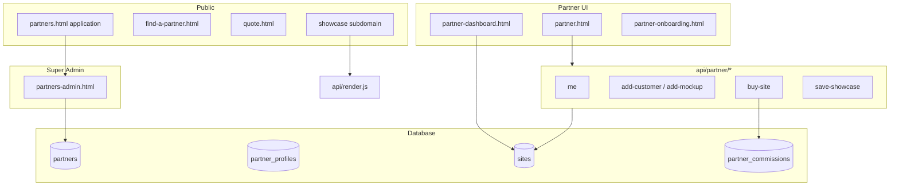
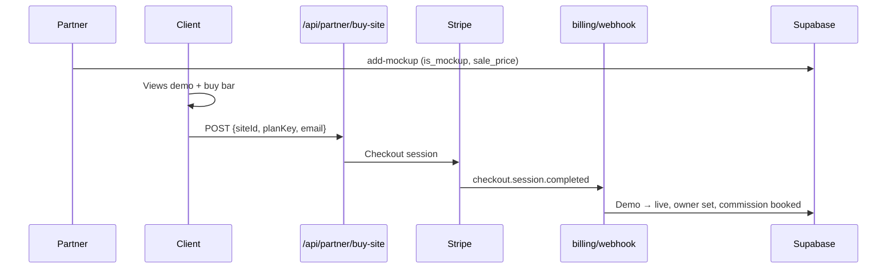
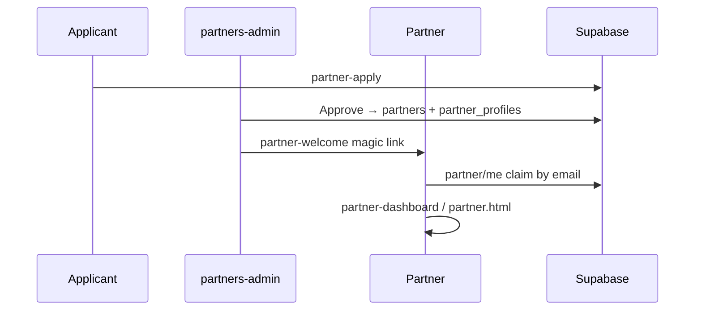

# LeadPages Partner System

**Document:** `05-PARTNERS`  
**Status:** Definitive reference for agencies, resellers, and partner economics  
**Audience:** Engineers, partner operators, super-admins  
**Prerequisites:** [00-VISION](00-VISION.md), [02-DATABASE](02-DATABASE.md), [04-SITE-BUILDER](04-SITE-BUILDER.md)

> Partners generate and support client sites while LeadPages owns the platform. Clients may see the partner as primary support; billing and infrastructure remain with LeadPages.

---

## Executive Summary

The partner system enables agencies to:

- Create and manage **client sites** (draft → live)
- Build **mockups** for sale with showcase portfolio
- Earn **commissions** on build sales and recurring hosting
- Present a **local support face** via `partner_profiles`
- Operate a **showcase homepage** on subdomain or custom domain

### Business rules (non-negotiable)

| Rule | Rationale |
|------|-----------|
| **Do not change partner ownership logic without approval** | Commissions and transfers are legally sensitive |
| **Partners invoice clients directly** | LeadPages takes flat platform cost, not revenue split on partner pricing |
| **LeadPages remains platform owner** | Infrastructure, billing collection, templates |
| **Commissions must be auditable** | `partner_commissions` ledger |
| **Client transfers are logged** | `client_transfer_events` + `partner_audit_logs` |

---

## Partner Architecture



---

## Database Tables

### `partners`

Reseller/agency account.

| Field | Purpose |
|-------|---------|
| `id` | UUID PK |
| `user_id` | → `profiles.id` (claim-by-email if null) |
| `display_name`, `email`, `phone` | Identity |
| `status` | `active` \| `suspended` \| `terminated` — gates all partner APIs |
| `application_id` | → `partner_applications.id` |

### `partner_profiles`

Extended settings per partner.

| Field | Purpose |
|-------|---------|
| `partner_id` | FK → `partners.id` |
| `showcase_slug` | Subdomain slug (`studio.leadpages.com.au`) |
| `showcase_domain` | Custom showcase domain |
| `showcase_enabled` | Must be true to serve showcase |
| `showcase_headline`, `showcase_config` | JSON: logo, intro, accent |
| `showcase_password`, `showcase_protected` | Optional gate |
| `support_name`, `support_email`, `support_phone` | Shown to clients |
| `default_plan_key` | Fallback hosting plan for buy-site |
| `gst_registered`, `abn` | Affects commission split |

### `partner_leads`

Platform-wide business enquiries (not routed to specific partner in DB).

| Field | Purpose |
|-------|---------|
| `business_name`, `contact_name`, `email`, `phone` | Contact |
| `suburb`, `state`, `message` | Enquiry |

**API:** `POST /api/partner-lead` — origin-gated to leadpages domains.

### `partner_onboarding`

Training step progress.

| Step key | Label |
|----------|-------|
| `welcome` | Welcome |
| `platform_tour` | Platform tour |
| `demo_site` | Demo site |
| `first_template` | First template |
| `first_client` | First client |
| `directory_listed` | Directory listed |

### `partner_directory`

Public "Find a Partner" listings.

| Field | Purpose |
|-------|---------|
| `partner_id` | FK |
| `business_name`, `suburb`, `state`, `postcode` | Location |
| `blurb`, `website_url`, `photo_url` | Listing |
| `is_live` | Public visibility |
| `sort_order` | Display order |

### Related tables

| Table | Purpose |
|-------|---------|
| `partner_applications` | Incoming applications |
| `partner_quotes` | Tokenised client quotes |
| `partner_commissions` | Build + recurring ledger |
| `partner_themes` | Saved themes for mockups |
| `partner_templates` | Saved marketplace layouts |
| `client_transfer_events` | Ownership transfers |
| `partner_audit_logs` | Admin audit trail |

---

## Site Attribution (`sites` table)

Three distinct partner FKs:

| Field | Meaning | Used for |
|-------|---------|----------|
| `referring_partner_id` | Partner who **sold** the client | Build commission |
| `servicing_partner_id` | Partner who **supports** the client | Support contact, showcase demos |
| `commission_partner_id` | Partner who **earns recurring** | Recurring commission (may differ after transfer) |

**Related site fields:**

| Field | Purpose |
|-------|---------|
| `servicing_status` | `partner_serviced` \| `leadpages_direct` |
| `recurring_commission_active` | `false` stops recurring commissions |
| `is_mockup` | Demo for sale |
| `is_partner_home` | Agency homepage |
| `show_on_showcase` | Visible on partner portfolio |
| `sale_price` | One-off build price (cents) |
| `owner_email`, `owner_user_id` | Client ownership (set on purchase) |

**Default on partner-created sites:** both `referring_partner_id` and `servicing_partner_id` = creating partner.

---

## API Endpoints

### Authenticated (`/api/partner/*`)

| Endpoint | Method | Purpose |
|----------|--------|---------|
| `/api/partner/me` | GET | Resolve identity; claim-by-email; ensure profile row |
| `/api/partner/add-customer` | POST | Create real client site (draft) |
| `/api/partner/add-mockup` | POST | Create demo (`is_mockup=true`) |
| `/api/partner/ensure-home` | POST | Create/return partner homepage |
| `/api/partner/quote-create` | POST | Tokenised quote + email |
| `/api/partner/save-showcase` | POST | Save showcase settings |
| `/api/partner/showcase-check` | GET | Slug availability |

**Auth gate:** Bearer JWT + `partners.status === 'active'`.

### Public

| Endpoint | Method | Purpose |
|----------|--------|---------|
| `/api/partner/quote-get?t=` | GET | Load quote for `/quote` page |
| `/api/partner/buy-site` | POST | Stripe checkout for demo purchase |

### Adjacent APIs

| Endpoint | Purpose |
|----------|---------|
| `/api/partner-apply` | Partner program application |
| `/api/partner-directory` | Public directory (`?state=ACT`) |
| `/api/partner-directory-self` | Partner's own listing CRUD |
| `/api/partner-onboarding` | Onboarding progress |
| `/api/partner-welcome` | Super-admin welcome email + magic link |
| `/api/api-partner-templates` | Saved layouts (**auth gap** — see debt) |
| `/api/site/support-contact` | Servicing partner contact for site |

---

## HTML Surfaces

| Page | Route | Role |
|------|-------|------|
| `partner-dashboard.html` | `/partner-dashboard` | Site grid, leads summary, directory |
| `partner.html` | `/partner` | Mockups, quotes, showcase, commissions, training |
| `partners-admin.html` | `/partners-admin` | Approve apps, transfers, commissions |
| `partner-onboarding.html` | `/partner-onboarding` | Getting-started checklist |
| `partners.html` | `/partners` | Marketing + application form |
| `find-a-partner.html` | `/find-a-partner` | Public directory |
| `quote.html` | `/quote?t=` | Client quote acceptance |

**Builder integration:** Partners edit client sites via `/manage?site={slug}`.

---

## Showcase System

**Resolution order** in `api/render.js`:

1. `{slug}.leadpages.com.au` → showcase by subdomain
2. Custom domain → `partner_profiles.showcase_domain`
3. `leadpages.com.au/{showcase-slug}` → path-based showcase
4. If `is_partner_home` site exists → `buildAgencyHtml()`
5. Else → built-in `showcaseHtml()` portfolio

**Demo query:**

```sql
show_on_showcase = true AND is_mockup = true
AND (servicing_partner_id = X OR referring_partner_id = X)
```

**Slug rules:** 3–40 chars, `[a-z0-9-]`, reserved words blocked, no collision with `sites.slug`.

---

## Buy-Site Flow



### Webhook conversion (`checkout.session.completed`)

- `is_mockup=false`, `show_on_showcase=false`, `status=live`
- `billing_status=active`, `recurring_commission_active=true`
- Creates auth user + `billing_customers`
- Books build commission via `lpSplit`
- Quote path: updates site from quote, marks quote `paid`

### Plan resolution priority

1. Request `planKey`
2. Quote `plan_key`
3. Site `plan_key`
4. `partner_profiles.default_plan_key`

---

## Commissions (`api/billing/webhook.js`)

**No Stripe Connect** — LeadPages collects full payment; partner share booked in ledger.

| Type | Rate | Attribution |
|------|------|-------------|
| **Build/sale** | `lpSplit` formula | `referring_partner_id` |
| **Recurring** | 20% (`PARTNER_RECUR_RATE`) | `commission_partner_id` or `referring_partner_id` |

### `lpSplit` build commission

```
LeadPages keeps: max($750, half of sale price)
Partner gets: remainder
If partner NOT GST-registered: partner share reduced by 10%
```

Env: `PARTNER_BUILD_RATE` (default 0.50), `PARTNER_RECUR_RATE` (default 0.20).

### Commission record

`partner_id`, `site_id`, `type` (`build`/`recurring`), `gross_amount`, `commission_amount`, `status` (`pending`/`held`/`paid`).

- `held` if partner `status !== 'active'`
- Idempotent dedup by site + type

---

## Client Transfer (`partners-admin.html`)

| Control | Effect |
|---------|--------|
| Servicing partner | Updates `servicing_partner_id` |
| Keep attribution | If unchecked, `referring_partner_id` also moves |
| Continue recurring | If unchecked, `recurring_commission_active=false` |
| Recurring earner | Sets `commission_partner_id` |

Logged to `client_transfer_events` + `partner_audit_logs`.

---

## Support Contact Surfacing

`GET /api/site/support-contact?siteId=` returns servicing partner's support fields from `partner_profiles`. Hidden if partner suspended/terminated. Used in `manage.html` so clients see local partner.

---

## Partner Lifecycle



---

## Technical Debt

| Item | Notes |
|------|-------|
| `api-partner-templates` no Bearer auth | Security gap |
| `partner_leads` not routed to partner | Manual matching |
| Commission payout manual | No Stripe Connect automation |
| Publish vs status split | Partners need two-step go-live |

---

## Related Documentation

| Doc | Topic |
|-----|-------|
| [04-SITE-BUILDER](04-SITE-BUILDER.md) | Site creation and publishing |
| [03-TEMPLATE-SYSTEM](03-TEMPLATE-SYSTEM.md) | Showcase, agency template, buy bar |
| [02-DATABASE](02-DATABASE.md) | Full partner table schemas |
| [00-VISION](00-VISION.md) | Partner economics |

---

*Document maintained as part of the LeadPages engineering canon.*
