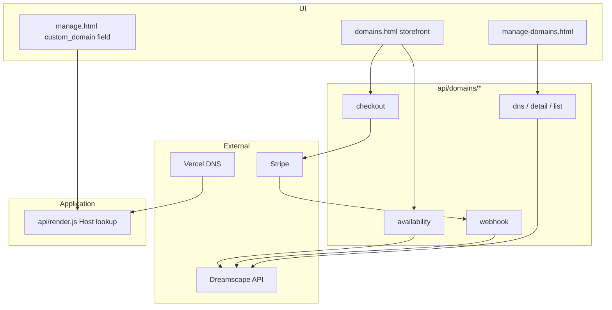
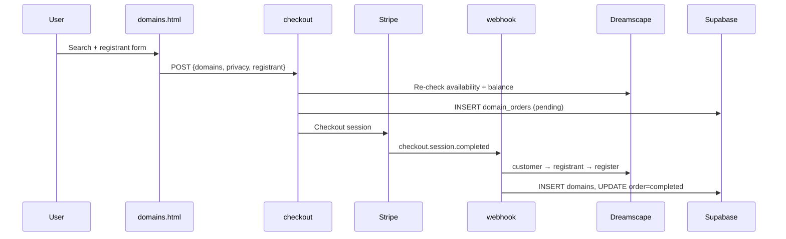

# LeadPages Domain System

**Document:** `06-DOMAINS`  
**Status:** Definitive reference for domain search, purchase, DNS, and custom domain routing  
**Audience:** Engineers, operators, super-admins  
**Prerequisites:** [01-ARCHITECTURE](01-ARCHITECTURE.md), [02-DATABASE](02-DATABASE.md), [04-SITE-BUILDER](04-SITE-BUILDER.md)

> LeadPages integrates with **Dreamscape Reseller API** for domain availability, registration, and DNS. Custom domains connect tenant sites via `sites.custom_domain` + Vercel routing — **two separate steps** from domain purchase.

---

## Executive Summary

| Layer | What it does |
|-------|--------------|
| **Dreamscape** | Registrar API — search, register, DNS records |
| **`domains` table** | Purchased domain inventory per user |
| **`sites.custom_domain`** | Application routing — which tenant serves on Host header |
| **Vercel** | SSL termination, rewrite to `api/render.js` |
| **DNS** | Point domain at Vercel (`76.76.21.21` / `cname.vercel-dns.com`) |

### Product goal

Partners and clients can search, buy, and manage domains without leaving LeadPages — while site content remains in `sites.config`.

---

## Architecture



---

## Dreamscape Client (`dreamscape.js`)

**Server-only** — never exposed to browser.

| Config | Default | Purpose |
|--------|---------|---------|
| `DREAMSCAPE_API_BASE_URL` | `https://reseller-api.ds.network` | API base |
| `DREAMSCAPE_API_TOKEN` / `DREAMSCAPE_API_KEY` | — | 32-char signing key |
| `DREAMSCAPE_RESELLER_ID` | optional | Reseller ID |

**Request signing:**

- `Api-Request-Id` = `md5(unique)`
- `Api-Signature` = `md5(request_id + apiKey)`

### Pricing (`resolveSell`)

1. **`domain_pricing` table** — admin retail overrides (highest priority)
2. **`DOMAIN_PRICE_SOURCE`** env:
   - `table` (default) → hardcoded `PRICE_TABLE`
   - `dreamscape` → API `register_price`
   - `markup` → `register_price * DOMAIN_PRICE_MARKUP`

**Privacy:** retail $9.95; reseller cost `DREAMSCAPE_PRIVACY_COST` (default $5).

### Balance guard

Before checkout and webhook fulfilment:

- `DREAMSCAPE_MINIMUM_RESERVE_BALANCE` (default $150 AUD)
- Blocks if balance after cost < reserve

---

## API Endpoints

| Endpoint | Auth | Purpose |
|----------|------|---------|
| `GET /api/domains/availability` | Public (rate-limited) | Search domains |
| `POST /api/domains/checkout` | Bearer | Stripe checkout |
| `POST /api/domains/webhook` | Stripe HMAC | Fulfil registration |
| `GET /api/domains/order?group=` | Bearer | Post-checkout status |
| `GET /api/domains/list` | Bearer | User domains; super = all Dreamscape |
| `GET/PATCH /api/domains/detail` | Bearer | Nameservers, expiry |
| `GET/POST/PATCH/DELETE /api/domains/dns` | Bearer | DNS CRUD |
| `GET/POST /api/domains/pricing` | Super-admin | TLD pricing overrides |
| `GET /api/domains/account` | Super-admin | Reseller balance |
| `GET /api/domains/customers` | Super-admin | Dreamscape clients |
| `GET /api/domains/invoices` | Super-admin | Invoices + stats |
| `GET /api/domains/diag?key=` | `DREAMSCAPE_DIAG_KEY` | Diagnostics |

**Kill switches:** `DOMAINS_FEATURE_ENABLED`, `DOMAIN_FEATURE_ENABLED` (availability only).

**DNS record types:** `A`, `AAAA`, `CNAME`, `TXT`, `MX`, `SRV`, `CAA`, `WEBFWD`, `MAILFWD`

---

## Purchase Flow



**Order statuses:** `pending` → `registering` → `completed` | `failed_requires_review` | `requires_admin_balance`

**Note:** Checkout accepts optional `site_id` but UIs do not pass it today. Webhook does **not** auto-set `sites.custom_domain`.

---

## Custom Domain → Live Site

### Step A: Infrastructure

1. Prefer manage-domains **"Point at LeadPages"** (`POST /api/domains/point-at-site`):
   - Dreamscape DNS: root `A` → `76.76.21.21`, `www` `CNAME` → `cname.vercel-dns.com`
   - Attaches apex + `www` to the LeadPages **Vercel project** (`VERCEL_TOKEN` + `VERCEL_PROJECT_ID`)
   - Optional `site_id` (domain row, `?site_id=`, or input) also sets `sites.custom_domain`
2. Manual fallback: add the hostname in **Vercel project → Domains**, then set DNS yourself

`already_exists` on Vercel is treated as success so re-clicks are safe. Missing Vercel env soft-skips project attach; DNS can still succeed.

### Step B: Application routing

Super-admin sets **Custom domain** in `manage.html` → Site details → Publish.

Normalized: lowercase, strip `https://`, `www.`, paths.

`api/render.js` lookup:

```javascript
if (isCustom) {
  site = await supabase.from('sites')
    .eq('custom_domain', host).maybeSingle();
}
```

**`domains` table** tracks purchases; **`sites.custom_domain`** makes traffic serve the right tenant. Linked optionally via `domains.site_id` — not auto-synced.

---

## Vercel Routing (`vercel.json`)

| Pattern | Destination |
|---------|-------------|
| `/` on primary host | `/home.html` |
| `/` on other host | `/api/render` |
| `/:slug` | `/api/render?slug=:slug` |
| `/:slug/:page` | `/api/render?slug=:slug&page=:page` |
| `/domains` | `/domains.html` |

**Env:** `PRIMARY_HOSTS`, `SHOWCASE_BASES`

---

## Database Tables

### `domains`

| Column | Purpose |
|--------|---------|
| `user_id` | Owner |
| `site_id` | Optional link to `sites.id` |
| `domain_name` | FQDN |
| `dreamscape_domain_id` | Required for DNS API |
| `status` | e.g. `active` |
| `expiry_date`, `privacy_enabled` | From Dreamscape |
| `managed_external` | External registrar flag |

### `domain_orders`

Cart + fulfilment tracking: `order_group`, `stripe_session_id`, `sell_price`, `estimated_cost`, `status`, `error_message`.

### `domain_pricing`

Admin TLD retail overrides: `tld`, `retail`, `updated_by`.

### `domain_customers` / `domain_registrants`

Dreamscape customer/registrant mapping and WHOIS snapshot.

### `domain_events`

Audit log with full API request/response metadata.

### `sites.custom_domain`

UNIQUE text column — authoritative for render Host lookup.

---

## UI Surfaces

| File | Route | Role |
|------|-------|------|
| `domains.html` | `/domains` | Public storefront |
| `manage-domains.html` | `/manage-domains.html` | Auth manager: search, register, DNS |
| `manage.html` | `/manage` | Custom domain field, domain chips |

**manage.html** shows chips from `domains` where `site_id = currentSiteId`, plus synthetic chip for `custom_domain` if not in table.

---

## Environment Variables

| Variable | Purpose |
|----------|---------|
| `DREAMSCAPE_API_TOKEN` | API signing |
| `DREAMSCAPE_MINIMUM_RESERVE_BALANCE` | Balance floor |
| `DOMAIN_PRICE_SOURCE` / `DOMAIN_PRICE_MARKUP` | Pricing mode |
| `STRIPE_SECRET_KEY` / `STRIPE_WEBHOOK_SECRET` | Checkout |
| `PUBLIC_BASE_URL` | Success/cancel URLs |
| `PRIMARY_HOSTS` | Non-custom hosts |

---

## Known Gaps

| Claim vs reality |
|------------------|
| Marketing "auto-connects to your site" | Purchase still does not set routing; **Point at LeadPages** now auto-adds Vercel project domains (and can set `custom_domain` when `site_id` is provided) |
| `site_id` on checkout | Accepted by API but not sent from UI |
| Feature flag naming | `DOMAINS_FEATURE_ENABLED` vs `DOMAIN_FEATURE_ENABLED` |

---

## Related Documentation

| Doc | Topic |
|-----|-------|
| [04-SITE-BUILDER](04-SITE-BUILDER.md) | Custom domain in editor |
| [01-ARCHITECTURE](01-ARCHITECTURE.md) | Routing overview |
| [02-DATABASE](02-DATABASE.md) | Domain tables |

---

*Document maintained as part of the LeadPages engineering canon.*
