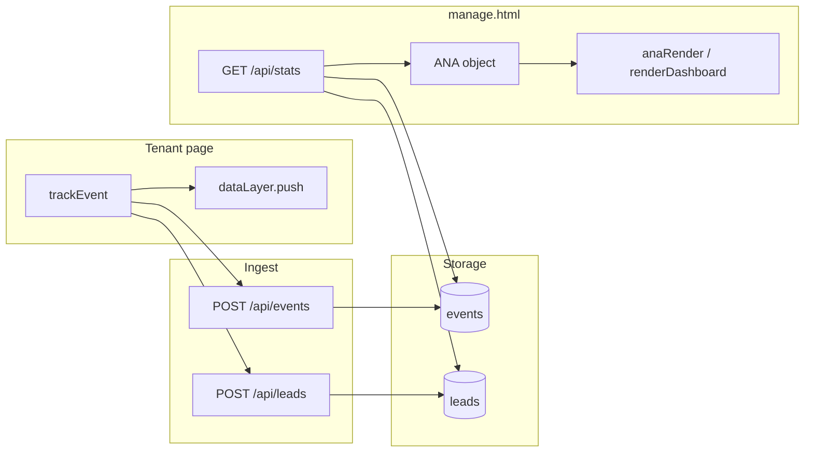

# LeadPages Tracking and Analytics

**Document:** `07-TRACKING`  
**Status:** Definitive reference for visitor events, stats API, and dashboard analytics  
**Audience:** Engineers extending tracking or analytics UI  
**Prerequisites:** [02-DATABASE](02-DATABASE.md), [09-CRM](09-CRM.md), [10-EDITOR](10-EDITOR.md)

> LeadPages tracks visitor behaviour via lightweight beacons. Analytics live in the **`events` table** — not in `sites.config`. Public endpoints **always return 200**.

---

## Executive Summary

| Principle | Implementation |
|-----------|----------------|
| **Never break the visitor** | `fetch().catch(()=>{})`, always HTTP 200 from ingest |
| **Tenant isolation** | `site_id` on every stored event |
| **Fire-and-forget** | `keepalive: true` on call clicks |
| **Dual write on forms** | `lead_submit` event + `/api/leads` row |
| **dataLayer mirror** | GTM-style queue for future tag integration |
| **Session attribution** | `assets/lp-attribution.js` captures gclid / gbraid / wbraid / UTMs into every event + lead (see [Google Ads](features/Google%20Ads.md)) |

---

## Architecture



---

## Visitor-Side: `trackEvent`

Embedded in `trade.template.json`, `broker.template.json`, and reference files `plumber.html` / `broker.html`.

```javascript
window.dataLayer = window.dataLayer || [];
function trackEvent(name, props = {}) {
  const payload = { event: name, site: SITE_CONFIG.business, ts: Date.now(), ...props };
  window.dataLayer.push(payload);
  fetch('/api/events', {
    method: 'POST',
    headers: { 'Content-Type': 'application/json' },
    body: JSON.stringify({
      site: SITE_CONFIG.business,
      event: name,
      props: { ...props, ts: Date.now() }
    }),
    keepalive: true
  }).catch(() => {});
}
```

`SITE_CONFIG` injected by `api/render.js` with `siteId`, `slug`, `business`.

### Allowed events

| Event | When | Typical `props` |
|-------|------|-----------------|
| `page_view` | Page load | `{ page, trade? }` |
| `call_click` | Tel/CTA click | `{ location: 'heroCall' \| 'mobile_bar' \| … }` |
| `lead_submit` | Form submit | `{ job, suburb }` or `{ goal }` |
| `quote_open` | Quote modal open | Rarely fired |
| `cta_click` | Generic CTA | Rarely fired |

Events not in `ALLOWED` (e.g. `calc_freq`, `add_to_cart`) are **silently dropped**.

### Phone wiring

```javascript
el.addEventListener('click', () => trackEvent('call_click', { location: id }));
```

Trade template hydrates many call sites via `applyCfg` (hero slider, mobile bar, promos).

### Storefront pages

`tradies.html` / `brokers.html` use simpler `track()` with `site: 'Storefront'`.

---

## Ingest: `api/events.js`

| Behaviour | Detail |
|-----------|--------|
| Auth | None (public beacon) |
| DB | Service role INSERT |
| Response | Always 200 |
| Validation | Event must be in `ALLOWED` |

### Site resolution order

1. `siteId` from payload
2. Lookup by `slug`
3. Lookup by `business_name` (case-insensitive)

### Insert shape

```javascript
{ site_id, event, props, site /* legacy text */ }
```

**Duplicate:** root `events.js` mirrors `api/events.js`.

---

## Read API: `api/stats.js`

`GET /api/stats?siteId={uuid}&days={n}`

**Auth:** `Authorization: Bearer <supabase_jwt>`

| Mode | Params | Returns |
|------|--------|---------|
| Per-site | `siteId` + `days` | `events`, `leads`, `leadsCount`, `statusCounts` |
| Global | `days` only (no siteId) | `events` with `site_id` (super-admin) |

Uses service role for reads.

---

## Dashboard: `manage.html`

### `ANA` state object

```javascript
var ANA = {
  period: 30,
  data: [],      // events[]
  leads: [],
  leadsCount: 0,
  statusCounts: null,
  globalData: null
};
```

### Key functions

| Function | Purpose |
|----------|---------|
| `anaStats(params)` | Fetch `/api/stats` with Bearer |
| `anaFetchSite()` | Load current site metrics into `ANA` |
| `anaRender()` | Paint `#lp-analytics` pills (broker templates) |
| `renderSiteAnalytics()` | Init strip on `loadSite()` |
| `renderDashboard()` | Trade template dashboard tab |
| `anaCounts(rows)` | Aggregate page_view, call_click, lead_submit |

### Metrics displayed

| Label | Source |
|-------|--------|
| **Visitors** | Count `page_view` |
| **Calls** | Count `call_click` |
| **Forms** | max(`lead_submit`, `leadsCount`) |
| **Conversion** | won ÷ (won + lost) from lead statuses |

Period toggles: 7d / 30d / All.

### Trade vs broker UI

| Template | Analytics UI |
|----------|--------------|
| `broker-app`, `broker-leads` | `#lp-analytics` pill strip above nav |
| `trade` | Pills hidden; stats on **Dashboard** tab |

### Known bug

Trade dashboard `_dashLoadStats` reads `c.phone_click` but events use `call_click` — Calls card may show 0.

---

## `events` Table Schema

| Column | Purpose |
|--------|---------|
| `id` | PK |
| `site_id` | FK → `sites.id` |
| `event` | Event name |
| `props` | JSONB metadata |
| `created_at` | Timestamp |
| `site` | Legacy business name text |

---

## End-to-End Flows

### Page visit

```
Visitor → trackEvent('page_view')
  → POST /api/events → events INSERT
Owner opens manage → anaFetchSite()
  → GET /api/stats → Visitors count
```

### Call click

```
Visitor clicks Call → trackEvent('call_click', {location})
  → events INSERT
Dashboard → Calls++ → breakdown by location
```

### Form submit

```
trackEvent('lead_submit') → events
POST /api/leads → leads table + email
Dashboard → Forms++ + CRM list
```

See [09-CRM](09-CRM.md) for full lead lifecycle.

---

## Future / Gaps

- **UTM capture** — listed as idea, not implemented
- **`siteId` not always sent** — falls back to name lookup
- **`quote_open` / `cta_click`** — allowed but rarely fired
- **No separate analytics warehouse** — direct Postgres queries

---

## File Reference

| File | Role |
|------|------|
| `api/events.js` | Public ingest |
| `api/stats.js` | Authenticated read |
| `events.js` / `stats.js` | Root duplicates |
| `trade.template.json` | Production tracking |
| `manage.html` | `ANA`, dashboard UI |
| `plumber.html` | Readable reference |

---

*Document maintained as part of the LeadPages engineering canon.*
