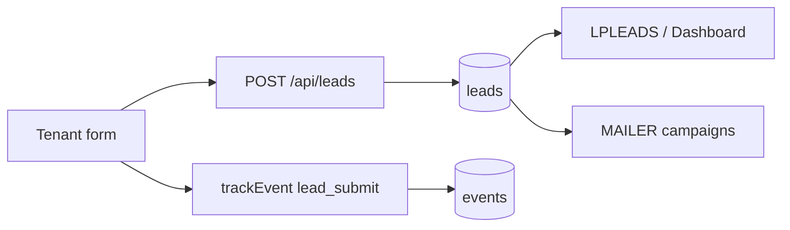
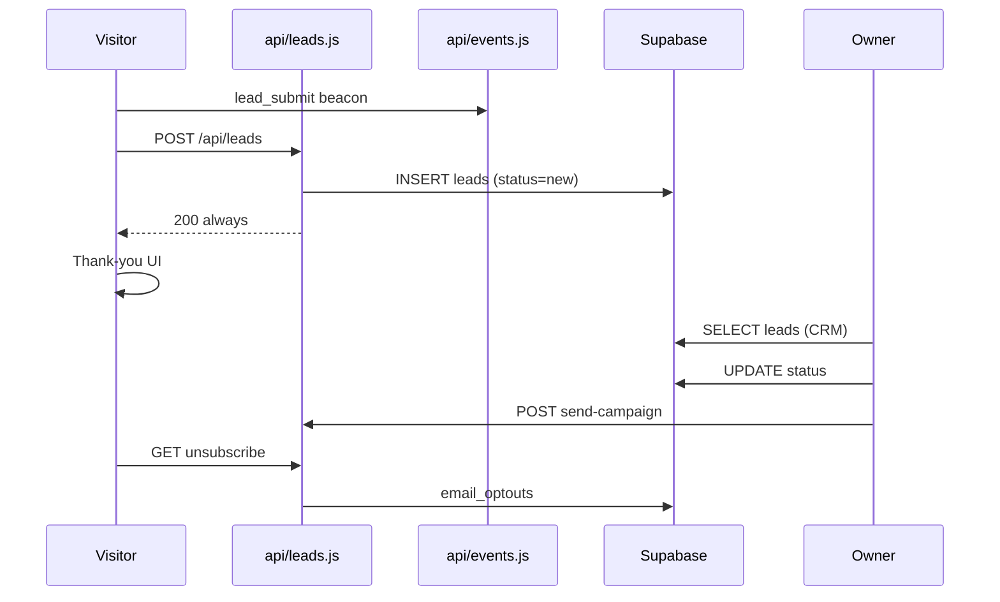

# LeadPages CRM and Leads

**Document:** `09-CRM`  
**Status:** Definitive reference for lead capture, storage, CRM UI, and email campaigns  
**Audience:** Engineers extending forms, CRM, or mailer  
**Prerequisites:** [07-TRACKING](07-TRACKING.md), [02-DATABASE](02-DATABASE.md), [10-EDITOR](10-EDITOR.md)

> LeadPages captures leads from tenant websites, stores them for site owners/partners, and supports **email re-engagement** via the mailer. The ingest API **always returns 200** — visitors always see thank-you UI.

---

## Executive Summary



| Invariant | Implementation |
|-----------|----------------|
| Never lose a lead | Insert even without site match; API always 200 |
| Email ≠ storage | Resend notification best-effort |
| Tenant isolation | `site_id` scoping |
| Opt-out enforced | `leads.email_opt_out` + `email_optouts` table |

---

## Lead Capture (Templates)

### Trade quote form

**Template:** `trade.template.json` (via `api/render.js`)

```javascript
trackEvent('lead_submit', { job, suburb });
await fetch('/api/leads', {
  method: 'POST',
  body: JSON.stringify({
    site: SITE_CONFIG.business,
    kind: 'trade',
    name, phone,
    email: null,
    details: { job, suburb, detail }
  })
});
// Always show success UI
```

Fields configured in editor **Quote form** (`sections.quote`), including `notifyMode` / `notifyEmail`.

### Broker assessment form

**Template:** `broker.template.json`

```javascript
kind: 'broker',
name: firstName + ' ' + lastName,
email, phone,
details: { goal, firstName, lastName }
```

### Storefront orders

`tradies.html` / `brokers.html` — `kind: 'order'`, not tenant CRM (platform sales).

### Partner leads (separate)

`POST /api/partner-lead` → `partner_leads` table (partner recruitment, not tenant CRM).

---

## Ingest: `api/leads.js`

### Site resolution

```javascript
async function resolveSite({ siteId, slug, site }) {
  // id → slug → business_name (ilike)
}
```

No match → insert with `site_id: null` (lead preserved).

### Insert

```javascript
{
  site_id, owner_user_id,
  name, email, phone,
  kind, details, message,
  status: 'new',
  site /* legacy text */
}
```

### Owner notification

Recipient via `contactEmailFor()`:

1. `sections.quote.notifyMode === 'custom'` → `notifyEmail`
2. Else `config.email`
3. Else `sites.owner_email`

Sent via Resend (`RESEND_API_KEY`). Failure does not block storage.

---

## `leads` Table

| Column | Purpose |
|--------|---------|
| `id` | UUID PK |
| `site_id` | FK → `sites.id` |
| `owner_user_id` | FK → owner |
| `name`, `email`, `phone` | PII |
| `kind` | `trade`, `broker`, `order` |
| `details` | JSONB |
| `message` | Summary for list views |
| `status` | `new` → `contacted` → `won` / `lost` |
| `email_opt_out` | Boolean |
| `created_at` | Timestamp |

**Writers:** `api/leads.js`, `manage.html`, `api/unsubscribe.js`  
**Readers:** `manage.html`, `partner-dashboard.html`, `api/stats.js`, `api/send-campaign.js`

---

## CRM UI (`manage.html`)

### `LPLEADS` state

```javascript
var LPLEADS = {
  siteId: null,
  rows: [],
  open: null,
  loading: false,
  timeline: false
};
```

### `renderLeadsCRM()`

- Fetches up to 200 leads for `currentSiteId` via Supabase JWT
- Renders `#lp-leads` strip below analytics

| Template | CRM location |
|----------|--------------|
| `broker-app`, `broker-leads` | `#lp-leads` editor strip |
| `trade` | **Dashboard** tab (`#dash-leads-body`) — strip hidden |

### Actions

| Action | Handler |
|--------|---------|
| List | `lpLeadsPaint()` → `lpLeadRow()` |
| Expand | `data-ll="view"` |
| Status update | `data-ll="status"` → Supabase update |
| Activity | `data-ll="timeline"` → merge `ANA.data` events |
| Refresh | `data-ll="refresh"` |

### Status lifecycle

```
new → contacted → won / lost
(any) → opted_out (unsubscribe or mailer toggle)
```

Conversion metric: won ÷ (won + lost).

---

## Mailer (`MAILER` object)

```javascript
var MAILER = {
  mode: 'all',       // all | selected | individual
  selected: {},
  schedule: false,
  subject: '', body: '',
  clients: [],
  campaigns: []
};
```

### `renderMailer()`

Loads leads with email + recent campaigns from `GET /api/send-campaign?siteId=…`

### `mailerSend()` → `POST /api/send-campaign`

**Pipeline (`deliverCampaign`):**

1. Resolve recipient emails from leads
2. Filter `leads.email_opt_out`
3. Cross-check `email_optouts` table
4. Send via Resend with `List-Unsubscribe` headers
5. Record `campaign_recipients`
6. Update `email_campaigns` counts

**Scheduling:** `email_campaigns.status = 'scheduled'` → `api/cron/send-due.js`

### `mailerOptOut(id, v)`

Updates both `leads.email_opt_out` and `email_optouts` table.

---

## `email_optouts`

| Attribute | Value |
|-----------|-------|
| PK | `(site_id, email)` |

**Population:**

| Source | Action |
|--------|--------|
| `GET /api/unsubscribe?s=&e=` | Public link from campaigns |
| `mailerOptOut()` | Manual toggle in editor |
| `send-campaign.js` | Skip at send time |

---

## Partner Visibility

`partner-dashboard.html` — read-only lead table across partner's client sites (up to 200). Full CRM via `/manage?site={slug}`.

---

## End-to-End Sequence



---

## Analytics Overlap

`lead_submit` events power analytics **Forms** count independently of `leads` table. Dashboard uses `max(lead_submit count, leadsCount)`.

See [07-TRACKING](07-TRACKING.md).

---

## File Reference

| File | Role |
|------|------|
| `api/leads.js` | Lead ingest |
| `api/send-campaign.js` | Campaign delivery |
| `api/cron/send-due.js` | Scheduled sends |
| `api/unsubscribe.js` | Opt-out handler |
| `api/stats.js` | Lead counts for dashboard |
| `manage.html` | LPLEADS, MAILER |
| `trade.template.json` | Quote form |
| `broker.template.json` | Assessment form |
| `partner-dashboard.html` | Partner rollup |

---

*Document maintained as part of the LeadPages engineering canon.*
