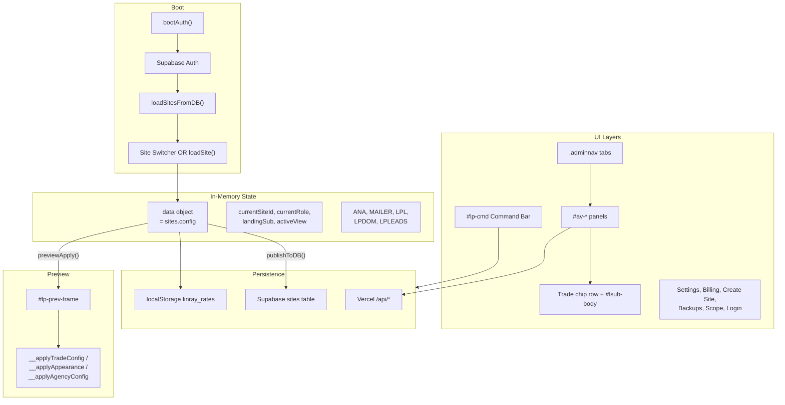
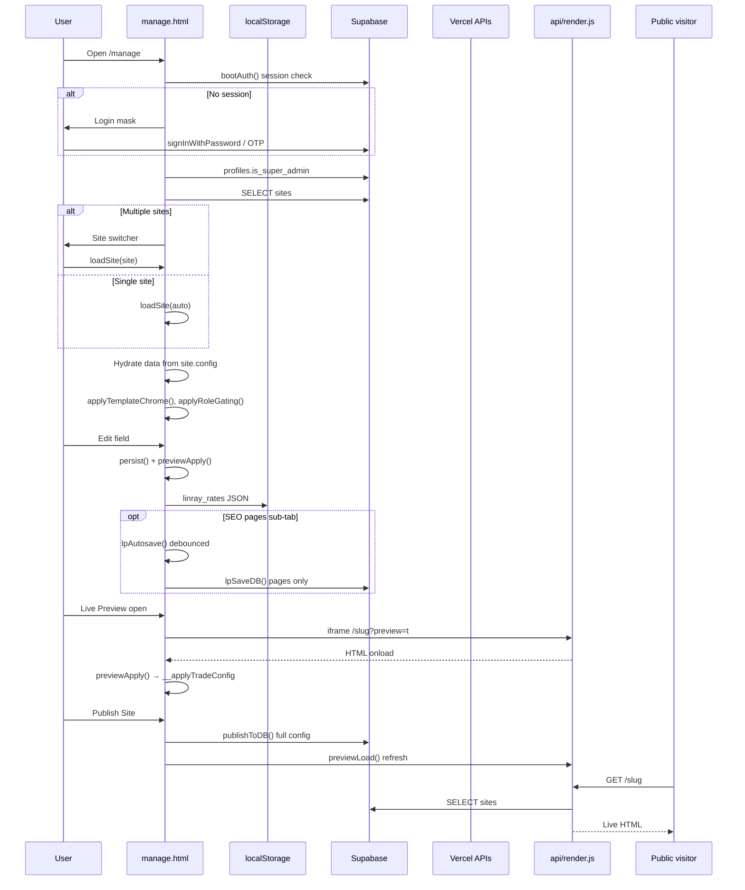
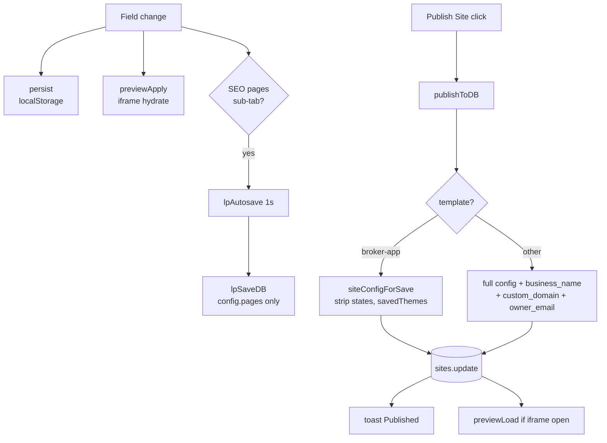
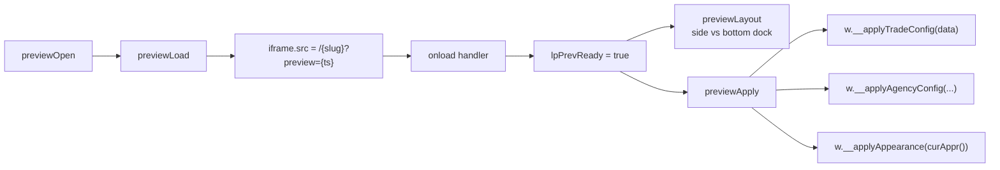
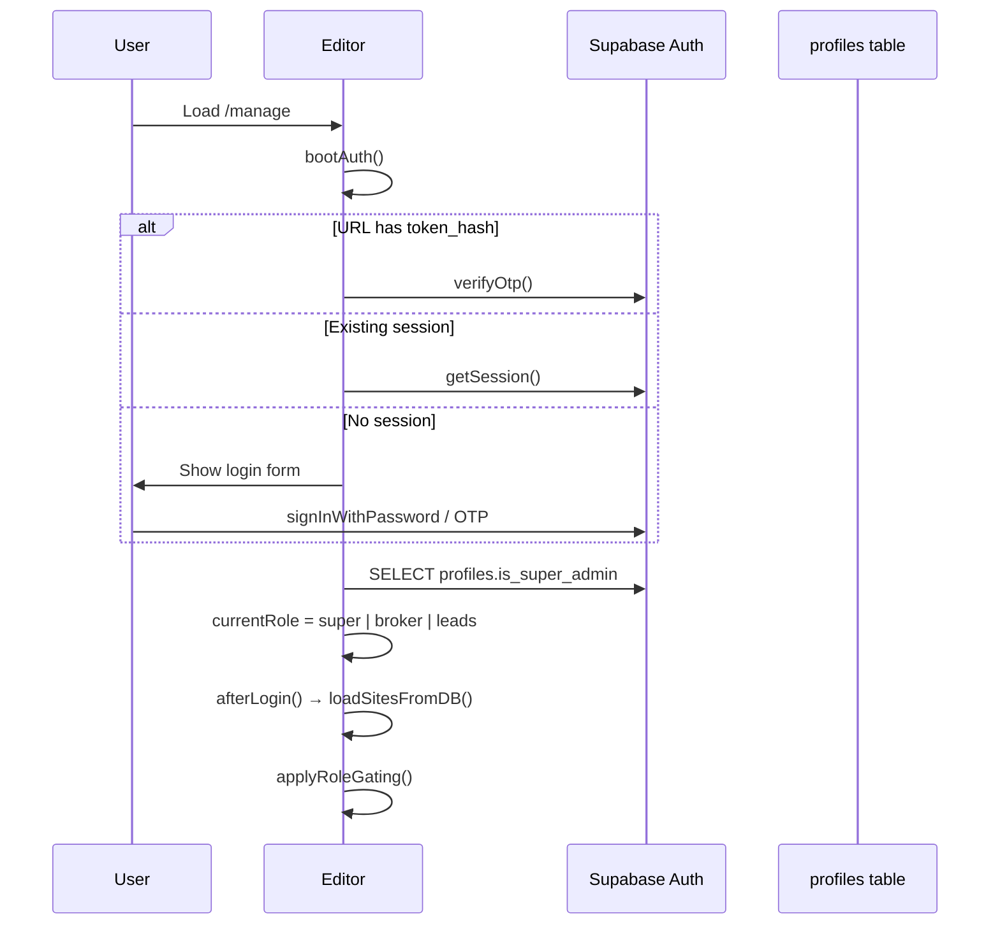
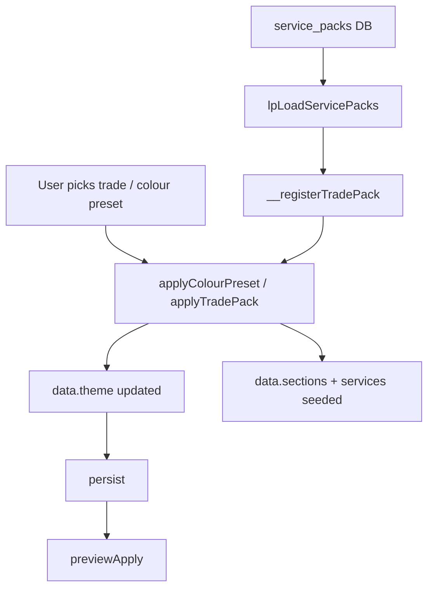
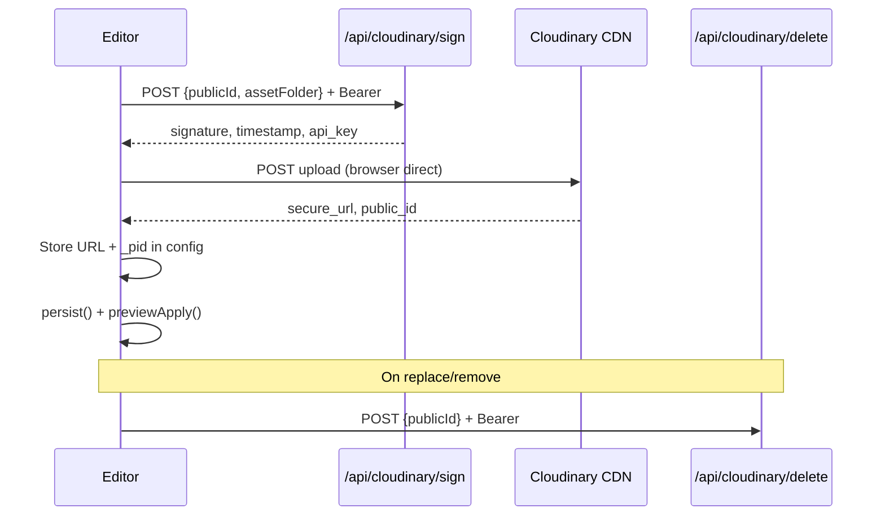
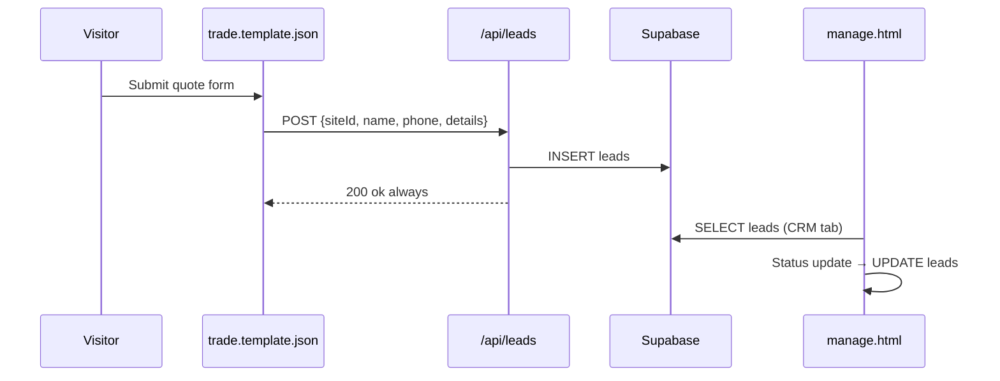
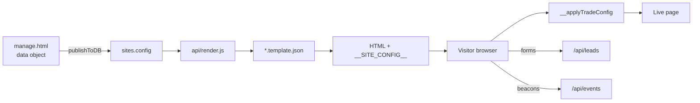

# LeadPages Editor — Complete Engineering Manual

**Document:** `10-EDITOR`  
**Status:** Definitive engineering reference for the LeadPages site editor  
**Audience:** Engineers rebuilding, extending, or debugging the editor; AI development agents  
**Prerequisites:** [00-VISION](00-VISION.md), [01-ARCHITECTURE](01-ARCHITECTURE.md), [02-DATABASE](02-DATABASE.md), [04-SITE-BUILDER](04-SITE-BUILDER.md)

> **This is the single most important document in the repository.**  
> The production editor is **`manage.html`** — a ~5,400-line single-page application. Everything below describes that file unless noted otherwise.

---

## Executive Summary

The LeadPages editor is the **App Command Centre** — where site owners, partners, and super-admins create, configure, preview, and publish multi-tenant websites. It is implemented as one self-contained HTML file with inline CSS and JavaScript, talking to **Supabase** (auth + data) and **Vercel APIs** (billing, Cloudinary, analytics, mailer, marketplace).

### Why it was built this way

| Decision | Rationale |
|----------|-----------|
| **Single HTML file** | Zero build step; deploy by push; partners can reason about one file; fast iteration |
| **Vanilla JavaScript** | No framework lock-in; templates use same pattern; smaller cold-start than SPA bundles |
| **In-memory `data` object** | Mirrors `sites.config` JSONB; instant UI updates; `persist()` to localStorage as safety net |
| **Explicit Publish** (trade) | Prevents half-edited sections reaching live visitors; broker-app SEO pages autosave separately |
| **Iframe preview + direct JS calls** | Same-origin `contentWindow.__applyTradeConfig()` — no postMessage complexity; true WYSIWYG |
| **Role × template matrix** | One editor serves super-admin, broker/partner, and leads-only demo roles across three templates |
| **Classic vs Standard mode** | Power users see all toggles; client-facing brokers get simplified "edit only" chips |

### Three templates, one shell

| Template | Primary use | Editor focus |
|----------|-------------|--------------|
| `trade` | Tradies & service businesses | Page editor (40+ sections), dashboard, marketplace apps |
| `broker-leads` | Mortgage broker landing | Simple details + rates + mailer |
| `broker-app` | Calculator suite | Rates tables, appearance, SEO sub-pages, demo themes |

### File map

| File | Role in editor |
|------|----------------|
| `manage.html` | **The editor** — all UI and logic |
| `api/manage.html` | Legacy duplicate (same patterns; avoid editing) |
| `trade.template.json` | Public page shell + `__applyTradeConfig` hydration |
| `broker.template.json` | Broker landing hydration |
| `brokerapp.template.json` | Calculator suite + `__applyAppearance` |
| `agency.template.json` | Partner home pages (preview via `__applyAgencyConfig`) |
| `icons.js` | `window.LP_ICONS` — SVG paths for section icon picker |
| `events.js` (root) | Client beacon helper embedded in tenant templates |
| `stats.js` (root) | Legacy stats helper (editor uses `/api/stats`) |
| `api/stats.js` | Analytics API consumed by editor |
| `api/leads.js` | Lead capture from published forms |
| `api/cloudinary/*` | Signed uploads |
| `api/send-campaign.js` | Mailer |
| `api/api-apps.js`, `api-site-apps.js` | Marketplace |

---

## Editor Philosophy

From [00-VISION](00-VISION.md) and product intent:

1. **Professional command centre** — not a hacked form. Grouped cards, clear hierarchy, publish/preview always visible.
2. **Show, don't describe** — live iframe preview updates on every field change for trade sites.
3. **Preserve power, reduce clutter** — Standard mode hides inactive section toggles; Classic mode exposes full control.
4. **Never delete options** — reorganise, don't remove. Unknown `config` keys survive round-trips.
5. **Partner-friendly** — brokers get client-safe UI; supers retain danger zone and plan builder.
6. **Mobile-first output** — editor configures responsive tenant pages, not the editor itself.

### UX principles encoded in code

- **Publish is deliberate** for trade/broker-leads (click "Publish Site").
- **Autosave is narrow** — only broker-app/trade SEO `pages[]` sub-tab via `lpAutosave()`.
- **Billing gate** — full-screen lock overlay when account suspended (`lpBillingGate()`).
- **Toast feedback** — non-blocking confirmations (`toast()`).
- **Expansion near selection** — trade subtabs render in `#lsub-body` below chip row, not at page bottom.

---

## Editor Architecture



### IIFE structure

All editor logic wraps in `(function(){ 'use strict'; ... })();` starting ~line 900. No module bundler — functions are file-scoped except explicit `window.*` exports for trade picker tooling.

---

## Complete Menu Hierarchy

### Level 0 — Authentication

```
Login Mask (#login-mask)
├── Password sign-in
├── Email OTP
├── Magic link (URL token_hash)
└── Forgot password
```

### Level 1 — Site Switcher (`#lp-landing`)

```
Site Switcher
├── Segment tabs (role-gated)
│   ├── Customer sites
│   ├── Partner sites
│   ├── Web demos
│   ├── App demos (broker-app / broker-leads)
│   └── My listing (partner home) [broker role]
├── Search (#lpl-search)
├── Sort (updated / name / leads)
├── Site cards → Manage Site
└── + New Site → Create Site overlay (#cs-ov)
```

### Level 2 — Command Bar (`#lp-cmd`) — trade & broker-leads

```
Command Bar
├── Site label / context
├── Publish Site
├── View Live Site ↗
├── Live Preview (toggle dock)
├── Settings
├── Billing
├── Domains → manage-domains.html
├── Scope (demo scope checklist)
├── Backups
├── Switch Account [super]
├── Favourite [super]
├── + New Site [super]
└── Classic / Standard mode toggle
```

### Level 3 — Injected strips (above main nav)

```
Analytics Strip (#lp-analytics)     [hidden for trade — stats on Dashboard]
├── Period pills (7d / 30d / All)
├── Metric cards (Visitors, Calls, Forms, Conversion)
└── Global sites table [super, no siteId]

My Domains (#lp-domains)
└── Domain chips → detail expand

Captured Leads (#lp-leads)          [hidden for trade — on Dashboard]
└── Lead list + status workflow
```

### Level 4 — Main navigation (`.adminnav`)

Visibility = `ALLOWED[role] ∩ TEMPLATE_NAV[template]`

```
Main Nav
├── Dashboard                    [trade only]
├── Page editor (Details)        [trade, broker-leads]
├── Rates & leads                [broker-app]
├── Landing pages                [broker-app, trade]
├── App Marketplace              [trade]
├── Email clients (Mailer)       [all templates]
├── Appearance                   [broker-app]
├── Contact                      [broker-app]
├── Logo                         [broker-app]
├── Users                        [broker-app, super]
└── Demo themes                  [broker-app, super]
```

### Level 5 — Trade Page Editor subtabs (`TRADE_SUBTABS`)

Grouped in UI as **CORE_GROUPS** (6 sections) + **PRESET_GROUPS** (3 layout families):

```
Page Editor (Details tab)
├── Layout picker + preset chips
├── Section mode: Hide Inactive | Show Features
├── Group: Business Identity & Hero Area
│   ├── Branding
│   ├── Logo
│   ├── Details (business name, phone, email, region, trade)
│   ├── Hero
│   ├── Split Hero
│   ├── Hero B/A Slider
│   ├── Hero Slider
│   ├── Top bar (emerg)
│   ├── Mobile bar
│   └── Section order (drag reorder)
├── Group: Services & Selling Content
│   ├── Services
│   ├── Service Process
│   ├── Service Areas
│   ├── Service Area Map
│   ├── Local SEO (seoTokens)
│   ├── Finance Options
│   ├── Text box
│   └── Video reels
├── Group: Lead Capture & Conversion
│   ├── Quote form
│   ├── Promotions
│   ├── FAQ
│   ├── Estimate Builder
│   ├── Jobs feed
│   ├── Emergency Availability
│   ├── Special Offer
│   └── Response Cards
├── Group: Trust, Proof & Authority
│   ├── Trust Bar
│   ├── Certifications
│   ├── Reviews
│   ├── Review Highlights
│   ├── Customer Reactions
│   ├── Proof Stream
│   ├── Activity Counter
│   └── Activity Timeline
├── Group: Projects, Gallery & Before/After
│   ├── Project Feed
│   ├── Instagram Project Feed
│   ├── Instagram Gallery
│   ├── Project Portfolio
│   ├── Project Stats
│   ├── Before & After
│   └── Before/After Feed
└── Group: Company & Location
    ├── Crew
    ├── Where (area)
    ├── Why us
    ├── Nav menu
    ├── Footer
    └── Extended footer (lpFooter)
```

### Level 6 — Settings overlay (`#settings-page`)

```
Settings
├── Site details (business, slug, domain, owner email)
├── Demo flag toggle [super]
├── Hosting plans builder [super] → #plans-page
├── Suspended page editor [super] → #susp-editor
├── Trade starter content [trade] → trade pack picker
└── Danger zone [super]
    ├── Lock toggle
    └── Delete site (double confirm)
```

### Level 7 — Broker-app Rates tab

```
Rates & Leads
├── State selector (ACT, NSW, …)
├── Bracket tables per state
├── Calculator toggles
├── Stamp duty / fees
├── Leads card (broker-app leads view)
└── Inline calculator preview panel
```

### Level 8 — Landing pages tab

```
Landing Pages (SEO sub-pages)
├── Page list
├── Per-page editor (title, slug, meta, h1, body, image)
├── AI generate (Anthropic)
└── Undo history (lpHist stack)
```

### Level 9 — App Marketplace tab

```
App Marketplace
├── Position slots: Hero | Upper | Mid | Lower | Footer
├── App tiles (toggle, reposition)
├── Partner templates (save / apply layout)
└── Ghost mode for unpaid apps
```

### Level 10 — Email clients tab

```
Mailer
├── Recipient mode (all / selected / opt-outs)
├── Compose (subject, body, image)
├── Schedule (timezone wall clock)
├── Campaign history
└── Per-lead opt-out toggles
```

---

## Data Model

### Global state variables

| Symbol | Type | Purpose |
|--------|------|---------|
| `sb` | Supabase client | Anon key + user JWT |
| `data` | Object | **Live editor state** = working copy of `sites.config` + broker rates |
| `currentSiteId` | UUID | Active site |
| `currentSiteSlug` | string | URL slug |
| `currentSiteTemplate` | string | `trade` \| `broker-leads` \| `broker-app` |
| `currentBusinessName` | string | Denormalized for publish |
| `currentCustomDomain` | string | Custom domain |
| `currentOwnerEmail` | string | Client login email |
| `currentIsPartnerHome` | boolean | Agency template flag |
| `currentRole` | string | `super` \| `broker` \| `leads` |
| `allSites` | array | Cached site list |
| `activeView` | string | Current nav tab id |
| `landingSub` | string | Active trade subtab key |
| `secHideInactive` | boolean | Chip display mode |
| `authed` | boolean | Session valid |

### Module state objects

| Object | Keys | Purpose |
|--------|------|---------|
| `LPL` | `grp`, `q`, `sort`, `partners`, `leads` | Site switcher |
| `ANA` | `period`, `data`, `leads`, `statusCounts`, `globalData` | Analytics dashboard |
| `MAILER` | `clients`, `campaigns`, compose fields | Email campaigns |
| `LPDOM` | `rows`, `open`, `loading` | Domains strip |
| `LPLEADS` | `rows`, `timeline`, `open` | Leads CRM strip |
| `BP` | `plans` | Plan builder overlay |
| `BILL` | billing page cache | Billing overlay |
| `SUSP` | suspended page variants | Suspended editor |
| `lpCur` / `lpHist` / `lpHi` | SEO page editor + undo stack | Landing pages tab |

### `data` shape by template

See [02-DATABASE](02-DATABASE.md) § Configuration Storage. Editor mutates `data` in place; `publishToDB()` writes to `sites.config`.

### Role × template matrix

```javascript
ALLOWED = {
  super: ['rates','landing','appearance','contact','logo','users','demothemes','details','mailer','apps','dashboard'],
  broker: ['appearance','contact','logo','landing','details','mailer','apps','dashboard'],
  leads: ['rates']
};
TEMPLATE_NAV = {
  'broker-app': ['rates','landing','appearance','contact','logo','users','demothemes','mailer'],
  'broker-leads': ['details','mailer'],
  'trade': ['dashboard','details','landing','apps','mailer']
};
```

Effective tabs = intersection, applied in `applyRoleGating()`.

---

## Complete Editing Lifecycle



---

## Save Flow



### Three persistence tiers

| Tier | Function | Target | When |
|------|----------|--------|------|
| **Local** | `persist()` | `localStorage.linray_rates` | Every field change |
| **Autosave** | `lpSaveDB()` via `lpAutosave()` | `sites.config.pages` | SEO landing page fields, 1s debounce |
| **Publish** | `publishToDB()` | Full `sites` row | User clicks Publish or Settings Save |

**Why three tiers:** Local protects against browser crash; autosave protects long-form SEO writing; publish gate protects trade section integrity.

---

## Publish Flow

See `publishToDB()` at line ~4046 in `manage.html`.

| Template | Payload |
|----------|---------|
| `broker-app` | `{ config: siteConfigForSave(), updated_at }` |
| `trade` / `broker-leads` | `{ config, business_name, custom_domain, owner_email?, updated_at }` |

`siteConfigForSave()` removes `states`, `savedThemes`, `users` from broker-app exports.

---

## Preview System



### Key functions

| Function | Purpose |
|----------|---------|
| `lpFrame()` | Returns `#lp-prev-frame` iframe element |
| `previewTarget()` | Slug for preview URL |
| `previewLoad()` | Sets iframe src with `?preview=` cache buster |
| `previewApply(a?)` | Calls hydration fn on `contentWindow` |
| `previewDock()` | Side panel if viewport ≥1680px |
| `previewLayout()` | Resize iframe; desktop cap 1040px |
| `previewSetMode('desktop'\|'mobile')` | Device width simulation |
| `previewOpen()` / `previewClose()` | Toggle `#lp-prev-dock` |

**No postMessage** — same-origin direct function calls only.

**Why iframe not shadow DOM:** Production render path (`api/render.js`) is the source of truth; preview must match production HTML/JS exactly.

---

## Authentication Flow



| Function | Purpose | Inputs | Outputs | Dependencies | Side Effects |
|----------|---------|--------|---------|--------------|--------------|
| `bootAuth()` | Entry auth resolver | — | — | `sb.auth` | Shows login or continues |
| `lpLogin()` | Password attempt | form fields | — | `sb.auth.signInWithPassword` | Session cookie |
| `afterLogin()` | Post-auth init | — | — | `loadSitesFromDB`, `applyRoleGating` | Hides login mask |
| `applyRoleGating()` | Show/hide nav by role×template | `currentRole`, `currentSiteTemplate` | — | `ALLOWED`, `TEMPLATE_NAV` | May call `showView()` |
| `signOutLP()` | Logout | — | — | `sb.auth.signOut` | Full page reload |

---

## Theme Flow



### Trade theme tokens

| Key | UI role |
|-----|---------|
| `pipe` | Brand colour |
| `hivis` | CTA buttons |
| `steel` | Header/footer dark |
| `safety` | Badges |
| `lightBg` | Page background |
| `presetKey` | Named preset id |

### Broker-app appearance

`data.appearance` — 10 colour/font fields via `DEFAULT_APPEARANCE` and `APPR_PRESETS`. `applyApprAdmin()` sets CSS variables on editor chrome and calls `previewApply()`.

---

## Image Upload Flow



| Function | Purpose |
|----------|---------|
| `cwToken()` | Get Bearer from `sb.auth.getSession()` |
| `cwUpload(file, folder, field)` | Sign + direct upload; returns `{url, publicId}` |
| `cwDelete(publicId)` | Remove asset |
| `cwDeletePrefix(prefix)` | Bulk delete site folder |
| `cwPick(onPick, opts)` | File input wrapper |
| `cwImgHTML(url, pid, label)` | Editor thumbnail markup |

**Namespace:** `leadpages/{siteId|slug}/{section}/{field}/{random}`

---

## Lead Flow



Editor CRM: `renderLeadsCRM()`, `lpLeadsPaint()`, dashboard `_dashLoadLeads()`.

---

## Autosave

| Function | Purpose | Inputs | Outputs | Dependencies | Side Effects |
|----------|---------|--------|---------|--------------|--------------|
| `lpAutosave()` | Debounce wrapper | — | — | `setTimeout` 1s | Schedules `lpSaveDB` |
| `lpSaveDB()` | Save pages array only | `data.pages`, `currentSiteId` | — | `sb.from('sites').update` | Updates `allSites` cache |

**Does not** update `business_name` or top-level trade sections — those require Publish.

---

## Undo / Recovery

| Mechanism | Scope | Implementation |
|-----------|-------|----------------|
| **localStorage** | Full `data` snapshot | `persist()` on every change — key `linray_rates` |
| **SEO undo stack** | Landing page editor | `lpPush()`, `lpHist[]`, `lpHi` index (max 50) |
| **Site backups** | Full config snapshots | `site_backups` table — `lpBkSave()`, restore, import JSON |
| **Scope checklist** | Demo project scope | `config.scope.items[]` — immediate DB save |

**No global undo/redo** for trade sections — intentional simplicity; backups are the recovery path.

---

## Backups Panel

| Function | Purpose |
|----------|---------|
| `lpBkOpen()` | Show `#lp-bk-panel` |
| `lpBkLoad()` | List backups from `site_backups` |
| `lpBkSave()` | Insert config snapshot |
| `lpBkApplyConfig(cfg)` | Restore → `sites.update` + reload editor |
| `lpBkListClick()` | Restore / download / delete handlers |

---

## Templates & Hydration

| Template file | Hydration function | Injected by render |
|---------------|-------------------|-------------------|
| `trade.template.json` | `window.__applyTradeConfig(cfg)` | `__SITE_CONFIG__` JSON bootstrap |
| `broker.template.json` | Same trade hydrator | Token replacement |
| `brokerapp.template.json` | `window.__applyAppearance(a)` | `__BROKERAPP_CONFIG__` |
| `agency.template.json` | `window.__applyAgencyConfig(cfg)` | Server-built HTML |

Editor preview calls the same hydration functions without full page reload when possible.

---

## Trade Packs & Service Packs

| Source | Count | Load path |
|--------|-------|-----------|
| Inline `TRADE_PACKS` | Embedded JSON per trade slug | `applyTradePack()` |
| `window.__TRADE_CATS` | 104 trades, 14 categories | Trade picker UI |
| `service_packs` table | Dynamic / AI-generated | `lpLoadServicePacks()` |

| Function | Purpose |
|----------|---------|
| `packToConfig(pack)` | Merge pack into empty trade config |
| `applyTradePack(key)` | Apply preset + seed sections |
| `lpSeedTrade(c)` | Ensure defaults for missing section keys |
| `lpLoadServicePacks()` | Fetch DB packs, register via `__registerTradePack` |
| `lpSaveServicePack()` | Super-admin upsert to `service_packs` |

---

## Layouts & Feature Toggles

**12 layouts** in `LAYOUTS` object: `classic`, `quote-first`, `photo-proof`, `emergency-response`, + 8 named presets.

| Function | Purpose |
|----------|---------|
| `getLayout(id)` | Resolve layout definition |
| `_secOn(c, id)` | Section enabled? (respects OFF_BY_DEFAULT) |
| `_setSecOn(c, id, v)` | Toggle section |
| `togglePreset(c, key)` | Enable/disable layout feature bundle |
| `_orderList(c)` | Compute render order from layout + `sectionOrder` |
| `wireOrder(c)` | Drag-and-drop section reorder UI |

**OFF_BY_DEFAULT_SECTIONS** (21): opt-in components like `heroSlider`, `projectFeed`, `seoTokens`, etc.

---

## Major Function Reference

Functions are grouped by subsystem. **~445 functions** exist; nested helpers inside `renderLandingSub` are listed in summary tables.

### Core utilities

| Function | Purpose | Inputs | Outputs | Dependencies | Side Effects | Related |
|----------|---------|--------|---------|--------------|--------------|---------|
| `$` | getElementById shorthand | id string | Element | DOM | — | all UI |
| `esc(s)` | HTML escape | string | safe string | — | — | templates |
| `uid()` | Random id | — | string | Date | — | pages, lists |
| `toast(msg)` | Flash message | string | — | `#toast` | 1.8s show | publish, errors |
| `persist()` | Local save | `data` | — | localStorage | writes `linray_rates` | every edit |
| `getByPath` / `setByPath` | Nested config access | path, value | any | `data` | mutates `data` | rates editor |

### Site loading

| Function | Purpose | Inputs | Outputs | Dependencies | Side Effects | Related |
|----------|---------|--------|---------|--------------|--------------|---------|
| `loadSitesFromDB()` | Fetch all visible sites | — | `allSites` | `sb`, `profiles` | Sets `currentRole` | `afterLogin` |
| `loadSite(site)` | Activate site in editor | site row | — | `data`, template branches | Resets `landingSub`, calls `render*` | `showView` |
| `applyTemplateChrome()` | Show/hide broker bar vs cmd card | — | — | `currentSiteTemplate` | DOM class toggles | `loadSite` |
| `ensureSiteBar()` | Inject publish/preview/settings buttons | — | — | DOM | Creates buttons once | `loadSite` |
| `openCreateSite()` | Create site overlay | — | — | `#cs-ov` | — | `createSiteSubmit` |
| `createSiteSubmit()` | INSERT new site | form | — | `sb.from('sites').insert` | Loads new site | trade packs |
| `deleteSiteFlow()` | Confirm + delete | — | — | `sb.delete` | — | super only |

### Navigation

| Function | Purpose | Inputs | Outputs | Dependencies | Side Effects | Related |
|----------|---------|--------|---------|--------------|--------------|---------|
| `showView(which)` | Switch main tab | tab id | — | `NAV` array | Hides panels, calls render | `applyRoleGating` |
| `tplNav()` | Template tab list | — | string[] | `TEMPLATE_NAV` | — | `applyRoleGating` |
| `initEditorMode()` | Classic/Standard toggle | — | — | `localStorage` LP_MODE_KEY | CSS classes | `afterLogin` |

### Trade editor core

| Function | Purpose | Inputs | Outputs | Dependencies | Side Effects | Related |
|----------|---------|--------|---------|--------------|--------------|---------|
| `renderDetails()` | Page editor shell | — | — | `TRADE_SUBTABS`, `CORE_GROUPS` | Builds chips + body | `renderLandingSub` |
| `renderLandingSub(c)` | Active subtab form | config | — | `DEFAULT_TRADE_SECTIONS`, `LIST_SCHEMAS` | Large DOM write | `wireSec`, `listEditor` |
| `secCard(c,id,label,...)` | Section header + toggle | — | HTML string | `_secOn` | — | `wireSec` |
| `wireSec(c,id,...)` | Bind scalar fields | — | — | `persist`, `previewApply` | Event listeners | `lpFld` |
| `listEditor(el,c,key)` | Repeatable list UI | — | — | `LIST_SCHEMAS`, `cwUpload` | DOM | reviews, crew, etc. |
| `renderTradePresets(c)` | Layout preset chips | config | — | `LAYOUTS` | — | `togglePreset` |
| `syncColourInputs(c)` | Theme colour pickers | config | — | `TRADE_COLOURS` | — | `applyColourPreset` |

### Analytics

| Function | Purpose | Inputs | Outputs | Dependencies | Side Effects | Related |
|----------|---------|--------|---------|--------------|--------------|---------|
| `anaStats(qs)` | Fetch stats API | query string | JSON | `/api/stats`, Bearer | — | `anaFetchSite` |
| `anaFetchSite()` | Load site metrics | — | fills `ANA` | `anaStats` or direct SB | — | `anaRender` |
| `anaRender()` | Paint dashboard | — | — | `ANA` | DOM | `renderSiteAnalytics` |
| `renderSiteAnalytics()` | Init analytics strip | — | — | `lpBillingGate`, domains, leads | Hides strip for trade | dashboard |

### Mailer

| Function | Purpose | Inputs | Outputs | Dependencies | Side Effects | Related |
|----------|---------|--------|---------|--------------|--------------|---------|
| `renderMailer()` | Mailer UI | — | — | `leads`, `/api/send-campaign` | — | `mailerSend` |
| `mailerSend()` | Create/schedule campaign | form | — | POST `/api/send-campaign` | DB campaigns | `mailerRunNow` |
| `mailerOptOut(id,v)` | Toggle lead opt-out | lead id | — | `leads`, `email_optouts` | Supabase | — |

### Marketplace

| Function | Purpose | Inputs | Outputs | Dependencies | Side Effects | Related |
|----------|---------|--------|---------|--------------|--------------|---------|
| `renderAppsMarketplace()` | Apps tab | — | — | `/api/api-apps`, `site_apps` | — | `_toggleApp` |
| `_reconcileSiteApps()` | Merge apps → config.sections | — | — | `site_apps` | Mutates `data` | `loadSite` |
| `_toggleApp(appId,on)` | Enable/disable app | ids | — | POST `api-site-apps` | Stripe for paid | `_renderAppsBody` |
| `_savePartnerTemplate()` | Save layout preset | name | — | `partner_templates` | — | — |

### Billing overlays

| Function | Purpose | Inputs | Outputs | Dependencies | Side Effects | Related |
|----------|---------|--------|---------|--------------|--------------|---------|
| `lpBillingGate()` | Account lock check | — | boolean | `/api/billing/status` | May show `#bill-lock` | `renderSiteAnalytics` |
| `openBillingPage()` | Billing overlay | — | — | multiple billing APIs | — | `_billRender` |
| `openPlansPage()` | Plan builder [super] | — | — | `/api/billing/plans` | — | `_bpSave` |

### Publish

| Function | Purpose | Inputs | Outputs | Dependencies | Side Effects | Related |
|----------|---------|--------|---------|--------------|--------------|---------|
| `publishToDB()` | **Primary save to production** | `data`, globals | — | `sb.update sites` | Toast, preview reload | `siteConfigForSave` |
| `siteConfigForSave()` | Strip editor-only keys | `data` | config object | — | — | broker-app publish |

### Window exports (trade builder tooling)

| Export | Purpose |
|--------|---------|
| `window.__TRADE_CATS` | Category → trade slug[] map |
| `window.__initTradePicker` | Settings trade dropdown |
| `window.__initTradePicker2` | Create-site trade picker |
| `window.__tradeStarterCard` | Settings starter pack UI |
| `window.__registerTradePack` | Register dynamic pack |
| `window.__buildTradePrompt` | AI trade generation prompt |
| `window.__wireTradeBuilder` | Super-admin pack editor wire-up |
| `window.__adminGate` | Alias for `gate()` permission check |

---

## Editor Panels Reference

### Panel: Site Switcher (`#lp-landing`)

| Attribute | Detail |
|-----------|--------|
| **Purpose** | Multi-site navigation for supers and multi-site brokers |
| **Business reason** | Partners manage dozens of client sites; need fast switching |
| **Database** | Reads `sites`, `leads` (counts), `partners` |
| **Config** | — |
| **Dependencies** | `loadSitesFromDB`, `renderLanding` |

### Panel: Command Bar (`#lp-cmd`)

| Attribute | Detail |
|-----------|--------|
| **Purpose** | Primary actions: publish, preview, billing, settings |
| **Business reason** | Actions must be one click away — this is the operational hub |
| **Database** | `publishToDB` → `sites` |
| **Dependencies** | `ensureSiteBar`, `previewInit` |

### Panel: Dashboard (`#av-dashboard`) — trade only

| Attribute | Detail |
|-----------|--------|
| **Purpose** | At-a-glance site health: stats, leads, backups, scope |
| **Business reason** | Tradies are non-technical; dashboard replaces scattered analytics |
| **Database** | `events`, `leads`, `site_backups` via APIs/direct |
| **Dependencies** | `renderDashboard`, `_dashLoadStats`, `_dashLoadLeads` |

### Panel: Page Editor (`#av-details`)

| Attribute | Detail |
|-----------|--------|
| **Purpose** | Full trade site configuration — 40+ sections |
| **Business reason** | Core product value — professional sites without developer |
| **Database** | `sites.config` JSONB on publish |
| **Config** | `sections`, `sectionOrder`, `layout`, `theme`, `services`, lists |
| **Dependencies** | `renderDetails`, `renderLandingSub`, preview |

### Panel: Analytics (`#lp-analytics`)

| Attribute | Detail |
|-----------|--------|
| **Purpose** | Visitors, calls, forms, conversion |
| **Business reason** | Prove ROI — "did the site work?" |
| **Database** | `events`, `leads` via `/api/stats` |
| **Hidden for** | `trade` template (stats on dashboard) |

### Panel: Mailer (`#av-mailer`)

| Attribute | Detail |
|-----------|--------|
| **Purpose** | Email campaigns to captured leads |
| **Business reason** | Mini-CRM newsletter without Mailchimp |
| **Database** | `email_campaigns`, `leads`, `email_optouts` |
| **API** | `/api/send-campaign` |

### Panel: App Marketplace (`#av-apps`)

| Attribute | Detail |
|-----------|--------|
| **Purpose** | Enable/configure marketplace sections per slot |
| **Business reason** | Upsell features; partner differentiation |
| **Database** | `site_apps`, `app_registry` |
| **API** | `/api/api-apps`, `/api/api-site-apps` |

### Panel: Settings (`#settings-page`)

| Attribute | Detail |
|-----------|--------|
| **Purpose** | Slug, domain, owner email, danger zone |
| **Business reason** | Infrequent ops separated from daily editing |
| **Database** | `sites` columns + config |
| **Super-only** | Plans, suspended pages, delete |

### Panel: Live Preview (`#lp-prev-dock`)

| Attribute | Detail |
|-----------|--------|
| **Purpose** | WYSIWYG iframe of real render path |
| **Business reason** | Confidence before publish |
| **Database** | None (reads live render) |
| **Dependencies** | `api/render.js`, template hydration JS |

---

## API Calls from Editor

| Endpoint | Method | Used by | Auth |
|----------|--------|---------|------|
| `/api/stats` | GET | Analytics | Bearer |
| `/api/send-campaign` | GET/POST | Mailer | Bearer |
| `/api/cloudinary/sign` | POST | Image upload | Bearer |
| `/api/cloudinary/delete` | POST | Image delete | Bearer |
| `/api/billing/status` | GET | Billing gate | Bearer |
| `/api/billing/plans` | GET/POST | Plan builder | Bearer |
| `/api/billing/owner` | GET/POST | Owner link | Bearer |
| `/api/billing/checkout` | POST | Checkout | Bearer |
| `/api/billing/portal` | POST | Stripe portal | Bearer |
| `/api/billing/account` | GET | Account info | Bearer |
| `/api/billing/contra` | GET/POST | Contra ledger | Bearer |
| `/api/billing/admin` | POST | Protect/extend | Bearer |
| `/api/billing/system-pages` | GET/POST | Suspended copy | Bearer + super |
| `/api/api-apps` | GET | Marketplace catalog | Bearer |
| `/api/api-site-apps` | GET/POST | Site app toggles | Bearer |
| `/api/api-partner-templates` | GET/POST | Partner layouts | Bearer |
| `/api/site/support-contact` | GET | Support card | — |
| `https://api.anthropic.com/v1/messages` | POST | AI page gen | API key server-side? browser* |

*Note: `aiGenerate()` calls Anthropic from browser — verify key exposure policy.

---

## Supabase Interaction from Editor

| Table | Operations | UI area |
|-------|-------------|---------|
| `sites` | select, insert, update, delete | Core — all publish paths |
| `profiles` | select | Role detection |
| `leads` | select, update | CRM, mailer, analytics |
| `events` | select | Analytics fallback |
| `partners` | select | Landing groups |
| `domains` | select | Domains strip |
| `service_packs` | select, upsert | Trade packs [super] |
| `demo_themes` | CRUD | Demo themes tab |
| `partner_themes` | select, insert, delete | Shared themes |
| `email_optouts` | upsert, delete | Mailer |
| `site_backups` | select, insert, delete | Backups panel |

**Access:** Anon key + user JWT. RLS must scope sites to authorized users.

---

## Rendering Pipeline (Editor → Public)



---

## Event Flow (Analytics)

```
Tenant page loads
  → trackEvent('page_view', {page, trade})
  → POST /api/events
  → INSERT events

User clicks call button
  → trackEvent('call_click', {location})
  → POST /api/events

User submits quote form
  → trackEvent('lead_submit', {...})
  → POST /api/leads + POST /api/events

Editor dashboard
  → GET /api/stats?siteId=&days=
  → anaRender() paints charts
```

Allowed events: `page_view`, `call_click`, `lead_submit`, `quote_open`, `cta_click`.

---

## icons.js

Large static file exporting `window.LP_ICONS` — map of icon id → SVG path `d` attribute. Used by:

- `renderIconGrid()` — icon picker modal in trade editor
- `listEditor()` — per-item icon fields
- Marketplace `apps-admin` generated hydrator

**Why separate file:** Keep `manage.html` smaller; icons rarely change; browser caches `icons.js`.

---

## Performance Strategy

| Technique | Where | Why |
|-----------|-------|-----|
| Debounced autosave | `lpAutosave` 1s | Reduce Supabase writes during typing |
| Local `persist()` | Every keystroke | Cheap; prevents data loss |
| Preview without reload | `previewApply()` | Avoid iframe reload on every field |
| Lazy load marketplace | `_loadAppsView` on tab open | Don't fetch apps until needed |
| Stats API aggregation | Server-side `/api/stats` | Don't pull 10k rows to client for math |
| `hide-inactive` CSS | Section/service lists | Reduce DOM for long lists |
| Single iframe | One preview | Memory bound |

---

## Error Handling

| Pattern | Example |
|---------|---------|
| Toast on publish fail | `toast('Publish failed: '+error.message)` |
| Silent catch on preview | `previewApply` try/catch — iframe may not be ready |
| Always-200 leads | Public forms never show backend errors |
| Billing gate overlay | Blocks editor when `status.locked` |
| Login booting state | `loginBooting(on)` disables form |
| Backup import validation | JSON parse + confirm dialog |
| Cloudinary upload catch | `toast` on failure; field unchanged |

---

## Security Considerations

| Risk | Mitigation | Gap |
|------|------------|-----|
| Anon key in HTML | Expected for Supabase; relies on RLS | Key rotation requires redeploy |
| JWT in memory | Standard Supabase session | XSS could exfiltrate |
| Super-admin actions | `profiles.is_super_admin` + UI gating | No server re-check on direct SB writes from browser |
| Partner scope | RLS should limit `sites` rows | Must verify policies |
| Cloudinary sign | Bearer required; folder scoped | — |
| Delete site | Double confirm + super only | — |

---

## Technical Debt

| Issue | Impact |
|-------|--------|
| **5,400-line monolith** | Hard to test, review, onboard |
| **`api/manage.html` duplicate** | Drift risk |
| **No global undo** | User error needs backup restore |
| **Trade publish not autosaved** | Browser crash loses unpublished edits (localStorage helps) |
| **Anthropic from browser** | Possible key exposure |
| **445 functions in one scope** | Name collisions risk; no tree-shaking |
| **Mixed inner helpers** | `renderLandingSub` 800+ lines — unmaintainable block |
| **Standard mode incomplete** | Some toggles still visible |
| **Leads role legacy** | `leads` role barely used |

---

## Future Improvements

| Improvement | Benefit |
|-------------|---------|
| Extract `editor/` ES modules | Testability; code splitting |
| Global undo stack | UX parity with modern editors |
| Autosave draft config (trade) | Optional "auto-publish sections" |
| Server-side publish API | Validate config schema before save |
| Component storybook | Visual regression for sections |
| TypeScript types for `config` | Catch field typos |
| Remove `api/manage.html` | Single source of truth |
| Real-time collab | Multi-user editing (Supabase realtime) |

---

## Appendix: Complete Function Index (`manage.html`)

**438 functions** are defined in `manage.html`. Below is the complete alphabetical index with one-line purpose. Functions documented in detail above are marked with ★.

| Function | Purpose |
|----------|---------|
| `activePresetKey` | Detect which colour preset matches current theme |
| `afterLogin` ★ | Post-auth: load sites, role gate, editor mode |
| `aiGenerate` ★ | Call Anthropic to draft SEO page body |
| `aiPresets` | Return AI prompt presets by template |
| `anaAgo` | Format relative time for analytics |
| `anaBars` | Render bar chart DOM for events |
| `anaClick` | Handle analytics pill clicks |
| `anaCounts` | Count events by type in period |
| `anaDaily` | Bucket events by day |
| `anaDetailHTML` | HTML for analytics detail row |
| `anaEsc` | Escape HTML in analytics labels |
| `anaFetchGlobal` | Load all-sites stats [super] |
| `anaFetchSite` ★ | Load per-site stats into `ANA` |
| `anaFunnel` | Compute conversion funnel |
| `anaGlobalHTML` | Render global sites table HTML |
| `anaGlobalRows` | Build rows for global view |
| `anaInit` | Initialise analytics DOM once |
| `anaRefresh` | Reload stats for current period |
| `anaRender` ★ | Paint analytics dashboard |
| `anaSince` | ISO date for period start |
| `anaStats` ★ | Fetch `/api/stats` with Bearer |
| `applyApprAdmin` | Apply appearance CSS vars to editor chrome |
| `applyCalcFilter` | Hide inactive calculator toggles |
| `applyColourPreset` ★ | Apply trade colour library preset |
| `applyPreset` | Apply broker appearance preset |
| `applyRoleGating` ★ | Filter nav tabs by role×template |
| `applySvcFilter` | Hide inactive service rows |
| `applyTemplateChrome` ★ | Show broker bar vs command card |
| `applyTradePack` ★ | Apply trade starter pack to config |
| `apprChange` | Update single appearance colour key |
| `apprHx` / `apprRgb` / `apprTint` / `apprShade` / `apprMix` / `apprRgba` | Colour math helpers |
| `apprLoadFont` | Lazy-load Google Font for appearance |
| `appStatus` | Marketplace app subscription badge HTML |
| `appTile` | Single marketplace app tile renderer |
| `bindInputs` | Wire rates editor form fields |
| `bindSeg` | Segmented control binder |
| `bootAuth` ★ | Auth entry: magic link, session, login |
| `bracket` / `bracketTable` | Tax bracket table UI (broker-app) |
| `broCard` / `fld` | Broker list card field builder |
| `buildLogin` | Assemble login form DOM |
| `closeBillingPage` / `closePlansPage` / `closeSettingsPage` / `closeSuspEditor` | Close overlay panels |
| `concessionFor` / `dutyFor` / `feesFor` | Stamp duty calculators |
| `createSiteSubmit` ★ | Insert new `sites` row |
| `csCheckSlug` / `csCleanSlug` / `csSuggest` | Create-site slug validation |
| `curAppr` | Merge `data.appearance` with defaults |
| `cwToken` / `cwUpload` / `cwDelete` / `cwDeletePrefix` / `cwPick` ★ | Cloudinary upload pipeline |
| `cwBusy` / `cwImgHTML` / `cwPrepImage` / `cwRand` / `cwSeg` | Upload UI helpers |
| `deleteSiteFlow` / `deleteSiteNow` | Super-admin site deletion |
| `doLogin` / `lpLogin` / `loginBooting` / `showLogin` | Login form handlers |
| `editPreset` | Jump to subtab for layout preset |
| `ensureIconModal` / `openIconPicker` / `renderIconGrid` / `hideIconModal` | Icon picker modal |
| `ensureSiteBar` ★ | Inject publish/preview/billing buttons |
| `gate` | Permission check helper (`__adminGate`) |
| `getByPath` / `setByPath` | Nested object access for rates |
| `getLayout` / `layoutHasFeature` / `wireLayout` ★ | Layout preset system |
| `getList` / `setList` / `listCard` / `listEditor` ★ | Repeatable list editors |
| `getTradeColourPreset` / `themeFromPreset` | Trade → colour mapping |
| `heroCtaCard` / `wireHero` / `wireHeroCta` | Hero section editors |
| `hideLanding` / `showLanding` ★ | Site switcher visibility |
| `init` / `initEditorMode` ★ | Broker-app calculator init; Classic/Standard |
| `layoutCmdCard` | Trade command card layout |
| `leadDetailHtml` / `renderLeads` | Broker-app leads list |
| `lgPreview` / `renderLogo` / `wireLogoSize` | Logo upload preview |
| `listEditor` | ★ (see above) |
| `liveConfig` / `liveOut` / `jsonOut` | Export config JSON |
| `loadFromText` | Import JSON into editor |
| `loadLandingPartners` / `renderPartnerLanding` | Partner segment on switcher |
| `loadSite` ★ | Hydrate editor for one site |
| `loadSitesFromDB` ★ | Fetch all sites + role |
| `lpAutosave` / `lpSaveDB` ★ | SEO pages debounced save |
| `lpBillingGate` ★ | Suspended account overlay |
| `lpBk*` (12 functions) | Backup panel CRUD |
| `lpDomClick` / `renderMyDomains` | Domains strip |
| `lpExtrasInit` | Wire domains + leads strips |
| `lpField` / `lpFld` / `lpSel` / `lpNum` / `lpRange` | Form field builders |
| `lpFooterCard` / `wireLpFooter` | Extended footer editor |
| `lpFrame` / `preview*` (10 functions) ★ | Live preview system |
| `lpLeads*` / `renderLeadsCRM` | Leads CRM strip |
| `lpl*` (15 functions) | Site switcher cards/sort/fav |
| `lpLoadServicePacks` / `lpSaveServicePack` | DB trade packs |
| `lpOpen` / `lpPush` / `lpImgPrev` | SEO page editor + undo |
| `lpRenderSupportContact` | Partner support card |
| `lpScope*` (6 functions) | Demo scope checklist panel |
| `lpSeedComponent` / `lpSeedTrade` | Default section seeding |
| `lpStatusChip` / `lpTimelineHTML` / `lpLeadRow` | CRM UI fragments |
| `lpVerify` / `lpMagic` | Auth OTP helpers |
| `lpWhen` / `lpAgo` | Date formatting |
| `mailer*` (10 functions) ★ | Email campaign composer |
| `markActiveTheme` / `markPresetActive` / `activePresetKey` | Theme UI state |
| `mdToHtml` | Simple markdown → HTML for AI pages |
| `moneyField` / `pctField` / `numField` / `textField` | Rates editor fields |
| `openBillingPage` / `openPlansPage` / `openSettingsPage` / `openCreateSite` / `openModal` / `openSuspendedEditor` | Open overlays |
| `packToConfig` | Trade pack → config object |
| `persist` ★ | localStorage save |
| `preview` / `pushPreview` | Broker-app inline calculator preview |
| `publishToDB` ★ | Primary publish to Supabase |
| `quoteStyleCard` / `wireQuoteStyle` / `wireReqFields` / `reqFieldsCard` | Quote form styling |
| `renderAppearance` / `renderContact` / `renderUsers` / `renderSavedThemes` | Broker-app tabs |
| `renderAppsMarketplace` / `_reconcileSiteApps` / `_toggleApp` ★ | Marketplace |
| `renderCalcToggles` / `wireCalcHide` | Calculator enable/disable |
| `renderColourLibrary` / `renderTradePresets` / `syncColourInputs` | Theme UI |
| `renderDashboard` ★ | Trade dashboard tab |
| `renderDemoThemes` / `renderSharedThemes` / `saveCurrentAsDemoTheme` / `toggleDemoTheme` / `removeDemoTheme` / `removeSharedTheme` | Theme libraries |
| `renderDetails` / `renderLandingSub` ★ | Trade page editor |
| `renderEditor` / `renderStatebar` | Broker rates editor shell |
| `renderLanding` / `renderSeoPages` ★ | Switcher + SEO pages |
| `renderMailer` ★ | Mailer tab |
| `renderSiteAnalytics` ★ | Analytics strip init |
| `secCard` / `wireSec` / `_secOn` / `_setSecOn` / `_secLabel` ★ | Section toggle + fields |
| `seedConfig` | Default broker-app rates seed |
| `showView` ★ | Main tab switcher |
| `signOutLP` ★ | Logout |
| `siteConfigForSave` ★ | Strip editor-only keys for publish |
| `slideFromHero` | Clone hero → slider slide |
| `toast` ★ | Flash notification |
| `togglePreset` / `_presetOn` / `_presetFeatures` / `_orderList` / `wireOrder` ★ | Layout presets + order |
| `tplNav` | Template nav filter |
| `uid` / `esc` / `$` / `round4` / `fmt` / `capOf` / `c0` | Core utilities |
| `updateSiteControls` | Refresh site label in bar |
| `wireDetailFields` / `wireTradeBranding` / `wireTradeColours` / `wireTradeServices` / `wireSuburbs` / `wireFavicon` / `wireHeaderCta` | Trade details sub-editors |
| `wireSvcHide` / `applySvcFilter` | Services list filter |
| `_applyPartnerTemplate` / `_savePartnerTemplate` / `_loadAppsView` / `_renderAppsBody` | Marketplace internals |
| `_bill*` / `_bp*` / `_contra*` / `_susp*` | Billing/plans/suspended overlays |
| `_dash*` (6 functions) | Dashboard async loaders |
| `_applyMode` / `_applyModeBtn` / `_getCurrentMode` / `_getModeDefault` / `_enforceStandardMode` / `_clearStandardMode` / `_getStandardHideEls` | Classic/Standard mode |
| `_heroReplaced` / `_secChip` / `_editOnlyChip` / `_grpS` / `_grpL` | Trade chip row helpers |
| `_pr*` / `_hsE` / `_sphE` / `_igE` / `_pfE` / `_mb*` / `MM` / `MBg` / `MBb` | Inline sub-editor closures (promotions, hero slider, split hero, IG feed, project feed, mobile bar, etc.) |

Nested IIFEs inside `renderLandingSub` define additional anonymous handlers (`ens`, `Q`, `H`, `F`, `draw`, `move`, `flip`, etc.) — these are section-specific closures, not top-level functions.

---

## Related Documentation

| Doc | Topic |
|-----|-------|
| [04-SITE-BUILDER](04-SITE-BUILDER.md) | Site builder overview |
| [03-TEMPLATE-SYSTEM](03-TEMPLATE-SYSTEM.md) | Template hydration |
| [02-DATABASE](02-DATABASE.md) | `sites.config` schema |
| [07-TRACKING](07-TRACKING.md) | Events & stats |
| [09-CRM](09-CRM.md) | Leads & mailer |
| [11-DESIGN-SYSTEM](11-DESIGN-SYSTEM.md) | Visual language |
| [01-ARCHITECTURE](01-ARCHITECTURE.md) | Platform architecture |

---

## Summary

The LeadPages editor is **`manage.html`** — a single-file, vanilla JS command centre that:

1. **Authenticates** via Supabase and gates UI by **role × template**.
2. **Loads** tenant state into in-memory **`data`** mirroring **`sites.config`**.
3. **Edits** through layered navigation: switcher → tabs → trade subtabs → forms.
4. **Previews** via same-origin iframe calling **`__applyTradeConfig`** / **`__applyAppearance`**.
5. **Persists** through **localStorage**, optional **SEO autosave**, and explicit **Publish**.
6. **Integrates** billing, domains, mailer, marketplace, analytics, and backups without leaving the shell.

A developer rebuilding this editor needs: **Supabase auth**, a **JSONB config document**, **template hydration functions**, **Vercel API routes** for privileged ops, and a **role-aware nav matrix** — the architecture is deliberately simple even if the current implementation is one large file.

---

*Document maintained as part of the LeadPages engineering canon. Update when `manage.html` behavior changes.*
