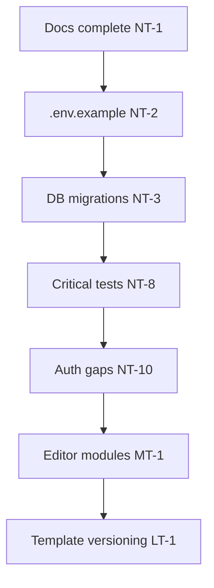

# LeadPages Roadmap

**Document:** `13-ROADMAP`  
**Status:** Prioritised future work and known gaps  
**Audience:** Product owners, engineers, partners  
**Prerequisites:** [00-VISION](00-VISION.md), [01-ARCHITECTURE](01-ARCHITECTURE.md)

> This document consolidates **near-, medium-, and long-term** priorities from vision docs, architecture reviews, and technical debt registers. It is a living plan — not a commitment calendar.

---

## How to Use This Document

| When | Action |
|------|--------|
| Starting a feature | Check if it aligns with a listed priority |
| Fixing debt | Link PR to debt item ID |
| AI agents | Do not implement roadmap items without explicit user request |
| Vision conflicts | [00-VISION](00-VISION.md) wins over roadmap ordering |

---

## Near-Term Priorities

High impact, foundational work that unblocks everything else.

| ID | Item | Rationale | Touchpoints |
|----|------|-----------|-------------|
| NT-1 | **Complete engineering docs (`docs/00–13`)** | AI-readable canon for safe development | `docs/` |
| NT-2 | **`.env.example`** | Onboarding and deploy reproducibility | Root, Vercel |
| NT-3 | **Database migrations in repo** | Environment parity; rollback | `db/migrations/` |
| NT-4 | **Editor organisation** | `manage.html` ~5,400 lines — grouped settings without removing options | `manage.html` |
| NT-5 | **Partner dashboard polish** | Client list, onboarding, directory flow | `partner-dashboard.html` |
| NT-6 | **Domain purchase → site connect** | Today manual: Vercel domain + `custom_domain` field | `api/domains/*`, `manage.html` |
| NT-7 | **SEO sitemap live filter** | Done — `/seo-sitemap.xml` indexes live tenants only | `app/seo-sitemap.xml/route.js` |
| NT-8 | **Critical path tests** | Render gates, leads, events ingest | CI / Vercel |
| NT-9 | **Fix trade dashboard Calls metric** | `phone_click` vs `call_click` mismatch | `manage.html` `_dashLoadStats` |
| NT-10 | **Close auth gaps** | `api-partner-templates`, `api-site-apps` lack Bearer | `api/` |

---

## Medium-Term Priorities

Structural improvements that reduce risk and increase velocity.

| ID | Item | Rationale | Touchpoints |
|----|------|-----------|-------------|
| MT-1 | **Extract `manage.html` modules** | Gradual JS extraction without SPA rewrite | `manage/` or `lib/editor/` |
| MT-2 | **Unified admin authorization** | Email allowlist + `is_super_admin` duality | `api/`, middleware |
| MT-3 | **Partner commission reporting** | Ledger exists; payout UI manual | `partner.html`, `partners-admin.html` |
| MT-4 | **Partner training resources** | Academy tables exist; content depth | `partner_resources`, HTML |
| MT-5 | **Client transfer self-service** | Admin-only today | `partners-admin.html`, API |
| MT-6 | **Marketplace app maturity** | Paid apps, schema validation, auth | `api-site-apps.js`, `app_registry` |
| MT-7 | **Richer analytics** | UTM capture, funnel visualisation | `events` schema, `ANA` UI |
| MT-8 | **Lead management depth** | SMS, follow-up sequences | `leads`, integrations |
| MT-9 | **`metaTemplate` in editor** | Suburb meta customisation without deploy | `manage.html`, Local SEO tab |
| MT-10 | **Align suburb lists** | `area.suburbs` vs `serviceAreas.areas` confusion | Editor UX |
| MT-11 | **Retire legacy builder** | `builder.html` + `ADMIN_PASSWORD` | Deprecation path |
| MT-12 | **Stripe Connect evaluation** | Automated partner payouts vs manual ledger | Billing architecture |

---

## Long-Term Priorities

Platform evolution — requires explicit approval before starting.

| ID | Item | Rationale | Touchpoints |
|----|------|-----------|-------------|
| LT-1 | **Template versioning** | Pin template at site creation; safe upgrades | `sites`, deploy |
| LT-2 | **Componentized templates** | Replace monolithic `trade.template.json` | `03-TEMPLATE-SYSTEM` |
| LT-3 | **JSON Schema for `sites.config`** | Validation, generated types | `02-DATABASE` |
| LT-4 | **AI site generation at scale** | Trade pack generation proven; extend carefully | `api-trade-generate` |
| LT-5 | **Plugin / add-on architecture** | Formal marketplace SDK | `app_registry`, `app_schemas` |
| LT-6 | **Multi-agent dev workflow** | Safer parallel AI contributions | Docs, CI, branch policy |
| LT-7 | **Suburb URL prefix** | Resolve `/:slug/:page` collision | Routing, `vercel.json` |
| LT-8 | **White-label partner branding** | Deeper than showcase accent colour | Partner profiles |
| LT-9 | **Review syndication** | Marketplace social proof feeds | Templates, APIs |
| LT-10 | **Revenue reporting** | "Jobs won from site" for partners | CRM, analytics |

---

## Technical Debt Register

Consolidated from architecture and topic docs. Fix opportunistically or schedule explicitly.

| ID | Debt | Severity | Location |
|----|------|----------|----------|
| TD-1 | `manage.html` monolith | High | `manage.html` |
| TD-2 | `api/manage.html` duplicate | Medium | `api/manage.html` |
| TD-3 | `events.js` / `stats.js` root duplicates | Low | Root |
| TD-4 | `buildTradeHtml` unused in render.js | Low | `api/render.js` |
| TD-5 | `demo-shared.js` vs template JS drift | Medium | `marketplace/demos/` |
| TD-6 | Dual token systems `{{}}` vs `{}` | Medium | Docs, templates |
| TD-7 | No template versioning | High | Deploy model |
| TD-8 | App Router vs render URL collision | Medium | Routing |
| TD-9 | Schema not fully in migrations | High | Supabase |
| TD-10 | Publish vs `status` two-step go-live | Medium | Partner UX |
| TD-11 | Domain purchase not auto-connecting site | Medium | Domains |
| TD-12 | `vertical` vs `template` legacy | Low | `sites` table |
| TD-13 | Unprotected partner/app APIs | High | Security |
| TD-14 | Manual commission payout | Medium | Billing |
| TD-15 | `plumber.html` legacy reference | Low | Root |

---

## Product Themes (from Vision)

### CRM & leads

- Lead stages, follow-up reminders, SMS
- Deeper mailer automation
- Partner-visible revenue attribution

### Partners

- Territory / density tooling
- Self-service client transfer
- Automated commission statements
- Expanded Find-a-Partner matching

### SEO

- Sitemap quality (live-only, lastmod)
- Explicit routing for suburb vs landing pages
- Schema.org expansion per section type

### Platform

- Deployment runbook
- Visual regression on core templates
- Render integration test in CI
- Config TypeScript types from schema

### AI safety

- Human approval gates for generated copy
- Template pin per site
- Rate limits and cost caps on intro generation

---

## Explicit Non-Goals (without approval)

| Non-goal | Why |
|----------|-----|
| React SPA rewrite of editor | Vision: pragmatic HTML; huge risk |
| Removing editor settings | "Never delete options" principle |
| Partner revenue share on platform pricing | Flat cost model |
| Doorway-page SEO | Service area gate is intentional |
| Breaking `sites.config` keys | Live customer sites depend on merge semantics |
| Changing partner ownership logic silently | Legal/commission implications |

---

## Suggested Sequencing

Documentation and environment baselines come first — they reduce risk for all subsequent work.

---

## Tracking Progress

When completing a roadmap item:

1. Update this document (mark done or move to changelog section below)
2. Update relevant topic doc if behaviour changed
3. Link PR in commit message

### Completed

| Item | PR / date | Notes |
|------|-----------|-------|
| NT-1 docs series | PRs #2–#13 | Engineering canon |
| — | — | Add rows as items ship |

---

## Related Documentation

| Doc | Topic |
|-----|-------|
| [00-VISION](00-VISION.md) | Product intent, principles |
| [01-ARCHITECTURE](01-ARCHITECTURE.md) | Architecture debt §22–23 |
| [12-CODING-STANDARDS](12-CODING-STANDARDS.md) | How to implement safely |

---

*Document maintained as part of the LeadPages engineering canon. Review quarterly or after major releases.*
