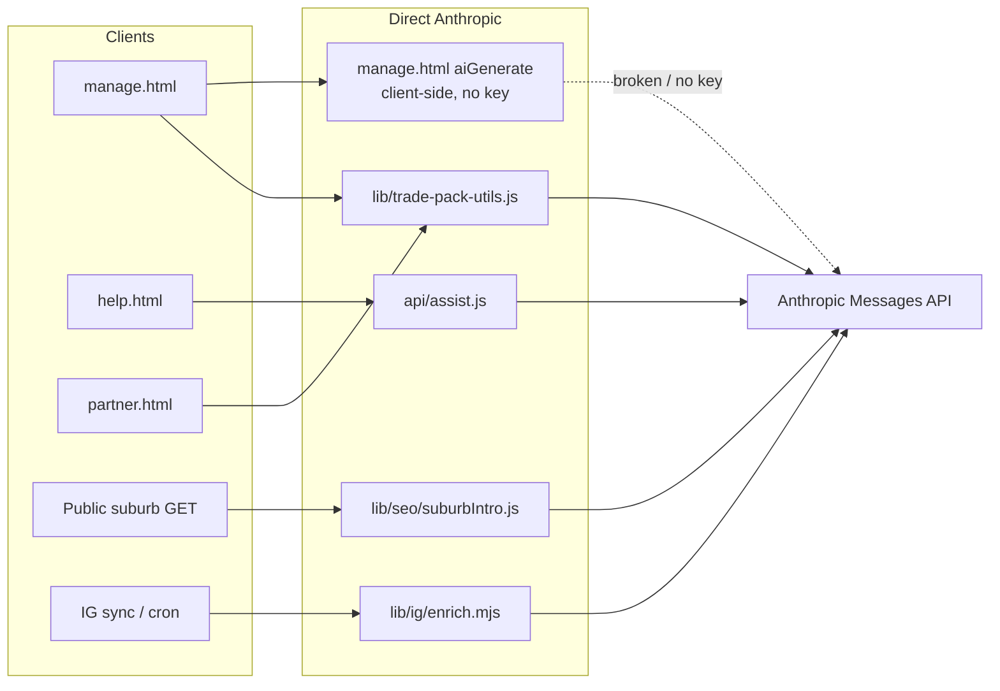

# 01 — Current State Audit

**Document:** `AI/01-CURRENT-STATE-AUDIT`  
**Status:** Historical audit of **pre-Brain** direct Anthropic call sites (still accurate for unmigrated features)  
**Audience:** Architects, engineers, AI agents  
**Live status:** [00-STATUS](00-STATUS.md) — Brain Phases 1–7 shipped; landing drafts migrated behind flag  
**Prerequisites:** [00-STATUS](00-STATUS.md), [README](README.md), [01-ARCHITECTURE](../01-ARCHITECTURE.md)

> **Scope:** Facts confirmed in code at audit time. Secrets are never reproduced. Unknowns are marked explicitly.  
> **Note (2026-07):** Landing `aiGenerate` (row 6) is outdated — path is now `manage.html` → `POST /api/brain/landing-draft` → Brain when `BRAIN_LANDING_DRAFT=1`. Assist / suburb / packs / IG enrich rows remain correct until those migrate.

---

## 1. Architecture summary (current)

LeadPages runs primarily as **Vercel serverless** (`api/*.js`) plus static HTML control planes (`manage.html`, `partner.html`, …). A thin **Next.js App Router** slice serves suburb SEO pages (`app/[site]/[suburb]/route.js`). Data lives in **Supabase Postgres + Auth**. Site content is stored in **`sites.config` JSONB** (merge-only).

AI usage today is **not** centralised. Confirmed provider: **Anthropic Claude**, called with raw `fetch` to `https://api.anthropic.com/v1/messages`. There is **no** OpenAI, Gemini, Vercel AI SDK, or Anthropic npm package in `package.json`.

---

## 2. Confirmed AI integrations

### Inventory

| # | Feature | Paths | Route | Provider | Model / env | Prompt | Output | Structured? | Auth | Cost visibility | Migration |
|---|---------|-------|-------|----------|-------------|--------|--------|-------------|------|-----------------|-----------|
| 1 | Suburb SEO intros | `lib/seo/suburbIntro.js`, `lib/seo/store.js`, `app/[site]/[suburb]/route.js`, `db/suburb_intros.sql` | Public `GET /{site}/{suburb}` | Anthropic | `ANTHROPIC_MODEL` \|\| `claude-sonnet-4-6`; key `ANTHROPIC_API_KEY` | Inline | Plain paragraph | No | Public; service role for cache | None | Low–med |
| 2 | Help assistant | `api/assist.js`, `help.html` | `POST /api/assist` | Anthropic | `ASSIST_MODEL` \|\| `claude-haiku-4-5-20251001` | Inline + `wiki_articles` | Text / light Markdown | Envelope JSON only | Optional Bearer; role `super` / `partner` / `client` | None | Med |
| 3 | Trade pack generation (shared) | `lib/trade-pack-utils.js` (`buildPrompt`, `callClaude`, `parseAiJson`, `validatePack`) | Library | Anthropic | `TRADE_PACK_MODEL` \|\| `claude-sonnet-4-6`; `max_tokens: 12288` | Inline `buildPrompt` | Large pack JSON | Yes — parse + validate + retries | N/A at lib | None | High |
| 4 | Legacy trade generate API | `api/api-trade-generate.js` | `POST /api/api-trade-generate` | Anthropic via #3 | Same as #3 | Shared | Pack JSON | Yes | Bearer; **user exists only** (not partner/super) | None | Med |
| 5 | Partner acquire trade pack | `api/partner/acquire-trade-pack.js`, `lib/trade-pack-auth.js` | `POST /api/partner/acquire-trade-pack` | Anthropic via #3 | Same as #3 | Shared | Pack JSON / confirmation gate | Yes | Active partner **or** super-admin | UX “AI credits” — **no ledger in code** | Med–high |
| 6 | Landing page AI draft | `manage.html` (`aiGenerate`); stale twin `api/manage.html` | **None** — browser → Anthropic | Anthropic | Hardcoded `claude-sonnet-4-6` | Inline + presets | Markdown | No | Editor UI only; **no API key sent** | None | Low |
| 7 | Manual Claude paste (stale) | `api/manage.html` (`__buildTradePrompt`) — **not** in root `manage.html` | None (human paste) | External Claude | N/A | Inline (dialect differs from #3) | Pack JSON paste | Client `JSON.parse` | Editor session | None | Low if consolidating |
| 8 | Instagram caption enrich | `lib/ig/enrich.mjs`, `lib/ig/igSync.mjs`, `api/cron/sync-instagram.mjs`, `api/instagram/sync.mjs` | Cron / on-demand sync | Anthropic | `ANTHROPIC_MODEL` \|\| `claude-sonnet-4-6` | Inline | `{title, service, location}` JSON | Yes — regex + parse; fail → null | `CRON_SECRET` / sync auth | None | Low–med |

### Explicit non-AI (searched)

| Area | Finding |
|------|---------|
| Quote system (`api/quote-system/*`, `lib/quote-system/*`) | No LLM calls (“generate” = codes/PDF/pricing) |
| OpenAI / Gemini / Bedrock / Vertex | No code hits |
| Vercel AI SDK / `generateObject` / `generateText` | Absent |
| Embeddings APIs | Absent |
| AI Control Centre UI | **Does not exist** |

---

## 3. Environment variables (names only)

| Variable | Consumers |
|----------|-----------|
| `ANTHROPIC_API_KEY` | suburbIntro, enrich, assist, trade-pack-utils |
| `ANTHROPIC_MODEL` | suburbIntro, enrich (default `claude-sonnet-4-6`) |
| `ASSIST_MODEL` | assist.js |
| `TRADE_PACK_MODEL` | trade-pack-utils |
| Related non-LLM | `SUPABASE_*`, `CRON_SECRET`, `SEO_TEMPLATE_URL` (suburb template fetch) |

No committed `.env.example` for AI keys was found. Live Vercel values are **unknown** to this audit.

---

## 4. Data stores touching AI

| Store | Path / evidence | Role |
|-------|-----------------|------|
| `suburb_intros` | `db/suburb_intros.sql` | Cache `(site, suburb) → intro` |
| `service_packs` | Used by generate/acquire | AI pack rows (`variant`, `content_hash`, `generated_by`, …) |
| `pack_location_usage` | `db/pack_location_usage.sql` | Location dedupe for packs |
| `wiki_articles` | assist context | Help corpus (not model output store) |
| `sites.config` | Landing `pages[].body`, `sections.projectFeed.aiEnrich` / items | Feature config + enriched IG items |

---

## 5. Auth, roles, and AI exposure

| Pattern | Detail |
|---------|--------|
| Editor roles | `super` (`profiles.is_super_admin`), `broker` / partner, client |
| Assist roles | `super` / `partner` / `client` (default unauthenticated = client) |
| Acquire packs | Partner **or** super (`lib/trade-pack-auth.js`) |
| `api-trade-generate` | **Weaker** — any valid JWT |
| Suburb intros | **Public GET** can trigger Claude on cache miss |
| Landing `aiGenerate` | Client-side; broken without key |

**Gap:** No AI route uses `api/_rate-limit.js` (used by events/leads). Public suburb misses and unauthenticated assist are spend risks.

---

## 6. Logging, validation, security (current)

| Concern | Current state |
|---------|----------------|
| Usage / token logging | **Missing** |
| Cost ledger / budgets | **Missing** (“AI credits” is UX copy only on acquire) |
| Prompt registry | **Missing** — prompts inline in feature files |
| Structured validation | Strong for trade packs; weak/absent for assist & suburb intros |
| Provider secret in browser | Landing draft path is unsafe *by design* if a key were ever added client-side |
| Error handling | Mostly fallbacks (suburb/IG) or HTTP 4xx/5xx (assist/packs) |
| Rate limiting | **Not applied** to AI routes |
| Tests | `scripts/test-parse-ai-json.js` helpers; no adapter/mock provider suite for Claude calls |

---

## 7. Cron / background

From `vercel.json` (verified): billing cron, events-rollup, google-ads sync.  
`api/cron/sync-instagram.mjs` **exists** but is **not** listed in current `vercel.json` `crons` — whether IG (and thus enrich) runs on a schedule outside this file is **unknown**.

---

## 8. Technical debt and lock-in

| Debt | Evidence | Risk |
|------|----------|------|
| Provider lock-in to Anthropic fetch shape | All call sites | Hard to A/B or fail over |
| Duplicated / divergent prompts | `buildPrompt` vs `__buildTradePrompt` vs landing presets | Inconsistent quality |
| Broken client landing AI | `manage.html` `aiGenerate` | Feature appears available but fails |
| Stale `api/manage.html` | Duplicate of manage with different AI UX | Confusion / drift |
| Weak auth on `api-trade-generate` | Any JWT | Spend abuse |
| No cost observability | Entire AI surface | Bill shock |
| Public-triggered suburb generation | Cache miss on GET | Unbounded cost |
| No AI Control Centre | — | Ops cannot tune models/routes |

---

## 9. Areas that must not be disrupted

When Brain lands, preserve behaviour for:

- Public lead/event endpoints (always 200) — unrelated but non-negotiable platform rule
- `sites.config` merge-only discipline
- Trade pack acquire confirmation gates and location dedupe
- Suburb intro cache semantics (`suburb_intros`)
- Partner RLS / showcase paths
- Google Ads OAuth and sync (not AI today; Marketing Hub later)

---

## 10. Documentation coverage today

AI is mentioned across [08-SEO](../08-SEO.md), [04-SITE-BUILDER](../04-SITE-BUILDER.md), [features/SEO](../features/SEO.md), [features/Pages](../features/Pages.md), [features/Service Packs](../features/Service%20Packs.md), [features/Instagram](../features/Instagram.md), [features/Project Feed](../features/Project%20Feed.md). There was **no** dedicated Brain / AI gateway doc set before this folder.

---

## 11. Unknowns

1. Whether `api/manage.html` is still served in production.  
2. Live Vercel values for `ANTHROPIC_*` / model overrides.  
3. Whether Instagram sync still runs on a schedule outside `vercel.json`.  
4. Whether any “AI credits” billing exists outside this repository (none found in-code).  
5. Whether `POST /api/api-trade-generate` still has production callers.

---

## Next

- Principles: [02-VISION-AND-PRINCIPLES](02-VISION-AND-PRINCIPLES.md)  
- Target design: [03-TARGET-ARCHITECTURE](03-TARGET-ARCHITECTURE.md)  
- Migration order: [16-MIGRATION-PLAN](16-MIGRATION-PLAN.md)
