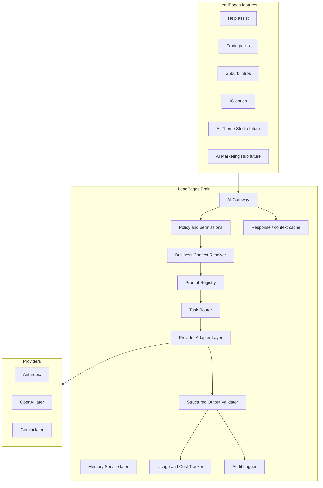

# 03 — Target Architecture

**Document:** `AI/03-TARGET-ARCHITECTURE`  
**Status:** Partial — core gateway implemented (Phases 1–7); see [00-STATUS](00-STATUS.md)  
**Prerequisites:** [00-STATUS](00-STATUS.md), [02-VISION-AND-PRINCIPLES](02-VISION-AND-PRINCIPLES.md), [01-ARCHITECTURE](../01-ARCHITECTURE.md)

---

## System context

---

## Request lifecycle (happy path)

1. Feature authenticates user (or cron secret / public policy).  
2. Feature calls Brain `generate` / `generateStructured` / `stream` with **task ID**, tenant IDs, input.  
3. Policy layer checks role, site ownership, plan limits, feature flags.  
4. Context resolver loads allowed business context (size-bounded).  
5. Prompt engine renders versioned prompt + schema.  
6. Task router selects provider/model/fallback chain.  
7. Adapter executes with timeout; normalises errors and usage.  
8. Validator checks schema; optional repair retry.  
9. Usage + audit logged; result returned to feature.  
10. Feature shows preview; user approves before publish (when consequential).

---

## Major components

| Component | Responsibility | V1? |
|-----------|----------------|-----|
| AI Gateway | Internal API entry; correlation IDs; auth handoff | Yes |
| Policy and Permission Layer | RBAC, tenant checks, rate limits | Yes |
| Business Context Resolver | Site/partner/account slices | Yes (minimal) |
| Prompt Registry | Versioned prompts + schemas | Yes |
| Task Router | Policy-driven model selection | Yes (simple) |
| Model Registry | Configured models/capabilities | Yes |
| Provider Adapter Layer | Provider-specific HTTP/SDK behind interface | Yes (Anthropic first) |
| Structured Output Validator | JSON Schema (or equivalent) | Yes |
| Retry and Fallback Manager | Timeouts, retries, fallbacks | Yes |
| Usage and Cost Tracker | Tokens/cost rows | Yes |
| Audit Logger | Who/what/when; redacted | Yes |
| Cache | Suburb-style deterministic caches; prompt result cache later | Partial (reuse `suburb_intros`) |
| Feature Flag Layer | Migrate per feature | Yes |
| Memory Service | Conversations / site memory | Later |
| AI Control Centre | Superuser ops UI | Phase 6 |
| Evaluation Framework | Offline evals / canaries | Later |

---

## Trust and tenant boundaries

| Boundary | Rule |
|----------|------|
| Browser ↔ LeadPages API | JWT / session; never provider keys |
| Feature ↔ Brain | Server-only; service identity + user context |
| Brain ↔ Provider | Server-only; provider keys from env/vault |
| Site A ↔ Site B | Context resolver enforces site ownership / partner scope |
| Partner ↔ Client sites | Only sites linked via partner IDs |
| Public tasks | Explicit allowlist (e.g. suburb intro) + strict rate/budget |

---

## Flows

### Failure flow

Adapter error → classify (timeout / rate / invalid / auth) → retry if safe → fallback model if policy allows → structured Brain error to feature → usage row with failure → feature safe fallback (template copy / “try again”).

### Streaming flow (later / assist)

Gateway stream → adapter SSE/stream → feature UI; usage finalised on completion; validation deferred or chunk-aware (assist may stay free-text).

### Caching flow

Deterministic tasks (suburb intro) keep table cache. Generic response cache keyed by `(task, promptVersion, contextHash, inputHash)` — **V1 optional**; never cache cross-tenant.

### Audit flow

Every Brain request writes audit event: actor, tenant, task, prompt version, provider/model, outcome, correlation ID. Bodies redacted or sampled per policy ([10-OBSERVABILITY-AND-COSTS](10-OBSERVABILITY-AND-COSTS.md)).

---

## Placement in existing runtime

Proposed V1 shape (not implemented):

- `lib/ai/` or `lib/brain/` — pure Node modules callable from `api/*`  
- `api/ai/*` or internal-only handlers — **only if** browser features need a thin public façade; prefer feature routes calling lib Brain  
- No Next.js requirement; fits current Vercel serverless model  

---

## Related

- Adapters: [04-PROVIDER-ADAPTERS](04-PROVIDER-ADAPTERS.md)  
- Router: [05-TASK-ROUTER](05-TASK-ROUTER.md)  
- Contracts: [13-INTERNAL-API-CONTRACTS](13-INTERNAL-API-CONTRACTS.md)
