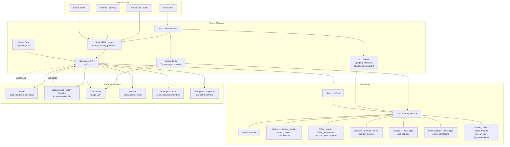

# LeadPages Knowledge Base — Master Index

> **AI agents: read this document first.**  
> Then read [CLAUDE.md](../CLAUDE.md), [00-VISION](00-VISION.md), and [01-ARCHITECTURE](01-ARCHITECTURE.md) before changing any code.

This is the master navigation document for the entire LeadPages knowledge base. It links every documentation file, subsystem, API route, database table, template, HTML page, serverless function, and external integration in the repository.

**Entity:** Bean Culture Pty Ltd t/a Web Culture  
**Stack:** Vercel (hosting + serverless) · Supabase (Postgres + Auth) · Static HTML · JSON templates · small Next.js App Router slice

---

## Table of Contents

1. [How to Use This Index](#how-to-use-this-index)
2. [Platform at a Glance](#platform-at-a-glance)
3. [System Architecture Diagram](#system-architecture-diagram)
4. [Knowledge Base Documents](#knowledge-base-documents)
5. [Agent & Repository Guides](#agent--repository-guides)
6. [Subsystems](#subsystems)
7. [Database Tables](#database-tables)
8. [API Reference](#api-reference)
9. [App Router Routes](#app-router-routes)
10. [Templates](#templates)
11. [HTML Pages](#html-pages)
12. [Shared Libraries](#shared-libraries)
13. [External Integrations](#external-integrations)
14. [Configuration & Deployment](#configuration--deployment)
15. [Document Map by Topic](#document-map-by-topic)

---

## How to Use This Index

| If you need to… | Start here |
|-----------------|------------|
| Understand product goals and constraints | [00-VISION](00-VISION.md) |
| Understand runtime architecture | [01-ARCHITECTURE](01-ARCHITECTURE.md) |
| Query or migrate data | [02-DATABASE](02-DATABASE.md) · [Database Tables](#database-tables) |
| Change how tenant pages render | [03-TEMPLATE-SYSTEM](03-TEMPLATE-SYSTEM.md) · [api/render.js](../api/render.js) |
| Work on the site editor | [04-SITE-BUILDER](04-SITE-BUILDER.md) · [10-EDITOR](10-EDITOR.md) · [manage.html](../manage.html) |
| Work on partners / resellers | [05-PARTNERS](05-PARTNERS.md) |
| Work on domains / DNS | [06-DOMAINS](06-DOMAINS.md) |
| Work on analytics | [07-TRACKING](07-TRACKING.md) |
| Work on local SEO / suburb pages | [08-SEO](08-SEO.md) · [app/[site]/[suburb]](../app/[site]/[suburb]/route.js) |
| Work on leads / CRM / email | [09-CRM](09-CRM.md) |
| Follow UI conventions | [11-DESIGN-SYSTEM](11-DESIGN-SYSTEM.md) |
| Follow code conventions | [12-CODING-STANDARDS](12-CODING-STANDARDS.md) |
| See planned work | [13-ROADMAP](13-ROADMAP.md) |

**Golden rule:** one tenant site = one row in `sites`. Most editable content lives in `sites.config` (JSONB). Never wipe or rename unknown `config` fields.

---

## Platform at a Glance

LeadPages is a multi-tenant SaaS website builder for Australian tradies, service businesses, mortgage brokers, agencies, and partner resellers. Customers and partners create SEO-ready sites, capture leads, track events, connect domains, and manage billing — without a developer.

| Layer | Technology | Role |
|-------|------------|------|
| Public tenant sites | [api/render.js](../api/render.js) + [vercel.json](../vercel.json) rewrites | Serve `/:slug` and custom domains from `sites` table |
| Local SEO suburb pages | [app/[site]/[suburb]](../app/[site]/[suburb]/route.js) | Server-rendered per-suburb landing pages |
| Site editor | [manage.html](../manage.html) | Primary builder UI (~5,400 lines) |
| Partner tools | [partner-dashboard.html](../partner-dashboard.html) + `api/partner/*` | Reseller onboarding, demos, quotes, showcase |
| Platform admin | [partners-admin.html](../partners-admin.html), [marketplace-admin.html](../marketplace-admin.html), [apps-admin.html](../apps-admin.html) | Super-admin surfaces |
| Data | Supabase Postgres | Auth, sites, leads, events, billing, domains, partners |
| Media | Cloudinary + `api/cloudinary/*` | Signed direct uploads scoped per site |
| Payments | Stripe + `api/billing/*` | Hosting subscriptions, app add-ons, domain checkout |
| Domains | Dreamscape reseller API + [dreamscape.js](../dreamscape.js) | Search, register, DNS, email add-ons |

---

## System Architecture Diagram

---

## Knowledge Base Documents

Read documents in order when onboarding. Each numbered doc is the canonical deep-dive for its topic.

| # | Document | Summary |
|---|----------|---------|
| — | **[INDEX.md](INDEX.md)** (this file) | Master navigation for the entire knowledge base |
| 00 | [00-VISION.md](00-VISION.md) | Product vision, customers, promise, principles |
| 01 | [01-ARCHITECTURE.md](01-ARCHITECTURE.md) | Runtime architecture, request flow, deployment model |
| 02 | [02-DATABASE.md](02-DATABASE.md) | Supabase schema, `sites.config`, table reference |
| 03 | [03-TEMPLATE-SYSTEM.md](03-TEMPLATE-SYSTEM.md) | JSON templates, rendering pipeline, token substitution |
| 04 | [04-SITE-BUILDER.md](04-SITE-BUILDER.md) | `manage.html` editor, site lifecycle, backups |
| 05 | [05-PARTNERS.md](05-PARTNERS.md) | Partner program, showcase, quotes, commissions |
| 06 | [06-DOMAINS.md](06-DOMAINS.md) | Dreamscape integration, registration, DNS, pricing |
| 07 | [07-TRACKING.md](07-TRACKING.md) | Events, analytics beacons, stats dashboard |
| 08 | [08-SEO.md](08-SEO.md) | Local SEO, suburb pages, sitemaps, meta tags |
| 09 | [09-CRM.md](09-CRM.md) | Leads, email campaigns, opt-outs, messaging |
| 10 | [10-EDITOR.md](10-EDITOR.md) | Editor UX patterns, section controls, workflows |
| 11 | [11-DESIGN-SYSTEM.md](11-DESIGN-SYSTEM.md) | Visual language, components, SaaS UI conventions |
| 12 | [12-CODING-STANDARDS.md](12-CODING-STANDARDS.md) | Code style, safety rules, PR expectations |
| 13 | [13-ROADMAP.md](13-ROADMAP.md) | Near-term priorities and planned improvements |

---

## Agent & Repository Guides

| Document | Purpose |
|----------|---------|
| [CLAUDE.md](../CLAUDE.md) | Primary AI instructions — non-negotiable rules, workflow |
| [AGENTS.md](../AGENTS.md) | Agent behaviour for Cursor, Copilot, Claude Code |
| [readme.md](../readme.md) | Human-facing project overview and quick start |

---

## Subsystems

Each subsystem maps to documentation, primary code, and database tables.

### Core Platform

| Subsystem | Description | Key files | Doc |
|-----------|-------------|-----------|-----|
| **Tenant rendering** | Serves public sites by slug or custom domain | [api/render.js](../api/render.js), [vercel.json](../vercel.json) | [03-TEMPLATE-SYSTEM](03-TEMPLATE-SYSTEM.md) |
| **Site builder** | Visual editor for tenant content | [manage.html](../manage.html), [api/create-site.js](../api/create-site.js) | [04-SITE-BUILDER](04-SITE-BUILDER.md), [10-EDITOR](10-EDITOR.md) |
| **Template engine** | JSON-held HTML + token merge | [trade.template.json](../trade.template.json), [broker.template.json](../broker.template.json), [agency.template.json](../agency.template.json), [brokerapp.template.json](../brokerapp.template.json) | [03-TEMPLATE-SYSTEM](03-TEMPLATE-SYSTEM.md) |
| **Auth & profiles** | Supabase Auth, super-admin flag | `profiles` table, session checks in HTML/API | [01-ARCHITECTURE](01-ARCHITECTURE.md) |
| **System pages** | Platform-wide HTML fragments (suspended page, etc.) | [api/system-pages.js](../api/system-pages.js), `system_pages` | [01-ARCHITECTURE](01-ARCHITECTURE.md) |

### CRM & Communications

| Subsystem | Description | Key files | Doc |
|-----------|-------------|-----------|-----|
| **Lead capture** | Quote forms → leads + email notification | [api/leads.js](../api/leads.js), [api/notify-message.js](../api/notify-message.js) | [09-CRM](09-CRM.md) |
| **Analytics** | Page views, call clicks, form submits | [api/events.js](../api/events.js), [api/stats.js](../api/stats.js), [events.js](../events.js) | [07-TRACKING](07-TRACKING.md) |
| **Email campaigns** | Mini-newsletter / bulk mail to leads | [api/send-campaign.js](../api/send-campaign.js), [api/cron/send-due.js](../api/cron/send-due.js), [api/unsubscribe.js](../api/unsubscribe.js) | [09-CRM](09-CRM.md) |
| **Messaging** | Partner ↔ client conversations | [messages.html](../messages.html), `conversations`, `messages` | [09-CRM](09-CRM.md) |
| **Help / wiki** | In-app help articles | [help.html](../help.html), `wiki_articles` | [10-EDITOR](10-EDITOR.md) |
| **AI assist** | Role-aware help assistant | [api/assist.js](../api/assist.js) | [00-VISION](00-VISION.md) |

### Partners & Resellers

| Subsystem | Description | Key files | Doc |
|-----------|-------------|-----------|-----|
| **Partner accounts** | Partner identity, claiming by email | [api/partner/me.js](../api/partner/me.js), `partners`, `partner_profiles` | [05-PARTNERS](05-PARTNERS.md) |
| **Partner dashboard** | Client onboarding, mockups, showcase | [partner-dashboard.html](../partner-dashboard.html), `api/partner/*` | [05-PARTNERS](05-PARTNERS.md) |
| **Quotes & checkout** | Tokenised quotes → Stripe → live site | [api/partner/quote-create.js](../api/partner/quote-create.js), [api/partner/buy-site.js](../api/partner/buy-site.js), [quote.html](../quote.html) | [05-PARTNERS](05-PARTNERS.md) |
| **Partner directory** | Public find-a-partner listings | [api/partner-directory.js](../api/partner-directory.js), [find-a-partner.html](../find-a-partner.html) | [05-PARTNERS](05-PARTNERS.md) |
| **Partner onboarding** | Training steps and progress | [api/partner-onboarding.js](../api/partner-onboarding.js), [partner-onboarding.html](../partner-onboarding.html) | [05-PARTNERS](05-PARTNERS.md) |
| **Commissions** | Build + recurring partner commissions | [api/billing/webhook.js](../api/billing/webhook.js), `partner_commissions` | [05-PARTNERS](05-PARTNERS.md) |
| **Partner admin** | Approve applications, manage partners | [partners-admin.html](../partners-admin.html), [api/partner-apply.js](../api/partner-apply.js) | [05-PARTNERS](05-PARTNERS.md) |

### Billing & Subscriptions

| Subsystem | Description | Key files | Doc |
|-----------|-------------|-----------|-----|
| **Hosting plans** | Plan builder, monthly amounts | [api/billing/plans.js](../api/billing/plans.js), `billing_plans` | [01-ARCHITECTURE](01-ARCHITECTURE.md) |
| **Stripe checkout** | Client subscription start | [api/billing/checkout.js](../api/billing/checkout.js), [billing.html](../billing.html) | [01-ARCHITECTURE](01-ARCHITECTURE.md) |
| **Stripe webhooks** | Subscription lifecycle, commissions | [api/billing/webhook.js](../api/billing/webhook.js) | [05-PARTNERS](05-PARTNERS.md) |
| **Customer portal** | Card update, invoices | [api/billing/portal.js](../api/billing/portal.js) | [01-ARCHITECTURE](01-ARCHITECTURE.md) |
| **App marketplace billing** | Per-app subscriptions | [api/billing/app-checkout.js](../api/billing/app-checkout.js), `site_app_subscriptions` | [04-SITE-BUILDER](04-SITE-BUILDER.md) |
| **Contra accounts** | Barter / contra billing ledger | [api/billing/contra.js](../api/billing/contra.js), `contra_accounts`, `contra_ledger` | [02-DATABASE](02-DATABASE.md) |
| **Billing cron** | Daily suspension / deletion flags | [api/billing/cron.js](../api/billing/cron.js) | [01-ARCHITECTURE](01-ARCHITECTURE.md) |
| **Suspended pages** | Content shown when billing suspended | [api/billing/system-pages.js](../api/billing/system-pages.js) | [02-DATABASE](02-DATABASE.md) |

### Domains

| Subsystem | Description | Key files | Doc |
|-----------|-------------|-----------|-----|
| **Domain search** | Availability check via Dreamscape | [api/domains/availability.js](../api/domains/availability.js), [domains.html](../domains.html) | [06-DOMAINS](06-DOMAINS.md) |
| **Domain checkout** | Stripe cart → registration | [api/domains/checkout.js](../api/domains/checkout.js), [api/domains/webhook.js](../api/domains/webhook.js) | [06-DOMAINS](06-DOMAINS.md) |
| **DNS management** | A/CNAME/MX/TXT records | [api/domains/dns.js](../api/domains/dns.js), [api/domains/detail.js](../api/domains/detail.js) | [06-DOMAINS](06-DOMAINS.md) |
| **Domain pricing** | TLD wholesale/retail admin | [api/domains/pricing.js](../api/domains/pricing.js), `domain_pricing` | [06-DOMAINS](06-DOMAINS.md) |
| **Reseller admin** | Dreamscape account, invoices | [api/domains/account.js](../api/domains/account.js), [dreamscape.js](../dreamscape.js) | [06-DOMAINS](06-DOMAINS.md) |

### Marketplace & Apps

| Subsystem | Description | Key files | Doc |
|-----------|-------------|-----------|-----|
| **Feature catalog** | Marketplace categories and features | [api/catalog.js](../api/catalog.js), [marketplace.html](../marketplace.html) | [04-SITE-BUILDER](04-SITE-BUILDER.md) |
| **Catalog admin** | CRUD for marketplace content | [marketplace-admin.html](../marketplace-admin.html) | [04-SITE-BUILDER](04-SITE-BUILDER.md) |
| **Site apps** | Installed apps per site | [api/api-site-apps.js](../api/api-site-apps.js), [api/api-apps.js](../api/api-apps.js), `site_apps` | [04-SITE-BUILDER](04-SITE-BUILDER.md) |
| **App registry** | App definitions and schemas | `app_registry`, `app_schemas`, `app_presets` | [02-DATABASE](02-DATABASE.md) |
| **Service packs** | Trade content packs (plumber, etc.) | `service_packs`, [api/api-trade-generate.js](../api/api-trade-generate.js) | [03-TEMPLATE-SYSTEM](03-TEMPLATE-SYSTEM.md) |
| **Demo themes** | Appearance presets for demos | `demo_themes`, `partner_themes` | [05-PARTNERS](05-PARTNERS.md) |

### SEO & Local Pages

| Subsystem | Description | Key files | Doc |
|-----------|-------------|-----------|-----|
| **Suburb pages** | Per-suburb localized landing pages | [app/[site]/[suburb]](../app/[site]/[suburb]/route.js), [lib/seo/](../lib/seo/) | [08-SEO](08-SEO.md) |
| **SEO sitemap** | All suburb URLs for Google | [app/seo-sitemap.xml/route.js](../app/seo-sitemap.xml/route.js) | [08-SEO](08-SEO.md) |
| **Suburb intro cache** | AI-written intros (one per site+suburb) | [lib/seo/suburbIntro.js](../lib/seo/suburbIntro.js), [db/suburb_intros.sql](../db/suburb_intros.sql) | [08-SEO](08-SEO.md) |
| **Trade stats** | Public trade statistics | [api/api-trade-stats.js](../api/api-trade-stats.js) | [08-SEO](08-SEO.md) |

### Media & Instagram

| Subsystem | Description | Key files | Doc |
|-----------|-------------|-----------|-----|
| **Cloudinary uploads** | Signed direct browser uploads | [api/cloudinary/sign.js](../api/cloudinary/sign.js), [api/cloudinary/delete.js](../api/cloudinary/delete.js) | [04-SITE-BUILDER](04-SITE-BUILDER.md) |
| **Instagram connect** | OAuth + token storage | [api/instagram/connect.js](../api/instagram/connect.js), [db/instagram_schema.sql](../db/instagram_schema.sql) | [04-SITE-BUILDER](04-SITE-BUILDER.md) |
| **Instagram feed** | Public gallery on tenant sites | [api/ig-media.js](../api/ig-media.js), [lib/ig/](../lib/ig/) | [04-SITE-BUILDER](04-SITE-BUILDER.md) |
| **Instagram sync** | Background token refresh / media sync | [api/cron/sync-instagram.mjs](../api/cron/sync-instagram.mjs), [api/instagram/sync.mjs](../api/instagram/sync.mjs) | [04-SITE-BUILDER](04-SITE-BUILDER.md) |

### Platform Marketing

| Subsystem | Description | Key files | Doc |
|-----------|-------------|-----------|-----|
| **Marketing site** | LeadPages.com.au homepage | [home.html](../home.html) | [00-VISION](00-VISION.md) |
| **Partner landing** | Partner program marketing | [partners.html](../partners.html), [partner.html](../partner.html) | [05-PARTNERS](05-PARTNERS.md) |
| **Tradies landing** | Tradie-focused marketing | [tradies.html](../tradies.html) | [00-VISION](00-VISION.md) |
| **Resources** | Blog-style resource articles | [resources.html](../resources.html), `resource-*.html` | [00-VISION](00-VISION.md) |
| **Legal** | Privacy, terms, Instagram policy | [privacy-policy.html](../privacy-policy.html), [terms-of-use.html](../terms-of-use.html) | — |

---

## Database Tables

All tables live in Supabase Postgres. Only [db/suburb_intros.sql](../db/suburb_intros.sql) and [db/instagram_schema.sql](../db/instagram_schema.sql) are versioned in-repo; other schemas are managed in Supabase directly. Full detail: [02-DATABASE](02-DATABASE.md).

### Core & Tenancy

| Table | Purpose | Primary doc |
|-------|---------|-------------|
| [`sites`](../docs/02-DATABASE.md) | **Central tenant table** — slug, config JSONB, billing, partners | [02-DATABASE](02-DATABASE.md) |
| [`profiles`](../docs/02-DATABASE.md) | Auth user profiles, `is_super_admin` | [02-DATABASE](02-DATABASE.md) |
| [`site_backups`](../docs/02-DATABASE.md) | Point-in-time config snapshots | [04-SITE-BUILDER](04-SITE-BUILDER.md) |
| [`system_pages`](../docs/02-DATABASE.md) | Platform HTML fragments (suspended page, etc.) | [02-DATABASE](02-DATABASE.md) |
| [`service_packs`](../docs/02-DATABASE.md) | Trade/category content packs | [03-TEMPLATE-SYSTEM](03-TEMPLATE-SYSTEM.md) |
| [`demo_themes`](../docs/02-DATABASE.md) | Demo appearance presets | [05-PARTNERS](05-PARTNERS.md) |
| [`suburb_intros`](../db/suburb_intros.sql) | Cached AI suburb intro copy | [08-SEO](08-SEO.md) |

### CRM & Analytics

| Table | Purpose | Primary doc |
|-------|---------|-------------|
| [`leads`](../docs/02-DATABASE.md) | Quote form submissions per site | [09-CRM](09-CRM.md) |
| [`events`](../docs/02-DATABASE.md) | Analytics beacons (page_view, call_click, etc.) | [07-TRACKING](07-TRACKING.md) |
| [`email_campaigns`](../docs/02-DATABASE.md) | Scheduled/sent bulk email campaigns | [09-CRM](09-CRM.md) |
| [`campaign_recipients`](../docs/02-DATABASE.md) | Per-recipient send status | [09-CRM](09-CRM.md) |
| [`email_optouts`](../docs/02-DATABASE.md) | Per-site email unsubscribe list | [09-CRM](09-CRM.md) |
| [`conversations`](../docs/02-DATABASE.md) | Partner ↔ client message threads | [09-CRM](09-CRM.md) |
| [`messages`](../docs/02-DATABASE.md) | Individual messages in a conversation | [09-CRM](09-CRM.md) |
| [`conversation_reads`](../docs/02-DATABASE.md) | Read receipts per user | [09-CRM](09-CRM.md) |
| [`wiki_articles`](../docs/02-DATABASE.md) | Help centre articles | [10-EDITOR](10-EDITOR.md) |

### Partners

| Table | Purpose | Primary doc |
|-------|---------|-------------|
| [`partners`](../docs/02-DATABASE.md) | Partner account records | [05-PARTNERS](05-PARTNERS.md) |
| [`partner_profiles`](../docs/02-DATABASE.md) | Showcase settings, support contact, GST | [05-PARTNERS](05-PARTNERS.md) |
| [`partner_applications`](../docs/02-DATABASE.md) | Incoming partner program applications | [05-PARTNERS](05-PARTNERS.md) |
| [`partner_quotes`](../docs/02-DATABASE.md) | Tokenised client quotes | [05-PARTNERS](05-PARTNERS.md) |
| [`partner_commissions`](../docs/02-DATABASE.md) | Build + recurring commission ledger | [05-PARTNERS](05-PARTNERS.md) |
| [`partner_directory`](../docs/02-DATABASE.md) | Public partner directory listings | [05-PARTNERS](05-PARTNERS.md) |
| [`partner_leads`](../docs/02-DATABASE.md) | Business-owner enquiries to partners | [05-PARTNERS](05-PARTNERS.md) |
| [`partner_themes`](../docs/02-DATABASE.md) | Partner-saved site themes | [05-PARTNERS](05-PARTNERS.md) |
| [`partner_templates`](../docs/02-DATABASE.md) | Partner-specific template overrides | [05-PARTNERS](05-PARTNERS.md) |
| [`partner_onboarding`](../docs/02-DATABASE.md) | Onboarding step progress | [05-PARTNERS](05-PARTNERS.md) |
| [`partner_audit_logs`](../docs/02-DATABASE.md) | Admin actions on partner records | [05-PARTNERS](05-PARTNERS.md) |
| [`partner_courses`](../docs/02-DATABASE.md) | Partner training courses | [05-PARTNERS](05-PARTNERS.md) |
| [`partner_training_modules`](../docs/02-DATABASE.md) | Training module content | [05-PARTNERS](05-PARTNERS.md) |
| [`partner_training_progress`](../docs/02-DATABASE.md) | Per-partner training completion | [05-PARTNERS](05-PARTNERS.md) |
| [`partner_resources`](../docs/02-DATABASE.md) | Downloadable partner resources | [05-PARTNERS](05-PARTNERS.md) |
| [`client_transfer_events`](../docs/02-DATABASE.md) | Site ownership transfer audit | [05-PARTNERS](05-PARTNERS.md) |

### Billing

| Table | Purpose | Primary doc |
|-------|---------|-------------|
| [`billing_plans`](../docs/02-DATABASE.md) | Hosting plan definitions | [02-DATABASE](02-DATABASE.md) |
| [`billing_customers`](../docs/02-DATABASE.md) | Stripe customer ↔ user mapping | [02-DATABASE](02-DATABASE.md) |
| [`site_app_subscriptions`](../docs/02-DATABASE.md) | Per-app Stripe subscriptions | [02-DATABASE](02-DATABASE.md) |
| [`contra_accounts`](../docs/02-DATABASE.md) | Contra/barter account headers | [02-DATABASE](02-DATABASE.md) |
| [`contra_ledger`](../docs/02-DATABASE.md) | Contra transaction entries | [02-DATABASE](02-DATABASE.md) |

### Domains

| Table | Purpose | Primary doc |
|-------|---------|-------------|
| [`domains`](../docs/02-DATABASE.md) | Registered domains owned by users | [06-DOMAINS](06-DOMAINS.md) |
| [`domain_orders`](../docs/02-DATABASE.md) | Checkout → registration order rows | [06-DOMAINS](06-DOMAINS.md) |
| [`domain_pricing`](../docs/02-DATABASE.md) | TLD retail price overrides | [06-DOMAINS](06-DOMAINS.md) |
| [`domain_registrants`](../docs/02-DATABASE.md) | WHOIS registrant details | [06-DOMAINS](06-DOMAINS.md) |
| [`domain_customers`](../docs/02-DATABASE.md) | Dreamscape client account mapping | [06-DOMAINS](06-DOMAINS.md) |
| [`domain_events`](../docs/02-DATABASE.md) | Domain lifecycle event log | [06-DOMAINS](06-DOMAINS.md) |

### Marketplace & Apps

| Table | Purpose | Primary doc |
|-------|---------|-------------|
| [`catalog_categories`](../docs/02-DATABASE.md) | Marketplace category taxonomy | [04-SITE-BUILDER](04-SITE-BUILDER.md) |
| [`catalog_features`](../docs/02-DATABASE.md) | Marketplace feature listings | [04-SITE-BUILDER](04-SITE-BUILDER.md) |
| [`catalog_blocks`](../docs/02-DATABASE.md) | Feature demo block payloads | [04-SITE-BUILDER](04-SITE-BUILDER.md) |
| [`app_registry`](../docs/02-DATABASE.md) | Installable app definitions | [02-DATABASE](02-DATABASE.md) |
| [`app_schemas`](../docs/02-DATABASE.md) | App configuration JSON schemas | [02-DATABASE](02-DATABASE.md) |
| [`app_presets`](../docs/02-DATABASE.md) | Default app configuration presets | [02-DATABASE](02-DATABASE.md) |
| [`site_apps`](../docs/02-DATABASE.md) | Apps installed on a specific site | [04-SITE-BUILDER](04-SITE-BUILDER.md) |

### Integrations

| Table | Purpose | Primary doc |
|-------|---------|-------------|
| [`ig_connections`](../db/instagram_schema.sql) | Per-site Instagram API tokens | [04-SITE-BUILDER](04-SITE-BUILDER.md) |

---

## API Reference

All routes deploy as Vercel serverless functions under `/api/*`. Files prefixed with `_` (e.g. `_stripe.js`, `_accrual.js`) are shared modules, not routes.

### Core Platform

| Route | File | Purpose |
|-------|------|---------|
| `GET /api/render` | [api/render.js](../api/render.js) | Render tenant page by slug, page, or custom domain |
| `POST /api/create-site` | [api/create-site.js](../api/create-site.js) | Create new site (admin password-gated) |
| `GET/POST /api/system-pages` | [api/system-pages.js](../api/system-pages.js) | Read/write platform system page HTML |
| `GET /api/admin-data` | [api/admin-data.js](../api/admin-data.js) | Admin dashboard data (password-gated) |
| `GET /api/site/support-contact` | [api/site/support-contact.js](../api/site/support-contact.js) | Servicing partner contact for a site |

### CRM, Analytics & Email

| Route | File | Purpose |
|-------|------|---------|
| `POST /api/leads` | [api/leads.js](../api/leads.js) | Capture quote form submission |
| `POST /api/events` | [api/events.js](../api/events.js) | Record analytics beacon |
| `GET /api/stats` | [api/stats.js](../api/stats.js) | Dashboard stats for manage.html |
| `GET/POST /api/send-campaign` | [api/send-campaign.js](../api/send-campaign.js) | Create/send email campaigns |
| `GET /api/unsubscribe` | [api/unsubscribe.js](../api/unsubscribe.js) | One-click email opt-out |
| `POST /api/notify-message` | [api/notify-message.js](../api/notify-message.js) | Email notification on new message |
| `POST /api/assist` | [api/assist.js](../api/assist.js) | AI help assistant |
| `GET /api/cron/send-due` | [api/cron/send-due.js](../api/cron/send-due.js) | Send scheduled email campaigns |

### Partners

| Route | File | Purpose |
|-------|------|---------|
| `GET /api/partner/me` | [api/partner/me.js](../api/partner/me.js) | Current partner identity + claim-by-email |
| `POST /api/partner/add-customer` | [api/partner/add-customer.js](../api/partner/add-customer.js) | Partner onboards new client site |
| `POST /api/partner/add-mockup` | [api/partner/add-mockup.js](../api/partner/add-mockup.js) | Create demo mockup site |
| `POST /api/partner/ensure-home` | [api/partner/ensure-home.js](../api/partner/ensure-home.js) | Ensure partner has editable home site |
| `POST /api/partner/save-showcase` | [api/partner/save-showcase.js](../api/partner/save-showcase.js) | Save showcase slug/domain settings |
| `GET /api/partner/showcase-check` | [api/partner/showcase-check.js](../api/partner/showcase-check.js) | Check showcase slug availability |
| `POST /api/partner/quote-create` | [api/partner/quote-create.js](../api/partner/quote-create.js) | Create tokenised client quote |
| `GET /api/partner/quote-get` | [api/partner/quote-get.js](../api/partner/quote-get.js) | Public quote lookup by token |
| `POST /api/partner/buy-site` | [api/partner/buy-site.js](../api/partner/buy-site.js) | Public client self-signup checkout |
| `POST /api/partner-apply` | [api/partner-apply.js](../api/partner-apply.js) | Submit partner program application |
| `GET/POST /api/partner-onboarding` | [api/partner-onboarding.js](../api/partner-onboarding.js) | Partner onboarding steps |
| `POST /api/partner-welcome` | [api/partner-welcome.js](../api/partner-welcome.js) | Send partner welcome email |
| `POST /api/partner-lead` | [api/partner-lead.js](../api/partner-lead.js) | Business-owner enquiry to partner |
| `GET /api/partner-directory` | [api/partner-directory.js](../api/partner-directory.js) | Public partner directory |
| `GET/POST /api/partner-directory-self` | [api/partner-directory-self.js](../api/partner-directory-self.js) | Partner's own directory listing |

### Billing

| Route | File | Purpose |
|-------|------|---------|
| `GET /api/billing/plans` | [api/billing/plans.js](../api/billing/plans.js) | List/manage hosting plans |
| `POST /api/billing/checkout` | [api/billing/checkout.js](../api/billing/checkout.js) | Start hosting subscription |
| `GET /api/billing/status` | [api/billing/status.js](../api/billing/status.js) | Billing summary for dashboard |
| `GET /api/billing/account` | [api/billing/account.js](../api/billing/account.js) | Live Stripe billing detail |
| `POST /api/billing/portal` | [api/billing/portal.js](../api/billing/portal.js) | Open Stripe customer portal |
| `POST /api/billing/owner` | [api/billing/owner.js](../api/billing/owner.js) | Link client login email to auth user |
| `POST /api/billing/admin` | [api/billing/admin.js](../api/billing/admin.js) | Per-site admin billing actions |
| `POST /api/billing/webhook` | [api/billing/webhook.js](../api/billing/webhook.js) | Stripe subscription webhooks |
| `GET /api/billing/cron` | [api/billing/cron.js](../api/billing/cron.js) | Daily billing maintenance (Vercel Cron) |
| `GET/POST /api/billing/contra` | [api/billing/contra.js](../api/billing/contra.js) | Contra accounts and ledger |
| `GET/POST /api/billing/system-pages` | [api/billing/system-pages.js](../api/billing/system-pages.js) | Suspended page content |
| `POST /api/billing/app-checkout` | [api/billing/app-checkout.js](../api/billing/app-checkout.js) | App subscription checkout |
| `GET /api/billing/app-status` | [api/billing/app-status.js](../api/billing/app-status.js) | App subscription status |
| `POST /api/billing/app-cancel` | [api/billing/app-cancel.js](../api/billing/app-cancel.js) | Cancel app subscription |

### Domains

| Route | File | Purpose |
|-------|------|---------|
| `GET /api/domains/availability` | [api/domains/availability.js](../api/domains/availability.js) | Domain search via Dreamscape |
| `POST /api/domains/checkout` | [api/domains/checkout.js](../api/domains/checkout.js) | Stripe checkout for domain cart |
| `POST /api/domains/webhook` | [api/domains/webhook.js](../api/domains/webhook.js) | Fulfill paid domain orders |
| `GET /api/domains/list` | [api/domains/list.js](../api/domains/list.js) | List manageable domains |
| `GET/PATCH /api/domains/detail` | [api/domains/detail.js](../api/domains/detail.js) | Domain detail + nameservers |
| `GET/POST/PATCH/DELETE /api/domains/dns` | [api/domains/dns.js](../api/domains/dns.js) | DNS record management |
| `GET /api/domains/order` | [api/domains/order.js](../api/domains/order.js) | Post-checkout order status |
| `GET /api/domains/plans` | [api/domains/plans.js](../api/domains/plans.js) | Domain add-on plans (DNS, email) |
| `GET/POST /api/domains/pricing` | [api/domains/pricing.js](../api/domains/pricing.js) | TLD pricing admin |
| `GET /api/domains/account` | [api/domains/account.js](../api/domains/account.js) | Dreamscape reseller balance |
| `GET /api/domains/customers` | [api/domains/customers.js](../api/domains/customers.js) | Dreamscape client accounts |
| `GET /api/domains/invoices` | [api/domains/invoices.js](../api/domains/invoices.js) | Reseller invoices + stats |
| `GET /api/domains/diag` | [api/domains/diag.js](../api/domains/diag.js) | Dreamscape API diagnostics |

### Marketplace, Apps & Trade

| Route | File | Purpose |
|-------|------|---------|
| `GET /api/catalog` | [api/catalog.js](../api/catalog.js) | Public marketplace catalogue |
| `GET /api/apps` | [api/api-apps.js](../api/api-apps.js) | All live apps + categories |
| `GET /api/site-apps` | [api/api-site-apps.js](../api/api-site-apps.js) | Apps installed on a site |
| `GET /api/site-apps-config` | [api/api-site-apps-config.js](../api/api-site-apps-config.js) | App config for a site |
| `GET /api/partner-templates` | [api/api-partner-templates.js](../api/api-partner-templates.js) | Partner template overrides |
| `POST /api/trade-generate` | [api/api-trade-generate.js](../api/api-trade-generate.js) | AI trade content generation |
| `GET /api/trade-stats` | [api/api-trade-stats.js](../api/api-trade-stats.js) | Public trade statistics |

### Cloudinary

| Route | File | Purpose |
|-------|------|---------|
| `POST /api/cloudinary/sign` | [api/cloudinary/sign.js](../api/cloudinary/sign.js) | Sign direct upload params |
| `POST /api/cloudinary/delete` | [api/cloudinary/delete.js](../api/cloudinary/delete.js) | Delete assets by publicId/prefix |
| `GET /api/cloudinary/diag` | [api/cloudinary/diag.js](../api/cloudinary/diag.js) | Upload diagnostics |

### Instagram

| Route | File | Purpose |
|-------|------|---------|
| `GET /api/instagram/connect` | [api/instagram/connect.js](../api/instagram/connect.js) | Start Instagram OAuth |
| `GET /api/instagram/callback` | [api/instagram/callback.js](../api/instagram/callback.js) | OAuth callback relay page |
| `POST /api/instagram/exchange` | [api/instagram/exchange.js](../api/instagram/exchange.js) | Exchange code for long-lived token |
| `POST /api/instagram/save-token` | [api/instagram/save-token.js](../api/instagram/save-token.js) | Save/disconnect token |
| `GET /api/ig-media` | [api/ig-media.js](../api/ig-media.js) | Public Instagram gallery feed |
| `GET /api/cron/sync-instagram` | [api/cron/sync-instagram.mjs](../api/cron/sync-instagram.mjs) | Scheduled Instagram sync |
| — | [api/instagram/sync.mjs](../api/instagram/sync.mjs) | Instagram sync worker module |

### Shared Modules (not routes)

| File | Purpose |
|------|---------|
| [api/billing/_stripe.js](../api/billing/_stripe.js) | Shared Stripe helpers |
| [api/billing/_accrual.js](../api/billing/_accrual.js) | Monthly contra accrual logic |
| [dreamscape.js](../dreamscape.js) | Dreamscape reseller API client |

---

## App Router Routes

Next.js App Router routes (deployed alongside static HTML and serverless APIs):

| Route | File | Purpose |
|-------|------|---------|
| `GET /{site}/{suburb}` | [app/[site]/[suburb]/route.js](../app/[site]/[suburb]/route.js) | Server-rendered local SEO suburb page |
| `GET /seo-sitemap.xml` | [app/seo-sitemap.xml/route.js](../app/seo-sitemap.xml/route.js) | XML sitemap of all suburb URLs |

---

## Templates

JSON-held HTML templates used by [api/render.js](../api/render.js) and the site builder.

| Template | File | Vertical |
|----------|------|----------|
| Trade | [trade.template.json](../trade.template.json) | Tradies & local service businesses |
| Broker | [broker.template.json](../broker.template.json) | Mortgage brokers |
| Broker App | [brokerapp.template.json](../brokerapp.template.json) | Broker application-style sites |
| Agency | [agency.template.json](../agency.template.json) | Agencies & partner showcase sites |
| Trade (backup) | [trade.template.json_bak](../trade.template.json_bak) | Archived trade template snapshot |

Template system detail: [03-TEMPLATE-SYSTEM](03-TEMPLATE-SYSTEM.md)

---

## HTML Pages

### Platform & Marketing (root)

| Page | File | URL rewrite | Purpose |
|------|------|-------------|---------|
| Homepage | [home.html](../home.html) | `/` (leadpages host only) | LeadPages marketing homepage |
| Manage / builder | [manage.html](../manage.html) | `/manage` | Primary site editor |
| Billing | [billing.html](../billing.html) | `/billing` | Client billing portal |
| Domains | [domains.html](../domains.html) | `/domains` | Domain search & purchase |
| Tradies landing | [tradies.html](../tradies.html) | `/tradies` | Tradie marketing page |
| Start your business | [start-your-business.html](../start-your-business.html) | `/start-your-business` | Onboarding landing |
| Resources index | [resources.html](../resources.html) | `/resources` | Resource article index |
| Find a partner | [find-a-partner.html](../find-a-partner.html) | `/find-a-partner` | Public partner directory |
| Help | [help.html](../help.html) | `/help` | Help centre / wiki |
| Messages | [messages.html](../messages.html) | `/messages` | Partner-client messaging |
| Quote | [quote.html](../quote.html) | `/quote` | Client quote acceptance |
| Showcase | [showcase.html](../showcase.html) | `/showcase` | Partner showcase viewer |
| Privacy policy | [privacy-policy.html](../privacy-policy.html) | `/privacy-policy` | Legal |
| Terms of use | [terms-of-use.html](../terms-of-use.html) | `/terms-of-use` | Legal |
| Instagram data policy | [instagram-data-policy.html](../instagram-data-policy.html) | `/instagram-data-policy` | Legal (Meta) |

### Partner Pages

| Page | File | URL rewrite | Purpose |
|------|------|-------------|---------|
| Partners (marketing) | [partners.html](../partners.html) | `/partners` | Partner program landing |
| Partner signup | [partner.html](../partner.html) | `/partner` | Partner application form |
| Partner dashboard | [partner-dashboard.html](../partner-dashboard.html) | `/partner-dashboard` | Partner control centre |
| Partner onboarding | [partner-onboarding.html](../partner-onboarding.html) | `/partner-onboarding` | Training onboarding wizard |
| Partners admin | [partners-admin.html](../partners-admin.html) | `/partners-admin` | Super-admin partner management |

### Marketplace & Apps Admin

| Page | File | URL rewrite | Purpose |
|------|------|-------------|---------|
| Marketplace | [marketplace.html](../marketplace.html) | `/marketplace` | Feature marketplace browse |
| Marketplace feature | [marketplace-feature.html](../marketplace-feature.html) | `/marketplace/:slug` | Single feature detail |
| Marketplace admin | [marketplace-admin.html](../marketplace-admin.html) | `/marketplace-admin` | Catalog CRUD |
| Apps admin | [apps-admin.html](../apps-admin.html) | `/apps-admin` | App registry admin |

### Resource Articles

| Page | File | URL rewrite |
|------|------|-------------|
| Website business school hours | [resource-website-business-school-hours.html](../resource-website-business-school-hours.html) | `/resources/website-business-school-hours` |
| What to charge for websites | [resource-what-to-charge-for-websites-australia.html](../resource-what-to-charge-for-websites-australia.html) | `/resources/what-to-charge-for-websites-australia` |
| Winning your first client | [resource-winning-your-first-website-client.html](../resource-winning-your-first-website-client.html) | `/resources/winning-your-first-website-client` |

### Demo / Vertical / Legacy Pages

| Page | File | Notes |
|------|------|-------|
| Admin | [admin.html](../admin.html) | Legacy admin dashboard |
| Builder | [builder.html](../builder.html) | Alternate builder entry |
| Broker | [broker.html](../broker.html) | Broker vertical demo |
| Brokers | [brokers.html](../brokers.html) | Brokers listing demo |
| Plumber | [plumber.html](../plumber.html) | Plumber vertical demo |
| Manage domains | [manage-domains.html](../manage-domains.html) | Domain management UI |
| API manage (embedded) | [api/manage.html](../api/manage.html) | Manage variant under api/ |

### Marketplace Demo Blocks

Interactive demos for marketplace features in [marketplace/demos/](../marketplace/demos/):

| Demo | File |
|------|------|
| Activity counter | [demo-activityCounter.html](../marketplace/demos/demo-activityCounter.html) |
| Before/after | [demo-beforeAfter.html](../marketplace/demos/demo-beforeAfter.html) |
| Certifications | [demo-certifications.html](../marketplace/demos/demo-certifications.html) |
| Crew | [demo-crew.html](../marketplace/demos/demo-crew.html) |
| Estimate builder | [demo-estimateBuilder.html](../marketplace/demos/demo-estimateBuilder.html) |
| FAQ | [demo-faq.html](../marketplace/demos/demo-faq.html) |
| Finance | [demo-finance.html](../marketplace/demos/demo-finance.html) |
| Hero | [demo-hero.html](../marketplace/demos/demo-hero.html) |
| Hero slider | [demo-heroSlider.html](../marketplace/demos/demo-heroSlider.html) |
| Project stats | [demo-projectStats.html](../marketplace/demos/demo-projectStats.html) |
| Response cards | [demo-responseCards.html](../marketplace/demos/demo-responseCards.html) |
| Reviews | [demo-reviews.html](../marketplace/demos/demo-reviews.html) |
| Service areas | [demo-serviceAreas.html](../marketplace/demos/demo-serviceAreas.html) |
| Service process | [demo-serviceProcess.html](../marketplace/demos/demo-serviceProcess.html) |
| Services | [demo-services.html](../marketplace/demos/demo-services.html) |
| Special offer | [demo-specialOffer.html](../marketplace/demos/demo-specialOffer.html) |
| Trust bar | [demo-trustBar.html](../marketplace/demos/demo-trustBar.html) |
| Why | [demo-why.html](../marketplace/demos/demo-why.html) |
| Shared JS | [demo-shared.js](../marketplace/demos/demo-shared.js) |

Tenant public pages are **not** static HTML — they are rendered dynamically by [api/render.js](../api/render.js) and [app/[site]/[suburb]](../app/[site]/[suburb]/route.js).

---

## Shared Libraries

| Path | Purpose | Doc |
|------|---------|-----|
| [lib/seo/store.js](../lib/seo/store.js) | Load site config from Supabase for SEO routes | [08-SEO](08-SEO.md) |
| [lib/seo/tokens.js](../lib/seo/tokens.js) | Token resolution, suburb slugify, service areas | [08-SEO](08-SEO.md) |
| [lib/seo/suburbIntro.js](../lib/seo/suburbIntro.js) | AI suburb intro generation + cache | [08-SEO](08-SEO.md) |
| [lib/seo/template.js](../lib/seo/template.js) | Template load, token merge, SEO head injection | [08-SEO](08-SEO.md) |
| [lib/ig/instagramApi.mjs](../lib/ig/instagramApi.mjs) | Instagram Graph API client | [04-SITE-BUILDER](04-SITE-BUILDER.md) |
| [lib/ig/store.mjs](../lib/ig/store.mjs) | Instagram connection persistence | [04-SITE-BUILDER](04-SITE-BUILDER.md) |
| [lib/ig/igSync.mjs](../lib/ig/igSync.mjs) | Instagram media sync worker | [04-SITE-BUILDER](04-SITE-BUILDER.md) |
| [lib/ig/enrich.mjs](../lib/ig/enrich.mjs) | Instagram media enrichment | [04-SITE-BUILDER](04-SITE-BUILDER.md) |
| [dreamscape.js](../dreamscape.js) | Dreamscape domain reseller API | [06-DOMAINS](06-DOMAINS.md) |
| [icons.js](../icons.js) | SVG icon definitions | [11-DESIGN-SYSTEM](11-DESIGN-SYSTEM.md) |
| [events.js](../events.js) | Client-side analytics beacon helper | [07-TRACKING](07-TRACKING.md) |
| [stats.js](../stats.js) | Client-side stats helper | [07-TRACKING](07-TRACKING.md) |

---

## External Integrations

| Service | Role in LeadPages | Code touchpoints | Env vars (typical) |
|---------|-------------------|------------------|-------------------|
| **[Supabase](https://supabase.com)** | Postgres database, Auth, RLS | All `api/*`, HTML pages with `sb` client | `SUPABASE_URL`, `SUPABASE_ANON_KEY`, `SUPABASE_SERVICE_ROLE_KEY` |
| **[Vercel](https://vercel.com)** | Hosting, serverless, rewrites, cron | [vercel.json](../vercel.json), all `api/*`, `app/*` | Vercel project settings |
| **[Stripe](https://stripe.com)** | Hosting subscriptions, app billing, domain checkout | `api/billing/*`, `api/domains/checkout.js`, `api/domains/webhook.js` | `STRIPE_SECRET_KEY`, `STRIPE_WEBHOOK_SECRET` |
| **[Dreamscape](https://www.dreamscape.com)** / Crazy Domains | Domain reseller — search, register, DNS | [dreamscape.js](../dreamscape.js), `api/domains/*` | Dreamscape API credentials |
| **[Cloudinary](https://cloudinary.com)** | Image CDN, signed uploads, cleanup | `api/cloudinary/*`, render pipeline | `CLOUDINARY_*` |
| **[Resend](https://resend.com)** | Transactional email (leads, campaigns, messages) | `api/leads.js`, `api/send-campaign.js`, `api/notify-message.js` | `RESEND_API_KEY`, `LEADS_FROM` |
| **[Anthropic Claude](https://anthropic.com)** | AI assist, trade generation, suburb intros | `api/assist.js`, `api/api-trade-generate.js`, `lib/seo/suburbIntro.js` | `ANTHROPIC_API_KEY` |
| **[Instagram Graph API](https://developers.facebook.com/docs/instagram-api)** | Business account feed on tenant sites | `api/instagram/*`, `lib/ig/*`, `api/ig-media.js` | `INSTAGRAM_APP_ID`, `INSTAGRAM_APP_SECRET` |

---

## Configuration & Deployment

| File | Purpose |
|------|---------|
| [vercel.json](../vercel.json) | URL rewrites, cron schedule (`/api/billing/cron` daily 03:00 UTC) |
| [db/suburb_intros.sql](../db/suburb_intros.sql) | `suburb_intros` table migration |
| [db/instagram_schema.sql](../db/instagram_schema.sql) | `ig_connections` table migration |
| [package.json](../package.json) | Node dependencies |
| Vercel environment variables | Secrets for all external integrations (never commit) |

---

## Document Map by Topic

Quick cross-reference from feature area to all relevant docs and code.

| Topic | Docs | Key code |
|-------|------|----------|
| Vision & product | [00-VISION](00-VISION.md) | [home.html](../home.html), [tradies.html](../tradies.html) |
| Architecture | [01-ARCHITECTURE](01-ARCHITECTURE.md) | [vercel.json](../vercel.json), [api/render.js](../api/render.js) |
| Database | [02-DATABASE](02-DATABASE.md) | [db/](../db/) |
| Templates | [03-TEMPLATE-SYSTEM](03-TEMPLATE-SYSTEM.md) | `*.template.json` |
| Site builder | [04-SITE-BUILDER](04-SITE-BUILDER.md), [10-EDITOR](10-EDITOR.md) | [manage.html](../manage.html) |
| Partners | [05-PARTNERS](05-PARTNERS.md) | [partner-dashboard.html](../partner-dashboard.html), `api/partner/*` |
| Domains | [06-DOMAINS](06-DOMAINS.md) | [dreamscape.js](../dreamscape.js), `api/domains/*` |
| Tracking | [07-TRACKING](07-TRACKING.md) | [api/events.js](../api/events.js), [api/stats.js](../api/stats.js) |
| SEO | [08-SEO](08-SEO.md) | [app/[site]/[suburb]](../app/[site]/[suburb]/route.js), [lib/seo/](../lib/seo/) |
| CRM | [09-CRM](09-CRM.md) | [api/leads.js](../api/leads.js), [api/send-campaign.js](../api/send-campaign.js) |
| Design | [11-DESIGN-SYSTEM](11-DESIGN-SYSTEM.md) | [icons.js](../icons.js) |
| Coding | [12-CODING-STANDARDS](12-CODING-STANDARDS.md) | [CLAUDE.md](../CLAUDE.md) |
| Roadmap | [13-ROADMAP](13-ROADMAP.md) | — |

---

## Summary

LeadPages is a **config-driven, multi-tenant SaaS** where:

1. **`sites.config`** holds almost all tenant content.
2. **[api/render.js](../api/render.js)** turns that config into public HTML.
3. **[manage.html](../manage.html)** is the primary editor.
4. **Supabase** is the system of record for data and auth.
5. **Stripe + Dreamscape + Cloudinary + Resend + Claude + Instagram** handle payments, domains, media, email, AI, and social feeds.

**Before any code change:** read this index, then [CLAUDE.md](../CLAUDE.md), [00-VISION](00-VISION.md), and [01-ARCHITECTURE](01-ARCHITECTURE.md). Use the tables above to jump directly to the subsystem, API, table, or page you need.
