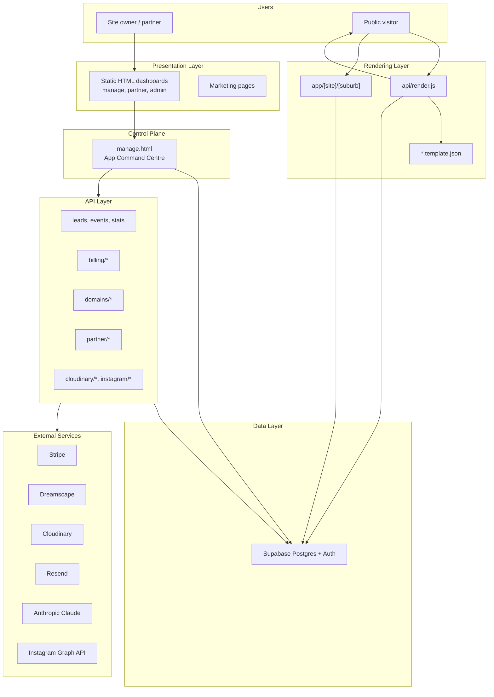

# LeadPages Documentation Index

**Document:** `INDEX`  
**Status:** Master navigation for the LeadPages engineering knowledge base  
**Audience:** Engineers, partners, operators, and **AI development agents**  
**Entity:** Bean Culture Pty Ltd trading as Web Culture

---

## AI agents: read this first

If you are an AI coding agent (Cursor, Claude Code, Copilot, Cloud Agent, or similar), **start here** before reading or changing any source code.

### Required read order

| Step | Document | Why |
|------|----------|-----|
| 1 | [README.md](../readme.md) | Product overview, stack, repo orientation |
| 2 | **This file** (`docs/INDEX.md`) | Navigation, indexes, task routing |
| 3 | [CLAUDE.md](../CLAUDE.md) | Non-negotiable rules, AI workflow |
| 4 | [AGENTS.md](../AGENTS.md) | Agent behaviour, output expectations |
| 5 | **Relevant topic docs** | See [Task routing](#which-document-to-read-by-task) below |
| 6 | **Source code** | Only after steps 1–5 |

### Agent rules (summary)

- **Never wipe `sites.config`** — merge only; preserve unknown keys.
- **Never remove editor options** — reorganise, do not delete.
- **Public endpoints fail safe** — leads and events always return 200.
- **No framework rewrite** without explicit approval.
- **No partner/billing/domain logic changes** without approval.
- **Documentation tasks** — never modify application code unless explicitly asked.

Full rules: [00-VISION](00-VISION.md), [12-CODING-STANDARDS](12-CODING-STANDARDS.md), [CLAUDE.md](../CLAUDE.md).

---

## Recommended reading order

### Everyone (first hour)

1. [00-VISION](00-VISION.md) — product intent and principles  
2. [01-ARCHITECTURE](01-ARCHITECTURE.md) — how the platform is built  
3. [02-DATABASE](02-DATABASE.md) — data model and `sites.config`  
4. [12-CODING-STANDARDS](12-CODING-STANDARDS.md) — how to change code safely  

### By role

| Role | Path after core four |
|------|---------------------|
| **Editor / frontend** | [10-EDITOR](10-EDITOR.md) → [04-SITE-BUILDER](04-SITE-BUILDER.md) → [03-TEMPLATE-SYSTEM](03-TEMPLATE-SYSTEM.md) → [11-DESIGN-SYSTEM](11-DESIGN-SYSTEM.md) |
| **Backend / API** | [03-TEMPLATE-SYSTEM](03-TEMPLATE-SYSTEM.md) → [07-TRACKING](07-TRACKING.md) → [09-CRM](09-CRM.md) → [08-SEO](08-SEO.md) |
| **Partner platform** | [05-PARTNERS](05-PARTNERS.md) → [04-SITE-BUILDER](04-SITE-BUILDER.md) → [06-DOMAINS](06-DOMAINS.md) |
| **DevOps / ops** | [01-ARCHITECTURE](01-ARCHITECTURE.md) § Deployment → [06-DOMAINS](06-DOMAINS.md) → [13-ROADMAP](13-ROADMAP.md) |
| **Product / planning** | [00-VISION](00-VISION.md) → [13-ROADMAP](13-ROADMAP.md) |

### Numbered canon (complete set)

Read in order `00` → `13` when building mental model from scratch. [10-EDITOR](10-EDITOR.md) is the largest single reference — bookmark it for editor work.

---

## Major systems

---

## Core documentation catalogue

Short summary of every engineering document in `docs/`.

| Doc | Title | Summary |
|-----|-------|---------|
| [00-VISION](00-VISION.md) | Platform Vision | **Foundational.** Why LeadPages exists, business model, partner economics, ten core principles, non-negotiables for all engineering. |
| [01-ARCHITECTURE](01-ARCHITECTURE.md) | Technical Architecture | **Definitive.** High-level architecture, request lifecycle, rendering, auth, API layer, Vercel routing, deployment, integrations, security, performance. |
| [02-DATABASE](02-DATABASE.md) | Database | **Definitive.** All ~51 tables, `sites.config` JSONB schema by template, migrations, RLS, table→API mapping, ER relationships. |
| [03-TEMPLATE-SYSTEM](03-TEMPLATE-SYSTEM.md) | Template System | Four templates, `api/render.js` pipeline, token systems (`{{}}` vs `{}`), client hydration, preview vs production, suburb SEO path. |
| [04-SITE-BUILDER](04-SITE-BUILDER.md) | Site Builder | Site creation, trade packs, `service_packs`, editing model, persistence tiers, publish vs go-live, partner flows. |
| [05-PARTNERS](05-PARTNERS.md) | Partner System | Partner tables, APIs, showcase, buy-site, commissions, client transfer, HTML surfaces. |
| [06-DOMAINS](06-DOMAINS.md) | Domain System | Dreamscape integration, purchase flow, DNS, `custom_domain` routing, `manage-domains.html`. |
| [07-TRACKING](07-TRACKING.md) | Tracking & Analytics | `trackEvent`, `events` table, `/api/stats`, dashboard `ANA` object, analytics UI in editor. |
| [features/Google Ads](features/Google%20Ads.md) | Google Ads (v1) | OAuth connect, session attribution (gclid/UTMs), conversion upload, Advertising dashboard, metrics sync. |
| [08-SEO](08-SEO.md) | SEO System | Suburb App Router pages, `lib/seo/*`, landing pages, `seoTokens`, sitemap, routing collision notes. |
| [09-CRM](09-CRM.md) | CRM & Leads | Lead capture, `api/leads.js`, CRM strips, mailer, campaigns, opt-outs, lifecycle. |
| [10-EDITOR](10-EDITOR.md) | Editor Manual | **Most important doc for editor work.** Complete `manage.html` reference: navigation, panels, flows, major functions, ~438-function index. |
| [11-DESIGN-SYSTEM](11-DESIGN-SYSTEM.md) | Design System | Typography, colour tokens (editor + tenant), components, UX rules, accessibility. |
| [12-CODING-STANDARDS](12-CODING-STANDARDS.md) | Coding Standards | JS, API, DB, config, git, security standards; agent rules; review checklist. |
| [13-ROADMAP](13-ROADMAP.md) | Roadmap | Near/medium/long-term priorities, technical debt register, explicit non-goals. |

---

## Which document to read by task

| Task type | Read first | Then | Key source files |
|-----------|------------|------|------------------|
| **Editor UI / manage.html** | [10-EDITOR](10-EDITOR.md) | [04-SITE-BUILDER](04-SITE-BUILDER.md), [11-DESIGN-SYSTEM](11-DESIGN-SYSTEM.md) | `manage.html` |
| **New site section / trade template** | [03-TEMPLATE-SYSTEM](03-TEMPLATE-SYSTEM.md) | [10-EDITOR](10-EDITOR.md), [02-DATABASE](02-DATABASE.md) | `trade.template.json`, `demo-shared.js` |
| **Tenant rendering / 404 / preview** | [03-TEMPLATE-SYSTEM](03-TEMPLATE-SYSTEM.md) | [01-ARCHITECTURE](01-ARCHITECTURE.md) §6 | `api/render.js`, `vercel.json` |
| **sites.config schema change** | [02-DATABASE](02-DATABASE.md) | [04-SITE-BUILDER](04-SITE-BUILDER.md), [12-CODING-STANDARDS](12-CODING-STANDARDS.md) | `manage.html` publish paths |
| **New API endpoint** | [01-ARCHITECTURE](01-ARCHITECTURE.md) §11 | [12-CODING-STANDARDS](12-CODING-STANDARDS.md) | `api/*.js` peers |
| **Lead forms / CRM** | [09-CRM](09-CRM.md) | [07-TRACKING](07-TRACKING.md) | `api/leads.js`, templates |
| **Analytics / events** | [07-TRACKING](07-TRACKING.md) | [10-EDITOR](10-EDITOR.md) § Analytics | `api/events.js`, `api/stats.js` |
| **Google Ads / Advertising** | [features/Google Ads](features/Google%20Ads.md) | [07-TRACKING](07-TRACKING.md), [features/Pages](features/Pages.md) | `api/google-ads/*`, `lib/google-ads/*`, `assets/lp-attribution.js` |
| **Mailer / campaigns** | [09-CRM](09-CRM.md) | [02-DATABASE](02-DATABASE.md) | `api/send-campaign.js`, `manage.html` |
| **SEO / suburb pages** | [08-SEO](08-SEO.md) | [03-TEMPLATE-SYSTEM](03-TEMPLATE-SYSTEM.md) | `lib/seo/*`, `app/[site]/[suburb]` |
| **Partner features** | [05-PARTNERS](05-PARTNERS.md) | [00-VISION](00-VISION.md) § Partners | `api/partner/*`, `partner.html` |
| **Billing / Stripe** | [01-ARCHITECTURE](01-ARCHITECTURE.md) §14 | [05-PARTNERS](05-PARTNERS.md) § Commissions | `api/billing/*` |
| **Domains / DNS** | [06-DOMAINS](06-DOMAINS.md) | [01-ARCHITECTURE](01-ARCHITECTURE.md) §12 | `dreamscape.js`, `api/domains/*` |
| **Marketplace apps** | [01-ARCHITECTURE](01-ARCHITECTURE.md) | [10-EDITOR](10-EDITOR.md) § Marketplace | `api/api-apps.js`, `api-site-apps.js` |
| **Images / Cloudinary** | [01-ARCHITECTURE](01-ARCHITECTURE.md) §14 | [10-EDITOR](10-EDITOR.md) | `api/cloudinary/*` |
| **Instagram feed** | [01-ARCHITECTURE](01-ARCHITECTURE.md) | [02-DATABASE](02-DATABASE.md) `ig_connections` | `api/instagram/*`, `lib/ig/*` |
| **Database migration** | [02-DATABASE](02-DATABASE.md) | [12-CODING-STANDARDS](12-CODING-STANDARDS.md) | `db/*.sql` |
| **UI / visual polish** | [11-DESIGN-SYSTEM](11-DESIGN-SYSTEM.md) | [10-EDITOR](10-EDITOR.md) | `manage.html` CSS |
| **Tech debt / planning** | [13-ROADMAP](13-ROADMAP.md) | [01-ARCHITECTURE](01-ARCHITECTURE.md) §22 | — |
| **Documentation only** | This file | Topic doc being updated | `docs/*.md` only |

---

## Subsystem index

| Subsystem | Primary doc | Key entry points |
|-----------|-------------|------------------|
| **Multi-tenant core** | [02-DATABASE](02-DATABASE.md) | `sites`, `sites.config` |
| **Site editor** | [10-EDITOR](10-EDITOR.md) | `manage.html` |
| **Site builder** | [04-SITE-BUILDER](04-SITE-BUILDER.md) | Create, trade packs, publish |
| **Template rendering** | [03-TEMPLATE-SYSTEM](03-TEMPLATE-SYSTEM.md) | `api/render.js`, `*.template.json` |
| **Suburb SEO** | [08-SEO](08-SEO.md) | `app/[site]/[suburb]`, `lib/seo/*` |
| **Authentication** | [01-ARCHITECTURE](01-ARCHITECTURE.md) §9 | Supabase Auth, `profiles` |
| **Partner program** | [05-PARTNERS](05-PARTNERS.md) | `api/partner/*`, showcase |
| **Billing** | [01-ARCHITECTURE](01-ARCHITECTURE.md) | `api/billing/*`, Stripe webhooks |
| **Domains** | [06-DOMAINS](06-DOMAINS.md) | Dreamscape, `api/domains/*` |
| **Lead capture & CRM** | [09-CRM](09-CRM.md) | `api/leads.js`, LPLEADS UI |
| **Analytics** | [07-TRACKING](07-TRACKING.md) | `api/events.js`, `api/stats.js` |
| **Email mailer** | [09-CRM](09-CRM.md) | `api/send-campaign.js` |
| **Marketplace** | [01-ARCHITECTURE](01-ARCHITECTURE.md) | `app_registry`, `site_apps` |
| **Media** | [01-ARCHITECTURE](01-ARCHITECTURE.md) §14 | Cloudinary, Instagram |
| **AI content** | [08-SEO](08-SEO.md), [04-SITE-BUILDER](04-SITE-BUILDER.md) | Claude APIs, trade generate |
| **Design / UX** | [11-DESIGN-SYSTEM](11-DESIGN-SYSTEM.md) | Editor tokens, tenant themes |

---

## API index

~70 Vercel serverless routes under `api/`. Files prefixed with `_` are shared modules, not routes.

### Core tenant (public)

| Route | File | Purpose |
|-------|------|---------|
| `GET /api/render` | `render.js` | Tenant HTML (via rewrite) |
| `POST /api/leads` | `leads.js` | Lead capture — always 200 |
| `POST /api/events` | `events.js` | Analytics beacon — always 200 |
| `GET /api/ig-media` | `ig-media.js` | Instagram feed proxy |
| `GET /api/site/support-contact` | `site/support-contact.js` | Partner support contact |

### Client dashboard (Bearer JWT)

| Route | File | Purpose |
|-------|------|---------|
| `GET /api/stats` | `stats.js` | Analytics + lead counts |
| `POST /api/send-campaign` | `send-campaign.js` | Email campaigns |
| `GET /api/unsubscribe` | `unsubscribe.js` | Campaign opt-out |
| `POST /api/notify-message` | `notify-message.js` | Message notifications |
| `POST /api/assist` | `assist.js` | AI assist |

### Partner

| Route | File | Auth |
|-------|------|------|
| `GET /api/partner/me` | `partner/me.js` | Bearer + active partner |
| `POST /api/partner/add-customer` | `partner/add-customer.js` | Bearer + active |
| `POST /api/partner/add-mockup` | `partner/add-mockup.js` | Bearer + active |
| `POST /api/partner/ensure-home` | `partner/ensure-home.js` | Bearer + active |
| `POST /api/partner/quote-create` | `partner/quote-create.js` | Bearer + active |
| `GET /api/partner/quote-get` | `partner/quote-get.js` | Public (token) |
| `POST /api/partner/buy-site` | `partner/buy-site.js` | Public |
| `POST /api/partner/save-showcase` | `partner/save-showcase.js` | Bearer + active |
| `GET /api/partner/showcase-check` | `partner/showcase-check.js` | Bearer |
| `POST /api/partner-apply` | `partner-apply.js` | Public |
| `GET /api/partner-directory` | `partner-directory.js` | Public |
| `GET/POST /api/partner-directory-self` | `partner-directory-self.js` | Bearer + active |
| `GET/POST /api/partner-onboarding` | `partner-onboarding.js` | Bearer |
| `POST /api/partner-lead` | `partner-lead.js` | Origin-gated |
| `POST /api/partner-welcome` | `partner-welcome.js` | Super-admin |
| `GET/POST /api/api-partner-templates` | `api-partner-templates.js` | **Auth gap** |

### Billing (Bearer + Stripe webhooks)

| Route | File | Purpose |
|-------|------|---------|
| `POST /api/billing/webhook` | `billing/webhook.js` | Stripe billing events |
| `GET /api/billing/status` | `billing/status.js` | Account status |
| `POST /api/billing/checkout` | `billing/checkout.js` | Checkout session |
| `GET /api/billing/portal` | `billing/portal.js` | Customer portal |
| `GET/POST /api/billing/plans` | `billing/plans.js` | Plan CRUD |
| `GET /api/billing/account` | `billing/account.js` | Account details |
| `GET /api/billing/owner` | `billing/owner.js` | Owner billing |
| `POST /api/billing/app-checkout` | `billing/app-checkout.js` | Marketplace app billing |
| `GET /api/billing/cron` | `billing/cron.js` | Daily cron (Vercel) |
| `billing/admin.js`, `contra.js`, `system-pages.js`, … | — | Admin billing ops |

### Domains

| Route | File | Auth |
|-------|------|------|
| `GET /api/domains/availability` | `domains/availability.js` | Public (rate-limited) |
| `POST /api/domains/checkout` | `domains/checkout.js` | Bearer |
| `POST /api/domains/webhook` | `domains/webhook.js` | Stripe HMAC |
| `GET /api/domains/list` | `domains/list.js` | Bearer |
| `GET/PATCH /api/domains/detail` | `domains/detail.js` | Bearer |
| `GET/POST/PATCH/DELETE /api/domains/dns` | `domains/dns.js` | Bearer |
| `GET/POST /api/domains/pricing` | `domains/pricing.js` | Super-admin |
| `GET /api/domains/account` | `domains/account.js` | Super-admin |
| `GET /api/domains/order` | `domains/order.js` | Bearer |

### Marketplace & catalog

| Route | File | Purpose |
|-------|------|---------|
| `GET /api/catalog` | `catalog.js` | Feature catalog |
| `GET /api/api-apps` | `api-apps.js` | App registry |
| `GET/POST /api/api-site-apps` | `api-site-apps.js` | Site app placement |
| `GET/POST /api/api-site-apps-config` | `api-site-apps-config.js` | App config |

### Media & AI

| Route | File | Purpose |
|-------|------|---------|
| `POST /api/cloudinary/sign` | `cloudinary/sign.js` | Upload signature |
| `POST /api/cloudinary/delete` | `cloudinary/delete.js` | Asset delete |
| `GET /api/instagram/connect` | `instagram/connect.js` | OAuth start |
| `GET /api/instagram/callback` | `instagram/callback.js` | OAuth callback |
| `POST /api/api-trade-generate` | `api-trade-generate.js` | AI trade pack |
| `GET /api/api-trade-stats` | `api-trade-stats.js` | Trade pack stats |

### Legacy / admin

| Route | File | Purpose |
|-------|------|---------|
| `POST /api/create-site` | `create-site.js` | Password-gated create |
| `GET /api/admin-data` | `admin-data.js` | Admin aggregates |
| `GET/POST /api/system-pages` | `system-pages.js` | Suspended page content |
| `GET /api/cron/send-due` | `cron/send-due.js` | Scheduled campaigns |

Full detail: [01-ARCHITECTURE](01-ARCHITECTURE.md) §11, [02-DATABASE](02-DATABASE.md) per-table API lists.

---

## Database table index

51 tables inferred from codebase. Full schemas: [02-DATABASE](02-DATABASE.md).

| Group | Tables |
|-------|--------|
| **Core tenant** | `sites`, `profiles`, `site_backups`, `system_pages` |
| **Leads & comms** | `leads`, `events`, `email_campaigns`, `campaign_recipients`, `email_optouts`, `conversations`, `messages`, `conversation_reads` |
| **Partners** | `partners`, `partner_profiles`, `partner_applications`, `partner_quotes`, `partner_commissions`, `partner_directory`, `partner_leads`, `partner_themes`, `partner_templates`, `partner_onboarding`, `partner_courses`, `partner_training_modules`, `partner_training_progress`, `partner_resources`, `partner_audit_logs`, `client_transfer_events` |
| **Billing** | `billing_plans`, `billing_customers`, `site_app_subscriptions`, `contra_accounts`, `contra_ledger` |
| **Marketplace** | `catalog_categories`, `catalog_features`, `catalog_blocks`, `app_registry`, `app_schemas`, `app_presets`, `site_apps`, `service_packs` |
| **Domains** | `domains`, `domain_orders`, `domain_pricing`, `domain_registrants`, `domain_customers`, `domain_events` |
| **SEO & social** | `suburb_intros`, `ig_connections` |
| **Content** | `demo_themes`, `wiki_articles` |

**Hub table:** `sites` — almost all operational data links via `site_id` or partner FKs.

**Content store:** `sites.config` JSONB — authoritative for page content ([02-DATABASE](02-DATABASE.md) § Configuration Storage).

---

## Template index

| File | `sites.template` | Size | Rendering |
|------|------------------|------|-----------|
| [trade.template.json](../trade.template.json) | `trade` | ~276 KB | `__SITE_CONFIG__` + `__applyTradeConfig` |
| [broker.template.json](../broker.template.json) | `broker-leads` | ~45 KB | `__SITE_CONFIG__` + inline JS |
| [brokerapp.template.json](../brokerapp.template.json) | `broker-app` | ~158 KB | `__BROKERAPP_CONFIG__` + `__applyAppearance` |
| [agency.template.json](../agency.template.json) | — (`is_partner_home`) | ~18 KB | `buildAgencyHtml()` server assembly |

**Reference / legacy:** `plumber.html`, `broker.html` — human-readable examples.

**Hydration reference:** [marketplace/demos/demo-shared.js](../marketplace/demos/demo-shared.js)

Detail: [03-TEMPLATE-SYSTEM](03-TEMPLATE-SYSTEM.md)

---

## HTML page index

### Control plane & admin

| URL (rewrite) | File | Purpose |
|---------------|------|---------|
| `/manage` | `manage.html` | **Primary editor** — App Command Centre |
| `/partner-dashboard` | `partner-dashboard.html` | Partner site grid |
| `/partner` | `partner.html` | Partner workspace |
| `/partner-onboarding` | `partner-onboarding.html` | Onboarding checklist |
| `/partners-admin` | `partners-admin.html` | Super-admin partners |
| `/billing` | `billing.html` | Billing UI |
| `/manage-domains.html` | `manage-domains.html` | Domain & DNS manager |
| `/marketplace-admin` | `marketplace-admin.html` | Marketplace admin |
| `/apps-admin` | `apps-admin.html` | App schema admin |
| `/messages` | `messages.html` | Partner↔client messaging |
| `/admin.html` | `admin.html` | Legacy admin |
| `api/manage.html` | — | **Duplicate** — avoid editing |

### Marketing & public

| URL | File | Purpose |
|-----|------|---------|
| `/` | `home.html` | Marketing homepage |
| `/tradies` | `tradies.html` | Tradie storefront |
| `/brokers` | `brokers.html` | Broker storefront |
| `/partners` | `partners.html` | Partner program |
| `/find-a-partner` | `find-a-partner.html` | Partner directory |
| `/domains` | `domains.html` | Domain storefront |
| `/marketplace` | `marketplace.html` | App marketplace |
| `/showcase` | `showcase.html` | Showcase demo |
| `/quote` | `quote.html` | Client quote checkout |
| `/help` | `help.html` | Help |
| `/resources` | `resources.html` | Resource hub |
| `/start-your-business` | `start-your-business.html` | Lead capture |
| Legal | `privacy-policy.html`, `terms-of-use.html`, `instagram-data-policy.html` | Policies |

### Legacy / reference

| File | Notes |
|------|-------|
| `builder.html` | Legacy builder — prefer `manage.html` |
| `plumber.html`, `broker.html` | Template references |

### Next.js App Router

| Route | File | Purpose |
|-------|------|---------|
| `/{site}/{suburb}` | `app/[site]/[suburb]/route.js` | Suburb SEO pages |
| `/seo-sitemap.xml` | `app/seo-sitemap.xml/route.js` | Dynamic XML sitemap |

Rewrites: [vercel.json](../vercel.json) — detail in [01-ARCHITECTURE](01-ARCHITECTURE.md) §12.

---

## Integration index

| Service | Purpose | Code | Doc |
|---------|---------|------|-----|
| **Supabase** | Postgres + Auth | All `api/*`, `manage.html` | [02-DATABASE](02-DATABASE.md), [01-ARCHITECTURE](01-ARCHITECTURE.md) §10 |
| **Vercel** | Hosting, serverless, rewrites | `vercel.json`, `api/*`, `app/*` | [01-ARCHITECTURE](01-ARCHITECTURE.md) §12–13 |
| **Stripe** | Billing, domain checkout, buy-site | `api/billing/*`, `api/domains/checkout.js`, `api/partner/buy-site.js` | [05-PARTNERS](05-PARTNERS.md), [06-DOMAINS](06-DOMAINS.md) |
| **Dreamscape** | Domain registrar API | `dreamscape.js`, `api/domains/*` | [06-DOMAINS](06-DOMAINS.md) |
| **Cloudinary** | Image CDN + uploads | `api/cloudinary/*`, URLs in config | [10-EDITOR](10-EDITOR.md), [01-ARCHITECTURE](01-ARCHITECTURE.md) |
| **Resend** | Transactional email | `api/leads.js`, `api/send-campaign.js` | [09-CRM](09-CRM.md) |
| **Anthropic Claude** | AI copy, suburb intros, trade packs | `lib/seo/suburbIntro.js`, `api/api-trade-generate.js`, `manage.html` | [08-SEO](08-SEO.md), [04-SITE-BUILDER](04-SITE-BUILDER.md) |
| **Instagram Graph API** | Social / project feeds | `api/instagram/*`, `lib/ig/*` | [01-ARCHITECTURE](01-ARCHITECTURE.md) §14 |

---

## Deployment index

| Topic | Detail | Doc |
|-------|--------|-----|
| **Deploy path** | Git push → GitHub → Vercel auto-deploy | [01-ARCHITECTURE](01-ARCHITECTURE.md) §13 |
| **What bundles together** | All `api/*.js` + `*.template.json` in serverless cold start | [03-TEMPLATE-SYSTEM](03-TEMPLATE-SYSTEM.md) |
| **Routing** | `vercel.json` rewrites — static HTML + tenant render | [01-ARCHITECTURE](01-ARCHITECTURE.md) §12 |
| **Cron** | `/api/billing/cron` daily 03:00 UTC | `vercel.json` |
| **Env vars** | Vercel project settings — never commit secrets | [01-ARCHITECTURE](01-ARCHITECTURE.md) §12.4 |
| **Primary hosts** | `PRIMARY_HOSTS` — marketing vs tenant routing | [06-DOMAINS](06-DOMAINS.md) |
| **Custom domains** | Vercel Domains + DNS + `sites.custom_domain` | [06-DOMAINS](06-DOMAINS.md) |
| **Migrations** | `db/*.sql` versioned; most tables console-applied | [02-DATABASE](02-DATABASE.md) |
| **Planned** | `.env.example`, full migration history | [13-ROADMAP](13-ROADMAP.md) |

### Key environment variables (categories)

`SUPABASE_*` · `STRIPE_*` · `DREAMSCAPE_*` · `CLOUDINARY_*` · `RESEND_*` · `ANTHROPIC_*` · `INSTAGRAM_*` · `PRIMARY_HOSTS` · `SUPER_ADMIN_EMAILS` · `CRON_SECRET`

---

## Glossary

| Term | Meaning |
|------|---------|
| **Command Centre** | `manage.html` editor |
| **Trade pack** | Starter `config` for a trade type (`TRADE_PACKS` / `service_packs`) |
| **Hydration** | Client JS (`__applyTradeConfig`) filling template from config |
| **Publish** | `publishToDB()` — write `sites.config` to Supabase |
| **Go live** | `sites.status = 'live'` — publicly visible without `?preview=` |
| **Mockup** | `is_mockup` demo site for partner sale |
| **Showcase** | Partner portfolio (`{slug}.leadpages.com.au`) |
| **Service role** | Supabase server key — bypasses RLS |
| **Token template** | `trade` / `broker-leads` — `__SITE_CONFIG__` injection |

---

## Document maintenance

| Rule | Detail |
|------|--------|
| Behaviour change → update topic doc | Not just INDEX |
| Cross-link related docs | Relative `docs/` links |
| Technical debt | [13-ROADMAP](13-ROADMAP.md) |
| Agent onboarding | This file + [AGENTS.md](../AGENTS.md) |

---

## External references

| Resource | Location |
|----------|----------|
| Repository | `github.com/coffeeguy77/leadpages` |
| Production | `leadpages.com.au`, `leadpages.webculture.au` |
| Agent instructions | [AGENTS.md](../AGENTS.md), [CLAUDE.md](../CLAUDE.md) |

---

*This index is the entry point to the LeadPages engineering canon. AI agents: complete the [required read order](#required-read-order) before editing source code.*
