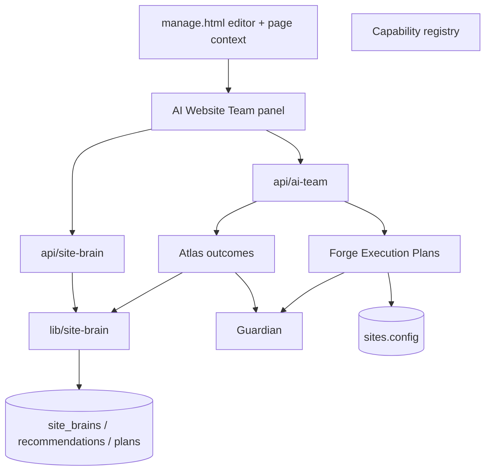

# Architecture — Site Brain + AI Website Team

## Layers

| Layer | Responsibility |
|-------|----------------|
| Editor panel | Atlas outcomes, Site Knowledge, batch Execution Plans, Change Preview |
| HTTP APIs | Auth, site access, permissions, `persisted` / `published: false` |
| Site Brain | Approved business truth + specialist memory + plan/task audit |
| AI Team | Specialists, context, Atlas, **Forge (sole config writer)**, Guardian |
| Capability registry | Real Marketplace allowlist for Forge targets |

## Mutation boundary

| Who | May write |
|-----|-----------|
| Atlas / Scout / Pulse / Nova / Lens / Echo | Recommendations + Site Knowledge proposals only |
| Forge | `sites.config` via Execution Plan Apply only |
| Guardian | Validation only — no mutations |
| User | Publish Live Site |

## Site Knowledge vs copy

- **Site Knowledge** = approved business facts (goal, CTA intent, services, tone, restrictions)
- **Echo** = generated website copy (not permanent Site Knowledge)
- **Forge** = configuration implementation

## Editor context

Passed into Atlas and Forge: `siteId`, `pageId` / `pageSlug` / `pageTitle` / `pagePurpose`, `editorTab`, `selectedSection`, `selectedApp`, `userRole`.
