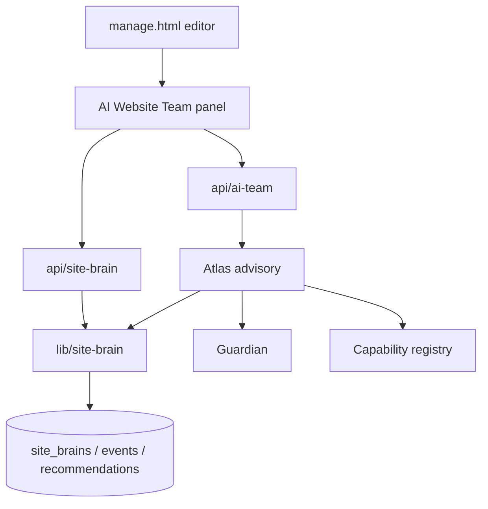

# Architecture — Site Brain + AI Website Team

## Layers

| Layer | Responsibility |
|-------|----------------|
| Editor panel | Atlas-first UI, bootstrap review, Ask the Team, recommendation status |
| HTTP APIs | Auth, site access, permissions, `persisted` flags |
| Site Brain service | Schema, sync, review, recommendations, audit events |
| Storage adapters | `database` (default deployed) or `memory` (tests/local only) |
| AI Team | Specialists, context selectors, Atlas, Guardian, capability registry |

## Storage policy

- `SITE_BRAIN_STORAGE=database` — default for preview/staging/production  
- `SITE_BRAIN_STORAGE=memory` — local/tests only; **ignored in deployed envs**  
- Missing tables → `site_brain_storage_unavailable`, `persisted: false`

## Mutation boundary (Phase 1)

AI Team may update **Site Brain** and recommendation **status**. It must not write `sites.config`, install apps, or publish.
