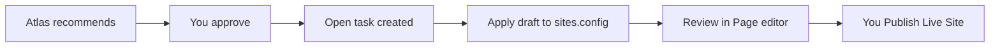

# Execution (Phase 2+)

## Workflow

## Phase 2 Forge (shipped slice)

| Step | What happens |
|------|----------------|
| Approve | Recommendation status → `approved`; **open task** created |
| Apply draft | `POST /api/ai-team/forge-apply` merges into `sites.config` |
| Open editor | `lpOpenEditorSection(tab, section)` jumps to Hero / FAQ |
| Publish | Normal **Publish Live Site** — AI Team never publishes |

Supported operations:

- `hero_cta` — writes `sections.hero.cta` from Site Knowledge `preferredCta`
- `enable_section` — turns on `sections.faq` (+ `sectionOrder`)

Site Knowledge gaps use **Answer with Atlas** (Site Brain only).

## Rules

1. Target allowlisted capabilities only (`lib/ai-team/capability-registry.js`)
2. Merge `sites.config` — never wipe unknown keys
3. Pass Guardian checks
4. Require user approval before Forge runs
5. Never auto-publish

## APIs

- `POST /api/ai-team/recommendations` — `approve` creates task + `nextStep`
- `POST /api/ai-team/forge-apply` — `{ siteId, taskId }`
