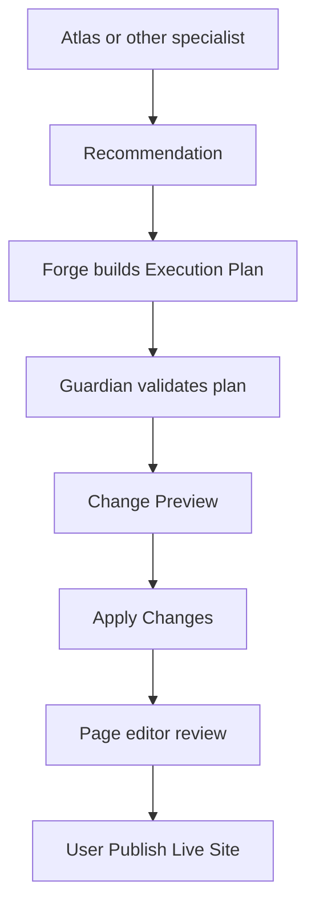

# Execution (Phase 2)

## Canonical pipeline

AI never publishes automatically.

## Objects

| Object | Owner | Purpose |
|--------|-------|---------|
| Recommendation | Atlas (or Scout/Pulse/…) | Business outcome only |
| Execution Plan | **Forge only** | Steps, config paths, risk, rollback |
| Change Preview | Forge | Before/after confidence checkpoint |
| Configuration | Forge | Sole writer of `sites.config` |
| Site Knowledge | User + Atlas interview | Approved business truth (not copy) |

## Execution Plan fields

- Recommendation ID(s) — supports **batching**
- Generated By (`forge`)
- Site
- Affected Pages
- Steps (title, operation, before/after, config paths)
- Risk
- Validation Requirements
- Rollback Strategy (`config_snapshot`)
- Dependencies
- Guardian result

## Batching

Select multiple recommendations → **one** Execution Plan → **one** diff → **one** Apply → **one** rollback point.

## APIs

| Endpoint | Actions |
|----------|---------|
| `POST /api/ai-team/execution-plan` | `create`, `list`, `preview`, `apply`, `cancel`, `rollback` |
| `POST /api/ai-team/forge-apply` | Apply by `planId` or legacy `taskId` |
| `POST /api/ai-team/recommendations` | Approve/reject (approve still creates a plan via Forge) |

## Rules

1. Atlas never emits config paths, section ids, or renderer details — only outcomes
2. Only Forge mutates sections, apps, forms, layouts, CTAs, SEO metadata, images, navigation, page structure
3. Guardian must validate the Execution Plan before Apply
4. Change Preview is required UX before Apply
5. Never auto-publish
