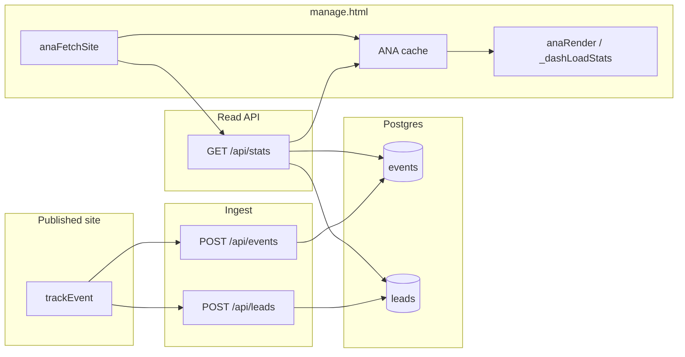
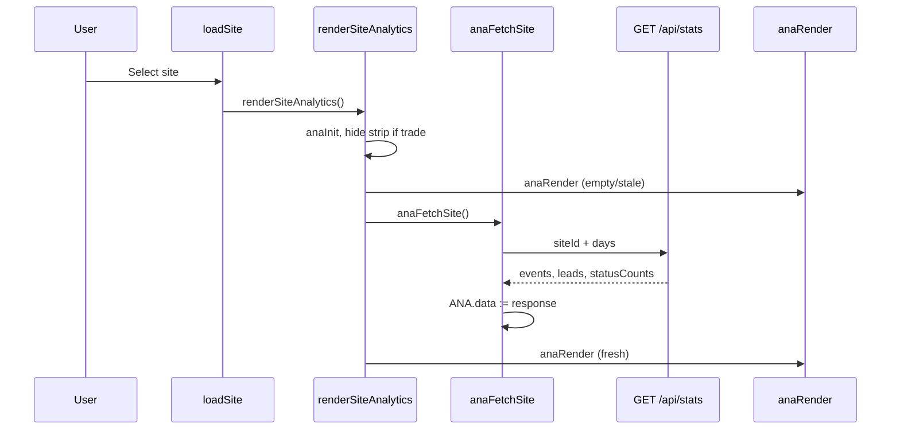
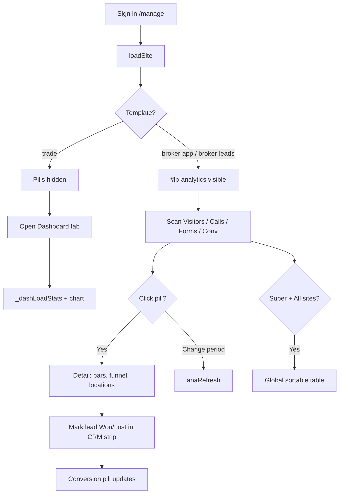
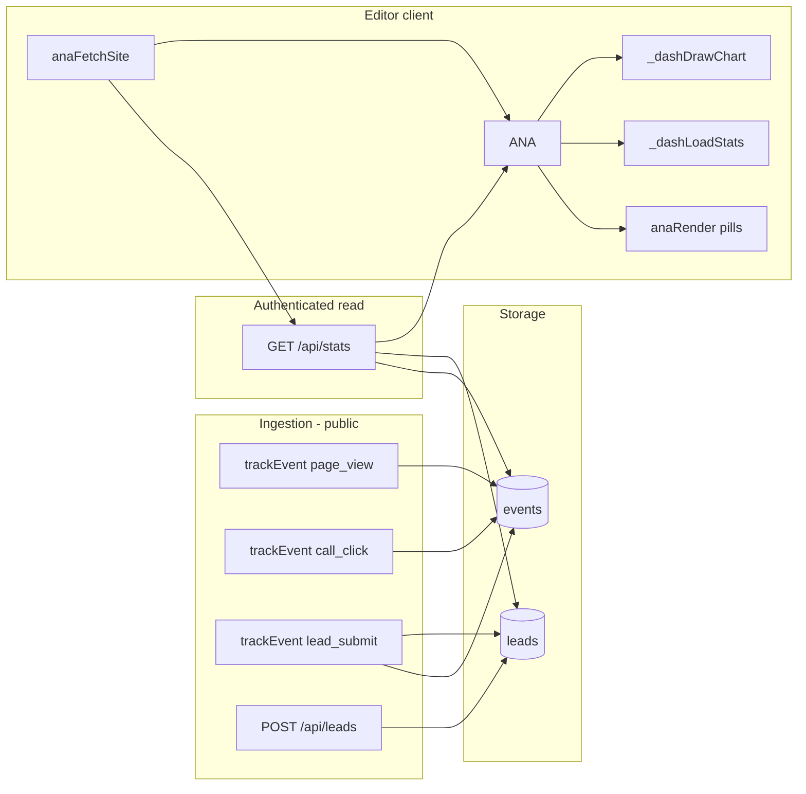
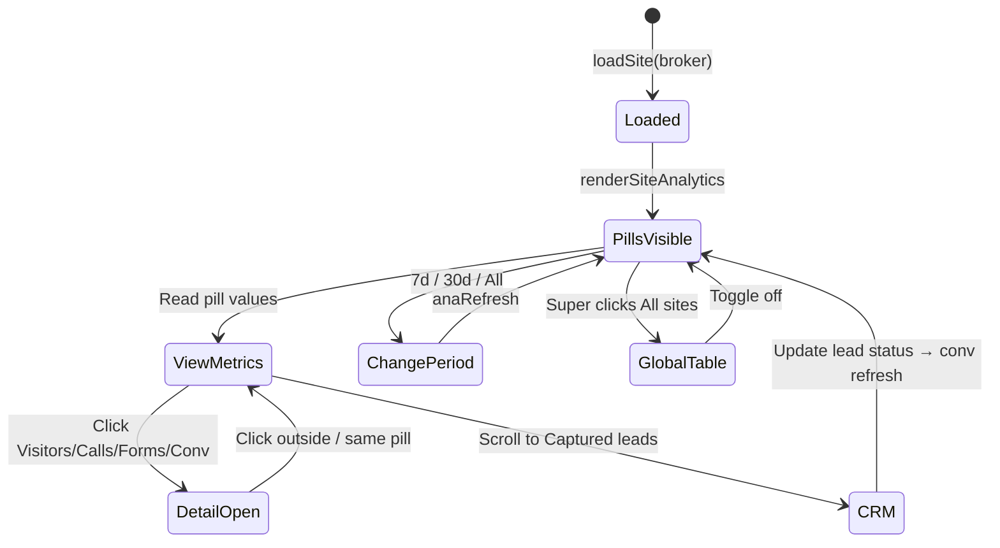

# LeadPages Analytics — Complete Engineering Manual

**Document:** `features/Analytics`  
**Status:** Definitive engineering reference for editor analytics (`ANA`, `#lp-analytics`, `/api/stats`)  
**Audience:** Engineers rebuilding, extending, or debugging analytics UI and the stats API; AI development agents  
**Prerequisites:** [00-VISION](../00-VISION.md), [01-ARCHITECTURE](../01-ARCHITECTURE.md), [07-TRACKING](../07-TRACKING.md), [09-CRM](../09-CRM.md), [10-EDITOR](../10-EDITOR.md), [features/Dashboard](Dashboard.md)

> **Scope note:** This document describes the **editor-side analytics subsystem** in `manage.html`: the in-memory `ANA` object, the `#lp-analytics` pill strip, fetch/render functions, and the authenticated **`GET /api/stats`** endpoint. It covers how **trade-template Dashboard stat cards** consume the same cache. It is **not** public visitor tracking (`trackEvent`, `api/events.js`) — see [07-TRACKING](../07-TRACKING.md) — nor `partner-dashboard.html` aggregate views.

---

## Executive Summary

LeadPages analytics in the editor answer one question for site owners and partners: **“Is the site working?”** Visitor page views, call clicks, form submissions, and CRM win rate are aggregated from the **`events`** and **`leads`** tables, fetched through **`GET /api/stats`**, cached in the global **`ANA`** object, and painted into **`#lp-analytics`** (broker templates) or **`renderDashboard`** stat cards and charts (trade template).

Implementation is **100% client-side rendering** in `manage.html` plus one serverless read API. There is no React analytics package, no separate analytics microservice, and no data warehouse — only Postgres queries capped at 10k–20k rows.

| Fact | Detail |
|------|--------|
| **DOM (broker)** | `#lp-analytics` — pill strip above `.adminnav` |
| **DOM (trade)** | `#lp-analytics` hidden; stats on `#av-dashboard` via `renderDashboard` |
| **State** | Global `ANA` object (~line 3259 in `manage.html`) |
| **Fetch** | `anaFetchSite()` → `anaStats()` → `GET /api/stats?siteId=&days=` |
| **API** | `api/stats.js` — Bearer JWT auth, service-role reads |
| **Period** | 7d / 30d / All — stored in `ANA.period` (days: 7, 30, 0) |
| **Entry** | `loadSite()` → `renderSiteAnalytics()` on every site switch |

---

## Purpose

### Product purpose

Site owners need proof that their hosted page drives real business outcomes:

1. **Traffic** — Are people visiting?
2. **Intent** — Are they clicking to call?
3. **Capture** — Are they submitting the quote form?
4. **Conversion** — Of decided leads, how many become jobs (won vs lost)?

The analytics strip surfaces these metrics without exporting to Google Analytics. Partners managing broker-calculator sites see pills above the nav; tradies on the **trade** template see the same numbers repackaged on the **Dashboard** tab.

### Engineering purpose

- **Single cache (`ANA`)** — One fetch per site load; CRM strip, activity timeline, Dashboard chart, and pill UI all read the same data.
- **Authenticated read path** — Public beacons write via `POST /api/events`; reads require Supabase JWT so tenant data stays private.
- **Graceful degradation** — If `/api/stats` fails, `anaFetchSite()` falls back to direct Supabase selects (when RLS permits).
- **Template-aware chrome** — Broker sites show `#lp-analytics`; trade sites hide the strip but still populate `ANA` for Dashboard widgets.

---

## Business Purpose

| Stakeholder | Value |
|-------------|-------|
| **Site owner** | Visible ROI; confidence the site is live and capturing enquiries |
| **Partner / broker** | Self-serve client metrics; fewer support tickets about visitor counts |
| **Super-admin** | Per-site pills plus **All sites** global table for portfolio overview |
| **LeadPages (platform)** | Retention — activity visibility drives continued hosting |

Analytics support the core business model: **hosted sites that capture leads**. Win-rate conversion on broker sites ties directly into CRM status workflow ([09-CRM](../09-CRM.md)).

---

## User Types

| User | Analytics UI | Global “All sites” pill |
|------|--------------|-------------------------|
| **Super-admin** | Pills or Dashboard stats on any site they can edit | **Yes** — green `gbtn` pill |
| **Broker / partner** | Pills on `broker-app` / `broker-leads` sites | **No** |
| **Site owner** (customer login) | Same as broker if they have editor access | **No** |
| **Leads-only demo** (`leads` role) | **No** — calculator tab only; no site analytics | **No** |
| **Trade template** | **Dashboard tab** stat row + chart (pills hidden) | Super only if they switch to a broker site |

---

## Permissions

| Layer | Mechanism |
|-------|-----------|
| **Editor access** | Supabase auth + `gate()` — must be signed in |
| **`/api/stats`** | `Authorization: Bearer <access_token>`; 401 if missing/invalid |
| **Service role reads** | API uses `SUPABASE_SERVICE_ROLE_KEY` after JWT validation — does not depend on RLS on `events` |
| **Global mode** | Client omits `siteId`; API returns cross-tenant events — UI exposes button only when `currentRole === 'super'` |
| **Billing lock** | `lpBillingGate()` inside `renderSiteAnalytics()` — locked accounts see `#bill-lock` overlay before analytics paint |

The stats API validates that **some** authenticated user exists; it does **not** currently re-check that the JWT holder may read the requested `siteId`. Authorization relies on editor site-picker scoping and future RLS hardening ([13-ROADMAP](../13-ROADMAP.md)).

---

## Analytics Layout

### Chrome position

`anaInit()` injects `#lp-analytics` **immediately above** `.adminnav` if the element does not exist. `lpExtrasInit()` wraps it with:

```text
┌─────────────────────────────────────────────────────────────┐
│  #lp-domains          My domains bar (renderMyDomains)      │
├─────────────────────────────────────────────────────────────┤
│  #lp-analytics        Visitors | Calls | Forms | Conv | 7d  │
│                       [optional detail panel below pills]   │
├─────────────────────────────────────────────────────────────┤
│  #lp-leads            Captured leads CRM strip              │
├─────────────────────────────────────────────────────────────┤
│  .adminnav            Tab navigation                        │
└─────────────────────────────────────────────────────────────┘
```

For **trade** sites: `#lp-analytics` and `#lp-leads` are `display:none`; domains bar remains visible.

### Pill strip structure (`anaRender`)

Built inline in `anaRender()`:

```text
┌──────────────────────────────────────────────────────────────────┐
│  [Visitors] [Calls] [Forms] [Conversion] [▦ All sites]  7d|30d|All │
└──────────────────────────────────────────────────────────────────┘
┌─ ana-detail (when a pill is active) ─────────────────────────────┐
│  Per-metric charts, funnels, call-location chips, lead list     │
└──────────────────────────────────────────────────────────────────┘
```

CSS classes (lines ~304–328 in `manage.html`): `.ana-row`, `.ana-pill`, `.ana-pill.on`, `.ana-pill.gbtn`, `.ana-period`, `.ana-detail`, `.ana-table`.

### Trade Dashboard consumption

When `#lp-analytics` is hidden, the same `ANA` cache powers:

| Widget | Function | Element IDs |
|--------|----------|-------------|
| Stat cards | `_dashLoadStats` | `#dash-s-vis`, `#dash-s-calls`, `#dash-s-forms`, `#dash-s-conv`, … |
| Activity chart | `_dashDrawChart` | `#dash-chart` |

See [features/Dashboard](Dashboard.md) for full Dashboard layout. Analytics doc owns **data semantics**; Dashboard doc owns **panel composition**.

---

## Metrics

### `ANA_METRICS` pill definitions

| Key | Label | Source event / formula | Detail panel |
|-----|-------|------------------------|--------------|
| `page_view` | Visitors | Count `page_view` in `ANA.data` | Daily bar chart (`anaBars` + `anaDaily`) |
| `call_click` | Calls | Count `call_click` | Daily bars + **location breakdown** from `props.location` |
| `lead_submit` | Forms | `max(lead_submit count, ANA.leadsCount)` | Daily bars + last 6 lead names from `ANA.leads` |
| `conv` | Conversion | `won ÷ (won + lost) × 100` from `ANA.statusCounts` | Win/loss funnel + visitor funnel |

Location label map for call clicks:

| `props.location` | Display label |
|------------------|---------------|
| `heroCall` | Hero button |
| `headCall` | Header button |
| `navPhone` | Phone number |
| `formCall` | Form link |
| `emergCall` | Emergency bar |
| `footPhone` | Footer |
| *(other)* | Raw key |

### `anaCounts(rows)`

Aggregates event rows into `{ page_view, call_click, lead_submit }`. Unknown events are ignored. Used by `anaRender`, `_dashLoadStats`, and conversion detail HTML.

### Forms count dual source

Form submissions are tracked twice in production:

1. **`lead_submit` event** — beacon from public template on form submit
2. **`leads` table row** — `POST /api/leads`

UI uses **`Math.max(lead_submit events, leadsCount)`** so owners see forms even if the beacon misfires or the event is dropped. `leadsCount` comes from `/api/stats` (`statusCounts.total` for the period).

### Conversion definitions (important)

| Surface | Formula | Meaning |
|---------|---------|---------|
| **Analytics pill `conv`** | `won / (won + lost)` | CRM **win rate** on decided leads |
| **Trade Dashboard `#dash-s-conv`** | `leadsN / page_view × 100` | **Visitor-to-lead** rate (different metric) |

Power users comparing broker pill “Conversion” to trade Dashboard “Conversion” are looking at **different formulas** by design today.

---

## Period Selection

| Button | `ANA.period` value | API `days` param | `anaSince()` cutoff |
|--------|-------------------|------------------|---------------------|
| **7d** | `7` | `7` | Now − 7 days |
| **30d** | `30` | `30` | Now − 30 days |
| **All** | `0` | `0` | `1970-01-01T00:00:00Z` |

Clicking a period button calls `anaRefresh()`:

1. `anaRender()` — immediate UI update (may show stale counts briefly)
2. `await anaFetchSite()` — refetch with new window
3. If global view active, `await anaFetchGlobal()`
4. `anaRender()` — paint fresh numbers

**Trade Dashboard chart** maintains a **separate** period via `window._dashChartPeriod` and `.dash-period` buttons (7d / 30d / All → 7 / 30 / 90 day buckets). Changing analytics period does **not** automatically sync Dashboard chart period.

---

## Interactions

| Action | Handler | Effect |
|--------|---------|--------|
| Click metric pill | `anaClick` → `data-act="m"` | Toggle detail panel; set `ANA.active` to metric key or `null` |
| Click **All sites** (super) | `data-act="g"` | Toggle `ANA.active === 'global'`; lazy-load `anaFetchGlobal()` |
| Click period | `data-act="p"` | Set `ANA.period`; `anaRefresh()` |
| Click outside detail | document listener | Clear `ANA.active`; collapse detail |
| Sort global table column | `data-act="s"` | Set `ANA.sort`; re-render table |
| CRM status change | `lpLeadsClick` | Updates lead in DB; mutates `ANA.statusCounts`; calls `anaRender()` |
| Activity timeline toggle | `#lp-leads` **Activity** | `lpTimelineHTML()` reads `ANA.data` (last 30 events) |

---

## Global Analytics (Super-admin)

When `ANA.active === 'global'`:

1. `anaFetchGlobal()` calls `GET /api/stats?days={n}` **without** `siteId`
2. Response: `{ events: [{ event, site_id, created_at }] }` — up to 20k rows
3. `anaGlobalRows()` joins against `allSites` to produce per-site visitors, calls, forms, conv %, last active
4. `anaGlobalHTML()` renders sortable `.ana-table`

Sort keys: `name`, `visitors`, `calls`, `forms`, `conv`, `last` (stored in `ANA.sort`, default `visitors`).

Global conv column uses **`forms / visitors × 100`**, not CRM win rate.

---

## `ANA` State Object

```javascript
var ANA = {
  period: 30,           // days window: 7 | 30 | 0 (all time)
  active: null,         // null | 'page_view' | 'call_click' | 'lead_submit' | 'conv' | 'global'
  sort: 'visitors',     // global table sort key
  data: [],             // events[] for current site
  leads: [],            // recent lead rows (max 50 from API)
  leadsCount: 0,        // total leads in period
  statusCounts: null,   // { new, contacted, won, lost, total }
  globalData: null      // events[] with site_id for super overview
};
```

| Field | Populated by | Consumed by |
|-------|--------------|-------------|
| `data` | `anaFetchSite` | `anaRender`, `anaDetailHTML`, `_dashLoadStats`, `_dashDrawChart`, `lpTimelineHTML` |
| `leads` | `anaFetchSite` | Forms detail panel, CRM context |
| `leadsCount` | `anaFetchSite` | Forms pill value (max with events) |
| `statusCounts` | `anaFetchSite` | Conversion pill; updated optimistically on CRM status change |
| `globalData` | `anaFetchGlobal` | Global table only |
| `period` | Period buttons | All fetches via `days` query param |
| `active` | Pill clicks | Detail panel visibility |

---

## API: `api/stats.js`

### Route

`GET /api/stats?siteId={uuid}&days={n}`

Duplicate deploy path: root `stats.js` mirrors `api/stats.js`.

### Authentication

```javascript
Authorization: Bearer <supabase_access_token>
```

`requireUser()` validates JWT via Supabase `auth.getUser()`. Missing or invalid token → **401** `{ error: 'auth' }`.

### Query parameters

| Param | Required | Values | Effect |
|-------|----------|--------|--------|
| `siteId` | Per-site mode | UUID | Filter events/leads to one site |
| `siteId` | Omitted | — | **Global mode** — all sites’ events |
| `days` | Optional | Integer; `0` or empty → all time | `sinceIso()` cutoff |

### Per-site response (200)

```json
{
  "events": [
    { "event": "page_view", "created_at": "...", "props": { "page": "/", "location": "..." } }
  ],
  "leads": [
    { "name": "...", "kind": "...", "created_at": "...", "status": "new" }
  ],
  "leadsCount": 42,
  "statusCounts": {
    "new": 10,
    "contacted": 5,
    "won": 3,
    "lost": 2,
    "total": 42
  }
}
```

Queries (service role):

| Query | Table | Limit |
|-------|-------|-------|
| Events | `events` — `event, created_at, props` | 10,000 |
| Recent leads | `leads` — `name, kind, created_at, status` | 50 |
| Status rollup | `leads` — `status` only | unbounded in period |

`leadsCount` equals `statusCounts.total` (all leads in window, not just the 50-row sample).

### Global response (200)

```json
{
  "events": [
    { "event": "page_view", "site_id": "...", "created_at": "..." }
  ]
}
```

Limit: 20,000 event rows.

### Errors

| Code | Condition |
|------|-----------|
| 405 | Non-GET |
| 401 | No valid Bearer token |
| 500 | Uncaught server error |

---

## Client Fetch Layer

### `anaStats(params)`

```javascript
async function anaStats(params) {
  var token = await cwToken();
  var qs = Object.keys(params)
    .filter(k => params[k] != null)
    .map(k => k + '=' + encodeURIComponent(params[k]))
    .join('&');
  var r = await fetch('/api/stats' + (qs ? '?' + qs : ''), {
    headers: token ? { Authorization: 'Bearer ' + token } : {}
  });
  if (!r.ok) return null;
  return await r.json();
}
```

`cwToken()` reads Supabase session `access_token` from `sb.auth.getSession()`.

### `anaFetchSite()`

1. If no `currentSiteId` — clear `ANA.data`, `ANA.leads`, `ANA.leadsCount`; return
2. Call `anaStats({ siteId: currentSiteId, days: ANA.period || 0 })`
3. On success — populate `ANA.data`, `ANA.leads`, `ANA.leadsCount`, `ANA.statusCounts`; return
4. **Fallback** (API null/error) — direct Supabase queries mirroring API shape:
   - `events` select with `site_id`, `created_at >= anaSince()`, limit 10k
   - `leads` select + count + status rollup

Fallback only works when RLS allows the signed-in user to read those rows.

### `anaFetchGlobal()`

Same pattern: API first (`days` only), then fallback `events` select without `site_id` filter (limit 20k).

### `renderSiteAnalytics()` — init sequence

Called from `loadSite()` for every template (sync path or after `_reconcileSiteApps` for trade):

1. `anaInit()` — ensure `#lp-analytics` exists; wire click handlers
2. If `currentSiteTemplate === 'trade'` — hide `#lp-analytics`
3. `lpBillingGate()` — may block UI
4. Reset `ANA.active`, `ANA.globalData`
5. `anaRender()` — paint (possibly empty)
6. `lpExtrasInit()` — inject `#lp-domains`, `#lp-leads`; hide leads strip for trade
7. `renderMyDomains()`, `renderLeadsCRM()`
8. `await anaFetchSite()`
9. `anaRender()` — paint with data
10. If `LPLEADS.timeline` — refresh timeline view

---

## Trade Dashboard: `renderDashboard` Stats

Trade sites do not show `#lp-analytics`, but **`renderSiteAnalytics()` still runs** so `ANA` is warm before the user opens the Dashboard tab.

### Stat card loader: `_dashLoadStats(period)`

| Card | ID | Calculation | Notes |
|------|-----|-------------|-------|
| Visitors | `#dash-s-vis` | `anaCounts(ANA.data).page_view` | Correct |
| Leads | `#dash-s-leads` | `max(lead_submit, ANA.leadsCount)` | Overwritten by `_dashLoadLeads` to `rows.length` (max 20) |
| Calls | `#dash-s-calls` | `c.phone_click` | **Bug** — should be `call_click`; always 0 today |
| Forms | `#dash-s-forms` | `c.lead_submit` | Event count only (not max with leadsCount) |
| Conversion | `#dash-s-conv` | `leadsN / page_view × 100` | Benchmark badge; not CRM win rate |

Polls every 500ms up to 10 times until `ANA.data` is non-empty, then triggers `_dashDrawChart`.

### Chart: `_dashDrawChart(period)`

Buckets `ANA.data` by day for `page_view`, `lead_submit`, `call_click` (and legacy `phone_click`). Period mapping: 7d → 7 days, 30d → 30 days, All → **90 days** (not unbounded). Chart type persisted in `localStorage` (`lp_chart_type`, `lp_chart_period`, `lp_chart_perday`).

**Correct:** chart counts `call_click`. **Incorrect:** Calls stat card uses `phone_click`.

---

## Data Sources



| Source | Endpoint / table | Fields used |
|--------|------------------|-------------|
| Primary | `GET /api/stats` | `events[]`, `leads[]`, `leadsCount`, `statusCounts` |
| Fallback | Supabase `events`, `leads` | Same shape when API unavailable |
| Global | `GET /api/stats?days=` | `events[]` with `site_id` |

Public write path documented in [07-TRACKING](../07-TRACKING.md).

---

## Database Tables

| Table | Analytics usage |
|-------|-----------------|
| **`events`** | `site_id`, `event`, `props` (JSONB), `created_at`; legacy `site` text column |
| **`leads`** | Form captures; `status` drives `statusCounts` and conversion pill |

Analytics are **never** stored in `sites.config`. All metrics are computed at read time from raw rows.

### Allowed ingest events (relevant to analytics)

| Event | Counted as |
|-------|------------|
| `page_view` | Visitors |
| `call_click` | Calls |
| `lead_submit` | Forms (event side) |
| `quote_open`, `cta_click` | Allowed ingest but not shown in ANA pills |

Legacy name `phone_click` appears in Dashboard chart bucket code only — **not** emitted by current templates.

---

## Related Files

| File | Role |
|------|------|
| **`manage.html`** | `ANA`, `#lp-analytics`, all `ana*` functions, `_dashLoadStats`, `_dashDrawChart` |
| **`api/stats.js`** | Authenticated stats API (source of truth) |
| **`stats.js`** | Root duplicate of `api/stats.js` |
| **`api/events.js`** | Public beacon → `events` INSERT |
| **`trade.template.json`**, **`broker.template.json`** | Embed `trackEvent` on public pages |
| **`docs/07-TRACKING.md`** | End-to-end tracking canon (ingest + summary) |
| **`docs/features/Dashboard.md`** | Trade Dashboard panel that consumes `ANA` |
| **`docs/09-CRM.md`** | `LPLEADS`, status workflow affecting `statusCounts` |
| **`api/manage.html`** | Legacy editor copy — treat `manage.html` as source of truth |

---

## Functions Reference

### Core analytics

| Function | Approx. lines | Role |
|----------|---------------|------|
| `ANA` (object) | ~3259 | In-memory cache |
| `anaSince()` | ~3262 | ISO cutoff from `ANA.period` |
| `anaCounts(rows)` | ~3264 | Event tallies |
| `anaDaily(rows, type, days)` | ~3265 | Per-day buckets for bar charts |
| `anaBars(series, color)` | ~3266 | Inline HTML bar chart |
| `anaFunnel(label, n, pct)` | ~3267 | Funnel card HTML |
| `anaStats(params)` | ~3268 | Fetch `/api/stats` with Bearer |
| `anaFetchSite()` | ~3277 | Load current site into `ANA` |
| `anaFetchGlobal()` | ~3287 | Load super-admin global events |
| `anaGlobalRows()` | ~3288 | Aggregate global events by site |
| `anaDetailHTML(k)` | ~3293 | Metric detail panel content |
| `anaGlobalHTML()` | ~3301 | All-sites table HTML |
| `anaRender()` | ~3547 | Paint `#lp-analytics` |
| `anaClick(e)` | ~3556 | Pill / period / sort handlers |
| `anaRefresh()` | ~3562 | Period change refetch |
| `anaInit()` | ~3563 | Create DOM node above nav |
| `renderSiteAnalytics()` | ~3564 | Site-switch entry point |

### Shared consumers

| Function | Role for analytics |
|----------|-------------------|
| `lpTimelineHTML()` | Activity feed from `ANA.data` |
| `lpLeadsClick()` | Status updates → `ANA.statusCounts` → `anaRender()` |
| `renderDashboard()` | Trade Dashboard shell |
| `_dashLoadStats()` | Stat cards from `ANA` |
| `_dashDrawChart()` | SVG time series from `ANA.data` |
| `loadSite()` | Triggers `renderSiteAnalytics()` |

---

## Event Flow

### Site load → analytics ready



### Period change

1. User clicks **7d** / **30d** / **All**
2. `ANA.period` updated
3. `anaRefresh()` → refetch → re-render
4. Trade Dashboard stat cards **not** auto-refreshed unless user revisits Dashboard or chart period buttons fire `_dashLoadStats`

### End-to-end (visitor → pill)

```
Visitor → trackEvent('page_view') → POST /api/events → events INSERT
Owner opens manage → anaFetchSite() → GET /api/stats → Visitors pill++
```

See [07-TRACKING](../07-TRACKING.md) for call and form flows.

---

## User Journey



---

## Performance Considerations

| Area | Behaviour | Risk |
|------|-----------|------|
| **Row limits** | 10k events/site, 20k global | Under-counts on high-traffic sites |
| **Full re-render** | `anaRender()` replaces `innerHTML` each toggle | Cheap at current scale |
| **Duplicate fetches** | CRM `renderLeadsCRM` + `ANA.leads` overlap | Extra bandwidth |
| **Dashboard polling** | `_dashLoadStats` interval retry | Redundant if `anaFetchSite` slow |
| **No caching headers** | Every site switch hits API | Acceptable for editor SPA |
| **Global aggregate** | Client-side fold of 20k rows | May lag on large fleets |

---

## Security Considerations

| Topic | Detail |
|-------|--------|
| **JWT required** | Unauthenticated stats return 401 |
| **Service role** | API bypasses RLS — must not expose to anonymous callers |
| **Site scoping** | Client sends `siteId`; server should verify user owns site (gap) |
| **Global mode** | Super-admin UI only; API allows any authed user if they omit `siteId` |
| **PII in detail panel** | Lead names in Forms detail — same auth as editor |
| **XSS** | `anaEsc()` on rendered names in analytics HTML |

Public ingest remains **unauthenticated** and always 200 — by design ([07-TRACKING](../07-TRACKING.md)).

---

## Technical Debt

| ID | Issue | Location | Impact |
|----|-------|----------|--------|
| TD-A1 | **Calls stat uses `phone_click`** | `_dashLoadStats` ~5346 | Trade Dashboard Calls card always 0 |
| TD-A2 | **Conversion formula mismatch** | Pills vs Dashboard | Confusing dual definitions |
| TD-A3 | **Dashboard Forms vs pill Forms** | `_dashLoadStats` uses event count only | Under-count vs pill |
| TD-A4 | **Leads stat overwritten** | `_dashLoadLeads` sets max-20 row count | Under-reports total leads |
| TD-A5 | **Period desync** | `ANA.period` vs `_dashChartPeriod` | Chart window ≠ pill window on trade |
| TD-A6 | **No server-side site auth check** | `api/stats.js` | Potential cross-tenant read if UUID guessed |
| TD-A7 | **`siteId` not always on beacon** | Public templates | Name/slug fallback on ingest |
| TD-A8 | **No UTM / campaign dimensions** | Not implemented | Limited marketing analytics |
| TD-A9 | **Chart All = 90 days** | `_dashDrawChart` | Not true all-time on Dashboard |

Tracked: NT-9 in [13-ROADMAP](../13-ROADMAP.md) (`phone_click` fix).

---

## Future Improvements

1. Fix **`call_click`** in `_dashLoadStats` (align with chart and pills).
2. Unify **conversion** definition or label differently per surface.
3. **Authorize `siteId`** in `api/stats.js` against user's site list or RLS policy.
4. Sync Dashboard chart period with **`ANA.period`** when trade template loads.
5. **Single fetch** for CRM + analytics lead payloads.
6. Server-side **aggregation** (daily rollups) for sites exceeding row limits.
7. Expose **UTM props** when implemented on ingest.
8. Real-time **websocket** or poll for “new lead” badge (editor notifications).
9. Export CSV from global table for super-admin reporting.

---

## Analytics Architecture

```mermaid
flowchart TB
  subgraph visitor [Tenant public page]
    PV[page_view beacon]
    CC[call_click beacon]
    LS[lead_submit + /api/leads]
  end

  subgraph db [(Supabase)]
    EV[(events)]
    LD[(leads)]
  end

  subgraph server [Vercel]
    EVAPI[api/events.js]
    STAPI[api/stats.js]
  end

  subgraph editor [manage.html]
    subgraph chrome [Shared chrome]
      DOM[#lp-domains]
      ANAUI[#lp-analytics pills]
      CRM[#lp-leads]
    end

    subgraph trade_only [Trade only]
      DASH[#av-dashboard stats + chart]
    end

    CACHE[ANA object]
  end

  PV & CC --> EVAPI --> EV
  LS --> EVAPI & LD
  STAPI --> EV & LD
  CACHE --> STAPI
  renderSiteAnalytics --> CACHE
  ANAUI --> CACHE
  DASH --> CACHE
  CRM --> CACHE
```

---

## Connections to Other Systems

### Tracking (public)

- **Write path:** `trackEvent` → `POST /api/events` → `events` table ([07-TRACKING](../07-TRACKING.md)).
- **Read path:** This document — `GET /api/stats` → `ANA`.
- Event names must match ingest `ALLOWED` list or rows never appear in analytics.

### CRM

- **`#lp-leads`** strip shares site load with analytics; status buttons mutate `ANA.statusCounts` and refresh conversion pill.
- **`LPLEADS.timeline`** reuses `ANA.data` — no second events query.
- Trade template hides CRM strip; Dashboard lead list queries Supabase separately ([features/Dashboard](Dashboard.md)).

### Dashboard (trade)

- Same **`ANA` cache**; pills hidden, widgets expanded.
- See [features/Dashboard](Dashboard.md) § Statistics, § Analytics.

### Billing

- `lpBillingGate()` in `renderSiteAnalytics()` — locked accounts cannot view analytics.

### Domains

- `#lp-domains` injected adjacent to analytics; no data coupling.

---

## Data Flow



---

## User Flow (Broker Site)



---

## Glossary

| Term | Meaning |
|------|---------|
| **ANA** | In-memory analytics cache object in `manage.html` |
| **`#lp-analytics`** | DOM container for metric pills and detail panel |
| **`anaFetchSite`** | Async loader that populates `ANA` from API or Supabase fallback |
| **`statusCounts`** | Lead status histogram for conversion win rate |
| **Pill** | Clickable metric button (`.ana-pill`) |
| **Global mode** | Super-admin cross-site table (`ANA.active === 'global'`) |
| **Beacon** | Fire-and-forget `POST /api/events` from public pages |

---

*Last updated: July 2026 — reflects `manage.html` analytics implementation and `api/stats.js` on branch `main`.*
