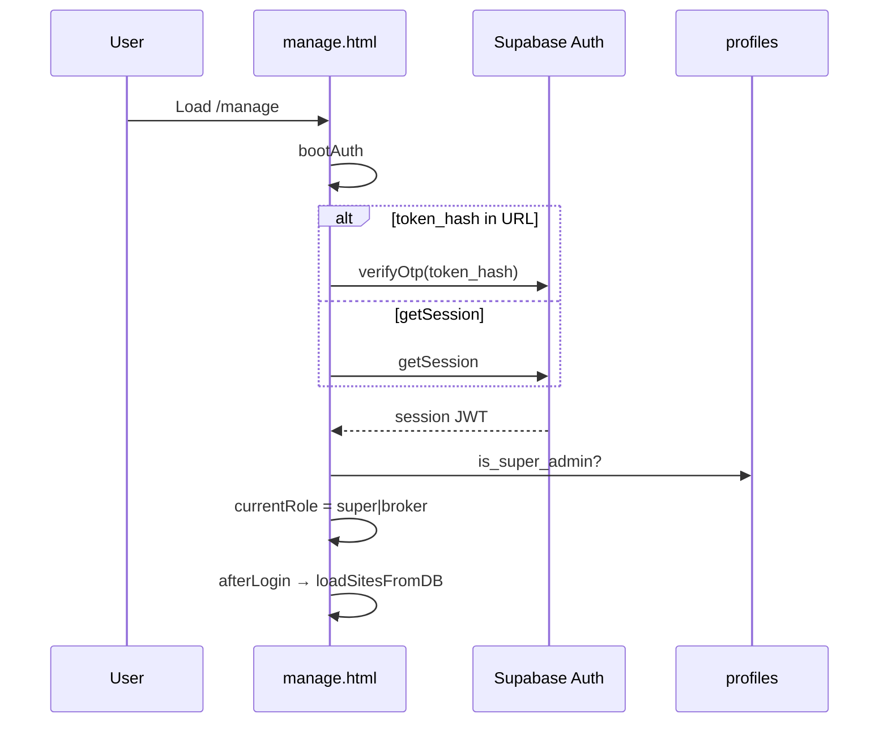
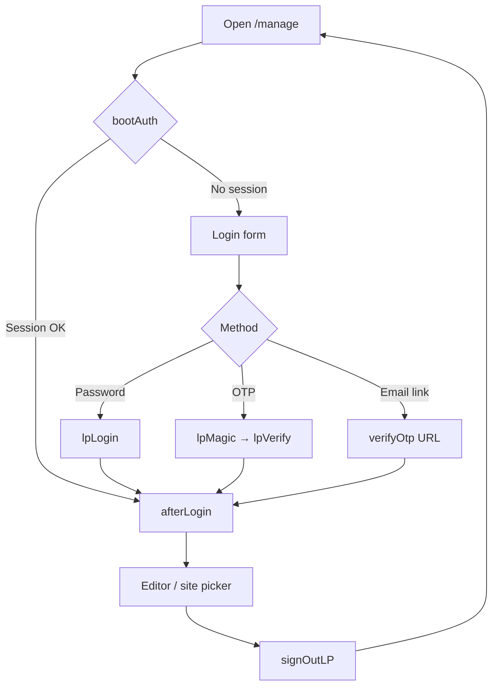
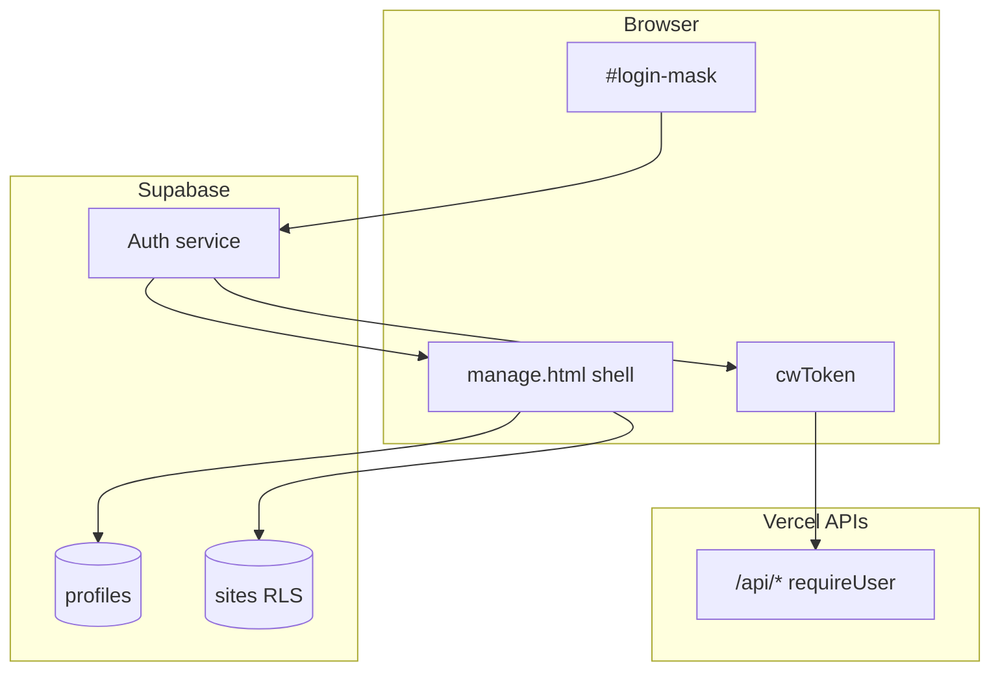
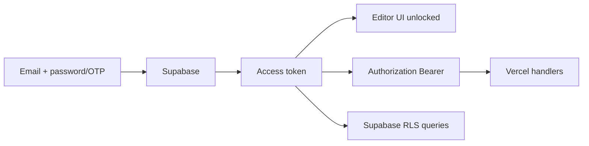
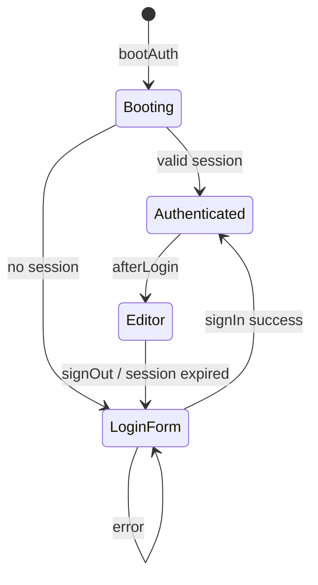

# LeadPages Authentication — Complete Engineering Manual

**Document:** `features/Authentication`  
**Status:** Definitive engineering reference for editor sign-in, sessions, and roles  
**Audience:** Engineers implementing or securing LeadPages access  
**Prerequisites:** [02-DATABASE](../02-DATABASE.md), [features/Editor](Editor.md)

> **Scope:** Supabase Auth in `manage.html` and related surfaces (`partner-dashboard.html`, `billing.html`). Public visitor sites are unauthenticated.

---

## Executive Summary

LeadPages uses **Supabase Auth** with the anon key embedded in HTML. The editor supports **password sign-in**, **email OTP** (magic link + paste code), and **URL token_hash** verification on return from email links. After session establishment, `profiles.is_super_admin` maps users to **`super`** or **`broker`** roles; a legacy **`leads`** demo path exists via in-memory `doLogin()`.

| Fact | Detail |
|------|--------|
| **Client** | `window.supabase.createClient(__LP.url, __LP.anon)` |
| **Entry** | `bootAuth()` on page load |
| **Login UI** | `#login-mask` built by `buildLogin()` |
| **Post-auth** | `afterLogin()` → sites load + `applyRoleGating()` |
| **Bearer token** | `cwToken()` for `/api/*` calls |
| **Sign out** | `signOutLP()` → `sb.auth.signOut()` + reload |

---

## Purpose

### Product purpose

Secure access to site editing while keeping onboarding friction low (magic link, OTP, saved email in `localStorage`).

### Engineering purpose

- Delegate identity to Supabase
- Map JWT → role for UI gating
- Pass JWT to Vercel APIs that use service role server-side

---

## Business Purpose

| Stakeholder | Need |
|-------------|------|
| **Partners** | Manage many client sites under one login |
| **Clients** | `owner_email` scoped access to one site |
| **Super-admin** | Full platform control |
| **Platform** | Billing lock, RLS, audit via Supabase |

---

## User Types

| Role | How assigned | Editor access |
|------|--------------|---------------|
| **super** | `profiles.is_super_admin = true` | All tabs (template permitting) |
| **broker** | Default authenticated user | Partner/client tabs |
| **leads** | Legacy `doLogin()` demo only | Rates tab only |

Site owners are **brokers** at the UI layer; row scope enforced by RLS on `sites` (typically `owner_email` or partner linkage).

---

## Permissions

```javascript
const ALLOWED = {
  super:  [..., 'dashboard', 'apps', ...],
  broker: [..., 'dashboard', 'apps', ...],
  leads:  ['rates']
};
```

`gate()` / `window.__adminGate` re-shows login if session lost mid-edit.

API routes call `requireUser(req)` — reject without `Authorization: Bearer <access_token>`.

---

## Authentication Layout

```text
#login-mask (full-screen overlay)
├── #li-loading — boot spinner
└── #li-form
    ├── Email (#li-user)
    ├── Email me a sign-in code (#li-magic) → OTP
    ├── Code (#li-code) + Verify (#li-verify)
    ├── Password (#li-pass) + Sign in (#li-go)
    └── Forgot password (#li-forgot)
```

Hidden after successful `afterLogin()`.

---

## Navigation

| Path | Flow |
|------|------|
| Cold load | `bootAuth()` |
| Magic link return | `?token_hash=&type=email` → `verifyOtp` → strip URL |
| Existing session | `getSession()` → `afterLogin()` |
| No session | `showLogin()` |
| Mid-session gate | `gate()` on protected actions |

---

## Widgets

| Element | ID | Role |
|---------|-----|------|
| Login mask | `#login-mask` | Modal container |
| Error line | `#li-err` | Inline errors / success hints |
| Boot loading | `#li-loading` | `loginBooting(true)` |
| Sign out (top) | `#lp-signout-top` | After login |
| Sign out (landing) | `#lpl-signout` | Site picker |
| Sign out (command bar) | `#lpc-acct-signout` | In context strip |

---

## Statistics

Authentication has no analytics UI. Failed logins surface only in `#li-err` (not persisted server-side from editor).

---

## Quick Actions

| Action | Handler |
|--------|---------|
| Password sign-in | `lpLogin()` → `signInWithPassword` |
| Send OTP | `lpMagic()` → `signInWithOtp` |
| Verify code | `lpVerify()` → `verifyOtp` type email |
| Forgot password | `resetPasswordForEmail` |
| Sign out | `signOutLP()` |

---

## Recent Activity

Not applicable — no session history UI in editor.

---

## Site Selection

Authentication precedes site selection: `afterLogin()` → `loadSitesFromDB()`. See [Site Builder](Site%20Builder.md).

---

## Notifications

| Event | UI |
|-------|-----|
| OTP sent | Green `#li-err` “Check your email…” |
| Invalid code | Red error text |
| Expired magic link | Message to paste code or resend |
| Boot | `#li-loading` “One moment…” |

---

## Data Sources

```mermaid
flowchart LR
  User --> LoginUI[#login-mask]
  LoginUI --> SBAuth[Supabase Auth]
  SBAuth --> Session[JWT session]
  Session --> Profiles[profiles table]
  Profiles --> Role[currentRole]
  Session --> APIs[/api/* Bearer]
  Role --> Gating[applyRoleGating]
```

---

## API Calls

| Call | Purpose |
|------|---------|
| `sb.auth.signInWithPassword` | Password login |
| `sb.auth.signInWithOtp` | Email code |
| `sb.auth.verifyOtp` | Code or `token_hash` |
| `sb.auth.getSession` | Restore session |
| `sb.auth.signOut` | Logout |
| `sb.auth.resetPasswordForEmail` | Password reset |
| `sb.from('profiles').select('is_super_admin')` | Role detection |
| `cwToken()` | Extract access_token for fetch |

---

## Database Tables

| Table | Usage |
|-------|-------|
| **`auth.users`** | Supabase managed identities |
| **`profiles`** | `is_super_admin` flag |
| **`sites`** | RLS ties users to editable rows via `owner_email`, partner IDs |

---

## Related Files

| File | Auth usage |
|------|------------|
| `manage.html` | Primary auth implementation |
| `partner-dashboard.html` | Partner login |
| `billing.html` | Customer billing portal auth |
| `api/stats.js` | `requireUser()` pattern |
| Most `api/*.js` | Bearer JWT validation |

---

## Functions

| Function | Purpose |
|----------|---------|
| `buildLogin()` | Create `#login-mask` DOM once |
| `bootAuth()` | Startup: magic link, session, or show login |
| `lpLogin()` | Password sign-in |
| `lpMagic()` / `lpVerify()` | OTP flow (inside `buildLogin`) |
| `afterLogin()` | Role + `loadSitesFromDB` |
| `showLogin()` | Display mask |
| `loginBooting(on)` | Toggle loading state |
| `signOutLP()` | Sign out + reload |
| `gate()` | `showLogin()` if not authed |
| `cwToken()` | Promise of access token |
| `doLogin()` | Legacy demo user (non-Supabase) |

---

## Event Flow



---

## User Journey



---

## Performance Considerations

- `getSession()` on boot — single round trip
- Role check one `profiles` SELECT per login
- JWT cached in Supabase client — `cwToken()` reads memory
- `localStorage.lp_login_email` avoids retyping email

---

## Security Considerations

| Topic | Detail |
|-------|--------|
| **Anon key in HTML** | Expected; security = RLS + API auth |
| **JWT in memory** | XSS could exfiltrate — sanitize outputs |
| **OTP `shouldCreateUser: false`** | No accidental signups |
| **Magic link URL** | `token_hash` stripped via `history.replaceState` |
| **Super flag** | UI only unless RLS enforces on writes |
| **Demo `doLogin`** | Hardcoded demo/demo — disable in production if exposed |

---

## Technical Debt

| ID | Issue |
|----|-------|
| TD-A1 | **`doLogin` legacy** parallel to Supabase |
| TD-A2 | **Role is coarse** — only super/broker/leads |
| TD-A3 | **No MFA** |
| TD-A4 | **No server-side role check** on direct Supabase writes from browser |
| TD-A5 | **Email stored in localStorage** — minor privacy footprint |

---

## Future Improvements

1. Remove legacy `doLogin` / `leads` demo path
2. MFA for super-admin
3. Fine-grained permissions (site-level roles table)
4. Server-side session validation middleware for all APIs
5. OAuth providers (Google) for partners

---

## Authentication Architecture



---

## Connections to Other Features

| Feature | Connection |
|---------|------------|
| [Editor](Editor.md) | `afterLogin` boots shell |
| [Site Builder](Site%20Builder.md) | Sites visible post-auth |
| [Settings](Settings.md) | Super-only fields gated by `currentRole` |
| [Billing](Billing.md) | `lpBillingGate` after auth |
| [User Management](User%20Management.md) | Broker-app users tab (separate from Supabase auth) |

---

## Data Flow



---

## User Flow



---

*Last updated: July 2026.*
