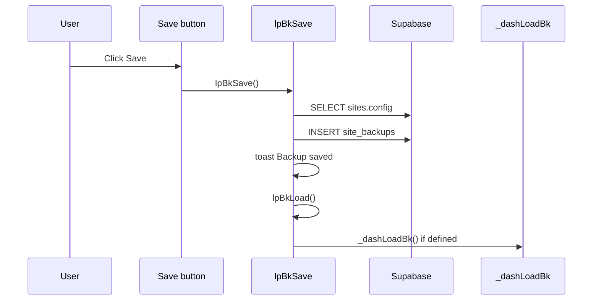
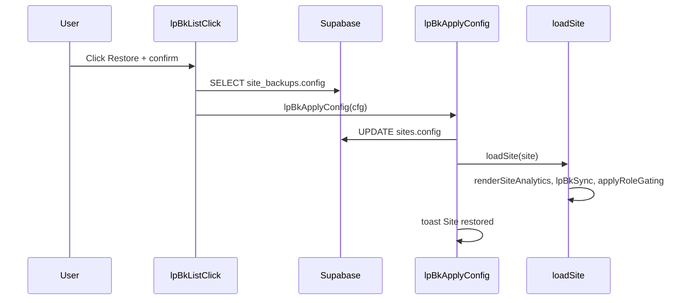
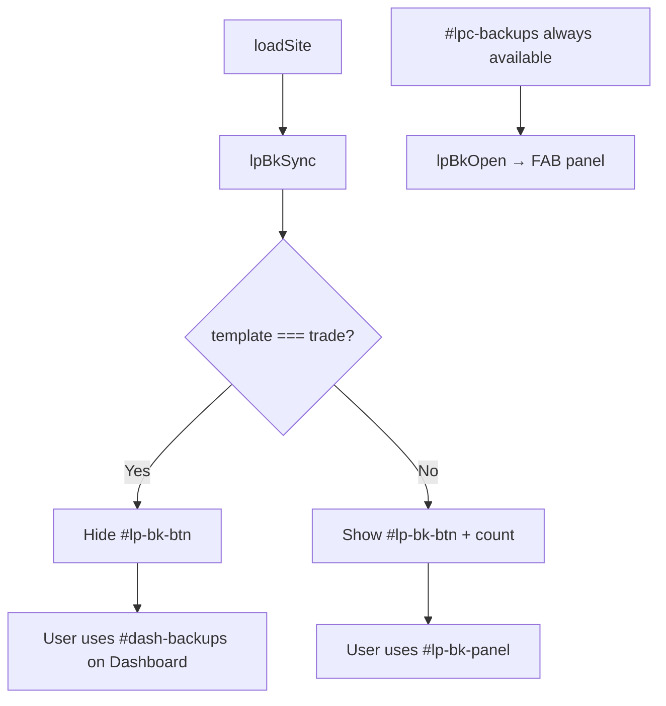
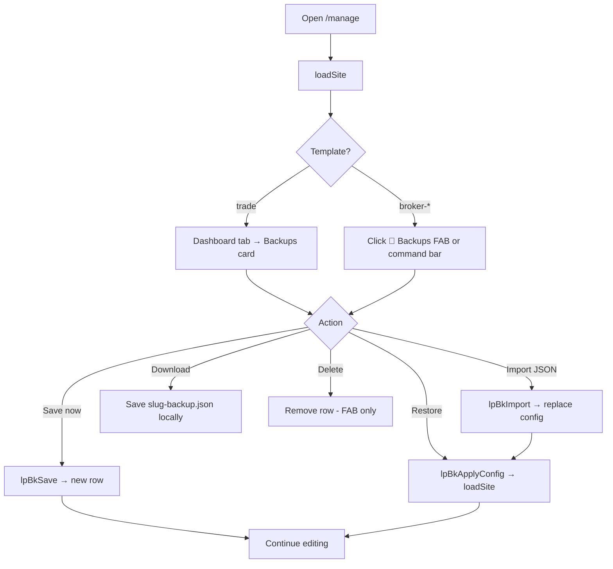
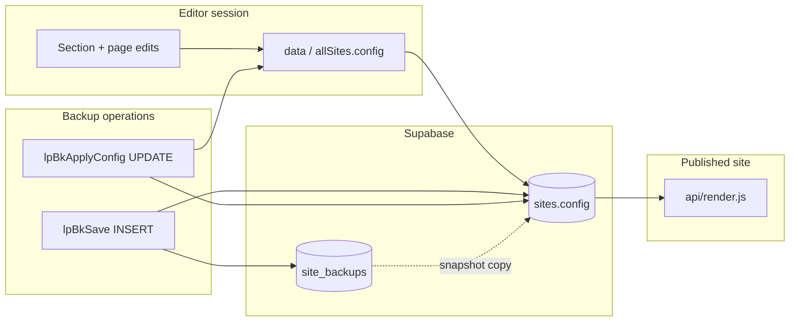
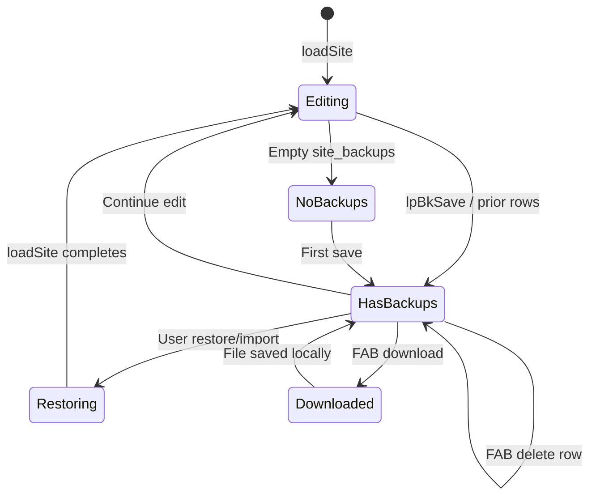

# LeadPages Site Backups — Complete Engineering Manual

**Document:** `features/Backups`  
**Status:** Definitive engineering reference for config snapshots, restore, and the Dashboard backups card  
**Audience:** Engineers rebuilding, extending, or debugging backup flows; AI development agents  
**Prerequisites:** [00-VISION](../00-VISION.md), [01-ARCHITECTURE](../01-ARCHITECTURE.md), [02-DATABASE](../02-DATABASE.md), [04-SITE-BUILDER](../04-SITE-BUILDER.md), [10-EDITOR](../10-EDITOR.md), [features/Dashboard](Dashboard.md)

> **Scope note:** This document describes **site config backups** — JSON snapshots of `sites.config` stored in `site_backups` and managed via `lpBk*` in `manage.html`. It is **not** database dumps, Supabase point-in-time recovery, Cloudinary asset backups, or Git history.

---

## Executive Summary

LeadPages backups are **point-in-time snapshots of a site's full design and content config** (`sites.config` JSONB). They exist because the editor has **no global undo/redo** for trade sections — backups are the intentional recovery path when a design is damaged, overwritten, or needs rollback.

Implementation is **100% client-side** in `manage.html`: nine `lpBk*` functions talk directly to Supabase (`site_backups` + `sites.update`). There is no dedicated backup API, cron job, or automatic snapshot schedule.

| Fact | Detail |
|------|--------|
| **Storage** | Supabase table `site_backups` |
| **Payload** | Full `sites.config` JSONB copy per row |
| **Primary UI (broker / non-trade)** | Floating `#lp-bk-btn` + `#lp-bk-panel` |
| **Primary UI (trade)** | Dashboard card `#dash-backups` — FAB hidden |
| **Command bar** | `#lpc-backups` → `lpBkOpen()` on all templates |
| **Shared handlers** | `lpBkSave`, `lpBkImport`, `lpBkListClick`, `lpBkApplyConfig` |
| **Auth** | Supabase JWT in browser; RLS on `site_backups` |

---

## Purpose

### Product purpose

Site owners and partners need a safety net when editing live-looking sites in the builder:

1. **Before risky changes** — save a restore point before restructuring sections or importing a theme.
2. **After mistakes** — roll back to a known-good design without support intervention.
3. **Portability** — download JSON to archive offline or import into another site session.

Backups capture **everything in `config`**: sections, copy, images (Cloudinary URLs), SEO landing pages, scope checklist, appearance tokens, and marketplace-merged section order — not leads, analytics, domains, or billing state.

### Engineering purpose

- **Replace missing undo** — trade section edits persist immediately; backups are the designed rollback mechanism ([10-EDITOR](../10-EDITOR.md) Undo / Recovery).
- **Single source of truth** — one `lpBkApplyConfig(cfg)` path for restore and import; always ends in `sites.update` + `loadSite()`.
- **Template-aware UX** — `lpBkSync()` hides the floating FAB on `trade` sites where the Dashboard card is the canonical surface.

---

## Business Purpose

| Stakeholder | Value |
|-------------|-------|
| **Site owner (tradie)** | Self-service recovery; no “please restore my site” tickets |
| **Partner / broker** | Confidence to hand off sites; can save checkpoints during build-out |
| **LeadPages (platform)** | Retention — fear of breaking a site blocks experimentation; backups reduce churn |
| **Super-admin** | Same tools when editing any client site |

Backups are **not billed or quota-limited** in code today — storage grows with row count and JSON size.

---

## User Types

| User | Can save? | Can restore? | Typical surface |
|------|-----------|--------------|-----------------|
| **Super-admin** | Yes | Yes | Dashboard card (trade) or FAB panel (broker) |
| **Broker / partner** | Yes | Yes | Same |
| **Site owner** (customer login) | Yes, if editor access | Yes | Trade Dashboard card |
| **Leads-only demo** (`leads` role) | No — no site editor | No | N/A |
| **Anonymous** | No | No | N/A |

Partners using `partner-dashboard.html` link into `/manage?site=` — backup UI is inside the builder, not on the partner portfolio grid.

---

## Permissions

| Layer | Mechanism |
|-------|-----------|
| **Authentication** | Supabase session required — `manage.html` `gate()` |
| **Site access** | User must be able to load `currentSiteId` (owner, partner, or super) |
| **RLS** | `site_backups` policies scoped by site ownership (JWT in browser) — see [02-DATABASE](../02-DATABASE.md) |
| **Billing lock** | `lpBillingGate()` overlay blocks entire editor including backups |
| **Destructive actions** | `confirm()` dialogs on restore, import, and delete |

There is **no server-side validation** of config shape on restore — a malicious or corrupt JSON file could break hydration until another restore.

---

## UI Surfaces

Three entry points share the same `lpBk*` backend:

### 1. Floating panel (non-trade default)

Created lazily by `lpBkEnsure()`:

```text
┌──────────────────────────────────────┐
│  Site backups                    ×   │
│  Save a restore point of this site's │
│  full design and content…            │
│  [+ Save backup now] [Import file]   │
├──────────────────────────────────────┤
│  Backup 05/07/2026                   │
│  5 Jul 2026 3:30 pm                  │
│  [Restore] [Download] [Delete]       │
│  …                                   │
└──────────────────────────────────────┘
     ▲
     │  #lp-bk-btn  💾 Backups · 3
     └── fixed bottom-right (hidden on trade)
```

| Element | ID | Notes |
|---------|-----|-------|
| FAB | `#lp-bk-btn` | Fixed `right:132px; bottom:16px`; shows backup count |
| Panel | `#lp-bk-panel` | 380px wide; toggled by `lpBkOpen()` |
| Close | `#lp-bk-close` | Hides panel |
| Save | `#lp-bk-save` | Calls `lpBkSave()` |
| Import | `#lp-bk-import` + `#lp-bk-file` | Hidden file input, `.json` |
| List | `#lp-bk-list` | Populated by `lpBkLoad()` — **full actions** |

**Visibility:** `lpBkSync()` sets `display:block` only when `currentSiteId` is set **and** `currentSiteTemplate !== 'trade'`.

### 2. Command bar button (all templates)

`ensureSiteBar()` injects `#lpc-backups` in the tools cluster. Click → `lpBkOpen()`.

On **trade** sites the FAB is hidden, but the command-bar **Backups** button still opens the floating panel — an alternate path beside the Dashboard card.

Classic command mode CSS hides FABs: `body.lp-cmd-on #lp-bk-btn { display:none !important }`.

### 3. Dashboard backups card (trade only)

Built inside `renderDashboard()` — see [Dashboard](Dashboard.md).

```text
┌─────────────────────────────────────────┐
│  BACKUPS          [+ Save now] [Import] │
├─────────────────────────────────────────┤
│  Backup 05/07/2026          [Restore]   │
│  5 Jul 2026, 03:30 pm                   │
│  … (up to 8 rows)                       │
└─────────────────────────────────────────┘
```

| Element | ID | Handler |
|---------|-----|---------|
| Container | `#dash-backups` | Inline in Dashboard grid |
| Save | `#dash-bk-save` | `lpBkSave()` with loading state |
| Import | `#dash-bk-import` / `#dash-bk-file` | `lpBkImport()` → `_dashLoadBk` after 2s |
| List | `#dash-bk-list` | `_dashLoadBk()` — **restore only** in list UI |

---

## Operations

### Save backup (`lpBkSave`)

1. Requires `currentSiteId`.
2. Default label: `Backup DD/MM/YYYY` (`en-AU` date), truncated to 120 chars.
3. Fetches fresh config: `sb.from('sites').select('config').eq('id', currentSiteId)` — falls back to `lpBkCurrentConfig()` from in-memory `allSites` / `data`.
4. Inserts: `{ site_id, label, config }` into `site_backups`.
5. Toast: “Backup saved”.
6. Refreshes `lpBkLoad()` (FAB list) and `_dashLoadBk()` if defined.

**Not automatic** — user must click Save. Autosave (`lpSaveDB`) only writes `config.pages` subset and does **not** create backup rows.

### Restore backup (`lpBkListClick` → `lpBkApplyConfig`)

1. User clicks `[data-bk-restore="{id}"]`.
2. `confirm('Restore this backup? The current design will be replaced…')`.
3. SELECT `config` FROM `site_backups` WHERE `id`.
4. `lpBkApplyConfig(cfg)`:
   - `sites.update({ config: cfg, updated_at: now })`
   - Updates `allSites` cache entry
   - `loadSite(s)` — full editor reload (preview, analytics, gating)
   - Toast: “Site restored”
5. Closes `#lp-bk-panel` if open.

Restore is **destructive** — current unsaved in-memory edits are lost unless already in `sites.config`.

### Download backup (`lpBkListClick` — FAB panel only)

1. User clicks `[data-bk-dl="{id}"]`.
2. SELECT `config`, stringify with indentation.
3. Browser download: `{slug}-backup.json`.

Dashboard list rows **do not render** download buttons (technical debt TD-B6).

### Delete backup (`lpBkListClick` — FAB panel only)

1. User clicks `[data-bk-del="{id}"]`.
2. `confirm('Delete this backup? This cannot be undone.')`.
3. `DELETE FROM site_backups WHERE id`.
4. Refreshes `lpBkLoad()` only — **does not** call `_dashLoadBk()` (stale Dashboard list until revisit).

### Import from file (`lpBkImport`)

1. User picks `.json` via file input (`#lp-bk-file` or `#dash-bk-file`).
2. `FileReader` → `JSON.parse`.
3. Validates: object, not array.
4. `confirm('Import this file and replace the current site design with it?')`.
5. `lpBkApplyConfig(cfg)` — same as restore (does **not** insert a new `site_backups` row).

Import is **restore-from-disk**, not “upload as new backup row”.

---

## What Gets Backed Up

Each row stores a **complete copy** of `sites.config` at save time. Typical top-level keys (template-dependent):

| Key area | Contents |
|----------|----------|
| `sections` | Per-section content, visibility (`on`), images, lists |
| `sectionOrder` | Render order including marketplace apps |
| `pages` | SEO landing pages (slug, body, status, meta) |
| `businessName`, contact fields | Identity tokens |
| `appearance` / theme | Colors, fonts (broker-app uses nested appearance) |
| `scope` | Partner project checklist (`items[]`) |
| Marketplace merges | Enabled `site_apps` reflected in `sections` after `_reconcileSiteApps` |

**Excluded from backup payload:**

| Data | Where it lives |
|------|----------------|
| Leads | `leads` table |
| Analytics events | `events` table |
| Custom domain DNS | `domains` table |
| Billing / hosting status | `billing_customers`, Stripe |
| `sites.status`, `slug`, `template` | Top-level `sites` columns — unchanged on restore |
| Cloudinary assets | URLs in config only; binary files stay in Cloudinary |

---

## Database: `site_backups`

| Column | Type | Purpose |
|--------|------|---------|
| `id` | uuid (PK) | Backup row identifier |
| `site_id` | uuid (FK → `sites.id`) | Tenant scope |
| `label` | text | User-visible name (max 120 on insert) |
| `config` | jsonb | Full snapshot of `sites.config` |
| `created_at` | timestamptz | Sort key, display timestamp |
| `size_bytes` | integer (optional) | Selected by `_dashLoadBk` but **not displayed** in UI |

**Relationships:** `sites ||--o{ site_backups : site_id`

**CRUD from editor:**

| Operation | Function | Supabase call |
|-----------|----------|---------------|
| List (FAB) | `lpBkLoad` | SELECT `id, label, created_at` ORDER BY `created_at` DESC |
| List (Dashboard) | `_dashLoadBk` | Same + `size_bytes`, LIMIT 8 |
| Count badge | `lpBkSync` | SELECT `id` HEAD count |
| Create | `lpBkSave` | INSERT |
| Read config | `lpBkListClick` | SELECT `config` by `id` |
| Delete | `lpBkListClick` | DELETE by `id` |
| Restore target | `lpBkApplyConfig` | UPDATE `sites.config` |

No UPDATE on backup rows — labels are immutable after insert.

See [02-DATABASE](../02-DATABASE.md) § Backup Tables.

---

## Functions

### `lpBk*` module (~5030–5118 in `manage.html`)

| Function | Role |
|----------|------|
| `lpBkEnsure()` | Lazy-create `#lp-bk-btn`, `#lp-bk-panel`, wire panel listeners |
| `lpBkSync()` | Show/hide FAB by template; update count badge; hide panel |
| `lpBkOpen()` | Toggle panel; close scope panel; call `lpBkLoad()` when opening |
| `lpBkCurrentConfig()` | Read config from `allSites` or global `data` |
| `lpBkLoad()` | Populate `#lp-bk-list` with Restore / Download / Delete |
| `lpBkSave()` | INSERT snapshot; refresh lists |
| `lpBkApplyConfig(cfg)` | UPDATE `sites`; sync cache; `loadSite()`; toast |
| `lpBkListClick(e)` | Delegated restore / download / delete |
| `lpBkImport(e)` | Parse JSON file → `lpBkApplyConfig` |

Supporting: `lpEsc(t)` — HTML escape for backup list labels in FAB panel; Dashboard uses `esc()`.

**Lifecycle hook:** `loadSite()` ends with `lpBkSync()` (async and sync paths).

**Init:** `lpBkEnsure()` called at script load (~5612) so DOM exists before first site load.

### Dashboard helper

| Function | Role |
|----------|------|
| `_dashLoadBk()` | Populate `#dash-bk-list` — max 8 rows, restore button only |

Called from `renderDashboard()` on mount and indirectly after `lpBkSave()`.

---

## API Calls

There is **no REST backup endpoint**. All traffic is Supabase PostgREST from the browser:

| Table | Method | Called by | Query / body |
|-------|--------|-----------|--------------|
| `site_backups` | SELECT | `lpBkLoad`, `_dashLoadBk`, `lpBkSync` | `.eq('site_id', currentSiteId)` |
| `site_backups` | SELECT | `lpBkListClick` | `.eq('id', backupId)` → `config` |
| `site_backups` | INSERT | `lpBkSave` | `{ site_id, label, config }` |
| `site_backups` | DELETE | `lpBkListClick` | `.eq('id', backupId)` |
| `sites` | SELECT | `lpBkSave` | `.select('config')` before insert |
| `sites` | UPDATE | `lpBkApplyConfig` | `{ config, updated_at }` |

Auth: shared Supabase client `sb` with user JWT.

---

## Event Flow

### Save backup



### Restore backup



### Trade site load — surface selection



---

## User Journey



**Recommended partner workflow:** Save backup before bulk theme apply or marketplace app enable → make changes → publish → save another backup with descriptive label (today labels are auto-dated only — custom labels not exposed in UI).

---

## Performance Considerations

| Area | Behaviour | Risk |
|------|-----------|------|
| **Payload size** | Full `config` JSON per row — trade configs can be 100KB+ | Slow INSERT/SELECT on poor networks |
| **List queries** | Dashboard limits 8; FAB lists **all** rows | Large histories slow FAB panel |
| **Restore** | Full `loadSite()` reload | Heavy but ensures preview + ANA consistency |
| **No pagination** | `lpBkLoad` unbounded | Sites with hundreds of backups → UI lag |
| **`size_bytes`** | Column queried but unused in UI | Wasted bandwidth unless displayed later |
| **Duplicate listeners** | `_dashLoadBk` re-binds `click` on `#dash-bk-list` after each load | Multiple handlers if called repeatedly (minor) |

**Recommendations (future):** Paginate FAB list; cap rows per site; compute `size_bytes` on insert server-side; soft-delete or retention policy.

---

## Security Considerations

| Topic | Detail |
|-------|--------|
| **Authorization** | RLS must restrict `site_backups` to site editors — same trust model as `sites.update` |
| **Restore impact** | Overwrites entire `config` — could embed script in string fields; public site uses `esc()` on output |
| **Download** | Exports full site content including PII in config (phone, email in sections) — treat files as sensitive |
| **Import** | No schema validation — malformed config may break editor until valid restore |
| **Confirm dialogs** | Only client-side guard against accidental restore/delete |
| **Service role** | Backups never use service role — user JWT only |

Backups do **not** capture auth tokens or Supabase keys.

---

## Technical Debt

| ID | Issue | Location | Impact |
|----|-------|----------|--------|
| TD-B1 | **Dashboard list: restore only** | `_dashLoadBk` | No Download/Delete on trade Dashboard card |
| TD-B2 | **Delete doesn't refresh Dashboard** | `lpBkListClick` delete branch | Calls `lpBkLoad()` only, not `_dashLoadBk()` |
| TD-B3 | **Duplicate click listeners** | `_dashLoadBk` + `renderDashboard` | Potential double-fire on restore |
| TD-B4 | **Auto-dated labels only** | `lpBkSave` | No prompt for custom backup name |
| TD-B5 | **`size_bytes` unused** | `_dashLoadBk` SELECT | Column never shown |
| TD-B6 | **Import doesn't create backup row** | `lpBkImport` | Pre-import state not auto-snapshotted |
| TD-B7 | **Command bar vs Dashboard** | Trade sites | `#lpc-backups` opens FAB while card is canonical — confusing dual UI |
| TD-B8 | **`api/manage.html` drift** | Legacy copy | No Dashboard; FAB always shown — wrong if deployed |
| TD-B9 | **No backup on publish** | Publish flow | Publish doesn't auto-save restore point |
| TD-B10 | **Unbounded row growth** | No retention | Storage cost; cluttered lists |

Cross-reference: Dashboard doc TD-D6 (same Dashboard subset issue).

---

## Future Improvements

1. **Parity on Dashboard card** — add Download and Delete to match FAB panel.
2. **Unified refresh** — extract `lpBkRefreshLists()` calling both `lpBkLoad` and `_dashLoadBk`.
3. **Custom labels** — prompt on save (“Before homepage redesign”).
4. **Pre-restore snapshot** — auto-insert backup row before `lpBkApplyConfig`.
5. **Retention policy** — keep last N backups or 90 days per site.
6. **Scheduled backups** — optional weekly cron for paid plans.
7. **Hide `#lpc-backups` on trade** — Dashboard-only UX.
8. **Display `size_bytes`** — help users understand storage.
9. **Server-side validation** — Zod/schema check on import/restore.
10. **Backup diff preview** — show section keys changed before restore.

---

## Architecture

```mermaid
flowchart TB
  subgraph ui [manage.html UI]
    FAB["#lp-bk-btn / #lp-bk-panel<br/>non-trade"]
    Dash["#dash-backups<br/>trade Dashboard"]
    Cmd["#lpc-backups command bar"]
  end

  subgraph lpBk [lpBk* module]
    Ensure[lpBkEnsure]
    Sync[lpBkSync]
    Open[lpBkOpen]
    Load[lpBkLoad]
    Save[lpBkSave]
    Apply[lpBkApplyConfig]
    Click[lpBkListClick]
    Import[lpBkImport]
    DashLoad[_dashLoadBk]
  end

  subgraph db [(Supabase)]
    BK[site_backups]
    Sites[sites.config]
  end

  Cmd --> Open
  FAB --> Open & Load & Save & Import & Click
  Dash --> Save & Import & Click & DashLoad
  Open --> Load
  Save --> BK
  Save --> Sites
  Load --> BK
  DashLoad --> BK
  Click --> Apply
  Import --> Apply
  Apply --> Sites
  Apply --> loadSite[loadSite reload]
  Sync --> FAB
```

---

## Connections to Other Systems

### Editor (`manage.html`)

Backups sit alongside autosave and publish — three different persistence semantics:

| Mechanism | Scope | When |
|-----------|-------|------|
| **Autosave** | `config.pages` only | Debounced on SEO tab edits |
| **Publish** | Full config + `sites.status` | Command bar |
| **Backup** | Full `config` snapshot | Manual; stored in separate table |

Restore triggers full `loadSite()` — same path as switching sites — refreshing preview iframe, `ANA`, `_siteApps`, and role gating.

See [10-EDITOR](../10-EDITOR.md) § Undo / Recovery, Backups Panel.

### Dashboard

Trade template moves backup UX into [Dashboard](Dashboard.md) § Backups widget. `lpBkSync()` hides FAB; `_dashLoadBk` provides subset UI. Shared handlers prevent logic duplication for save/import/restore.

### Site Builder

`loadSite()` calls `lpBkSync()` after site data loads. Template gate determines visible surface.

See [04-SITE-BUILDER](../04-SITE-BUILDER.md) § Backups & Recovery.

### Marketplace

`_reconcileSiteApps()` mutates `config.sections` before save — a backup taken **after** reconcile includes merged app sections; restoring an **older** backup removes app section merges until reconcile runs again on next load.

### Public site / render

Restore updates `sites.config` immediately in DB. **Live site** still serves cached HTML until next publish or CDN TTL — backups do not auto-publish. Users must publish after restore for production to match.

See [03-TEMPLATE-SYSTEM](../03-TEMPLATE-SYSTEM.md) and [04-SITE-BUILDER](../04-SITE-BUILDER.md) § Publish flow.

### localStorage recovery (distinct)

`persist()` writes full `data` to `localStorage` key `linray_rates` on every change — browser-local, not shared across devices, cleared on cache clear. **Not** a substitute for `site_backups`.

---

## Data Flow



---

## User Flow (state)



---

## Related Files

| File | Relationship |
|------|--------------|
| **`manage.html`** | **Primary implementation** — all `lpBk*` + `_dashLoadBk` |
| `api/manage.html` | Legacy duplicate — no Dashboard; do not treat as source of truth |
| `docs/features/Dashboard.md` | Dashboard backups card context |
| `docs/02-DATABASE.md` | `site_backups` schema reference |
| `docs/10-EDITOR.md` | Editor-wide backup summary |
| `docs/04-SITE-BUILDER.md` | `loadSite`, recovery overview |
| `docs/11-DESIGN-SYSTEM.md` | Full-screen overlay patterns (backup panel styling) |

---

## Glossary

| Term | Meaning |
|------|---------|
| **Config snapshot** | Copy of `sites.config` JSONB at a point in time |
| **`lpBk*`** | Prefix for backup module functions in `manage.html` |
| **FAB** | Floating action button `#lp-bk-btn` |
| **Restore** | Replace live `sites.config` from backup or imported JSON |
| **Import** | Restore from local `.json` file — does not add DB row |
| **Trade template** | `sites.template = 'trade'` — Dashboard card replaces FAB |

---

*Last updated: July 2026 — reflects `manage.html` backup implementation on branch `main`.*
