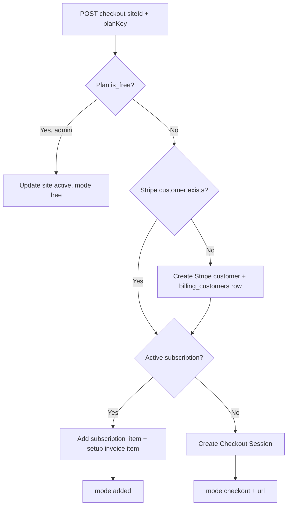
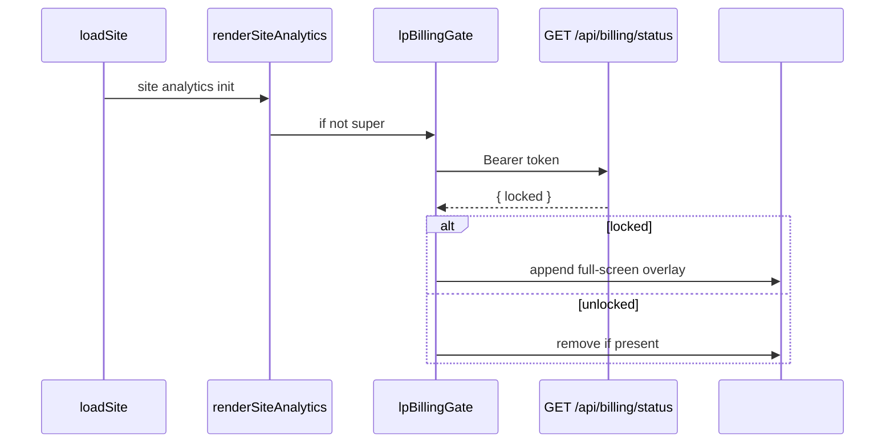
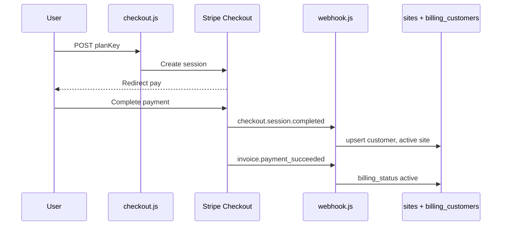
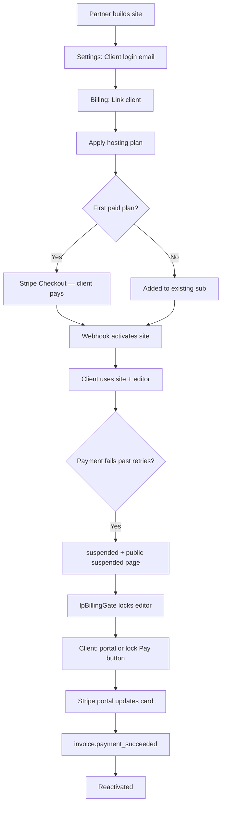
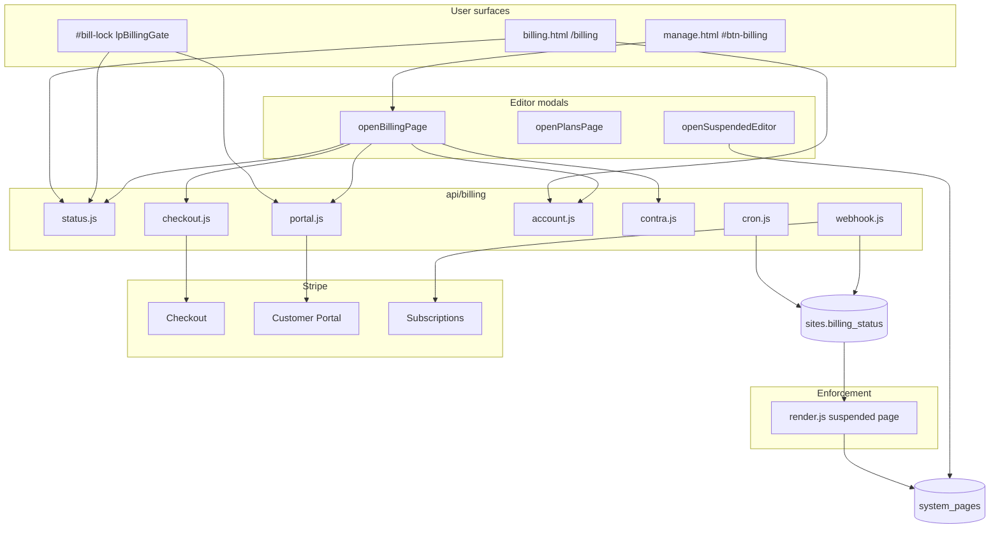
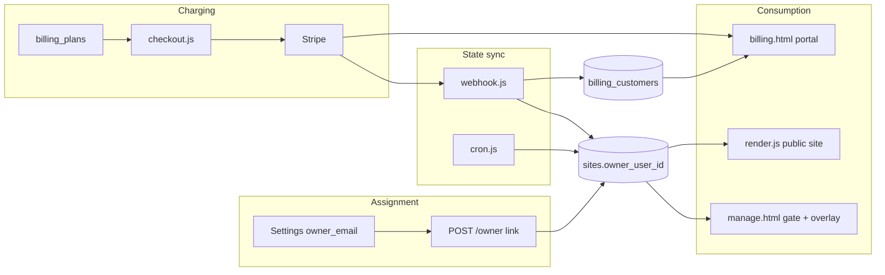
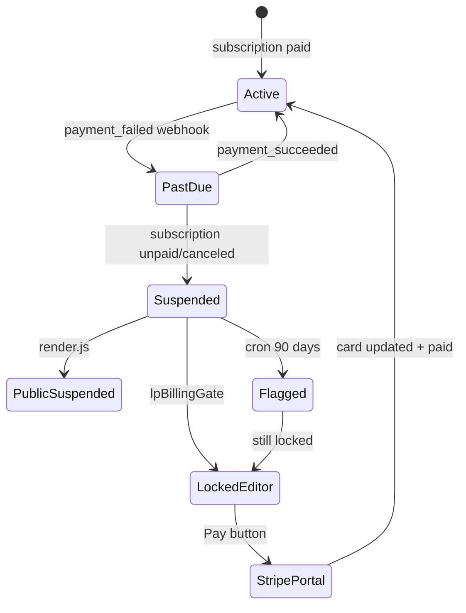

# LeadPages Billing — Complete Engineering Manual

**Document:** `features/Billing`  
**Status:** Definitive engineering reference for hosting billing, account lock, contra ledger, and app subscriptions  
**Audience:** Engineers rebuilding, extending, or debugging billing; AI development agents  
**Prerequisites:** [00-VISION](../00-VISION.md), [01-ARCHITECTURE](../01-ARCHITECTURE.md), [02-DATABASE](../02-DATABASE.md), [04-SITE-BUILDER](../04-SITE-BUILDER.md), [05-PARTNERS](../05-PARTNERS.md), [10-EDITOR](../10-EDITOR.md)

> **Scope note:** This document covers **hosting billing** (`/api/billing/*`), the **editor billing overlay** (`openBillingPage`, `lpBillingGate` in `manage.html`), and the **standalone client portal** (`billing.html`). It is **not** partner commission payouts (`partner_commissions`), Dreamscape domain reseller billing, or Stripe Connect for partners — those are documented in [05-PARTNERS](../05-PARTNERS.md) and [06-DOMAINS](../06-DOMAINS.md).

---

## Executive Summary

LeadPages billing is a **Stripe-backed subscription system** keyed off `sites.owner_user_id`. One Supabase Auth user can own **multiple sites** on a **single combined Stripe subscription** (one subscription item per site). When payment fails past Stripe’s retry window, sites move to `billing_status = suspended`, the public site shows a configurable **suspended page**, and the editor shows a full-screen **`#bill-lock`** overlay via `lpBillingGate()`.

Implementation spans three surfaces:

| Surface | File | Role |
|---------|------|------|
| **Editor overlay** | `manage.html` | Partners/admins manage plans, link clients, contra ledger, admin actions |
| **Client portal** | `billing.html` | Site owners self-serve: hosting summary, app add-ons, Stripe portal |
| **Serverless API** | `api/billing/*.js` | Stripe REST, webhooks, cron, contra accrual |

| Fact | Detail |
|------|--------|
| **Payment provider** | Stripe (raw REST in `_stripe.js` — no SDK) |
| **Account key** | `billing_customers.owner_user_id` ↔ `stripe_customer_id` |
| **Per-site fee** | `sites.plan_key`, `monthly_amount` (cents), `stripe_item_id` |
| **Lock trigger** | `accountStatus` ∈ `{ suspended, flagged_deletion }` → `locked: true` |
| **Public enforcement** | `api/render.js` → `system_pages` suspended variant |
| **Super bypass** | `currentRole === 'super'` skips `lpBillingGate` overlay |
| **Admin identity** | `SUPER_ADMIN_EMAILS` env list (not only `profiles.is_super_admin`) |

---

## Purpose

### Product purpose

Hosting is the core recurring revenue for LeadPages. Billing must:

1. **Charge reliably** — monthly hosting (+ optional setup) per site, combined on one card where possible.
2. **Degrade gracefully** — warn on `past_due`, suspend only after Stripe exhausts retries.
3. **Self-serve recovery** — clients update cards via Stripe Customer Portal without support tickets.
4. **Support partner workflows** — admins assign plans, link client logins, track contra/barter arrangements.
5. **Upsell apps** — paid marketplace apps bill through the same Stripe customer (`site_app_subscriptions`).

### Engineering purpose

- **Single owner model** — `owner_user_id` on `sites` unifies status, lock, portal, and contra.
- **Webhook-driven truth** — `billing_status` on sites mirrors Stripe subscription lifecycle.
- **Inline UI** — no React billing app; overlays in `manage.html` + standalone `billing.html`.
- **Shared helpers** — `api/billing/_stripe.js` for auth, Stripe calls, webhook verification.

---

## Business Purpose

| Stakeholder | Value |
|-------------|-------|
| **Site owner (client)** | One login (`billing.html` or editor) to pay, view invoices, manage add-on apps |
| **Partner / broker** | Assign plans, send checkout links, track contra balances for barter clients |
| **LeadPages (platform)** | Predictable MRR; automated suspension reduces unpaid hosting |
| **Super-admin** | Plan builder, suspended-page copy, protect/extend/unsuspend without Stripe dashboard |

Partner **commissions** (build 50% / recurring 20% of invoice lines) accrue in the billing webhook — see [05-PARTNERS](../05-PARTNERS.md). Billing **enforcement** (suspend live site) is separate from commission **accounting**.

---

## User Types

| User | Editor billing overlay | `billing.html` portal | Lock overlay |
|------|------------------------|----------------------|--------------|
| **Super-admin** (`SUPER_ADMIN_EMAILS`) | Full: link owner, plans, contra write, protect/extend/unsuspend | N/A (uses editor) | **Bypassed** |
| **Broker / partner** (editor access) | Same as super for billing UI when role allows | Can use if they are `owner_user_id` | Locked if their account suspended |
| **Site owner** (`owner_user_id`) | Limited: apply plan (not free), portal, read contra if visible | Primary self-serve surface | Locked when suspended |
| **Leads-only demo** | No billing button in nav | No sites linked | N/A |

**Client linking flow:** Admin sets **Client login email** in Settings → **Billing** → **Link client & enable billing** (`POST /api/billing/owner`) creates/confirms Supabase auth user and stamps `owner_user_id` on all sites sharing that email.

---

## Permissions

### Authentication

All `/api/billing/*` routes (except webhook/cron) require:

```text
Authorization: Bearer <supabase access token>
```

Validated via `getUser()` → Supabase `/auth/v1/user`.

### Authorization matrix

| Endpoint | Owner | Broker (non-owner) | Super (`SUPER_ADMIN_EMAILS`) |
|----------|-------|--------------------|------------------------------|
| `GET /api/billing/status` | Own account | Own account only | `?siteId=` / `?ownerId=` for any client |
| `GET /api/billing/account` | Own | — | `?siteId=` |
| `GET /api/billing/contra` | Read own (if enabled/visible) | — | Read/write via `?siteId=` |
| `POST /api/billing/checkout` | Own site | — | Any site; gets checkout **URL prompt** |
| `POST /api/billing/portal` | Own | — | Optional `body.ownerId` |
| `POST /api/billing/owner` | — | — | Admin only |
| `POST /api/billing/admin` | — | — | Admin only |
| `GET/POST /api/billing/plans` | GET active plans | GET active | Full CRUD |
| `GET/POST /api/billing/system-pages` | — | — | Super-admin (`profiles.is_super_admin`) |
| `POST /api/billing/webhook` | — | — | Stripe signature only |
| `GET /api/billing/cron` | — | — | `CRON_SECRET` Bearer |

### Free plan gate

`billing_plans.is_free = true` plans are **admin-assigned only** (`checkout.js` returns 403 for non-admin). They never suspend and skip Stripe.

---

## Billing Status Model

### Site-level (`sites.billing_status`)

| Status | Meaning | Live site | Editor |
|--------|---------|-----------|--------|
| `none` | No plan assigned | Serves normally | Unlocked |
| `active` | Paid / free plan active | Serves | Unlocked |
| `past_due` | Stripe retry in progress | **Still serves** | Unlocked (warning) |
| `suspended` | Unpaid / canceled subscription | **Suspended page** | **Locked** (`locked: true`) |
| `flagged_deletion` | Suspended > 90 days (cron) | Suspended page | **Locked** |
| `canceled` | (UI label) | — | — |

### Account-level aggregation (`GET /api/billing/status`)

`accountStatus` = worst status across billed sites (`plan_key` set) and `billing_customers.status`.

```javascript
const order = { suspended: 4, flagged_deletion: 5, past_due: 3, active: 2, none: 1 };
```

`locked = accountStatus === 'suspended' || accountStatus === 'flagged_deletion'`.

### Stripe → site mapping (`webhook.js`)

```javascript
function siteStatusFor(subStatus) {
  if (subStatus === 'active' || subStatus === 'trialing') return 'active';
  if (subStatus === 'past_due') return 'past_due';
  if (subStatus === 'unpaid' || subStatus === 'canceled' || subStatus === 'incomplete_expired') return 'suspended';
  return null;
}
```

**Policy:** Suspend only after retries exhausted — not on first `invoice.payment_failed`.

---

## Surfaces & Layout

### 1. Editor command bar → `openBillingPage()`

Triggered by `#btn-billing` (injected in `ensureSiteBar()`). Full-screen modal `#billing-page` (z-index 9999).

```text
┌─────────────────────────────────────────────────────────────┐
│  BILLING                                    [Close]         │
├─────────────────────────────────────────────────────────────┤
│  (Super) Client: email@example.com                          │
│  Account banner: status pill · Monthly total                │
│  (If locked) Red warning banner                             │
├─────────────────────────────────────────────────────────────┤
│  STRIPE DETAIL CARD (if hasStripe)                          │
│  Subscription items · Payment method · Invoices             │
├─────────────────────────────────────────────────────────────┤
│  PER-SITE ROWS (one per site on account)                    │
│  Name · status pill · plan · Change/Apply plan              │
│  (Super) Protect · Extend 90d · Unsuspend                   │
├─────────────────────────────────────────────────────────────┤
│  [Pay / manage billing] or [Update card in Stripe]          │
├─────────────────────────────────────────────────────────────┤
│  CONTRA ACCOUNT (admin full; client read if enabled)        │
└─────────────────────────────────────────────────────────────┘
```

**Owner gates (super only, before main UI):**

| Gate | Condition | UI |
|------|-----------|-----|
| `none` | No `owner_email` in Settings | Prompt to set Client login email |
| `link` | Email set but no `owner_user_id` | **Link client & enable billing** button |

### 2. Account lock → `lpBillingGate()`

Fixed overlay `#bill-lock` (z-index 10000) — blocks **entire editor** including Dashboard.

- Shown when `GET /api/billing/status` returns `locked: true`
- **Pay / manage billing** → `POST /api/billing/portal`
- Super-admins: function returns immediately (no fetch)

Called from `renderSiteAnalytics()` on every site load.

### 3. Standalone portal → `billing.html`

Public URL `/billing` (optional `?site={slug}`, `?success=`, magic-link `token_hash`).

```text
┌─ Topbar: logo · email · Sign out ─────────────────────────┐
│  (Login card OR dashboard)                                 │
├─────────────────────────────────────────────────────────────┤
│  Site selector (hidden if one site)                        │
│  Hosting card: plan · amount · status · payment method     │
│  Add-on apps (active subs)                                 │
│  Available add-ons (monthly/annual toggle)                 │
│  Invoice history                                           │
└─────────────────────────────────────────────────────────────┘
```

Data: `status`, `app-status`, `account` APIs per selected site.

### 4. Admin-only overlays (manage.html)

| Overlay | Function | API |
|---------|----------|-----|
| **Hosting plans** | `openPlansPage()` | `/api/billing/plans` |
| **Suspended page editor** | `openSuspendedEditor()` | `/api/billing/system-pages` |

---

## Navigation & Entry Points

| Entry | Handler | Notes |
|-------|---------|-------|
| Command bar **Billing** | `openBillingPage()` | All roles with editor access |
| Settings → Hosting plans | `openPlansPage()` | Super only |
| Settings → Edit suspended page | `openSuspendedEditor()` | Super only |
| Lock overlay **Pay** | portal POST | Same as billing panel button |
| `/billing` | `billing.html` boot | Client self-serve |
| Stripe Checkout success | `/manage?billing=success` | Hosting checkout return |
| App checkout success | `/billing?site={slug}&success=app` | App subscription return |

---

## Widgets & UI Sections

### Editor overlay (`_billRender`)

| Section | Source | Description |
|---------|--------|-------------|
| Account banner | `BILL.status` | `accountStatus` pill, `total`, lock warning |
| Stripe block | `BILL.account` via `_billStripeHTML()` | Subscription lines, PM, invoices |
| Site rows | `BILL.status.sites[]` | Per-site plan, actions |
| Contra | `BILL.contra` via `_contraHTML()` | Ledger + admin entry form |
| Portal button | `BILL.account.hasStripe` / `hasBillingAccount` | Label varies |

### Client portal (`renderBilling`)

| Section | API | Description |
|---------|-----|-------------|
| Hosting summary | `status` + `account` | Plan, badge, card on file |
| Active apps | `app-status` | Cancel / upgrade / reactivate |
| Available apps | `GET /api/apps` + `app-checkout` | Paid/metered not yet subscribed |
| Invoices | `account.invoices` | Paid/pending, PDF links |

---

## Quick Actions

### Editor (`openBillingPage` handlers)

| Action | API | Response handling |
|--------|-----|-------------------|
| Link client | `POST /api/billing/owner` | Reload overlay |
| Apply / switch plan | `POST /api/billing/checkout` | `free` / `added` / `checkout`+URL |
| Stripe portal | `POST /api/billing/portal` | Redirect to `url` |
| Protect site | `POST /api/billing/admin` `{action:'protect'}` | Toggle `delete_protected` |
| Extend auto-delete | `{action:'extend', days:90}` | Clears `delete_flagged_at` |
| Unsuspend | `{action:'unsuspend'}` | Confirm dialog; sets `active` |
| Contra entry | `POST /api/billing/contra` `{action:'entry'}` | Reload |
| Contra arrangement | `{action:'account'}` | Save mode, limit, accrue flag |
| Accrue now | `{action:'accrue'}` | Manual monthly debit |
| Delete contra entry | `{action:'delete-entry'}` | Reload overlay |

### Client portal

| Action | API |
|--------|-----|
| Manage payment | `POST /api/billing/portal` |
| Activate app | `POST /api/billing/app-checkout` |
| Cancel app | `POST /api/billing/app-cancel` |
| Upgrade to annual | `app-checkout` with `cycle:'annual'` |
| Reactivate cancelling sub | `app-checkout` (within `access_until`) |

---

## Checkout Flows

### Hosting (`checkout.js`)



- **First site:** Stripe Checkout — customer enters card.
- **Additional site:** Adds item to existing subscription (proration).
- **Setup fee:** One-off line item or `stripe_setup_price_id`.
- **Inline prices:** If no `price_*` ID on plan, creates Stripe Price from `monthly_amount`.

### App add-ons (`app-checkout.js`)

Same customer row as hosting. Prefers adding to existing `stripe_subscription_id`. Metadata `billing_type: 'app'` routes webhook to `site_app_subscriptions`.

---

## Contra Accounts

Off-Stripe ledger for barter, prepaid, or manual arrangements.

| Concept | Detail |
|---------|--------|
| **Balance** | `credits - debits` (cents). Negative = client owes platform |
| **Debit** | Charge — hosting / services billed to contra |
| **Credit** | Payment / invoice applied against balance |
| **Limit** | `limit_cents` — when owed ≥ limit, `over_limit` → card billing takes over |
| **Accrual** | `accrue_monthly` + cron/manual → debit sum of sites' `monthly_amount` once per month |
| **Modes** | `mutual` (who owes who) or `prepaid` (Stripe when used up) |

Tables: `contra_accounts`, `contra_ledger`. Logic: `contra.js`, `_accrual.js`, `cron.js`.

---

## Public Suspension

When `sites.billing_status` is `suspended` or `flagged_deletion` and site is `live`, `api/render.js`:

1. Picks template key: `suspended_system` | `suspended_demo` | `suspended_client`
2. Loads copy from `system_pages` table
3. Renders `suspendedPage()` instead of site HTML

Super-admin edits copy via `openSuspendedEditor()` → `system-pages` API.

Template fields: `heading`, `message` (supports `{{businessName}}`), `note`, `bg`, `fg`, `accent`.

---

## Data Sources

```mermaid
flowchart LR
  subgraph ui [Client surfaces]
    MH[manage.html overlays]
    BH[billing.html]
  end

  subgraph api [api/billing]
    ST[status.js]
    AC[account.js]
    CK[checkout.js]
    PO[portal.js]
    WH[webhook.js]
  end

  subgraph external [External]
    STR[Stripe API]
  end

  subgraph db [(Supabase)]
    SITES[sites]
    BC[billing_customers]
    BP[billing_plans]
    SAS[site_app_subscriptions]
    CA[contra_accounts / contra_ledger]
    SP[system_pages]
  end

  MH & BH --> ST & AC & CK & PO
  CK & PO & WH --> STR
  WH --> STR
  ST --> SITES & BC
  AC --> BC
  CK --> SITES & BP & BC
  WH --> SITES & BC & SAS
  MH --> CA
  render[render.js] --> SP & SITES
```

---

## API Reference

All paths under `/api/billing/`. Shared module: `_stripe.js` (not a route).

| Endpoint | Method | Auth | Query / body | Response |
|----------|--------|------|--------------|----------|
| **`status.js`** | GET | Bearer | `?siteId=`, `?ownerId=` (admin) | `{ accountStatus, locked, hasBillingAccount, currency, total, sites[] }` |
| **`owner.js`** | GET | Admin | `?siteId=` | `{ owner_email, owner_user_id, linked }` |
| **`owner.js`** | POST | Admin | `{ siteId }` | `{ linked, created?, owner_user_id }` |
| **`account.js`** | GET | Bearer | `?siteId=`, `?ownerId=` (admin) | Stripe detail: `{ hasStripe, customer, items, invoices, payment_method, ... }` |
| **`checkout.js`** | POST | Owner/admin | `{ siteId, planKey, returnUrl? }` | `{ mode: 'free'\|'added'\|'checkout', url? }` |
| **`portal.js`** | POST | Bearer | `{ returnUrl?, ownerId? }` | `{ url }` |
| **`plans.js`** | GET | Bearer | — | `{ plans[], admin }` |
| **`plans.js`** | POST | Admin | `{ action:'save', plan }` or `{ action:'delete', key }` | `{ ok }` |
| **`admin.js`** | POST | Admin | `{ action, siteId, ... }` | `{ ok, patch }` |
| **`contra.js`** | GET | Bearer | `?siteId=` | Ledger snapshot |
| **`contra.js`** | POST | Admin | `{ action:'entry'\|'account'\|'delete-entry'\|'accrue', ... }` | Updated ledger |
| **`app-status.js`** | GET | Owner/admin | `?siteId=` | `{ subs[] }` with `computed_state` |
| **`app-checkout.js`** | POST | Owner/admin | `{ siteId, appId, cycle, returnUrl? }` | `{ mode, url? }` |
| **`app-cancel.js`** | POST | Owner/admin | `{ siteId, appId }` | `{ ok, access_until }` |
| **`system-pages.js`** | GET/POST | Super profile | `{ key, content }` on POST | Suspended page variants |
| **`webhook.js`** | POST | Stripe sig | Raw event body | `{ received: true }` |
| **`cron.js`** | GET | CRON_SECRET | — | Accrual + flag old suspensions |

### Internal modules (not routes)

| File | Role |
|------|------|
| `_stripe.js` | Supabase service client, Stripe REST, JWT verify, webhook HMAC |
| `_accrual.js` | Monthly contra debit idempotency (`last_accrual_month`) |

---

## Database Tables

| Table | Billing role |
|-------|--------------|
| **`sites`** | `owner_email`, `owner_user_id`, `plan_key`, `monthly_amount`, `billing_status`, `stripe_item_id`, `setup_paid`, `suspended_at`, `delete_flagged_at`, `delete_protected`, `delete_extend_until`, `is_system`, `is_demo` |
| **`billing_plans`** | Plan catalog: amounts, Stripe price IDs, volume tiers, `is_free` |
| **`billing_customers`** | `owner_user_id` → `stripe_customer_id`, `stripe_subscription_id`, `status` |
| **`site_app_subscriptions`** | Per-site app billing lifecycle |
| **`contra_accounts`** | Arrangement settings per owner |
| **`contra_ledger`** | Immutable-ish entries (admin can delete) |
| **`system_pages`** | Suspended page content by key |
| **`partner_commissions`** | Written by webhook on paid invoices (related) |

Amounts in **`monthly_amount`**, **`setup_amount`**, contra **`amount_cents`** are stored in **cents** (integer).

See [02-DATABASE](../02-DATABASE.md) § Billing Tables.

---

## Related Files

| File | Relationship |
|------|--------------|
| **`manage.html`** | `openBillingPage`, `lpBillingGate`, plan builder, suspended editor, contra UI |
| **`billing.html`** | Standalone client billing portal |
| **`api/billing/*.js`** | All server endpoints |
| **`api/render.js`** | Suspension enforcement on public sites |
| **`api/partner/buy-site.js`** | Demo purchase → webhook metadata `purchase: 'site'` |
| **`api/partner/add-customer.js`** | Seeds plan on new client sites |
| **`docs/10-EDITOR.md`** | Editor-wide billing overlay summary |
| **`docs/05-PARTNERS.md`** | Commissions, demo purchase, client linking context |
| **`docs/features/Dashboard.md`** | `lpBillingGate` blocks Dashboard when locked |

---

## Functions

### Editor — core billing (`manage.html`)

| Function | Role |
|----------|------|
| `openBillingPage()` | Create `#billing-page` modal; super owner-gate → `_billLoadAll()` |
| `closeBillingPage()` | Remove overlay |
| `_billLoadAll()` | Parallel fetch status, plans, contra, account |
| `_billRender()` | Build site rows, wire checkout/admin/portal handlers |
| `_billOwnerGate(kind)` | Pre-link UI for missing email or unlinked owner |
| `_billStripeHTML()` | Subscription + invoice table from `BILL.account` |
| `_billInvoiceModal(idx)` | Invoice line-item drill-down |
| `_contraHTML(admin)` / `_contraWire(admin)` | Contra ledger UI + POST handlers |
| `lpBillingGate()` | Fetch status; show/remove `#bill-lock` |
| `_billFetch(path, opts)` | Authenticated fetch wrapper (`cwToken`) |
| `_billPill(st)` / `_bMoney(c, cur)` / `_bEsc(x)` | Display helpers |

### Editor — admin tooling

| Function | Role |
|----------|------|
| `openPlansPage()` / `_bpRender()` / `_bpSave()` | Hosting plan CRUD UI |
| `openSuspendedEditor()` / `_suspCard()` | Suspended page variant editor |

### Client portal (`billing.html`)

| Function | Role |
|----------|------|
| `boot()` | Magic-link OTP, session check, `loadSites()` |
| `loadSites(targetSlug)` | Query `sites` where `owner_user_id = USER.id` |
| `loadBilling()` | Parallel status + app-status + account |
| `renderBilling()` | Build hosting + apps + invoices DOM |
| `loadAvailableApps()` | `/api/apps` filtered to paid/metered |
| `billFetch()` | Authenticated API helper |

### Shared dependencies

| Function | Role for billing |
|----------|------------------|
| `ensureSiteBar()` | Injects `#btn-billing` |
| `renderSiteAnalytics()` | Calls `lpBillingGate()` on site load |
| `cwToken()` | Supabase session Bearer for `_billFetch` |

---

## Event Flow

### Site load with billing gate



### Checkout to activation



### Daily cron

1. **`accrue_monthly`** contra accounts → `_accrual.accrueOwner`
2. Sites **`suspended`** with `suspended_at` > 90 days → **`flagged_deletion`** unless `delete_protected` or `delete_extend_until`

---

## User Journey



**Client self-serve path:** Email magic link → `/billing` → view hosting → activate apps → portal for card changes.

---

## Performance Considerations

| Area | Behaviour | Risk |
|------|-----------|------|
| **`openBillingPage`** | 4 parallel API calls + Stripe reads in `account.js` | Slow on cold start; acceptable for modal |
| **`lpBillingGate`** | Extra GET on every `renderSiteAnalytics` | Duplicate if user opens billing too; cheap |
| **`account.js`** | Up to 12 invoices + subscription expand | Stripe latency |
| **Webhook** | Commission accrual on each paid invoice | Extra DB writes; idempotent indexes |
| **Cron accrual** | Loops all `accrue_monthly` accounts | Scales linearly; batch if thousands |

---

## Security Considerations

| Topic | Detail |
|-------|--------|
| **JWT validation** | All user routes verify Bearer via Supabase Auth |
| **Admin gate** | `SUPER_ADMIN_EMAILS` for most admin writes; `system-pages` uses `profiles.is_super_admin` |
| **Webhook** | HMAC verify with 5-minute tolerance; separate `STRIPE_BILLING_WEBHOOK_SECRET` |
| **Cron** | Optional `CRON_SECRET` Bearer |
| **PII** | Invoices, emails, card last4 shown only to owner/admin |
| **Checkout CSRF** | POST with auth; return URLs from caller (validate host in production) |
| **Service role** | `_stripe.js` uses service role — never expose to browser |
| **Unsuspend admin** | Manual reactivation bypasses payment — confirm dialog |

---

## Technical Debt

| ID | Issue | Location | Impact |
|----|-------|----------|--------|
| TD-B1 | **`delete_protected` not in status API** | `status.js` select list | Protect pill in overlay may not reflect DB until reload from admin action |
| TD-B2 | **Dual admin checks** | `SUPER_ADMIN_EMAILS` vs `profiles.is_super_admin` | `system-pages` vs other billing routes inconsistent |
| TD-B3 | **`billing.html` amount display** | Uses `/100` on `monthly_amount` | Correct if cents; breaks if legacy dollar values exist |
| TD-B4 | **Duplicate webhook branch** | `webhook.js` `checkout.session.completed` | Harmless dead `if (obj.mode !== 'subscription') break;` |
| TD-B5 | **Portal return URL** | `portal.js` appends `/manage` always | Client portal users may land in editor not `/billing` |
| TD-B6 | **Contra card charge** | `_accrual` sets `over_limit` | Comment says card charge wired separately — verify end-to-end |
| TD-B7 | **`shit.js`** | Empty stub in `api/billing/` | Remove or exclude from deploy confusion |

---

## Future Improvements

1. **Unify admin authorization** — single super-admin check across all billing routes.
2. **Return `delete_protected`** in `status.js` for accurate overlay pills.
3. **Cache billing status** — short TTL client cache to reduce gate + overlay fetches.
4. **Owner notifications** — email on `past_due` before suspend (Stripe emails receipts only).
5. **Volume pricing** — `volume_tiers` on plans stored but checkout path uses flat `monthly_amount`.
6. **Billing page in editor for owners** — deep-link `/billing` instead of duplicate overlay UI.
7. **Webhook retry dashboard** — surface failed commission accrual logs.
8. **RLS on contra** — server-only today; document or add read policies for owners.

---

## Billing Architecture



---

## Connections to Other Systems

### Editor ([10-EDITOR](../10-EDITOR.md))

Billing is **overlay-based** inside `manage.html` — not a tab. Shares `currentSiteId`, `currentRole`, `cwToken()`. Lock overlay blocks all tabs including Dashboard.

### Dashboard ([features/Dashboard](Dashboard.md))

`lpBillingGate()` runs before Dashboard is usable. When locked, trade owners cannot see stats or leads until payment restored.

### Partners ([05-PARTNERS](../05-PARTNERS.md))

- Demo **buy bar** → `buy-site.js` → webhook `purchase: 'site'` metadata
- **Commissions** on `invoice.payment_succeeded` in webhook
- Client **owner linking** ties partner-built sites to billable accounts

### Marketplace / Apps

- **`site_app_subscriptions`** — separate from hosting items on same Stripe subscription when possible
- **`billing.html`** — primary app upsell UI for site owners
- Editor **Apps tab** enables features; paid tier requires app checkout

### Public render ([01-ARCHITECTURE](../01-ARCHITECTURE.md))

`billing_status` suspension replaces live HTML with `system_pages` content — SEO-safe 200 with noindex on preview paths only; suspended pages served as replacement content.

---

## Data Flow



---

## User Flow (Account lock recovery)



---

## Environment Variables

| Variable | Used by |
|----------|---------|
| `STRIPE_SECRET_KEY` | All Stripe calls |
| `STRIPE_BILLING_WEBHOOK_SECRET` | `webhook.js` (fallback: `STRIPE_WEBHOOK_SECRET`) |
| `SUPER_ADMIN_EMAILS` | Admin authorization (comma-separated) |
| `SUPABASE_URL`, `SUPABASE_SERVICE_ROLE_KEY`, `SUPABASE_ANON_KEY` | `_stripe.js`, `system-pages.js` |
| `CRON_SECRET` | `cron.js` |
| `PARTNER_BUILD_RATE`, `PARTNER_RECUR_RATE` | Webhook commission rates (defaults 0.50 / 0.20) |

---

## Glossary

| Term | Meaning |
|------|---------|
| **Hosting plan** | Row in `billing_plans`; assigned via checkout or admin free assign |
| **Combined bill** | One Stripe subscription with multiple `subscription_items` (one per site) |
| **Contra** | Manual credit/debit ledger outside Stripe |
| **Account lock** | Editor `#bill-lock` when `status.locked === true` |
| **Suspended page** | Public replacement HTML when site billing suspended |
| **Owner link** | `/api/billing/owner` POST — connects email to auth user |
| **Portal** | Stripe Customer Portal session for card + invoices |

---

*Last updated: July 2026 — reflects `manage.html`, `billing.html`, and `api/billing/*` on branch `main`.*
