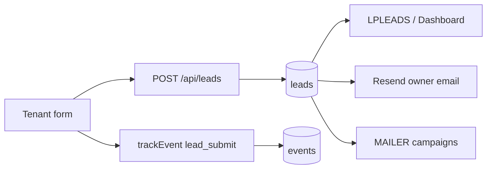
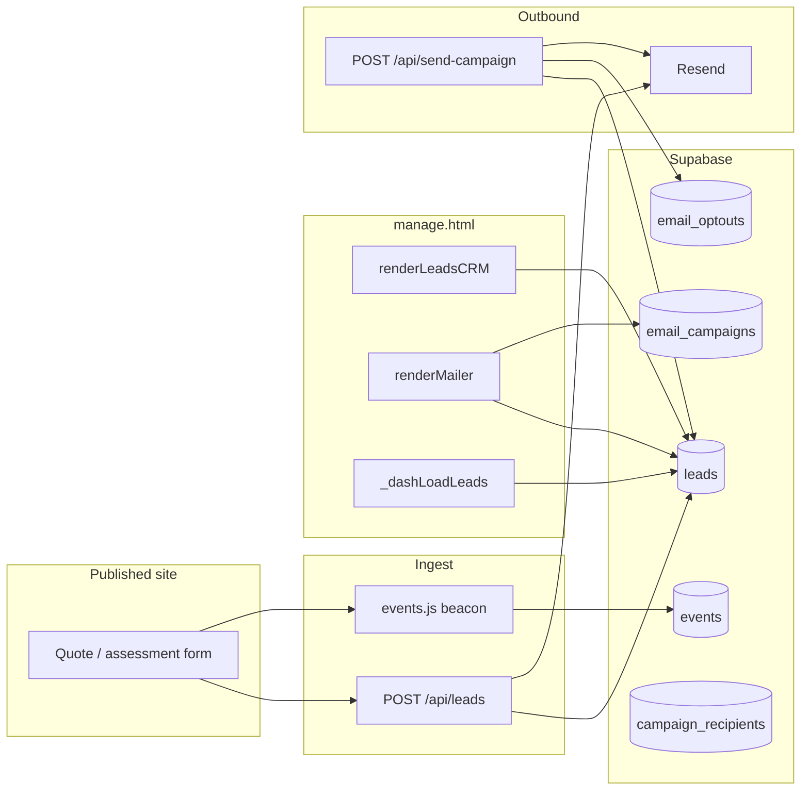
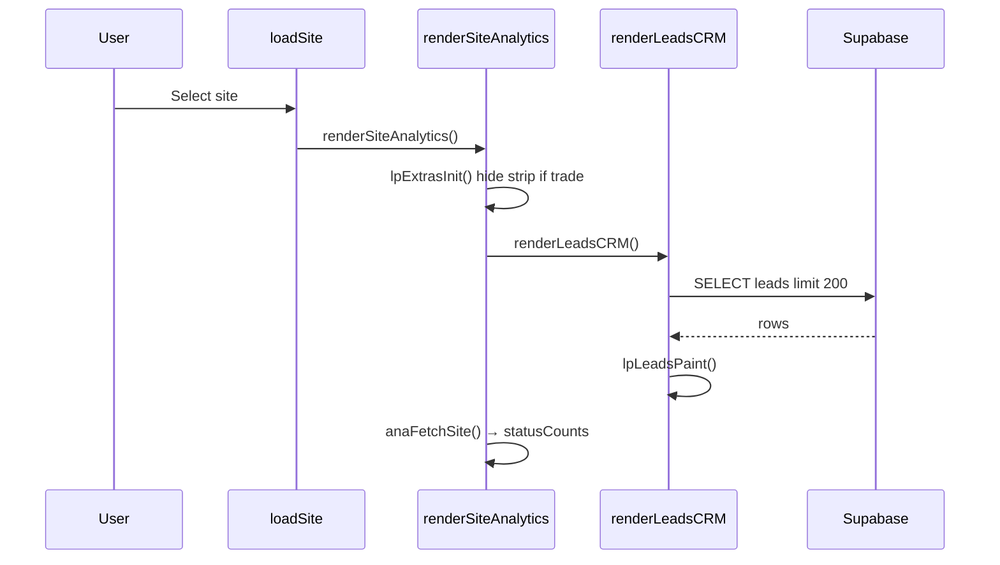
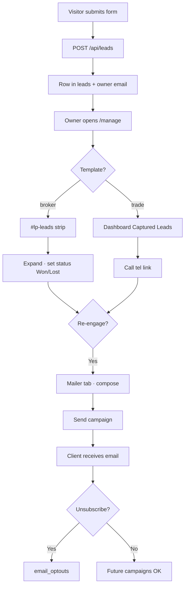
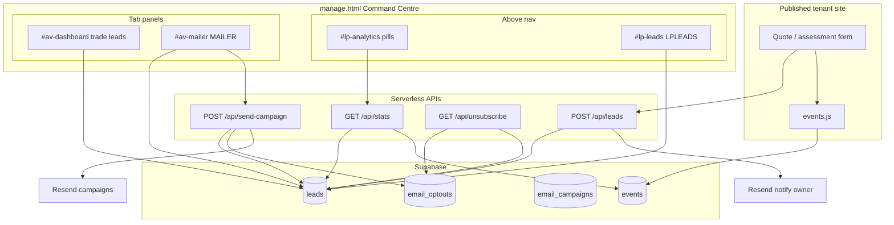
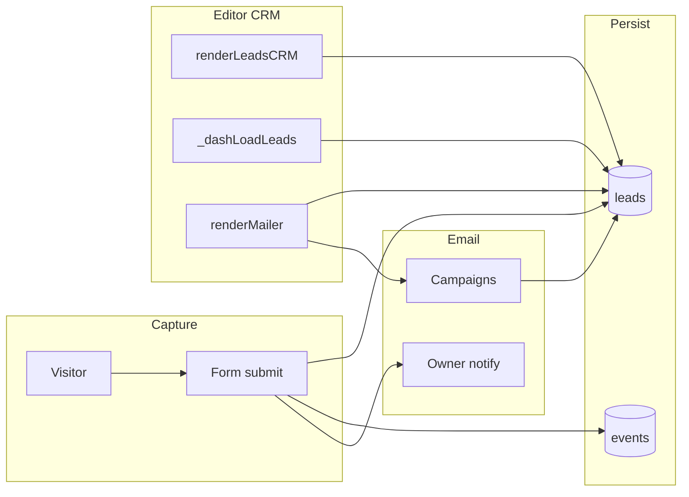
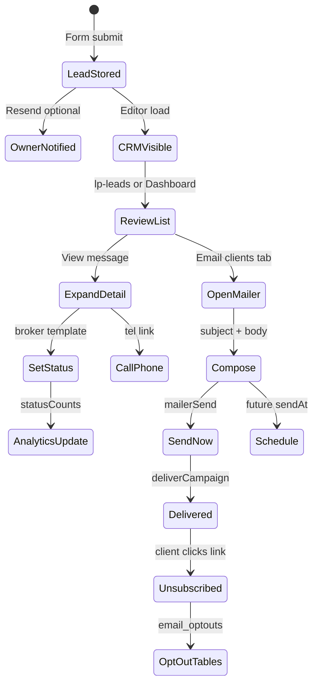

# LeadPages CRM — Complete Engineering Manual

**Document:** `features/CRM`  
**Status:** Definitive engineering reference for lead storage, CRM UI, status workflow, and client mailer  
**Audience:** Engineers rebuilding, extending, or debugging CRM and email campaigns; AI development agents  
**Prerequisites:** [00-VISION](../00-VISION.md), [01-ARCHITECTURE](../01-ARCHITECTURE.md), [02-DATABASE](../02-DATABASE.md), [07-TRACKING](../07-TRACKING.md), [09-CRM](../09-CRM.md), [10-EDITOR](../10-EDITOR.md)

> **Scope note:** This document describes the **per-site CRM** inside `manage.html` — the `#lp-leads` strip (`LPLEADS` / `renderLeadsCRM`), the trade **Dashboard** leads widget (read-only subset), and the **Email clients** tab (`MAILER` / `renderMailer`). It covers ingest via `api/leads.js` and campaigns via `api/send-campaign.js`. It is **not** `partner-dashboard.html` (partner multi-client rollup), storefront order forms on `tradies.html`, or partner recruitment (`POST /api/partner-lead` → `partner_leads`).

---

## Executive Summary

LeadPages CRM is the **post-capture layer** for tenant enquiries: visitors submit forms on published sites; `POST /api/leads` stores rows in Supabase and best-effort emails the business; authenticated editors review leads, update status (New → Contacted → Won/Lost), and optionally bulk-email clients who provided an address.

Implementation is **100% client-side UI** in `manage.html` plus **serverless APIs** for ingest and delivery. There is no separate CRM microservice or React app.

| Fact | Detail |
|------|--------|
| **State objects** | `LPLEADS` (list cache), `MAILER` (compose state) |
| **Primary DOM** | `#lp-leads` (broker templates), `#dash-leads-body` (trade), `#av-mailer` (all templates with mailer tab) |
| **Ingest** | `POST /api/leads` — always HTTP 200 to visitor |
| **List fetch** | Supabase JWT → `leads` table (limit 200 CRM / 1000 mailer) |
| **Campaigns** | `POST /api/send-campaign` → Resend + `email_campaigns` |
| **Opt-out** | `leads.email_opt_out` + `email_optouts` + `GET /api/unsubscribe` |

---

## Purpose

### Product purpose

Site owners and partners need to:

1. **Never lose an enquiry** — storage is independent of notification email success.
2. **Act on leads quickly** — name, phone, job summary, expandable detail, `tel:` / `mailto:` links.
3. **Track outcomes** — status chips feed win-rate analytics on broker sites.
4. **Re-engage by email** — one-off updates to clients who opted in, with unsubscribe compliance.

### Engineering purpose

- **Single source of truth** — `leads` table; CRM UI is a view, not a parallel store.
- **Template-aware placement** — broker sites show full CRM strip above nav; trade sites hide strip and show read-focused list on Dashboard.
- **Separation of concerns** — ingest (`api/leads.js`), read/update (Supabase RLS in editor), bulk send (`api/send-campaign.js`).

---

## Business Purpose

| Stakeholder | Value |
|-------------|-------|
| **Site owner (tradie / broker client)** | Instant email on submit; captured list; optional marketing to past enquirers |
| **Partner / broker** | Status workflow proves conversion; mailer tab for client nurture |
| **LeadPages (platform)** | Core retention — visible leads justify hosting; campaigns differentiate from static sites |
| **Super-admin** | Same CRM on any site when editing in Command Centre |

CRM supports the model: **hosted sites that capture and monetise relationships**, not just page views.

---

## User Types

| User | CRM access | Typical journey |
|------|------------|-----------------|
| **Super-admin** | Full strip + mailer on allowed templates | Opens site → reviews `#lp-leads` or Dashboard leads → marks Won → sends campaign |
| **Broker / partner** | Same as super on client sites | Manages pipeline; uses **Email clients** tab |
| **Site owner** (customer login) | Editor access per account policies | Checks new leads; calls from `tel:` link |
| **Leads-only demo** (`leads` role) | **No CRM** — rates tab only | Calculator demo |
| **Partner (portfolio)** | Read-only table on `partner-dashboard.html` | Aggregate view; full CRM via `/manage?site=` |

**Not in scope:** Visitors never see CRM; public forms only POST to `/api/leads`.

---

## Permissions

Visibility is the intersection of **role**, **template nav**, and **billing lock**:

```text
visible tabs = ALLOWED[currentRole] ∩ TEMPLATE_NAV[currentSiteTemplate]
```

From `manage.html`:

```javascript
const ALLOWED = {
  super:   [..., 'mailer', 'dashboard'],
  broker:  [..., 'mailer', 'dashboard'],
  leads:   ['rates']
};
const TEMPLATE_NAV = {
  'trade':        ['dashboard', 'details', 'landing', 'apps', 'mailer'],
  'broker-app':   [..., 'mailer'],
  'broker-leads': ['details', 'mailer']
};
```

| Layer | Mechanism |
|-------|-----------|
| **CRM strip `#lp-leads`** | Rendered for all templates; **hidden** when `currentSiteTemplate === 'trade'` |
| **Dashboard leads** | Trade only — `#dash-leads-body` inside `#av-dashboard` |
| **Mailer tab** | `#nav-mailer` → `showView('mailer')` → `renderMailer()` |
| **Supabase RLS** | Authenticated user; `leads` scoped by site membership |
| **`POST /api/leads`** | **Public** — no auth (visitor submissions) |
| **`POST /api/send-campaign`** | Bearer JWT required; server validates user |
| **Billing lock** | `lpBillingGate()` blocks entire editor including CRM and mailer |

Super-admins bypass billing lock. Opt-out toggles in mailer require editor auth.

---

## CRM Surfaces

LeadPages exposes CRM through **three UI surfaces** that share the same `leads` table:

```text
┌─────────────────────────────────────────────────────────────────┐
│  SHARED CHROME (above .adminnav)                                 │
│  #lp-domains · #lp-analytics (hidden trade) · #lp-leads (hidden trade) │
├─────────────────────────────────────────────────────────────────┤
│  TAB: Dashboard (trade)                                          │
│  Captured Leads card → #dash-leads-body (read-only, limit 20)   │
├─────────────────────────────────────────────────────────────────┤
│  TAB: Email clients (mailer)                                     │
│  #av-mailer → compose · client list · campaign history           │
└─────────────────────────────────────────────────────────────────┘
```

### Surface comparison

| Surface | DOM | Template | Status workflow | Limit | Refresh |
|---------|-----|----------|-----------------|-------|---------|
| **CRM strip** | `#lp-leads` | broker-app, broker-leads | Yes (`lpLeadRow`) | 200 | `data-ll="refresh"` |
| **Dashboard widget** | `#dash-leads-body` | trade | **No** | 20 | `#dash-leads-refresh` |
| **Mailer client list** | `#mlr-picklist` | any with mailer tab | Opt-out only | 1000 (with email) | `renderMailer()` reload |

---

## Navigation

### CRM strip placement

`lpExtrasInit()` creates `#lp-leads` immediately **below** `#lp-analytics` and **above** `.adminnav`:

```javascript
ana.parentNode.insertBefore(ld, ana.nextSibling);
ld.addEventListener('click', lpLeadsClick);
if (currentSiteTemplate === 'trade') {
  document.getElementById('lp-leads').style.display = 'none';
}
```

Data still loads via `renderLeadsCRM()` on `loadSite()` → `renderSiteAnalytics()` so `LPLEADS.rows` stays warm for Dashboard sync.

### Mailer tab

```javascript
const NAV = [..., ['mailer', 'av-mailer', renderMailer], ...];
```

Trade nav order: `dashboard` → `details` → `landing` → `apps` → **`mailer`**

Broker-app includes mailer after appearance/contact tabs; broker-leads is `details` → **`mailer`**.

### Cross-links

| From | To |
|------|-----|
| CRM row **Call** | `tel:` native dialer |
| CRM row **Email** | `mailto:` client |
| Analytics **Conversion** pill | Win rate from `ANA.statusCounts` (broker) |
| Dashboard **Captured Leads** | Expand message; no status buttons |
| Mailer **Opt out** | `mailerOptOut()` → `leads` + `email_optouts` |
| Partner dashboard **Edit in builder** | `/manage?site={slug}` → full CRM |

---

## Lead Capture Pipeline

End-to-end flow from public form to CRM list. See [09-CRM](../09-CRM.md) for field-level template detail.



### Invariants

| Rule | Implementation |
|------|----------------|
| Never lose a lead | Insert even if site unresolved (`site_id: null`); API always 200 |
| Email ≠ storage | Resend notification best-effort; `RESEND_API_KEY` optional |
| Tenant isolation | `site_id` on every resolved lead |
| Opt-out enforced | `email_opt_out` + `email_optouts` at send time |

### `api/leads.js` — site resolution

```javascript
async function resolveSite({ siteId, slug, site }) {
  // id → slug → business_name (ilike)
}
```

### Insert shape

```javascript
{
  site_id, owner_user_id,
  name, email, phone,
  kind, details, message,
  status: 'new',
  site /* legacy text */
}
```

### Owner notification

`contactEmailFor(siteRow)` priority:

1. `sections.quote.notifyMode === 'custom'` → `notifyEmail`
2. Else `config.email`
3. Else `sites.owner_email`

Sent via Resend. Failure does not block storage or visitor thank-you UI.

---

## `LPLEADS` State

In-memory cache for the CRM strip and Dashboard sync fallback.

```javascript
var LPLEADS = {
  siteId: null,    // cache key — invalidate on site change or refresh
  rows: [],        // up to 200 lead objects from Supabase
  open: null,      // expanded row id (detail + status bar)
  loading: false,
  timeline: false  // true → show activity feed instead of list
};
var LEAD_STATUS = [
  ['new', 'New'],
  ['contacted', 'Contacted'],
  ['won', 'Won'],
  ['lost', 'Lost']
];
```

Cache invalidation:

- `LPLEADS.siteId !== currentSiteId` → refetch
- Refresh button sets `LPLEADS.siteId = null` → `renderLeadsCRM()`

---

## `renderLeadsCRM()`

Entry point called from `renderSiteAnalytics()` on every site load.

| Step | Behaviour |
|------|-----------|
| 1 | Ensure `#lp-leads` exists (`lpExtrasInit`) |
| 2 | Hide legacy `.leads-card` demo card |
| 3 | If no `currentSiteId`, clear strip |
| 4 | If cache miss, query Supabase |
| 5 | `lpLeadsPaint()` rebuilds HTML |

Query:

```javascript
sb.from('leads')
  .select('id,name,email,phone,kind,details,message,status,created_at')
  .eq('site_id', currentSiteId)
  .order('created_at', { ascending: false })
  .limit(200);
```

### Shell and list

`lpLeadsShell(inner)` wraps content in `.ll-card` with header **Captured leads** and actions **Refresh** / **Activity**.

`lpLeadsPaint()` chooses:

- `lpTimelineHTML()` when `LPLEADS.timeline === true`
- Empty state copy when no rows
- `rows.map(lpLeadRow)` otherwise

---

## Lead Row UI (`lpLeadRow`)

Each row shows:

- **Header:** name, contact (`phone · email`), status chip, relative time (`lpAgo`), **View message** toggle
- **Summary line:** `message` or `job · suburb` or `kind`
- **Expanded:** detail table from `details` JSONB, Call/Email actions, status button group

Status buttons use `data-ll="status"` with optimistic UI update; on Supabase error, reverts row and `ANA.statusCounts`.

### Status lifecycle

```text
new → contacted → won / lost
(any) → opted_out (via unsubscribe link or mailer toggle — stored as email_opt_out, not status)
```

**Conversion metric (broker analytics):** `won ÷ (won + lost)` — rendered in `#lp-analytics` Conversion pill via `ANA.statusCounts` from `/api/stats`.

---

## CRM Actions

| Action | Attribute | Handler |
|--------|-----------|---------|
| Refresh list | `data-ll="refresh"` | `LPLEADS.siteId = null`; `renderLeadsCRM()` |
| Toggle activity | `data-ll="timeline"` | Flip `LPLEADS.timeline`; `lpLeadsPaint()` |
| Expand row | `data-ll="view"` | Toggle `LPLEADS.open` |
| Set status | `data-ll="status"` | Supabase `update({ status })`; sync `ANA.statusCounts` |
| Call | `href="tel:…"` | Native dialer |
| Email | `href="mailto:…"` | Mail client |

Click delegation: `#lp-leads` → `lpLeadsClick`.

---

## Activity Timeline (`lpTimelineHTML`)

When **Activity** is toggled on the CRM strip, the list is replaced by a feed built from **`ANA.data`** (already loaded for analytics):

| Event | Label | Icon |
|-------|-------|------|
| `page_view` | Visited the page | 👁 |
| `call_click` | Clicked to call | 📞 |
| `lead_submit` | Submitted the quote form | ✉ |

Shows newest 30 events in the analytics period. Empty state if no events.

Trade Dashboard does **not** expose this toggle; owners use the activity chart instead. See [features/Dashboard](Dashboard.md).

---

## Trade Dashboard Leads (subset)

For `trade` template, `#lp-leads` is hidden but `renderLeadsCRM()` still populates `LPLEADS`. The Dashboard uses a **separate** query in `_dashLoadLeads()`:

- Direct `select('*')` limit **20**
- Inline HTML (not `lpLeadRow`)
- **NEW** badge if created &lt; 72 hours
- **View message** expands detail; **no status workflow**

`_dashSyncLeads()` wraps `lpLeadsPaint` — if Dashboard panel exists, copies strip HTML or falls back to `LPLEADS.rows` + `lpLeadRow`. Primary path remains `_dashLoadLeads`.

---

## Mailer (`MAILER`)

Client-facing bulk email for **past enquirers with an email address**. Tab label: **Email clients** (`#nav-mailer`).

### State object

```javascript
var MAILER = {
  mode: 'all',           // all | selected | individual
  selected: {},          // checkbox map by lead id
  schedule: false,
  imageUrl: '', imgPid: '',
  subject: '', body: '',
  date: '', time: '',
  clients: [],           // leads with non-null email
  campaigns: [],         // from GET /api/send-campaign
  tz: 'Australia/Sydney' // browser default or picker
};
```

### `renderMailer()`

1. Require `currentSiteId`
2. Load clients: `leads` where `email IS NOT NULL`, limit 1000
3. Load campaigns: `GET /api/send-campaign?siteId=…`
4. `mailerBuild(box)` — compose UI + history

### Compose UI (`mailerBuild`)

| Section | Controls |
|---------|----------|
| **Recipients** | Segmented: All clients / Selected / One person; checkbox list with opt-out badges |
| **Message** | Subject, body textarea, optional image upload (`cwUpload`, folder `mailer`) |
| **Schedule** | Send now vs Schedule (date, 15-min time slots, timezone) |
| **Send** | `#mlr-send` → `mailerSend()` |
| **History** | Recent campaigns — status badge, sent counts, **Send now** (scheduled), **Use again** |

Contactable count: clients where `!email_opt_out`.

### `mailerSend()` payload

```javascript
{
  siteId: currentSiteId,
  subject, bodyHtml: mailerBodyHtml(bodyTxt),
  imageUrl, recipientMode, recipients,
  sendAt,   // ISO UTC from mailerWallToUTC(local, tz)
  timezone
}
```

Validation:

- Subject or body required
- Selected/individual modes require at least one non-opted-out recipient
- Schedule requires date + time

On success: toast, clear compose fields, `renderMailer()` refresh.

### `mailerOptOut(id, email, optOut)`

Dual write:

1. `leads.update({ email_opt_out: optOut })`
2. If opting out: `email_optouts.upsert({ site_id, email })`
3. If allowing again: delete from `email_optouts`

Rebuilds mailer UI immediately.

### Campaign delivery (`api/send-campaign.js`)

**Pipeline (`deliverCampaign`):**

1. Resolve emails — `all` mode from leads; `selected`/`individual` from stored `recipient_list`
2. De-dupe lowercase addresses
3. Skip `leads.email_opt_out` and `email_optouts` table entries
4. Send via Resend with `List-Unsubscribe` headers
5. Insert `campaign_recipients` per address
6. Update `email_campaigns` counts and `status: 'sent'`

**Scheduling:** future `sendAt` → `email_campaigns.status = 'scheduled'` → `api/cron/send-due.js` (also backstop on GET campaigns list).

**Send now on scheduled row:** `POST { action: 'deliver', campaignId }` → `mailerRunNow()`.

### Unsubscribe (`api/unsubscribe.js`)

Public link in every campaign footer:

```text
/api/unsubscribe?s=<siteId>&e=<email>
```

Upserts `email_optouts` and sets `leads.email_opt_out = true`. Supports GET (HTML confirmation) and POST (one-click RFC 8058).

---

## Data Sources



| Source | Table / endpoint | CRM usage |
|--------|------------------|-----------|
| Lead ingest | `POST /api/leads` | Creates rows `status: 'new'` |
| CRM list | `leads` SELECT | `LPLEADS.rows`, `_dashLoadLeads` |
| Mailer clients | `leads` SELECT | `email IS NOT NULL` |
| Analytics overlap | `GET /api/stats` | `leadsCount`, `statusCounts`, timeline events |
| Campaigns | `email_campaigns` | History panel |
| Opt-outs | `email_optouts` | Send-time filter + mailer toggle |

---

## API Calls

| Endpoint | Method | Called by | Auth | Purpose |
|----------|--------|-----------|------|---------|
| `/api/leads` | POST | Public templates | None | Ingest enquiry |
| Supabase `leads` | SELECT | `renderLeadsCRM`, `renderMailer`, `_dashLoadLeads` | JWT | List / clients |
| Supabase `leads` | UPDATE | `lpLeadsClick`, `mailerOptOut` | JWT | Status / opt-out flag |
| `/api/send-campaign` | GET | `renderMailer` | Bearer | Campaign history + due backstop |
| `/api/send-campaign` | POST | `mailerSend`, `mailerRunNow` | Bearer | Create / deliver campaign |
| `/api/stats` | GET | `anaFetchSite` | Bearer | `statusCounts` for analytics pills |
| `/api/unsubscribe` | GET/POST | Campaign email link | None | Public opt-out |

### `mailerSend` response handling

| Result | UI |
|--------|-----|
| `j.scheduled` | Toast "Scheduled ✓"; show `sendAt` |
| Immediate send | Toast "Sent to N ✓"; show sent/failed/skipped |
| Error | `#mlr-status` red message with HTTP code |

---

## Database Tables

| Table | CRM role |
|-------|----------|
| **`leads`** | Primary store — PII, `details` JSONB, `status`, `email_opt_out`, `kind` |
| **`events`** | Analytics timeline (`lpTimelineHTML`); independent `lead_submit` counts |
| **`email_campaigns`** | Campaign metadata, schedule, sent/failed counts |
| **`campaign_recipients`** | Per-email delivery outcome |
| **`email_optouts`** | PK `(site_id, email)` — hard block at send |
| **`sites`** | Resolution target for ingest; `config` for notify email |

### `leads` columns (CRM-relevant)

| Column | Purpose |
|--------|---------|
| `id` | UUID PK |
| `site_id` | FK → `sites.id` |
| `owner_user_id` | FK → owner |
| `name`, `email`, `phone` | PII |
| `kind` | `trade`, `broker`, `order`, … |
| `details` | JSONB — job, suburb, broker fields, etc. |
| `message` | One-line summary for list views |
| `status` | `new` → `contacted` → `won` / `lost` |
| `email_opt_out` | Boolean — mailer + send filter |
| `created_at` | Sorting, NEW badge, analytics windows |

**Writers:** `api/leads.js`, `manage.html` (status, opt-out), `api/unsubscribe.js`  
**Readers:** `manage.html`, `partner-dashboard.html`, `api/stats.js`, `api/send-campaign.js`

---

## Related Files

| File | Relationship |
|------|--------------|
| **`manage.html`** | **Primary implementation** — `LPLEADS`, `MAILER`, all CRM UI |
| `api/leads.js` | Public ingest + owner notification email |
| `api/send-campaign.js` | Campaign create, deliver, list |
| `api/cron/send-due.js` | Scheduled campaign runner |
| `api/unsubscribe.js` | Public opt-out handler |
| `api/stats.js` | `statusCounts`, `leadsCount` for analytics |
| `events.js` | Public beacon → `events` table |
| `trade.template.json` | Quote form → `/api/leads` |
| `broker.template.json` | Assessment form → `/api/leads` |
| `partner-dashboard.html` | Read-only cross-site lead table |
| `api/manage.html` | Legacy duplicate — trade strip **not** hidden; do not treat as source of truth |
| `docs/09-CRM.md` | Canon overview (ingest, tables, sequences) |
| `docs/features/Dashboard.md` | Trade Captured Leads widget |
| `docs/07-TRACKING.md` | Event names, analytics overlap |

---

## Functions

### CRM core

| Function | Lines (approx.) | Role |
|----------|-----------------|------|
| `lpExtrasInit()` | ~3342–3356 | Create `#lp-leads`, hide for trade |
| `renderLeadsCRM()` | ~3425–3444 | Fetch + cache leads |
| `lpLeadsShell(inner)` | ~3446–3452 | Card chrome |
| `lpLeadsPaint()` | ~3454–3466 | Render list or timeline |
| `lpStatusChip(s)` | ~3468–3471 | Status badge HTML |
| `lpLeadRow(l)` | ~3473–3506 | Single lead row + expand |
| `lpTimelineHTML()` | ~3508–3523 | Activity feed from `ANA.data` |
| `lpLeadsClick(e)` | ~3525–3545 | Delegated actions |
| `lpAgo(ts)` | ~3331–3338 | Relative timestamps |

### Dashboard overlap

| Function | Role |
|----------|------|
| `_dashLoadLeads(siteId)` | Trade widget — separate query, no status |
| `_dashSyncLeads()` | Copy from `#lp-leads` or `LPLEADS.rows` |

### Mailer

| Function | Role |
|----------|------|
| `renderMailer()` | Load clients + campaigns |
| `mailerBuild(box)` | Compose + history HTML |
| `mailerWire(box)` | Event bindings |
| `mailerCapture()` | Sync DOM → `MAILER` state |
| `mailerSend()` | Validate + POST campaign |
| `mailerOptOut()` | Opt-out dual write |
| `mailerBodyHtml(t)` | Plain text → HTML paragraphs |
| `mailerWallToUTC(local, tz)` | Schedule timezone conversion |
| `mailerUseAgain(id)` | Clone past campaign into compose |
| `mailerRunNow(id)` | Deliver scheduled campaign immediately |

### Shared dependencies

| Function | Role for CRM |
|----------|--------------|
| `renderSiteAnalytics()` | Orchestrates `renderLeadsCRM()` + `anaFetchSite()` |
| `loadSite()` | Site switch → analytics → CRM reload |
| `applyRoleGating()` | Mailer tab visibility |
| `anaRender()` | Conversion pill from `statusCounts` |
| `esc()` | XSS escape in row HTML |

---

## Event Flow

### Site load → CRM populate



### Status update

1. User clicks status button on expanded lead.
2. Optimistic update `row.status` + `lpLeadsPaint()`.
3. Adjust `ANA.statusCounts` and `anaRender()` if analytics visible.
4. `sb.from('leads').update({ status })`.
5. On error: revert row, revert counts, toast.

### Campaign send

1. User opens **Email clients** tab → `renderMailer()`.
2. Compose message, pick recipients, click **Send**.
3. `mailerSend()` → `POST /api/send-campaign`.
4. Server creates `email_campaigns` row; immediate or scheduled deliver.
5. `deliverCampaign` loops recipients, respects opt-outs, sends via Resend.
6. UI toast + history refresh.

---

## User Journey



**Partner journey:** `partner-dashboard.html` sees aggregate leads → **Edit in builder** → full status + mailer on client site.

---

## Performance Considerations

| Area | Behaviour | Risk |
|------|-----------|------|
| **CRM cache** | Refetch only on site change or manual refresh | Stale if another editor updates status |
| **Duplicate fetches** | `renderLeadsCRM` + `_dashLoadLeads` on trade | Extra round-trip on Dashboard open |
| **Mailer client load** | Up to 1000 rows on every tab open | Large sites — acceptable today |
| **Timeline** | Re-sorts up to full `ANA.data` client-side | Fine for ≤10k events |
| **Campaign send** | Sequential Resend calls in `deliverCampaign` | Slow for large lists; no batch API |
| **Optimistic status** | Instant UI; revert on error | Brief inconsistency if network fails |

**Recommendations (future):** Share single leads cache between strip and Dashboard; paginate mailer list; background campaign queue.

---

## Security Considerations

| Topic | Detail |
|-------|--------|
| **Public ingest** | `/api/leads` unauthenticated — rate limiting not implemented; spam possible |
| **PII in editor** | Leads visible only to authenticated site editors via RLS |
| **XSS** | `esc()` on names, messages, details in CRM rows |
| **Campaign auth** | JWT verified in `requireUser()` before send |
| **Opt-out compliance** | `List-Unsubscribe` header + one-click POST; dual table check at send |
| **Service role** | `send-campaign` uses service role after auth — campaigns not anonymous |
| **Unsubscribe link** | Site-scoped — cannot opt out other tenants |
| **Billing lock** | Prevents viewing leads when account suspended |

Ingest always returns 200 — intentional to protect visitor UX; monitor `store_error` server-side.

---

## Technical Debt

| ID | Issue | Location | Impact |
|----|-------|----------|--------|
| TD-C1 | **Trade has no status workflow** | `_dashLoadLeads` | Won/Lost only on broker strip (hidden for trade) |
| TD-C2 | **Duplicate leads queries** | `renderLeadsCRM` vs `_dashLoadLeads` | Wasted bandwidth on trade Dashboard |
| TD-C3 | **Dashboard stat under-count** | `_dashLoadLeads` sets count to `rows.length` (max 20) | Misleading KPI |
| TD-C4 | **`api/manage.html` drift** | No trade strip hide | Wrong behaviour if legacy file deployed |
| TD-C5 | **No realtime subscription** | Polling/manual refresh only | New leads invisible until refresh |
| TD-C6 | **Sequential campaign send** | `deliverCampaign` loop | Timeouts on large lists |
| TD-C7 | **Analytics vs CRM lead count** | `lead_submit` events vs `leads` rows | Can diverge if ingest fails silently |
| TD-C8 | **Partner dashboard no status edit** | Read-only table | Must open manage for workflow |
| TD-C9 | **`opted_out` not a status** | Unsubscribe uses boolean only | Status chips still show pre-opt-out state |

Tracked related items in [13-ROADMAP](../13-ROADMAP.md) and [features/Dashboard](Dashboard.md) (TD-D4, TD-D5).

---

## Future Improvements

1. **Status chips on trade Dashboard** — port `lpStatusChip` / status bar into `_dashLoadLeads`.
2. **Unified leads cache** — single fetch shared by `LPLEADS` and Dashboard.
3. **Realtime leads** — Supabase channel on `leads` insert for live NEW badge.
4. **CRM pagination** — beyond 200 strip / 20 dashboard limits.
5. **Campaign queue** — async worker for large sends; progress UI.
6. **Spam controls** — honeypot, rate limit, captcha on `/api/leads`.
7. **Merge duplicate leads** — same phone/email on one site.
8. **Export CSV** — partner reporting from CRM strip.
9. **Align `api/manage.html`** or remove legacy copy.
10. **In-app notifications** — bell for leads since last visit.

---

## CRM Architecture



---

## Connections to Other Systems

### Dashboard

Trade sites hide `#lp-leads` and show **Captured Leads** on the Dashboard tab. Read-only list (20 rows), no status buttons. See [features/Dashboard](Dashboard.md).

| Aspect | CRM strip | Trade Dashboard |
|--------|-----------|-----------------|
| DOM | `#lp-leads` | `#dash-leads-body` |
| Status workflow | Full | None |
| Activity toggle | Yes | No (chart instead) |
| Data path | `LPLEADS` cache | Direct Supabase query |

### Analytics

- **Forms count:** `max(lead_submit events, leadsCount)` in analytics pills.
- **Conversion (broker):** win rate from `statusCounts`, not form conversion.
- **Timeline:** CRM Activity tab consumes same `ANA.data` as analytics detail views.

See [07-TRACKING](../07-TRACKING.md).

### Forms / lead capture

Public forms POST to `/api/leads` and beacon `lead_submit`. Editor **Quote form** section configures notify email (`notifyMode`, `notifyEmail`). See [09-CRM](../09-CRM.md) and `docs/features/Forms` (when present).

### Partners

| Touchpoint | Connection |
|------------|------------|
| **`partner-dashboard.html`** | Cross-site lead table; links to `/manage?site=` |
| **Client mailer** | Partner uses **Email clients** on behalf of client |
| **Owner notification** | Uses site `config` contact paths set in editor |

See [05-PARTNERS](../05-PARTNERS.md).

### Billing

`lpBillingGate()` in `renderSiteAnalytics()` blocks CRM and mailer when account locked. Super-admin bypass.

### Editor / publish

CRM does not require publish — leads accumulate from **live** published site forms. Editor preview forms may create test leads if pointed at production API.

---

## Data Flow



---

## User Flow



---

## Glossary

| Term | Meaning |
|------|---------|
| **LPLEADS** | In-memory CRM cache object in `manage.html` |
| **MAILER** | In-memory compose state for Email clients tab |
| **Captured leads** | Enquiries stored in `leads` from tenant forms |
| **CRM strip** | `#lp-leads` panel below analytics pills |
| **Win rate** | `won / (won + lost)` — broker Conversion analytics |
| **Opt-out** | `email_opt_out` + `email_optouts` — blocks campaign delivery |
| **Kind** | Lead type: `trade`, `broker`, `order`, etc. |

---

*Last updated: July 2026 — reflects `manage.html` CRM and mailer implementation on branch `main`.*
