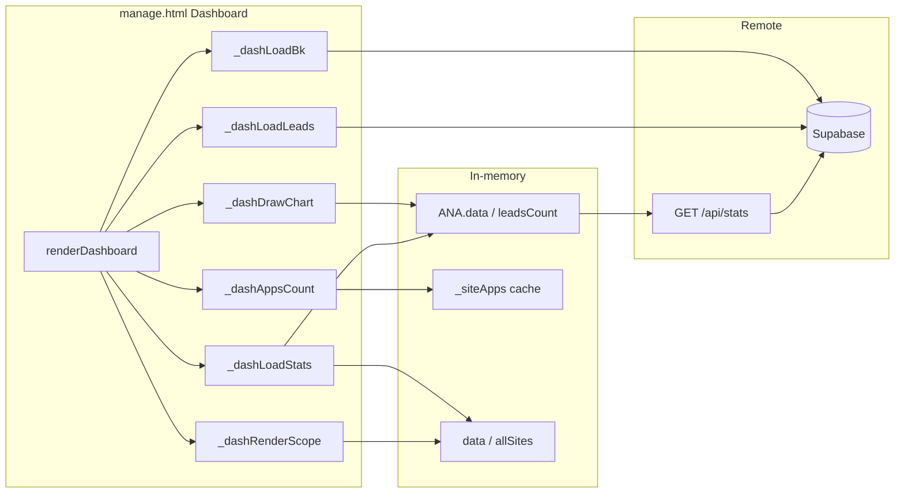
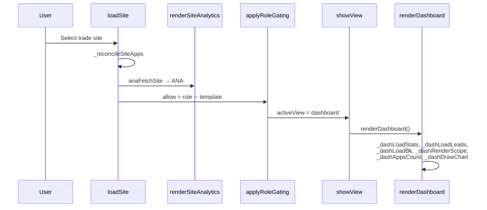
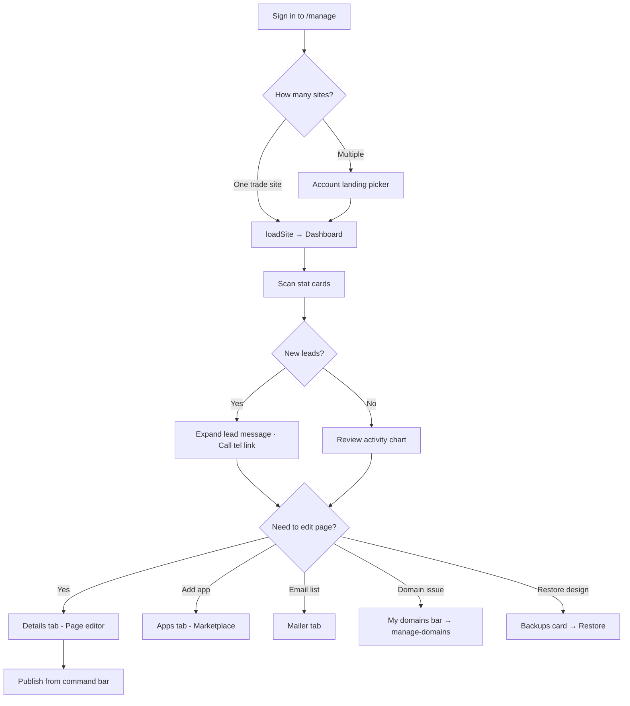
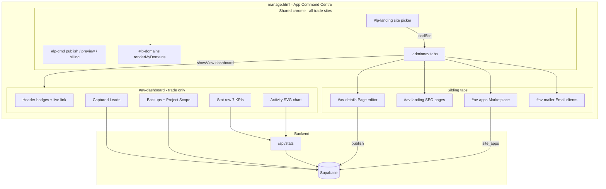
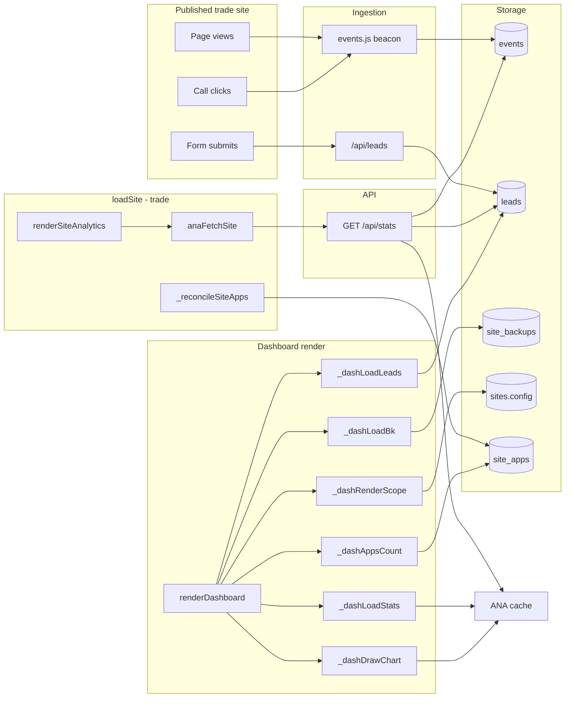
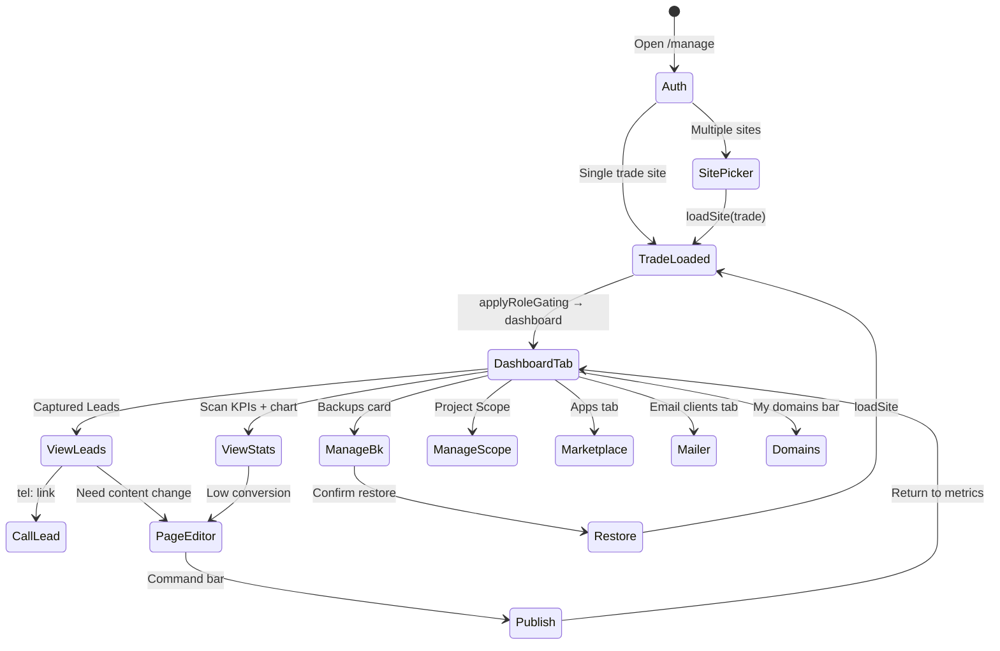

# LeadPages Dashboard — Complete Engineering Manual

**Document:** `features/Dashboard`  
**Status:** Definitive engineering reference for the per-site Dashboard in the editor  
**Audience:** Engineers rebuilding, extending, or debugging the Dashboard; AI development agents  
**Prerequisites:** [00-VISION](../00-VISION.md), [01-ARCHITECTURE](../01-ARCHITECTURE.md), [10-EDITOR](../10-EDITOR.md), [07-TRACKING](../07-TRACKING.md), [09-CRM](../09-CRM.md)

> **Scope note:** This document describes the **trade-site Dashboard tab** inside `manage.html` (`#av-dashboard`). It is **not** `partner-dashboard.html` (partner multi-client overview), `manage-domains.html` (Dreamscape super-admin), or marketing mockups on `tradies.html` / `brokers.html`.

---

## Executive Summary

The Dashboard is the **default home tab** for **trade-template** sites in the App Command Centre (`manage.html`). It gives tradie and service-business owners a single at-a-glance view of site health: traffic and conversion stats, recent enquiries, design backups, and project scope tasks — without exposing broker calculator UI or the legacy analytics pill strip.

Implementation is **100% client-side** in `manage.html`: one render function (`renderDashboard`) builds inline HTML, wires event listeners, and loads data from the shared `ANA` analytics cache, direct Supabase queries, and cached `site_apps` rows. There is no separate Dashboard API or React component.

| Fact | Detail |
|------|--------|
| **DOM** | `#av-dashboard` (hidden panel), `#nav-dashboard` (tab button) |
| **Template gate** | `TEMPLATE_NAV.trade` — first tab in nav order |
| **Role gate** | `super` and `broker` only (`leads` role has no dashboard) |
| **Entry** | `showView('dashboard')` → `renderDashboard()` |
| **Data** | `/api/stats`, `leads`, `site_backups`, `sites.config.scope`, `_siteApps` |
| **Replaces (trade)** | `#lp-analytics` pills, `#lp-leads` strip, floating backup/scope FABs |

---

## Purpose

### Product purpose

Tradespeople are the primary audience for the `trade` template. They need to answer three questions quickly:

1. **Is my site working?** — visitors, calls, form submissions, conversion rate.
2. **Who enquired?** — name, phone, job summary, message detail.
3. **Can I recover or track progress?** — config backups and partner-defined project scope.

The Dashboard consolidates answers that were previously scattered across analytics pills, a CRM strip above the nav, and floating action buttons — reducing cognitive load for non-technical users.

### Engineering purpose

- **Single render surface** for trade-specific operational widgets.
- **Reuse** existing subsystems (`ANA`, `lpBk*`, `lpScope*`, `renderMyDomains`) instead of duplicating APIs.
- **Template-specific UX** via `TEMPLATE_NAV` + `applyRoleGating()` without forking `manage.html`.

---

## Business Purpose

| Stakeholder | Value |
|-------------|-------|
| **Site owner (tradie)** | Proof of ROI; immediate access to new leads; confidence the site is live |
| **Partner / broker** | Client can self-serve metrics; fewer “how many visitors?” support tickets |
| **LeadPages (platform)** | Retention — visible activity drives continued hosting; upsell path to Apps tab |
| **Super-admin** | Same dashboard for any trade site when impersonating / editing |

The Dashboard supports the business model: **hosted sites that capture leads**. Conversion benchmarking (Excellent / Good / Average / Below avg) nudges owners toward optimisation without requiring analytics expertise.

---

## User Types

| User | Sees Dashboard? | Typical journey |
|------|-----------------|-----------------|
| **Super-admin** (`profiles.is_super_admin`) | Yes, on trade sites | Picks site from landing → lands on Dashboard → drills into Details or Apps |
| **Broker / partner** (`broker` role) | Yes, on trade sites | Manages client sites; may use Mailer tab from same nav |
| **Site owner** (customer login) | Yes, if site is `trade` and they have editor access | Single-site users skip landing picker → Dashboard |
| **Leads-only demo** (`leads` role) | **No** — only `rates` tab | Calculator demo; no trade dashboard |
| **Broker-app / broker-leads sites** | **No** — tab hidden by `TEMPLATE_NAV` | Use `#lp-analytics` strip instead |

**Not in scope:** Partners using `partner-dashboard.html` see a **different** multi-client grid (sites, templates, aggregate leads) — not this tab.

---

## Permissions

Visibility is the intersection of **role** and **template**:

```text
visible tabs = ALLOWED[currentRole] ∩ TEMPLATE_NAV[currentSiteTemplate]
```

From `manage.html`:

```javascript
const ALLOWED = {
  super:   [..., 'dashboard'],
  broker:  [..., 'dashboard'],
  leads:   ['rates']
};
const TEMPLATE_NAV = {
  'trade':       ['dashboard','details','landing','apps','mailer'],
  'broker-app':  [...],  // no dashboard
  'broker-leads':[...]   // no dashboard
};
```

| Layer | Mechanism |
|-------|-----------|
| **Nav button** | `#nav-dashboard` `display:none` until `applyRoleGating()` shows it |
| **Panel** | `#av-dashboard` `hidden` until `showView('dashboard')` |
| **Supabase RLS** | User must be authenticated; site rows scoped by account policies |
| **`/api/stats`** | Requires `Authorization: Bearer <supabase access token>`; service role reads `events` / `leads` server-side |
| **Billing lock** | `lpBillingGate()` can overlay full-screen lock — blocks all editor UI including Dashboard |

Super-admins bypass billing lock. Site owners see `#lp-support-card` (partner contact) but not admin tools.

---

## Dashboard Layout

The panel is built entirely in `renderDashboard()` as inline-styled HTML (no separate CSS file). Vertical structure:

```text
┌─────────────────────────────────────────────────────────────┐
│  HEADER: business name · Active badge · domain badge        │
│          slug · custom domain · [View live ↗]               │
├─────────────────────────────────────────────────────────────┤
│  STAT ROW (7 cards, responsive grid)                        │
│  Visitors | Leads | Calls | Forms | Conversion | Apps | Updated │
├─────────────────────────────────────────────────────────────┤
│  ACTIVITY CHART                                             │
│  type: Bar / Line / Area · Per-day toggle · 7d/30d/All    │
├─────────────────────────────────────────────────────────────┤
│  CAPTURED LEADS (full width)                                │
│  #dash-leads-body · Refresh                                 │
├──────────────────────────┬──────────────────────────────────┤
│  BACKUPS                 │  PROJECT SCOPE                    │
│  Save / Import / list    │  Add task · checkboxes · delete   │
└──────────────────────────┴──────────────────────────────────┘
```

**Above the tab nav** (shared chrome, not inside `#av-dashboard`):

- `#lp-domains` — domain chips (`renderMyDomains`)
- `#lp-analytics` — **hidden** for trade (`display:none`)
- `#lp-leads` — **hidden** for trade (`display:none`)

**Floating controls hidden for trade:**

- `#lp-bk-btn` (backups FAB) — backups live in Dashboard card
- `#lp-scope-btn` (scope FAB) — scope lives in Dashboard card; `lpScopeOpen()` scrolls to `#dash-scope`

---

## Navigation

### Tab integration

```javascript
const NAV = [
  ['dashboard','av-dashboard',renderDashboard],
  ['details','av-details',renderDetails],
  // ...
];
```

- Click `#nav-dashboard` → `showView('dashboard')` → `renderDashboard()`.
- Trade sites default to **Dashboard** on load: `activeView` resets from `rates` to `tnav[0]` (`dashboard`) in `applyRoleGating()`.

### Trade nav order

`dashboard` → `details` (labelled “Page editor”) → `landing` → `apps` → `mailer`

### Cross-links from Dashboard

| UI element | Destination |
|------------|-------------|
| View live ↗ | `https://{custom_domain}` (header) |
| Domain badges | Informational; full domain UI in `#lp-domains` |
| Restore backup | `lpBkApplyConfig` → `loadSite()` → may switch context |
| Scope “Scope” command-bar button | `lpScopeOpen()` → `showView('dashboard')` + scroll to `#dash-scope` |
| `#lp-domains` → Manage DNS | `/manage-domains.html` (new tab) |

---

## Widgets

| Widget | Container ID | Loader | Description |
|--------|--------------|--------|-------------|
| **Header** | (inline in panel) | `renderDashboard` | Business name, Active badge, domain connected state, slug, live link |
| **Stat cards** | `#dash-stat-row` | `_dashLoadStats` | Seven KPI tiles |
| **Activity chart** | `#dash-chart` | `_dashDrawChart` | SVG chart from `ANA.data` |
| **Captured leads** | `#dash-leads-body` | `_dashLoadLeads` | Last 20 leads, expandable messages |
| **Backups** | `#dash-bk-list` | `_dashLoadBk` | Up to 8 recent backups, restore |
| **Project scope** | `#dash-scope-body` | `_dashRenderScope` | Checkbox task list from `config.scope` |
| **Apps count** | `#dash-s-apps` | `_dashAppsCount` | Enabled rows in `_siteApps` cache |

---

## Statistics

### Stat cards

| Card | Element ID | Source | Calculation |
|------|------------|--------|-------------|
| **Visitors** | `#dash-s-vis` | `ANA.data` | `anaCounts().page_view` |
| **Leads** | `#dash-s-leads` | `ANA` + leads query | `max(lead_submit, ANA.leadsCount)`; overwritten by `_dashLoadLeads` row count |
| **Calls** | `#dash-s-calls` | `ANA.data` | `anaCounts().phone_click` ⚠️ **bug** — should be `call_click` |
| **Forms** | `#dash-s-forms` | `ANA.data` | `anaCounts().lead_submit` |
| **Conversion** | `#dash-s-conv` | derived | `round(leads / max(visitors,1) * 100)%` |
| **Apps on** | `#dash-s-apps` | `_siteApps` | count where `enabled === true` |
| **Updated** | `#dash-s-updated` | `allSites[].updated_at` | Locale date `en-AU` |

### Conversion benchmark badge

`#dash-s-conv-bench` shows qualitative label:

| Rate | Label | Colors |
|------|-------|--------|
| ≥ 10% | Excellent | green |
| ≥ 5% | Good | blue |
| ≥ 2% | Average | amber |
| < 2% | Below avg | red |

**Note:** Broker analytics strip uses **win rate** (`won / (won+lost)`) for Conversion detail; the Dashboard uses **lead_submit / page_view** — different definitions by design.

### Chart controls

| Control | `localStorage` key | Default |
|---------|-------------------|---------|
| Chart type (bar/line/area) | `lp_chart_type` | `bar` |
| Period (7d/30d/All) | `lp_chart_period` | `30d` |
| Per-day labels on bars | `lp_chart_perday` | `0` |

Period mapping in `_dashDrawChart`: 7d → 7 days, 30d → 30 days, All → 90 days.

Chart series bucket `page_view`, `lead_submit`, `call_click` (and legacy `phone_click`) per day from `ANA.data`.

---

## Quick Actions

| Action | Trigger | Handler |
|--------|---------|---------|
| **Refresh leads** | `#dash-leads-refresh` | `_dashLoadLeads(siteId)` |
| **Save backup** | `#dash-bk-save` | `lpBkSave()` |
| **Import backup** | `#dash-bk-import` → file | `lpBkImport()` → `_dashLoadBk` after 2s |
| **Restore backup** | `[data-bk-restore]` | `lpBkListClick` → `lpBkApplyConfig` |
| **Add scope task** | `#dash-scope-add` | prompt → `lpScopeApply` (intended) / `_dashRenderScope` |
| **Toggle scope task** | checkbox `[data-dsc]` | `lpScopeApply` |
| **Delete scope task** | `[data-dsd]` | splice + `lpScopeApply` |
| **View lead message** | `[data-dash-lead]` | expand `#dash-lead-detail-{id}` |
| **Call lead** | `tel:` link in lead row | native dialer |
| **Change chart period** | `.dash-period` | `_dashLoadStats` + `_dashDrawChart` |

Command bar (outside Dashboard) still exposes **Publish**, **Preview**, **Settings**, **Billing** via `#lp-cmd` / `ensureSiteBar()`.

---

## Recent Activity

“Recent activity” is represented in two ways:

### 1. Activity chart (`#dash-chart`)

Time-series of visitors, leads (form submits), and calls per day for the selected period. Empty state: dashed box — “No activity data yet…”

### 2. Captured leads list (`#dash-leads-body`)

Last **20** leads ordered by `created_at` desc. Each row shows:

- Name, suburb/postcode, **NEW** badge if &lt; 3 days old
- Job / message summary
- Phone (`tel:` link), timestamp
- **View message** → expands detail + email

### 3. Legacy sync hook (`_dashSyncLeads`)

`lpLeadsPaint` is wrapped to call `_dashSyncLeads()` when `#dash-leads-body` exists — copies `#lp-leads` HTML or `LPLEADS.rows` as fallback. Primary path is direct Supabase query in `_dashLoadLeads`.

### Broker comparison: Activity timeline

Non-trade sites can toggle **Activity** on `#lp-leads` (`lpTimelineHTML`) — event feed from `ANA.data`. Trade Dashboard does **not** expose this toggle; owners rely on the chart + leads list.

---

## Site Selection

The Dashboard does not implement its own site picker. It always reflects **`currentSiteId`** set by:

| Path | Function |
|------|----------|
| Account landing grid | `#lp-landing` → `loadSite(site)` |
| Deep link | `/manage?site={slug}` |
| Single-site auto-open | `loadSitesFromDB()` → `loadSite(allSites[0])` |
| Command-bar site `<select>` | `ensureSiteBar()` dropdown |
| Post-restore | `lpBkApplyConfig` → `loadSite(s)` |

On `loadSite()` for trade template:

1. `_reconcileSiteApps` (async)
2. `renderSiteAnalytics()` — loads `ANA` but hides pill strip
3. `lpScopeSync()` / `lpBkSync()` — hide FABs
4. `applyRoleGating()` — show Dashboard tab; default view = `dashboard`

Changing sites re-runs `showView(activeView)`; if user was on Dashboard, `renderDashboard()` rebuilds from scratch.

---

## Notifications

The Dashboard has **no dedicated notification center**. Related patterns:

| Type | Mechanism | Relevance |
|------|-----------|-----------|
| **Toast** | `toast(msg)` — `#toast` element, 1.8s | Backup saved, publish, errors |
| **Lead email** | Configured in Page editor → Quote form (`q-notifymode`) | Real-time email on submit; not shown on Dashboard |
| **NEW badge** | `_dashLoadLeads` — leads &lt; 72h | Visual only on lead rows |
| **Billing lock** | `#bill-lock` overlay | Blocks entire editor |
| **Support card** | `#lp-support-card` fixed bottom-left | Site owner only; partner contact |
| **Instagram OAuth** | URL param `?ig=connected` toast | Unrelated to Dashboard metrics |
| **Conversion bench** | Inline badge on stat card | Static threshold labels |

Future work might add browser push or in-app notification bell; not implemented today.

---

## Data Sources



| Source | Table / endpoint | Fields used |
|--------|------------------|-------------|
| Analytics | `GET /api/stats?siteId=&days=` | `events[]`, `leadsCount`, `statusCounts` |
| Analytics fallback | `events`, `leads` direct | If API returns null |
| Leads widget | `leads` | `*` where `site_id`, limit 20 |
| Backups | `site_backups` | `id, label, created_at, size_bytes` |
| Scope | `sites.config` JSONB | `config.scope.items[]` |
| Apps count | `_siteApps` (from `site_apps` reconcile) | `enabled` |
| Header / Updated | `allSites`, `data.config` | `businessName`, `updated_at`, `custom_domain` |
| Domains chrome | `domains` + `sites.custom_domain` | via `renderMyDomains` |

`ANA.period` is set by the analytics subsystem (default from `renderSiteAnalytics`); Dashboard chart period buttons maintain a **separate** `window._dashChartPeriod` for display bucketing.

---

## API Calls

| Endpoint | Method | Called by | Query / body | Response used |
|----------|--------|-----------|--------------|-----------------|
| `/api/stats` | GET | `anaFetchSite()` → `_dashLoadStats`, `_dashDrawChart` | `siteId`, `days` (= `ANA.period`) | `events`, `leadsCount`, `statusCounts` |
| Supabase `leads` | SELECT | `_dashLoadLeads` | `.eq('site_id')`, order, limit 20 | Lead rows |
| Supabase `site_backups` | SELECT | `_dashLoadBk` | `.eq('site_id')`, limit 8 | Backup list |
| Supabase `site_backups` | INSERT | `lpBkSave` | `site_id`, `label`, `config` | New backup |
| Supabase `site_backups` | SELECT config | `lpBkListClick` restore | by `id` | Full config restore |
| Supabase `sites` | UPDATE | `lpScopeApply` / `lpScopeToggle` | `config.scope` | Persist tasks |
| `/api/billing/status` | GET | `lpBillingGate` | — | May lock UI |
| `/api/api-site-apps` | GET | `_reconcileSiteApps` | `site_id` | `_siteApps` for Apps count |

Auth: `anaStats()` uses `cwToken()` → Supabase session Bearer token.

---

## Database Tables

| Table | Dashboard usage |
|-------|-----------------|
| **`sites`** | `id`, `slug`, `business_name`, `custom_domain`, `config` (scope, businessName), `updated_at`, `template` |
| **`events`** | Analytics: `event`, `created_at`, `props`, `site_id` |
| **`leads`** | Captured enquiries; CRM status exists but Dashboard list does not show status chips |
| **`site_backups`** | JSON snapshots of `sites.config` |
| **`domains`** | Domain chips above nav (`renderMyDomains`) |
| **`site_apps`** | Enabled marketplace apps → `_dashAppsCount` |
| **`profiles`** | Indirect — determines `super` vs `broker` role |

`config.scope` shape:

```json
{
  "description": "optional string",
  "items": [
    { "text": "Task label", "done": false, "at": "2026-07-05T12:00:00.000Z" }
  ]
}
```

Scope is often seeded by partners via **Demos & themes → Project scope** (`/partner`).

---

## Related Files

| File | Relationship |
|------|--------------|
| **`manage.html`** | **Primary implementation** — all Dashboard logic |
| `api/manage.html` | Legacy duplicate; trade `TEMPLATE_NAV` **lacks** `dashboard` — do not treat as source of truth |
| `api/stats.js` | Analytics API backing `ANA` |
| `events.js` | Public-site beacon → `events` table |
| `docs/10-EDITOR.md` | Editor-wide context; Dashboard panel summary |
| `docs/07-TRACKING.md` | Event names, `phone_click` vs `call_click` debt |
| `docs/09-CRM.md` | `LPLEADS`, lead status — fuller CRM on non-trade |
| `docs/06-DOMAINS.md` | `renderMyDomains`, `LPDOM` |
| `docs/04-SITE-BUILDER.md` | `loadSite`, `TEMPLATE_NAV` |
| `partner-dashboard.html` | **Different product surface** — partner portfolio view |
| `billing.html` | Account billing; gates editor via `lpBillingGate` |
| `manage-domains.html` | DNS management linked from domain bar |

---

## Functions

### Core

| Function | Lines (approx.) | Role |
|----------|-----------------|------|
| `renderDashboard()` | ~5126–5328 | Build HTML, wire events, trigger loaders |
| `_dashLoadStats(period)` | ~5332–5385 | Populate stat cards from `ANA`; retry poll |
| `_dashDrawChart(period)` | ~5504–5594 | SVG chart from bucketed `ANA.data` |
| `_dashLoadLeads(siteId)` | ~5387–5437 | Supabase leads list |
| `_dashLoadBk()` | ~5452–5470 | Backup list (restore only in dashboard UI) |
| `_dashRenderScope(scope?)` | ~5472–5502 | Task list UI + inline save |
| `_dashAppsCount()` | ~5597–5602 | Enabled apps tally |
| `_dashSyncLeads()` | ~5439–5450 | Fallback copy from `LPLEADS` strip |

### Shared dependencies

| Function | Role for Dashboard |
|----------|-------------------|
| `showView(which)` | Shows panel; calls `renderDashboard` |
| `applyRoleGating()` | Tab visibility; default tab for trade |
| `renderSiteAnalytics()` | Loads `ANA`; hides `#lp-analytics` for trade |
| `anaFetchSite()` / `anaStats()` | Populate `ANA` |
| `anaCounts(rows)` | Event tallies |
| `lpBkSave`, `lpBkImport`, `lpBkListClick`, `lpBkApplyConfig` | Backup operations |
| `lpCurrentScope()`, `lpScopeOpen()` | Scope read; navigate to dashboard scope |
| `lpScopeSync()`, `lpBkSync()` | Hide FABs on trade |
| `renderMyDomains()` | Domain bar above nav |
| `_reconcileSiteApps()` | Fills `_siteApps` before `_dashAppsCount` |
| `loadSite()` | Site switch → analytics load → gating |

### Missing / broken symbol

`lpScopeApply(scope)` is **called** from Dashboard scope handlers but **not defined** in `manage.html`. `lpScopeToggle` implements the same persist pattern inline. Scope checkbox/delete on the Dashboard may throw at runtime until `lpScopeApply` is implemented (see Technical Debt).

---

## Event Flow

### Dashboard mount



### Period change

1. User clicks `.dash-period` button.
2. Styles update; `window._dashChartPeriod` and `localStorage` set.
3. `_dashLoadStats(period)` — stats cards (mostly independent of period today).
4. `_dashDrawChart(period)` — rebuckets chart.

### Lead refresh

1. User clicks **Refresh** on Captured Leads.
2. `_dashLoadLeads(currentSiteId)` — new Supabase query.
3. Stat card `#dash-s-leads` updated to `rows.length` (not total lead count).

---

## User Journey



**Partner journey:** Partner opens client trade site → Dashboard confirms traffic/leads → switches to **Mailer** or **Details** to act.

**Super journey:** May use **All sites** analytics on broker sites; on trade sites uses same Dashboard as client.

---

## Performance Considerations

| Area | Behaviour | Risk |
|------|-----------|------|
| **Full re-render** | Every `showView('dashboard')` rebuilds entire `innerHTML` | Cheap at current size; listeners re-bound each visit |
| **ANA polling** | `_dashLoadStats` retries every 500ms × 10; chart `_tryChart` every 400ms × 20 | Harmless but redundant if `anaFetchSite` slow |
| **Leads query** | Separate from `LPLEADS` cache — duplicate fetch possible | Extra round-trip on tab open |
| **Chart SVG** | Client-side bucket + string build | Fine for ≤10k events; API caps at 10k |
| **Backups list** | Limit 8 | Small payload |
| **localStorage** | Chart prefs only | Negligible |
| **`_siteApps`** | Reconciled once per `loadSite` | Apps count stale until site reload or marketplace toggle |

**Recommendations (future):** Skip rebuild if `activeView` unchanged; share leads cache with `LPLEADS`; fix stat card to use total `leadsCount` not page length.

---

## Security Considerations

| Topic | Detail |
|-------|--------|
| **Authentication** | Dashboard behind Supabase auth + `gate()` |
| **Authorization** | RLS on `sites`, `leads`, `site_backups`; `/api/stats` validates JWT then uses service role |
| **XSS** | User content passed through `esc()` in lead rows and scope text |
| **Backup restore** | Replaces entire `sites.config` — destructive; confirm dialog on restore |
| **PII** | Leads show name, phone, email, message — only to authenticated site editors |
| **Live link** | Opens custom domain in new tab; no token leakage |
| **Billing gate** | Prevents locked accounts from viewing leads/stats |

Dashboard does not expose super-only **global analytics** table (`ANA.active === 'global'`).

---

## Technical Debt

| ID | Issue | Location | Impact |
|----|-------|----------|--------|
| TD-D1 | **Calls stat uses `phone_click`** | `_dashLoadStats` ~5346 | Calls card always 0; chart uses correct `call_click` |
| TD-D2 | **`lpScopeApply` undefined** | `_dashRenderScope` handlers | Scope edits from Dashboard may fail at runtime |
| TD-D3 | **Leads stat overwritten** | `_dashLoadLeads` sets count to `rows.length` (max 20) | Under-reports total leads |
| TD-D4 | **No lead status on Dashboard** | `_dashLoadLeads` | Cannot mark Won/Lost without CRM strip (hidden for trade) |
| TD-D5 | **Duplicate leads fetch** | `_dashLoadLeads` vs `renderLeadsCRM` | Wasted bandwidth |
| TD-D6 | **Dashboard backup list** | Restore only — no Download/Delete | Floating `lpBkLoad` has full actions; dashboard subset |
| TD-D7 | **`api/manage.html` drift** | No `dashboard` in trade nav | Confusion if wrong file deployed |
| TD-D8 | **Conversion definition mismatch** | Dashboard vs analytics `conv` detail | Different formulas confuse power users |
| TD-D9 | **`isActive` hardcoded `true`** | `renderDashboard` ~5133 | Inactive badge path unused |

Tracked in [13-ROADMAP](../13-ROADMAP.md) as NT-9 (`phone_click` fix).

---

## Future Improvements

1. **Fix Calls metric** — use `c.call_click` in `_dashLoadStats`.
2. **Implement `lpScopeApply`** — extract from `lpScopeToggle` for Dashboard + panel parity.
3. **Lead status chips** — port `lpStatusChip` / `LEAD_STATUS` into dashboard rows for trade CRM parity.
4. **Activity timeline tab** — optional toggle on Captured Leads (reuse `lpTimelineHTML`).
5. **Real inactive state** — derive from `sites.status` or billing suspension.
6. **Notification bell** — aggregate new leads since last visit (`localStorage` watermark).
7. **Incremental render** — avoid full DOM rebuild on tab revisit.
8. **Align `api/manage.html`** or delete legacy copy.
9. **Download/delete backups** on Dashboard card to match FAB panel.
10. **Server-driven dashboard API** — single endpoint for stats + leads + backups if mobile app needed.

---

## Dashboard Architecture



---

## Connections to Other Systems

### Editor

The Dashboard is a **tab panel** inside the same `manage.html` SPA as the Page editor (`#av-details`). It shares:

- `currentSiteId`, `data`, `allSites` globals
- `showView` / `NAV` routing
- `loadSite` lifecycle (analytics prefetch, apps reconcile)
- Command bar publish/preview (not duplicated on Dashboard)

Trade owners land on Dashboard first; editing flows to **Details** (section chips). `lpScopeOpen()` from command tools jumps back to Dashboard scope section.

### CRM

| Aspect | Trade Dashboard | Broker / shared CRM |
|--------|-----------------|---------------------|
| UI | `#dash-leads-body` | `#lp-leads` + `LPLEADS` |
| Data | Direct `leads` query | `renderLeadsCRM` cache |
| Status workflow | **Not shown** | Won/Lost/Contacted buttons |
| Mailer | Separate **Email clients** tab | Same — uses `leads` with email |
| Timeline | Chart only | `lpTimelineHTML` on CRM strip |

See [09-CRM](../09-CRM.md). Trade Dashboard is a **read-focused subset**; full CRM actions require future parity or un-hiding status controls.

### Analytics

- **Single pipeline:** public `events.js` beacon → `events` table → `/api/stats` → `ANA` object.
- Trade: `#lp-analytics` pills **hidden**; Dashboard consumes same `ANA.data`.
- Chart correctly counts `call_click`; stat card does not (debt).
- Period: analytics strip uses `ANA.period`; Dashboard chart has independent period buttons (should share semantics).

See [07-TRACKING](../07-TRACKING.md).

### Domains

- `#lp-domains` renders **above** tab nav for all templates including trade.
- Dashboard header shows **Domain connected / No domain** from `currentCustomDomain`.
- **View live** in header uses custom domain; domain bar links to `manage-domains.html`.
- Domain rows from `domains` table + synthetic chip for `sites.custom_domain`.

See [06-DOMAINS](../06-DOMAINS.md).

### Billing

- `lpBillingGate()` runs inside `renderSiteAnalytics()` on every site load.
- Locked accounts see `#bill-lock` — Dashboard unreachable.
- Command bar **Billing** opens billing UI / Stripe portal — not embedded in Dashboard.
- Hosting payment status does not alter Dashboard widgets when unlocked.

### Partner System

| Touchpoint | Connection |
|------------|------------|
| **Project scope** | Partners define `config.scope` in `/partner` demos; clients tick tasks on Dashboard |
| **`lpScopeOpen`** | Command-bar Scope button scrolls to Dashboard on trade |
| **`#lp-support-card`** | Site owners see assigned partner contact (fixed card, not in Dashboard panel) |
| **`partner-dashboard.html`** | Separate UI — site grid, aggregate stats; links “Edit in builder” → `/manage?site=` → this Dashboard |
| **Referring partner** | `sites.referring_partner_id` / `servicing_partner_id` — not displayed on Dashboard |

See [05-PARTNERS](../05-PARTNERS.md).

### Marketplace

- **Apps on** stat reads `_siteApps.filter(a => a.enabled).length`.
- `_reconcileSiteApps` runs on `loadSite` before Dashboard can render accurate count.
- Enabling/disabling apps happens on **App Marketplace** tab (`renderAppsMarketplace`); Dashboard only displays count.
- Marketplace changes `cfg.sections` and `site_apps` — may affect live site after publish.

App APIs: `/api/api-apps`, `/api/api-site-apps`.

---

## Data Flow



---

## User Flow



---

## Glossary

| Term | Meaning |
|------|---------|
| **Trade template** | `sites.template = 'trade'` — tradie / service business site |
| **ANA** | In-memory analytics object (`ANA.data`, `ANA.period`, …) |
| **Command Centre** | Marketing name for `manage.html` editor |
| **Captured Leads** | Form submissions stored in `leads` table |
| **Scope** | Partner checklist stored in `sites.config.scope` |

---

*Last updated: July 2026 — reflects `manage.html` Dashboard implementation on branch `main`.*
