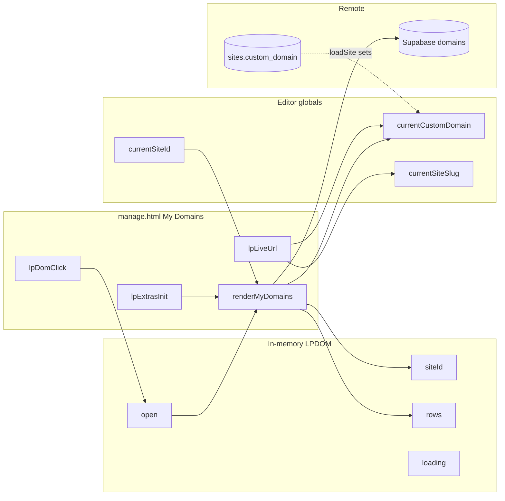
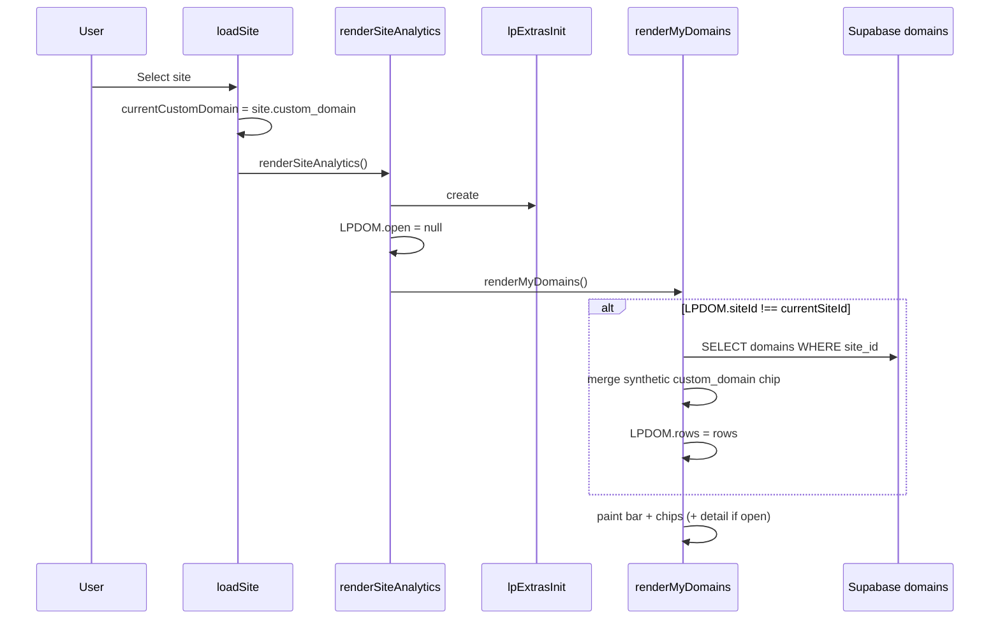
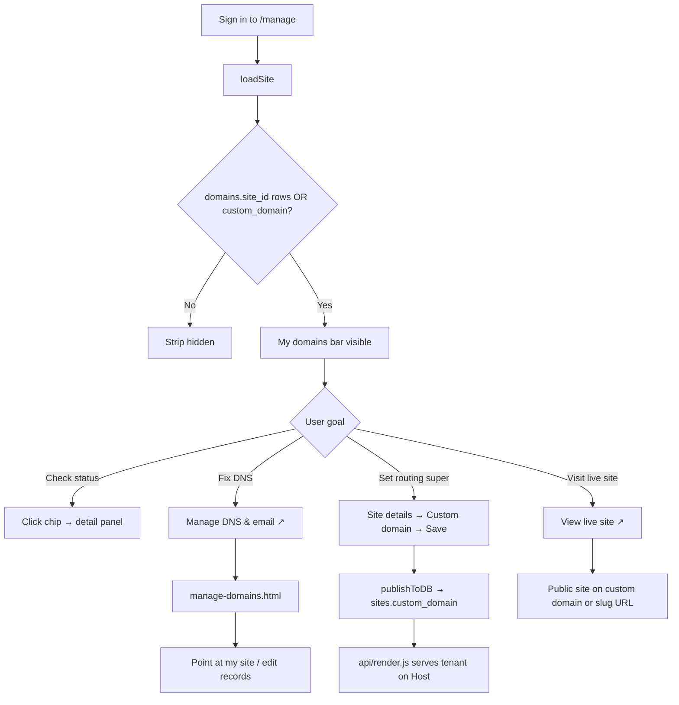
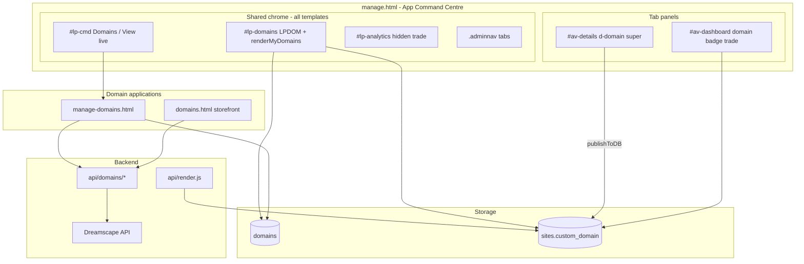
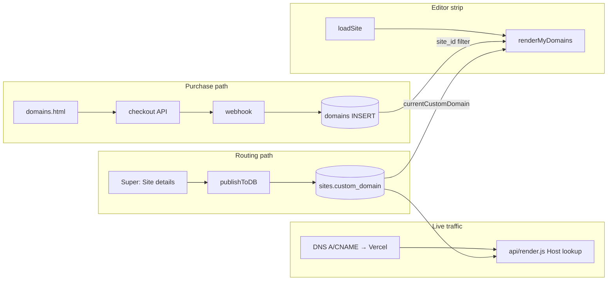
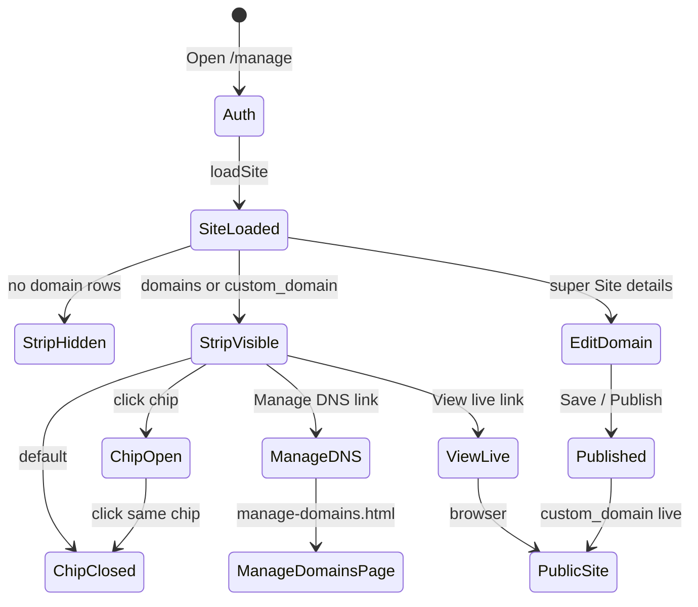

# LeadPages Domains — Complete Engineering Manual

**Document:** `features/Domains`  
**Status:** Definitive engineering reference for the My Domains strip in the editor and its platform connections  
**Audience:** Engineers rebuilding, extending, or debugging domain UX; AI development agents  
**Prerequisites:** [00-VISION](../00-VISION.md), [01-ARCHITECTURE](../01-ARCHITECTURE.md), [06-DOMAINS](../06-DOMAINS.md), [10-EDITOR](../10-EDITOR.md), [04-SITE-BUILDER](../04-SITE-BUILDER.md)

> **Scope note:** This document centres on the **My Domains strip** (`#lp-domains`, `LPDOM`, `renderMyDomains`) inside `manage.html`, plus how it connects to **`sites.custom_domain`**, the **`domains`** table, **`manage-domains.html`**, and **`domains.html`**. It is **not** a line-by-line manual for Dreamscape API handlers (`api/domains/*`) — see [06-DOMAINS](../06-DOMAINS.md) for registrar integration — nor marketing copy on `tradies.html`.

---

## Executive Summary

The My Domains strip is a **shared chrome widget** in the App Command Centre (`manage.html`). It sits **above the tab nav** (and above the analytics pill strip when visible), showing domain chips for the **currently loaded site**. It answers: *Which domains belong to this site? Are they active? Where do I manage DNS?*

Implementation is **100% client-side** in `manage.html`: one in-memory cache object (`LPDOM`), one render function (`renderMyDomains`), and one click handler (`lpDomClick`). Data comes from a direct Supabase `domains` query scoped by `site_id`, plus a **synthetic chip** when `sites.custom_domain` is set but not present in the table. Full DNS editing lives in **`manage-domains.html`** (opened in a new tab).

| Fact | Detail |
|------|--------|
| **DOM** | `#lp-domains` (injected above `#lp-analytics`) |
| **State** | `LPDOM = { siteId, rows, open, loading }` |
| **Template gate** | **None** — shown for trade, broker-app, and broker-leads when rows exist |
| **Role gate** | Any authenticated editor role with site access |
| **Entry** | `loadSite()` → `renderSiteAnalytics()` → `lpExtrasInit()` → `renderMyDomains()` |
| **Data** | Supabase `domains` (`.eq('site_id')`), `currentCustomDomain` global |
| **Live URL** | `lpLiveUrl()` — custom domain wins over `leadpages.com.au/{slug}` |
| **Routing authority** | `sites.custom_domain` — **not** the `domains` table alone |

---

## Purpose

### Product purpose

Site owners and partners need to see domain status **in context** while editing a site — without leaving the builder for every check. The strip provides:

1. **At-a-glance inventory** — how many domains are linked to this site.
2. **Status signal** — colour dot per domain (`active`, `pending`, `connected`, etc.).
3. **One-click paths** — open the live site, or jump to DNS/email management.
4. **Custom-domain clarity** — surfaces `sites.custom_domain` even when no `domains` row exists.

Domain **purchase** and **DNS CRUD** are deliberately delegated to `domains.html` and `manage-domains.html`; the strip is an **awareness and navigation layer**, not a registrar console.

### Engineering purpose

- **Site-scoped cache** (`LPDOM.siteId`) prevents cross-tenant domain bleed when switching sites in the landing picker.
- **Progressive disclosure** — empty state removes the strip entirely (`innerHTML=''`) so sites with no domains stay uncluttered.
- **Reuse platform truth** — synthetic `_custom` row mirrors routing field without duplicating DB writes in the strip.
- **Shared chrome** — same strip for trade Dashboard users and broker-app calculator users (only `#lp-leads` is trade-gated).

---

## Business Purpose

| Stakeholder | Value |
|-------------|-------|
| **Site owner (tradie)** | Confirms branded URL is connected; quick “View live site” without memorising slug |
| **Partner / broker** | Verifies client domain setup while editing; fewer “is my domain live?” tickets |
| **LeadPages (platform)** | Upsell path to domain purchase (`/domains`); retention via professional URLs |
| **Super-admin** | Sets `custom_domain` in Site details; strip reflects routing without opening DNS manager |

LeadPages sells domains via Dreamscape reseller integration. The strip **does not** complete purchase — it **surfaces linkage** after registration or manual custom-domain assignment.

---

## User Types

| User | Sees My Domains strip? | Typical journey |
|------|------------------------|-----------------|
| **Super-admin** | Yes, when site has `domains.site_id` rows or `custom_domain` | Edit site → confirm domain chip → open manage-domains for DNS |
| **Broker / partner** | Yes, same conditions | Client site → strip → Manage DNS & email |
| **Site owner** (customer login) | Yes, if domains linked or custom domain set | Dashboard/trade or Details tab; strip always above nav |
| **Leads-only demo** (`leads` role) | **No site editor** — N/A | Calculator demo only |
| **Anonymous** | N/A | Public storefront at `/domains` |

**Super-admin only in Site details:** `Custom domain (optional)` field (`#d-domain`) and client login email — brokers and site owners cannot set routing from Details today.

---

## Permissions

| Layer | Mechanism |
|-------|-----------|
| **Editor access** | Supabase auth + `gate()` in `manage.html` |
| **`domains` SELECT** | RLS — user must own domain or have site edit rights (see [02-DATABASE](../02-DATABASE.md)) |
| **`sites.custom_domain` UPDATE** | Via `publishToDB()` — super can set owner email + custom domain on trade/broker-leads |
| **`/api/domains/*`** | Bearer token; super-admin sees all Dreamscape inventory in list API |
| **Billing lock** | `lpBillingGate()` blocks editor including strip (runs before `renderMyDomains`) |
| **DNS mutations** | Only in `manage-domains.html` via authenticated API — not from strip |

The strip performs **read-only** Supabase queries. It never calls Dreamscape or Stripe directly.

---

## Domains Strip Layout

Vertical structure when at least one domain row exists:

```text
┌─────────────────────────────────────────────────────────────┐
│  BAR: My domains (N)  │  Manage DNS & email ↗  │  View live ↗ │
├─────────────────────────────────────────────────────────────┤
│  CHIPS: [● domain.com] [● other.com.au external]  …         │
├─────────────────────────────────────────────────────────────┤
│  DETAIL (expanded chip): Domain, Status, Points at, Added,   │
│                          Open domain ↗                       │
└─────────────────────────────────────────────────────────────┘
```

**Position in editor chrome** (all templates):

```text
Command bar (#lp-cmd)
Account landing (#lp-landing)          [when visible]
My Domains (#lp-domains)               ← this document
Analytics pills (#lp-analytics)        [hidden for trade]
Captured Leads (#lp-leads)             [hidden for trade]
Main nav (.adminnav)
Active tab panel (#av-*)
```

**Empty state:** `#lp-domains` is cleared — no placeholder bar.

**Loading state:** `"My domains"` title + `"loading…"` hint while Supabase fetch runs.

---

## Navigation

### Entry points to domain management

| UI element | Destination | Notes |
|------------|-------------|-------|
| **Manage DNS & email ↗** | `/manage-domains.html` | New tab; full DNS CRUD, register, admin dashboard |
| **View live site ↗** | `lpLiveUrl()` | Custom domain HTTPS URL, else `https://leadpages.com.au/{slug}` |
| **Open {domain} ↗** (detail) | `https://{domain_name}` | Per-chip expand |
| **Command bar Domains** | `/manage-domains.html` | `ensureSiteBar()` `#btn-domains` |
| **Command bar View Live Site ↗** | `lpLiveUrl()` | Same logic as strip link |
| **Site details → Custom domain** | In-panel field `#d-domain` | Super only; Save → `publishToDB()` |
| **Public storefront** | `/domains` → `domains.html` | Search, cart, Stripe checkout |

### Cross-links from other surfaces

| Surface | Domain signal |
|---------|---------------|
| **Trade Dashboard** | Header badge “Domain connected” / “No domain” from `currentCustomDomain` |
| **Account landing grid** | `_lplMeta()` — “Domain connected” / “Domain not connected” per site card |
| **Dashboard.md journey** | “Domain issue → My domains bar → manage-domains” |

---

## UI Components

| Component | CSS class / ID | Source | Description |
|-----------|----------------|--------|-------------|
| **Container** | `#lp-domains` | `lpExtrasInit()` | Injected once above analytics |
| **Bar** | `.lpd-bar` | `renderMyDomains` | Title, count badge, action links |
| **Count** | `.lpd-count` | inline | Number of chips |
| **Chip** | `.lpd-chip` + `.on` | `data-lpd="{index}"` | Toggle expand; status dot + name |
| **Status dot** | `.lpd-dot.s-{status}` | mapped colours | green = active/live/ok/connected; amber = pending; red = error/failed/expired |
| **External tag** | `.lpd-tag` | when `managed_external` | “external” label |
| **Detail panel** | `.lpd-detail` | when `LPDOM.open != null` | Metadata rows + open link |
| **Detail rows** | `.lpd-drow` | label / value pairs | Domain, Status, Points at, Added, Source |

### Synthetic custom-domain chip

When `currentCustomDomain` is set and no matching `domains.domain_name` exists:

```javascript
{
  id: 'custom',
  domain_name: cd,           // normalized lowercase, no www
  status: 'connected',
  managed_external: false,
  site_id: currentSiteId,
  _custom: true              // UI flag — not a DB row
}
```

Detail panel shows **“Custom domain on this site”** and **“Set in Site details → Custom domain”** instead of Added date.

---

## Domain Status & Chips

| `domains.status` (DB) | Dot class | Strip meaning |
|------------------------|-----------|---------------|
| `active` | `.s-active` | Registered through platform, linked to site |
| `connected` | `.s-connected` | Synthetic row for `custom_domain` |
| `pending`, `processing` | `.s-pending` | Registration in progress |
| `error`, `failed`, `expired` | `.s-error` | Requires operator attention |
| unknown | default grey | Fallback |

**`managed_external`:** Shows **external** tag — domain tracked but not registered via Dreamscape fulfilment.

---

## Quick Actions

| Action | Trigger | Handler |
|--------|---------|---------|
| **Expand / collapse chip** | Click `.lpd-chip[data-lpd]` | `lpDomClick` → toggle `LPDOM.open` → `renderMyDomains()` |
| **Manage DNS & email** | `.lpd-live` href | Navigate to `manage-domains.html` (new tab) |
| **View live site** | `.lpd-live` href | `lpLiveUrl()` |
| **Open domain** | `.lpd-open` in detail | `https://{domain}` new tab |
| **Set custom domain** | Site details Save | `publishToDB()` updates `sites.custom_domain` |
| **Point DNS at site** | manage-domains quick action | “◍ Point at my site” → A/CNAME records via API |

The strip has **no inline DNS editing** — by design.

---

## Site Selection

The strip always reflects **`currentSiteId`** from `loadSite()`:

| Path | Effect on LPDOM |
|------|-----------------|
| Landing grid pick | `LPDOM.siteId !== currentSiteId` → refetch |
| Command-bar site `<select>` | Same refetch |
| Deep link `/manage?site={slug}` | Same |
| Single-site auto-open | Same |

On site switch, `renderSiteAnalytics()` sets **`LPDOM.open = null`** (collapse any expanded detail) before `renderMyDomains()`.

**Cache invalidation gap:** Changing `custom_domain` via Publish on the **same** site does **not** reset `LPDOM.siteId` — synthetic chip may be stale until site reload (see Technical Debt).

---

## Notifications

The strip has **no toast or notification centre**. Related patterns:

| Type | Mechanism | Relevance |
|------|-----------|-----------|
| **Empty strip** | Silent hide | No “no domains” message |
| **Loading hint** | `.lpd-hint` text | Transient during fetch |
| **Publish toast** | `toast('Published — live on your site')` | After custom domain save |
| **Landing meta** | `_lplMeta` badges | Domain connected on site cards |
| **Dashboard badge** | Trade header | Domain connected / No domain |

---

## Platform Architecture (Dreamscape + Routing)

Two **independent** concerns (from [06-DOMAINS](../06-DOMAINS.md)):

```text
┌─────────────────────┐     ┌─────────────────────┐
│  domains table      │     │ sites.custom_domain │
│  (inventory/DNS)    │     │ (HTTP routing)      │
└──────────┬──────────┘     └──────────┬──────────┘
           │                           │
           ▼                           ▼
   manage-domains.html          api/render.js
   api/domains/*                Host header lookup
   Dreamscape API               Vercel SSL + rewrite
```

| Layer | Responsibility |
|-------|----------------|
| **Dreamscape** | Registrar — search, register, DNS records |
| **`domains` table** | Purchased inventory per user; optional `site_id` link |
| **`sites.custom_domain`** | Which tenant serves on `Host` header (UNIQUE) |
| **Vercel** | SSL, `vercel.json` rewrites to `api/render.js` |
| **DNS** | A → `76.76.21.21`, www CNAME → `cname.vercel-dns.com` |

**Purchase does not auto-set routing.** Checkout accepts optional `site_id` in API but UIs do not pass it; webhook does not write `sites.custom_domain`.

---

## Data Sources



| Source | Table / field | Fields used in strip |
|--------|---------------|----------------------|
| **Domain inventory** | `domains` | `id`, `domain_name`, `status`, `managed_external`, `site_id`, `created_at` |
| **Routing field** | `sites.custom_domain` | Via `currentCustomDomain` → synthetic chip |
| **Site context** | globals | `currentSiteSlug` for “Points at `/{slug}`” |
| **Live URL** | derived | `lpLiveUrl()` |

Query in `renderMyDomains`:

```javascript
sb.from('domains')
  .select('id,domain_name,status,managed_external,site_id,created_at')
  .eq('site_id', currentSiteId)
  .order('created_at', { ascending: true })
```

---

## API Calls

### From `#lp-domains` (manage.html)

| Call | Method | Auth | Notes |
|------|--------|------|-------|
| Supabase `domains` SELECT | client SDK | Session JWT + RLS | Only API used by strip |

### From related surfaces (not strip)

| Endpoint | Method | Called by | Purpose |
|----------|--------|-----------|---------|
| `GET /api/domains/availability` | GET | `domains.html` | Search TLDs (public, rate-limited) |
| `POST /api/domains/checkout` | POST | `domains.html` | Stripe session |
| `POST /api/domains/webhook` | POST | Stripe | Fulfil registration → INSERT `domains` |
| `GET /api/domains/list` | GET | `manage-domains.html` | User inventory; super = all |
| `GET/PATCH /api/domains/detail` | GET/PATCH | `manage-domains.html` | Nameservers, expiry |
| `GET/POST/PATCH/DELETE /api/domains/dns` | * | `manage-domains.html` | DNS CRUD |
| `GET /api/domains/order?group=` | GET | post-checkout | Order status poll |
| Supabase `sites` UPDATE | client | `publishToDB()` | Persists `custom_domain` |

**Kill switches:** `DOMAINS_FEATURE_ENABLED`, `DOMAIN_FEATURE_ENABLED` (availability only).

---

## Database Tables

| Table | Strip usage | Broader platform |
|-------|-------------|------------------|
| **`domains`** | `.eq('site_id', currentSiteId)` for chips | Dreamscape-linked inventory |
| **`sites.custom_domain`** | Synthetic chip + `lpLiveUrl` + render lookup | Authoritative HTTP routing |
| **`domain_orders`** | — | Checkout fulfilment |
| **`domain_pricing`** | — | TLD retail overrides |
| **`domain_registrants`** / **`domain_customers`** | — | WHOIS / Dreamscape client mapping |
| **`domain_events`** | — | Audit log |

### `domains` key columns

| Column | Purpose |
|--------|---------|
| `user_id` | Owner |
| `site_id` | **Optional** link — strip filters on this |
| `domain_name` | FQDN shown on chip |
| `dreamscape_domain_id` | Required for DNS API in manage-domains |
| `status` | Chip dot colour |
| `managed_external` | “external” tag |
| `expiry_date`, `privacy_enabled` | Not shown in strip (manage-domains only) |

### Normalization (shared)

Custom domain values normalized on save and display:

```text
lowercase → strip https:// → strip path → strip www. prefix
```

Applied in `publishToDB()`, synthetic chip logic, and `api/render.js` host matching.

---

## Related Files

| File | Relationship |
|------|--------------|
| **`manage.html`** | **Primary implementation** — `LPDOM`, `renderMyDomains`, `lpExtrasInit`, CSS `#lp-crm-style` |
| `api/manage.html` | Legacy duplicate — same domain strip code; do not treat as source of truth |
| `manage-domains.html` | Full domain manager — DNS, register, super admin dashboard |
| `domains.html` | Public storefront — search + Stripe purchase |
| `api/domains/*` | Dreamscape + Stripe backend |
| `api/render.js` | `custom_domain` Host lookup for live sites |
| `dreamscape.js` | Server-only reseller client |
| `vercel.json` | Routing rules, `/domains` → `domains.html` |
| `docs/06-DOMAINS.md` | Platform-wide domain system reference |
| `docs/features/Dashboard.md` | Trade dashboard domain badges + strip cross-links |
| `docs/10-EDITOR.md` | Editor chrome levels, `LPDOM` module table |
| `docs/02-DATABASE.md` | Domain table schemas, RLS |
| `docs/04-SITE-BUILDER.md` | `loadSite`, `lpLiveUrl`, publish payload |

---

## Functions

### Core (My Domains strip)

| Function | Lines (approx.) | Role |
|----------|-----------------|------|
| `LPDOM` | ~3360 | In-memory cache: `{ siteId, rows, open, loading }` |
| `renderMyDomains()` | ~3361–3413 | Fetch (if site changed), build bar + chips + detail |
| `lpDomClick(e)` | ~3414–3419 | Toggle expanded chip index |
| `lpExtrasInit()` | ~3342–3357 | Inject `#lp-domains` + `#lp-leads`; wire click listener |
| `lpLiveUrl()` | ~3316–3321 | Public URL for View live links |
| `lpWhen(ts)` | ~3323–3330 | Detail panel “Added” timestamp |
| `lpAgo(ts)` | ~3331–3339 | Used elsewhere; not strip |

### Shared dependencies

| Function | Role for Domains |
|----------|------------------|
| `renderSiteAnalytics()` | Calls `lpExtrasInit()`, resets `LPDOM.open`, invokes `renderMyDomains()` |
| `loadSite()` | Sets `currentCustomDomain`; eventually `renderSiteAnalytics()` |
| `publishToDB()` | Persists `custom_domain` to Supabase |
| `ensureSiteBar()` | Adds `#btn-domains`, `#btn-viewlive` |
| `renderDetails()` | Renders `#d-domain` field (super); Save triggers publish |
| `renderDashboard()` | Header domain badge + View live (trade) |
| `_lplMeta()` | Landing grid domain connected badges |
| `esc()` | XSS-safe chip/detail HTML |

### CSS (inline in manage.html)

| Selector | Purpose |
|----------|---------|
| `#lp-domains` | Container margin |
| `.lpd-bar`, `.lpd-title`, `.lpd-count` | Header row |
| `.lpd-chips`, `.lpd-chip`, `.lpd-chip.on` | Chip row + selected state |
| `.lpd-dot.s-*` | Status colours |
| `.lpd-detail`, `.lpd-drow` | Expanded metadata |
| `.lpd-live`, `.lpd-open` | Action links |

---

## Event Flow

### Strip mount on site load



### Chip expand

1. User clicks chip `[data-lpd="{i}"]`.
2. `lpDomClick` sets `LPDOM.open = (open === i) ? null : i`.
3. `renderMyDomains()` re-renders without refetch (same `LPDOM.siteId`).

### Custom domain save (super)

1. User edits `#d-domain` in Site details → Save.
2. `publishToDB()` normalizes and UPDATEs `sites.custom_domain`.
3. `allSites` cache updated; toast shown.
4. **Strip not automatically refreshed** — stale until site switch or manual reload (debt).

---

## User Journey



**Purchase journey (parallel path):**

```mermaid
flowchart LR
  P1[/domains storefront] --> P2[Stripe checkout]
  P2 --> P3[Webhook → domains table]
  P3 --> P4{site_id linked?}
  P4 -->|Rare today| E
  P4 -->|Usually no| P5[Manual: manage-domains + super sets custom_domain]
  P5 --> L
```

---

## Performance Considerations

| Area | Behaviour | Risk |
|------|-----------|------|
| **Site-scoped cache** | Refetch only when `LPDOM.siteId !== currentSiteId` | Fast tab switches; stale on same-site custom_domain change |
| **Empty hide** | No DOM when zero rows | Good — zero cost for sites without domains |
| **Chip toggle** | Re-render full innerHTML, no refetch | Cheap at typical domain counts (1–3) |
| **Supabase query** | Single SELECT, small column list | Low latency; depends on RLS |
| **Inject once** | `lpExtrasInit` creates `#lp-domains` once per session | Listener attached once |
| **Parallel loads** | Runs inside `renderSiteAnalytics` with leads + ANA fetch | Minor concurrent Supabase traffic |

**Recommendations (future):** Invalidate `LPDOM` on `publishToDB` when `custom_domain` changes; debounce refetch if site switch is rapid.

---

## Security Considerations

| Topic | Detail |
|-------|--------|
| **Authentication** | Strip only runs after `gate()` in authenticated editor |
| **Authorization** | RLS on `domains` — users see only permitted rows |
| **Site isolation** | Explicit `site_id` filter + cache key prevents cross-site leak |
| **XSS** | All user/domain strings through `esc()` in chip and detail HTML |
| **External links** | `target="_blank"` + `rel="noopener"` on live and DNS manager links |
| **No secrets in strip** | Dreamscape token server-only; strip is read-only |
| **Custom domain uniqueness** | DB UNIQUE on `sites.custom_domain` — enforced at publish |
| **PII** | Strip shows domain names only — no registrant WHOIS |

Super-admin custom domain field includes help text about Vercel + DNS — operational steps, not automated verification.

---

## Technical Debt

| ID | Issue | Location | Impact |
|----|-------|----------|--------|
| TD-DOM1 | **Strip stale after Publish** | `publishToDB` — no `LPDOM.siteId` reset / `renderMyDomains()` | Custom domain chip missing until site re-selected |
| TD-DOM2 | **`domains.site_id` rarely set** | Checkout/webhook UIs | Purchased domains may not appear in strip (only `custom_domain` chip shows) |
| TD-DOM3 | **Registration ≠ routing** | Platform gap per 06-DOMAINS | Users expect auto-connect; requires manual steps |
| TD-DOM4 | **Super-only custom domain field** | `renderDetails` role gate | Brokers cannot set routing without super |
| TD-DOM5 | **`api/manage.html` drift** | Legacy copy | Confusion if wrong file deployed |
| TD-DOM6 | **Feature flag naming** | `DOMAINS_*` vs `DOMAIN_*` | Operator confusion |
| TD-DOM7 | **No DNS health check** | Strip shows DB status only | “connected” synthetic chip does not verify DNS/Vercel |
| TD-DOM8 | **Dashboard vs strip signal** | Dashboard uses `currentCustomDomain` only | Dashboard “Domain connected” ignores `domains` rows without custom_domain set |

---

## Future Improvements

1. **Refresh strip on publish** — reset `LPDOM.siteId` or call `renderMyDomains()` after `custom_domain` update.
2. **Pass `site_id` at checkout** — link purchased domain to current site automatically.
3. **Webhook → optional `custom_domain`** — opt-in auto-routing after DNS verified.
4. **Broker custom domain field** — role-gated write for partners servicing clients.
5. **Inline DNS status** — lightweight check (CNAME/A resolves to Vercel) on chip dot.
6. **Link domain row to site** — UI in manage-domains to assign `site_id` without super SQL.
7. **Remove `api/manage.html` duplicate** or sync domain strip.
8. **Align Dashboard badge** — “Domain connected” if strip would show any chip, not only `custom_domain`.
9. **Notification** — toast when domain registration completes and strip would gain a chip.
10. **Consolidate live URL** — single helper exported for Dashboard header and strip (already shared via `lpLiveUrl`).

---

## Domains Architecture



---

## Connections to Other Systems

### Editor

The My Domains strip is **Level 3 chrome** (see [10-EDITOR](../10-EDITOR.md)) — above main nav, below command bar. It loads on every `loadSite()` via `renderSiteAnalytics()`, independent of active tab (`dashboard`, `details`, etc.).

Shared globals: `currentSiteId`, `currentCustomDomain`, `currentSiteSlug`.

### Dashboard (trade)

Trade sites hide `#lp-analytics` but **keep `#lp-domains`**. Dashboard header duplicates domain status as badges and “View live ↗” — both use `currentCustomDomain`, not `LPDOM.rows`.

See [features/Dashboard.md](./Dashboard.md).

### Site Builder / Publish

`publishToDB()` for non-`broker-app` templates includes:

```javascript
custom_domain: normalized(currentCustomDomain) || null
```

Site details Save button calls the same path. Routing takes effect on next request to `api/render.js` after DB update — no Vercel API call from editor.

### Analytics

No direct coupling. `renderSiteAnalytics()` orchestrates both analytics load and domain strip init.

### Billing

`lpBillingGate()` runs at start of `renderSiteAnalytics()`. Locked accounts never reach domain strip paint.

### Partner System

Partners manage client domains via manage-domains + super setting `custom_domain`. Project scope on Dashboard may include “connect domain” tasks — checklist only, not wired to strip.

Partner showcase domains (`renderShowcaseByDomain`) are a **separate** routing path in `api/render.js` — not shown in My Domains strip.

### CRM / Leads

No data coupling. `#lp-leads` is sibling strip injected by same `lpExtrasInit()` — hidden for trade template.

---

## Data Flow



---

## User Flow



---

## Glossary

| Term | Meaning |
|------|---------|
| **LPDOM** | In-memory domain strip cache in `manage.html` |
| **Synthetic chip** | UI-only row for `sites.custom_domain` when no `domains` record |
| **Custom domain routing** | `sites.custom_domain` — Host header lookup in `api/render.js` |
| **Domain inventory** | Rows in `domains` table from Dreamscape fulfilment |
| **`site_id` link** | Optional FK connecting purchased domain to a site for strip query |
| **Dreamscape** | LeadPages domain registrar reseller API |
| **Command Centre** | Marketing name for `manage.html` editor |
| **PRIMARY_HOSTS** | Env list of non-tenant hosts (`leadpages.com.au`, etc.) |

---

## Appendix: LPDOM State Machine

```text
                    loadSite(new id)
                          │
                          ▼
              ┌───────────────────────┐
              │ LPDOM.siteId ≠ id ?   │
              └───────────┬───────────┘
                    yes   │   no
                          │         reuse LPDOM.rows
                          ▼
              loading=true, fetch SB
              merge custom_domain chip
              LPDOM.siteId = id
                          │
                          ▼
              rows.length === 0 ?
                    yes → clear #lp-domains
                    no  → render bar + chips
                          │
              click chip → toggle LPDOM.open
                          │
                          ▼
              renderMyDomains() (no refetch)
```

---

*Last updated: July 2026 — reflects `manage.html` My Domains implementation and [06-DOMAINS](../06-DOMAINS.md) platform reference on branch `main`.*
