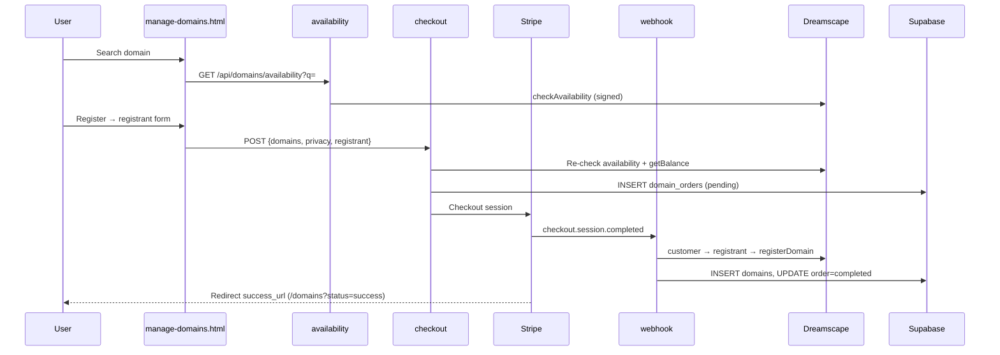
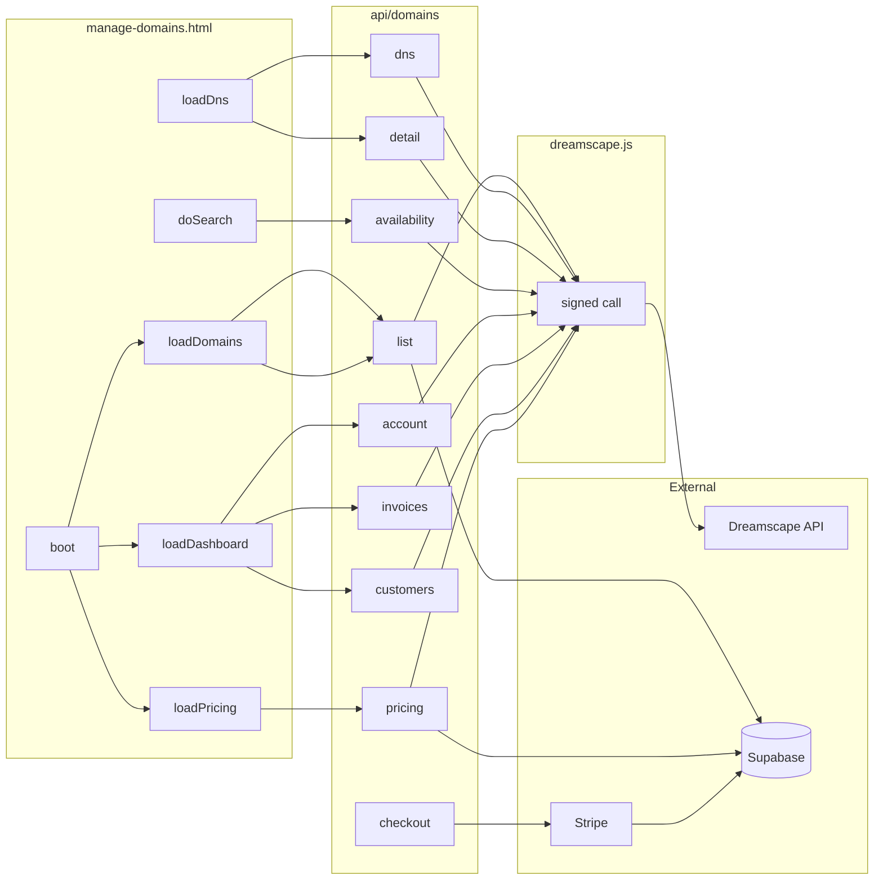
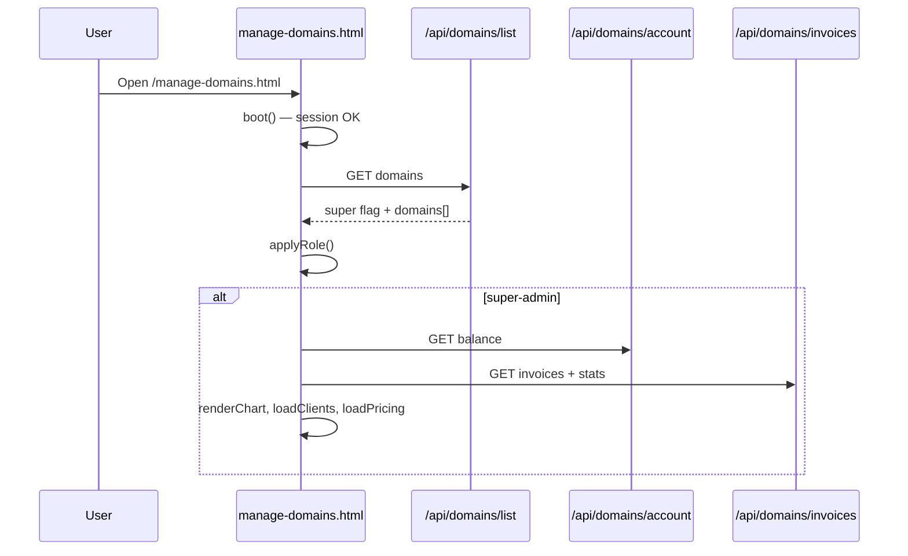
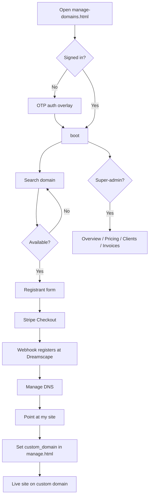
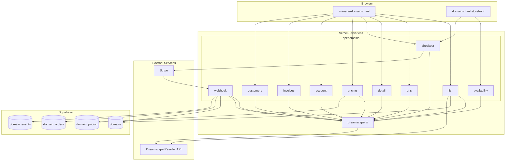
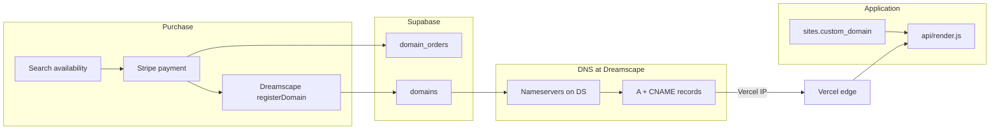
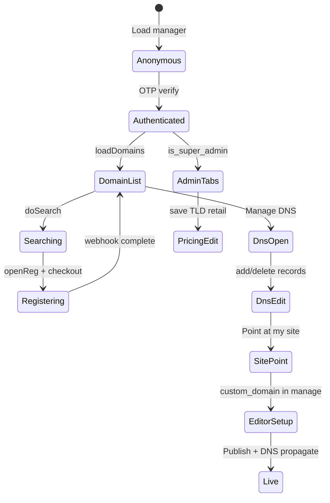

# LeadPages Dreamscape Integration — Complete Engineering Manual

**Document:** `features/Dreamscape`  
**Status:** Definitive engineering reference for the Dreamscape Reseller API integration and domain manager UI  
**Audience:** Engineers rebuilding, extending, or debugging domain search, purchase, DNS, and super-admin reseller tooling; AI development agents  
**Prerequisites:** [00-VISION](../00-VISION.md), [01-ARCHITECTURE](../01-ARCHITECTURE.md), [02-DATABASE](../02-DATABASE.md), [06-DOMAINS](../06-DOMAINS.md)

> **Scope note:** This document covers the **Dreamscape registrar layer** — `dreamscape.js`, `api/domains/*`, and the authenticated manager at `manage-domains.html`. It is **not** the public storefront (`domains.html`), the per-site custom-domain field in `manage.html`, or Vercel Host routing (see [06-DOMAINS](../06-DOMAINS.md) for the full domain system). Purchase does **not** auto-set `sites.custom_domain`.

---

## Executive Summary

LeadPages resells domains through the **Dreamscape Reseller REST API**. A server-only client (`dreamscape.js`) signs every request; Vercel serverless routes in `api/domains/` enforce auth, pricing, balance guards, and Stripe fulfilment. The primary operator UI is **`manage-domains.html`** — search, register, DNS, email/web forwarding, and (for super-admins) reseller overview, client accounts, invoices, and TLD pricing.

Implementation is **split**: browser UI calls LeadPages APIs only; **never** the Dreamscape API key. Registration is **async** — Stripe checkout completes in the browser; `webhook.js` registers at Dreamscape after payment.

| Fact | Detail |
|------|--------|
| **Client module** | `dreamscape.js` — signed fetch wrapper, pricing helpers, balance guard |
| **Primary UI** | `manage-domains.html` at `/manage-domains.html` |
| **Public search** | `GET /api/domains/availability` (no auth; rate-limited) |
| **Purchase** | `POST /api/domains/checkout` → Stripe → `POST /api/domains/webhook` |
| **DNS** | `GET/POST/PATCH/DELETE /api/domains/dns` → Dreamscape `/domains/{id}/dns` |
| **Super-admin** | Full reseller domain list, pricing admin, balance, invoices, customers |
| **Client user** | Own `domains` rows from Supabase; DNS by `domain_id` (uuid) |
| **Kill switch** | `DOMAINS_FEATURE_ENABLED` (API); `DOMAIN_FEATURE_ENABLED` (availability only) |

---

## Purpose

### Product purpose

Site owners and partners need to **own a domain**, **point it at their LeadPages site**, and **forward email** — without leaving the platform or learning registrar consoles. Dreamscape provides wholesale registration and authoritative DNS on Dreamscape nameservers.

The manager answers:

1. **Can I get this name?** — availability search with retail pricing.
2. **How do I buy it?** — registrant form + Stripe Checkout.
3. **How do I make it live?** — DNS quick actions (A/CNAME to Vercel, mail/web forwarders).
4. **How is the reseller business doing?** (super-admin) — credit, sales chart, invoices, client accounts, margin on TLDs.

### Engineering purpose

- **Single server client** for all Dreamscape HTTP — signing, timeouts, exported primitives.
- **Never trust the browser** for price or availability at checkout — re-check on server.
- **Balance guard** — block checkout / hold fulfilment if reseller credit would fall below reserve.
- **Dual identity model** — super-admins manage by `dreamscape_id`; clients by Supabase `domains.id`.
- **Audit trail** — `domain_events` logs customer/registrant/register API payloads.

---

## Business Purpose

| Stakeholder | Value |
|-------------|-------|
| **Site owner** | One-stop domain purchase + DNS pointing at LeadPages hosting |
| **Partner / broker** | Clients self-serve domains; fewer “how do I connect my domain?” tickets |
| **LeadPages (platform)** | Margin on TLD retail vs Dreamscape wholesale; sticky hosting bundle |
| **Super-admin / operator** | Reseller dashboard: credit, sales, pricing control, DNS for any account domain |

Domain resale supports the business model: **hosted sites on custom domains**. Retail prices are configurable per TLD; wholesale comes live from Dreamscape `/domains/tlds`.

---

## User Types

| User | Sees what | Typical journey |
|------|-----------|-----------------|
| **Super-admin** (`profiles.is_super_admin`) | Overview stats, all tabs, every Dreamscape domain in reseller account | Monitor credit → adjust pricing → manage client DNS by Dreamscape ID |
| **Authenticated client** | My Domains panel only (no admin tabs) | Search → register → Manage DNS → Point at my site |
| **Anonymous visitor** | Availability via `domains.html` or unauthenticated search on manager page | Search only; must sign in to buy |
| **Stripe webhook** | No UI — server fulfilment | `checkout.session.completed` → register at Dreamscape |

**Not in scope:** Setting `sites.custom_domain` in the Page editor — separate step documented in [06-DOMAINS](../06-DOMAINS.md).

---

## Permissions

| Layer | Mechanism |
|-------|-----------|
| **Browser auth** | Supabase OTP email login in `#authOv`; Bearer token on all `/api/domains/*` except availability |
| **Super-admin** | `profiles.is_super_admin` — unlocks `dreamscape_id` DNS/detail paths, pricing, account, customers, invoices |
| **Client DNS** | `ownedDomain()` — `domains.user_id` must match JWT user (or super) |
| **Availability** | Public GET; IP rate limit 12 requests / 10s |
| **Webhook** | Stripe HMAC signature — no user JWT |
| **Pricing POST** | Super-admin only |
| **Dreamscape key** | Env only — never sent to browser |

Super-admin list behaviour (`GET /api/domains/list`):

```javascript
// Super: live Dreamscape list — manage: 'dreamscape', dreamscape_id from API
// Client: Supabase domains table — manage: 'ours', id = uuid
```

DNS identifier helpers in `manage-domains.html`:

```javascript
function dnsQuery(d) {
  return d.manage === 'dreamscape'
    ? ('dreamscape_id=' + encodeURIComponent(d.dreamscape_id) + '&domain_name=' + encodeURIComponent(d.domain_name))
    : ('domain_id=' + encodeURIComponent(d.id));
}
function dnsBody(d) {
  return d.manage === 'dreamscape'
    ? { dreamscape_id: d.dreamscape_id, domain_name: d.domain_name }
    : { domain_id: d.id };
}
```

---

## Manager Layout (`manage-domains.html`)

Vertical structure (max-width 980px, inline CSS):

```text
┌─────────────────────────────────────────────────────────────┐
│  HEADER: Domain Manager eyebrow · title · sub                 │
├─────────────────────────────────────────────────────────────┤
│  BAR: signed-in email · [Back to dashboard → /manage]       │
├─────────────────────────────────────────────────────────────┤
│  OVERVIEW CARD (#dashCard) — super only                     │
│  4 stat tiles · Sales last 6 months bar chart               │
├─────────────────────────────────────────────────────────────┤
│  TABS (#tabs) — super only                                  │
│  My Domains | Client Accounts | Invoices | Pricing          │
├─────────────────────────────────────────────────────────────┤
│  PANEL: My Domains (#panel-domains) — all authenticated     │
│    Register a domain (search + results)                     │
│    My domains list · expandable DNS editor per row          │
├─────────────────────────────────────────────────────────────┤
│  PANEL: Client Accounts (#panel-clients) — super            │
│  PANEL: Invoices (#panel-invoices) — super                  │
│  PANEL: Pricing (#panel-pricing) — super                    │
└─────────────────────────────────────────────────────────────┘

Overlays: #authOv (OTP sign-in) · #regOv (registrant + checkout)
```

**Client users** see only `#panel-domains` (search + domain list). Admin chrome is hidden via `applyRole()` after `loadDomains()` sets `IS_SUPER` from API response.

---

## Navigation

### Tab integration (super-admin)

| Tab | `data-tab` | Panel ID | Loader |
|-----|------------|----------|--------|
| My Domains | `domains` | `#panel-domains` | default visible |
| Client Accounts | `clients` | `#panel-clients` | `loadClients()` via `loadDashboard()` |
| Invoices | `invoices` | `#panel-invoices` | `renderInvoices()` |
| Pricing | `pricing` | `#panel-pricing` | `loadPricing()` on boot |

`showTab(name)` toggles `.tab.on` and `.panel.hide`.

### Cross-links

| UI element | Destination |
|------------|-------------|
| Back to dashboard | `/manage` |
| Register → Continue to secure checkout | Stripe Checkout URL from `/api/domains/checkout` |
| Point at my site | Adds A `76.76.21.21` + CNAME `www` → `cname.vercel-dns.com` via Dreamscape DNS **and** attaches apex + `www` to the Vercel project via `POST /api/domains/point-at-site` (optional `site_id` sets `sites.custom_domain`) |

From `manage.html`, **My domains** bar links to `/manage-domains.html` (new tab) — see [features/Dashboard](Dashboard.md).

---

## UI Sections and Widgets

| Section | Container | Loader | Description |
|---------|-----------|--------|-------------|
| **Auth bar** | `#who` | `boot()` | Email + signed-in state |
| **Overview stats** | `#statRow` | `loadDashboard()` | Credit, domain count, paid sales, invoice count |
| **Sales chart** | `#salesChart` | `renderChart()` | Last 6 months from invoice stats |
| **Domain search** | `#searchResults` | `doSearch()` | Public availability API |
| **Domain list** | `#domainsList` | `renderDomains()` | Status chips, Manage DNS toggle |
| **DNS editor** | `#dnsHost-{i}` | `loadDns()` | NS box, quick actions, record table, add form |
| **Nameservers** | `#nsHost-{i}` | `loadNs()` | `on_dreamscape_dns` badge, edit NS |
| **Client accounts** | `#cliList` | `loadClients()` | Dreamscape customer list |
| **Invoices** | `#invList` | `renderInvoices()` | Expandable line items |
| **Pricing grid** | `#pricingBody` | `renderPricing()` | Wholesale / retail / profit per TLD |

### Status chips (`statusChip`)

| Condition | Chip |
|-----------|------|
| `manage === 'dreamscape'` | Registered (status_id 2) or Status N |
| No `dreamscape_id` | External — “Point its nameservers here to manage” |
| Supabase row active/registered | Registered |
| Otherwise | Pending / raw status |

### DNS quick actions

| Button | Mode | Creates |
|--------|------|---------|
| ✉ Forward an email | `mail` | `MAILFWD` — `email@domain` → external inbox |
| ↗ Forward a web address | `web` | `WEBFWD` — subdomain redirect |
| ◍ Point at my site | `site` | Calls `POST /api/domains/point-at-site` — Dreamscape A/CNAME + Vercel project domain attach (apex + www); optional `site_id` for routing |
| (default form) | `generic` | A, AAAA, CNAME, TXT, MX |

Supported record types in API: `A`, `AAAA`, `CNAME`, `TXT`, `MX`, `SRV`, `CAA`, `WEBFWD`, `MAILFWD`.

---

## Dreamscape Client (`dreamscape.js`)

**Server-only** — runs inside Vercel functions. Never bundled for browser.

### Configuration

| Env var | Default | Purpose |
|---------|---------|---------|
| `DREAMSCAPE_API_BASE_URL` | `https://reseller-api.ds.network` | API base (sandbox URL for testing) |
| `DREAMSCAPE_API_TOKEN` / `DREAMSCAPE_API_KEY` | — | 32-char lowercase key for signing |
| `DREAMSCAPE_RESELLER_ID` | optional | Reseller ID |
| `DREAMSCAPE_MINIMUM_RESERVE_BALANCE` | `150` | AUD floor after estimated cost |
| `DREAMSCAPE_LOW_BALANCE_WARNING` | `250` | Soft warning threshold |
| `DREAMSCAPE_PRIVACY_COST` | `5` | Wholesale privacy (balance guard) |
| `DOMAIN_PRICE_SOURCE` | `table` | `table` \| `dreamscape` \| `markup` |
| `DOMAIN_PRICE_MARKUP` | `2` | Multiplier when source = `markup` |

### Request signing

Every HTTP call:

```text
Api-Request-Id  = md5(timestamp + random)
Api-Signature   = md5(request_id + apiKey)
```

Fresh pair per request; 15s default timeout via `AbortController`.

### Pricing resolution (`resolveSell`)

Priority for **display and checkout charge**:

1. **`domain_pricing` table** — admin retail overrides (highest)
2. **`DOMAIN_PRICE_SOURCE`**:
   - `table` (default) → hardcoded `PRICE_TABLE` in `dreamscape.js`
   - `dreamscape` → API `register_price` (wholesale — rarely used as retail)
   - `markup` → `register_price * DOMAIN_PRICE_MARKUP`
3. Fallback → `priceFor(tld)` from `PRICE_TABLE`

**Privacy retail:** `$9.95` (`PRIVACY_PRICE`). Reseller cost for balance guard: `DREAMSCAPE_PRIVACY_COST` (default `$5`).

### Balance guard (`evaluateBalance`)

Before checkout (`checkout.js`) and during webhook fulfilment (`webhook.js`):

```javascript
after = balance - estimatedCost
if (after < MIN_RESERVE) → decision: 'block' (code: requires_admin_balance)
if (balance < LOW_WARNING) → decision: 'warn'
else → 'ok'
```

Checkout returns HTTP 409 with `code: 'reserve'` when blocked. Webhook sets order `requires_admin_balance` and holds (does not fail Stripe ack).

### Exported API surface (grouped)

| Group | Functions | Dreamscape paths |
|-------|-----------|------------------|
| **Health / account** | `ping`, `getReseller`, `getBalance`, `getInvoices`, `getCurrencies` | `/ping`, `/reseller`, `/finances/*` |
| **Domains** | `checkAvailability`, `listDomains`, `registerDomain`, `getDomain`, `patchDomain`, … | `/domains/*` |
| **Customers / registrants** | `createCustomer`, `listCustomers`, `createRegistrant`, … | `/customers`, `/domains/registrants` |
| **Domain DNS** | `listDomainDns`, `addDomainDns`, `updateDomainDns`, `deleteDomainDns` | `/domains/{id}/dns` |
| **Products (unused in UI today)** | DNS Hosting, Email Hosting, Email Exchange | `/products/*` |

LeadPages uses **domain-level DNS** (`/domains/{id}/dns`), not the paid Premium DNS Hosting product API.

---

## Purchase Flow



### Order statuses

| Status | Meaning |
|--------|---------|
| `pending` | Stripe session created |
| `registering` | Payment confirmed; API in progress |
| `completed` | Domain row + Dreamscape ID stored |
| `failed_requires_review` | Paid but registration failed — manual fix |
| `requires_admin_balance` | Reserve too low — top up and retry |

### Registrant rules (UI + checkout)

- Required: name, email, phone, address, city, state, postcode.
- `.au` domains: **business** account + ABN/ACN enforced in UI (`regGo` handler).
- Registrant snapshot persisted in `localStorage` key `lp_registrant`.
- Optional `site_id` on checkout body — **API accepts; UIs do not send today**.

### Webhook fulfilment steps (`fulfilOrder`)

1. Skip if order already `completed` or domain already has `dreamscape_domain_id`.
2. Re-check reserve balance — hold if blocked.
3. `ensureCustomer` — create or reuse Dreamscape customer; upsert `domain_customers`.
4. `createRegistrant` — insert `domain_registrants`.
5. `registerDomain` — `.au` adds `eligibility_data`; optional privacy.
6. Insert `domains` row; mark order completed; log `domain_events`.

**Important:** Webhook does **not** set `sites.custom_domain` or add domain to Vercel project.

---

## DNS and Nameservers

### Authority model

DNS records managed via `api/domains/dns.js` are **only live** when the domain uses Dreamscape nameservers. `detail.js` computes `on_dreamscape_dns` by checking NS hostnames against hints: `ds.network`, `secureparkme.com`, `dreamscape`.

UI copy in `loadNs()`:

- **On Dreamscape NS:** records below are live.
- **Elsewhere:** warning — records not in effect; edit NS here or manage externally.

### Nameserver PATCH

Minimum two hostnames; passed to `ds.patchDomain(dsId, { name_servers: [{ host }] })`.

### Vercel pointing (application routing)

DNS step (Infrastructure):

```text
A     @    → 76.76.21.21
CNAME www  → cname.vercel-dns.com
```

Application step (separate): super-admin sets **Custom domain** on site in `manage.html`. See [06-DOMAINS](../06-DOMAINS.md) § Custom Domain → Live Site.

---

## Super-Admin Dashboard

Loaded in `boot()` after domains: `loadBalance()` → `loadDashboard()` → `loadPricing()`.

| Stat | Source |
|------|--------|
| Account credit | `GET /api/domains/account` → `ds.getBalance()` |
| Domains | `DOMAINS.length` from list (Dreamscape count for super) |
| Paid sales | Sum of paid invoices from `GET /api/domains/invoices` |
| Invoices | Invoice count; tab label `Invoices (N)` |

**Sales chart:** last 6 calendar months from `stats.by_month` — bar height proportional to `m.total`.

**Pricing admin:** wholesale from live `ds.listTlds()`; retail from `domain_pricing` or `PRICE_TABLE`. Bulk apply: cost + N% on all rows; save posts `{ updates: [{ tld, retail }] }`.

---

## Data Sources



| Source | Table / endpoint | Fields used |
|--------|------------------|-------------|
| Domain inventory (client) | `domains` | `id`, `domain_name`, `dreamscape_domain_id`, `status`, `user_id` |
| Domain inventory (super) | Dreamscape `GET /domains` | `id`, `domain_name`, `status_id`, `expiry_date` |
| Orders | `domain_orders` | Fulfilment state, Stripe session, registrant snapshot |
| Pricing overrides | `domain_pricing` | `tld`, `retail` |
| Customers | `domain_customers` | `dreamscape_customer_id` per user |
| Registrants | `domain_registrants` | WHOIS snapshot |
| Audit | `domain_events` | Full API request/response metadata |
| DNS records | Dreamscape `/domains/{id}/dns` | Live CRUD — not mirrored in Supabase |

---

## API Calls

| Endpoint | Method | Auth | Called by | Purpose |
|----------|--------|------|-----------|---------|
| `/api/domains/availability` | GET | Public | `doSearch()` | Domain search + retail prices |
| `/api/domains/list` | GET | Bearer | `loadDomains()` | User or all reseller domains |
| `/api/domains/dns` | GET/POST/DELETE | Bearer | `loadDns`, `addRec`, `delRec` | DNS CRUD |
| `/api/domains/point-at-site` | POST | Bearer | `#siteAdd` | Dreamscape DNS + Vercel project domain attach |
| `/api/domains/detail` | GET/PATCH | Bearer | `loadNs`, `saveNs` | Nameservers, `on_dreamscape_dns` |
| `/api/domains/checkout` | POST | Bearer | `regGo` | Stripe session URL |
| `/api/domains/account` | GET | Super | `loadBalance()` | Reseller credit |
| `/api/domains/invoices` | GET | Super | `loadDashboard()` | Invoices + sales stats |
| `/api/domains/customers` | GET | Super | `loadClients()` | Dreamscape client accounts |
| `/api/domains/pricing` | GET/POST | Super | `loadPricing`, `savePricing` | TLD retail admin |
| `/api/domains/webhook` | POST | Stripe HMAC | Stripe | Post-payment fulfilment |
| `/api/domains/order?group=` | GET | Bearer | (storefront) | Post-checkout status poll |

---

## Database Tables

| Table | Dreamscape usage |
|-------|------------------|
| **`domains`** | `dreamscape_domain_id` required for DNS; `dreamscape_customer_id`, `dreamscape_registrant_id`; optional `site_id` |
| **`domain_orders`** | Cart + fulfilment: `order_group`, `stripe_session_id`, `sell_price`, `estimated_cost`, `status`, `raw_payload.registrant` |
| **`domain_pricing`** | Admin TLD retail overrides — beats `PRICE_TABLE` |
| **`domain_customers`** | Maps `user_id` → `dreamscape_customer_id` |
| **`domain_registrants`** | Registrant WHOIS snapshot after create |
| **`domain_events`** | Audit: `customer.create`, `domain.register`, `order.completed`, etc. |
| **`profiles`** | `is_super_admin` gates reseller admin APIs and UI |

`domains` row shape after successful webhook:

```json
{
  "user_id": "uuid",
  "site_id": null,
  "dreamscape_domain_id": "12345",
  "domain_name": "example.com.au",
  "status": "active",
  "expiry_date": "2027-07-05T00:00:00.000Z",
  "privacy_enabled": false
}
```

---

## Related Files

| File | Relationship |
|------|--------------|
| **`dreamscape.js`** | **Primary Dreamscape client** — signing, pricing, all API methods |
| **`manage-domains.html`** | **Primary operator UI** — all client-side manager logic |
| `api/domains/*.js` | Auth + business rules wrapping `dreamscape.js` |
| `domains.html` | Public storefront — same checkout/availability APIs |
| `manage.html` | Links to manager; `renderMyDomains` domain chips — not Dreamscape direct |
| `docs/06-DOMAINS.md` | Canon domain system doc — architecture, custom_domain, Vercel |
| `docs/features/Dashboard.md` | Trade dashboard links to `manage-domains.html` |
| `vercel.json` | Routes `/domains` → `domains.html` |

---

## Functions (`manage-domains.html`)

### Boot and auth

| Function | Role |
|----------|------|
| `boot()` | Session check → `loadDomains` → `loadBalance` → `loadDashboard` → `loadPricing` |
| `showAuth()` / `hideAuth()` | OTP overlay |
| `api(path, opts)` | Fetch with Bearer + JSON |
| `applyRole()` | Show/hide super-admin chrome |

### Domains and DNS

| Function | Role |
|----------|------|
| `loadDomains()` | Sets `IS_SUPER`, `DOMAINS`, updates lede copy |
| `renderDomains()` | List + expand DNS panel |
| `loadDns(i)` | Fetch records, render table + quick actions |
| `loadNs(i)` | Nameserver box + `on_dreamscape_dns` messaging |
| `renderNsEdit` / `saveNs` | PATCH nameservers |
| `renderAddForm` / `addRec` / `delRec` | DNS CRUD |
| `dnsQuery` / `dnsBody` | Super vs client identifier |

### Search and purchase

| Function | Role |
|----------|------|
| `doSearch()` | Public availability (no auth header) |
| `openReg` / `gatherReg` / `regGo` | Registrant modal → checkout redirect |

### Super-admin

| Function | Role |
|----------|------|
| `loadBalance()` | Account credit for stat row |
| `loadDashboard()` | Invoices + stats + chart |
| `loadClients()` | Dreamscape customers tab |
| `loadPricing()` / `renderPricing()` / `savePricing` | TLD margin admin |

---

## Event Flow

### Manager mount (authenticated)



### Expand DNS editor

1. User clicks **Manage DNS** → `OPEN = index` → `renderDomains()` → `loadDns(i)`.
2. `GET /api/domains/dns?{dnsQuery}` → render table.
3. `GET /api/domains/detail?{dnsQuery}` → `loadNs(i)` nameserver box.
4. Quick action or generic form → `POST /api/domains/dns` → reload.

### Register domain

1. Search → `openReg(domain, price)`.
2. User completes `#regOv` → `POST /api/domains/checkout`.
3. Redirect to Stripe → payment → webhook registers → user lands on `/domains?status=success`.
4. Return to manager → new row in list (after webhook completes).

---

## User Journey



---

## Performance Considerations

| Area | Behaviour | Risk |
|------|-----------|------|
| **Super domain list** | `ds.listDomains({ limit: 100 })` — cap 100 | Domains beyond limit invisible in admin UI |
| **Availability** | Single batched `checkAvailability` for ≤14 candidates | IP rate limit 12/10s |
| **DNS reload** | Full `loadDns()` after each add/delete | Extra round-trip; acceptable for small zones |
| **Pricing GET** | Parallel `loadWholesale` + `loadRetailMap` | Live TLD call on every admin open |
| **Dreamscape timeout** | 15s default | Slow registrar → 502 to user |
| **Invoice chart** | Client-side bar render | Fine for 6 months |

---

## Security Considerations

| Topic | Detail |
|-------|--------|
| **API key** | `DREAMSCAPE_API_TOKEN` server-only; validated format `^[a-z0-9]{32}$` in `envStatus()` |
| **Request signing** | Prevents unsigned registrar calls |
| **Client isolation** | `ownedDomain()` — cannot DNS another user's uuid |
| **Super `dreamscape_id`** | Bypasses Supabase row — full reseller power; gated by `is_super_admin` |
| **Checkout** | Server re-prices; never trusts browser `data-price` except display |
| **Webhook** | Stripe HMAC + 5-minute timestamp tolerance |
| **XSS** | `esc()` on rendered domain names, NS, record values |
| **Availability abuse** | Per-IP sliding window rate limit |
| **PII** | Registrant data in modal → Stripe metadata minimal; full snapshot in `domain_orders.raw_payload` |

---

## Technical Debt

| ID | Issue | Location | Impact |
|----|-------|----------|--------|
| TD-DS1 | **No auto `custom_domain`** | `webhook.js` | Users must manually connect site after purchase |
| TD-DS2 | **`site_id` unused in UI** | `checkout.js` accepts; UI omits | `domains.site_id` rarely populated |
| TD-DS3 | **100-domain list cap** | `list.js` | Large reseller accounts truncated |
| TD-DS4 | **Dual feature flags** | `DOMAINS_FEATURE_ENABLED` vs `DOMAIN_FEATURE_ENABLED` | Confusing ops toggles |
| TD-DS5 | **Premium DNS / Email products** | `dreamscape.js` exports unused | Dead API surface; future upsell |
| TD-DS6 | **Success URL on storefront** | checkout `success_url` → `/domains` | Manager users return to storefront not manager |
| TD-DS7 | **Marketing “auto-connect”** | Product copy vs code | Expectation mismatch — see [06-DOMAINS](../06-DOMAINS.md) Known Gaps |
| TD-DS8 | **Order retry** | `requires_admin_balance` hold | No automated retry when credit restored |
| TD-DS9 | **External domains** | No `dreamscape_id` | Cannot manage DNS until registered through platform or NS pointed |

---

## Future Improvements

1. **Auto-link domain to site** — pass `site_id` from `manage.html` into Domain Manager / checkout; webhook sets `domains.site_id` and optionally `sites.custom_domain`.
2. ~~**Vercel domain API**~~ — **Done:** `POST /api/domains/point-at-site` attaches apex + `www` via `api/vercel/_client.addProjectDomain`.
3. **Raise list limit** — paginate Dreamscape domain list for large resellers.
4. **Manager success redirect** — `success_url` variant when checkout started from manager.
5. **Order retry job** — cron to fulfil `requires_admin_balance` orders after top-up.
6. **Renewal flow** — UI + checkout for `ds.renewDomain`.
7. **Unified feature flag** — single `DOMAINS_FEATURE_ENABLED`.
8. **Email hosting upsell** — wire `registerEmailHosting` product API.
9. **DNS PATCH in UI** — edit existing records (API supports; UI delete+add only).
10. **Diagnostics panel** — expose `GET /api/domains/diag` in super-admin UI.

---

## Dreamscape Architecture



---

## Connections to Other Systems

### Site Builder / Editor

- **`manage.html`** — domain chips (`renderMyDomains`) link to manager; **Custom domain** field sets `sites.custom_domain` for `api/render.js` Host lookup.
- **Two-step go-live:** (A) DNS at Dreamscape → Vercel IPs; (B) application routing field in editor.
- **`domains.site_id`** optional FK — not auto-populated on purchase today.

See [04-SITE-BUILDER](../04-SITE-BUILDER.md), [06-DOMAINS](../06-DOMAINS.md).

### Dashboard

Trade-site Dashboard (`#lp-domains`) shows connected domains and **Manage DNS** → opens `manage-domains.html`. Dreamscape metrics (credit, invoices) are **not** on the trade Dashboard — only on manager Overview for super-admin.

See [features/Dashboard](Dashboard.md).

### Stripe

- Checkout session line items built from server-computed retail.
- Metadata: `order_group`, `user_id`.
- Webhook is sole registration trigger after payment.

### Vercel Hosting

- DNS targets hardcoded in “Point at my site”: `76.76.21.21`, `cname.vercel-dns.com`.
- SSL and rewrite to `api/render.js` depend on domain added in Vercel project (manual today).

### Partner System

Partners may resell hosting + domains; client self-service via manager reduces support load. Project scope and partner contact live on trade Dashboard — not in Dreamscape UI.

See [05-PARTNERS](../05-PARTNERS.md).

---

## Data Flow (registration → live site)



---

## User Flow (state diagram)



---

## Glossary

| Term | Meaning |
|------|---------|
| **Dreamscape** | Australian domain registrar; LeadPages uses Reseller REST API |
| **`dreamscape_id`** | Numeric domain ID at registrar — used by super-admin DNS paths |
| **`domain_id`** | Supabase `domains.id` uuid — used by client DNS paths |
| **`manage: 'dreamscape'`** | List row sourced from live reseller API (super view) |
| **`manage: 'ours'`** | List row from Supabase (client view) |
| **`on_dreamscape_dns`** | Nameservers point at Dreamscape — local DNS edits are authoritative |
| **`PRICE_TABLE`** | Hardcoded retail fallback in `dreamscape.js` |
| **`order_group`** | UUID linking multi-domain cart + Stripe session + webhook batch |
| **WEBFWD / MAILFWD** | Dreamscape URL and email forwarding record types |

---

*Last updated: July 2026 — reflects `dreamscape.js`, `api/domains/*`, and `manage-domains.html` on branch `main`.*
