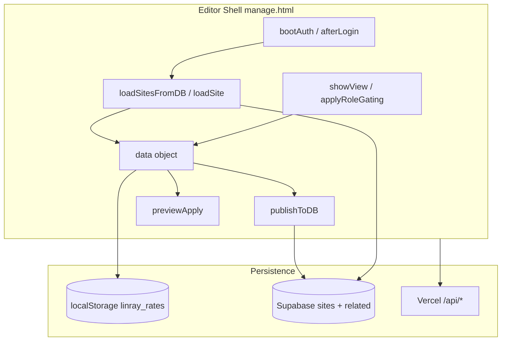
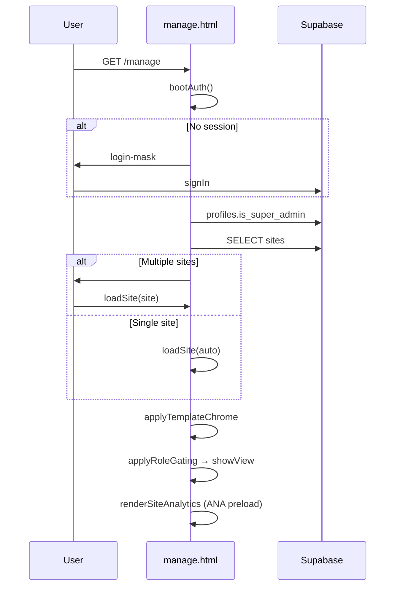
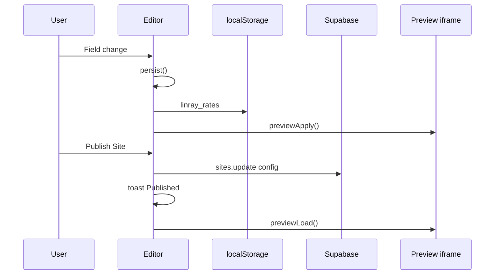
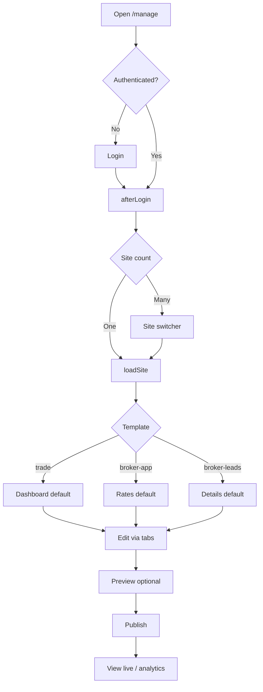
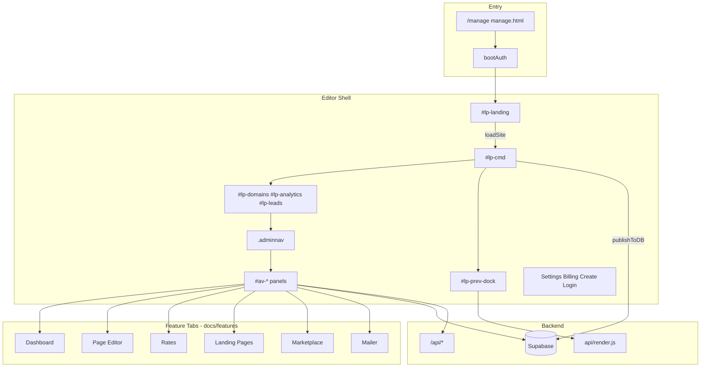
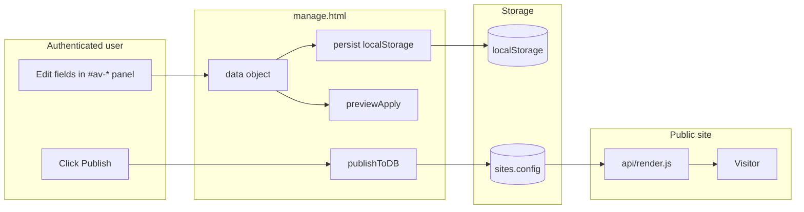
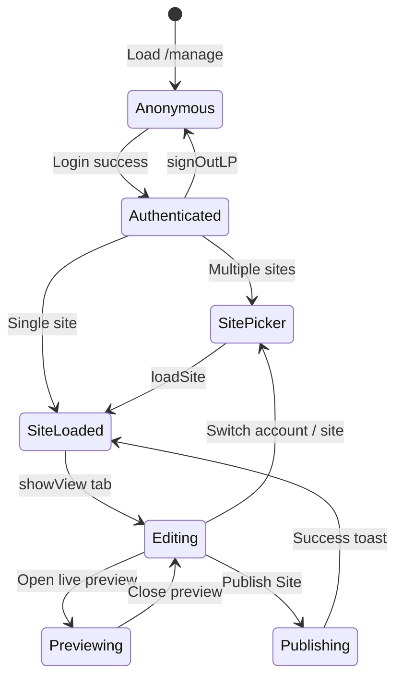

# LeadPages Editor — Complete Engineering Manual

**Document:** `features/Editor`  
**Status:** Definitive engineering reference for the App Command Centre (`manage.html`)  
**Audience:** Engineers rebuilding, extending, or debugging the editor shell; AI development agents  
**Prerequisites:** [00-VISION](../00-VISION.md), [01-ARCHITECTURE](../01-ARCHITECTURE.md), [02-DATABASE](../02-DATABASE.md), [10-EDITOR](../10-EDITOR.md) (deep implementation index)

> **Scope note:** This document describes the **editor shell** — authentication, site loading, navigation, persistence, preview, and tab orchestration in `manage.html`. Feature-specific tabs (Dashboard, Marketplace, Mailer, etc.) have dedicated manuals under `docs/features/`. The numbered canon doc [10-EDITOR](../10-EDITOR.md) remains the exhaustive function index.

---

## Executive Summary

The LeadPages **Editor** is the **App Command Centre** — a single-page application implemented as **`manage.html`** (~5,600 lines of inline HTML, CSS, and JavaScript). It is where site owners, partners, and super-admins create, configure, preview, and publish multi-tenant websites across three templates: `trade`, `broker-leads`, and `broker-app`.

| Fact | Detail |
|------|--------|
| **Entry URL** | `/manage` (also `/manage?site={slug}` deep link) |
| **Implementation** | One IIFE-scoped file; no bundler |
| **Auth** | Supabase (password, OTP, magic link) |
| **State** | In-memory `data` object mirrors `sites.config` JSONB |
| **Persistence** | `localStorage` → optional SEO autosave → explicit **Publish** |
| **Preview** | Same-origin iframe → `__applyTradeConfig` / `__applyAppearance` |
| **Nav model** | `ALLOWED[role] ∩ TEMPLATE_NAV[template]` |

The editor is deliberately a **monolith**: zero build step, deploy-by-push, and one file for partners to reason about. Child features (theme, CRM, billing, etc.) plug into the shell via tab panels (`#av-*`), injected strips (`#lp-*`), and overlay pages (`#settings-page`).

---

## Purpose

### Product purpose

Provide a **professional command centre** for managing LeadPages sites without code:

- Pick or create a site
- Edit content, design, rates, or apps through role-appropriate tabs
- Preview changes on the real render path
- Publish deliberately to production
- Operate billing, domains, leads, and campaigns from one shell

### Engineering purpose

- **Single orchestration layer** for Supabase + Vercel APIs
- **Template branching** without separate apps per vertical
- **Role gating** so one URL serves super-admin, partner, and client
- **Shared globals** (`currentSiteId`, `data`, module caches) consumed by all feature tabs

---

## Business Purpose

| Stakeholder | Value |
|-------------|-------|
| **Tradies (trade template)** | Dashboard + page editor + marketplace — self-serve site management |
| **Mortgage brokers (broker-app)** | Calculator suite + appearance + SEO pages — rate updates without developer |
| **Partners** | Multi-site switcher, client-safe UI, mailer, marketplace upsell |
| **LeadPages platform** | Hosted SaaS control plane; billing gate; publish gate protects live quality |
| **Super-admin** | Full access: plans, demos, delete, global analytics, service packs |

The editor is the **primary retention surface** — users return here to see leads, publish updates, and pay hosting.

---

## User Types

| Role | Detection | Editor experience |
|------|-----------|-------------------|
| **super** | `profiles.is_super_admin` | All tabs (where template allows); site switcher segments; plans; danger zone |
| **broker** | Default authenticated non-super | Partner/client management tabs; no super-only settings |
| **leads** | Legacy demo login `demo/demo` | **Rates tab only** — calculator demo |
| **Site owner** | `sites.owner_email` matches session | Single-site trade sites; support contact card |

| Template | Primary users | Default landing tab |
|----------|---------------|---------------------|
| `trade` | Tradies, partners | **Dashboard** |
| `broker-leads` | Broker landing clients | **Details** |
| `broker-app` | Calculator brokers | **Rates & leads** |

---

## Permissions

### Role × template matrix

```javascript
const ALLOWED = {
  super:  ['rates','landing','appearance','contact','logo','users',
           'demothemes','details','mailer','apps','dashboard'],
  broker: ['appearance','contact','logo','landing','details',
           'mailer','apps','dashboard'],
  leads:  ['rates']
};

const TEMPLATE_NAV = {
  'broker-app':   ['rates','landing','appearance','contact','logo','users','demothemes','mailer'],
  'broker-leads': ['details','mailer'],
  'trade':        ['dashboard','details','landing','apps','mailer']
};
```

Effective visibility: `applyRoleGating()` filters `NAV` buttons and `#av-*` panels.

### Additional gates

| Gate | Function | Effect |
|------|----------|--------|
| **Auth** | `gate()` / `bootAuth()` | Login mask if no session |
| **Billing lock** | `lpBillingGate()` | Full-screen `#bill-lock` overlay |
| **Super-only UI** | `currentRole==='super'` checks | Plans, delete, demo flags, global analytics |
| **Owner-only card** | `lpRenderSupportContact()` | Partner support widget for site owners |
| **RLS** | Supabase policies | Server-side scope on `sites`, `leads`, etc. |

---

## Editor Layout

```text
┌─────────────────────────────────────────────────────────────────┐
│  #lp-landing (site switcher overlay — multi-site accounts)      │
├─────────────────────────────────────────────────────────────────┤
│  Header: logo, title, broker rates bar OR hidden for trade      │
├─────────────────────────────────────────────────────────────────┤
│  #lp-cmd — Command bar (trade / broker-leads)                   │
│  Publish · Preview · Settings · Billing · Domains · Scope · …   │
├─────────────────────────────────────────────────────────────────┤
│  #lp-domains — My domains strip                                 │
│  #lp-analytics — Stats pills (hidden for trade)                 │
│  #lp-leads — Captured leads strip (hidden for trade)            │
├─────────────────────────────────────────────────────────────────┤
│  .adminnav — Main tab buttons (#nav-*)                            │
├─────────────────────────────────────────────────────────────────┤
│  #av-dashboard | #av-details | #av-rates | #av-landing | …      │
│  (exactly one #av-* panel visible via showView)                 │
├─────────────────────────────────────────────────────────────────┤
│  #lp-prev-dock — Live preview iframe (optional, side/bottom)    │
├─────────────────────────────────────────────────────────────────┤
│  Overlays: #login-mask, #settings-page, #cs-ov, billing,        │
│  #lp-bk-panel, #lp-scope-panel, plans, suspended editor         │
├─────────────────────────────────────────────────────────────────┤
│  FABs: #lp-bk-btn, #lp-scope-btn (hidden for trade)             │
│  #toast — flash notifications                                   │
└─────────────────────────────────────────────────────────────────┘
```

### Template chrome

`applyTemplateChrome()` toggles:

- **broker-app:** rates bar visible, `#lp-cmd` hidden, calculator-focused copy
- **trade / broker-leads:** `#lp-cmd` visible, rates bar hidden, publish-oriented copy

---

## Navigation

### Level 0 — Boot & auth

`bootAuth()` → session or `#login-mask`

### Level 1 — Site switcher (`#lp-landing`)

Segments (role-gated): Customer · Partner · Demos · App demos · My listing  
Search, sort, favourites, **+ New Site** → `#cs-ov`

See [Site Builder](Site%20Builder.md).

### Level 2 — Command bar (`#lp-cmd`)

`ensureSiteBar()` injects: **Publish Site**, **View Live**, **Live Preview**, **Settings**, **Billing**, **Domains**, **Scope**, **Backups**, mode toggle (Classic/Standard).

### Level 3 — Injected strips

| Strip | ID | Trade behaviour |
|-------|-----|-----------------|
| Analytics | `#lp-analytics` | Hidden — stats on [Dashboard](Dashboard.md) |
| Domains | `#lp-domains` | Always shown when domains exist |
| Leads CRM | `#lp-leads` | Hidden — leads on Dashboard |

### Level 4 — Main tabs (`.adminnav`)

`showView(which)` switches `#av-*` panels and calls tab render function from `NAV` array:

```javascript
const NAV = [
  ['dashboard','av-dashboard',renderDashboard],
  ['details','av-details',renderDetails],
  ['rates','av-rates',null],
  ['landing','av-landing',renderSeoPages],
  ['appearance','av-appearance', fn],
  ['contact','av-contact',renderContact],
  ['logo','av-logo',renderLogo],
  ['users','av-users',renderUsers],
  ['demothemes','av-demothemes', fn],
  ['mailer','av-mailer',renderMailer],
  ['apps','av-apps',renderAppsMarketplace]
];
```

### Level 5 — Trade subtabs

Inside **Page editor** (`#av-details`): `TRADE_SUBTABS` chip row + `#lsub-body` — 40+ sections in six UI groups. See [Pages](Pages.md), [Theme Engine](Theme%20Engine.md).

### Level 6 — Overlays

Settings, Billing, Create Site, Plans, Suspended page editor — full-screen or card overlays on top of shell.

---

## Widgets

| Widget | Location | Render / init |
|--------|----------|---------------|
| **Login mask** | `#login-mask` | `buildLogin()` |
| **Site switcher** | `#lp-landing` | `showLanding()`, `renderLanding()` |
| **Command bar** | `#lp-cmd` | `ensureSiteBar()` |
| **Tab panels** | `#av-*` | Per-tab `render*` functions |
| **Live preview dock** | `#lp-prev-dock` | `previewInit()`, `previewOpen()` |
| **Toast** | `#toast` | `toast(msg)` |
| **Settings page** | `#settings-page` | `openSettingsPage()` |
| **Billing overlay** | dynamic | `openBillingPage()` |
| **Backups panel** | `#lp-bk-panel` | `lpBkOpen()` — see [Backups](Backups.md) |
| **Scope panel** | `#lp-scope-panel` | `lpScopeOpen()` |
| **Support card** | `#lp-support-card` | `lpRenderSupportContact()` |
| **Icon picker modal** | dynamic | `openIconPicker()` |
| **Create site overlay** | `#cs-ov` | `openCreateSite()` |

---

## Statistics

The editor shell does not own a dedicated statistics UI for trade sites. Analytics are **delegated**:

| Template | Stats UI | Init |
|----------|----------|------|
| `broker-app`, `broker-leads` | `#lp-analytics` pills | `renderSiteAnalytics()` |
| `trade` | [Dashboard](Dashboard.md) tab | Same `anaFetchSite()` preload |

`renderSiteAnalytics()` always runs on `loadSite()` to populate `ANA` cache even when pills are hidden.

See [Analytics](Analytics.md), [Tracking](Tracking.md).

---

## Quick Actions

| Action | Control | Handler |
|--------|---------|---------|
| **Publish** | Command bar | `publishToDB()` |
| **Live preview** | Command bar / toggle | `previewOpen()`, `previewApply()` |
| **View live site** | Command bar / domains | `lpLiveUrl()` |
| **Settings** | Command bar | `openSettingsPage()` |
| **Billing** | Command bar | `openBillingPage()` |
| **Switch site** | Landing or bar dropdown | `loadSite()` |
| **Sign out** | Top link | `signOutLP()` |
| **Import / export JSON** | Rates bar [broker-app] | `btn-import`, `btn-download` |
| **New site** | Landing / super bar | `openCreateSite()` |
| **Save backup** | FAB or Dashboard | `lpBkSave()` |

---

## Recent Activity

The editor shell surfaces activity indirectly:

| Surface | Content |
|---------|---------|
| **Analytics strip** | Recent events, lead snippets in metric detail |
| **CRM strip** | `lpTimelineHTML()` — page views, calls, forms |
| **Dashboard** (trade) | Activity chart + recent leads |
| **Mailer tab** | Recent campaigns list |

No global “activity feed” exists at the shell level.

---

## Site Selection

| Mechanism | Code |
|-----------|------|
| **Landing grid** | `showLanding()` → `renderLanding()` → `loadSite(s)` |
| **Deep link** | `?site={slug}` in `loadSitesFromDB()` |
| **Single site skip** | Auto `loadSite(allSites[0])` |
| **Bar dropdown** | `ensureSiteBar()` `<select>` |
| **Post-create** | `createSiteSubmit()` → `loadSite(res.data)` |

Globals updated on every `loadSite(site)`:

`currentSiteId`, `currentSiteSlug`, `currentSiteTemplate`, `currentBusinessName`, `currentCustomDomain`, `currentOwnerEmail`, `data`

See [Site Builder](Site%20Builder.md).

---

## Notifications

| Type | Implementation |
|------|----------------|
| **Toast** | `toast(msg)` — 1.8s flash on `#toast` |
| **Login errors** | `#li-err` inline text |
| **Billing lock** | Modal overlay with pay CTA |
| **Confirm dialogs** | `confirm()` for delete, restore, import |
| **Publish feedback** | `toast('Published')` or error message |
| **Instagram OAuth** | Fixed banner from `?ig=` query param |
| **Lead email** | Configured in quote form — not editor toast |

No push notifications or in-app notification center at shell level.

---

## Data Sources



### In-memory modules

| Object | Purpose |
|--------|---------|
| `data` | Working `sites.config` (+ broker rates) |
| `allSites` | Cached site list |
| `ANA` | Analytics cache |
| `MAILER` | Mailer compose state |
| `LPL` | Landing switcher state |
| `LPDOM` | Domains strip |
| `LPLEADS` | CRM strip |
| `_siteApps` | Marketplace reconcile cache |

---

## API Calls

Shell-level and cross-tab endpoints (feature docs cover specialists):

| Endpoint | Method | Used by |
|----------|--------|---------|
| `/api/stats` | GET | `anaFetchSite` → all analytics surfaces |
| `/api/cloudinary/sign` | POST | Image uploads (all editors) |
| `/api/cloudinary/delete` | POST | Asset cleanup |
| `/api/billing/status` | GET | `lpBillingGate` |
| `/api/billing/portal` | POST | Billing overlay |
| `/api/billing/checkout` | POST | Checkout |
| `/api/billing/plans` | GET/POST | Plan builder [super] |
| `/api/send-campaign` | GET/POST | Mailer tab |
| `/api/api-apps` | GET | Marketplace catalog |
| `/api/api-site-apps` | GET/POST | App enable/disable |
| `/api/api-partner-templates` | GET/POST | Partner layout templates |
| `/api/site/support-contact` | GET | Owner support card |
| `api/render.js` | GET | Preview iframe src |

Direct Supabase client (`sb`) handles `sites`, `profiles`, `leads`, `events`, `domains`, `site_backups`, `service_packs`, `demo_themes`, `partner_themes`, `email_optouts`.

---

## Database Tables

| Table | Shell operations |
|-------|------------------|
| **`sites`** | SELECT all visible; INSERT create; UPDATE publish; DELETE super |
| **`profiles`** | SELECT `is_super_admin` |
| **`partners`** | SELECT for landing segments |
| **`leads`** | SELECT counts on landing; CRM/mailer tabs |
| **`events`** | SELECT analytics fallback |
| **`domains`** | SELECT domains strip |
| **`site_backups`** | Backup feature |
| **`site_apps`** | Reconcile on `loadSite` (trade) |
| **`service_packs`** | Super trade pack admin |
| **`demo_themes` / `partner_themes`** | Demo themes tab |
| **`email_optouts`** | Mailer opt-out |

Full schema: [02-DATABASE](../02-DATABASE.md).

---

## Related Files

| File | Role |
|------|------|
| **`manage.html`** | **Production editor** — all logic |
| `api/manage.html` | Legacy duplicate — **do not edit** |
| `trade.template.json` | Trade public shell + `__applyTradeConfig` |
| `broker.template.json` | Broker landing hydration |
| `brokerapp.template.json` | Calculator + `__applyAppearance` |
| `agency.template.json` | Partner home `__applyAgencyConfig` |
| `icons.js` | `window.LP_ICONS` for icon picker |
| `events.js` | Public tracking beacon |
| `api/render.js` | Server render for preview + live |
| `api/stats.js` | Analytics aggregation |
| `api/leads.js` | Form capture |
| `docs/10-EDITOR.md` | Exhaustive function index (~445 functions) |
| `docs/features/*.md` | Feature-layer manuals (this series) |

---

## Functions

### Boot & auth

| Function | Purpose |
|----------|---------|
| `bootAuth()` | Magic link, session restore, login routing |
| `afterLogin()` | Load sites, role gate, editor mode |
| `buildLogin()` / `showLogin()` / `lpLogin()` | Login UI |
| `signOutLP()` | Sign out + reload |

See [Authentication](Authentication.md).

### Site lifecycle

| Function | Purpose |
|----------|---------|
| `loadSitesFromDB()` | Fetch sites; landing vs auto-load |
| `loadSite(site)` | Hydrate `data`; template branch; render init |
| `createSiteSubmit()` | INSERT new site |
| `deleteSiteFlow()` | Super delete with confirm |
| `applyTemplateChrome()` | Broker vs trade DOM |
| `applyRoleGating()` | Tab visibility |

See [Site Builder](Site%20Builder.md).

### Navigation

| Function | Purpose |
|----------|---------|
| `showView(which)` | Tab switch + render callback |
| `tplNav()` | Template tab list |
| `initEditorMode()` | Classic / Standard mode |

### Persistence & publish

| Function | Purpose |
|----------|---------|
| `persist()` | `localStorage.linray_rates` |
| `lpAutosave()` / `lpSaveDB()` | SEO pages debounced save |
| `publishToDB()` | **Production save** to `sites` |
| `siteConfigForSave()` | Strip editor-only keys (broker-app) |

See [Publishing](Publishing.md).

### Preview

| Function | Purpose |
|----------|---------|
| `previewOpen()` / `previewClose()` | Toggle dock |
| `previewLoad()` | Set iframe `src` with cache buster |
| `previewApply()` | Call hydration on `contentWindow` |
| `lpFrame()` | Iframe element accessor |

See [Live Preview](Live%20Preview.md).

### Overlays

| Function | Purpose |
|----------|---------|
| `openSettingsPage()` / `closeSettingsPage()` | Settings |
| `openBillingPage()` | Billing |
| `openCreateSite()` | Create site |
| `ensureSiteBar()` | Command bar injection |
| `toast(msg)` | User feedback |

**~445 functions** total — full alphabetical index in [10-EDITOR](../10-EDITOR.md#appendix-complete-function-index-managehtml).

---

## Event Flow

### Session → first paint



### Edit → publish



---

## User Journey



---

## Performance Considerations

| Technique | Location | Rationale |
|-----------|----------|-----------|
| `persist()` to localStorage | Every keystroke | Cheap crash protection |
| Debounced `lpAutosave` (1s) | SEO pages | Limit Supabase writes |
| `previewApply()` without reload | Trade edits | Avoid iframe churn |
| Lazy marketplace load | `_loadAppsView` on tab open | Defer heavy fetch |
| Server-side `/api/stats` | Analytics | Aggregate on server |
| Single preview iframe | `#lp-prev-frame` | Memory bound |
| `hide-inactive` filters | Section lists | Smaller DOM |

**Risk:** Full tab re-render on every `showView()` (e.g. `renderDashboard` rebuilds HTML). Acceptable at current scale; feature docs note per-tab optimisations.

---

## Security Considerations

| Topic | Detail |
|-------|--------|
| **Supabase anon key** | Embedded in HTML — relies on RLS |
| **JWT in memory** | Standard session; XSS risk if injected |
| **Super-admin** | UI + `profiles` flag; direct browser writes need RLS backup |
| **Billing gate** | Blocks UI when account locked |
| **Cloudinary sign** | Bearer required; folder scoped per site |
| **Delete site** | Double confirm; super only |
| **Publish** | Full config write — no server schema validation today |

See [Authentication](Authentication.md), [Billing](Billing.md).

---

## Technical Debt

| ID | Issue | Impact |
|----|-------|--------|
| TD-E1 | **~5,600-line monolith** | Hard to test and review |
| TD-E2 | **`api/manage.html` duplicate** | Drift (e.g. missing trade dashboard) |
| TD-E3 | **No global undo** | Trade edits need backup restore |
| TD-E4 | **Trade publish not autosaved** | Unpublished work lost if localStorage cleared |
| TD-E5 | **Anthropic from browser** | `aiGenerate()` — key exposure risk |
| TD-E6 | **`renderLandingSub` 800+ lines** | Unmaintainable nested block |
| TD-E7 | **445 functions one scope** | Collision risk; no modules |
| TD-E8 | **Leads role legacy** | `demo/demo` path barely used |
| TD-E9 | **Mixed persistence models** | localStorage + partial autosave + publish confuses users |

---

## Future Improvements

1. **ES module split** — `editor/auth`, `editor/nav`, `editor/publish`, etc.
2. **Server publish API** — validate config schema before write
3. **Draft autosave (trade)** — optional unpublished draft column
4. **Global undo/redo** — keyboard shortcuts
5. **TypeScript config types** — catch field typos at build time
6. **Remove `api/manage.html`** — single source of truth
7. **Realtime collab** — Supabase presence for multi-editor
8. **Feature doc cross-links** — auto-generated nav from `docs/features/INDEX`

---

## Editor Architecture



---

## Connections to Child Features

The editor shell **orchestrates** but does not implement these features in depth — see linked manuals:

| Feature doc | Connection to editor shell |
|-------------|---------------------------|
| [Dashboard](Dashboard.md) | Default trade tab; `#av-dashboard` |
| [Site Builder](Site%20Builder.md) | `#lp-landing`, `loadSite`, create site |
| [Authentication](Authentication.md) | `bootAuth`, login mask, roles |
| [Settings](Settings.md) | `#settings-page` overlay |
| [Theme Engine](Theme%20Engine.md) | Trade subtabs, `data.theme` |
| [Theme Packs](Theme%20Packs.md) | Demo themes tab, saved themes |
| [Service Packs](Service%20Packs.md) | Trade starter content, `service_packs` |
| [Pages](Pages.md) | `#av-landing`, SEO editor |
| [SEO](SEO.md) | Meta, pages array |
| [Live Preview](Live%20Preview.md) | `#lp-prev-dock`, `previewApply` |
| [Publishing](Publishing.md) | `publishToDB`, command bar |
| [Forms](Forms.md) | Quote form sections in Page editor |
| [Lead Capture](Lead%20Capture.md) | Public `/api/leads` → CRM surfaces |
| [Tracking](Tracking.md) | `events.js` → `ANA` |
| [Analytics](Analytics.md) | `#lp-analytics` / Dashboard stats |
| [CRM](CRM.md) | `#lp-leads`, mailer recipients |
| [Domains](Domains.md) | `#lp-domains`, settings domain field |
| [Dreamscape](Dreamscape.md) | Link to `manage-domains.html` |
| [Cloudinary](Cloudinary.md) | `cwUpload` pipeline |
| [Image Library](Image%20Library.md) | Pickers in section editors |
| [Backups](Backups.md) | `lpBk*`, Dashboard card |
| [Marketplace](Marketplace.md) | `#av-apps`, `_reconcileSiteApps` |
| [Email Campaigns](Email%20Campaigns.md) | `#av-mailer` |
| [Billing](Billing.md) / [Stripe](Stripe.md) | Gates and overlays |
| [Partner Dashboard](Partner%20Dashboard.md) | Separate HTML; links to `/manage?site=` |
| [Partner CRM](Partner%20CRM.md) | Partner-facing lead views |
| [Instagram](Instagram.md) | OAuth return toast; IG sections |
| [Project Feed](Project%20Feed.md) | Trade section in Page editor |

---

## Data Flow



---

## User Flow



---

## Glossary

| Term | Meaning |
|------|---------|
| **App Command Centre** | Product name for the editor UI |
| **`data`** | In-memory working copy of site configuration |
| **Publish** | Explicit write of config to `sites` table for live visitors |
| **Hydration** | `__applyTradeConfig` / `__applyAppearance` applying config to DOM |
| **Classic / Standard mode** | Editor UI density toggle for partners |

---

*Last updated: July 2026 — reflects `manage.html` editor shell on `main`. Deep function index: [10-EDITOR](../10-EDITOR.md).*
