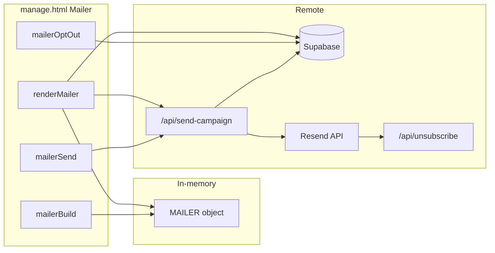
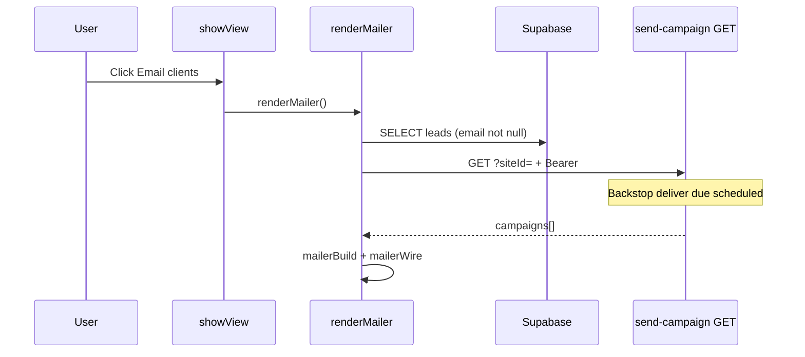
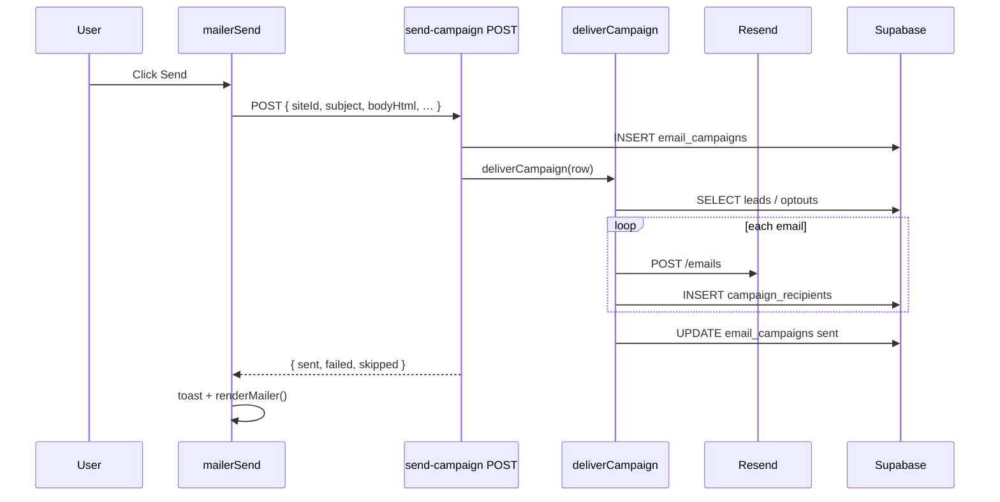
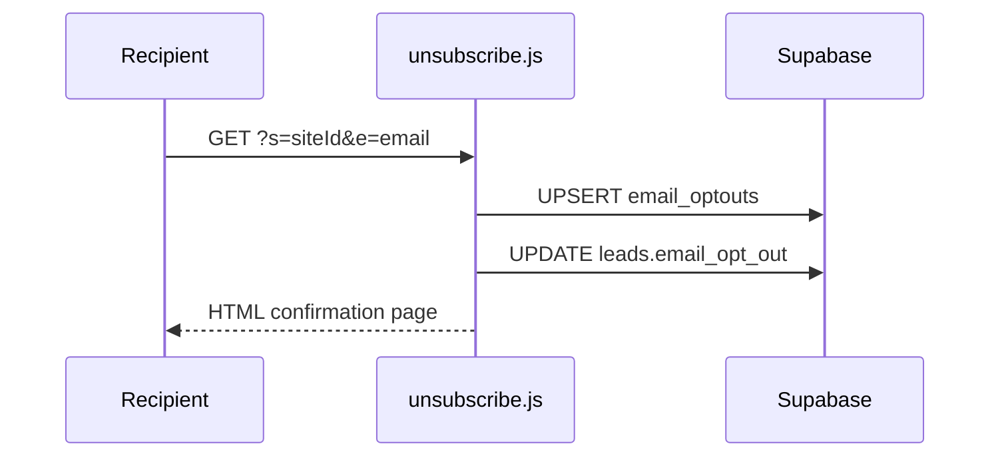
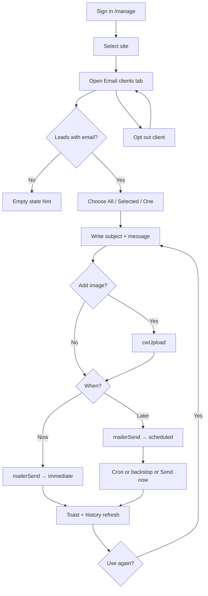
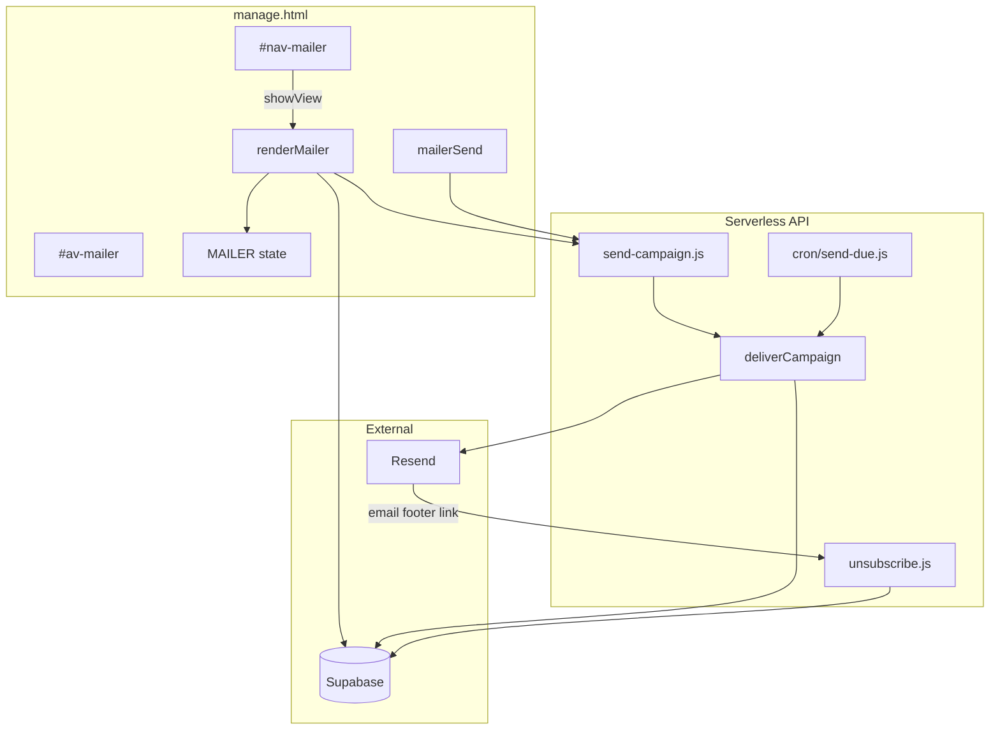
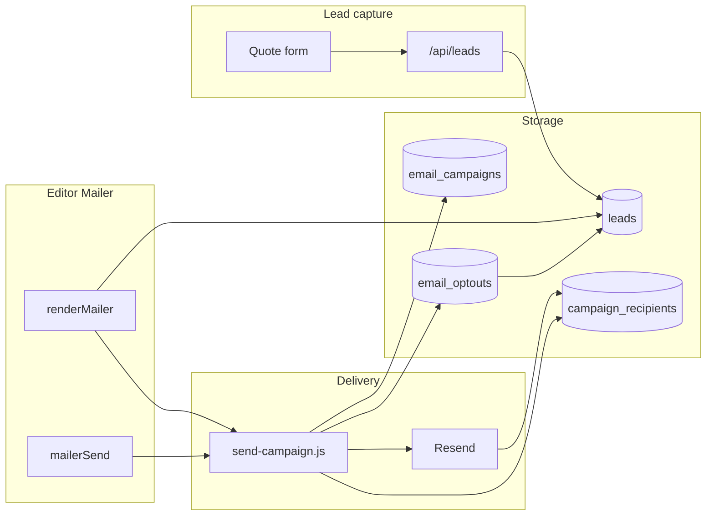
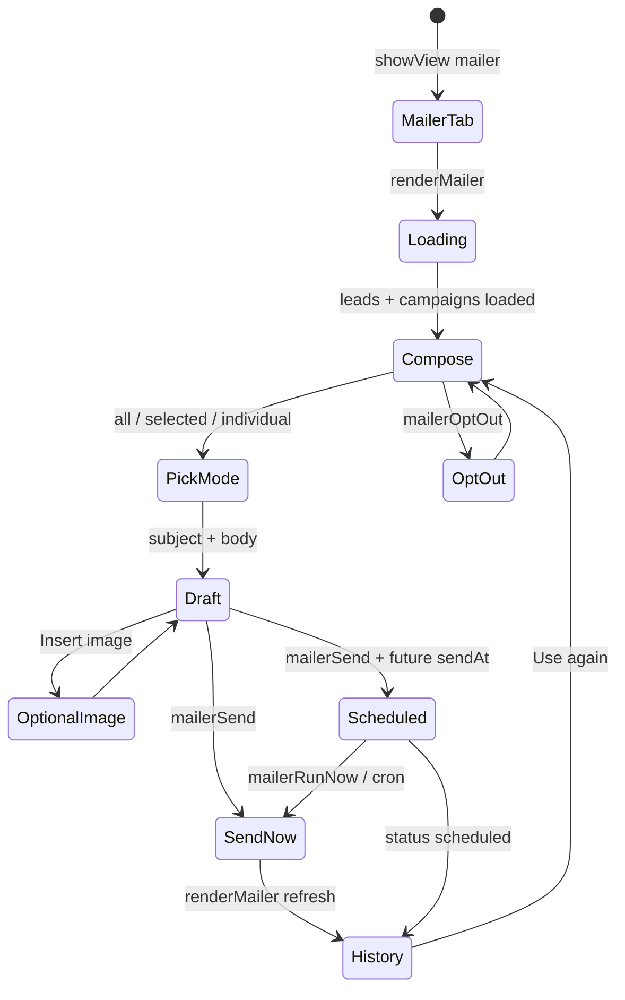

# Email Campaigns — Complete Engineering Manual

**Document:** `features/Email Campaigns`  
**Status:** Definitive engineering reference for the per-site client mailer in the editor  
**Audience:** Engineers rebuilding, extending, or debugging Email Campaigns; AI development agents  
**Prerequisites:** [00-VISION](../00-VISION.md), [01-ARCHITECTURE](../01-ARCHITECTURE.md), [09-CRM](../09-CRM.md), [10-EDITOR](../10-EDITOR.md), [features/Dashboard](Dashboard.md)

> **Scope note:** This document describes the **Email clients** tab (`#av-mailer`) inside `manage.html` and the server pipeline in `api/send-campaign.js`. It is **not** lead notification email on form submit (Resend from `api/leads.js`), partner message alerts (`notify-message.js`), or a full ESP like Mailchimp.

---

## Executive Summary

Email Campaigns is the **built-in mini-newsletter** for LeadPages site owners. A logged-in editor composes a subject and plain-text message in the **Email clients** tab, picks recipients from captured leads, optionally attaches a hero image, and either sends immediately or schedules delivery. The backend stores each send as an `email_campaigns` row, delivers per-recipient mail through **Resend**, records outcomes in `campaign_recipients`, and honours opt-outs via `leads.email_opt_out` and the `email_optouts` table.

Implementation splits cleanly:

| Layer | Location | Role |
|-------|----------|------|
| **UI** | `manage.html` — `#av-mailer`, `MAILER`, `renderMailer`, `mailerSend` | Compose, pick clients, schedule, history |
| **API** | `api/send-campaign.js` | Auth, persist campaign, `deliverCampaign`, GET history |
| **Cron** | `api/cron/send-due.js` | Claim and send scheduled campaigns (shared `deliverCampaign`) |
| **Unsubscribe** | `api/unsubscribe.js` | Public one-click opt-out from email footer |

| Fact | Detail |
|------|--------|
| **DOM** | `#av-mailer` (hidden panel), `#nav-mailer` (tab label: “Email clients”) |
| **Template gate** | `TEMPLATE_NAV.*` includes `mailer` on `trade`, `broker-app`, `broker-leads` |
| **Role gate** | `super` and `broker` only (`leads` role has no mailer) |
| **Entry** | `showView('mailer')` → `renderMailer()` |
| **Client state** | Global `MAILER` object (mode, selection, schedule, draft fields) |
| **Send API** | `POST /api/send-campaign` with Supabase Bearer token |
| **History API** | `GET /api/send-campaign?siteId=` (also backstop-delivers due scheduled rows) |
| **Email provider** | Resend (`RESEND_API_KEY`) |
| **From address** | `CAMPAIGN_FROM` or `LEADS_FROM` env |

---

## Purpose

### Product purpose

Site owners (tradies, brokers) capture leads through quote forms. Email Campaigns lets them **re-engage those contacts** without exporting CSVs to a third-party newsletter tool:

1. **Who** — all leads with email, a checked subset, or one individual.
2. **What** — subject, multi-paragraph message, optional banner image.
3. **When** — send now or schedule in a chosen timezone.
4. **Compliance** — per-lead opt-out in the UI; automatic unsubscribe link and `List-Unsubscribe` headers in every email.

Recent campaigns appear in a history card with status badges, sent counts, **Send now** (for scheduled), and **Use again** (clone into composer).

### Engineering purpose

- **Reuse CRM data** — recipient list comes from `leads` rows with non-null `email`.
- **Single delivery routine** — `deliverCampaign()` exported from `send-campaign.js` and reused by cron and GET backstop.
- **Idempotent sends** — `campaign_recipients` deleted before re-delivery; status claim (`scheduled` → `sending`) prevents double-send races.
- **No direct campaign writes from browser** — UI never `.insert()` into `email_campaigns`; all persistence goes through the API with service role.

---

## Business Purpose

| Stakeholder | Value |
|-------------|-------|
| **Site owner** | Stay top-of-mind with past enquirers; promote seasonal offers |
| **Partner / broker** | Clients self-serve email without Mailchimp training |
| **LeadPages (platform)** | Retention and differentiation vs static brochure sites |
| **Recipients** | One-click unsubscribe; clear “you enquired with …” footer |

Campaigns complement **transactional** lead notification (instant email on form submit) with **marketing-style** bulk updates — same Resend stack, different template and consent model.

---

## User Types

| User | Sees Mailer tab? | Typical journey |
|------|------------------|-----------------|
| **Super-admin** | Yes, on sites where template includes `mailer` | Impersonates client site → Mailer → test send |
| **Broker / partner** | Yes | Opens client trade site → sends update to all leads |
| **Site owner** (customer login) | Yes, if role + template allow | Dashboard → review leads → Mailer → schedule offer |
| **Leads-only demo** (`leads` role) | **No** — only `rates` tab | Calculator demo |
| **Public visitor** | N/A | Receives email; may click unsubscribe link |

**Not in scope:** Partners bulk-emailing across **multiple** client sites from `partner-dashboard.html` — that page is read-only leads; mailer is per-site in `/manage`.

---

## Permissions

Visibility follows the same intersection as other editor tabs:

```text
visible tabs = ALLOWED[currentRole] ∩ TEMPLATE_NAV[currentSiteTemplate]
```

From `manage.html`:

```javascript
const ALLOWED = {
  super:   [..., 'mailer', 'dashboard', ...],
  broker:  [..., 'mailer', 'dashboard', ...],
  leads:   ['rates']
};
const TEMPLATE_NAV = {
  'trade':        ['dashboard', 'details', 'landing', 'apps', 'mailer'],
  'broker-app':   [..., 'mailer'],
  'broker-leads': ['details', 'mailer']
};
```

| Layer | Mechanism |
|-------|-----------|
| **Nav button** | `#nav-mailer` hidden until `applyRoleGating()` |
| **Panel** | `#av-mailer` hidden until `showView('mailer')` |
| **`POST /api/send-campaign`** | Valid Supabase JWT required (`requireUser`) |
| **Site access check** | ⚠️ **Not enforced server-side today** — API trusts `siteId` in body (see Technical Debt) |
| **Leads list** | Direct Supabase SELECT on `leads` — subject to RLS for authenticated editor |
| **Opt-out toggle** | Direct Supabase UPDATE on `leads` + upsert/delete `email_optouts` |
| **Billing lock** | `lpBillingGate()` blocks entire editor including Mailer |

---

## Mailer Layout

The panel is built in `mailerBuild()` as inline HTML plus `.mlr-*` CSS classes in `manage.html` (lines ~172–196). Vertical structure:

```text
┌─────────────────────────────────────────────────────────────┐
│  CARD 1 — Compose                                           │
│  H2: Email your clients                                     │
│  Lede: N contactable · M opted out                          │
├──────────────────────────┬──────────────────────────────────┤
│  LEFT COLUMN             │  RIGHT COLUMN                     │
│  Who gets this?          │  Subject (#mlr-subject)           │
│  [All | Selected | One]  │  Message (#mlr-body)              │
│  #mlr-picklist           │  Insert image + preview           │
│  (client checkboxes)     │  When: [Send now | Schedule]      │
│                          │  #mlr-sched date/time/tz          │
│                          │  [Send] #mlr-status               │
├──────────────────────────┴──────────────────────────────────┤
│  CARD 2 — Recent campaigns (#mlr-histwrap)                  │
│  Subject · status badge · meta · [Send now] [Use again]     │
└─────────────────────────────────────────────────────────────┘
```

**Client row** (`mlr-crow`): checkbox (disabled if opted out), name, email, **Opted out** badge, **Opt out / Allow** button.

**History row** (`mlr-hrow`): subject, status badge (`sent` = green, `scheduled` = default, else warn), meta line, action buttons.

---

## Navigation

### Tab integration

```javascript
const NAV = [
  // ...
  ['mailer', 'av-mailer', renderMailer],
  // ...
];
```

- Click `#nav-mailer` → `showView('mailer')` → `renderMailer()`.
- Trade nav order: `dashboard` → `details` → `landing` → `apps` → **`mailer`**.

### Cross-links

| From | To |
|------|-----|
| Dashboard → Mailer tab | User journey in [Dashboard](Dashboard.md) |
| Mailer client list | Same `leads` rows as CRM / Dashboard captured leads |
| Campaign email footer | `GET /api/unsubscribe?s={siteId}&e={email}` |
| Image insert | `cwUpload(file, ['mailer'])` → Cloudinary (see Cloudinary feature doc) |

---

## UI Sections (Widgets)

| Section | Element IDs / classes | Loader | Description |
|---------|----------------------|--------|-------------|
| **Header / lede** | inline in card | `mailerBuild` | Contactable vs opted-out counts |
| **Recipient mode** | `.mlr-seg`, `#mlr-picklist` | `mailerBuild`, `mailerWire` | `all` / `selected` / `individual` |
| **Client list** | `.mlr-crow`, `.mlr-pick` | `renderMailer` → Supabase | Up to 1000 leads with email |
| **Composer** | `#mlr-subject`, `#mlr-body` | `mailerCapture` | Plain text → `mailerBodyHtml()` |
| **Image** | `#mlr-imgbtn`, `#mlr-imgfile`, `#mlr-imgprev` | `mailerWire` | Cloudinary upload |
| **Schedule** | `.mlr-when`, `#mlr-sched`, `#mlr-date`, `#mlr-time`, `#mlr-tz` | `mailerWallToUTC` | Local wall time → ISO UTC |
| **Send** | `#mlr-send`, `#mlr-status` | `mailerSend` | POST `/api/send-campaign` |
| **History** | `.mlr-histwrap`, `.mlr-hrow` | `renderMailer` → GET API | Last 8 campaigns |
| **Opt-out** | `.mlr-opt` | `mailerOptOut` | Toggle lead + `email_optouts` |

---

## Recipient Modes

| Mode | `MAILER.mode` | API `recipientMode` | Recipient resolution |
|------|---------------|----------------------|----------------------|
| **All clients** | `all` | `all` | All `leads.email` for site where `email_opt_out` is false; server also skips `email_optouts` |
| **Selected** | `selected` | `selected` | Checked rows in pick list → `recipients[]` in POST body → stored as `recipient_list` |
| **One person** | `individual` | `individual` | Same as selected but client sends at most one email (`recipients.slice(0,1)`) |

Pick list hidden when mode is `all`. Opted-out leads show disabled checkboxes and **Allow** to re-subscribe (manual only — no double opt-in).

---

## Message Composition

### Plain text → HTML

`mailerBodyHtml(text)` splits on blank lines into `<p>` blocks; single newlines become `<br>`. User content is escaped via `_mesc()` before paragraph wrapping.

### Email shell (server)

`wrapHtml()` in `send-campaign.js` wraps the stored `body_html` in a responsive div:

- Optional hero `` from `image_url` (max-width 560px)
- Escaped `<h1>` from subject
- Body div ( **not** re-escaped — trusted editor HTML from own account)
- Footer: “You are receiving this because you enquired with {business}” + unsubscribe link

### Image upload

`cwUpload(file, ['mailer'])` stores URL in `MAILER.imageUrl` and optional `MAILER.imgPid` (Cloudinary public id). Previous campaign images can reload via **Use again** without re-upload.

---

## Scheduling

| Control | Storage | Notes |
|---------|---------|-------|
| Send now / Schedule | `MAILER.schedule` | Toggles `#mlr-sched` visibility |
| Date | `#mlr-date`, `MAILER.date` | Defaults to today (`_mlrToday()`) |
| Time | `#mlr-time`, `MAILER.time` | 15-minute steps, default `09:00` |
| Timezone | `#mlr-tz`, `MAILER.tz` | `MAILER_TZ` preset list; browser TZ as initial default |

**UTC conversion:** `mailerWallToUTC(localDateTime, tz)` uses `Intl.DateTimeFormat` offset iteration (same pattern as other editor schedulers).

**Server rule:** `sendAt` more than **30 seconds** in the future → `status: 'scheduled'`, no immediate delivery. Otherwise → `status: 'sending'` and `deliverCampaign()` runs in the POST handler.

**Timezone column:** Stored on campaign for display only; delivery compares `send_at` (UTC ISO) to `Date.now()`.

---

## Campaign History

Loaded on every `renderMailer()` via:

```http
GET /api/send-campaign?siteId={currentSiteId}
Authorization: Bearer {supabase_access_token}
```

Returns up to **8** recent rows: `id`, `subject`, `body_html`, `image_url`, `recipient_mode`, `status`, counts, `send_at`, `sent_at`, `created_at`.

| Status | Badge | Meta line | Actions |
|--------|-------|-----------|---------|
| `scheduled` | default | `for {local send_at}` | **Send now** (`mailerRunNow`), **Use again** |
| `sent` | ok (green) | `{sent_count} sent[, N failed]` | **Use again** |
| `failed` / `sending` | warn | sent/failed counts if any | **Use again** |

**Send now:** `POST` with `{ action: 'deliver', campaignId }` — bypasses schedule, runs `deliverCampaign`.

**Use again:** `mailerUseAgain(id)` copies subject, body (HTML→text), image, mode into `MAILER` and rebuilds composer — does not auto-send.

### GET backstop

When loading history, the API also finds up to **5** due `scheduled` campaigns for that site, claims them (`scheduled` → `sending`), and calls `deliverCampaign`. This covers a missed cron run when an owner opens the Mailer tab.

---

## Quick Actions

| Action | Trigger | Handler |
|--------|---------|---------|
| **Change recipient mode** | `.mlr-seg` | `mailerCapture` → set `MAILER.mode` → `mailerBuild` |
| **Toggle schedule** | `.mlr-when` | Set `MAILER.schedule` → show/hide `#mlr-sched` |
| **Pick clients** | `.mlr-pick` | Update `MAILER.selected[id]` |
| **Opt out / Allow** | `.mlr-opt` | `mailerOptOut(id, email, bool)` |
| **Insert image** | `#mlr-imgbtn` | File picker → `cwUpload` |
| **Send / Schedule** | `#mlr-send` | `mailerSend()` |
| **Send now (scheduled)** | `[data-runnow]` | `mailerRunNow(id)` |
| **Use again** | `[data-again]` | `mailerUseAgain(id)` |

On successful send, composer fields clear and `renderMailer()` refreshes history. Toasts: `Scheduled ✓` or `Sent to N ✓`.

---

## Site Selection

Mailer always uses **`currentSiteId`** from the editor site context (landing picker, `loadSite`, command-bar dropdown, `/manage?site=` deep link). If no site selected, panel shows “Select a site first.”

Changing sites does not preserve `MAILER` draft across sites — switching site and opening Mailer re-runs `renderMailer()` from scratch.

---

## Notifications

| Type | Mechanism | Relevance |
|------|-----------|-----------|
| **Toast** | `toast(msg)` | Send success, Use again, Run now errors |
| **Inline status** | `#mlr-status` | Working…, error text, sent/skipped counts |
| **Lead form email** | Page editor quote settings | Separate transactional path — not campaigns |
| **Billing lock** | `#bill-lock` | Blocks Mailer tab entirely |

No in-app “campaign delivered” push or email to the site owner when cron fires.

---

## Data Sources



| Source | Table / endpoint | Fields used |
|--------|------------------|-------------|
| Client list | `leads` SELECT | `id`, `name`, `email`, `phone`, `email_opt_out`, `created_at` |
| Campaign history | `GET /api/send-campaign` | `email_campaigns` summary columns |
| Create / send | `POST /api/send-campaign` | Inserts campaign; triggers delivery |
| Opt-out | `leads`, `email_optouts` | `email_opt_out`, composite key |
| Business name | `sites` | `business_name` in email footer |
| Image | Cloudinary via `cwUpload` | `MAILER.imageUrl` → `image_url` column |

---

## API Calls

### `POST /api/send-campaign`

**Auth:** `Authorization: Bearer <supabase access token>`

**Create + send (default body):**

```json
{
  "siteId": "uuid",
  "subject": "Summer special",
  "bodyHtml": "<p>Hi …</p>",
  "imageUrl": "https://…",
  "recipientMode": "all",
  "recipients": [],
  "sendAt": null,
  "timezone": "Australia/Sydney"
}
```

| Field | Validation | Notes |
|-------|------------|-------|
| `siteId` | Required, max 64 chars | ⚠️ No ownership check |
| `subject` | Max 200 chars | Either subject or body required |
| `bodyHtml` | Max 50 000 chars | From `mailerBodyHtml` |
| `recipientMode` | `all` \| `selected` \| `individual` | Default `all` |
| `recipients` | Required for selected/individual | Lowercased emails |
| `sendAt` | ISO string or null | Future >30s → scheduled |

**Response (immediate send):**

```json
{ "ok": true, "campaignId": "…", "scheduled": false, "sent": 12, "failed": 0, "skipped": 1, "total": 13 }
```

**Response (scheduled):**

```json
{ "ok": true, "campaignId": "…", "scheduled": true, "sendAt": "2026-07-10T23:00:00.000Z" }
```

**Deliver existing campaign:**

```json
{ "action": "deliver", "campaignId": "uuid" }
```

### `GET /api/send-campaign?siteId=`

Returns `{ ok: true, campaigns: [...] }`. Runs due-campaign backstop (see above).

### `GET/POST /api/unsubscribe?s=&e=`

Public. Upserts `email_optouts`, sets `leads.email_opt_out = true`. POST returns `ok` for RFC 8058 one-click.

### Resend (internal)

`POST https://api.resend.com/emails` with `List-Unsubscribe` and `List-Unsubscribe-Post` headers.

### Cron

`GET /api/cron/send-due` — processes up to 10 due `scheduled` campaigns per invocation. Optional `Authorization: Bearer {CRON_SECRET}`.

**Note:** `vercel.json` currently lists only `/api/billing/cron`; **`send-due` is not registered as a Vercel Cron** — delivery relies on GET backstop and manual **Send now** until cron is configured (see Technical Debt).

---

## Database Tables

| Table | Mailer usage |
|-------|--------------|
| **`leads`** | Recipient source; `email`, `email_opt_out`; client list query |
| **`email_campaigns`** | Campaign metadata, schedule, aggregate counts, `status` lifecycle |
| **`campaign_recipients`** | Per-email `sent` / `failed` / `skipped_optout`, `error`, `sent_at` |
| **`email_optouts`** | Site-scoped unsubscribe list; checked at send time |
| **`sites`** | `business_name` for wrapper footer |

### `email_campaigns` lifecycle

```text
(scheduled) ──cron/backstop/run now──► (sending) ──deliverCampaign──► (sent)
                                              └── error ──► (failed)
(immediate POST) ──► (sending) ──► (sent)
```

**Important columns:** `subject`, `body_html`, `image_url`, `recipient_mode`, `recipient_list` (json array for non-`all`), `send_at`, `timezone`, `status`, `total_recipients`, `sent_count`, `failed_count`, `sent_at`, `created_by`

### `campaign_recipients.status`

| Value | Meaning |
|-------|---------|
| `sent` | Resend accepted |
| `failed` | Resend error (reason in `error`) |
| `skipped_optout` | In `email_optouts` at send time |

Before each delivery, existing rows for that `campaign_id` are **deleted** so re-send is idempotent.

See [02-DATABASE](../02-DATABASE.md) for full schema notes.

---

## Related Files

| File | Relationship |
|------|--------------|
| **`manage.html`** | **Primary UI** — `MAILER`, `renderMailer`, `mailerSend`, CSS |
| **`api/send-campaign.js`** | **Primary API** — auth, CRUD, `deliverCampaign`, Resend |
| **`api/cron/send-due.js`** | Scheduled sender — imports `deliverCampaign` |
| **`api/unsubscribe.js`** | Public opt-out endpoint linked from emails |
| `api/manage.html` | Legacy duplicate; trade nav **lacks** `dashboard` but includes mailer — keep in sync carefully |
| `api/leads.js` | Creates leads that become mailer recipients; separate notification email |
| `docs/09-CRM.md` | CRM + mailer overview, opt-out model |
| `docs/10-EDITOR.md` | Editor function table for `renderMailer` / `mailerSend` |
| `docs/features/Dashboard.md` | Sibling tab; journey to Mailer |
| `vercel.json` | Cron registration (billing only today) |

---

## Functions

### Client (`manage.html`)

| Function | Lines (approx.) | Role |
|----------|-----------------|------|
| `MAILER` | ~4351 | Global compose state |
| `MAILER_TZ` | ~4353 | Timezone dropdown presets |
| `_mesc(s)` | ~4354 | HTML escape for UI |
| `mailerBodyHtml(t)` | ~4355 | Plain text → `<p>` HTML for API |
| `mailerWallToUTC(local, tz)` | ~4356 | Schedule → ISO UTC |
| `_mlrToday()` | ~4357 | Default date string |
| `_mlrTimeOpts()` | ~4358 | 15-min time `<option>` HTML |
| `mailerCapture()` | ~4359 | Sync DOM → `MAILER` |
| `_mlrHtmlToText(h)` | ~4360 | Reverse HTML for Use again |
| `mailerUseAgain(id)` | ~4361 | Clone campaign into composer |
| `mailerRunNow(id)` | ~4362 | POST `action: deliver` |
| **`renderMailer()`** | ~4363–4369 | Load leads + campaigns; `mailerBuild` |
| **`mailerBuild(box)`** | ~4371–4417 | Render HTML |
| `mailerWire(box)` | ~4419–4429 | Event listeners |
| `mailerOptOut(id, email, v)` | ~4431–4435 | Lead + optouts table |
| **`mailerSend()`** | ~4437–4471 | Validate, POST, refresh |

### Server (`api/send-campaign.js`)

| Function | Role |
|----------|------|
| `requireUser(req)` | JWT → Supabase user |
| `readBody(req)` | Parse JSON body |
| `wrapHtml(...)` | Email template + unsubscribe footer |
| `resendSend(...)` | Single recipient via Resend |
| **`deliverCampaign(campaign)`** | Resolve list, filter opt-outs, send loop, update counts |
| `module.exports` handler | GET history + POST create/deliver |

### Shared dependencies

| Function | Role for Mailer |
|----------|-----------------|
| `showView('mailer')` | Shows panel; calls `renderMailer` |
| `applyRoleGating()` | Tab visibility |
| `loadSite()` | Sets `currentSiteId` |
| `cwUpload()` | Image upload to Cloudinary |
| `toast()` | User feedback |
| `sb.auth.getSession()` | Bearer token for API calls |

---

## Event Flow

### Mailer tab mount



### Send now



### Unsubscribe click



---

## User Journey



**Partner journey:** Review client leads on Dashboard → Mailer → send seasonal promo to **All clients**.

**Recipient journey:** Receive email → click Unsubscribe → excluded from future sends and greyed in pick list.

---

## Performance Considerations

| Area | Behaviour | Risk |
|------|-----------|------|
| **Leads query** | Up to 1000 rows per tab open | Large sites may need pagination |
| **Sequential send** | `deliverCampaign` awaits each Resend call in a loop | Slow for hundreds of recipients; serverless timeout risk |
| **Full re-render** | `mailerBuild` replaces `innerHTML` on mode changes | Acceptable; re-binds listeners via `mailerWire` |
| **GET backstop** | Up to 5 deliveries during history load | Unexpected delay opening Mailer tab if many due |
| **Cron batch** | 10 campaigns × N recipients per run | Same timeout concern |
| **No queue** | No background job system beyond cron | Large blasts block request |

**Recommendations (future):** Batch Resend calls, paginate client list, move delivery to a dedicated queue worker, register Vercel cron.

---

## Security Considerations

| Topic | Detail |
|-------|--------|
| **Authentication** | POST/GET campaign API requires valid Supabase JWT |
| **Authorization gap** | API does **not** verify user owns `siteId` — any logged-in user could POST another site's id if known |
| **HTML injection** | `bodyHtml` stored and embedded in email without server-side sanitization — trusted editor model |
| **XSS in UI** | `_mesc()` on names, emails, subjects in mailer UI |
| **Unsubscribe** | Public GET/POST; only needs `siteId` + email — intentional for one-click compliance |
| **PII** | Client list shows names, emails, phones — editor-only |
| **Secrets** | `RESEND_API_KEY`, service role used server-side only |
| **Opt-out enforcement** | Dual check: `leads.email_opt_out` at list build + `email_optouts` at send |
| **List-Unsubscribe** | RFC 2369 / 8058 headers on every outbound message |

---

## Technical Debt

| ID | Issue | Location | Impact |
|----|-------|----------|--------|
| TD-M1 | **No site ownership check on API** | `send-campaign.js` POST/GET | Cross-tenant send if `siteId` guessed |
| TD-M2 | **`send-due` not in `vercel.json` crons** | `vercel.json` | Scheduled campaigns may not fire unless Mailer opened or manual Send now |
| TD-M3 | **Sequential Resend in one request** | `deliverCampaign` | Timeouts on large lists |
| TD-M4 | **`bodyHtml` unsanitized** | `wrapHtml` | Malicious editor could inject email HTML |
| TD-M5 | **No campaign delete / cancel UI** | Mailer history | Scheduled sends cannot be cancelled in UI |
| TD-M6 | **History limited to 8** | GET API | No pagination or detail drill-down |
| TD-M7 | **`api/manage.html` drift** | Legacy file | Missing dashboard; mailer code duplicated |
| TD-M8 | **Re-subscribe (Allow) only manual** | `mailerOptOut` | No confirmation email to opted-in again |
| TD-M9 | **Individual mode** | Client + server | Client slices to 1; server still accepts many in `recipient_list` if API called directly |
| TD-M10 | **No duplicate-send guard on Run now** | `mailerRunNow` | Re-delivers to full list; recipients rows wiped first |

---

## Future Improvements

1. **Enforce site ACL** on `send-campaign` — match `/api/stats` pattern (JWT + site membership).
2. **Register cron** — add `/api/cron/send-due` to `vercel.json` (e.g. every 5–15 minutes).
3. **Background queue** — chunk Resend calls; return 202 immediately for large campaigns.
4. **Cancel scheduled** — UI + API to revert `scheduled` → cancelled.
5. **Campaign detail view** — per-recipient status from `campaign_recipients`.
6. **Rich text editor** — bold/links with sanitization whitelist.
7. **Template library** — saved snippets per site or partner.
8. **Analytics** — open/click tracking (Resend webhooks).
9. **Align `api/manage.html`** or remove duplicate.
10. **Pagination** — client list and history beyond 8 rows.

---

## Email Campaigns Architecture



---

## Connections to Other Systems

### CRM

Mailer recipients **are** CRM leads with email. Opt-out state is shared:

| Mechanism | CRM | Mailer |
|-----------|-----|--------|
| Lead row | `LPLEADS` / Dashboard list | `#mlr-picklist` |
| Opt-out flag | Not always visible on trade Dashboard | `.mlr-opt`, disabled checkbox |
| Unsubscribe link | Sets opt-out everywhere | Same tables |

See [09-CRM](../09-CRM.md).

### Dashboard

Trade Dashboard shows captured leads read-only; **Email clients** tab is the action surface for bulk email. Nav order places Mailer after Apps.

See [features/Dashboard](Dashboard.md).

### Lead capture

`/api/leads` inserts rows (with email when form collects it). No automatic subscription beyond “they enquired” implied consent — footer text and unsubscribe satisfy typical marketing expectations; legal review is a product concern.

### Cloudinary

Campaign images upload via `cwUpload(file, ['mailer'])` — same pipeline as editor media.

### Billing

`lpBillingGate()` blocks Mailer when account locked — same as Dashboard.

### Partners

Partners edit client sites in `/manage?site=` and can use Mailer on permitted templates. No cross-site campaign from partner dashboard.

See [05-PARTNERS](../05-PARTNERS.md).

---

## Data Flow



---

## User Flow



---

## Environment Variables

| Variable | Used by | Purpose |
|----------|---------|---------|
| `SUPABASE_URL` | send-campaign, cron, unsubscribe | Admin client |
| `SUPABASE_SERVICE_ROLE_KEY` | Same | Bypass RLS for delivery |
| `SUPABASE_ANON_KEY` | `requireUser` | JWT validation client |
| `RESEND_API_KEY` | `resendSend` | Outbound email |
| `CAMPAIGN_FROM` | From address | Preferred sender |
| `LEADS_FROM` | Fallback from | Lead notifications share domain |
| `PUBLIC_BASE_URL` | Unsubscribe link host | Default `https://leadpages.com.au` |
| `CRON_SECRET` | send-due | Optional Bearer guard |

---

## Glossary

| Term | Meaning |
|------|---------|
| **Mailer / Email clients** | UI tab name for campaign composer (`#av-mailer`) |
| **MAILER** | In-memory compose state object in `manage.html` |
| **Campaign** | One row in `email_campaigns` — a single send or scheduled blast |
| **Contactable** | Lead with email and `email_opt_out = false` |
| **deliverCampaign** | Server function that resolves recipients and calls Resend |
| **Backstop** | GET history path that sends overdue scheduled campaigns |
| **Use again** | Clone past campaign content into composer without sending |

---

*Last updated: July 2026 — reflects `manage.html` Mailer and `api/send-campaign.js` on branch `main`.*
