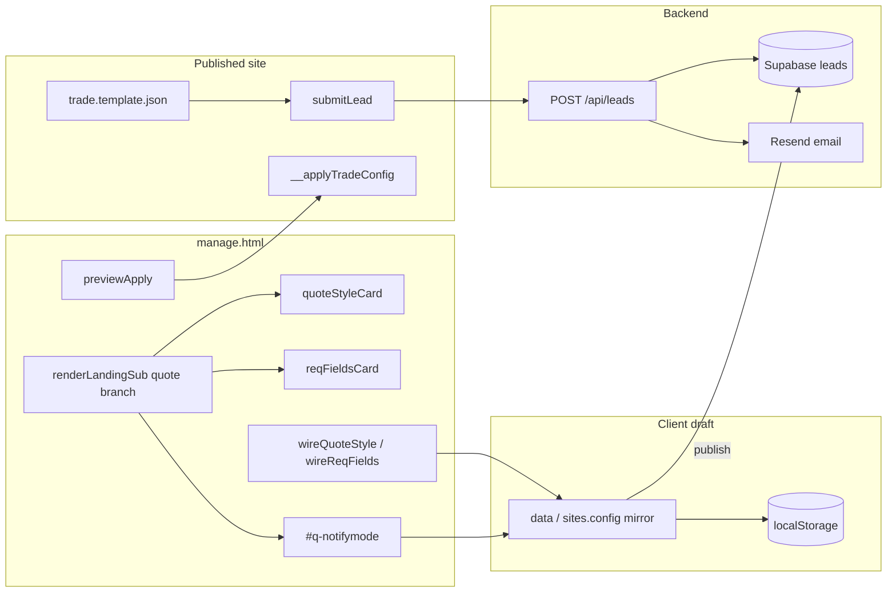
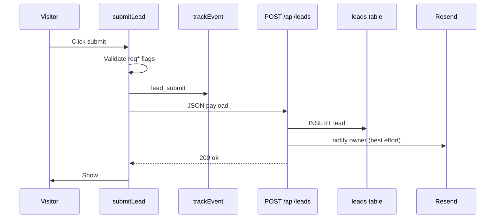
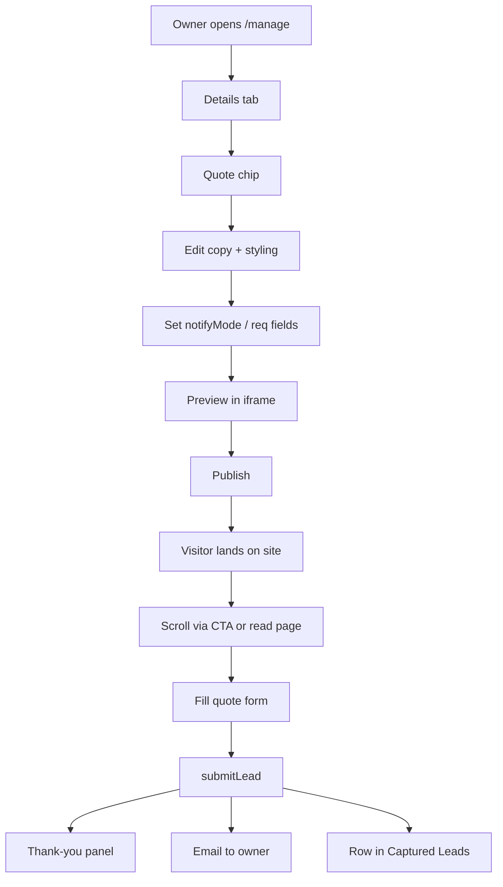
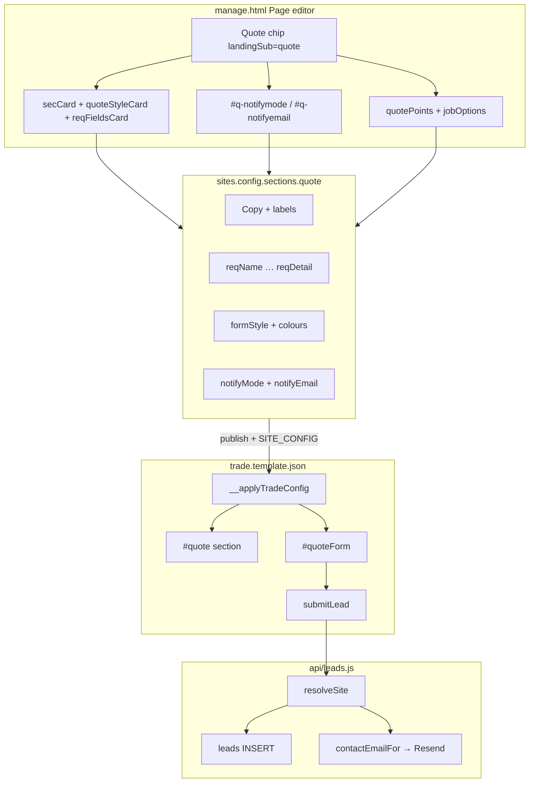
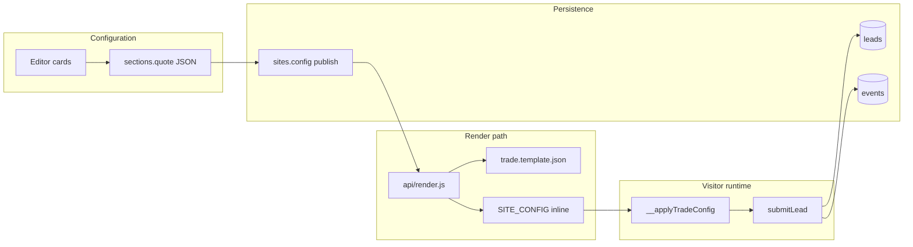
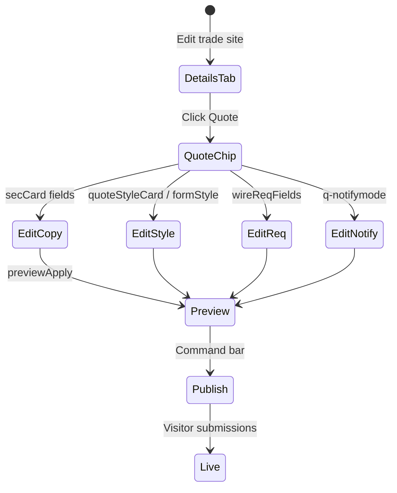

# LeadPages Quote Form — Complete Engineering Manual

**Document:** `features/Forms`  
**Status:** Definitive engineering reference for the trade-site quote form (editor + public template)  
**Audience:** Engineers rebuilding, extending, or debugging lead capture; AI development agents  
**Prerequisites:** [00-VISION](../00-VISION.md), [01-ARCHITECTURE](../01-ARCHITECTURE.md), [10-EDITOR](../10-EDITOR.md), [09-CRM](../09-CRM.md), [07-TRACKING](../07-TRACKING.md)

> **Scope note:** This document covers the **trade template quote form** — the `#quote` section edited in `manage.html` (Page editor → **Quote** chip) and rendered on published sites from `trade.template.json`. It is **not** the broker assessment form (`broker.template.json`), storefront order forms on `tradies.html`, or partner recruitment forms (`/api/partner-lead`).

---

## Executive Summary

The quote form is the **primary lead-capture surface** for trade-template sites. Site owners configure copy, styling, required fields, and notification email in the editor; visitors submit on the live page; submissions are **always stored** in `leads` and **best-effort emailed** to the business contact.

Implementation spans three layers:

| Layer | Location | Role |
|-------|----------|------|
| **Editor UI** | `manage.html` → `renderLandingSub` when `landingSub === 'quote'` | Cards, lists, colour pickers, `#q-notifymode` |
| **Public template** | `trade.template.json` | Static HTML form + `submitLead()` + `__applyTradeConfig` hydration |
| **Ingest** | `api/leads.js` | Resolve site → insert `leads` → Resend notification |

| Fact | Detail |
|------|--------|
| **Config path** | `sites.config.sections.quote` (JSONB) |
| **Editor entry** | Details tab → chip **Quote** (`landingSub='quote'`) |
| **Live DOM** | `#quote` section, `#quoteForm`, `#quoteSuccess` |
| **Submit handler** | `async function submitLead()` in template inline script |
| **API** | `POST /api/leads` — always returns HTTP 200 |
| **Analytics** | `trackEvent('lead_submit', { job, suburb })` |
| **CRM** | `leads` table → Dashboard **Captured Leads** / `#lp-leads` |

---

## Purpose

### Product purpose

Tradespeople need a frictionless way for visitors to request a callback without leaving the page. The quote form answers:

1. **Capture intent** — name, phone, problem type, suburb, optional detail.
2. **Build trust** — eyebrow, heading, trust points beside the form.
3. **Notify immediately** — email to the contact on file or a custom address.
4. **Never lose a lead** — thank-you UI even if email fails.

### Engineering purpose

- **Single form instance** on the page — hero CTAs, promotions, mobile bar, and footer links **scroll to** `#quote` rather than defining separate forms.
- **Config-driven UX** — labels, placeholders, required flags, colours, and `formStyle` applied client-side via `SITE_CONFIG` without re-rendering the template server-side on every keystroke in the editor preview.
- **Separation of storage vs email** — insert is mandatory; Resend is optional (`RESEND_API_KEY`).

---

## Business Purpose

| Stakeholder | Value |
|-------------|-------|
| **Site owner (tradie)** | Instant email + Captured Leads list; configurable copy for their trade |
| **Partner / broker** | Clients self-configure notifications; fewer “I didn’t get the lead” tickets |
| **LeadPages (platform)** | Core conversion mechanic for hosted trade sites |
| **Visitor** | Fast mobile form; success state even during backend issues |

---

## User Types

| User | Interaction |
|------|-------------|
| **Super-admin / broker** | Full Quote sub-editor in `manage.html` |
| **Site owner** | Same editor when granted access |
| **Visitor (public)** | Submits form on published `trade` site |
| **Leads-only demo** (`leads` role) | No access to trade editor — N/A |

---

## Permissions

| Layer | Mechanism |
|-------|-----------|
| **Editor** | Supabase auth + role gate; trade template required (`TEMPLATE_NAV.trade`) |
| **`POST /api/leads`** | Public — no auth (by design for visitor submissions) |
| **`leads` read** | Authenticated editors via RLS; Dashboard / CRM widgets |
| **Notification email** | Resolved server-side in `contactEmailFor()` — not exposed to visitor |

Billing lock (`lpBillingGate`) blocks the entire editor including Quote configuration.

---

## Editor: Quote Form Section

The Quote sub-editor is rendered inside `#lsub-body` when the user selects the **Quote** chip under **Lead Capture & Conversion** in the Page editor (`#av-details`).

### Entry and routing

```text
manage.html
  showView('details')
    → renderDetails()
      → chip click: landingSub = 'quote'
      → renderLandingSub(c)   // sub === 'quote' branch
```

Chip group (from `CORE_GROUPS`):

```text
Lead Capture & Conversion → quote, promotions, faq, estimateBuilder, …
```

`TRADE_SUBTABS` includes `['quote','Quote']` for label lookup; navigation uses section chips, not a separate tab bar.

### Panel structure (top to bottom)

Built in `renderLandingSub` ~3865–3875:

```text
┌─────────────────────────────────────────────────────────────┐
│  SECTION CARD (on toggle): eyebrow, heading, sub, button,   │
│                            formTitle                         │
├─────────────────────────────────────────────────────────────┤
│  FORM STYLE: #q-formstyle (default | feature)               │
├─────────────────────────────────────────────────────────────┤
│  FORM APPEARANCE: quoteStyleCard(c) — colour overrides      │
├─────────────────────────────────────────────────────────────┤
│  TRUST POINTS: listEditor → quotePoints                      │
├─────────────────────────────────────────────────────────────┤
│  FORM FIELD LABELS: lblName … lblDetail, successTitle       │
├─────────────────────────────────────────────────────────────┤
│  REQUIRED FIELDS: reqFieldsCard(c) → wireReqFields(c)       │
├─────────────────────────────────────────────────────────────┤
│  PLACEHOLDERS & FINE PRINT: namePh … callText               │
├─────────────────────────────────────────────────────────────┤
│  #q-callon — clickable phone link in fine print             │
├─────────────────────────────────────────────────────────────┤
│  LEAD EMAIL NOTIFICATIONS: #q-notifymode, #q-notifyemail      │
├─────────────────────────────────────────────────────────────┤
│  PROBLEM OPTIONS: listEditor → jobOptions (dropdown)        │
└─────────────────────────────────────────────────────────────┘
```

Each change calls `persist()` (localStorage draft) and `previewApply()` → iframe `__applyTradeConfig(data)`.

---

## `reqFieldsCard` and `wireReqFields`

### `reqFieldsCard(c)` (~2393–2397)

Renders the **Required fields** card with five checkboxes:

| Element ID | Config key | Label | Default when unset |
|------------|------------|-------|-------------------|
| `#q-req-name` | `reqName` | Name | **required** (`true`) |
| `#q-req-phone` | `reqPhone` | Phone | **required** |
| `#q-req-job` | `reqJob` | Problem | optional |
| `#q-req-suburb` | `reqSuburb` | Suburb | optional |
| `#q-req-detail` | `reqDetail` | Details | optional |

Checkbox state logic:

```javascript
var on = (Q[key] === true) || (Q[key] == null && def);
```

So **Name** and **Phone** are required by default until explicitly set to `false` in config.

### `wireReqFields(c)` (~2398–2402)

Wires `change` listeners on each `#q-req-*` checkbox:

```javascript
function Q() {
  if (!c.sections) c.sections = {};
  if (!c.sections.quote) c.sections.quote = {};
  return c.sections.quote;
}
function w(id, key) {
  var el = $(id);
  if (el) el.addEventListener('change', function () {
    Q()[key] = el.checked;
    persist();
    previewApply();
  });
}
```

### Public-side enforcement

In `trade.template.json`, `__applyTradeConfig` sets HTML5 `required` on inputs:

```javascript
function _rq(id, key, df) {
  var el = qs.querySelector('#' + id);
  if (!el) return;
  var on = (Q[key] === true) || (Q[key] == null && df);
  if (on) el.setAttribute('required', '');
  else el.removeAttribute('required');
}
_rq('name', 'reqName', true);
_rq('phone', 'reqPhone', true);
_rq('email', 'reqEmail', true);   // template only — see Technical Debt
_rq('job', 'reqJob', false);
_rq('suburb', 'reqSuburb', false);
_rq('detail', 'reqDetail', false);
```

`submitLead()` duplicates validation with `_rqd()` and shows a browser `alert` listing missing fields before POST.

---

## `quoteStyleCard` and `wireQuoteStyle`

### Purpose

Beyond the high-level **Form style** preset (`formStyle`: `default` | `feature`), owners can override individual colours stored on `sections.quote`. Empty string = fall back to theme defaults.

### `quoteStyleCard(c)` (~2404–2428)

Builds the **Form appearance** card with colour controls. Default palette derives from `c.theme`:

| Config key | UI IDs | Default source |
|------------|--------|----------------|
| `bg` | `#qf-bg-clr`, `#qf-bg-tx`, `#qf-bg-def` | `#ffffff` |
| `inputBg` | `#qf-ibg-*` | `#ffffff` |
| `inputBorder` | `#qf-ibd-*` | `#dde4ec` |
| `label` | `#qf-lbl-*` | `#46535f` |
| `text` | `#qf-txt-*` | `#1a2230` |
| `btnBg` | `#qf-btnbg-*` | `theme.hivis` |
| `btnText` | `#qf-btntx-*` | `#ffffff` |
| `btnHover` | `#qf-btnhv-*` | shaded `hivis` (−12%) |
| `btnShadow` | `#qf-btnsh-*` | `theme.hivis` |
| `accent` | `#qf-acc-*` | `theme.pipe` |
| `error` | `#qf-err-*` | `#c0392b` |
| `success` | `#qf-suc-*` | `#1a2230` |

Checkboxes:

- `#qf-hoveroff` → `btnHoverOff` — disable hover colour change on submit button
- `#qf-shadowoff` → `btnShadowOff` — remove button glow

Only values matching `/^#[0-9a-fA-F]{6}$/` are persisted from text inputs.

### `wireQuoteStyle(c)` (~2430–2434)

`colWire(id, key)` syncs colour picker, hex text field, and **Default** button:

- Picker `input` → set `Q()[key]`, sync text, `persist()`, `previewApply()`
- Text `input` → normalize leading `#`, validate hex, sync picker
- **Default** click → `Q()[key] = ''` (revert to theme default)

### Live application (`trade.template.json`)

Inside `__applyTradeConfig`, on `[data-sec="quote"]`:

1. **`formStyle`**: adds/removes `.qcard-feature` on `.qcard` (brand-filled card, white button).
2. **CSS variables**: sets `--qf-bg`, `--qf-input-bg`, … on the section and adds utility classes `qf-bg`, `qf-ibg`, etc.

Preset CSS (excerpt):

```css
.qcard.qcard-feature { background: var(--pipe); color: #fff; }
.qcard-feature .btn-call { background: #fff; color: var(--pipe); }
[data-sec="quote"].qf-bg .qcard { background: var(--qf-bg); }
```

---

## `#q-notifymode` — Lead Email Notifications

### Editor UI (~3872–3874)

Card **Lead email notifications**:

| Control | ID | Values |
|---------|-----|--------|
| Send lead emails to | `#q-notifymode` | `onfile` (default) \| `custom` |
| Custom email address | `#q-notifyemail` | shown when mode is `custom` |
| Row wrapper | `#q-notifyemail-row` | `display:none` when `onfile` |

Inline IIFE wiring:

```javascript
nm.value = (qc.notifyMode === 'custom') ? 'custom' : 'onfile';
nrow.style.display = (nm.value === 'custom') ? '' : 'none';
nm.addEventListener('change', function () {
  ens().notifyMode = nm.value;
  nrow.style.display = (nm.value === 'custom') ? '' : 'none';
  persist();
  previewApply();
});
ne.addEventListener('input', function () {
  ens().notifyEmail = ne.value.trim();
  persist();
  previewApply();
});
```

**Note:** `notifyMode` / `notifyEmail` affect **server-side email only**. They are not injected into the public template (`notifyMode` does not appear in `trade.template.json`).

### Server resolution (`api/leads.js`)

```javascript
function contactEmailFor(siteRow) {
  const cfg = (siteRow && siteRow.config) || {};
  const q = (cfg.sections && cfg.sections.quote) || {};
  if (q.notifyMode === 'custom' && clean(q.notifyEmail)) return clean(q.notifyEmail);
  return clean(cfg.email) || clean(siteRow && siteRow.owner_email) || '';
}
```

Priority:

1. `sections.quote.notifyMode === 'custom'` → `notifyEmail`
2. Else `config.email` (contact email from Details / Settings)
3. Else `sites.owner_email`

If no recipient or no `RESEND_API_KEY`, lead is still stored; email is skipped.

---

## Public Form in `trade.template.json`

### Section markup

The quote block lives in `<section id="quote" data-sec="quote">`:

```text
┌──────────────────────────┬──────────────────────────────┐
│  Marketing column        │  .qcard                       │
│  · eyebrow               │  · #quoteForm                 │
│  · h2 heading            │    · h3 formTitle             │
│  · .lead-sub             │    · name, phone, email       │
│  · ul.q-points (ticks)   │    · job select               │
│                          │    · suburb, detail           │
│                          │    · submit button            │
│                          │    · .q-fine + #formCall      │
│                          │  · #quoteSuccess (hidden)     │
└──────────────────────────┴──────────────────────────────┘
```

Default fields in template HTML (before config hydration):

- `#name`, `#phone`, `#email`, `#job` (select), `#suburb`, `#detail`
- Button: `onclick="submitLead()"`
- Success panel: `#quoteSuccess` with `.big` heading

### `submitLead()` flow

```javascript
async function submitLead() {
  // 1. Collect field values
  // 2. Validate required flags from SITE_CONFIG.sections.quote
  // 3. trackEvent('lead_submit', { job, suburb })
  // 4. POST /api/leads { site, siteId, slug, kind:'trade', name, email, phone, details }
  // 5. Always: hide #quoteForm, show #quoteSuccess (.show class)
}
```

Payload shape (matches `api/leads.js` header comment):

```json
{
  "site": "<business name>",
  "siteId": "<uuid>",
  "slug": "<slug>",
  "kind": "trade",
  "name": "...",
  "email": "...",
  "phone": "...",
  "details": { "job": "...", "suburb": "...", "detail": "..." }
}
```

### Config hydration (`__applyTradeConfig`)

When preview or live page loads `SITE_CONFIG`, the quote section is updated:

| Config field | DOM target |
|--------------|------------|
| `eyebrow`, `heading`, `sub` | Left column text |
| `button` | Submit button text |
| `formTitle` | `#quoteForm h3` |
| `lblName` … `lblDetail` | `<label for="…">` |
| `namePh`, `phonePh`, `suburbPh`, `detailPh` | input placeholders |
| `successTitle` | `#quoteSuccess .big` |
| `fineText`, `callText`, `callOn` | `.q-fine` line + `#formCall` tel link |
| `points[]` | `.q-points` list (via `quotePoints` list) |
| `jobOptions[]` | `#job` `<option>` elements |
| `formStyle`, colour keys | `.qcard-feature`, `--qf-*` CSS vars |
| `reqName` … `reqDetail` | `required` attributes |

`#formCall` click fires `trackEvent('call_click', { location: 'quote_form' })` when `callOn !== false`.

### Scroll targets elsewhere on the page

Dozens of CTAs use `action: 'quote'` to scroll to `#quote` — hero buttons, promotions, split hero, mobile menu, footer service links (`href: "#quote"`), etc. There is **one** physical form.

---

## Form Style Preset (`#q-formstyle`)

Separate from per-colour overrides:

| Value | Label in editor | Live behaviour |
|-------|-----------------|----------------|
| `default` | Button highlight (white form, coloured button) | White `.qcard`, themed `.btn-call` |
| `feature` | Coloured form (brand form, white button) | `.qcard-feature` — pipe-colour background, white inputs, inverted button |

Stored as `sections.quote.formStyle`. Default when unset: `default`.

---

## Config Schema (`sections.quote`)

| Field | Type | Purpose |
|-------|------|---------|
| `on` | boolean | Section visibility (default on) |
| `eyebrow`, `heading`, `sub` | string | Left column copy |
| `button`, `formTitle` | string | Submit button + form heading |
| `lblName`, `lblPhone`, `lblJob`, `lblSuburb`, `lblDetail` | string | Field labels |
| `namePh`, `phonePh`, `suburbPh`, `detailPh` | string | Placeholders |
| `successTitle` | string | Thank-you heading |
| `fineText`, `callText` | string | Line under button |
| `callOn` | boolean | Clickable tel link in fine print (default `true`) |
| `formStyle` | `'default'` \| `'feature'` | Card/button colour layout |
| `reqName`, `reqPhone`, `reqJob`, `reqSuburb`, `reqDetail` | boolean | Required field toggles |
| `notifyMode` | `'onfile'` \| `'custom'` | Email routing |
| `notifyEmail` | string | Custom notification address |
| `bg`, `inputBg`, `inputBorder`, `label`, `text` | `#rrggbb` | Form appearance |
| `btnBg`, `btnText`, `btnHover`, `btnShadow` | `#rrggbb` | Button styling |
| `btnHoverOff`, `btnShadowOff` | boolean | Disable hover / shadow |
| `accent`, `error`, `success` | `#rrggbb` | Focus, validation, success colours |
| `points` | `{ on, icon?, text }[]` | Trust bullets (`quotePoints`) |
| `jobOptions` | `{ on, text }[]` | Problem dropdown options |

Defaults for copy live in `DEFAULT_TRADE_SECTIONS.quote` (~1910). List defaults in `DEFAULT_TRADE_LISTS['quote.points']` and `['quote.jobOptions']`.

Top-level `config.email` is the **on-file** notification address when `notifyMode !== 'custom'`.

---

## Data Sources



---

## API Calls

| Endpoint | Method | Caller | Body / notes |
|----------|--------|--------|--------------|
| `/api/leads` | POST | `submitLead()` | Lead payload; **always 200** |
| Supabase `sites` | UPDATE | `publishToDB()` | Full `config` including `sections.quote` |
| Resend | POST | `api/leads.js` | Owner notification (internal) |

Site resolution order in `resolveSite`: `siteId` → `slug` → `business_name` (ilike). Unmatched sites still insert leads with `site_id: null`.

---

## Database Tables

| Table | Usage |
|-------|--------|
| **`sites`** | `config.sections.quote`, `config.email`, `owner_email`, `slug`, `business_name` |
| **`leads`** | One row per submission: `name`, `phone`, `email`, `details`, `message`, `status: 'new'` |
| **`events`** | `lead_submit` beacon (parallel to API insert) |

`details` JSON typically: `{ job, suburb, detail }`.

---

## Related Files

| File | Relationship |
|------|--------------|
| **`manage.html`** | Quote sub-editor, `reqFieldsCard`, `wireReqFields`, `quoteStyleCard`, `wireQuoteStyle`, `#q-notifymode` |
| **`trade.template.json`** | Public HTML, CSS, `submitLead`, `__applyTradeConfig` quote branch |
| **`api/leads.js`** | Ingest, `contactEmailFor`, Resend |
| **`api/render.js`** | Hydrates template with tenant tokens + `SITE_CONFIG` JSON |
| **`events.js`** | Public analytics beacon |
| **`docs/09-CRM.md`** | Lead pipeline, notification rules |
| **`docs/07-TRACKING.md`** | `lead_submit`, `call_click` event names |
| **`docs/02-DATABASE.md`** | `sections.quote` field summary |
| **`docs/features/Dashboard.md`** | Captured Leads widget; references `q-notifymode` |

---

## Functions

### Editor (`manage.html`)

| Function | Lines (approx.) | Role |
|----------|-----------------|------|
| `renderLandingSub(c)` | ~3565+ | Dispatches to quote branch when `landingSub==='quote'` |
| `reqFieldsCard(c)` | ~2393–2397 | Required-fields checkbox HTML |
| `wireReqFields(c)` | ~2398–2402 | Persist `reqName` … `reqDetail` |
| `quoteStyleCard(c)` | ~2404–2428 | Form appearance colour card HTML |
| `wireQuoteStyle(c)` | ~2430–2434 | Wire colour pickers + hover/shadow toggles |
| `secCard` / `wireSec` | shared | Section on/off + text fields |
| `listEditor` | shared | `quotePoints`, `jobOptions` lists |
| `persist` | shared | Save draft to localStorage |
| `previewApply` | ~1357 | `iframe.__applyTradeConfig(data)` |

### Public template (`trade.template.json` inline script)

| Symbol | Role |
|--------|------|
| `submitLead()` | Validate, POST, show success |
| `__applyTradeConfig(C)` | Hydrate all sections including quote |
| `trackEvent` | Analytics (`lead_submit`, `call_click`) |

### Backend

| Function | File | Role |
|----------|------|------|
| `contactEmailFor` | `api/leads.js` | Resolve notification recipient |
| `resolveSite` | `api/leads.js` | Match payload to `sites` row |
| `sendEmail` | `api/leads.js` | Resend HTML/text notification |

---

## Event Flow

### Visitor submission



### Editor change → preview

1. User toggles `#q-req-phone` or changes `#qf-btnbg-clr`.
2. `wireReqFields` / `wireQuoteStyle` updates `c.sections.quote`.
3. `persist()` + `previewApply()`.
4. Preview iframe `__applyTradeConfig` reapplies `required` attrs and CSS vars.

### Publish

1. User clicks **Publish** → `publishToDB()` writes `sites.config`.
2. Live site loads rendered HTML; `SITE_CONFIG` embedded at render time.
3. Next submission uses published `notifyMode`, labels, and colours.

---

## User Journey



---

## Performance Considerations

| Area | Behaviour | Risk |
|------|-----------|------|
| **Preview** | Full `__applyTradeConfig` on each colour tweak | Acceptable for single iframe |
| **List editors** | Re-render quote lists on structural edits | Minor; lists are small |
| **Submit** | Single POST; no client retry loop | Backend must stay fast |
| **Email** | Async Resend; does not block UI | Owner may not get mail if key missing |

---

## Security Considerations

| Topic | Detail |
|-------|--------|
| **Public POST** | `/api/leads` is intentionally unauthenticated — rate limiting should be infrastructure-level |
| **PII** | Name, phone, email stored in `leads`; visible only to authenticated editors |
| **Email injection** | `clean()` truncates/sanitizes strings before insert and email |
| **XSS** | Editor uses `esc()` in most bindings; template applies `esc()` on fine-print HTML assembly |
| **Notification address** | Chosen server-side from site config — visitors cannot redirect email |

---

## Technical Debt

| ID | Issue | Location | Impact |
|----|-------|----------|--------|
| TD-F1 | **Email field not in editor** | Template has `#email`; `reqFieldsCard` has no Email toggle; `reqEmail` defaults true in template | Owners cannot relabel or optionalize email from UI |
| TD-F2 | **`reqDetail` in editor, omitted from older schema docs** | `02-DATABASE.md` lists 4 req flags | Doc drift only |
| TD-F3 | **Hardcoded email in template HTML** | `trade.template.json` | Cannot hide email field without template change |
| TD-F4 | **`notifyMode` not in public JS** | By design, but confusing | Editors may expect preview to show email routing |
| TD-F5 | **Dual validation** | HTML5 `required` + `submitLead` alert | Slight redundancy; different messages |
| TD-F6 | **CRM email field often null** | Trade form collects email but many sites leave it empty | Mailer campaigns need phone-first flows |

---

## Future Improvements

1. **Email field editor** — `lblEmail`, `reqEmail`, optional `showEmail` toggle.
2. **Hide/show fields** — per-field visibility beyond required flags.
3. **Editor preview of notification target** — read-only “Emails go to …” from resolved config.
4. **Honeypot / CAPTCHA** — reduce spam on public POST.
5. **Webhook option** — parallel to email for CRM integrations.
6. **Align `api/manage.html`** if legacy copy lacks quote helpers.

---

## Forms Architecture



---

## Connections to Other Systems

### CRM ([09-CRM](../09-CRM.md))

- All trade submissions → `leads` with `kind: 'trade'`.
- Dashboard **Captured Leads** and `#lp-leads` read the same table.
- Email notification is **independent** of CRM list rendering.

### Analytics ([07-TRACKING](../07-TRACKING.md))

- `lead_submit` on successful validation (before await completes).
- `call_click` with `location: 'quote_form'` on fine-print tel link.
- Dashboard **Forms** stat uses `anaCounts().lead_submit`.

### Dashboard ([features/Dashboard.md](./Dashboard.md))

- No form configuration UI on Dashboard tab.
- **Lead email** row in Notifications table points editors to Page editor → Quote form → `q-notifymode`.

### Editor ([10-EDITOR](../10-EDITOR.md))

- Quote is one of ~40 section chips under Details.
- Shares `persist` / `previewApply` / `publishToDB` with all trade sections.

### Template system ([03-TEMPLATE-SYSTEM](../03-TEMPLATE-SYSTEM.md))

- `quote` is a standard section id in layout presets (`classic`, `quote-first`, `emergency-response`, …).
- Section order via `config.sectionOrder` or layout default.

---

## Data Flow



---

## User Flow (Owner)



---

## Glossary

| Term | Meaning |
|------|---------|
| **Quote section** | Page block `id="quote"` / `data-sec="quote"` |
| **Trust points** | Bulleted list beside form (`quotePoints` / `.q-points`) |
| **Problem options** | Dropdown entries (`jobOptions` / `#job` select) |
| **Form style** | `default` vs `feature` card layout preset |
| **On file** | `notifyMode: 'onfile'` — use `config.email` |
| **Captured Leads** | CRM list of `leads` rows from form submissions |

---

*Last updated: July 2026 — reflects `manage.html` quote editor and `trade.template.json` public form on branch `main`.*
