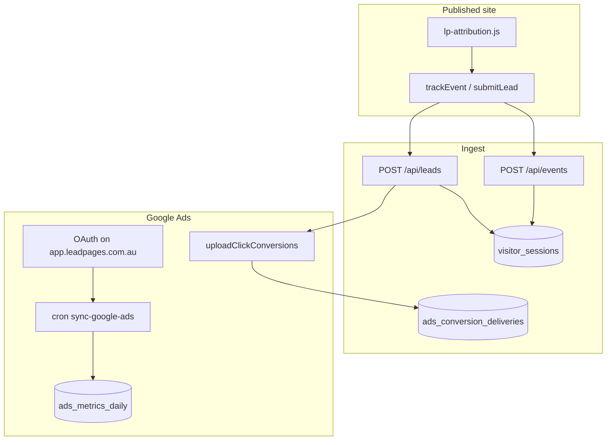

# Google Ads Integration (Base / v1)

**Document:** `features/Google Ads`  
**Status:** Engineering reference for the Advertising area + OAuth on the app domain  
**Audience:** Engineers extending Ads OAuth, conversion upload, or reporting  
**Prerequisites:** [07-TRACKING](../07-TRACKING.md), [features/Tracking](Tracking.md), [features/Pages](Pages.md)

---

## Production application domain

The permanent logged-in application origin is:

**`https://app.leadpages.com.au`**

This subdomain is the main LeadPages application domain for Command Centre, settings, and **all current and future platform integrations** (Google Ads, Analytics, Search Console, Meta, Xero, etc.). It is not exclusive to Google Ads.

| Surface | URL |
|---------|-----|
| Application origin | `https://app.leadpages.com.au` |
| Google Ads connection page | `https://app.leadpages.com.au/settings/integrations/google-ads` |
| Google Ads OAuth callback | `https://app.leadpages.com.au/api/integrations/google-ads/callback` |
| Public privacy | `https://leadpages.com.au/privacy` |
| Public terms | `https://leadpages.com.au/terms` |

Public marketing / tenant URLs on `leadpages.com.au` are intentional and must **not** be rewritten to the app subdomain.

---

## OAuth configuration (critical)

### Redirect URI rules

- Authorize **and** token exchange use the **identical** redirect URI.
- The URI is taken only from environment variables (`GOOGLE_ADS_REDIRECT_URI` or `APP_URL` + path).
- **Never** build the callback from the request `Host` / `X-Forwarded-Host` header.
- Preview deployments must set their own `APP_URL` / `GOOGLE_ADS_REDIRECT_URI` — they must not silently inherit production.

### Environment variables (Vercel Production)

```bash
APP_URL=https://app.leadpages.com.au
GOOGLE_ADS_REDIRECT_URI=https://app.leadpages.com.au/api/integrations/google-ads/callback
GOOGLE_ADS_CLIENT_ID=
GOOGLE_ADS_CLIENT_SECRET=
GOOGLE_ADS_DEVELOPER_TOKEN=
GOOGLE_ADS_LOGIN_CUSTOMER_ID=
GOOGLE_ADS_OAUTH_ENCRYPTION_KEY=
```

Optional: `GOOGLE_ADS_STATE_SECRET` (defaults to encryption key / client secret).

**Do not** expose secrets via `NEXT_PUBLIC_*` or client-side code. The Supabase **anon** key may appear in HTML (public by design); OAuth client secret, developer token, and encryption key must stay server-only.

### Local development

```bash
APP_URL=http://localhost:3000
GOOGLE_ADS_REDIRECT_URI=http://localhost:3000/api/integrations/google-ads/callback
```

Use a separate Google Cloud OAuth client (or add the localhost redirect on a dev client).

### Google Cloud Console checklist

Authorized JavaScript origin:

```
https://app.leadpages.com.au
```

Authorized redirect URI (exact match — protocol, host, path, no trailing slash):

```
https://app.leadpages.com.au/api/integrations/google-ads/callback
```

Authorized domain:

```
leadpages.com.au
```

---

## Integration route layout (future-proof)

Callbacks are integration-specific under the shared app domain:

```
/api/integrations/google-ads/callback
/api/integrations/google-analytics/callback   (future)
/api/integrations/search-console/callback     (future)
/api/integrations/meta/callback               (future)
/api/integrations/xero/callback               (future)
```

Shared helpers live in [`lib/app-url.js`](../../lib/app-url.js) (not AdWords-named). Google Ads OAuth handlers:

| Route | File |
|-------|------|
| `POST/GET /api/integrations/google-ads/connect` | [`api/integrations/google-ads/connect.js`](../../api/integrations/google-ads/connect.js) |
| `GET /api/integrations/google-ads/callback` | [`api/integrations/google-ads/callback.js`](../../api/integrations/google-ads/callback.js) |
| `POST /api/integrations/google-ads/exchange` | [`api/integrations/google-ads/exchange.js`](../../api/integrations/google-ads/exchange.js) |

Compatibility shims remain at `/api/google-ads/connect|callback|exchange` → integrations path. Reporting APIs stay at `/api/google-ads/{status,report,accounts,…}`.

---

## OAuth state and return location

Signed, expiring state (`makeState` / `parseState`) includes:

- `siteId`, `slug`
- `userId` (from authenticated session at connect time)
- `returnPath` (allowlisted only)

After successful connection, users are redirected to:

```
https://app.leadpages.com.au/settings/integrations/google-ads?gads=connected&siteId=…
```

Arbitrary return URLs are rejected (`safeReturnPath`) to prevent open redirects.

Connect prefers `Authorization: Bearer` + JSON `{ url }` so the access token is not placed in the query string / Referer.

---

## Cookies / CORS / auth session

- Supabase auth runs on the app origin (`app.leadpages.com.au`). Prefer **host-only** cookies (no `Domain=.leadpages.com.au` unless deliberately sharing with another subdomain).
- Production cookies must be `Secure`; existing preview password cookie in render uses `HttpOnly; SameSite=Lax` (no Domain) — keep that pattern.
- Authenticated API routes use Bearer JWT; do **not** enable wildcard CORS for them.
- `PRIMARY_HOSTS` includes `app.leadpages.com.au` so the app host is not treated as a tenant site.

---

## Architecture (reporting unchanged)



See prior sections in git history / PR #328 for conversion roles, metrics, and Advertising UI details.

---

## Ops checklist

1. Run `db/google_ads_schema.sql` in Supabase (if not already)  
2. Attach domain `app.leadpages.com.au` to the Vercel production project  
3. Set Production env vars listed above  
4. Configure Google Cloud origins/redirect exactly as listed  
5. Connect via `/settings/integrations/google-ads`  
6. Confirm callback hits `/api/integrations/google-ads/callback` (not Host-derived)  

*Last updated: July 2026 — app.leadpages.com.au OAuth domain migration.*
