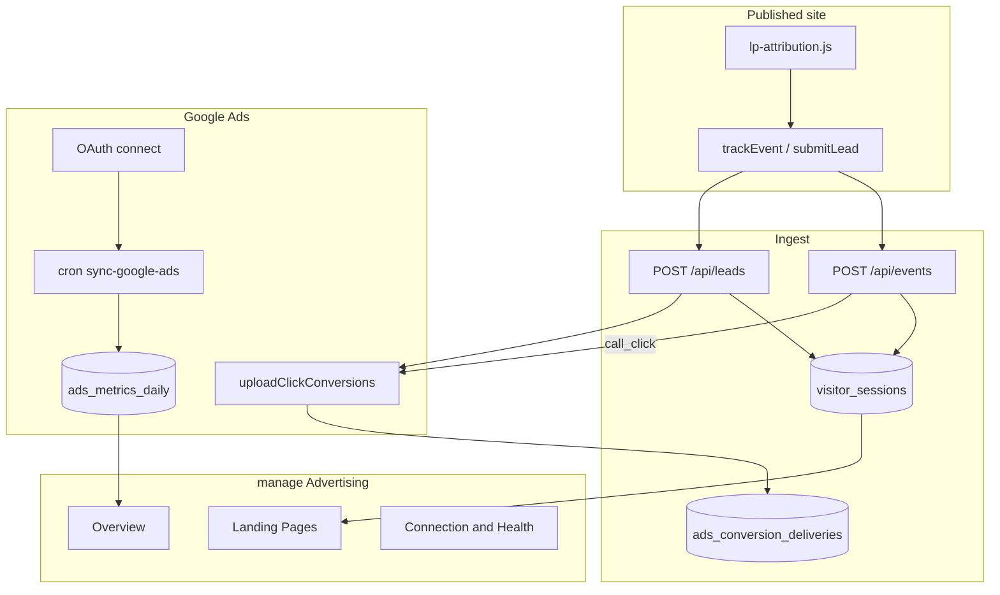

# Google Ads Integration (Base / v1)

**Document:** `features/Google Ads`  
**Status:** Engineering reference for the first-release Advertising area  
**Audience:** Engineers extending Ads OAuth, conversion upload, or reporting  
**Prerequisites:** [07-TRACKING](../07-TRACKING.md), [features/Tracking](Tracking.md), [features/Pages](Pages.md), [features/Instagram](Instagram.md) (OAuth pattern)

---

## Executive summary

LeadPages joins **first-party site events** (visitors, call clicks, form submissions) with **Google Ads reporting** (spend, clicks, impressions, final URLs) so trade clients can answer:

1. How much did I spend?
2. How many advertising visitors reached my website?
3. Which landing pages did they reach?
4. How many clicked the phone number?
5. How many submitted a form?
6. What did each lead action cost?
7. Which landing page is performing best?

**LeadPages remains the source of truth.** Google conversion delivery is best-effort and logged separately.

---

## Architecture

---

## Schema

Apply [`db/google_ads_schema.sql`](../../db/google_ads_schema.sql) in Supabase:

| Table | Purpose |
|-------|---------|
| `visitor_sessions` | First-party session attribution (gclid, UTMs, landing URL) |
| `google_ads_connections` | Per-site OAuth tokens + conversion action map + event roles |
| `ads_metrics_daily` | Synced campaign / landing-page metrics |
| `ads_conversion_deliveries` | Internal → Google delivery status |
| `ads_unmatched_urls` | Ads final URLs that did not match a LeadPages page |
| `leads` attribution columns | Optional `gclid`, `utm_*`, `traffic_source`, etc. |

---

## Session attribution

Client: [`assets/lp-attribution.js`](../../assets/lp-attribution.js) (injected by [`api/render.js`](../../api/render.js))

Captures on first hit:

- `gclid` / `gbraid` / `wbraid`
- `utm_source|medium|campaign|content|term`
- `visitor_id` / `session_id` (localStorage, 30‑minute session refresh)
- `landing_page_url`, `device_type`, `page_id` / `page_type` from `SITE_CONFIG`

Every `trackEvent` and `/api/leads` payload inherits the session blob. Server helpers live in [`lib/attribution.js`](../../lib/attribution.js).

Landing pages receive `SITE_CONFIG.pageId` / `pageType: 'landing_page'` from render. Slug renames append to `pages[].previousUrls` in the editor so historical Ads URLs still match.

---

## Conversions (v1)

| Event | Google Ads name | Default role | When fired |
|-------|-----------------|--------------|------------|
| Form submission | LeadPages — Form Submission | Primary | After successful `leads` insert |
| Call click | LeadPages — Call Click | Primary | After `call_click` event insert |
| Email / directions / CTA | Optional | Secondary / off | Only if role ≠ off |

Upload path: Google Ads API `uploadClickConversions` with click id. Delivery status stored in `ads_conversion_deliveries`. Failures never lose the LeadPages event/lead.

Dashboard label for phone events: **Call clicks** (not Calls).

---

## Connection flow

1. Advertising → **Connect Google Ads**
2. Google OAuth (`api/google-ads/connect` → `callback` → `exchange`)
3. Select Ads account (`accounts` + `save-settings`)
4. Platform creates conversion actions (`ensureConversionActions`)
5. Map event roles (Primary / Secondary / Do not send)
6. Test form + call-click tracking
7. Cron syncs metrics

Clients never enter Customer ID, Conversion ID, developer token, or tag snippets. Platform env:

- `GOOGLE_ADS_CLIENT_ID`
- `GOOGLE_ADS_CLIENT_SECRET`
- `GOOGLE_ADS_DEVELOPER_TOKEN`
- `GOOGLE_ADS_REDIRECT_URI` (optional)
- `GOOGLE_ADS_LOGIN_CUSTOMER_ID` (optional MCC)
- `GOOGLE_ADS_STATE_SECRET` (optional)

---

## Reporting UI

Trade Command Centre tab **Advertising** ([`manage.html`](../../manage.html)):

- Overview — spend → clicks → visitors → actions → unique conversions
- Campaigns — spend / clicks / visitors / call clicks / forms / cost per conversion + CSV
- Landing Pages — matched by final URL + **Edit Landing Page**
- Leads — source / campaign / page / “GCLID Present”
- Connection & Health — tests, click-id capture, unmatched URLs, alerts

API:

- `GET /api/google-ads/status`
- `GET /api/google-ads/report?view=campaigns|landing_pages|leads|alerts`
- `GET /api/google-ads/accounts`
- `POST /api/google-ads/save-settings`
- `POST /api/google-ads/test`
- `POST /api/google-ads/disconnect`
- `GET /api/cron/sync-google-ads` (CRON_SECRET)

---

## Metrics

- Visitor conversion rate = (call clicks + forms) ÷ visitors  
- Ad click-to-lead rate = (call clicks + forms) ÷ Ads clicks  
- Cost per form / call click  
- **Cost per lead action** = spend ÷ unique converting sessions (deduped)

Two views: **total actions** vs **unique converting visitors**. CRM form rows remain 1:1 leads.

---

## Out of scope (v1)

Search-term reporting, keyword/budget edits, Meta Ads, Xero/revenue, enhanced conversions, dynamic call forwarding, full GA4 replacement, automatic campaign changes.

---

## Ops checklist

1. Run `db/google_ads_schema.sql` in Supabase  
2. Set Google Ads env vars on Vercel  
3. Confirm cron `/api/cron/sync-google-ads` is registered  
4. Connect a test site → select account → run form/call tests  
5. Verify gclid lands in `visitor_sessions` from a tagged URL  

*Last updated: July 2026 — base Google Ads integration.*
