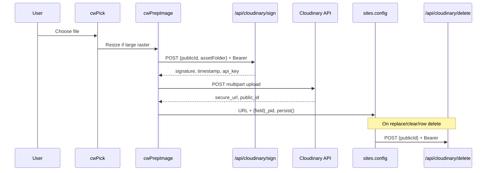
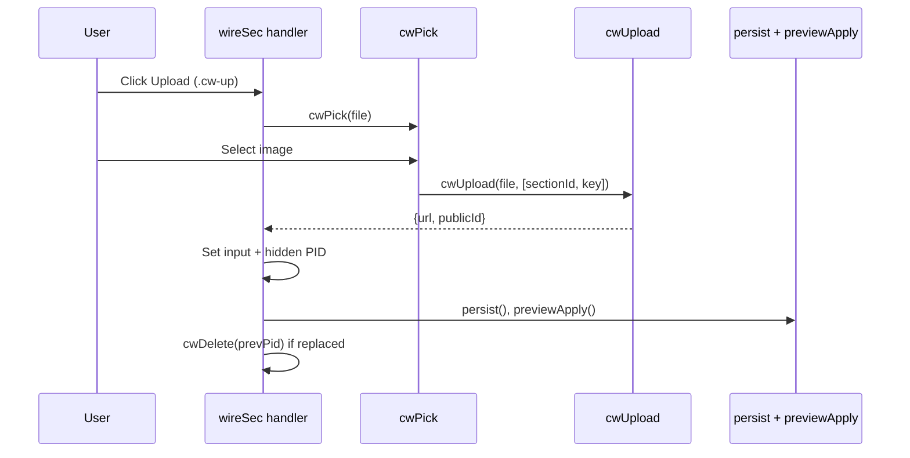
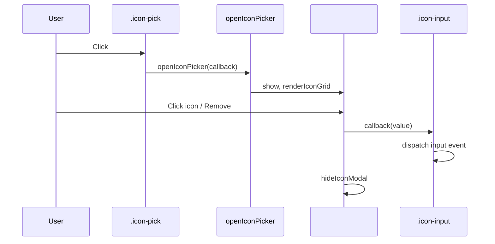
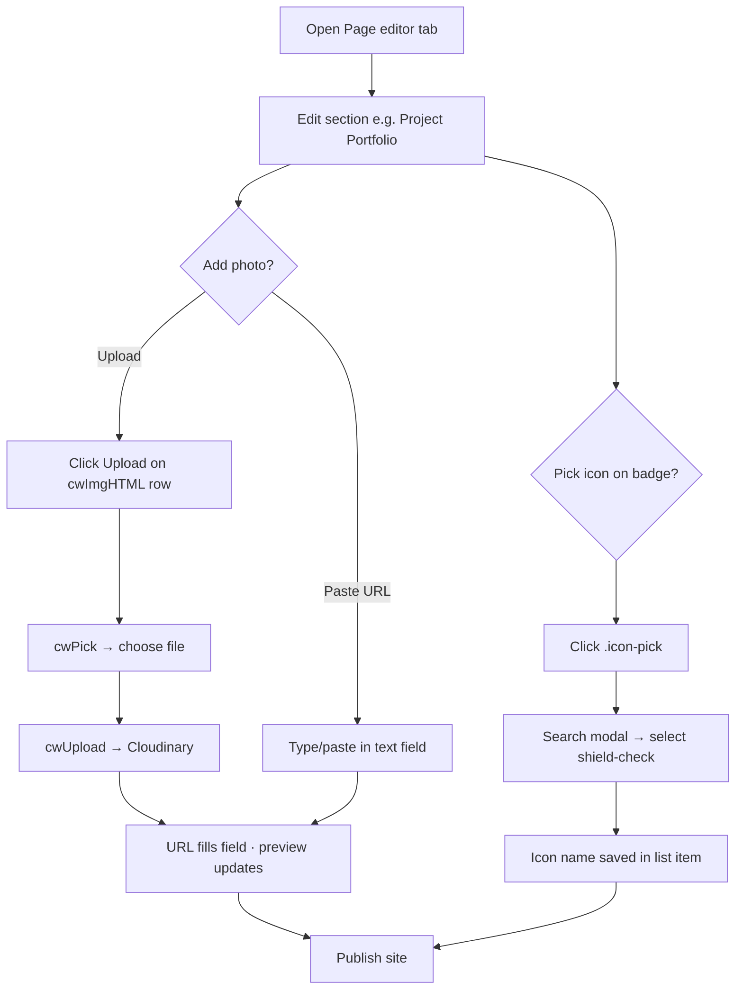
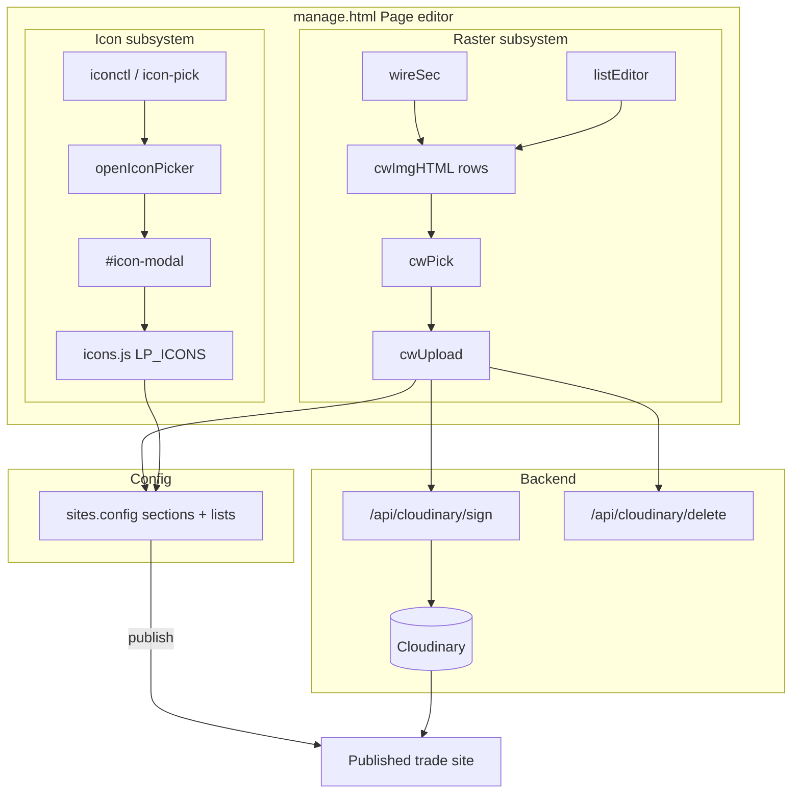
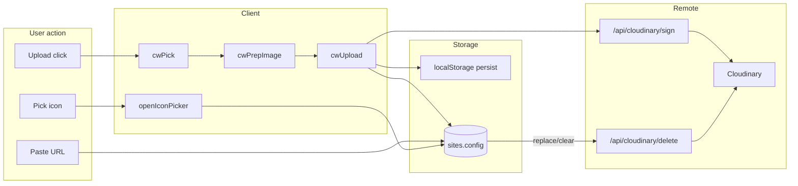
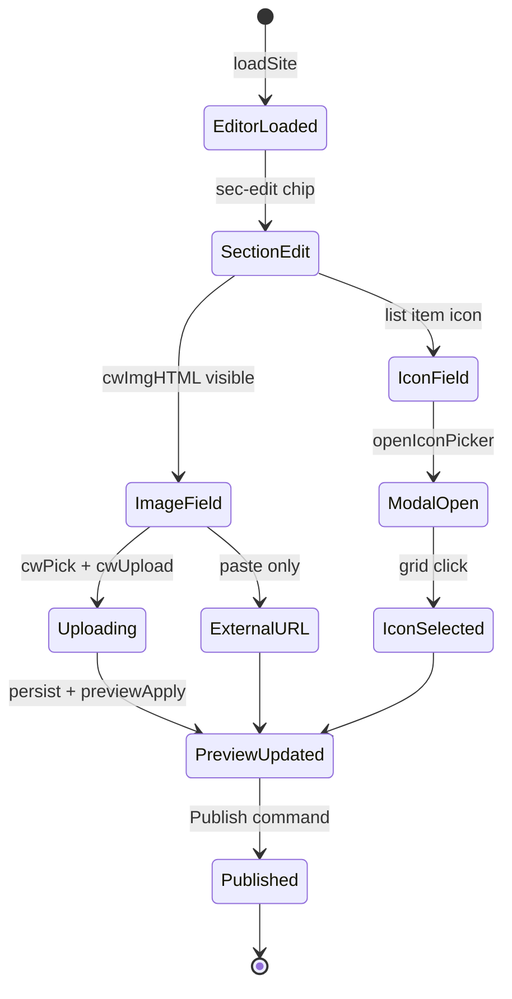

# LeadPages Image Library — Complete Engineering Manual

**Document:** `features/Image Library`  
**Status:** Definitive engineering reference for image uploads, Cloudinary asset lifecycle, and the SVG icon picker in the editor  
**Audience:** Engineers rebuilding, extending, or debugging media fields; AI development agents  
**Prerequisites:** [00-VISION](../00-VISION.md), [01-ARCHITECTURE](../01-ARCHITECTURE.md) §14, [10-EDITOR](../10-EDITOR.md)

> **Scope note:** This document covers the **client-side image and icon systems** in `manage.html` — `cwPick`, `cwImgHTML`, section/list image fields, and `openIconPicker`. It is **not** Instagram OAuth (`/api/instagram/*`), platform marketing assets on `marketplace.html`, or partner demo seed images in `/partner`.

---

## Executive Summary

The Image Library is not a separate React app or admin tab. It is a **shared inline toolkit** inside `manage.html` that lets site editors upload photos to **Cloudinary**, paste external URLs, clear assets with CDN cleanup, and pick **Lucide-style SVG icons** from a searchable modal.

Two parallel subsystems share the editor chrome but use different storage:

| Subsystem | Entry points | Stored as | Backend |
|-----------|--------------|-----------|---------|
| **Raster uploads** | `cwImgHTML` + Upload, bespoke file inputs | HTTPS URL + optional `{field}_pid` Cloudinary public ID | `/api/cloudinary/sign` → direct browser upload → `/api/cloudinary/delete` |
| **SVG icon library** | `.icon-pick` buttons → `openIconPicker` | Icon name string (e.g. `shield-check`) or legacy emoji | `icons.js` (`window.LP_ICONS`) — no upload |

| Fact | Detail |
|------|--------|
| **Primary file** | `manage.html` (~lines 2487–2567 Cloudinary + icons; ~2316–2337 section wiring) |
| **Icon data** | `/icons.js` — `LP_ICONS`, `LP_ICON_CATS`, search helpers |
| **CDN** | Cloudinary cloud `dzx6x1hou`; folder `leadpages/{siteSegment}/…` |
| **Auth** | Supabase session Bearer on sign/delete APIs |
| **UI widget** | `cwImgHTML()` → `.cw-row` with text input, `.cw-up`, `.cw-clr` |
| **File picker** | `cwPick(cb)` — ephemeral `<input type="file">` |
| **Icon modal** | `#icon-modal` created lazily by `ensureIconModal()` |

---

## Purpose

### Product purpose

Tradespeople and partners editing a site need to add real photos — hero backgrounds, before/after shots, team headshots, project covers — without leaving the Page editor. They also need consistent, professional icons on badges, CTAs, and mobile menu items without hunting SVG files.

The Image Library answers:

1. **How do I add a photo?** — Upload (optimised automatically) or paste any HTTPS URL.
2. **Where does it go?** — Cloudinary, namespaced per site so assets are isolated and deletable.
3. **How do I pick an icon?** — Click the icon button, search by trade or keyword, select from ~600+ stroke icons.

### Engineering purpose

- **Direct browser → Cloudinary upload** — images never pass through Vercel body limits; only signed params are server-side.
- **Reusable UI** — `cwImgHTML` + `cwPick` + `cwUpload` pattern reused across section cards, list editors, logos, favicons, mailer images, and marketplace modals.
- **Lifecycle hygiene** — `{field}_pid` tracks Cloudinary assets; replace/clear/delete-row calls `cwDelete`; site delete calls `cwDeletePrefix`.
- **Icon consistency** — one modal (`openIconPicker`) wired globally via event delegation on `.icon-pick`.

---

## Business Purpose

| Stakeholder | Value |
|-------------|-------|
| **Site owner (tradie)** | Drag-free uploads from phone/laptop; no separate media library login |
| **Partner / broker** | Branded project photos and icons without developer help |
| **LeadPages (platform)** | Per-site Cloudinary folders simplify billing, cleanup, and support |
| **Super-admin** | Same tooling on any site; bulk folder wipe on site delete |

Photos drive conversion (proof, portfolio, team trust). Icons reduce visual inconsistency vs raw emoji — important for premium trade positioning.

---

## User Types

| User | Uses Image Library? | Typical actions |
|------|---------------------|-----------------|
| **Super-admin** | Yes | Upload hero slides, clear orphaned assets on site delete |
| **Broker / partner** | Yes | Project portfolio images, review platform logos |
| **Site owner** | Yes (editor access) | Team photos, before/after pairs |
| **Leads-only demo** | No | Calculator tab only — no Page editor |
| **Anonymous visitor** | No | Sees published URLs only |

---

## Permissions

| Layer | Mechanism |
|-------|-----------|
| **Editor access** | Supabase auth + `gate()` — must load a site in `manage.html` |
| **`/api/cloudinary/sign`** | Valid Bearer session; `publicId` and `assetFolder` must start with `leadpages/` |
| **`/api/cloudinary/delete`** | Same auth; `publicId` or `prefix` hard-scoped to `leadpages/` |
| **Cloudinary upload** | Signed params only — no anonymous uploads |
| **Billing lock** | `#bill-lock` blocks entire editor including uploads |

There is no per-field RBAC: any authenticated editor on a site can upload to that site's folder.

---

## UI Components

### `cwImgHTML` row (image fields)

Built by `cwImgHTML(idOrData, ph, hint)`:

```text
┌──────────────────────────────────────────────────────────────┐
│  [ https://… or upload          ]  [Upload]  [✕ Clear]     │
│  Hint · JPG, PNG, WebP or SVG · up to 8 MB · optimised…      │
└──────────────────────────────────────────────────────────────┘
       ↑ visible URL field              ↑ .cw-up   ↑ .cw-clr
```

| Class / element | Role |
|-----------------|------|
| `.cw-row` | Flex container for input + buttons |
| `input[type=text]` | Stores display URL; manual paste triggers `input` → `persist()` |
| `.cw-up` | Calls `cwPick` → `cwUpload` |
| `.cw-clr` | Clears URL, deletes Cloudinary asset if `_pid` present |
| Hidden `…-pid` or `[data-k="…_pid"]` | Stores Cloudinary `public_id` for lifecycle |

**Hint line:** optional field-specific hint (from schema) plus fixed copy: *JPG, PNG, WebP or SVG · up to 8 MB · large images optimised on upload*.

### Icon picker control (`.iconctl`)

```text
┌────────┐  ┌────────┐
│  [SVG] │  │ shield │   ← .icon-pick button + .icon-input (text or hidden)
└────────┘  └────────┘
     click → openIconPicker()
```

Rendered by `iconCtl()`, `listEditor` (`type:'icon'`), `_icf()`, nav menu builder, services editor, hero CTA blocks.

### Icon modal (`#icon-modal`)

Lazy-created overlay (`.icon-ov`, `z-index:9999`):

```text
┌─────────────────────────────────────────────────────────────┐
│  [Search — e.g. builder, cafe, plumber…]  [Remove] [Close]  │
├─────────────────────────────────────────────────────────────┤
│  ★ Popular | All | Trust & CTA | Trades | …                 │
├─────────────────────────────────────────────────────────────┤
│  [icon] [icon] [icon] …  (grid, max 600 visible)            │
└─────────────────────────────────────────────────────────────┘
```

Categories from `window.LP_ICON_CATS` in `icons.js`. Search uses `window.LP_searchIcons` when available; fallback filters `TRADE_ICONS` locally.

---

## `cwPick` — File Picker

**Signature:** `cwPick(cb)`  
**Location:** `manage.html` ~2542

Creates a hidden `<input type="file" accept="image/*">`, appends to `document.body`, opens the native OS picker, invokes `cb(file)` on selection, then removes the input.

| Behaviour | Detail |
|-----------|--------|
| **Single file** | Only `files[0]` passed to callback |
| **Cancel** | Input removed; callback not called |
| **Accept filter** | `image/*` — JPG, PNG, WebP, SVG, GIF |
| **No size check in cwPick** | Callers enforce limits (5–8 MB) before or after pick |

**Call sites (non-exhaustive):**

| Context | Trigger | Upload path parts |
|---------|---------|-------------------|
| Section image field | `.cw-up` in `wireSec` | `[sectionId, fieldKey]` |
| List item image | `.cw-up` in `listEditor` | `[sc.secId, fieldKey]` |
| Footer custom logo | `#lpf-customUrl` Upload | `['lpfooter']` |
| Site logo (Details) | `#lg-file` change | `['logo']` |
| Landing page SEO image | `#lp-img-file` change | `['page', pageId]` |
| Favicon | `#fav-file` change | `['favicon']` |
| Mailer header | `#mlr-img` file input | `['mailer']` |
| Marketplace modal | `_mImgUp()` helpers | `['mm', …]` parts |

**Pattern:**

```javascript
cwPick(function(file){
  cwBusy(btn, true);
  cwUpload(file, [sectionId, key]).then(function(r){
    // set URL + _pid, persist(), previewApply()
    if (prevPid && prevPid !== r.publicId) cwDelete(prevPid);
  }).catch(function(err){ toast('Upload failed: ' + err.message); })
    .then(function(){ cwBusy(btn, false); });
});
```

---

## `cwImgHTML` — Upload Field Markup

**Signature:** `cwImgHTML(idOrData, ph, hint)`  
**Location:** `manage.html` ~2540

Returns HTML string (not a DOM node). The first argument is injected verbatim as attributes on the text `<input>`:

| Call style | Example | Used by |
|------------|---------|---------|
| `id="…"` | `cwImgHTML('id="sec-textBox-image"', ph, hint)` | `secCard()` section fields |
| `data-k="…"` | `cwImgHTML('data-k="beforeImage"', ph, hint)` | `listEditor()` list items |

**Companion hidden PID field** is rendered separately by the caller:

- Sections: `<input type="hidden" id="sec-{id}-{key}-pid">`
- Lists: `<input type="hidden" data-k="{key}_pid">`

**Wiring responsibility:** `cwImgHTML` only emits markup. Event listeners for Upload/Clear are attached by `wireSec`, `listEditor`, or bespoke setup (`lpFooterCard`, `_mImgUp`).

---

## Section Image Uploads

Section-level images use the **`secCard` + `wireSec`** pair for scalar fields on a section object (`sites.config.sections.{sectionId}`).

### Declaring an image field

In `secCard(c, id, title, toggle, fields)`, add a field tuple:

```javascript
['beforeImage', 'Before image URL', 'image']           // optional 4th: hint string
['image', 'Image (optional)', 'image']
```

When `f[2] === 'image'`:

1. `secCard` renders `cwImgHTML('id="sec-'+id+'-'+key+'"', placeholder, f[3])`.
2. Hidden PID input: `sec-{id}-{key}-pid`.
3. Field spans full row width (`flex:1 1 100%`).

### Wiring uploads — `wireSec`

For each image field, `wireSec` (~2335):

1. Hydrates text input and PID from `c.sections[id][key]` and `[key+'_pid']`.
2. **`input` listener** — writes URL to config on paste/type (external URLs allowed without upload).
3. **Upload (`.cw-up`)** — `cwPick` → `cwUpload(file, [id, key])` → sets `o[key]`, `o[key+'_pid']`, `persist()`, `previewApply()`, deletes previous PID.
4. **Clear (`.cw-clr`)** — `cwDelete(pid)`, deletes keys, clears inputs, `persist()`, `previewApply()`.

**Cloudinary path for section scalar:** `leadpages/{siteSegment}/{sectionId}/{fieldKey}/{random}`

### Section cards with image fields today

| Section ID | Fields | Notes |
|------------|--------|-------|
| `heroBeforeAfter` | `beforeImage`, `afterImage` | Hero B/A slider |
| `textBox` | `image` | Optional side/inline image |

Most section imagery lives in **list editors** (see below), not scalar `secCard` fields.

---

## List Editor Image Uploads

Repeating items (projects, slides, crew, proof cards) use **`listEditor(host, c, schemaKey)`** with `LIST_SCHEMAS` entries where field `type:'image'`.

### Schema example

```javascript
beforeAfterItems: {
  secId: 'beforeAfter',
  key: 'items',
  item: [
    { k: 'beforeImage', type: 'image', label: 'Before image URL', ph: 'https://… (optional)' },
    { k: 'afterImage',  type: 'image', label: 'After image URL',  ph: 'https://… (optional)' }
  ]
}
```

### Storage shape

Each list item may contain:

```json
{
  "title": "Driveway clean",
  "beforeImage": "https://res.cloudinary.com/…/before.jpg",
  "beforeImage_pid": "leadpages/my-site/beforeAfter/beforeImage/abc123",
  "afterImage": "",
  "on": true
}
```

PID keys follow `{fieldKey}_pid` — collected by `listEditor`'s `collect()` from hidden `[data-k]`.

### Upload path parts

`cwUpload(file, [sc.secId, _k])` — uses **schema section id** and **field key**, not list index. Each new upload gets a unique random suffix, so multiple items in the same list do not collide.

### List schemas with `type:'image'` fields

| Schema key | Section | Image fields |
|------------|---------|--------------|
| `beforeAfterItems` | `beforeAfter` | `beforeImage`, `afterImage` |
| `featuredProjects` | `featuredProjects` | `image` (+ gallery URLs in textarea `images`) |
| `heroSlides` | `heroSlider` | `imageUrl` |
| `proofStream` | `proofStream` | `image`, `afterImage` |
| `crew` | `crew` | `photo` |
| `jobsFeed` | `jobsFeed` | `image` |
| `beforeAfterFeed` | `beforeAfterFeed` | `beforeImage`, `afterImage` |
| `videoReels` | `videoReels` | `thumbnail` |
| `customerReactions` | `customerReactions` | `image` (screenshot style) |
| `projectFeed` | `projectFeed` | `image` |
| `certifications` | `certifications` | `image` |
| `reviewSources` | `reviews` | `logo` |

### Row delete cleanup

Removing a list row (`.le-del`) iterates `[data-k$="_pid"]` and calls `cwDelete` for each — prevents orphaned Cloudinary assets.

---

## `openIconPicker` — Icon Library Modal

**Signature:** `openIconPicker(cb)`  
**Location:** `manage.html` ~2513

| Step | Action |
|------|--------|
| 1 | `ensureIconModal()` — create `#icon-modal` once |
| 2 | Set module callback `__iconCb = cb` |
| 3 | Reset category to `__pop__` (Popular) |
| 4 | Clear search, highlight Popular chip |
| 5 | `renderIconGrid()` |
| 6 | Focus `#icon-search` after 30 ms |
| 7 | Show overlay (`display:flex`) |

**Selection:** grid click on `[data-ch]` → `__iconCb(iconName)` → `hideIconModal()`.

**Remove icon:** `#icon-remove` → `__iconCb('')`.

**Close:** backdrop click, `#icon-close`, or `Escape`.

### Global click delegation

Document listener on `.icon-pick` (~2514):

1. Find nearest `.iconctl`.
2. Find `.icon-input` inside.
3. `openIconPicker(function(ch){ inp.value=ch; inp.dispatchEvent(input); b.innerHTML=iconBtnInner(ch); })`.

Manual typing in `.icon-input` updates the button preview via separate `input` listener (~2515).

`refreshIconBtns(scope)` re-syncs all `.icon-pick` buttons after list re-render.

### Icon value formats

| Value | Rendering |
|-------|-----------|
| Lucide name (`shield-check`) | SVG from `window.LP_ICONS[name]` |
| Unknown kebab name | Fallback `circle-help` SVG if available |
| Emoji / free text (`✓`, `$`) | Escaped text in button |
| Empty | `＋` placeholder |

Published site templates resolve icons via `lpIcon()` in `marketplace/demos/demo-shared.js` — same `LP_ICONS` map.

### List schemas with `type:'icon'` fields

`badges`, `why`, `quotePoints`, `responseCards`, `mobileExtras`, `mobileMenuItems`, `trustBar`, `featuredProjectsBadges`, hero slide CTAs (`primaryCtaIcon`, `secondaryCtaIcon`), plus inline editors (nav menu, services, split hero CTAs).

Icons are **strings in config** — no Cloudinary PID, no upload pipeline.

---

## Cloudinary Pipeline (Supporting Functions)

Images selected via `cwPick` flow through these helpers (~2517–2541):



| Function | Role |
|----------|------|
| `cwToken()` | `sb.auth.getSession()` → access token |
| `cwSiteSeg()` | Sanitised `currentSiteId` or slug for folder root |
| `cwSiteSegSlug()` | Slug-only segment (legacy folder cleanup) |
| `cwSeg(s)` | Sanitise path segment |
| `cwRand()` | Unique suffix `Date.now(36)+random` |
| `cwPrepImage(file)` | Client-side downscale/recompress: max 2000 px, JPEG quality 0.8; skips SVG/GIF and files already ≤ ~800 KB |
| `cwUpload(file, parts)` | Sign + upload; returns `{url, publicId}` |
| `cwDelete(publicId)` | Best-effort single asset delete |
| `cwDeletePrefix(prefix)` | Batch delete under prefix (site teardown) |
| `cwBusy(btn, on)` | Button loading state (`…`, disabled) |

**Namespace:**

```text
leadpages/{siteSegment}/{part1}/{part2}/…/{random}
```

Examples:

- `leadpages/abc123uuid/heroSlider/imageUrl/k7x2m`
- `leadpages/my-plumber-site/logo/q9f3p`
- `leadpages/my-plumber-site/page/about-us-img/z1a8c`

`asset_folder` is sent on upload so Cloudinary dynamic folders file assets under `leadpages/`, not account root.

---

## Other Upload Surfaces (Same Pipeline)

These use `cwUpload` / `cwPick` but **not** `cwImgHTML`:

| Surface | Max size check | Config keys |
|---------|----------------|-------------|
| Logo (Details `#lg-file`) | 5–8 MB | `data.logo._pid`, `logo.imageUrl` |
| Landing SEO image | 8 MB | `lpCur.img`, `lpCur.img_pid` |
| Favicon | 2 MB | `config.favicon`, `config._favPid` |
| Footer custom logo | via `cwImgHTML` | `sections.lpFooter.customUrl` |
| Mailer image | none in UI | `MAILER.imageUrl`, `MAILER.imgPid` |
| Marketplace modal `_mimg` | via `_mImgUp` | `config.marketplaceModal.*` |

All follow the same replace-delete-previous-PID pattern.

---

## Data Sources

```mermaid
flowchart LR
  subgraph editor [manage.html]
    CW[cwImgHTML / cwPick]
    UP[cwUpload]
    IP[openIconPicker]
    SEC[wireSec / listEditor]
  end

  subgraph assets [Asset stores]
    CL[(Cloudinary CDN)]
    ICONS[icons.js LP_ICONS]
  end

  subgraph config [sites.config JSONB]
    SECOBJ[sections.*]
    LOGO[logo / favicon]
    PAGES[pages[].img]
  end

  subgraph api [Vercel API]
    SIGN["POST /api/cloudinary/sign"]
    DEL["POST /api/cloudinary/delete"]
  end

  CW --> UP
  SEC --> CW
  UP --> SIGN --> CL
  UP --> SECOBJ
  IP --> ICONS
  ICONS --> SECOBJ
  DEL --> CL
  SEC --> config
```

| Stored field | Example | Purpose |
|--------------|---------|---------|
| `{key}` | `https://res.cloudinary.com/…` | Public URL in HTML |
| `{key}_pid` | `leadpages/site/crew/photo/xyz` | Delete/replace targeting |
| `icon` (lists) | `phone-call` | SVG lookup key |
| External URL only | `https://example.com/photo.jpg` | Allowed; no `_pid` — clear does not call Cloudinary |

**Persistence:** `persist()` → localStorage snapshot + debounced DB save; Publish writes full `sites.config`.

---

## API Calls

| Endpoint | Method | Called by | Body | Response used |
|----------|--------|-----------|------|----------------|
| `/api/cloudinary/sign` | POST | `cwUpload` | `{publicId, assetFolder}` | `signature`, `timestamp`, `apiKey`, `cloudName`, `publicId`, `assetFolder` |
| Cloudinary upload | POST | `cwUpload` | `FormData`: file, signed params | `secure_url`, `public_id` |
| `/api/cloudinary/delete` | POST | `cwDelete`, `cwDeletePrefix` | `{publicId}` or `{prefix}` | `{ok, …}` |

Auth: `Authorization: Bearer` from `cwToken()`.

Sign rejects paths not starting with `leadpages/`. Delete loops batches for prefix deletes (max 30 calls).

---

## Database Tables

| Table | Image Library usage |
|-------|---------------------|
| **`sites`** | `config` JSONB holds all URLs, `_pid` fields, icon names |
| **`site_backups`** | Snapshots include image URLs and PIDs |
| **Cloudinary (external)** | Binary storage; not in Supabase |

No dedicated `media` or `assets` table — media metadata lives inline in config.

---

## Related Files

| File | Relationship |
|------|--------------|
| **`manage.html`** | **Primary implementation** — all `cw*` and icon picker functions |
| **`icons.js`** | Icon SVG paths, categories, search index |
| **`api/cloudinary/sign.js`** | Upload signature; auth + path scoping |
| **`api/cloudinary/delete.js`** | Asset and prefix deletion |
| **`api/manage.html`** | Legacy duplicate — keep in sync manually |
| **`marketplace/demos/demo-shared.js`** | `lpIcon()` renders config icon names on published sites |
| **`docs/10-EDITOR.md`** | Editor-wide image flow summary |
| **`docs/01-ARCHITECTURE.md`** §14 | Cloudinary architecture |
| **`docs/04-SITE-BUILDER.md`** | Brief `cwUpload` mention |

---

## Functions

### Image upload core

| Function | Lines (approx.) | Role |
|----------|-----------------|------|
| `cwPick(cb)` | ~2542 | Ephemeral file input |
| `cwImgHTML(idOrData, ph, hint)` | ~2540 | Upload row HTML |
| `cwUpload(file, parts)` | ~2525–2537 | Sign + Cloudinary upload |
| `cwPrepImage(file)` | ~2524 | Client resize before upload |
| `cwDelete(publicId)` | ~2538 | Single asset delete |
| `cwDeletePrefix(prefix)` | ~2539 | Folder wipe |
| `cwBusy(btn, on)` | ~2541 | Upload button state |
| `cwToken()` | ~2519 | Session Bearer |
| `cwSiteSeg()` / `cwSeg()` / `cwRand()` | ~2520–2523 | Path builders |

### Section / list wiring

| Function | Role |
|----------|------|
| `secCard(…)` | Renders section form including `cwImgHTML` for `image` fields |
| `wireSec(c, id, …)` | Binds Upload/Clear/input for section scalars |
| `listEditor(host, c, sk)` | Renders list rows; centralised `.cw-up` / `.cw-clr` handlers |
| `LIST_SCHEMAS` | Declares `type:'image'` and `type:'icon'` fields |

### Icon picker

| Function | Lines (approx.) | Role |
|----------|-----------------|------|
| `openIconPicker(cb)` | ~2513 | Show modal, set callback |
| `ensureIconModal()` | ~2492–2505 | Lazy-create `#icon-modal` |
| `renderIconGrid()` | ~2506–2511 | Search + category filter |
| `hideIconModal()` | ~2512 | Close + clear callback |
| `iconBtnInner(v)` | ~2487 | Button preview HTML |
| `refreshIconBtns(scope)` | ~2516 | Sync after list render |
| `iconCtl(id, cur)` | ~2444 | Inline icon control markup |

---

## Event Flow

### Section image upload



### Icon pick



---

## User Journey



---

## Performance Considerations

| Area | Behaviour | Risk |
|------|-----------|------|
| **`cwPrepImage`** | Canvas downscale before upload | Large files still block main thread briefly |
| **Direct upload** | Bypasses Vercel 4.5 MB limit | Very large files may fail at Cloudinary or timeout |
| **Icon grid** | Caps display at 600 icons | Search required for rare icons |
| **`icons.js` size** | Loaded on every editor open | ~large single script; cached by browser |
| **Replace uploads** | Old PID deleted async | Orphan if delete fails silently |
| **Prefix delete** | Up to 30 batch calls | Huge folders may need re-invocation (`partial:true`) |

**Recommendations (future):** Web Worker for `cwPrepImage`; upload progress bar; central media browser showing site folder contents.

---

## Security Considerations

| Topic | Detail |
|-------|--------|
| **Auth on sign/delete** | Unauthenticated users cannot upload to `leadpages/` |
| **Path scoping** | Server rejects `publicId` / `prefix` outside `leadpages/` |
| **Overwrite** | Sign sets `overwrite:false`; unique random IDs prevent clobber |
| **Secret** | `CLOUDINARY_API_SECRET` never sent to browser |
| **External URLs** | Any HTTPS URL accepted — XSS mitigated by `esc()` in templates, not URL validation |
| **SVG upload** | Allowed; Cloudinary serves as image — rare script-in-SVG risk if rendered inline (templates use ``) |
| **Icon names** | Kebab-case validated for SVG lookup; other chars escaped as text |

---

## Technical Debt

| ID | Issue | Location | Impact |
|----|-------|----------|--------|
| TD-IL1 | **Inconsistent size limits** | Logo 5 MB vs cwImgHTML hint 8 MB | User confusion |
| TD-IL2 | **List gallery textarea** | `featuredProjects.images` | Multi-line URLs — no per-URL PID tracking or bulk delete |
| TD-IL3 | **`api/manage.html` drift** | Legacy copy | Wrong docs if deployed |
| TD-IL4 | **Silent delete failures** | `cwDelete` empty catch | Orphan Cloudinary assets |
| TD-IL5 | **Dual logo upload UIs** | Details tab vs Settings sub-panel | Different size checks and markup |
| TD-IL6 | **Emoji + Lucide mix** | Default seed content uses ✓ ★ | `iconBtnInner` renders emoji as text, not SVG |
| TD-IL7 | **No upload progress** | `cwBusy` shows `…` only | Poor UX on slow connections |
| TD-IL8 | **Site segment by ID vs slug** | `deleteSiteNow` deletes both folders | Legacy sites may have duplicate folders |

---

## Future Improvements

1. **Unified media panel** — browse `leadpages/{site}/` folder in editor.
2. **Drag-and-drop** onto `cwImgHTML` rows.
3. **Align size limits** — single 8 MB policy with pre-pick validation in `cwPick`.
4. **Gallery PID map** — track Cloudinary IDs for multi-image textareas.
5. **Upload progress** — XMLHttpRequest or fetch streaming feedback.
6. **Image crop UI** — aspect ratio presets per schema hint (3:2, 16:9, square).
7. **Icon recents** — per-site `localStorage` of last picked icons.
8. **Fail loudly on `cwDelete`** — toast when cleanup fails.
9. **Remove `api/manage.html` duplicate** or auto-sync from primary file.

---

## Image Library Architecture



---

## Connections to Other Systems

### Editor

Image fields appear throughout **Details → Page editor** section sub-panels (`renderLandingSub`). Changes call `persist()` and `previewApply()` — live iframe preview updates immediately. Publish (`publishToDB`) writes config to Supabase.

### Site builder / templates

Published HTML resolves image URLs from `config.sections` directly. Icons render via `lpIcon()` / inline `LP_ICONS` lookups in section apply scripts.

### Site deletion

`deleteSiteNow()` calls `cwDeletePrefix('leadpages/'+cwSiteSeg()+'/')` and slug variant before deleting the `sites` row — best-effort Cloudinary cleanup.

### Backups

`site_backups.config` snapshots include URLs and PIDs. Restoring a backup does not re-upload binaries; Cloudinary assets must still exist.

### Marketplace modal

Separate `_mimg` / `_mImgUp` helpers reuse `cwPick` + `cwUpload` with `['mm', …]` path segments.

---

## Data Flow



---

## User Flow



---

## Glossary

| Term | Meaning |
|------|---------|
| **`cw*`** | Cloudinary widget prefix (`cwPick`, `cwUpload`, …) |
| **`_pid`** | Cloudinary `public_id` stored beside URL for delete/replace |
| **`cwImgHTML`** | Standard upload row markup generator |
| **`LIST_SCHEMAS`** | Declarative schemas for repeating section items |
| **`LP_ICONS`** | Map of icon name → SVG path `d` fragments |
| **`openIconPicker`** | Opens searchable icon modal with callback |
| **`asset_folder`** | Cloudinary folder metadata ensuring `leadpages/` organisation |
| **`cwSiteSeg()`** | Sanitised site id/slug used as Cloudinary folder segment |

---

*Last updated: July 2026 — reflects `manage.html` Image Library implementation on branch `main`.*
