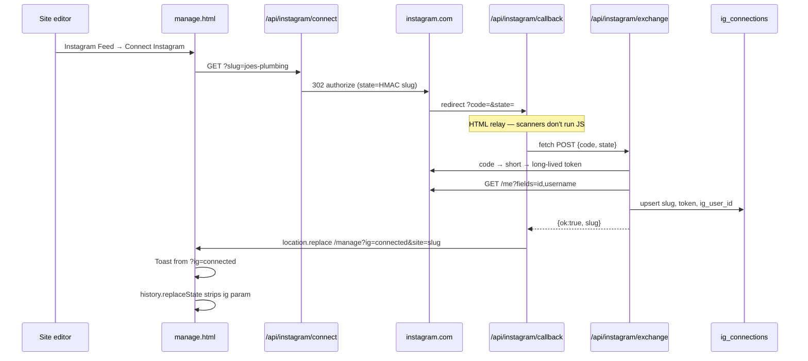
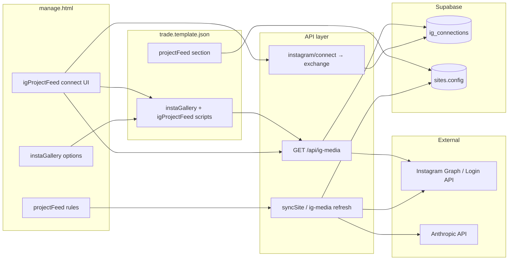
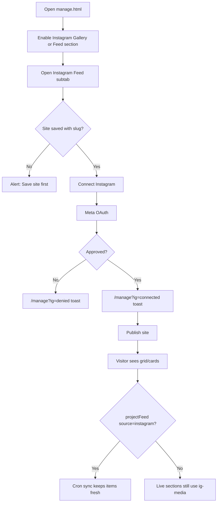
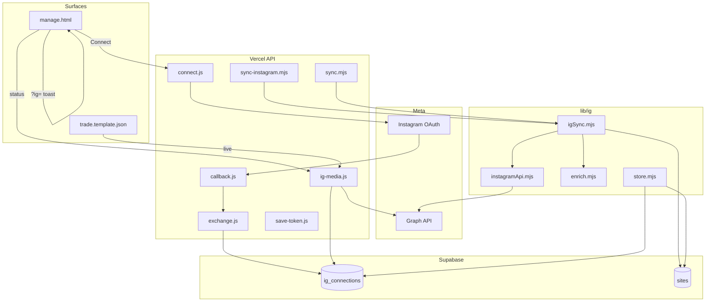
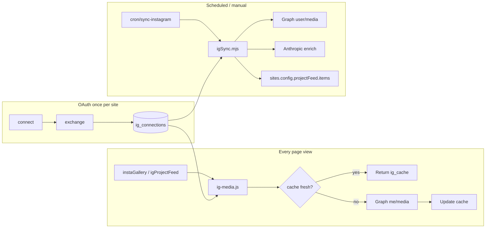

# LeadPages Instagram Integration — Complete Engineering Manual

**Document:** `features/Instagram`  
**Status:** Definitive engineering reference for Instagram OAuth, live feeds, and project sync  
**Audience:** Engineers rebuilding, extending, or debugging Instagram on trade sites; AI development agents  
**Prerequisites:** [00-VISION](../00-VISION.md), [01-ARCHITECTURE](../01-ARCHITECTURE.md), [02-DATABASE](../02-DATABASE.md), [04-SITE-BUILDER](../04-SITE-BUILDER.md), [10-EDITOR](../10-EDITOR.md)

> **Scope note:** This document covers **per-site Instagram Business Login**, the **`ig_connections`** credential store, **live gallery APIs** (`/api/ig-media`), **editor sections** (`instaGallery`, `igProjectFeed`, `projectFeed`), and **background sync** (`lib/ig/*`). It is **not** a Meta app review guide (see [instagram-data-policy.html](../../instagram-data-policy.html)) or generic social marketing documentation.

---

## Executive Summary

LeadPages lets each **trade site** connect one **Instagram Professional account** (Business or Creator) so published pages can show recent posts without manual image uploads. Credentials live server-side in **`ig_connections`** (keyed by `sites.slug`). The browser never receives access tokens.

There are **two consumption paths**:

| Path | Sections | Mechanism | Data destination |
|------|----------|-----------|------------------|
| **Live feed** | `instaGallery`, `igProjectFeed` | Published page calls `GET /api/ig-media?slug=` | Ephemeral JSON; optional `ig_cache` on connection row |
| **Synced portfolio** | `projectFeed` when `source: "instagram"` | Cron or manual `syncSite()` writes `config.sections.projectFeed.items[]` | Persisted in `sites.config` JSONB |

OAuth uses **Instagram Business Login** (`instagram.com/oauth/authorize`, scope `instagram_business_basic`). After connect, the editor redirects to `/manage?ig=connected` and shows a fixed toast from the `?ig=` query param.

| Fact | Detail |
|------|--------|
| **Credential table** | `ig_connections` — PK `slug` → `sites.slug` |
| **OAuth start** | `GET /api/instagram/connect?slug={slug}` |
| **OAuth finish** | `callback.js` relay → `POST /api/instagram/exchange` → redirect `?ig=` |
| **Public media API** | `GET /api/ig-media?slug=` (or `?siteId=`) |
| **Sync worker** | `lib/ig/igSync.mjs` via `api/cron/sync-instagram.mjs` or `api/instagram/sync.mjs` |
| **Editor connect UI** | **Instagram Feed** subtab (`igProjectFeed`) only |
| **Default visibility** | All three Instagram-related sections are **off by default** (`OFF_BY_DEFAULT_SECTIONS`) |
| **Legal** | Footer link to `/instagram-data-policy.html` |

---

## Purpose

### Product purpose

Tradespeople already document jobs on Instagram. LeadPages surfaces that proof on their hosted site:

1. **Social proof without re-uploading** — latest grid tiles or project cards from the connected account.
2. **Conversion hooks** — `igProjectFeed` and synced `projectFeed` items open a lightbox with Call / Quote / View on Instagram actions tied to existing site tracking.
3. **Portfolio automation** — optional hashtag filters + AI caption enrichment populate the **Project Feed** section on a schedule.

### Engineering purpose

- **Isolate secrets** — tokens in `ig_connections` with RLS enabled and no public policies; only service-role server routes touch them.
- **Separate live vs synced** — gallery sections hit a cached public proxy; portfolio sync mutates `sites.config` for richer manual editing and layout parity with manual projects.
- **OAuth hardening** — HMAC-signed `state` binds authorization to a site slug; callback is a JS relay so link-preview bots cannot burn one-time codes.

---

## Business Purpose

| Stakeholder | Value |
|-------------|-------|
| **Site owner (tradie)** | Fresh job photos on the website without duplicate admin |
| **Partner / broker** | Differentiator in demos; “connect Instagram” upsell narrative |
| **LeadPages (platform)** | Retention — sites feel alive; premium AI enrichment on sync |
| **Meta / compliance** | Minimal scope; documented data policy and deletion path |

Instagram sections are optional components in the **Projects, Gallery & Before/After** editor group — partners enable them per client without changing template code.

---

## User Types

| User | Connect Instagram? | Sees live sections? | Notes |
|------|-------------------|---------------------|-------|
| **Super-admin** | Yes | Yes (when section enabled + connected) | Same editor as client |
| **Broker / partner** | Yes, on client sites | Yes | Uses `manage.html` Details subtabs |
| **Site owner** | Yes, if editor access | Yes | Must save site (slug) before connect button works |
| **Public visitor** | No | Yes on published site | Calls `/api/ig-media` only — no tokens |
| **Anonymous** | No | Empty/hidden sections | `{ connected: false, media: [] }` |

**Not in scope:** Instagram content management (posting, DMs, comments). LeadPages is read-only display.

---

## Permissions

| Layer | Mechanism |
|-------|-----------|
| **Connect button** | Requires saved site with `currentSiteSlug`; redirects to `/api/instagram/connect?slug=` |
| **`ig_connections` RLS** | Enabled, no policies → **service role only** |
| **`/api/ig-media`** | Public; returns shaped media, never `access_token` |
| **`/api/instagram/exchange`** | Public POST; protected by signed `state` (15 min TTL) |
| **`/api/instagram/save-token`** | POST; origin must include `leadpages.com.au` or `localhost` |
| **`/api/instagram/sync`** | GET; `CRON_SECRET` via Bearer or `?key=` |
| **`/api/cron/sync-instagram`** | GET; Bearer `CRON_SECRET` when secret set |
| **Editor auth** | Standard Supabase session + site access via `manage.html` gate |

Super-admins and site editors can initiate OAuth; visitors cannot connect or disconnect accounts.

---

## Instagram OAuth and the `?ig=` Query Parameter

### End-to-end OAuth flow



### Step reference

| Step | File | Behaviour |
|------|------|-----------|
| **1. Start** | `api/instagram/connect.js` | Validates `?slug=`; builds HMAC state `{s:slug,t,n}`; redirects to `https://www.instagram.com/oauth/authorize` with `scope=instagram_business_basic` and fixed redirect `https://www.leadpages.com.au/api/instagram/callback` |
| **2. Callback relay** | `api/instagram/callback.js` | Returns minimal HTML; JS POSTs `{code,state}` to `/api/instagram/exchange`; on success `location.replace('/manage?ig=connected&site=' + slug)` |
| **3. Exchange** | `api/instagram/exchange.js` | Verifies state signature + 15‑minute age; exchanges code → short-lived → long-lived token; fetches `graph.instagram.com/me`; upserts `ig_connections` |
| **4. Editor toast** | `manage.html` (~5617) | IIFE reads `?ig=` on load |

### `?ig=` parameter values

| `ig` value | User message | Toast colour |
|------------|--------------|--------------|
| `connected` | ✓ Instagram connected | Green `#1a7f37` |
| `denied` | Instagram connection was cancelled | Amber `#8a5a00` |
| `error` (or any other) | Instagram connection failed — optional `ig_detail` | Amber `#8a5a00` |

Additional query params:

| Param | Set by | Purpose |
|-------|--------|---------|
| `site` | `callback.js` redirect | Preserves site context in manage URL |
| `ig_detail` | `callback.js` on failure | Truncated error string (max 200 chars) for toast |

After displaying the toast (~4.2s fade), the handler **deletes `ig` from the URL** via `history.replaceState` so refresh does not repeat the message. Other params (e.g. `site`) remain.

### State token format

```text
state = base64url(JSON({s: slug, t: timestamp, n: random})) + "." + HMAC-SHA256(body)
```

- Signing key: `IG_STATE_SECRET` env, falling back to `INSTAGRAM_APP_SECRET`
- Expiry: 15 minutes from `t`
- Slug extracted as `obj.s` after signature verification

### Environment variables (OAuth)

| Variable | Used by |
|----------|---------|
| `INSTAGRAM_APP_ID` | `connect.js`, `exchange.js` |
| `INSTAGRAM_APP_SECRET` | `connect.js`, `exchange.js` |
| `IG_STATE_SECRET` | Optional dedicated HMAC secret |
| `SUPABASE_URL`, `SUPABASE_SERVICE_ROLE_KEY` | `exchange.js`, `save-token.js`, `ig-media.js` |

---

## Instagram Sections (Editor + Published Site)

Three related sections live under **Page editor → Details → Projects, Gallery & Before/After**:

| Subtab label | Config key | Default | Live data source |
|--------------|------------|---------|------------------|
| **Project Feed** | `projectFeed` | On in some layouts; source `manual` | Manual list **or** synced `items[]` when `source: "instagram"` |
| **Instagram Feed** | `igProjectFeed` | Off (`OFF_BY_DEFAULT_SECTIONS`) | `/api/ig-media` at runtime |
| **Instagram Gallery** | `instaGallery` | Off | `/api/ig-media` at runtime |

All three are listed in `OPTIONAL_COMPONENTS` — toggled via section on/off in Page Content chips.

### Section comparison

```text
┌─────────────────────────────────────────────────────────────────────────┐
│  projectFeed (source=instagram)                                         │
│  Server sync → sites.config.projectFeed.items[] (_ig: true items)       │
│  Renders like manual projects; hashtag filters; AI enrich on NEW posts  │
├─────────────────────────────────────────────────────────────────────────┤
│  igProjectFeed ("Instagram Feed")                                       │
│  Client fetch /api/ig-media → maps to project cards + shared lightbox   │
│  Connect OAuth UI lives HERE                                            │
├─────────────────────────────────────────────────────────────────────────┤
│  instaGallery ("Instagram Gallery")                                     │
│  Client fetch /api/ig-media → square tile grid + "View on Instagram"    │
│  No connect UI — points user to Instagram Feed section                  │
└─────────────────────────────────────────────────────────────────────────┘
```

### `instaGallery` — Instagram Gallery

**Editor:** `manage.html` when `sub === 'instaGallery'`.

**Defaults** (`SECTION_DEFAULTS.instaGallery`):

```javascript
{ eyebrow: 'Instagram', heading: 'Follow us on Instagram', intro: '',
  count: 8, columns: 4 }
```

**Config keys:**

| Key | UI control | Published behaviour |
|-----|------------|---------------------|
| `eyebrow`, `heading`, `intro` | Section card | Section head copy |
| `count` | Posts to show (default 8) | Slice of media array |
| `columns` | 3 / 4 / 5 desktop grid | CSS `--ig-cols` |
| `openInstagram` | Checkbox | When true, tiles are `<a>` to post permalink; else static divs |

**Published template** (`trade.template.json`):

- Section: `[data-sec="instaGallery"]` — `display:none` until media loads
- Fetches `GET /api/ig-media?slug={slug}&limit=24`
- Hides entire section if not connected or zero posts
- Renders `.ig-grid` tiles + `.ig-follow` button to `@username` or first post link
- Wraps `__applyTradeConfig` to re-run after config apply

### `igProjectFeed` — Instagram Feed (Project-style cards)

**Editor:** `sub === 'igProjectFeed'` — includes **Instagram connection** card.

**Defaults:**

```javascript
{ eyebrow: 'Instagram', heading: 'From the grid', intro: '',
  count: 9, columns: 3, titleSource: 'none', tagLabel: '',
  showTag: true, showDate: false,
  textColor: '#1a2230', textBg: '#ffffff', btnBg: '#ff7a00', btnText: '#ffffff',
  callLabel: 'Call now', quoteLabel: 'Get a quote', linkLabel: 'View on Instagram' }
```

**Connection UI (editor only):**

| Element | ID | Behaviour |
|---------|-----|-----------|
| Status | `#igconn-status` | `fetch('/api/ig-media?slug=')` → “Connected as @user” or “Not connected” |
| Button | `#igconn-btn` | Click → `/api/instagram/connect?slug={currentSiteSlug}`; label becomes “Reconnect Instagram” when connected |

**Feed options:** count, columns (2–5), `titleSource` (none / caption / date), `tagLabel`, `captionStyle`, show tag/date toggles.

**Card styling:** text/box/button colours; show Call / Quote / View on Instagram in lightbox (`__pfOpenLightbox` shared with `projectFeed`).

**Published:** Maps `/api/ig-media` items to synthetic project items; opens lightbox with `__PF_OPTS` from section colours.

### `projectFeed` — Project Feed with Instagram source

**Editor:** `sub === 'projectFeed'`.

**Source selector** (`pf-source`):

| Value | Status |
|-------|--------|
| `manual` | Default — list editor only |
| `instagram` | **Active** — filled by `syncSite()` |
| `facebook`, `tiktok`, `google`, `youtube` | Labelled “coming soon” |

**Instagram sync rules** (stored in `config.sections.projectFeed`):

| Key | Purpose |
|-----|---------|
| `source` | Must be `"instagram"` for worker (unless `force=1`) |
| `includeTags` | Comma/hashtag list — caption must match at least one |
| `excludeTags` | Caption must not match any |
| `postsToShow` | Display cap (sync stores up to `max(want, 24)` capped at 60) |
| `sortOrder` | `newest` (default) or `oldest` |
| `aiEnrich` | Default **on** — Anthropic extracts title/service/location for **new** `_ig` items only |
| `igAccount` | Display hint `@yourbusiness` (informational) |

**Synced item shape** (written by `igSync.mjs`):

```json
{
  "_ig": true,
  "igId": "1784…",
  "source": "instagram",
  "title": "Merbau deck refresh",
  "service": "Deck building",
  "location": "Gungahlin",
  "caption": "Original caption…",
  "image": "https://…",
  "permalink": "https://instagram.com/p/…",
  "date": "2026-07-01T…",
  "on": true
}
```

Manual items (no `_ig`) are **preserved** on every sync and listed before IG items.

---

## Navigation (Editor)

| Location | Path |
|----------|------|
| Tab | **Details** (Page editor) |
| Sidebar group | **Projects, Gallery & Before/After** |
| Subtabs | `projectFeed`, `igProjectFeed`, `instaGallery` |
| Icons (section chips) | `instagram` Lucide icon for `instaGallery` and `igProjectFeed` |

Enable sections via **Page Content** section toggles (`OFF_BY_DEFAULT_SECTIONS`). Connection is only exposed on **Instagram Feed**.

Cross-reference from **Instagram Gallery** copy: “Connect Instagram in the Instagram Feed section.”

---

## API Routes — Complete Reference

Vercel maps `api/**/*.js` and `api/**/*.mjs` to `/api/*` automatically. No extra rewrites in `vercel.json` for Instagram (except `/instagram-data-policy` → HTML).

### Route summary

| Endpoint | Method | File | Auth | Purpose |
|----------|--------|------|------|---------|
| `/api/instagram/connect` | GET | `instagram/connect.js` | Public (`?slug=`) | Start OAuth redirect |
| `/api/instagram/callback` | GET | `instagram/callback.js` | Public | HTML relay → exchange |
| `/api/instagram/exchange` | POST | `instagram/exchange.js` | Signed `state` in body | Code → token → DB |
| `/api/instagram/save-token` | POST | `instagram/save-token.js` | Origin gate | Manual token save or `{disconnect:true}` |
| `/api/instagram/sync` | GET | `instagram/sync.mjs` | `CRON_SECRET` | On-demand `syncSite(slug)` |
| `/api/cron/sync-instagram` | GET | `cron/sync-instagram.mjs` | Bearer `CRON_SECRET` | Sync all `enabled` connections |
| `/api/ig-media` | GET | `ig-media.js` | Public | Shaped media for live sections |

### `GET /api/instagram/connect`

| Query | Required | Description |
|-------|----------|-------------|
| `slug` | Yes | Site slug stored in `ig_connections.slug` |

**Responses:** `302` to Instagram; `400` missing slug; `500` missing app credentials.

### `GET /api/instagram/callback`

Returns HTML only. Client-side outcomes redirect to:

```text
/manage?ig={connected|denied|error}&site={slug}&ig_detail={optional}
```

### `POST /api/instagram/exchange`

**Body:** `{ "code": "…", "state": "…" }`

**Success:** `{ "ok": true, "slug": "…", "username": "…" }`

**Failure:** `{ "ok": false, "slug": "…", "error": "stepN:…" }` with HTTP 4xx/5xx.

**DB row written:**

```javascript
{
  slug, access_token, token_expires_at, ig_username, ig_user_id,
  ig_cache: null, ig_cache_at: null
}
```

### `POST /api/instagram/save-token`

| Body | Action |
|------|--------|
| `{ slug, token }` | Verify via `graph.instagram.com/me`; upsert connection (60-day expiry assumption) |
| `{ slug, disconnect: true }` | **DELETE** row for slug |

**Note:** No disconnect button in `manage.html` today — API exists for ops/scripts.

### `GET /api/instagram/sync`

| Query | Description |
|-------|-------------|
| `slug` | Required site slug |
| `force=1` | Run even if `projectFeed.source !== 'instagram'` |
| `key=` | Alternative `CRON_SECRET` auth |

**Returns:** JSON from `syncSite()` — `{ slug, fetched, new, igTotal, manual }` or `{ skipped, error, … }`.

### `GET /api/cron/sync-instagram`

Iterates `ig_connections` where `enabled = true`, calls `syncSite(c.slug)` for each.

**Deployment note:** `vercel.json` currently lists only `/api/billing/cron` under `crons`. The Instagram cron handler exists but is **not scheduled** in repo config — see Technical Debt.

### `GET /api/ig-media`

| Query | Default | Description |
|-------|---------|-------------|
| `slug` | — | Site slug (preferred) |
| `siteId` | — | UUID → resolves slug via `sites` |
| `limit` | 12 | Clamped 1–25 |

**Response (success):**

```json
{
  "connected": true,
  "username": "handle",
  "cached": true,
  "media": [
    {
      "id": "…",
      "type": "IMAGE",
      "image": "https://…",
      "link": "https://instagram.com/p/…",
      "caption": "…",
      "timestamp": "2026-07-01T12:00:00+0000"
    }
  ]
}
```

**Flags:** `cached` (served from `ig_cache`), `stale` (API failed but old cache used), `error` (fetch failed, no cache).

**Behaviour:**

1. Load `ig_connections` by slug
2. Return `{ connected: false, media: [] }` if no token (HTTP 200)
3. Serve cache if younger than **10 minutes**
4. Refresh token if expiring within **7 days** (`graph.instagram.com/refresh_access_token`)
5. Fetch `graph.instagram.com/me/media?fields=…&limit=25`
6. Shape + write `ig_cache`, `ig_cache_at`

**CORS:** `access-control-allow-origin: *`

---

## Data Sources



| Source | Table / endpoint | Fields used |
|--------|------------------|-------------|
| OAuth tokens | `ig_connections` | `access_token`, `ig_user_id`, `ig_username`, `token_expires_at` |
| Media cache | `ig_connections` | `ig_cache`, `ig_cache_at` |
| Sync metadata | `ig_connections` | `enabled`, `last_sync`, `last_count`, `last_error` |
| Project items | `sites.config` | `sections.projectFeed.items[]` |
| Section copy | `sites.config` | `sections.instaGallery`, `sections.igProjectFeed` |
| Live fetch | `GET /api/ig-media` | Shaped `media[]`, `username` |
| AI enrich | Anthropic Messages API | title, service, location for new posts |

---

## Database Tables

### `ig_connections`

Defined in [db/instagram_schema.sql](../../db/instagram_schema.sql). **Production columns may exceed the SQL file** — application code also uses:

| Column (code) | Purpose |
|---------------|---------|
| `slug` | PK — matches `sites.slug` |
| `ig_user_id` | Instagram user id (required NOT NULL) |
| `access_token` | Long-lived token (**sensitive**) |
| `token_expires_at` | Used by `exchange.js`, `ig-media.js` |
| `ig_username` | Display @handle |
| `ig_cache` | JSON array of shaped media |
| `ig_cache_at` | Cache timestamp |
| `enabled` | Sync worker skips when `false` |
| `last_sync`, `last_count`, `last_error` | Sync diagnostics |

**Schema drift (TD-I1):** SQL file names `token_expires`; runtime uses `token_expires_at`. Upsert retries omit optional columns if migration incomplete.

**RLS:** Enabled, no policies → anon/authenticated clients cannot read tokens.

### `sites.config` (Instagram-related)

```json
{
  "sections": {
    "instaGallery": { "on": true, "count": 8, "columns": 4, "openInstagram": false },
    "igProjectFeed": { "on": true, "count": 9, "columns": 3, "showCall": true },
    "projectFeed": {
      "source": "instagram",
      "includeTags": "#deck #renovation",
      "excludeTags": "#personal",
      "postsToShow": 12,
      "sortOrder": "newest",
      "aiEnrich": true,
      "items": [ { "_ig": true, "igId": "…", "title": "…", "image": "…" } ]
    }
  }
}
```

---

## Related Files

| File | Relationship |
|------|--------------|
| **`manage.html`** | Section editors, connect button, `?ig=` toast |
| **`trade.template.json`** | Published HTML/CSS/JS for all three sections + `/api/ig-media` clients |
| **`api/instagram/connect.js`** | OAuth start |
| **`api/instagram/callback.js`** | OAuth relay page |
| **`api/instagram/exchange.js`** | Token exchange + upsert |
| **`api/instagram/save-token.js`** | Manual token / disconnect API |
| **`api/instagram/sync.mjs`** | Manual sync endpoint |
| **`api/ig-media.js`** | Public media proxy + cache |
| **`api/cron/sync-instagram.mjs`** | Batch sync worker |
| **`lib/ig/igSync.mjs`** | Core sync logic → `projectFeed.items` |
| **`lib/ig/instagramApi.mjs`** | Graph fetch for sync worker |
| **`lib/ig/store.mjs`** | Supabase REST helpers |
| **`lib/ig/enrich.mjs`** | Anthropic caption enrichment |
| **`db/instagram_schema.sql`** | Base table + RLS |
| **`instagram-data-policy.html`** | Legal / Meta compliance |
| **`api/manage.html`** | Legacy duplicate — treat **`manage.html`** as source of truth |
| **`docs/02-DATABASE.md`** | `ig_connections` reference |
| **`docs/01-ARCHITECTURE.md`** | §14 Instagram integration overview |

---

## Functions and Modules

### Server

| Symbol | File | Role |
|--------|------|------|
| `makeState` / `verifyState` | `connect.js`, `exchange.js` | HMAC OAuth state |
| `shape()` | `ig-media.js` | Normalise Graph media to `{id,type,image,link,caption,timestamp}` |
| `syncSite(slug, opts)` | `igSync.mjs` | Filter, enrich, merge, persist project items |
| `fetchMedia(igUserId, token, limit)` | `instagramApi.mjs` | `graph.facebook.com/{id}/media` |
| `enrichCaption(caption)` | `enrich.mjs` | Claude JSON extract |
| `getConnection` / `updateConnection` | `store.mjs` | CRUD via PostgREST |

### Client (`manage.html`)

| Context | Role |
|---------|------|
| `sub === 'igProjectFeed'` block | Connection status, connect redirect, section wiring |
| `sub === 'instaGallery'` block | Gallery options only |
| `sub === 'projectFeed'` block | Source rules, manual list, sync config |
| IIFE at ~5617 | `?ig=` toast + URL cleanup |

### Client (`trade.template.json`)

| Script | Role |
|--------|------|
| `instaGallery` IIFE | Fetch ig-media, paint grid, follow button |
| `igProjectFeed` IIFE | Fetch ig-media, map to cards, lightbox |
| Shared `__pfOpenLightbox` | Call / Quote / link actions for both feed types |

---

## Event Flow

### Connect from editor

1. User opens **Instagram Feed** subtab.
2. Status polls `GET /api/ig-media?slug=`.
3. User clicks **Connect Instagram** → full-page redirect to Meta.
4. After approval, callback relay exchanges code.
5. Browser lands on `/manage?ig=connected&site=…`.
6. Toast shows success; `ig` param stripped.
7. User re-opens **Instagram Feed** — status shows “Connected as @…”.

### Live section on published site

1. Visitor loads trade site (`/api/render`).
2. Enabled `instaGallery` / `igProjectFeed` scripts run on DOM ready.
3. Single shared fetch to `/api/ig-media` (per page load, per script — potential duplicate).
4. If `connected && media.length`, section `display:block`; else hidden.

### Project Feed sync

1. Cron or `GET /api/instagram/sync?slug=` triggers `syncSite`.
2. Worker reads `projectFeed` rules + `ig_connections`.
3. Fetches media, filters captions, enriches new ids, merges with manual items.
4. PATCH `sites.config`; updates `last_sync` on connection row.
5. Next publish/render shows updated `projectFeed` items (no runtime Instagram call).

---

## User Journey



**Partner journey:** Enable optional sections in demo → connect test IG account → showcase live grid on client preview.

---

## Performance Considerations

| Area | Behaviour | Risk |
|------|-----------|------|
| **`ig_cache`** | 10-minute TTL on `ig-media` | Stale content acceptable; `stale` flag on API errors |
| **Token refresh** | Proactive within 7 days of expiry | Failed refresh still attempts media fetch with old token |
| **Published page** | Each live script may fetch ig-media independently | Duplicate requests on pages with both sections enabled |
| **Sync worker** | Up to 50 media + AI per new post | Anthropic latency/cost on large backfills |
| **Cron** | Sequential `syncSite` per connection | Long run if many tenants |

**Recommendations:** Single shared ig-media fetch on published pages; schedule `sync-instagram` in `vercel.json`; dedupe network calls in template scripts.

---

## Security Considerations

| Topic | Detail |
|-------|--------|
| **Token storage** | Service role only; never in API responses or HTML |
| **OAuth state** | HMAC + timing-safe compare + 15-minute expiry |
| **Callback relay** | Prevents preview bots consuming authorization codes |
| **save-token origin** | Restricted to `leadpages.com.au` / `localhost` |
| **Public ig-media** | Returns public post URLs/captions only — acceptable for display |
| **RLS** | No client policies on `ig_connections` |
| **Compliance** | [instagram-data-policy.html](../../instagram-data-policy.html) documents access, retention, deletion |

Disconnect path: `POST /api/instagram/save-token` with `{ disconnect: true }` or manual DB delete — should be exposed in editor for GDPR/Meta parity.

---

## Technical Debt

| ID | Issue | Location | Impact |
|----|-------|----------|--------|
| TD-I1 | **Column name drift** | `instagram_schema.sql` vs runtime | `token_expires` vs `token_expires_at`; optional cache columns |
| TD-I2 | **Dual Graph endpoints** | `ig-media.js` uses `graph.instagram.com/me/media`; `instagramApi.mjs` uses `graph.facebook.com/{id}/media` | Sync may fail for Instagram Login tokens while live gallery works |
| TD-I3 | **Cron not scheduled** | `vercel.json` lacks `sync-instagram` | `projectFeed` Instagram source stale unless manual sync |
| TD-I4 | **No disconnect UI** | `manage.html` | Users cannot revoke from editor; API exists |
| TD-I5 | **Duplicate ig-media fetches** | `trade.template.json` | Extra latency on pages with gallery + feed |
| TD-I6 | **Reconnect only** | Connect button | No “Disconnect” or token status beyond connected boolean |
| TD-I7 | **`api/manage.html` drift** | Legacy copy | Same Instagram subtabs but not guaranteed identical |
| TD-I8 | **Facebook source placeholder** | `projectFeed` source select | UI present; no backend |

Tracked in [13-ROADMAP](../13-ROADMAP.md) context: missing crons for `sync-instagram` ([00-VISION](../00-VISION.md) Known Risks).

---

## Future Improvements

1. **Schedule** `/api/cron/sync-instagram` in `vercel.json` (e.g. every 6 hours).
2. **Unify Graph client** — one module for Instagram Login media fetch used by sync + ig-media.
3. **Disconnect button** in Instagram Feed → `save-token` `{ disconnect: true }`.
4. **Align SQL migration** with production columns (`token_expires_at`, `ig_username`, `ig_cache*`).
5. **Shared fetch** on published page — one ig-media call powers both sections.
6. **Encrypt `access_token` at rest** — defense in depth ([02-DATABASE](../02-DATABASE.md)).
7. **Facebook / TikTok sources** — implement or hide coming-soon options.
8. **Sync status in editor** — show `last_sync`, `last_error` from `ig_connections`.
9. **Force sync button** — call `/api/instagram/sync` from manage (authenticated proxy).

---

## Architecture



---

## Connections to Other Systems

### Editor (`manage.html`)

Instagram sections are **Details subtabs** on trade sites. Config persists via `lpSaveDB()` → `sites.config`. Live preview uses the same template scripts after publish preview.

### Site builder / render

`api/render.js` injects `SITE_CONFIG` (includes `slug`) into `trade.template.json`. Instagram scripts read `SITE_CONFIG.slug` for ig-media calls.

### Project Feed lightbox

`igProjectFeed` reuses **`__pfOpenLightbox`** and **`__PF_OPTS`** from the shared project-feed implementation — Call triggers existing phone tracking; Quote scrolls to quote form.

### Cloudinary

Policy page mentions cached media may pass through Cloudinary; live ig-media returns Instagram CDN URLs directly today.

### AI (Anthropic)

Sync-only: `enrich.mjs` uses `ANTHROPIC_API_KEY` when `projectFeed.aiEnrich !== false`. Failures fall back to caption-derived titles.

### Billing

No billing gate on Instagram connect or sections. Premium badge on AI enrich is marketing only — not enforced by Stripe in code.

### Legal / footer

`manage.html` footer links **Instagram Data** → `/instagram-data-policy.html` (rewrite in `vercel.json`).

---

## Data Flow (Live vs Sync)



---

## Glossary

| Term | Meaning |
|------|---------|
| **Instagram Business Login** | OAuth flow via `instagram.com/oauth/authorize` (not Facebook Login button) |
| **`?ig=`** | Query param on `/manage` after OAuth — drives one-time connection toast |
| **`ig_connections`** | Per-site credential row keyed by slug |
| **`instaGallery`** | Square tile grid section |
| **`igProjectFeed`** | Instagram posts as project cards with lightbox |
| **`projectFeed` + source** | Portfolio section; `instagram` source filled by sync worker |
| **`_ig` marker** | On synced items — distinguishes Instagram rows from manual entries |
| **`/api/ig-media`** | Public read proxy; never exposes tokens |

---

*Last updated: July 2026 — reflects Instagram integration on branch `main` (`manage.html`, `api/instagram/*`, `api/ig-media.js`, `lib/ig/*`, `trade.template.json`).*
