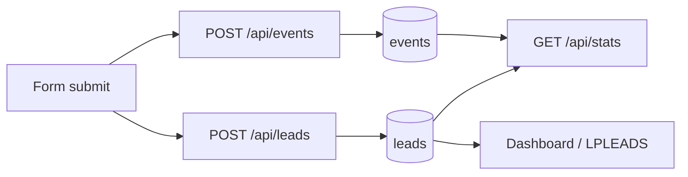
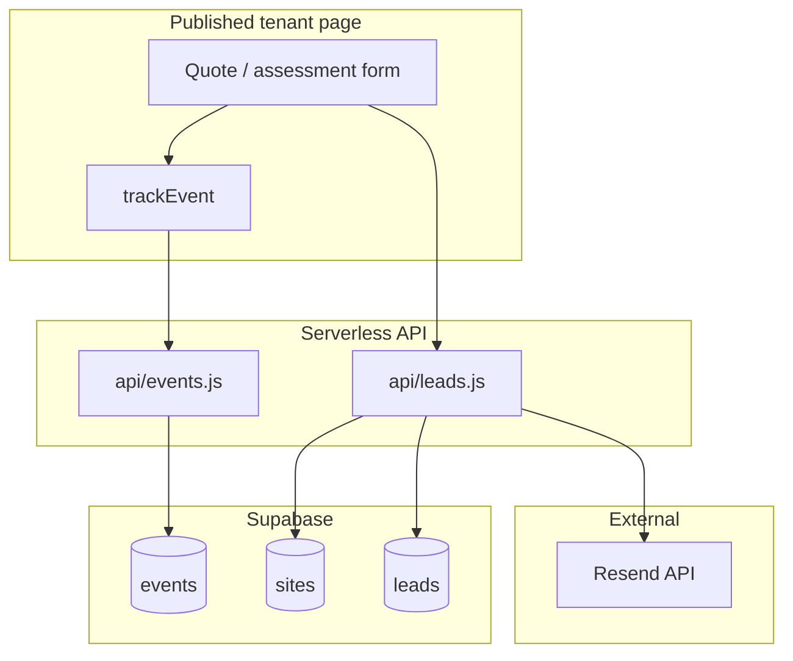
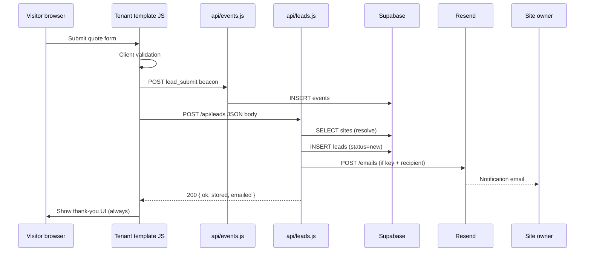
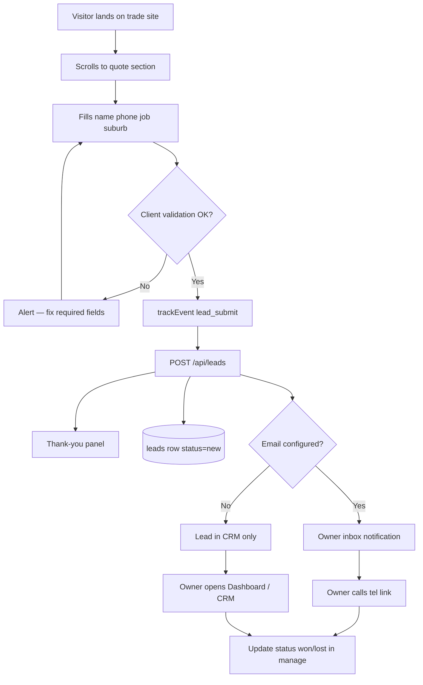
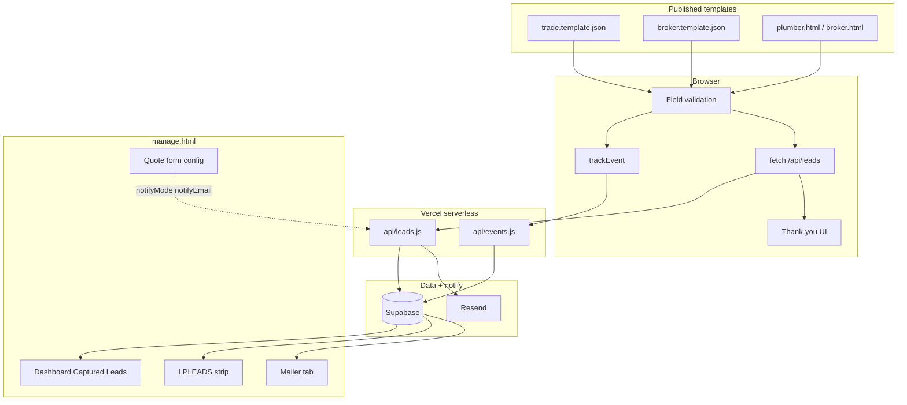
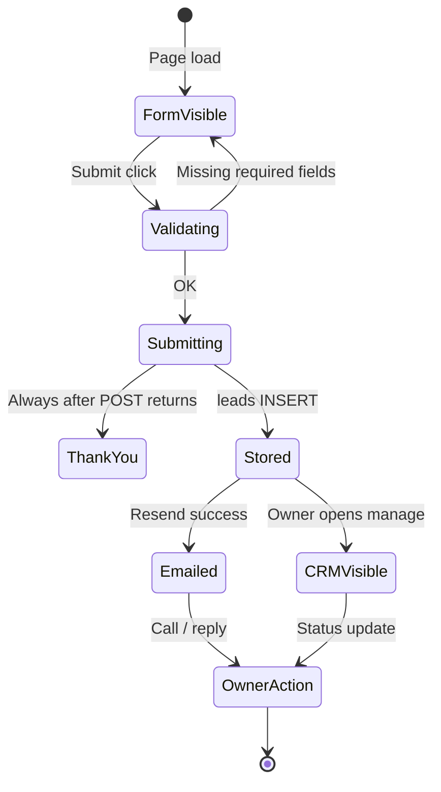

# LeadPages Lead Capture — Complete Engineering Manual

**Document:** `features/Lead Capture`  
**Status:** Definitive engineering reference for tenant form submission, ingest API, storage, and owner notifications  
**Audience:** Engineers extending quote forms, debugging lost leads, or wiring new templates; AI development agents  
**Prerequisites:** [00-VISION](../00-VISION.md), [01-ARCHITECTURE](../01-ARCHITECTURE.md), [02-DATABASE](../02-DATABASE.md), [07-TRACKING](../07-TRACKING.md), [09-CRM](../09-CRM.md), [10-EDITOR](../10-EDITOR.md)

> **Scope note:** This document describes **tenant CRM lead capture** via `POST /api/leads` (`api/leads.js`). It is **not** partner recruitment (`POST /api/partner-lead` → `partner_leads`), storefront orders on `tradies.html` / `brokers.html` (`kind: 'order'`), or the **Mailer** re-engagement pipeline (`POST /api/send-campaign`).

---

## Executive Summary

Lead capture is the path from a **visitor submitting a quote or assessment form** on a published tenant site to a **row in the `leads` table** and an optional **real-time email** to the business owner. The ingest handler is a single Vercel serverless function: `api/leads.js`.

Two parallel client-side actions fire on every successful form submit:

1. **`trackEvent('lead_submit', …)`** → `POST /api/events` → `events` table (analytics).
2. **`fetch('/api/leads', { method: 'POST', … })`** → `api/leads.js` → `leads` INSERT + Resend notification.

The API **always returns HTTP 200** with `{ ok: true, … }`. Published templates hide the form and show thank-you UI regardless of backend outcome — a deliberate product invariant so real enquiries are never bounced by transient failures.

| Fact | Detail |
|------|--------|
| **Endpoint** | `POST /api/leads` (Vercel `/api/leads.js`) |
| **Auth** | None (public); writes via Supabase **service role** |
| **Storage priority** | INSERT to `leads` is mandatory path; email is best-effort |
| **Site binding** | `siteId` → `slug` → `business_name` (ilike) |
| **Email** | Resend (`RESEND_API_KEY`); recipient from site config |
| **Templates** | `trade.template.json`, `broker.template.json` (+ static demos) |
| **Downstream UI** | Dashboard `#dash-leads-body`, `#lp-leads` CRM, Mailer tab |

---

## Purpose

### Product purpose

LeadPages sells hosted websites whose primary ROI is **enquiries**. Capture must:

1. **Never lose a lead** — storage succeeds even when site lookup fails or email is misconfigured.
2. **Never embarrass the visitor** — thank-you UI always appears after client-side validation passes.
3. **Notify the owner immediately** — email with name, phone, job summary, and a click-to-call link.
4. **Feed the CRM** — stored rows power Dashboard, analytics, status workflow, and Mailer campaigns.

### Engineering purpose

- **Single ingest surface** for all tenant form types (`kind`: `trade`, `broker`, etc.).
- **Decouple analytics from CRM** — `events.lead_submit` and `leads` rows are independent (see Analytics Overlap).
- **Service-role writes** — visitors are unauthenticated; RLS cannot block public inserts.
- **Configurable notification routing** — editor **Quote form** section overrides destination email without code changes.

---

## Business Purpose

| Stakeholder | Value |
|-------------|-------|
| **Site owner (tradie / broker)** | Instant email + CRM record; can call back while lead is hot |
| **Partner** | Clients see captured leads in Dashboard / CRM; fewer “did anyone enquire?” tickets |
| **LeadPages (platform)** | Core retention metric — sites that capture leads justify hosting fees |
| **Visitor** | Low-friction form; no error screens after submit |

Lead capture is the **revenue event** for tenant sites. Storefront `kind: 'order'` submissions on marketing pages are platform sales, not tenant CRM — same API, different business meaning.

---

## User Types

| Actor | Role in capture flow |
|-------|----------------------|
| **Anonymous visitor** | Fills quote / assessment form on published site; triggers POST |
| **Site owner** | Receives notification email; reads leads in Dashboard / CRM |
| **Partner / broker (editor)** | Configures form labels, required fields, notify email in Page editor |
| **Super-admin** | Same editor controls; can test forms on any site via preview |
| **Platform ops** | Sets `RESEND_API_KEY`, `LEADS_FROM`, Supabase credentials in Vercel env |

**Not in scope:** Partners viewing aggregate leads use `partner-dashboard.html` (read-only rollup). Partner recruitment forms POST to `/api/partner-lead`, not `/api/leads`.

---

## Permissions and Security

| Layer | Mechanism |
|-------|-----------|
| **Public POST** | No Bearer token; endpoint is intentionally open like `/api/events` |
| **Write authority** | `SUPABASE_SERVICE_ROLE_KEY` in `api/leads.js` bypasses RLS for INSERT |
| **Read authority** | `leads` SELECT/UPDATE requires authenticated editor JWT in `manage.html` |
| **PII** | Name, email, phone stored in `leads`; email bodies contain same fields |
| **XSS in email** | `esc()` HTML-escapes all values in notification template |
| **Rate limiting** | Not implemented in handler — relies on Vercel / edge (future hardening) |

Visitors cannot read other sites' leads. The ingest endpoint only INSERTs; it never exposes bulk data.

---

## Form POST — Client Side

### Shared pattern (all tenant templates)

Every capture form follows the same sequence:

```text
1. Client validation (required fields from SITE_CONFIG.sections.quote)
2. trackEvent('lead_submit', { … })     → POST /api/events
3. fetch('/api/leads', { method:'POST', body: JSON.stringify({…}) })
4. Always show success UI (hide form, show thank-you panel)
```

The trade template (`trade.template.json`) is the canonical implementation:

```javascript
trackEvent("lead_submit", { job: data.job, suburb: data.suburb });
try {
  const res = await fetch('/api/leads', {
    method: 'POST',
    headers: { 'Content-Type': 'application/json' },
    body: JSON.stringify({
      site: SITE_CONFIG.business,
      siteId: SITE_CONFIG.siteId,
      slug: SITE_CONFIG.slug,
      kind: 'trade',
      name: data.name,
      email: data.email,
      phone: data.phone,
      details: { job: data.job, suburb: data.suburb, detail: data.detail }
    })
  });
  if (!res.ok) console.error('Lead save failed:', res.status, await res.text());
} catch (e) { console.error('Lead save error:', e); }
document.getElementById('quoteForm').style.display = 'none';
document.getElementById('quoteSuccess').classList.add('show');
```

**Note:** Older static demos (`plumber.html`) omit `siteId` / `slug` and set `email: null`. Resolution falls back to `site` (business name).

### `SITE_CONFIG` injection

`api/render.js` embeds config when serving tenant HTML:

```javascript
const cfg = Object.assign(
  { business: site.business_name, slug: site.slug, siteId: site.id },
  site.config || {}
);
// … tpl.replaceAll('__SITE_CONFIG__', safeJson(cfg));
```

Including `siteId` and `slug` in the POST body makes site resolution reliable even if `business_name` changes.

### Form types

| Source | `kind` | Key `details` fields | Email on form? |
|--------|--------|----------------------|----------------|
| **Trade quote** (`trade.template.json`) | `trade` | `job`, `suburb`, `detail` | Optional (`reqEmail`) |
| **Broker assessment** (`broker.template.json`) | `broker` | `goal`, `firstName`, `lastName` | Required |
| **Static demos** (`plumber.html`, `broker.html`) | `trade` / `broker` | Same as templates | Varies |
| **Storefront orders** (`tradies.html`, `brokers.html`) | `order` | Plan / product details | Yes — **not tenant CRM** |

Broker submit example:

```javascript
body: JSON.stringify({
  site: SITE_CONFIG.business,
  kind: 'broker',
  name: (data.firstName + ' ' + data.lastName).trim(),
  email: data.email,
  phone: data.phone,
  details: { goal: data.goal, firstName: data.firstName, lastName: data.lastName }
})
```

### Client validation vs server validation

| Layer | What is checked |
|-------|-----------------|
| **Browser** | Required fields per `sections.quote.reqName`, `reqPhone`, etc. |
| **`api/leads.js`** | Trims/slices strings (`clean()`); no required-field enforcement |
| **Server** | Accepts partial payloads; stores whatever arrives |

Server-side permissiveness ensures a malformed client never blocks storage when data is present.

### Success UI invariant

Templates **never** branch on `res.ok` for UX. Comments in template and API code state the rule explicitly: backend hiccups must not bounce a real lead. Operators debug via response JSON (`stored`, `emailed`, `store_error`) and server logs, not visitor-facing errors.

---

## Ingest API — `api/leads.js`

### Request

| Attribute | Value |
|-----------|-------|
| **Method** | `POST` only (other methods return `{ ok: true, skipped: 'method' }`) |
| **Content-Type** | `application/json` |
| **Body parsing** | `readBody(req)` — supports Vercel pre-parsed body or raw stream |

### Payload schema

```javascript
{
  site: '<business name>',      // legacy + fallback resolution
  siteId?: '<uuid>',            // preferred — from SITE_CONFIG
  slug?: '<slug>',              // second-choice resolution
  kind: 'trade' | 'broker' | …, // default 'lead' if omitted
  name: string,
  email: string | null,
  phone: string,
  details: {                     // JSONB — shape varies by kind
    job?, suburb?, detail?,      // trade
    goal?, firstName?, lastName?  // broker
  }
}
```

String fields are trimmed and length-capped via `clean(s, maxLen)`.

### Response (always 200)

```javascript
// Success path
{ ok: true, stored: true, emailed: true }
{ ok: true, stored: true, emailed: false, mail: 'no_key' | 'no_recipient' | 'resend_4xx' | … }

// Storage failure (still 200)
{ ok: true, stored: false, store_error: '<message>' }

// Top-level catch (still 200)
{ ok: true, stored: false, error: 'server' }
```

### Handler flow

```text
POST /api/leads
  ├─ soft rate limit (skip store on abuse; still 200)
  ├─ readBody → normalize lead + details
  ├─ assessLeadSpam(body) → skip store on honeypot / too_fast / name_url
  ├─ detailLines(details) → human-readable pairs
  ├─ message = pairs joined with ' · '  (CRM list one-liner)
  ├─ resolveSite({ siteId, slug, site })
  ├─ supabase.from('leads').insert({ … })
  ├─ contactEmailFor(siteRow) → to address
  ├─ sendEmail({ to, business, lead, dets })  [best-effort]
  └─ return ok({ stored, emailed, mail, store_error })
```

### Soft spam skip responses (still HTTP 200)

```javascript
{ ok: true, stored: false, skipped: 'rate_limited' }
{ ok: true, stored: false, skipped: 'spam', reason: 'honeypot' | 'too_fast' | 'name_url' | … }
```

Templates always thank the visitor. Only `lp_hp` (and aliases `hp` / `honeypot` / `_gotcha`) is a honeypot — **not** a real `website` field. Missing `_t` / honeypot on older cached pages is allowed.

---

## Site Resolution

`resolveSite()` loads the row needed for **ownership** (`owner_user_id`) and **notification** (`config`, `owner_email`):

```javascript
async function resolveSite({ siteId, slug, site }) {
  const cols = 'id, slug, business_name, owner_user_id, owner_email, config';
  if (siteId) { /* eq('id', siteId).maybeSingle() */ }
  if (slug)   { /* eq('slug', slug).maybeSingle() */ }
  if (site)   { /* ilike('business_name', site).limit(1) */ }
  return null;
}
```

| Priority | Key | Notes |
|----------|-----|-------|
| 1 | `siteId` | Trusted UUID from rendered `SITE_CONFIG` |
| 2 | `slug` | Stable URL identifier |
| 3 | `site` (business name) | Case-insensitive match; fragile if renamed |

**No match:** INSERT still runs with `site_id: null`, `owner_user_id: null`, and legacy `site` / `source` text columns populated from the POST body. Lead is preserved for manual reconciliation.

---

## `leads` Table Insert

### Insert payload

```javascript
await supabase.from('leads').insert({
  site_id: siteRow ? siteRow.id : null,
  owner_user_id: siteRow ? (siteRow.owner_user_id || null) : null,
  name: lead.name || null,
  email: lead.email,
  phone: lead.phone || null,
  kind: lead.kind,              // default 'lead' if body.kind empty
  details,                      // JSONB — raw object from POST
  message,                      // derived summary for list views
  status: 'new',
  site: clean(body.site) || siteRow?.business_name,   // legacy text
  source: clean(body.site) || siteRow?.business_name
});
```

### Column reference

| Column | Set by ingest | Purpose |
|--------|---------------|---------|
| `id` | DB default (UUID) | Primary key |
| `site_id` | Resolved site or `null` | Tenant scoping; CRM queries filter on this |
| `owner_user_id` | From `sites.owner_user_id` | Ownership / partner visibility |
| `name`, `email`, `phone` | POST body (cleaned) | PII; Mailer requires email |
| `kind` | POST (`trade`, `broker`, …) | Segment leads by form type |
| `details` | POST JSONB | Structured fields (job, suburb, goal, …) |
| `message` | Server-derived | One-line summary: `Job: X · Suburb: Y · …` |
| `status` | Always `'new'` on insert | Updated later in CRM (`contacted`, `won`, `lost`) |
| `site`, `source` | Legacy text | Business name when `site_id` missing or for display |
| `email_opt_out` | Not set on insert | Mailer / unsubscribe flows |
| `created_at` | DB default | Ordering in Dashboard / CRM |

### `message` derivation

`detailLines()` builds ordered pairs:

1. Known keys: `job`, `suburb`, `detail`
2. Any other non-empty keys in `details` appended generically

Example: `Job: Blocked drain · Suburb: Belconnen · Details: Urgent`

This avoids unpacking JSONB in every list view (`manage.html`, Dashboard).

### Writers and readers

| Operation | Component |
|-----------|-----------|
| **INSERT** | `api/leads.js` (public) |
| **SELECT** | `manage.html`, `partner-dashboard.html`, `api/stats.js`, `api/send-campaign.js` |
| **UPDATE status / opt-out** | `manage.html`, `api/unsubscribe.js` |

See [09-CRM](../09-CRM.md) for CRM UI and status lifecycle.

---

## Email Notifications

### Environment

| Variable | Purpose | Default |
|----------|---------|---------|
| `RESEND_API_KEY` | Bearer token for Resend API | Required for send |
| `LEADS_FROM` | Verified sender address | `leadpages <noreply@leadpages.webculture.au>` |
| `SUPABASE_URL` | Database client | — |
| `SUPABASE_SERVICE_ROLE_KEY` | INSERT authority | — |

If `RESEND_API_KEY` is absent, `sendEmail()` returns `{ sent: false, reason: 'no_key' }` — **insert still proceeds**.

### Recipient resolution — `contactEmailFor()`

```javascript
function contactEmailFor(siteRow) {
  const cfg = (siteRow && siteRow.config) || {};
  const q = (cfg.sections && cfg.sections.quote) || {};
  if (q.notifyMode === 'custom' && clean(q.notifyEmail)) return clean(q.notifyEmail);
  return clean(cfg.email) || clean(siteRow && siteRow.owner_email) || '';
}
```

| Priority | Source | Editor control |
|----------|--------|----------------|
| 1 | `sections.quote.notifyEmail` | Page editor → Quote form → **Custom notify email** (`q-notifymode` = `custom`) |
| 2 | `config.email` | Site contact email in config |
| 3 | `sites.owner_email` | Account email on site row |

If `to` is empty → `{ sent: false, reason: 'no_recipient' }`.

### Email content

| Field | Value |
|-------|-------|
| **From** | `LEADS_FROM` |
| **To** | Single owner address |
| **Reply-To** | Visitor `email` if present |
| **Subject** | `New enquiry from {name} — {business}` |
| **HTML** | Table of name, phone, email (if any), detail rows; optional **Call back** `tel:` button |
| **Text** | Plain-text duplicate |

Resend call:

```javascript
fetch('https://api.resend.com/emails', {
  method: 'POST',
  headers: { Authorization: 'Bearer ' + key, 'Content-Type': 'application/json' },
  body: JSON.stringify({ from: FROM, to: [to], reply_to: lead.email || undefined, subject, html, text })
});
```

Failures return `{ sent: false, reason: 'resend_' + status }` or `{ sent: false, reason: 'fetch_error' }` — logged in response JSON, not surfaced to visitor.

### Editor configuration

In `manage.html` Page editor (**Quote form** section):

- **`q-notifymode`** — `onfile` (default) vs `custom`
- **`q-notifyemail`** — shown when custom; persisted to `config.sections.quote.notifyEmail`

Other quote fields (`lblName`, `reqPhone`, `formStyle`, etc.) affect the **published form UI** only, not the ingest handler — except `notifyMode` / `notifyEmail`, which the API reads at send time from `sites.config`.

---

## Analytics Overlap

Form submit triggers **two independent writes**:



| Signal | Table | Purpose |
|--------|-------|---------|
| `trackEvent('lead_submit')` | `events` | Funnel metrics, chart series, Forms stat |
| `fetch('/api/leads')` | `leads` | CRM rows, owner email, Mailer recipients |

Dashboard **Forms** count uses `max(lead_submit events, leadsCount)` because beacons can fire without a successful insert (or vice versa in theory). See [07-TRACKING](../07-TRACKING.md) and [features/Dashboard](Dashboard.md).

---

## Data Sources



| Source | Used for |
|--------|----------|
| **`sites`** | Resolution, `owner_user_id`, `config`, `owner_email` |
| **`leads`** | INSERT on every POST |
| **Resend** | Owner notification (optional) |
| **`events`** | Parallel analytics beacon (not written by `leads.js`) |

---

## API Calls

| Endpoint | Method | Caller | Auth | Purpose |
|----------|--------|--------|------|---------|
| `/api/leads` | POST | Tenant form JS | None | Insert lead + notify owner |
| `/api/events` | POST | `trackEvent()` | None | Record `lead_submit` analytics |
| Resend `/emails` | POST | `api/leads.js` | `RESEND_API_KEY` | Send notification |

No GET on `/api/leads`. Lead reads happen via Supabase client in `manage.html` or `GET /api/stats`.

---

## Database Tables

| Table | Capture role |
|-------|--------------|
| **`leads`** | Primary store for form submissions |
| **`sites`** | Resolution target; supplies `site_id`, owner, config for email |
| **`events`** | Analytics mirror of form activity (separate ingest) |
| **`email_optouts`** | Not touched on capture; relevant for Mailer later |

Full schema notes: [02-DATABASE](../02-DATABASE.md) § CRM Tables.

---

## Related Files

| File | Relationship |
|------|--------------|
| **`api/leads.js`** | **Primary implementation** — ingest, insert, email |
| `api/events.js` | Parallel `lead_submit` beacon handler |
| `api/render.js` | Injects `SITE_CONFIG` (`siteId`, `slug`, `sections`) into templates |
| `trade.template.json` | Trade quote form + `submitLead()` |
| `broker.template.json` | Broker assessment form + submit handler |
| `plumber.html`, `broker.html` | Static reference demos |
| `tradies.html`, `brokers.html` | Storefront orders (`kind: 'order'`) — same API, different product |
| `manage.html` | Quote form editor (`notifyMode`); CRM / Dashboard consumers |
| `events.js` | Client-side `trackEvent()` (tenant pages) |
| `docs/09-CRM.md` | CRM UI, Mailer, status lifecycle — downstream of capture |
| `docs/features/Dashboard.md` | Trade Dashboard **Captured Leads** widget |
| `api/partner-lead.js` | **Separate** partner recruitment pipeline |

---

## Functions — `api/leads.js`

| Function | Role |
|----------|------|
| `readBody(req)` | Parse JSON body (Vercel or stream) |
| `clean(s, n)` | Trim and max-length sanitize |
| `esc(s)` | HTML escape for email template |
| `resolveSite({ siteId, slug, site })` | Lookup `sites` row |
| `contactEmailFor(siteRow)` | Pick notification recipient |
| `detailLines(details)` | Key/value pairs for email + `message` |
| `sendEmail({ to, business, lead, dets })` | Resend POST; returns `{ sent, reason? }` |
| `module.exports` | Main POST handler; always `ok()` |

---

## Event Flow

### End-to-end sequence



### Failure modes (visitor still sees success)

| Failure | `stored` | `emailed` | Lead preserved? |
|---------|----------|-----------|-----------------|
| Site not found | `true` | maybe | Yes — `site_id` null |
| DB insert error | `false` | maybe | No |
| No Resend key | `true` | `false` | Yes |
| No recipient email | `true` | `false` | Yes |
| Resend 4xx/5xx | `true` | `false` | Yes |
| Uncaught exception | `false` | — | No |

---

## User Journey



**Owner journey:** Email arrives → tap **Call back** → mark **Contacted** → **Won** or **Lost** in CRM (broker strip or future Dashboard parity).

**Partner journey:** Configure `notifyEmail` for client → verify test submit in preview → client self-serves via Dashboard.

---

## Performance Considerations

| Area | Behaviour | Risk |
|------|-----------|------|
| **Sequential DB + email** | Insert then await Resend | Adds latency to serverless function; visitor UX unaffected (async fire-and-forget from browser perspective) |
| **Site lookup** | Up to 3 queries worst case | Rare if `siteId` always sent from rendered templates |
| **No deduplication** | Double-click submit = duplicate rows | Client should disable button (template-dependent) |
| **Service role** | Single Supabase client per invocation | Cold start + connection pool standard for Vercel |
| **Email size** | Small HTML table | Well within Resend limits |

**Recommendations (future):** Idempotency key header; disable submit button after first click; parallel site lookup short-circuit when `siteId` present.

---

## Security Considerations

| Topic | Detail |
|-------|--------|
| **Public endpoint** | Expected — same threat model as `/api/events` |
| **Spam / abuse** | Soft honeypot (`lp_hp`) + min fill time (`_t`) via `lib/lead-spam.js`; IP rate limit (20/min). Still HTTP 200 with `skipped: 'spam'`. CAPTCHA only if spam persists. |
| **PII in logs** | `console.error` logs message only, not full body |
| **Service role key** | Server-only; never exposed to browser |
| **Reply-To spoofing** | `reply_to` set to visitor email — standard for owner reply workflow |
| **HTML injection** | `esc()` on all email fields |
| **Tenant isolation** | CRM reads filter `site_id`; orphan leads (`site_id` null) visible only to super-admin tooling |

---

## Technical Debt

| ID | Issue | Location | Impact |
|----|-------|----------|--------|
| TD-L1 | **No server-side required fields** | `api/leads.js` | Empty name/phone rows possible if client bypassed |
| TD-L2 | **Legacy `site` text column** | INSERT + `events` | Dual storage with `site_id`; reconciliation manual |
| TD-L3 | **Business name resolution fragile** | `ilike` on `business_name` | Renamed sites may orphan until `siteId` used |
| TD-L4 | **No idempotency** | Handler | Duplicate submits create duplicate leads |
| TD-L5 | **Analytics / CRM drift** | Separate pipelines | Forms stat may disagree with lead count |
| TD-L6 | **Broker template omits siteId/slug** | `broker.template.json` | Relies on `site` name match more than trade |
| TD-L7 | **Storefront uses same API** | `tradies.html` | `kind: 'order'` pollutes tenant CRM if misconfigured |
| TD-L8 | **No webhook retry for email** | Resend failure | Owner not notified; lead still in DB |

---

## Future Improvements

1. **Require `siteId` in all templates** — drop business-name fallback for new sites.
2. **Idempotency-Key** — dedupe double submissions within a time window.
3. **Server-side validation** — minimum `phone` or `email` per `kind`.
4. **CAPTCHA or Turnstile** — only if soft honeypot + rate limits are not enough.
5. **Webhook queue for email** — retry Resend failures asynchronously.
6. **SMS notification channel** — optional Twilio parallel to email.
7. **Owner in-app push** — realtime Supabase subscription in `manage.html`.
8. **Structured logging** — `stored` / `emailed` metrics to observability stack.
9. **Separate `/api/orders`** — isolate storefront from tenant CRM.
10. **Align broker template** — pass `siteId` + `slug` like trade template.

---

## Lead Capture Architecture



---

## Connections to Other Systems

### Dashboard

Trade sites show captured leads in **Dashboard → Captured Leads** (`#dash-leads-body`), loaded by `_dashLoadLeads()` — direct Supabase query on `leads` where `site_id = currentSiteId`. Lead capture is the **write path**; Dashboard is a **read-only recent list** (last 20 rows).

See [features/Dashboard](Dashboard.md).

### CRM (`LPLEADS`)

Non-trade templates (and legacy broker layouts) use `#lp-leads` with full status workflow (`new` → `contacted` → `won` / `lost`). Same `leads` table; capture INSERT always sets `status: 'new'`.

See [09-CRM](../09-CRM.md).

### Analytics

`events.lead_submit` powers Visitors / Calls / **Forms** funnel independently of `leads` INSERT success. Instrumentation is mandatory in templates for product metrics.

See [07-TRACKING](../07-TRACKING.md).

### Mailer

Mailer reads **existing** leads with email addresses — it does not use the capture notification path. Opt-out (`email_opt_out`, `email_optouts`) applies to campaigns, not instant enquiry emails.

### Site builder / render

`api/render.js` must inject accurate `SITE_CONFIG.siteId` for reliable capture. Preview mode (`?preview=1`) still POSTs to production `/api/leads` — test submissions create real rows.

See [04-SITE-BUILDER](../04-SITE-BUILDER.md).

### Partner system

Partners configure quote form copy and notification overrides for clients. `owner_user_id` on insert links leads to the owning account for partner dashboard rollups.

See [05-PARTNERS](../05-PARTNERS.md).

---

## Data Flow

```mermaid
flowchart LR
  subgraph ingest [Capture ingest]
    POST[POST /api/leads]
    RS[resolveSite]
    INS[INSERT leads]
    EM[sendEmail]
  end

  subgraph config [Configuration]
    RENDER[api/render.js]
    EDITOR[manage.html Quote section]
  end

  subgraph consume [Downstream consumers]
    DASH[Dashboard widget]
    CRM[LPLEADS CRM]
    STATS[/api/stats]
    CAMP[/api/send-campaign]
  end

  RENDER -->|SITE_CONFIG| POST
  EDITOR -->|sites.config| EM
  POST --> RS --> INS
  INS --> EM
  INS --> DASH & CRM & STATS & CAMP
```

---

## User Flow (State)



---

## Glossary

| Term | Meaning |
|------|---------|
| **Capture** | Visitor form submit → `leads` INSERT (+ optional email) |
| **Ingest** | Server-side handling in `api/leads.js` |
| **`kind`** | Lead type discriminator (`trade`, `broker`, `order`, …) |
| **`message`** | Server-built one-line summary from `details` |
| **`notifyMode`** | `custom` vs on-file email routing in quote config |
| **Always 200** | API invariant — never HTTP error to visitor browser |
| **Best-effort email** | Resend send gated on API key + recipient; never blocks INSERT |

---

*Last updated: July 2026 — reflects `api/leads.js` and template capture flow on branch `main`.*
