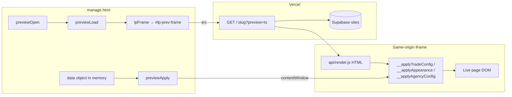
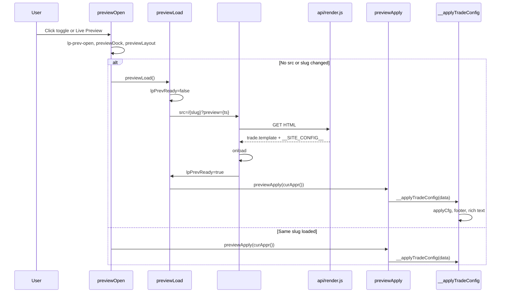
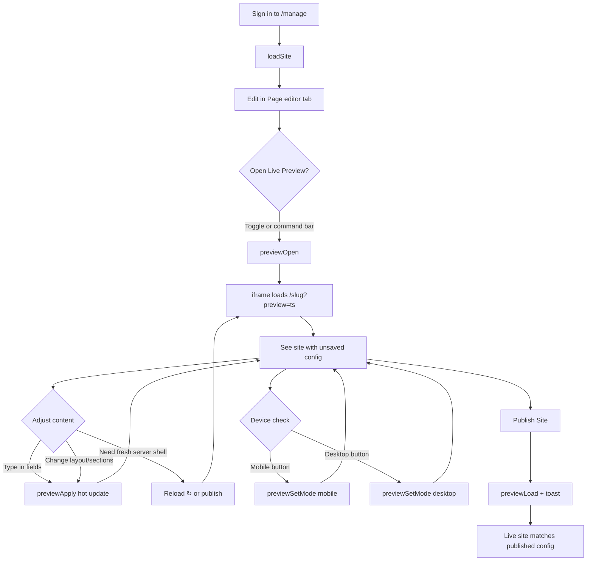
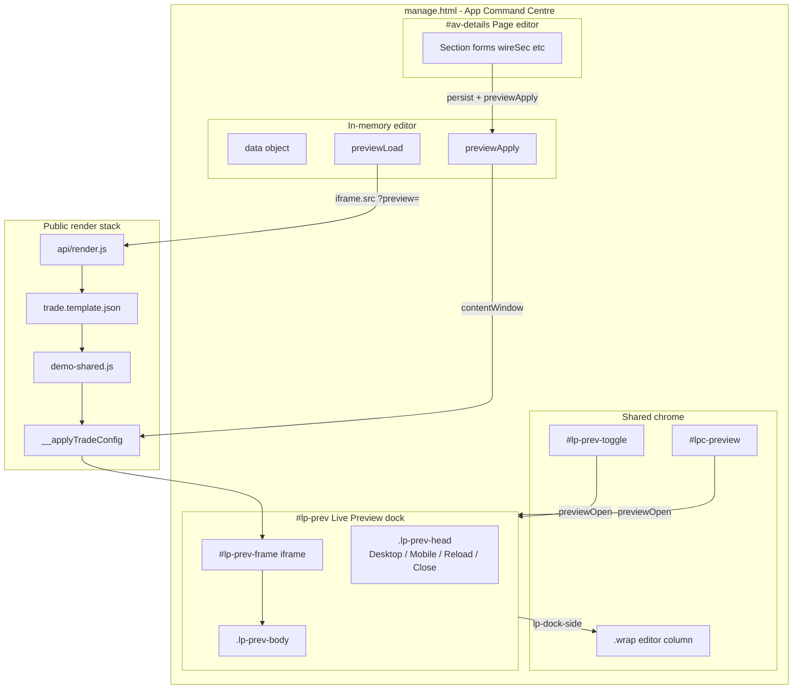
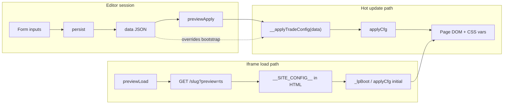
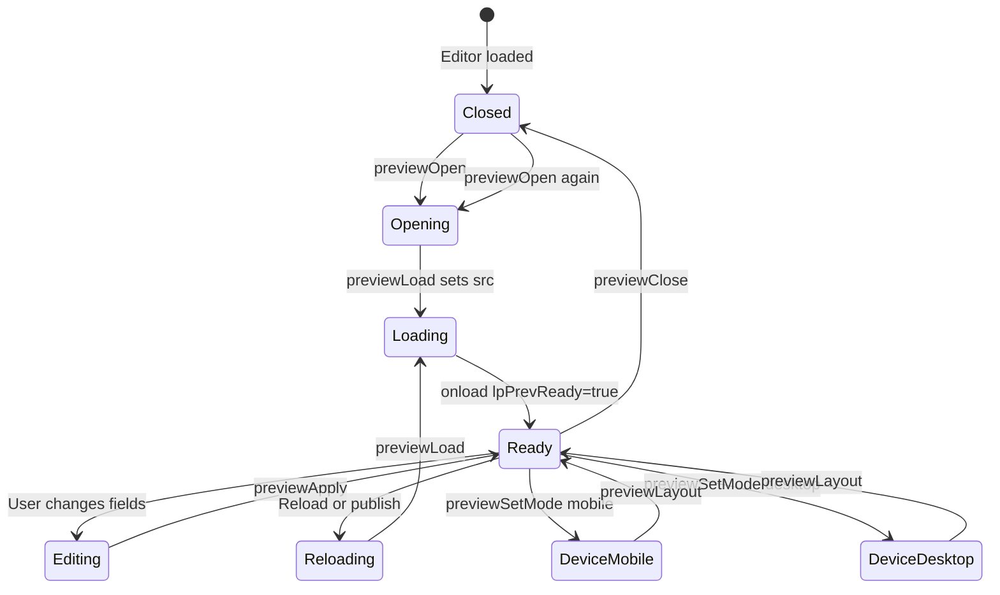

# LeadPages Live Preview — Complete Engineering Manual

**Document:** `features/Live Preview`  
**Status:** Definitive engineering reference for the in-editor iframe preview dock  
**Audience:** Engineers rebuilding, extending, or debugging Live Preview; AI development agents  
**Prerequisites:** [00-VISION](../00-VISION.md), [01-ARCHITECTURE](../01-ARCHITECTURE.md), [10-EDITOR](../10-EDITOR.md), [03-TEMPLATE-SYSTEM](../03-TEMPLATE-SYSTEM.md), [04-SITE-BUILDER](../04-SITE-BUILDER.md)

> **Scope note:** This document describes the **iframe Live Preview dock** in `manage.html` — the fixed panel opened via `#lp-prev-toggle` or command-bar **Live Preview**. It is **not** broker-app inline calculator preview (`pushPreview` / `__refreshRates`), partner **Preview** links that open `/{slug}?preview=1` in a new tab, or super-admin suspended-page mini-previews in Settings.

> **DOM naming:** Older docs refer to `#lp-prev-dock`. The implementation uses `<aside id="lp-prev" class="lp-prev">` with iframe `#lp-prev-frame`. Body classes `lp-prev-open`, `lp-dock-side`, and `lp-dock-bottom` control layout. This manual uses **Live Preview dock** as the product name and lists actual element IDs.

---

## Executive Summary

Live Preview is the **WYSIWYG iframe panel** in the App Command Centre (`manage.html`). It loads the **real public render path** (`api/render.js` → token templates) for the current site slug, then pushes unsaved editor state into the iframe via **same-origin direct JavaScript calls** — no `postMessage`.

For **trade** sites (primary use case), every field change in the Page editor calls `previewApply()`, which invokes `contentWindow.__applyTradeConfig(data)` with the in-memory `data` object. Full iframe reload happens only on open, slug change, publish, or explicit reload — not on every keystroke.

| Fact | Detail |
|------|--------|
| **DOM** | `#lp-prev` (dock), `#lp-prev-frame` (iframe), `#lp-prev-toggle` (tab button) |
| **Entry** | `previewOpen()` — from toggle tab or `#lpc-preview` in command bar |
| **Load URL** | `/{slug}?preview={timestamp}` — cache buster; any truthy `preview` query |
| **Hydrate (trade)** | `w.__applyTradeConfig(data)` — defined in `demo-shared.js` / trade template |
| **Hydrate (broker-app)** | `w.__applyAppearance(curAppr())` |
| **Hydrate (partner home)** | `w.__applyAgencyConfig({ business, ...data })` |
| **Ready gate** | `lpPrevReady` — set on iframe `onload`; `previewApply` no-ops until true |
| **Unsaved state** | Preview shows **editor `data`**, not last published `sites.config` |

---

## Purpose

### Product purpose

Site owners and partners edit dozens of sections, colours, and layout options. Describing changes in copy is insufficient — they need to **see the real page** while editing, including section order, theme tokens, and optional preview-only section labels.

Live Preview answers:

1. **Does this look right before I publish?** — immediate visual feedback on trade sites.
2. **How does mobile vs desktop feel?** — device mode toggles without leaving the editor.
3. **Can I preview a draft site?** — non-live sites 404 on clean URLs but render with `?preview=`.

The subtitle **“unsaved look”** (`#lp-prev-sub`) communicates that the iframe reflects current editor state, not necessarily what visitors see until **Publish**.

### Engineering purpose

- **Production parity:** iframe loads the same HTML/JS pipeline as visitors (`api/render.js`), not a simplified mock.
- **Incremental updates:** `__applyTradeConfig` mutates DOM/CSS from config — avoids reloading a multi-hundred-KB template on every `input` event.
- **Template branching:** one preview subsystem dispatches to the correct hydration function per template / partner-home flag.
- **Responsive dock:** side panel on wide viewports; bottom sheet on narrower screens — editor `.wrap` reflows so both remain usable.

---

## Business Purpose

| Stakeholder | Value |
|-------------|-------|
| **Site owner (tradie)** | Confidence to publish; fewer “it looked different live” support tickets |
| **Partner / broker** | Demo and iterate client sites without constant publish cycles |
| **LeadPages (platform)** | Differentiator vs static form builders; reduces churn from preview mistrust |
| **Super-admin** | Same preview when editing any site; draft/mockup sites still viewable |

Live Preview supports the model: **hosted sites edited in-browser** where the editor and public site share one render stack.

---

## User Types

| User | Sees Live Preview? | Typical journey |
|------|-------------------|-----------------|
| **Super-admin** | Yes, when authenticated in editor | Opens dock while editing trade site → tweaks hero → publishes |
| **Broker / partner** | Yes | Builds client site in Details tab with dock open |
| **Site owner** | Yes, with editor access | Edits copy with preview dock pinned on wide monitor |
| **Leads-only demo** (`leads` role) | **No** — calculator demo only | No site iframe preview |
| **Anonymous visitor** | **No** — separate flow | May use `/{slug}?preview=1` link from partner portal (new tab) |

**Not in scope:** Public preview links (`partner.html`, showcase cards) open the site in a **new browser tab** with `?preview=1`; they do not use the editor dock.

---

## Permissions

| Layer | Mechanism |
|-------|-----------|
| **Editor access** | Supabase auth + `gate()` — preview toggle hidden until `authed` |
| **Site RLS** | User must be allowed to load site in editor; preview URL is same-origin `/slug` |
| **Non-live sites** | `api/render.js`: `if (!isLive && !isPreview) return notFound` — iframe **must** include `?preview=` |
| **Preview password** | Sites with `preview_password` show gate HTML unless cookie / `?pw=` matches |
| **Billing lock** | `#bill-lock` blocks entire editor including preview |
| **Command bar** | `#lpc-preview` injected by `ensureSiteBar()` alongside Publish |

Preview does not bypass auth on the **editor** side. The iframe request is same-origin and inherits the user’s session cookies for password gates.

---

## Preview Dock Layout

Fixed panel structure (inline CSS in `manage.html` ~297–344):

```text
┌──────────────────────────────────────────────────────────────┐
│  EDITOR (.wrap) — reflows when dock open                     │
│  Command bar: [Publish] [Live Preview] …                     │
│  Tabs: Dashboard | Page editor | …                           │
├──────────────────────────────┬───────────────────────────────┤  ← side dock (≥1680px)
│                              │  #lp-prev HEAD                │
│  Page editor forms           │  Live preview · unsaved look  │
│                              │  [Desktop|Mobile] ↻ ✕        │
│                              ├───────────────────────────────┤
│                              │  #lp-prev-body                │
│                              │  ┌─────────────────────────┐  │
│                              │  │ #lp-prev-frame (iframe) │  │
│                              │  └─────────────────────────┘  │
└──────────────────────────────┴───────────────────────────────┘

Bottom dock (<1680px): same panel spans full width, height 60vh, .wrap gets margin-bottom
```

**Closed state:** `#lp-prev-toggle` fixed tab on right edge (“◧ Live preview”).

**Body classes:**

| Class | Meaning |
|-------|---------|
| `lp-prev-open` | Dock visible; `.lp-prev { display:flex }` |
| `lp-dock-side` | Right rail; width `--lp-pw` (40% viewport, clamp 560–860px) |
| `lp-dock-bottom` | Bottom sheet; 60vh height |

**Side-dock editor reflow:** `.wrap` max-width shrinks so editor content stays centred in the remaining left column (cap 1080px).

---

## Navigation

### Opening and closing

| Trigger | Handler | Effect |
|---------|---------|--------|
| `#lp-prev-toggle` | `previewOpen()` | Show dock; load or apply |
| `#lpc-preview` (command bar) | `previewOpen()` | Same |
| `#lp-prev-close` | `previewClose()` | Hide dock; restore `.wrap` |
| `#lp-prev-reload` | `previewLoad()` | Force iframe reload |

`previewInit()` wires listeners at boot (~4952); toggle visibility restored in `afterLogin()` (~1704).

### Device mode

| Control | Handler | Behaviour |
|---------|---------|-----------|
| `.lp-dev button[data-dev="desktop"]` | `previewSetMode('desktop')` | iframe width capped at 1040px, centred |
| `.lp-dev button[data-dev="mobile"]` | `previewSetMode('mobile')` | iframe width min(412px, panel−20), centred |

Default mode: `desktop` if `window.innerWidth >= 900`, else `mobile`. Mobile toggle hidden below 560px viewport (`@media`).

### Site switch while dock open

`loadSite()` checks `document.body.classList.contains('lp-prev-open')` and calls `previewLoad()` (~2171, ~2181) so iframe targets the new slug.

---

## Controls (Widgets)

| Widget | Element | Role |
|--------|---------|------|
| **Toggle tab** | `#lp-prev-toggle` | Open dock from collapsed state |
| **Header title** | `.lp-prev-head strong` | “Live preview” label |
| **Status subtitle** | `#lp-prev-sub` | “unsaved look” — editor state, not DB |
| **Device switcher** | `.lp-dev` | Desktop / mobile layout simulation |
| **Reload** | `#lp-prev-reload` | `previewLoad()` — fresh server HTML + hydrate |
| **Close** | `#lp-prev-close` | `previewClose()` |
| **Iframe** | `#lp-prev-frame` | Same-origin site document |

---

## Preview State Machine

Internal module state (closure in `manage.html` ~1354):

| Variable | Type | Purpose |
|----------|------|---------|
| `lpPrevReady` | `boolean` | iframe loaded; safe to call `previewApply` |
| `lpPrevSlug` | `string \| null` | Slug last loaded into iframe |
| `lpMode` | `'desktop' \| 'mobile'` | Device simulation mode |
| `lpPw` | `number` | Side dock width in px |
| `lpRsz` | timeout id | Debounced resize handler (120ms) |

**Open decision tree (`previewOpen`):**

```text
previewOpen()
  → lp-prev-open + show #lp-prev
  → previewDock() + previewLayout()
  → if !fr.src OR lpPrevSlug !== previewTarget()
        previewLoad()          // full navigation
    else
        previewApply(curAppr()) // hot update only
```

---

## Quick Actions

| Action | Trigger | Handler | Notes |
|--------|---------|---------|-------|
| **Open preview** | Toggle / command bar | `previewOpen()` | May load or hot-apply |
| **Close preview** | ✕ button | `previewClose()` | Restores layout classes |
| **Reload iframe** | ↻ button | `previewLoad()` | Resets `lpPrevReady` until onload |
| **Switch device** | Desktop / Mobile | `previewSetMode` → `previewLayout` | CSS width only; no reload |
| **Edit any field** | Page editor inputs | `persist()` + `previewApply()` | ~100+ call sites in `manage.html` |
| **Apply theme preset** | Colour / trade preset | `previewApply()` via `applyApprAdmin` or direct | Trade uses full `data` |
| **Publish** | `#btn-publish` | `publishToDB()` → `previewLoad()` if dock open | Syncs iframe with saved config |
| **Change appearance** | Broker-app theme | `applyApprAdmin()` → `previewApply(a)` | Partial appearance object |

---

## Editor Integration (When Preview Updates)

Almost every Page editor mutation calls `previewApply()` after `persist()`. Representative areas:

| Editor area | Example handlers | Preview path |
|-------------|------------------|--------------|
| Section toggles | `.sec-toggle`, `sec-on-*` | `previewApply()` |
| Section order | drag-drop `.ord-row` | `previewApply()` |
| Layout picker | `#layout-pick` | `previewApply()` |
| Hero / quote / lists | `wireSec`, `setList` | `previewApply()` |
| Trade colour presets | `applyColourPreset` | `previewApply()` |
| Service packs | `applyTradePack` | `renderDetails()` + `previewApply()` |
| Logo & header | `renderLogo` | `lgPreview()` + `pushPreview()` (broker calc); trade uses `previewApply` via sections |
| Landing footer | `.lpf-*` controls | `previewApply()` |
| Starter content | `loadStarter` | `renderDetails()` + `previewApply()` |

**Broker-app exception:** `publishToDB()` skips `previewLoad()` for `broker-app` (~4062) — broker preview uses appearance hydration, not full trade reload semantics.

---

## Site Selection

Preview URL slug comes from **`previewTarget()`**:

```javascript
function previewTarget(){ return currentSiteSlug || 'demo'; }
```

| Event | Preview behaviour |
|-------|-------------------|
| `loadSite(site)` | If dock open → `previewLoad()` |
| `publishToDB()` | If dock open and not broker-app → `previewLoad()` |
| Slug edit in Settings | Next open compares `lpPrevSlug !== previewTarget()` → reload |

Changing sites while dock is closed does not load iframe until next `previewOpen()`.

---

## Notifications

| Type | Mechanism | Relevance |
|------|-----------|-----------|
| **Toast** | `toast()` on publish / errors | “Published — live on your site” after reload |
| **Subtitle** | `#lp-prev-sub` static “unsaved look” | Not a dynamic dirty flag |
| **Silent failure** | `previewApply` empty `catch(e){}` | iframe not ready or cross-origin would fail silently |
| **Billing lock** | Full-screen overlay | Blocks opening preview |

There is no “preview failed to load” toast today — failed loads leave `lpPrevReady=false`.

---

## Data Sources



| Source | Used for | Notes |
|--------|----------|-------|
| **In-memory `data`** | `previewApply` → `__applyTradeConfig(data)` | Unsaved editor state |
| **`sites.config` (DB)** | Initial iframe HTML via `__SITE_CONFIG__` | Bootstrap only; may lag editor until apply |
| **`curAppr()`** | Broker-app appearance branch | Merged `DEFAULT_APPEARANCE` + `data.appearance` |
| **`currentSiteSlug`** | iframe URL path | |
| **`currentSiteTemplate`** | Which hydration fn to call | `trade`, `broker-app`, etc. |
| **`currentIsPartnerHome`** | Agency branch | `__applyAgencyConfig` |

---

## API Calls

Live Preview triggers **one primary HTTP request** on load/reload:

| Request | Method | Called by | Query | Response |
|---------|--------|-----------|-------|----------|
| `/{slug}` | GET | `previewLoad()` sets `iframe.src` | `preview={Date.now()}` | Full HTML from `api/render.js` |

**Not separate preview API** — same handler as public site with preview flag.

### `?preview=` server semantics (`api/render.js`)

| Behaviour | Detail |
|-----------|--------|
| **Draft access** | Non-live sites allowed when `req.query.preview` is truthy |
| **Cache** | Preview responses: `cache-control: no-store`, `X-Robots-Tag: noindex` (via `sendHtml`) |
| **Password gate** | `preview_password` + cookie / `?pw=` before HTML |
| **Suspended billing** | Suspended page may replace content even in preview |
| **Partner home** | Renders agency template, not trade shell |

External tab links often use `?preview=1` (static); editor uses `?preview={timestamp}` for cache busting. Both satisfy `!!req.query.preview`.

---

## Database Tables

Live Preview does **not** write to the database. Read path:

| Table | Role in preview |
|-------|-----------------|
| **`sites`** | `slug`, `config`, `status`, `template`, `preview_password`, billing fields — loaded by `api/render.js` |
| **`demo_themes`** | Broker-app demo bar when slug is `demo` |
| **`system_pages`** | Suspended page copy if billing blocked |

Publishing (`sites.update`) is separate; preview shows unsaved `data` until publish + optional `previewLoad()`.

---

## Related Files

| File | Relationship |
|------|--------------|
| **`manage.html`** | **Primary implementation** — all preview JS/CSS/DOM (~297–344, ~894–898, ~1353–1432, ~4952) |
| **`api/render.js`** | Serves iframe HTML; `?preview=` gate for drafts |
| **`trade.template.json`** | Token template with embedded `demo-shared.js` |
| **`marketplace/demos/demo-shared.js`** | `applyCfg()` + `window.__applyTradeConfig` |
| **`brokerapp.template.json`** | `window.__applyAppearance` |
| **`agency.template.json`** | `window.__applyAgencyConfig` (partner home) |
| **`lib/seo/template.js`** | SEO bootstrap calling `__applyTradeConfig` |
| **`docs/10-EDITOR.md`** | Preview System section (~486–516) |
| **`docs/04-SITE-BUILDER.md`** | Builder preview summary |
| **`docs/03-TEMPLATE-SYSTEM.md`** | Hydration function reference |
| **`api/manage.html`** | Legacy duplicate — keep in sync manually (drift risk) |
| **`partner.html`** | External `?preview=1` links — not editor dock |

---

## Functions

### Core preview module

| Function | Lines (approx.) | Role |
|----------|-----------------|------|
| `lpFrame()` | ~1355 | Returns `#lp-prev-frame` element |
| `previewTarget()` | ~1356 | Slug for URL: `currentSiteSlug \|\| 'demo'` |
| `previewApply(a?)` | ~1357–1363 | Hydrate iframe via `contentWindow` |
| `previewLoad()` | ~1365–1369 | Set `src`, onload → ready + layout + apply |
| `previewDock()` | ~1371–1376 | Side vs bottom; set `--lp-pw` |
| `previewLayout()` | ~1378–1402 | Size/centre iframe; reflow `.wrap` |
| `previewSetMode(m)` | ~1404–1407 | Desktop/mobile toggle |
| `previewOpen()` | ~1409–1416 | Show dock; load or apply |
| `previewClose()` | ~1418–1422 | Hide dock; reset layout |
| `previewInit()` | ~1424–1431 | Wire UI + resize debounce |

### Hydration targets (iframe `contentWindow`)

| Function | Template / condition | Payload |
|----------|---------------------|---------|
| `__applyTradeConfig(cfg)` | `currentSiteTemplate === 'trade'` | Full `data` object |
| `__applyAgencyConfig(cfg)` | `currentIsPartnerHome` | `{ business: currentBusinessName, ...data }` |
| `__applyAppearance(a)` | Other (e.g. broker-app) | `curAppr()` appearance object |

### Shared dependencies

| Function | Role for Live Preview |
|----------|----------------------|
| `applyApprAdmin(a)` | Broker theme on editor chrome + `previewApply(a)` |
| `curAppr()` | Merged appearance defaults |
| `persist()` | Saves to `data` / local state before apply |
| `ensureSiteBar()` | Adds `#lpc-preview` → `previewOpen` |
| `loadSite()` | Reloads iframe if dock open |
| `publishToDB()` | Post-publish `previewLoad()` for non-broker-app |
| `renderDetails()` | Rebuilds forms; callers invoke `previewApply` on input |

### `__applyTradeConfig` implementation

Defined at end of `demo-shared.js` (~690):

```javascript
window.__applyTradeConfig = function(_c){
  applyCfg(_c);
  try { _lpFooterApply(_c); } catch(_e){}
  _lpRichWalk(document.body);
};
```

`applyCfg()` (~6–665) applies theme CSS variables, section visibility, logo, services grid, hero CTAs, quote form colours, SEO token replacement, and **preview-only section labels** when URL matches `/[?&]preview=/`.

---

## Event Flow

### Open preview (first time or slug change)



### Field edit (hot path)

1. User changes input in Page editor.
2. Handler updates `data`, calls `persist()`.
3. `previewApply()` — if `lpPrevReady`, calls `__applyTradeConfig(data)`.
4. `applyCfg` mutates DOM/CSS in iframe without navigation.

### Publish with dock open

1. `publishToDB()` writes `sites.config`.
2. If `lp-prev-open` and not `broker-app`, `previewLoad()` refreshes iframe from server.
3. Onload runs `previewApply` so iframe matches saved + any subsequent edits.

---

## User Journey



**Wide-monitor partner journey:** Open side dock (`≥1680px`) → edit hero in left column → watch trade page update instantly on the right → publish when satisfied.

---

## Performance Considerations

| Area | Behaviour | Risk |
|------|-----------|------|
| **Hot apply** | `previewApply` on every input | Heavy sections (large lists) run full `applyCfg` — can jank on slow devices |
| **Full reload** | Only on open/slug/publish/reload | Good — avoids reloading ~MB templates per keystroke |
| **iframe memory** | Single `#lp-prev-frame` | One full trade page in memory while open |
| **Resize** | `previewLayout` debounced 120ms | Cheap |
| **Silent no-op** | `!lpPrevReady` skips apply | Edits during load may need second input or reload |
| **Section labels** | Extra DOM in preview mode only | Regex scan of `[data-sec]` on each apply |

**Recommendations (future):** Debounce `previewApply`; diff config subsets; show loading state while `lpPrevReady=false`.

---

## Security Considerations

| Topic | Detail |
|-------|--------|
| **Same-origin** | iframe `src` is relative `/{slug}` — editor can call `contentWindow` methods |
| **No postMessage** | Avoids cross-origin message spoofing; requires same-origin render |
| **Preview flag** | Exposes draft sites to anyone with `?preview=` URL — mitigated by editor auth for builder; password gate optional |
| **noindex** | Preview HTML not indexed |
| **XSS in config** | `applyCfg` uses `esc()` for injected strings; rich text walk has limited tag allowlist |
| **PII in preview** | Preview shows business content, not CRM data |
| **Try/catch swallow** | Errors in `previewApply` hidden — could mask injection bugs |

---

## Technical Debt

| ID | Issue | Location | Impact |
|----|-------|----------|--------|
| TD-LP1 | **Docs say `#lp-prev-dock`** | `10-EDITOR.md`, `04-SITE-BUILDER.md` | Actual id is `#lp-prev` |
| TD-LP2 | **iframe title** | `#lp-prev-frame` | Says “Live calculator preview” — copy-paste from broker era |
| TD-LP3 | **Silent previewApply errors** | `catch(e){}` | Hard to debug hydration failures |
| TD-LP4 | **No loading indicator** | Between `previewLoad` and onload | Blank panel |
| TD-LP5 | **`api/manage.html` drift** | Parallel preview code | Wrong file deployed → stale behaviour |
| TD-LP6 | **Broker-app publish skip** | `publishToDB` ~4062 | Dock may show stale server HTML after publish |
| TD-LP7 | **curAppr() on trade open** | `previewOpen` else branch | Harmless — trade branch ignores appearance arg |
| TD-LP8 | **External vs editor preview param** | `?preview=1` vs `?preview=ts` | Both work; inconsistent link style |

---

## Future Improvements

1. **Align DOM id** — rename to `#lp-prev-dock` or update all docs to `#lp-prev`.
2. **Loading / error UI** — spinner while `!lpPrevReady`; toast on iframe error.
3. **Debounced `previewApply`** — 50–100ms coalesce for text inputs.
4. **Dirty indicator** — replace static “unsaved look” with publish-diff hint.
5. **Preview URL bar** — show current slug + sub-page path for landing pages.
6. **postMessage fallback** — if preview ever moves cross-origin (custom domains in iframe).
7. **Broker-app publish reload** — parity with trade after publish.
8. **Deep-link dock open** — `/manage?site=x&preview=1` auto-opens panel.
9. **Accessibility** — focus trap and keyboard close for dock.
10. **Delete `api/manage.html` duplicate** or generate from single source.

---

## Live Preview Architecture



---

## Connections to Other Systems

### Editor (Page editor)

Live Preview is **orthogonal to tabs** — fixed overlay usable while on Dashboard, Details, Landing, etc. Primary value on **Details** (`#av-details`) where `previewApply()` is wired to hundreds of inputs.

Shared globals: `data`, `currentSiteSlug`, `currentSiteTemplate`, `currentIsPartnerHome`.

### Publish pipeline

| Stage | Preview behaviour |
|-------|-------------------|
| **Editing** | iframe shows unsaved `data` via `__applyTradeConfig` |
| **Publish** | DB updated; optional `previewLoad()` refreshes bootstrap JSON |
| **Visitor** | Clean URL without `?preview=`; non-live 404 |

See [04-SITE-BUILDER](../04-SITE-BUILDER.md) `publishToDB()`.

### Template system

Trade sites: server embeds `__SITE_CONFIG__` once; client hydration keeps parity with [03-TEMPLATE-SYSTEM](../03-TEMPLATE-SYSTEM.md).

Preview-only **section labels** (`.lp-seclabel`) render when iframe URL contains `preview=` — helps partners identify sections; stripped on live site.

### Appearance (broker-app)

`applyApprAdmin()` intentionally **does not** repaint editor page bg/ink (readability) but still calls `previewApply()` for full look inside iframe (~1339–1342).

### Partner / external preview

`partner.html` and showcase cards link to `/{slug}?preview=1` in **new tab** — same render path, no `__applyTradeConfig` from editor (uses saved DB config until manual refresh).

### Billing & drafts

Non-live sites require `?preview=` in iframe URL. Billing suspension may replace page content inside preview with system suspended HTML.

---

## Data Flow



---

## User Flow



---

## Glossary

| Term | Meaning |
|------|---------|
| **Live Preview dock** | Fixed `#lp-prev` panel with iframe |
| **`lpPrevReady`** | Boolean gate — iframe document loaded and hydration safe |
| **`previewApply`** | Push editor state into iframe without reload |
| **`previewLoad`** | Full iframe navigation with `?preview=` cache buster |
| **`__applyTradeConfig`** | Trade template hydration entry point |
| **`applyCfg`** | Core DOM/CSS updater inside trade preview script |
| **`?preview=`** | Query flag enabling draft render + preview-only UI |
| **Hot update** | `previewApply` path without `previewLoad` |
| **Side dock** | `lp-dock-side` — viewport ≥1680px |

---

*Last updated: July 2026 — reflects `manage.html` Live Preview implementation on branch `main`.*
