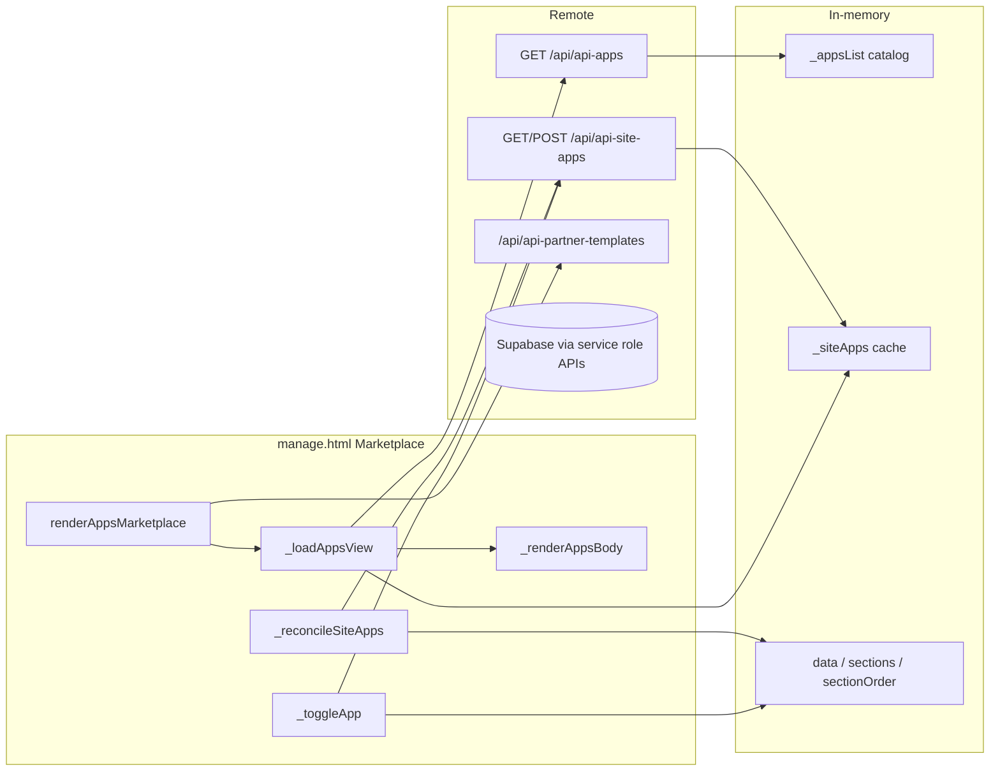
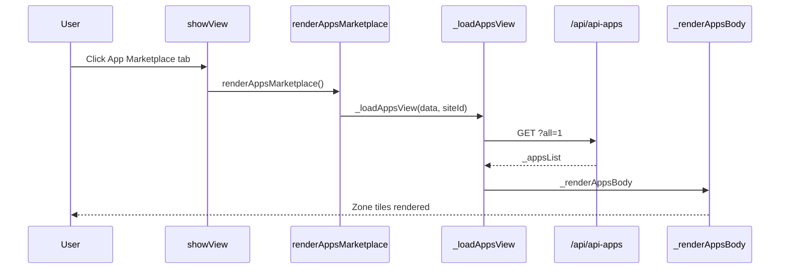
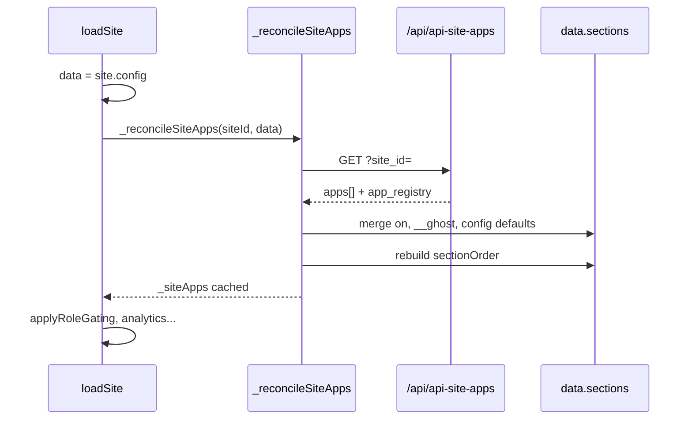
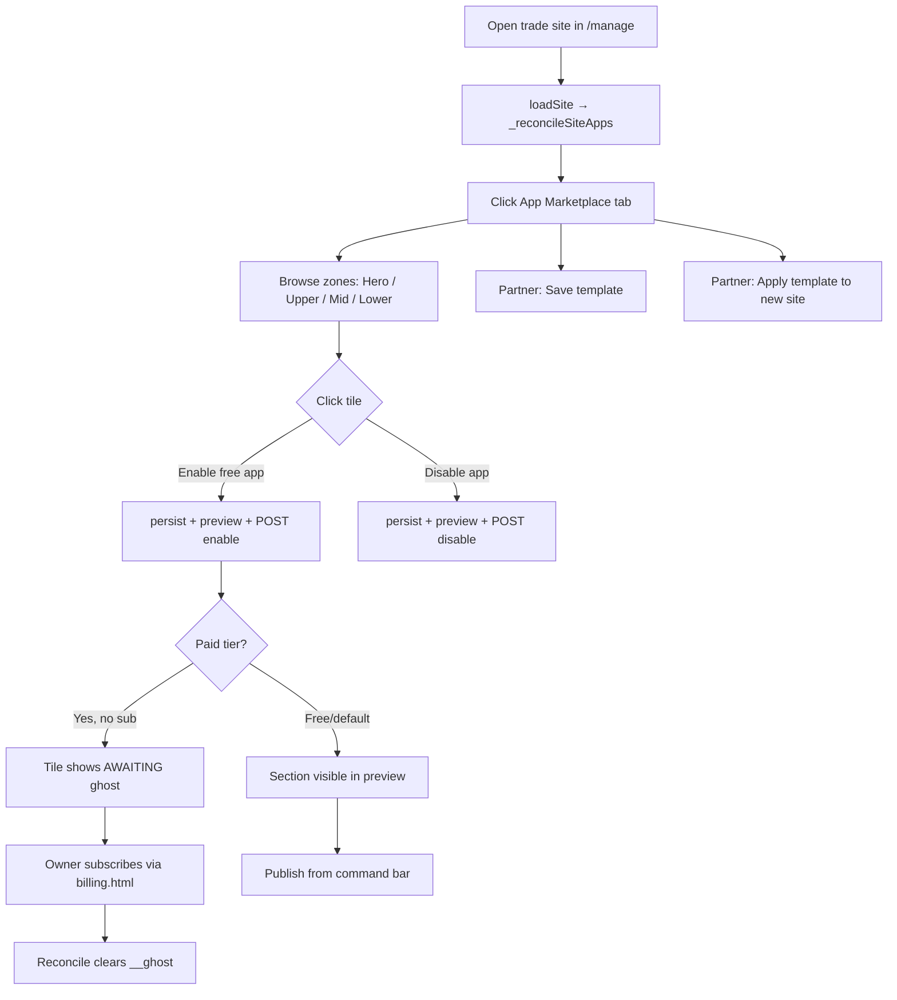
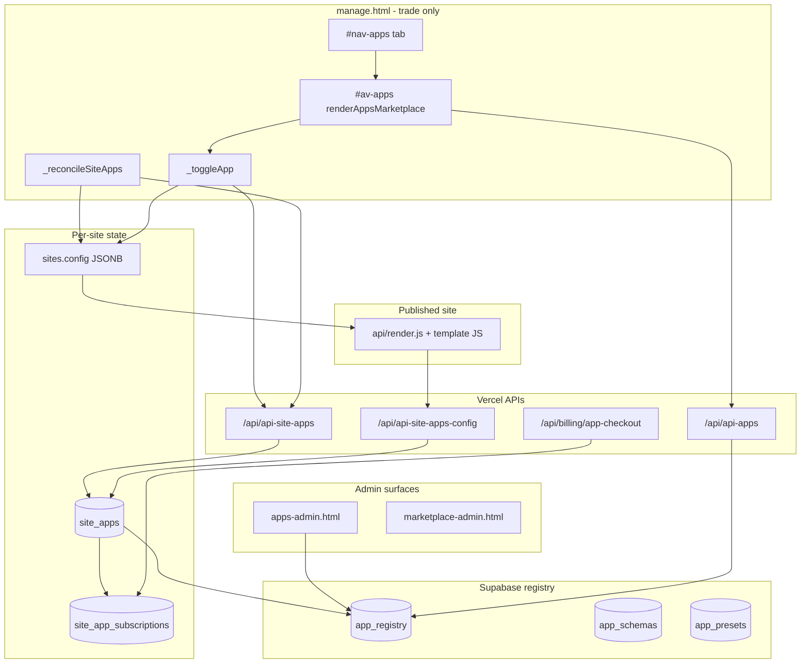
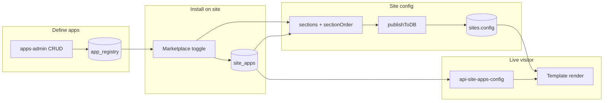
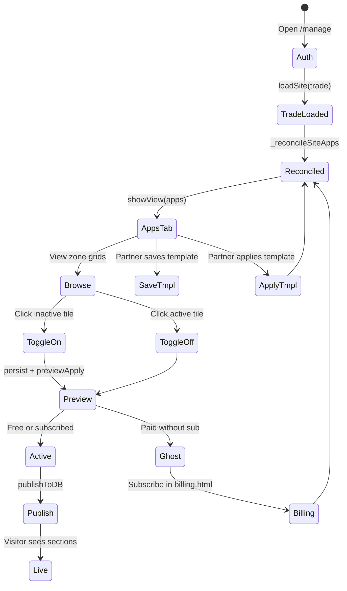

# LeadPages App Marketplace — Complete Engineering Manual

**Document:** `features/Marketplace`  
**Status:** Definitive engineering reference for the per-site App Marketplace in the editor  
**Audience:** Engineers rebuilding, extending, or debugging marketplace installs; AI development agents  
**Prerequisites:** [00-VISION](../00-VISION.md), [01-ARCHITECTURE](../01-ARCHITECTURE.md), [04-SITE-BUILDER](../04-SITE-BUILDER.md), [10-EDITOR](../10-EDITOR.md), [02-DATABASE](../02-DATABASE.md) § Marketplace Tables

> **Scope note:** This document describes the **App Marketplace tab** inside `manage.html` (`#av-apps`, `renderAppsMarketplace`). It is **not** the public marketing catalog at `/marketplace` (`marketplace.html`), the super-admin registry editor at `/apps-admin` (`apps-admin.html`), or the taxonomy admin at `/marketplace-admin` (`marketplace-admin.html`). Those surfaces share `app_registry` but serve different audiences.

---

## Executive Summary

The App Marketplace is a **trade-template-only tab** in the App Command Centre (`manage.html`). It lets partners and super-admins enable, disable, and visually browse installable page sections (“apps”) for a client site. Each app maps 1:1 to a **`section_key`** in `sites.config.sections` and a row in **`site_apps`**.

Implementation is **100% client-side** in `manage.html`: `renderAppsMarketplace` builds the panel, `_loadAppsView` fetches the global catalog from **`/api/api-apps`**, and `_toggleApp` writes both in-memory config (`persist()` + `previewApply()`) and remote state via **`/api/api-site-apps`**. On every `loadSite()` for trade sites, **`_reconcileSiteApps`** merges `site_apps` back into `data.sections` and rebuilds `data.sectionOrder`.

| Fact | Detail |
|------|--------|
| **DOM** | `#av-apps` (hidden panel), `#nav-apps` (tab button “App Marketplace”) |
| **Template gate** | `TEMPLATE_NAV.trade` includes `'apps'`; broker templates do not |
| **Role gate** | `super` and `broker` only (`leads` role has no marketplace) |
| **Entry** | `showView('apps')` → `renderAppsMarketplace()` |
| **Catalog API** | `GET /api/api-apps` (live apps) or `?all=1` (includes draft — editor uses this) |
| **Site API** | `GET/POST /api/api-site-apps` |
| **Registry table** | `app_registry` — app definitions, tiers, Stripe price IDs |
| **Install table** | `site_apps` — per-site enablement, slot, order, config JSONB |
| **Public merge** | `GET /api/api-site-apps-config` — live site loader (not editor tab) |

---

## Purpose

### Product purpose

Trade sites are modular: hero sliders, review feeds, finance calculators, Instagram galleries, and dozens of optional blocks. Site owners and partners need a **single place** to:

1. **See what is available** — grouped by page zone (Hero, Upper, Mid, Lower, Footer).
2. **Turn sections on or off** — without hunting through 40+ chips in Page editor.
3. **Understand billing state** — paid apps show **PAID** / **API** badges; unsubscribed paid apps show **AWAITING** (ghost).
4. **Save and reuse layouts** — partner templates snapshot app on/off + config defaults.

The Marketplace is the upsell and differentiation surface: partners configure a “standard tradie layout” once and apply it to new clients.

### Engineering purpose

- **Dual source of truth reconciliation** — `sites.config` (published JSONB) and `site_apps` (relational installs) stay aligned via `_reconcileSiteApps`.
- **Section semantics reuse** — same `OFF_BY_DEFAULT_SECTIONS`, `_secOn`, `_setSecOn` rules as Page editor toggles.
- **Slot-based ordering** — `position_slot` + `position_order` rebuild `sectionOrder` without manual drag in Marketplace (reorder UI in Page editor Position card is separate).
- **Ghost rendering** — paid apps enabled in DB but lacking subscription get `__ghost` in config; live renderer hides content while editor preview may still show placement.

---

## Business Purpose

| Stakeholder | Value |
|-------------|-------|
| **Site owner (tradie)** | Add premium sections (reviews feed, finance widget) without developer |
| **Partner / broker** | Package layouts; upsell paid apps; faster client onboarding via templates |
| **LeadPages (platform)** | Recurring revenue via `site_app_subscriptions` + Stripe on paid/metered tiers |
| **Super-admin** | Registry control in `apps-admin.html`; draft apps testable via `?all=1` |

The Marketplace connects product catalog (`app_registry`) to tenant installs (`site_apps`) and hosting config (`sites.config`), enabling monetization without forking templates.

---

## User Types

| User | Sees Marketplace? | Typical journey |
|------|-------------------|-----------------|
| **Super-admin** | Yes, on trade sites | Registry in apps-admin → test in editor → enable apps on client sites |
| **Broker / partner** | Yes, on trade sites | Configure layout → save partner template → apply to new trade sites |
| **Site owner** (customer login) | Yes, if trade + editor access | Toggle free apps; paid apps may show AWAITING until subscribed |
| **Leads-only demo** (`leads` role) | **No** — only `rates` tab | Calculator demo |
| **Broker-app / broker-leads sites** | **No** — tab hidden by `TEMPLATE_NAV` | Calculator / leads flows only |

**Not in scope:** Public visitors browse `/marketplace` marketing pages; they never see `#av-apps`.

---

## Permissions

Visibility is the intersection of **role** and **template**:

```text
visible tabs = ALLOWED[currentRole] ∩ TEMPLATE_NAV[currentSiteTemplate]
```

From `manage.html`:

```javascript
const ALLOWED = {
  super:   [..., 'apps', 'dashboard'],
  broker:  [..., 'apps', 'dashboard'],
  leads:   ['rates']
};
const TEMPLATE_NAV = {
  'trade':        ['dashboard','details','landing','apps','mailer'],
  'broker-app':   [...],  // no apps
  'broker-leads': [...]   // no apps
};
```

| Layer | Mechanism |
|-------|-----------|
| **Nav button** | `#nav-apps` hidden until `applyRoleGating()` |
| **Panel** | `#av-apps` `hidden` until `showView('apps')` |
| **Billing lock** | `lpBillingGate()` overlay blocks entire editor including Marketplace |
| **`/api/api-apps`** | Public read for live apps; `?all=1` intended admin-only but **no Bearer check today** |
| **`/api/api-site-apps`** | Service role server-side; **no Bearer check in handler** (known gap) |
| **`/api/billing/app-checkout`** | Requires authenticated site owner or admin for paid subscriptions |
| **`/api/billing/app-status`** | Requires Bearer; site owner or admin |

Super-admins bypass billing lock. Site owners can toggle apps but paid checkout flows live in `billing.html`, not wired from `_toggleApp` today.

---

## Marketplace Layout

The panel is built in `renderAppsMarketplace()` as inline-styled HTML. Vertical structure:

```text
┌─────────────────────────────────────────────────────────────┐
│  CARD 1: App Marketplace                                    │
│  H2 + lede (tiers explanation)                                │
│  #amp-status — loading / error line                         │
│  #amp-body — layout track (zone grids)                        │
├─────────────────────────────────────────────────────────────┤
│  CARD 2: Partner templates (#amp-tmpl-card)                   │
│  #amp-save-tmpl — Save current layout as template             │
│  #amp-load-tmpl — Apply a template to this site               │
└─────────────────────────────────────────────────────────────┘
```

Inside `#amp-body`, `_renderAppsBody` builds **zone sections**:

```text
Layout track — drag to reorder within each slot   ← label (drag not implemented on tiles)

Hero zone      → .amp-tile-grid of apps where default_position = hero
Upper zone     → default_position = upper
Mid zone       → default_position = mid
Lower zone     → default_position = lower
Footer (always on) → default_position = footer
```

Each **app tile** (`.amp-tile`) shows:

- SVG icon from `window.LP_ICONS` via `APP_ICONS[section_key]` map
- App name + truncated tagline
- **PAID** or **API** corner badge for `paid` / `metered` tiers
- **AWAITING** footer strip when `activation_state === 'ghost'`
- Active styling: brand-deep green background when on; white when off

CSS: `.amp-tile-grid` responsive grid (`minmax(110px, 1fr)`), hover lift on tiles.

---

## Navigation

### Tab integration

```javascript
const NAV = [
  // ...
  ['apps','av-apps',renderAppsMarketplace],
];
```

- Click `#nav-apps` → `showView('apps')` → `renderAppsMarketplace()`.
- Trade nav order: `dashboard` → `details` → `landing` → **`apps`** → `mailer`.

### Cross-links

| UI element | Destination |
|------------|-------------|
| Tile click | `_toggleApp` — enable/disable section |
| Page editor section chips | Same `cfg.sections[key].on` — changes reflect after persist |
| Dashboard **Apps on** stat | Count from `_siteApps.filter(a => a.enabled)` — link user to Apps tab manually |
| Partner template apply | `_applyPartnerTemplate` → POST `/api/api-site-apps` per app |
| Paid subscription | Intended: `billing.html` + `/api/billing/app-checkout` — **not invoked from Marketplace UI today** |

---

## App Tiers

Registry rows carry a **`tier`** column consumed by Marketplace and billing:

| Tier | Marketplace behaviour | Subscription |
|------|----------------------|--------------|
| **`default`** | Always on; tile styled as default; cannot meaningfully disable core chrome | None |
| **`free`** | Included with platform; toggle on/off | None |
| **`paid`** | **PAID** badge; ghost if enabled but no active `site_app_subscriptions` | Stripe via `app-checkout` |
| **`metered`** | **API** badge; same ghost rules as paid | Stripe + API usage (future) |

**Activation states** (annotated by `api-site-apps.js` GET):

| `activation_state` | Meaning |
|--------------------|---------|
| `active` | Enabled + tier allows (default/free, or paid with valid sub) |
| `ghost` | Enabled in `site_apps` but paid/metered without valid subscription |
| `disabled` | `enabled = false` in `site_apps` |
| `inactive` | Fallback label in API mapper |

Editor reconciliation (`_reconcileSiteApps`) additionally sets `cfg.sections[key].__ghost = true` for ghost apps and checks `site_app_subscriptions` when present on the row (see Technical Debt — subscription join gap).

---

## Section On/Off Semantics

Marketplace and Page editor share **`OFF_BY_DEFAULT_SECTIONS`** — a long allowlist of section keys that are **off unless explicitly `on: true`**:

```javascript
const OFF_BY_DEFAULT_SECTIONS = [
  'instaGallery','igProjectFeed','lpFooter','navMenu','mobileBar',
  'emergencyAvailability','estimateBuilder','finance','serviceAreaMap',
  // ... 20+ optional components
];
```

| Section type | “On” test | Toggle off writes |
|--------------|-----------|-------------------|
| **Off-by-default** | `sections[key].on === true` | `on: false` |
| **On-by-default** | `sections[key].on !== false` | `on: false` (explicit off) |
| **On-by-default enable** | delete `on: false` key | — |

`_toggleApp` mirrors `_setSecOn` then calls `persist()` and `previewApply()` so preview iframe updates immediately.

---

## Position Slots and sectionOrder

Apps declare **`default_position`** in `app_registry`:

| Slot | `SLOT_IDX` in reconcile | Typical content |
|------|-------------------------|-----------------|
| `nav` | 0 | Navigation (footer tier treated separately in UI) |
| `hero` | 1 | Hero variants, sliders |
| `upper` | 2 | Trust bar, certifications |
| `mid` | 3 | Services, reviews, FAQ |
| `lower` | 4 | CTAs, finance, maps |
| `footer` | 5 | Footer blocks |

`_reconcileSiteApps` sorts enabled apps by `(position_slot, position_order)` and writes **`cfg.sectionOrder`**. Page editor **Position** card (`#ord-list`) allows drag reorder of the merged order — separate from Marketplace tiles.

POST body to enable includes:

```json
{
  "site_id": "...",
  "app_id": "...",
  "action": "enable",
  "position_slot": "mid"
}
```

---

## Widgets and UI Elements

| Element | ID / class | Loader | Description |
|---------|------------|--------|-------------|
| **Header card** | inline in `#av-apps` | `renderAppsMarketplace` | Title + tier explanation lede |
| **Status line** | `#amp-status` | `_loadAppsView` | “Loading apps…” or error |
| **Layout body** | `#amp-body` | `_renderAppsBody` | Zone grids + tiles |
| **App tile** | `.amp-tile` | `_renderAppsBody` | Click to toggle; `data-appid`, `data-seckey`, `data-on` |
| **Partner templates** | `#amp-tmpl-card` | `renderAppsMarketplace` | Save / apply layout presets |
| **Save template** | `#amp-save-tmpl` | `_savePartnerTemplate` | POST `/api/api-partner-templates` |
| **Apply template** | `#amp-load-tmpl` | `_applyPartnerTemplate` | GET + POST partner-templates + site-apps |

---

## Quick Actions

| Action | Trigger | Handler |
|--------|---------|---------|
| **Toggle app** | `.amp-tile` click | `_toggleApp` → persist, preview, POST site-apps |
| **Save partner template** | `#amp-save-tmpl` | `_savePartnerTemplate` — snapshots all apps + enabled state |
| **Apply partner template** | `#amp-load-tmpl` | `_applyPartnerTemplate` — prompt pick list, bulk POST |
| **Refresh after template** | post-apply | `_loadAppsView` rebuilds tiles |

Tile click optimistically updates DOM colors before API completes; cache `_siteApps` updated synchronously.

---

## Site Selection

Marketplace always reflects **`currentSiteId`** and in-memory **`data`** (site config):

| Path | Function |
|------|----------|
| Account landing grid | `loadSite(site)` |
| Deep link | `/manage?site={slug}` |
| Command-bar site `<select>` | `ensureSiteBar()` |

On `loadSite()` for **trade** template:

1. Clone `site.config` → `data`; `lpSeedTrade(data)` seeds defaults.
2. **`_reconcileSiteApps(currentSiteId, data)`** — async fetch site-apps, merge sections.
3. Then `applyRoleGating()`, analytics, etc.

If user opens Apps tab **before** reconcile finishes, `_loadAppsView` may re-fetch site-apps when `_siteApps` cache is empty.

Changing sites clears implicit state: `_siteApps` repopulated on reconcile; `_appsList` refetched when tab renders.

---

## Notifications

No dedicated Marketplace notification center. Related patterns:

| Type | Mechanism | Relevance |
|------|-----------|-----------|
| **Alert** | `alert()` on template save/apply errors | Partner template flows |
| **Console warn** | `site_apps reconciliation failed` | Silent degrade — cfg stays authoritative |
| **AWAITING strip** | Ghost tile footer | Visual only — no email |
| **Toast** | `toast()` elsewhere in editor | Not used in marketplace functions |
| **Billing lock** | `#bill-lock` | Blocks Marketplace entirely |

---

## Data Sources



| Source | Table / endpoint | Fields used |
|--------|------------------|-------------|
| **Catalog** | `GET /api/api-apps?all=1` | `id`, `slug`, `section_key`, `name`, `tagline`, `tier`, `default_position`, `sort_order`, … |
| **Site installs** | `GET /api/api-site-apps?site_id=` | `enabled`, `position_slot`, `position_order`, `config`, nested `app_registry` |
| **In-memory config** | `data.sections`, `data.sectionOrder` | `on`, `__ghost`, section fields |
| **Partner templates** | `/api/api-partner-templates` | `apps[]` with `app_id`, `enabled`, `slot`, `order`, `config_defaults` |
| **Subscriptions** | `site_app_subscriptions` | Intended in reconcile; partially wired |
| **Public live site** | `GET /api/api-site-apps-config` | Merges enabled apps at page load (outside editor tab) |

---

## API Calls

### `GET /api/api-apps` (`api/api-apps.js`)

| Query | Response | Auth (documented) | Auth (actual) |
|-------|----------|-------------------|---------------|
| *(none)* | `{ apps: [...] }` live only (`marketplace_status = 'live'`) | Public | Public (service role) |
| `?slug=<slug>` | `{ app, schema, presets }` single app detail | Public | Public |
| `?all=1` | All apps including `draft` | Admin only | **No check** — editor calls this |

Selected columns: `id`, `slug`, `section_key`, `name`, `tagline`, `tier`, prices, `default_position`, `can_reposition`, `hero_exclusive`, `api_dependency`, `marketplace_status`, `builder_visible`, `sort_order`.

Cache headers: `s-maxage=120`.

### `GET /api/api-site-apps` (`api/api-site-apps.js`)

| Query | Response |
|-------|----------|
| `?site_id=<uuid>` | `{ ok: true, apps: [...] }` with `activation_state` annotation |

Select joins `app_registry(slug, section_key, name, tier, default_position, …)`. Does **not** currently join `site_app_subscriptions` (reconcile expects it — see debt).

### `POST /api/api-site-apps`

| Body field | Required | Actions |
|------------|----------|---------|
| `site_id`, `app_id`, `action` | Yes | — |
| `action: 'enable'` | — | Upsert `enabled: true`, `position_slot`, `position_order`, `config` |
| `action: 'disable'` | — | Update `enabled: false` |
| `action: 'update'` | — | Patch `config`, `position_slot`, `position_order` |

Conflict target: `(site_id, app_id)`.

### `GET /api/api-site-apps-config` (`api/api-site-apps-config.js`)

Used by **published site loader**, not the Marketplace tab. Returns:

```json
{
  "sections": { "reviews": { "on": true, ... } },
  "sectionOrder": ["hero", "services", "reviews"],
  "ghostKeys": ["finance"]
}
```

Applies subscription checks with joined `site_app_subscriptions`.

### Related billing APIs

| Endpoint | Purpose |
|----------|---------|
| `POST /api/billing/app-checkout` | Stripe checkout / add subscription item for paid app |
| `GET /api/billing/app-status?siteId=` | List `site_app_subscriptions` with computed state |
| `POST /api/billing/app-cancel` | Cancel app subscription |

---

## Database Tables

### `app_registry`

| Column (representative) | Purpose |
|-------------------------|---------|
| `id` | UUID primary key; FK from `site_apps.app_id` |
| `slug` | URL slug for marketing / API lookup |
| `section_key` | Maps to `sites.config.sections[section_key]` |
| `name`, `tagline` | Marketplace tile copy |
| `tier` | `default` \| `free` \| `paid` \| `metered` |
| `marketplace_status` | `live` \| `draft` — filtered unless `?all=1` |
| `default_position` | `hero`, `upper`, `mid`, `lower`, `footer`, … |
| `can_reposition`, `hero_exclusive` | Layout constraints |
| `price_monthly_aud`, `price_annual_aud` | Display + checkout |
| `stripe_price_id_monthly`, `stripe_price_id_annual` | Stripe Price IDs |
| `api_dependency` | Metered apps — external API flag |
| `builder_visible`, `sort_order` | Editor ordering |

**Admin UI:** `apps-admin.html` CRUD.  
**Related:** `app_schemas` (JSON schema), `app_presets` (default configs).

### `site_apps`

| Column | Purpose |
|--------|---------|
| `site_id` | FK → `sites.id` |
| `app_id` | FK → `app_registry.id` |
| `enabled` | Boolean install toggle |
| `position_slot` | Page zone |
| `position_order` | Sort within zone |
| `config` | JSONB per-app settings merged into `sections[key]` |
| `placed_at` | Timestamp |

**Unique:** `(site_id, app_id)`.

### `site_app_subscriptions`

Per-app Stripe billing. Reconcile and `api-site-apps-config` use `status`, `access_until` to determine ghost vs active.

### `partner_templates`

Partner-owned layout snapshots; Marketplace save/apply uses `/api/api-partner-templates` (separate from `app_registry` but operates on app IDs).

---

## Related Files

| File | Relationship |
|------|--------------|
| **`manage.html`** | **Primary implementation** — all Marketplace UI logic |
| `api/manage.html` | Legacy duplicate — trade nav **lacks** `dashboard`; marketplace code present but not source of truth |
| `api/api-apps.js` | Catalog read API |
| `api/api-site-apps.js` | Site install GET/POST |
| `api/api-site-apps-config.js` | Public site section merge |
| `api/api-partner-templates.js` | Partner layout save/apply |
| `api/billing/app-checkout.js` | Paid app Stripe flow |
| `api/billing/app-status.js` | Subscription listing |
| `apps-admin.html` | Super-admin registry CRUD |
| `marketplace.html` / `marketplace-feature.html` | Public marketing catalog |
| `marketplace-admin.html` | `catalog_*` taxonomy admin |
| `billing.html` | Account + app subscription management UI |
| `partner-dashboard.html` | Counts enabled `site_apps` per site |
| `docs/features/Dashboard.md` | **Apps on** stat reads `_siteApps` |
| `docs/04-SITE-BUILDER.md` | Marketplace integration summary |
| `docs/10-EDITOR.md` | Panel reference + function table |
| `docs/02-DATABASE.md` | Full schema |

---

## Functions

### Core Marketplace

| Function | Lines (approx.) | Role |
|----------|-----------------|------|
| `renderAppsMarketplace()` | ~4621–4642 | Build panel HTML, wire template buttons, call `_loadAppsView` |
| `_loadAppsView(c, siteId)` | ~4644–4663 | Fetch `api-apps?all=1`, ensure `_siteApps`, call `_renderAppsBody` |
| `_renderAppsBody(c, siteId, body)` | ~4665–4787 | Zone grids, tiles, click handlers |
| `_toggleApp(c, siteId, secKey, appId, on)` | ~4789–4818 | Update config, cache, POST site-apps |
| `_reconcileSiteApps(siteId, cfg)` | ~4552–4619 | On load: merge site_apps → sections + sectionOrder |
| `_savePartnerTemplate(c)` | ~4820–4844 | Snapshot layout to partner_templates |
| `_applyPartnerTemplate(c, siteId)` | ~4501–4550 | Apply template apps via bulk POST |

### Module state

| Variable | Purpose |
|----------|---------|
| `_appsLoaded` | Declared; lightly used legacy flag |
| `_appsList` | Cached catalog from last `_loadAppsView` |
| `_siteApps` | Cached site install rows; shared with Dashboard `_dashAppsCount` |

### Shared dependencies

| Function | Role for Marketplace |
|----------|---------------------|
| `showView('apps')` | Shows `#av-apps`; invokes `renderAppsMarketplace` |
| `applyRoleGating()` | Shows `#nav-apps` for trade + allowed roles |
| `loadSite()` | Triggers `_reconcileSiteApps` on trade sites |
| `persist()` | Writes config to memory / local save path |
| `previewApply()` | Refreshes preview iframe |
| `_secOn` / `_setSecOn` | Same on/off semantics as Page editor |
| `esc()` | XSS escape on tile text |
| `OFF_BY_DEFAULT_SECTIONS` | Opt-in vs opt-out section list |

### Inner helpers in `_renderAppsBody`

| Function | Role |
|----------|------|
| `appStatus(app)` | Computes on/ghost/inactive from `SEC` + `_siteApps` |
| `appTile(app)` | HTML string for one tile |
| `APP_ICONS` | Maps `section_key` → Lucide-style icon name |

---

## Event Flow

### Marketplace mount



### Site load reconcile (trade)



### Toggle app

1. User clicks `.amp-tile`.
2. `_toggleApp` updates `c.sections[secKey].on` per `OFF_BY_DEFAULT_SECTIONS` rules.
3. `persist()` + `previewApply()` — preview updates.
4. `_siteApps` cache row updated.
5. `POST /api/api-site-apps` with `enable` or `disable`.
6. Tile DOM optimistically restyled (background, border, icon stroke).

**Publish note:** `persist()` updates editor state; **`publishToDB()`** required for production `sites.config` — same as Page editor.

---

## User Journey



**Partner journey:** Configure apps on reference site → **Save current layout as template** → open new client site → **Apply template** → publish.

**Dashboard connection:** **Apps on** KPI counts enabled `_siteApps` rows — user may open Marketplace to change count.

---

## Performance Considerations

| Area | Behaviour | Risk |
|------|-----------|------|
| **Full re-render** | Each `showView('apps')` rebuilds `innerHTML` | Acceptable; re-fetches catalog |
| **`?all=1` catalog** | Full registry every tab open | Cache `_appsList` could skip refetch |
| **Reconcile on loadSite** | One GET site-apps per site switch | Required for accurate config |
| **Duplicate fetch** | `_loadAppsView` refetches site-apps if cache empty | Rare race if tab opened mid-load |
| **Service role APIs** | No RLS overhead; fast reads | Auth gap — not performance issue |
| **Tile grid size** | ~30–50 apps × SVG icons | Fine for current catalog |

**Recommendations:** Cache `_appsList` with TTL; skip catalog refetch if `_appsLoaded` && same session; join subscriptions in one query for reconcile.

---

## Security Considerations

| Topic | Detail |
|-------|--------|
| **Authentication** | Editor behind Supabase auth + `gate()` |
| **`api-site-apps` auth gap** | Handler uses service role without verifying JWT — anyone with `site_id` could POST (NT-10) |
| **`api-apps?all=1`** | Exposes draft apps without super check |
| **XSS** | Tile names/taglines passed through `esc()` |
| **Config injection** | `site_apps.config` merged into sections — validate in future via `app_schemas` |
| **Partner templates** | `_applyPartnerTemplate` uses partner_id from `__adminGate.uid` — trust session |
| **Stripe** | Checkout validates site ownership in `app-checkout.js` |
| **PII** | Marketplace does not display lead data |

See [12-CODING-STANDARDS](../12-CODING-STANDARDS.md) and [13-ROADMAP](../13-ROADMAP.md) NT-10.

---

## Technical Debt

| ID | Issue | Location | Impact |
|----|-------|----------|--------|
| TD-M1 | **No Bearer on `api-site-apps`** | `api/api-site-apps.js` | Unauthenticated writes possible |
| TD-M2 | **`?all=1` without admin gate** | `api/api-apps.js` | Draft apps leak to any caller |
| TD-M3 | **Subscription join missing in site-apps GET** | `api-site-apps.js` vs `_reconcileSiteApps` | Reconcile checks `site_app_subscriptions` on row but API never joins — ghost logic incomplete in editor load |
| TD-M4 | **“Drag to reorder” label** | `_renderAppsBody` ~4742 | Misleading — tiles only toggle; reorder is Page editor Position card |
| TD-M5 | **No Stripe checkout from `_toggleApp`** | `manage.html` | Enabling paid app does not launch billing; ghost persists until manual subscribe |
| TD-M6 | **`appStatus` in `_savePartnerTemplate`** | ~4827 | References outer `appStatus` incorrectly in filter — template save may be wrong |
| TD-M7 | **`api/manage.html` drift** | No dashboard; duplicate marketplace | Deployment confusion |
| TD-M8 | **Dual config authority** | cfg vs site_apps | Empty `site_apps` → cfg authoritative; non-empty → reconcile overwrites — edge cases on migrate |
| TD-M9 | **_position not persisted on tile toggle** | `_toggleApp` POST | Uses `default_position` only — custom reposition via `update` action unused in UI |
| TD-M10 | **Metered tier maturity** | `api_dependency` | Billing + usage metering incomplete (MT-6) |

Tracked: [13-ROADMAP](../13-ROADMAP.md) NT-10 (auth), MT-6 (marketplace maturity).

---

## Future Improvements

1. **Add Bearer verification** to `api-site-apps.js` and gate `api-apps?all=1` behind super-admin.
2. **Join `site_app_subscriptions`** in site-apps GET to match reconcile and config API.
3. **Wire paid toggle → checkout** — modal with monthly/annual → `POST /api/billing/app-checkout`.
4. **Implement drag reorder** on Marketplace tiles or remove misleading copy.
5. **Persist position changes** — POST `action: 'update'` when user reorders within slot.
6. **Schema validation** — validate `site_apps.config` against `app_schemas` on write.
7. **Incremental render** — avoid full catalog fetch on every tab visit.
8. **Owner-facing Marketplace** — simplified view hiding partner template card.
9. **Align `api/manage.html`** or delete legacy copy.
10. **App config panel** — per-app settings UI in Marketplace (today: Page editor subpanels only).

---

## Marketplace Architecture



---

## Connections to Other Systems

### Editor (Page editor)

- Marketplace toggles **`sections[key].on`** — same keys as `#av-details` section chips.
- **Position** card drag-reorder edits `sectionOrder` independently.
- **`OFF_BY_DEFAULT_SECTIONS`** shared — enabling opt-in section in Marketplace should call `lpSeedComponent` (Page editor does; Marketplace `_toggleApp` does **not** seed — minor parity gap).
- **Standard vs Classic mode** hides inactive sections in Page editor; Marketplace always shows full catalog grid.

### Dashboard

- **`_dashAppsCount`** reads `_siteApps.filter(a => a.enabled).length`.
- Reconcile on `loadSite` must complete before accurate count.
- User flow: Dashboard KPI → Apps tab to change enabled count.

See [features/Dashboard.md](Dashboard.md) § Marketplace.

### Billing

- **`site_app_subscriptions`** gates paid/metered activation.
- **`billing.html`** lists app subs via `/api/billing/app-status`.
- **`app-checkout.js`** adds Stripe subscription items to hosting customer.
- Marketplace UI does not yet invoke checkout — billing is a parallel surface.

### Public marketplace marketing

- **`/marketplace`** pages read `catalog_*` tables for feature marketing.
- **`app_registry`** links via `section_key` to template sections.
- Editor Marketplace is **operational**; public site is **discovery**.

### Partner system

- **`_savePartnerTemplate` / `_applyPartnerTemplate`** — partner-specific layouts.
- **`partner-dashboard.html`** — aggregate enabled app counts.
- **`api-partner-templates.js`** — apply template bulk-upserts `site_apps`.

See [05-PARTNERS](../05-PARTNERS.md).

### Publishing

- `_toggleApp` → `persist()` updates editor memory.
- **`publishToDB()`** writes `sites.config` to Supabase for live site.
- Live render also calls **`api-site-apps-config`** to merge installs at runtime — config + installs must agree post-publish.

See [04-SITE-BUILDER](../04-SITE-BUILDER.md).

---

## Data Flow



**Reconcile path (load):** `site_apps` → merge into `data.sections` / `sectionOrder`.  
**Toggle path (edit):** User click → `sections` + POST `site_apps`.  
**Publish path:** `sites.config` snapshot.  
**Live path:** `sites.config` + `api-site-apps-config` overlay for enabled apps and ghost keys.

---

## User Flow



---

## Glossary

| Term | Meaning |
|------|---------|
| **App** | Row in `app_registry`; one installable page section |
| **section_key** | Config key in `sites.config.sections` (e.g. `reviews`, `finance`) |
| **site_apps** | Join table: which apps are enabled on which site, with slot/order |
| **Ghost app** | Enabled in DB but unpaid — `__ghost` flag; hidden or subdued on live site |
| **Layout track** | Marketplace UI grouping by `default_position` slot |
| **Partner template** | Saved `{ app_id, enabled, slot, config_defaults }[]` for reuse |
| **Tier** | `default` / `free` / `paid` / `metered` — billing and UX classification |
| **Reconcile** | `_reconcileSiteApps` — sync DB installs into editor config on load |
| **Command Centre** | Marketing name for `manage.html` editor |

---

*Last updated: July 2026 — reflects `manage.html` Marketplace implementation on branch `main`.*
