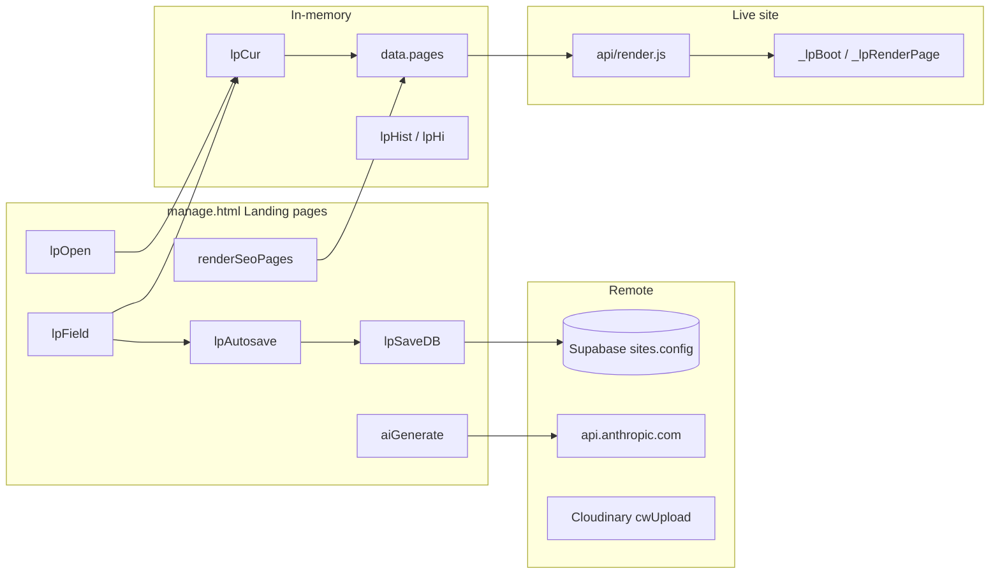
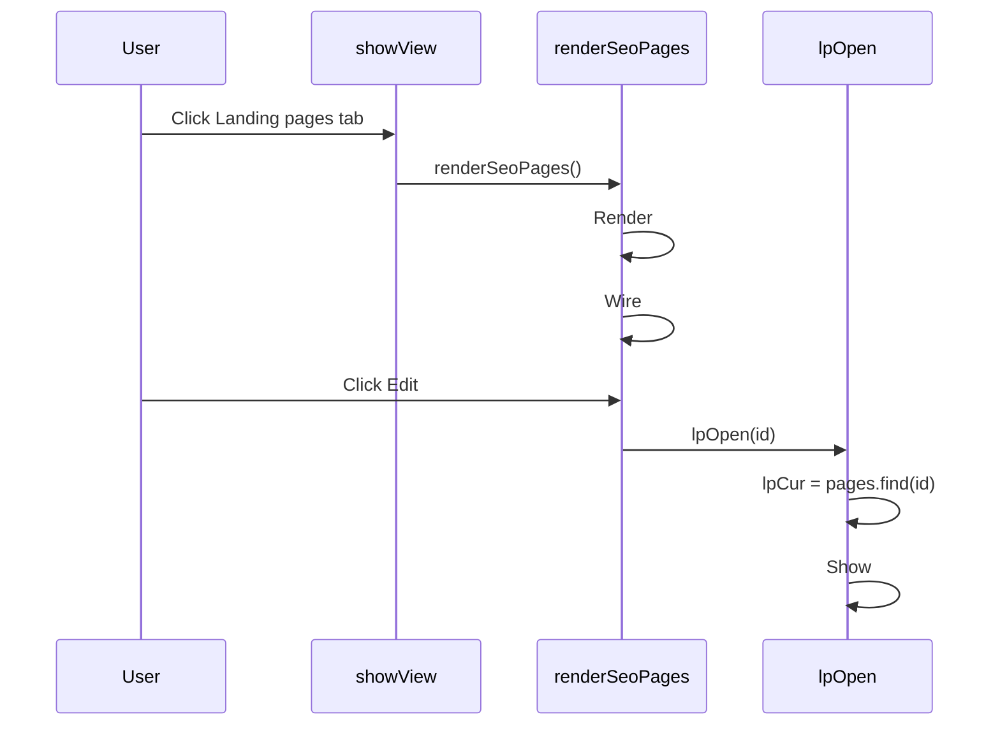
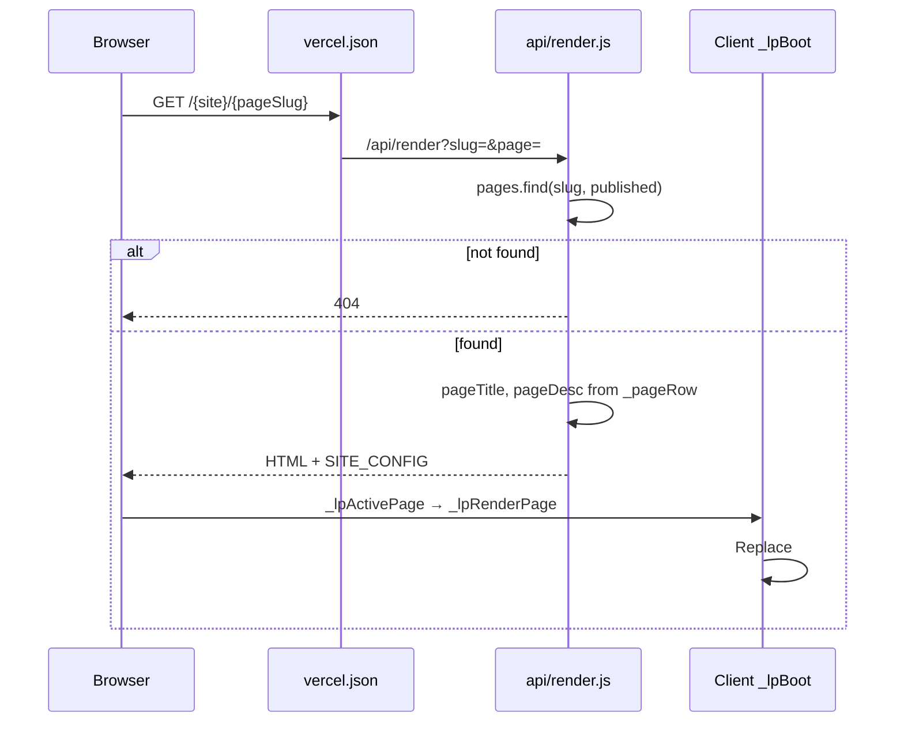
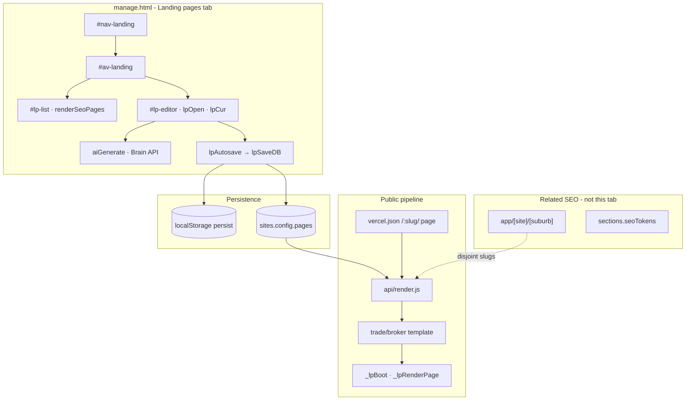
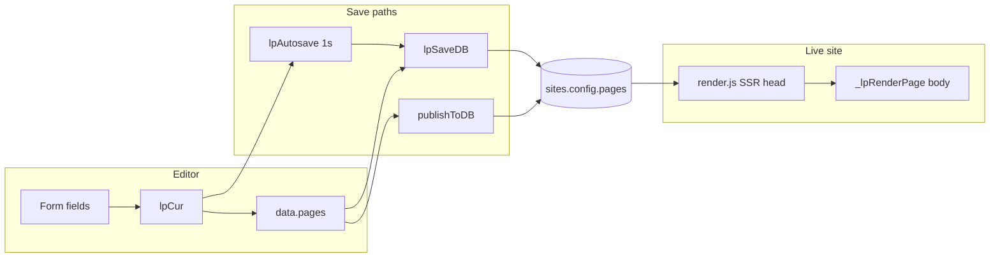
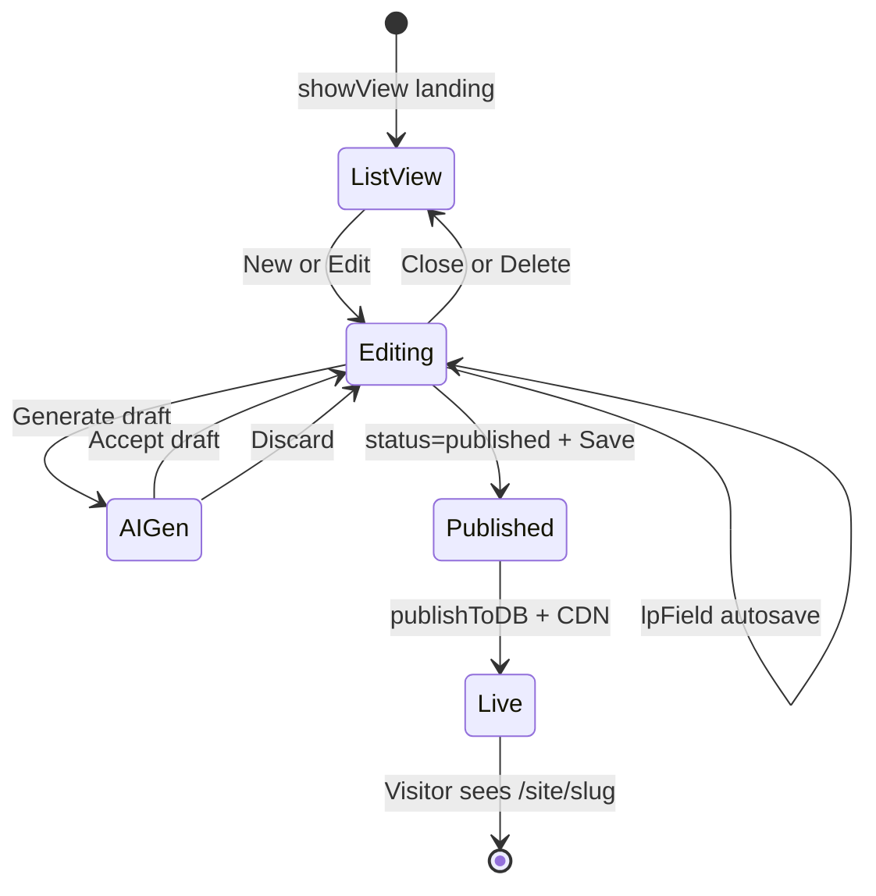

# LeadPages SEO Landing Pages — Complete Engineering Manual

**Document:** `features/Pages`  
**Status:** Definitive engineering reference for the **Landing pages** tab in the App Command Centre  
**Audience:** Engineers rebuilding, extending, or debugging SEO sub-pages; AI development agents  
**Prerequisites:** [00-VISION](../00-VISION.md), [01-ARCHITECTURE](../01-ARCHITECTURE.md), [08-SEO](../08-SEO.md), [10-EDITOR](../10-EDITOR.md), [03-TEMPLATE-SYSTEM](../03-TEMPLATE-SYSTEM.md)  
**AI status:** Landing drafts use Brain — see [AI/00-STATUS](../AI/00-STATUS.md), [LeadPages Brain](LeadPages%20Brain.md)

> **Scope note:** This document describes the **Landing pages** editor tab (`#av-landing`) inside `manage.html`. It covers `config.pages[]`, editor functions (`renderSeoPages`, `lpOpen`, `lpCur`, `lpAutosave`, `lpSaveDB`, `aiGenerate`), and the public render path via `api/render.js` + client `_lpRenderPage`. It is **not** the homepage Page editor (`#av-details`), App Router suburb SEO (`app/[site]/[suburb]`), or marketing landing mockups on `tradies.html` / `brokers.html`.

---

## Executive Summary

The **Landing pages** tab lets site owners create **theme-aware SEO sub-pages** stored in `sites.config.pages[]`. Each page has its own URL slug (`/{siteSlug}/{pageSlug}` or `/{pageSlug}` on a custom domain), optional hero image, Markdown body, and publish/draft status. Published pages are served by **`api/render.js`** with per-page title/meta injected server-side; the live site client replaces `#top` with an article layout via **`_lpRenderPage`**.

Implementation is **client-side in `manage.html`** for editing, with a **narrow autosave** path (`lpSaveDB`) that persists only the `pages` array. Full site publish (`publishToDB`) still required for other config changes to go live. AI draft generation calls **`POST /api/brain/landing-draft`** (LeadPages Brain) — not the browser Anthropic API. Requires `BRAIN_LANDING_DRAFT=1` or the editor shows a flag-disabled message.

| Fact | Detail |
|------|--------|
| **DOM** | `#av-landing` (panel), `#nav-landing` (tab), `#lp-list`, `#lp-editor` |
| **Template gate** | `TEMPLATE_NAV`: `trade`, `broker-app` — **not** `broker-leads` |
| **Role gate** | `super` and `broker` (`leads` role has no access) |
| **Entry** | `showView('landing')` → `renderSeoPages()` |
| **In-memory model** | `data.pages[]` mirrored to `lpCur` when editing |
| **Autosave** | `lpField` → `lpAutosave()` → 1s debounce → `lpSaveDB()` |
| **Public URL** | `vercel.json` `/:slug/:page` → `/api/render?slug=:slug&page=:page` |
| **CDN cache** | 30s on render path (see [08-SEO](../08-SEO.md)) |
| **Hard 404** | Unpublished or unknown page slugs — no soft-404 |

---

## Purpose

### Product purpose

Brokers and tradies need **additional indexed URLs** beyond the homepage — service pages, suburb-adjacent offers, refinancing explainers — without building a separate CMS. The Landing pages tab delivers:

1. **On-brand pages** — inherit theme colours/fonts from the live template.
2. **SEO fields** — title, meta description, H1, slug with inline tips.
3. **Safe publishing** — draft until explicitly set to **Published (live)**.
4. **AI-assisted copy** — 250–400 word Markdown drafts from presets or custom prompts.
5. **Conversion hooks** — optional Call / Get a free quote CTAs on rendered pages.

### Engineering purpose

- **Single array** (`config.pages`) shared between editor, SSR head tokens, and client hydration.
- **Partial DB writes** during editing — avoid full `publishToDB` on every keystroke.
- **Reuse** trade/broker template shell — sub-pages swap `#top` content, not a separate HTML template.
- **Disjoint routing** from suburb App Router pages — operators must keep `pages[].slug` and `serviceAreas.areas` slugs disjoint ([08-SEO](../08-SEO.md)).

---

## Business Purpose

| Stakeholder | Value |
|-------------|-------|
| **Site owner** | Rank for long-tail keywords; landing pages for ads without developer help |
| **Partner / broker** | Upsell SEO content; preset AI briefs match broker vs trade verticals |
| **LeadPages (platform)** | Differentiator vs generic page builders; keeps tenants on hosted render pipeline |
| **Super-admin** | Same editor on any site with the tab visible |

Landing pages support the business model: **more indexed URLs → more organic traffic → more form/call conversions** on the same hosted site.

---

## User Types

| User | Sees Landing pages tab? | Typical journey |
|------|-------------------------|-----------------|
| **Super-admin** | Yes, on `trade` and `broker-app` sites | Creates service pages → publishes → verifies live URL |
| **Broker / partner** | Yes, on allowed templates | Uses AI presets for refinancing / first-home-buyer copy |
| **Site owner** (customer login) | Yes, if role + template allow | Adds suburb/service page → sets slug → publishes |
| **Leads-only demo** (`leads` role) | **No** — only `rates` tab | — |
| **`broker-leads` sites** | **No** — tab hidden by `TEMPLATE_NAV` | Uses simpler Details-only flow |

---

## Permissions

Visibility is the intersection of **role** and **template**:

```text
visible tabs = ALLOWED[currentRole] ∩ TEMPLATE_NAV[currentSiteTemplate]
```

From `manage.html`:

```javascript
const ALLOWED = {
  super:  [..., 'landing', ...],
  broker: [..., 'landing', ...],
  leads:  ['rates']
};
const TEMPLATE_NAV = {
  'broker-app':   [..., 'landing', ...],
  'broker-leads': ['details', 'mailer'],  // no landing
  'trade':        ['dashboard', 'details', 'landing', 'apps', 'mailer']
};
```

| Layer | Mechanism |
|-------|-----------|
| **Nav button** | `#nav-landing` hidden until `applyRoleGating()` |
| **Panel** | `#av-landing` hidden until `showView('landing')` |
| **Supabase RLS** | Authenticated user; `lpSaveDB` updates `sites.config` for owned sites |
| **Public render** | No auth — only **`status === 'published'`** pages resolve |
| **Billing lock** | `lpBillingGate()` blocks entire editor including Landing pages |

---

## Pages Layout

Static HTML in `manage.html` (lines ~742–797). Two cards:

```text
┌─────────────────────────────────────────────────────────────┐
│  LIST CARD (#lp-list)                                       │
│  Header: "Landing pages" + [+ New page]                     │
│  Lede + rows: title, /slug, Live|Draft badge, [Edit]        │
├─────────────────────────────────────────────────────────────┤
│  EDITOR CARD (#lp-editor) — hidden until lpOpen()           │
│  Tools: Undo / Redo / Show SEO tips                         │
│  Fields: title, slug, meta (+ char count), h1               │
│  Font colours: optional h1 / h2 / paragraph pickers         │
│  AI box: presets (#lp-ai-presets), prompt, [Generate draft] │
│  Body: Markdown textarea (#lp-body)                         │
│  Approve panel (#lp-approve): preview, Use / Discard        │
│  Image: URL, upload, placement, padding                     │
│  CTAs: show Call / show Quote checkboxes                      │
│  Menu placement + Status (draft|published)                    │
│  Footer: [Save page] [Close] [Delete page]                    │
└─────────────────────────────────────────────────────────────┘
```

**List row markup** (from `renderSeoPages`):

- `.lp-item` with title, `/{slug}`, status badge (`.lp-badge.pub` / `.draft`), Edit button with `data-edit="{id}"`.

**SEO tips:** toggled via `#lp-tips` → `#lp-editor.show-tips` class shows `.seo-tip` hints on labels.

---

## Navigation

### Tab integration

```javascript
const NAV = [
  // ...
  ['landing', 'av-landing', renderSeoPages],
  // ...
];
```

- Click `#nav-landing` → `showView('landing')` → `renderSeoPages()`.
- Trade nav order: `dashboard` → `details` → **`landing`** → `apps` → `mailer`.
- Broker-app: `rates` → **`landing`** → `appearance` → …

### Cross-links

| UI element | Destination |
|------------|-------------|
| **Publish Site** (command bar) | `publishToDB()` — full config including `pages` |
| **Page editor → Nav menu** | Manual `page:{slug}` targets in `sections.navMenu.items` |
| **View live ↗** | Homepage; sub-pages at `/{site}/{slug}` or custom domain `/{slug}` |
| **Local SEO tab** | Separate suburb pipeline — do not confuse with landing pages |

---

## Widgets

| Widget | Container ID | Loader | Description |
|--------|--------------|--------|-------------|
| **Page list** | `#lp-list` | `renderSeoPages` | All pages in `data.pages[]` |
| **New page** | `#lp-new` | wired once in `renderSeoPages` | Creates draft row + opens editor |
| **Editor shell** | `#lp-editor` | `lpOpen(id)` | All field inputs bound to `lpCur` |
| **AI presets** | `#lp-ai-presets` | `renderSeoPages` (first mount) | Template-specific chips |
| **AI prompt** | `#lp-ai-prompt` | — | Custom brief for `aiGenerate` |
| **Draft approve** | `#lp-approve` | `aiGenerate` success | Preview before replacing body |
| **Image preview** | `#lp-img-prev` | `lpImgPrev()` | Thumbnail of `lpCur.img` |
| **Meta counter** | `#lp-meta-count` | `lpOpen` / input | Length hint (~165 char warning) |
| **Undo stack** | `#lp-undo` / `#lp-redo` | `lpPush` / body edits | Last 50 body states |

---

## Statistics

Landing pages do not expose analytics widgets in-tab. Related metrics elsewhere:

| Metric | Where | Notes |
|--------|-------|-------|
| **Page views** | Dashboard / `#lp-analytics` | Same `events` beacon; URL path distinguishes sub-pages |
| **Meta length** | `#lp-meta-count` | Editor-only; warns above ~165 chars |
| **Publish state** | List badge | `published` → **Live**; else **Draft** |
| **Body word count** | — | Not implemented in UI |

---

## Quick Actions

| Action | Trigger | Handler |
|--------|---------|---------|
| **New page** | `#lp-new` | Push draft to `data.pages`, `lpSaveDB`, `lpOpen` |
| **Edit page** | `[data-edit]` on list | `lpOpen(id)` |
| **Save page** | `#lp-save` | `persist`, `lpSaveDB`, toast, refresh list |
| **Close editor** | `#lp-close` | Hide `#lp-editor`, `lpCur = null` |
| **Delete page** | `#lp-del` | Filter `data.pages`, `lpSaveDB`, refresh list |
| **Undo / Redo body** | `#lp-undo` / `#lp-redo` | `lpHist` / `lpHi` stack |
| **Generate AI draft** | `#lp-ai-go` | `aiGenerate()` |
| **Accept AI draft** | `#lp-ap-accept` | Copy draft → `#lp-body`, `lpField('body')` |
| **Discard AI draft** | `#lp-ap-discard` | Hide `#lp-approve` |
| **Upload image** | `#lp-img-file` | `cwUpload` → Cloudinary, `lpSaveDB` |
| **Clear image** | `#lp-img-clear` | `cwDelete(img_pid)`, clear URL |
| **Publish site** | Command bar | `publishToDB()` — full config |

Field edits route through **`lpField(f, v)`** → `persist()` + **`lpAutosave()`**.

---

## Recent Activity

No activity feed in-tab. Related patterns:

| Type | Mechanism |
|------|-----------|
| **Autosave** | Silent `lpSaveDB` 1s after last field change |
| **Toast** | Save, delete, upload success/failure |
| **Undo history** | Body-only; cleared on `lpOpen` (reset to current body) |
| **AI status** | `#lp-ai-note` shows "Writing…" or error hint |

---

## Site Selection

Landing pages always edit **`data.pages`** for **`currentSiteId`**. Site context set by:

| Path | Function |
|------|----------|
| Account landing grid | `loadSite(site)` |
| Deep link | `/manage?site={slug}` |
| Command-bar site dropdown | `ensureSiteBar()` |

On `loadSite()`:

1. `data` hydrated from `sites.config` (includes `pages` if present).
2. `renderSeoPages()` runs only when user opens the tab (`showView`).
3. `lpCur` is **not** auto-restored — editor stays hidden until Edit/New.

Switching sites while editor open: close manually or `lpCur` may reference stale id (operator should Close first).

---

## Notifications

| Type | Mechanism | Relevance |
|------|-----------|-----------|
| **Toast** | `toast(msg)` | Saved, deleted, upload errors |
| **AI error** | `#lp-ai-note` | Flag off, auth failure, or Brain/provider error message |
| **Meta length** | `#lp-meta-count` | Inline "a touch long" above 165 chars |
| **Billing lock** | `#bill-lock` | Blocks all editor tabs |

No email or push when a page is published.

---

## Data Sources



| Source | Location | Fields used |
|--------|----------|-------------|
| Editor state | `data.pages[]` | All page object fields |
| Active edit | `lpCur` | Reference into `data.pages` by `id` |
| Local cache | `localStorage` `linray_rates` | Via `persist()` — includes pages |
| DB | `sites.config.pages` | Authoritative after `lpSaveDB` / `publishToDB` |
| SSR | `api/render.js` | `title`, `meta`, `status`, `slug` for `<head>` tokens |
| Client hydrate | `demo-shared.js` / template boot | Full page for `#top` article layout |

---

## API Calls

| Endpoint | Method | Called by | Body / query | Response used |
|----------|--------|-----------|--------------|-----------------|
| Supabase `sites` | UPDATE | `lpSaveDB`, `publishToDB` | `{ config: { …, pages } }` | Persists array |
| `POST /api/brain/landing-draft` | POST | `aiGenerate` | `{ siteId, brief, template }` + Bearer | `{ draft.markdown }` via Brain |
| Cloudinary (via `cwUpload`) | POST | `#lp-img-file` | `['page', lpCur.id]` tags | `url`, `publicId` |
| `GET /api/render?slug=&page=` | GET | Public browser | `page` = slug | Full HTML + `__SITE_CONFIG__` |

**Auth:**

- `lpSaveDB` — Supabase session (anon key + user JWT).
- `aiGenerate` — Bearer JWT → server Brain route (site owner / partner / super). Flag `BRAIN_LANDING_DRAFT=1`.
- Public render — unauthenticated.

---

## Database Tables

| Table | Landing pages usage |
|-------|---------------------|
| **`sites`** | `config.pages[]` JSONB array; `slug` for URL; `template` gates tab |
| **`events`** | Indirect — page views on sub-page URLs |
| **`leads`** | CTAs on rendered pages link to homepage quote form |

### `config.pages[]` object shape

```json
{
  "id": "uuid",
  "title": "Refinancing",
  "slug": "refinancing",
  "meta": "Meta description for SERP",
  "h1": "Headline on page",
  "h1Color": "#1a2230",
  "h2Color": "#1a2230",
  "paragraphColor": "#5b6878",
  "body": "Markdown content",
  "menu": "top|footer|none",
  "status": "published|draft",
  "img": "https://…",
  "img_pid": "cloudinary_public_id",
  "imgMode": "center|left|right|wrap-left|wrap-right",
  "imgPad": 16,
  "showCall": true,
  "showQuote": true
}
```

**Defaults on create** (`#lp-new`): `menu:'top'`, `status:'draft'`, empty strings for text fields.

**Optional typography colours** (`h1Color` / `h2Color` / `paragraphColor`): hex strings set in the Landing pages editor. Empty or omitted uses the site theme. Applied as CSS vars `--lp-h1` / `--lp-h2` / `--lp-p` on the page article in `_lpArticleBlock`.

**Note:** `menu` (`top` / `footer` / `none`) is **stored** but **not auto-synced** to `sections.navMenu` — operators link pages manually via Nav menu editor (`page:{slug}` targets). See Technical Debt.

---

## Related Files

| File | Relationship |
|------|--------------|
| **`manage.html`** | **Primary implementation** — UI + all `lp*` functions |
| **`api/render.js`** | SSR routing, `_pageRow` lookup, `pageTitle` / `pageDesc` |
| **`vercel.json`** | `/:slug/:page` → render API |
| **`trade.template.json`** / **`broker.template.json`** | Shell HTML; client boot calls `_lpRenderPage` |
| **`marketplace/demos/demo-shared.js`** | `_lpActivePage`, `_lpRenderPage`, `_lpMd`, `_navMenuRender` |
| **`docs/08-SEO.md`** | Dual pipeline, routing collision, autosave summary |
| **`docs/10-EDITOR.md`** | Tab nav, autosave matrix, `lpCur` globals |
| **`docs/02-DATABASE.md`** | `pages` array schema |
| **`docs/03-TEMPLATE-SYSTEM.md`** | Sub-page routing rules |
| **`api/manage.html`** | Legacy duplicate — keep in sync or deprecate |

---

## Functions

### Core editor (`manage.html` ~1560–1646)

| Function | Lines (approx.) | Role |
|----------|-----------------|------|
| `renderSeoPages()` | ~1575–1607 | Build list, wire events once (`lpWired`), populate AI presets |
| `lpOpen(id)` | ~1611–1623 | Set `lpCur`, populate fields, reset undo stack |
| `lpField(f, v)` | ~1608 | Mutate `lpCur[f]`, `persist`, `lpAutosave` |
| `lpAutosave()` | ~1216 | 1s debounce → `lpSaveDB` |
| `lpSaveDB()` | ~1215 | Merge `data.pages` into DB `config` only |
| `lpPush(v)` | ~1610 | Body undo stack (max 50) |
| `lpImgPrev()` | ~1609 | Image thumbnail in editor |
| `mdToHtml(t)` | ~1624–1628 | AI preview Markdown → HTML |
| `aiGenerate()` | manage.html | `POST /api/brain/landing-draft` + approve panel |
| `aiPresets()` | ~1573 | Returns `AI_PRESETS_TRADE` or `AI_PRESETS_BROKER` |

### Module-level state

| Symbol | Purpose |
|--------|---------|
| `lpCur` | Active page object reference (or `null`) |
| `lpHist` / `lpHi` | Body undo/redo stack |
| `lpWired` | Event listeners attached once |
| `_lpAS` | Autosave timeout handle |

### Public site (client boot)

| Function | File | Role |
|----------|------|------|
| `_lpActivePage()` | `demo-shared.js` | Match URL segment to published `pages[].slug` |
| `_lpRenderPage(p)` | `demo-shared.js` | Replace `#top` with article; set title/meta client-side |
| `_lpMd(t)` | `demo-shared.js` | Markdown → HTML (live site) |
| `_navMenuRender(c)` | `demo-shared.js` | Nav links with `page:{slug}` targets |

### Server

| Function | File | Role |
|----------|------|------|
| Sub-page gate | `api/render.js` ~649–673 | `_pageRow` lookup; 404 if not published |
| `publishToDB()` | `manage.html` ~4047 | Full config publish (includes pages) |

---

## Event Flow

### Tab mount



### Field edit + autosave

1. User types in `#lp-title` (or any wired field).
2. Handler calls `lpField('title', value)`.
3. `lpCur.title` updated; `persist()` → `localStorage`.
4. `lpAutosave()` resets 1s timer.
5. Timer fires → `lpSaveDB()` → Supabase `sites.config.pages` updated.

### AI generate

1. User clicks **Generate draft** → `aiGenerate()`.
2. `#lp-ai-note` = "Writing…".
3. `POST /api/brain/landing-draft` with Bearer token, `siteId`, brief, template.
4. Server runs Brain task `content.landing_draft` (prompt registry + site context slices).
5. On success: store `draft.markdown` on `#lp-approve`, preview via `mdToHtml`, show approve panel.
6. **Use this draft** → writes body, `lpPush`, `lpField` → autosave chain (human approve still required).
7. If flag off (503 `landing_draft_disabled`): note tells user to ask super-admin to enable `BRAIN_LANDING_DRAFT`.

### Public page request



---

## User Journey

```mermaid
flowchart TD
  A[Sign in · loadSite] --> B[Open Landing pages tab]
  B --> C{Existing pages?}
  C -->|No| D[+ New page]
  C -->|Yes| E[Edit from list]
  D --> F[lpOpen · fill SEO fields]
  E --> F
  F --> G{Need copy?}
  G -->|Yes| H[Pick AI preset · Generate draft]
  H --> I{Approve?}
  I -->|Yes| J[Use draft · edit body]
  I -->|No| K[Discard]
  G -->|No| J
  J --> L[Set slug · meta · h1]
  L --> M[Optional image upload]
  M --> N[Status = Published]
  N --> O[Save page · autosave]
  O --> P[Publish Site command bar]
  P --> Q[Visit /{site}/{slug} live]
```

**Partner journey:** Open client `broker-app` or `trade` site → Landing pages → AI preset for vertical → publish → send live URL to client.

---

## Performance Considerations

| Area | Behaviour | Risk |
|------|-----------|------|
| **Autosave debounce** | 1s after last keystroke | Burst typing → one DB write; good |
| **`lpSaveDB` merge** | Clones full `sref.config`, replaces `pages` only | Safe concurrent edits to other tabs if they use `publishToDB` |
| **List re-render** | Full `#lp-list` innerHTML on each `renderSeoPages` | Fine for tens of pages |
| **AI generate** | Up to 1000 tokens, blocking UI note only | No cancel button |
| **Image upload** | 8 MB limit; Cloudinary round-trip | Large images slow save |
| **Public render** | 30s CDN cache | Published edits may lag up to 30s |
| **Undo stack** | Max 50 body snapshots in memory | Negligible |

---

## Security Considerations

| Topic | Detail |
|-------|--------|
| **Authentication** | Editor behind Supabase auth |
| **Authorization** | RLS on `sites` UPDATE |
| **XSS** | List uses `esc()` on title/slug; AI preview uses `mdToHtml` (escaped base) |
| **AI keys** | Server-side only via Brain (`ANTHROPIC_API_KEY` / provider env) — not sent to the browser |
| **Slug injection** | Slug sanitized to `[a-z0-9-]` on input |
| **Public 404** | Draft slugs not enumerable via render (hard 404) |
| **PII in copy** | User-generated; no server-side moderation |

---

## Technical Debt

| ID | Issue | Location | Impact |
|----|-------|----------|--------|
| TD-P1 | **`menu` field not wired to nav** | `lp-menu` vs `_navMenuRender` | "Top menu" / "Footer" select stores value but does not auto-add nav links |
| TD-P2 | ~~AI calls browser-direct~~ **Resolved (Phase 7)** | `aiGenerate` → `/api/brain/landing-draft` | Flag default off until soak; remaining AI features still legacy |
| TD-P3 | **Canonical stays /** | [08-SEO](../08-SEO.md) | Sub-pages update title/meta client-side but canonical href is homepage |
| TD-P4 | **Routing collision** | App Router suburbs vs `pages[].slug` | Wrong pipeline if slugs overlap service area names |
| TD-P5 | **Sitemap gap** | `seo-sitemap.xml` | Landing pages not listed (suburbs only) |
| TD-P6 | **`api/manage.html` drift** | Legacy copy | Missing trade `dashboard`; landing code may diverge |
| TD-P7 | **Publish vs autosave** | Two paths | Operators may think autosave = live; only `published` + CDN refresh makes URL work |
| TD-P8 | **Title SSR vs client** | `render.js` appends ` — business`; `_lpRenderPage` sets `document.title` to `p.title` only | Possible title mismatch between view-source and post-hydration |

---

## Future Improvements

1. ~~**Server proxy for AI**~~ — Done: `/api/brain/landing-draft` + Brain (enable with `BRAIN_LANDING_DRAFT=1`).
2. **Auto-sync `menu` field** — push/remove `navMenu.items` when `menu` is top/footer.
3. **Per-page canonical** — `https://{{domain}}/{{slug}}` in SSR for landing pages.
4. **Sitemap entries** — include published `pages[].slug` per site.
5. **Slug collision linter** — warn when `pages[].slug` ∈ `serviceAreas.areas`.
6. **Preview sub-page** — editor preview iframe with `?page=` or path segment.
7. **Word count / SEO score** — meta length, H1 presence, body length hints.
8. **Align SSR and client title** — single rule for `{title} — {business}`.
9. **Delete `api/manage.html`** or generate from single source.

---

## Pages Architecture



---

## Connections to Other Systems

### Editor (Page details tab)

- Homepage content (`#av-details`) is separate from **`config.pages[]`**.
- **Nav menu** editor (`sections.navMenu`) lists published pages as `page:{slug}` targets — manual linking.
- **Publish** command writes entire `data` including pages; autosave writes pages subset only.

### SEO dual pipeline ([08-SEO](../08-SEO.md))

| Surface | Pipeline | This tab? |
|---------|----------|-----------|
| Homepage | `api/render.js` tokens | No (Details tab) |
| **Landing pages** | **`api/render.js` + `_lpRenderPage`** | **Yes** |
| Suburb pages | App Router + `lib/seo/*` | No (Local SEO / service areas) |

Keep **`serviceAreas.areas` slugs** and **`pages[].slug`** disjoint.

### Template system

- Sub-pages reuse the same trade/broker template HTML.
- Server injects `{{pageTitle}}` / `{{pageDesc}}` from `_pageRow`.
- Client replaces `#top` — homepage sections hidden for that view.

### Analytics ([07-TRACKING](../07-TRACKING.md))

- Sub-page URLs fire `page_view` beacons with distinct paths.
- No in-tab metrics; see Dashboard on trade sites.

### Domains ([06-DOMAINS](../06-DOMAINS.md))

- Custom domain: `/{pageSlug}` routing (single segment page param).
- Platform host: `/{siteSlug}/{pageSlug}`.

### CRM / leads

- Rendered pages show **Call** (`tel:`) and **Get a free quote** (link to site base) when enabled.
- Quote form submits to same `leads` pipeline as homepage.

---

## Data Flow



---

## User Flow



---

## Glossary

| Term | Meaning |
|------|---------|
| **Landing page (SEO sub-page)** | Row in `config.pages[]` with its own slug — not the homepage |
| **`lpCur`** | In-memory pointer to the page object currently open in `#lp-editor` |
| **`lpSaveDB`** | Partial Supabase update — **`config.pages` only** |
| **`publishToDB`** | Full site config publish from command bar |
| **`_pageRow`** | Server-side matched published page in `api/render.js` |
| **`_lpRenderPage`** | Client-side article layout replacing `#top` |
| **Hard 404** | Unknown or draft slug returns HTTP 404 — no empty stub page |
| **AI preset** | Chip filling `#lp-ai-prompt` with a vertical-specific brief |

---

*Last updated: July 2026 — reflects `manage.html` Landing pages implementation on branch `main`.*
