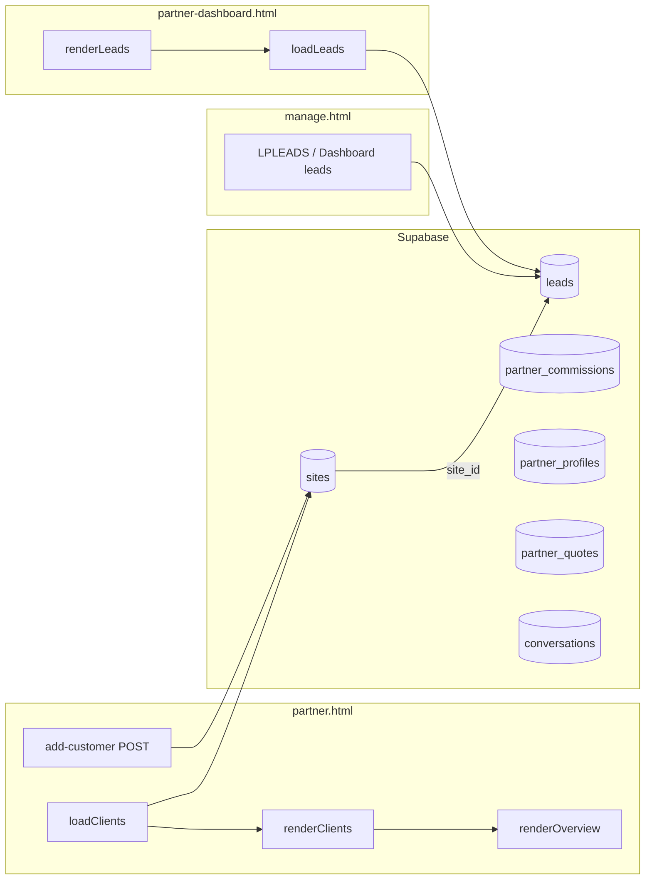
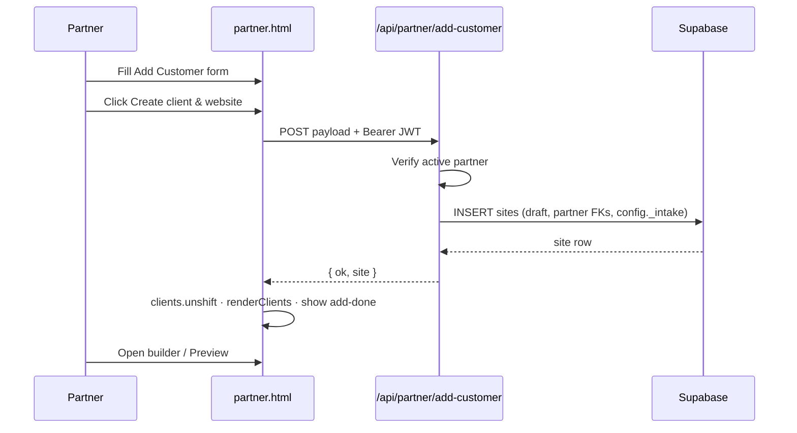
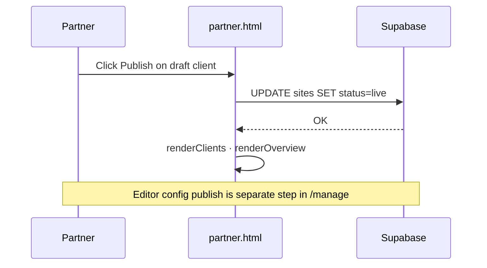
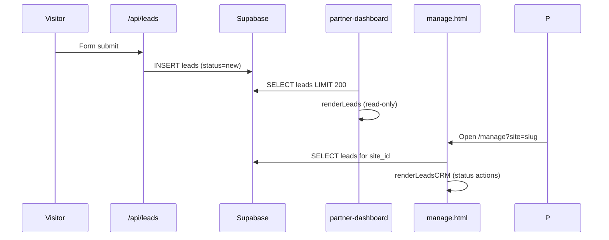
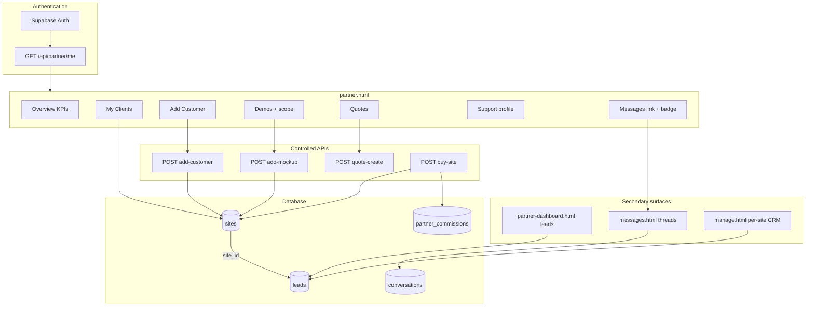
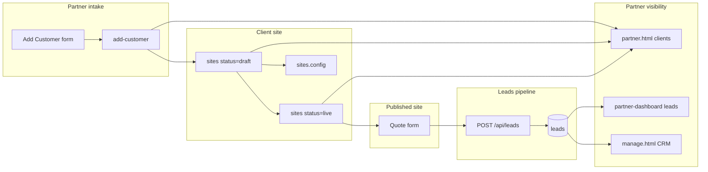
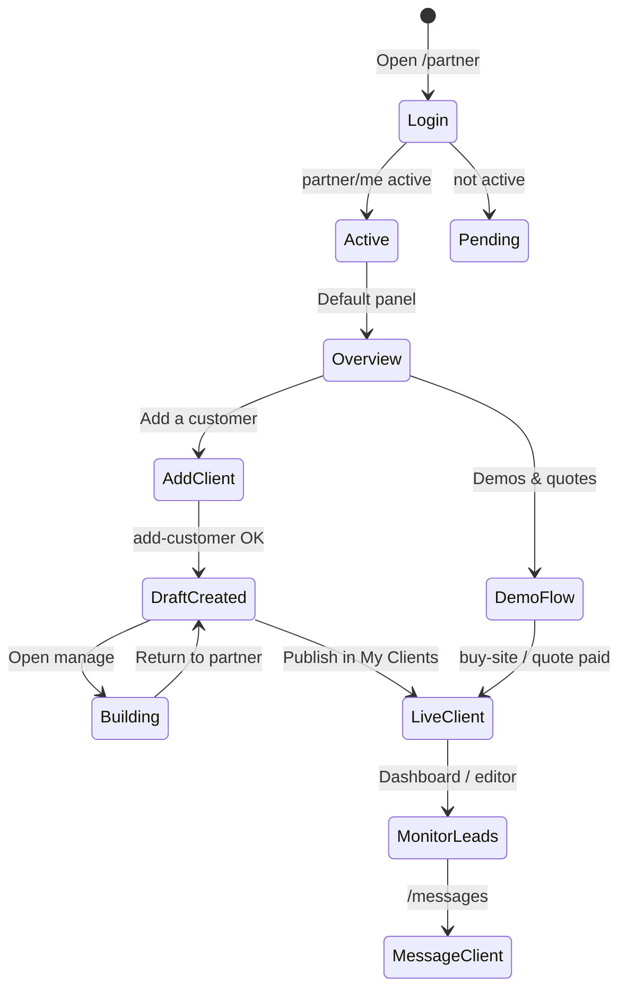

# Partner CRM — Complete Engineering Manual

**Document:** `features/Partner CRM`  
**Status:** Definitive engineering reference for partner client lifecycle and lead visibility  
**Audience:** Engineers rebuilding, extending, or debugging partner-facing CRM; AI development agents  
**Prerequisites:** [00-VISION](../00-VISION.md), [05-PARTNERS](../05-PARTNERS.md), [09-CRM](../09-CRM.md), [04-SITE-BUILDER](../04-SITE-BUILDER.md), [features/Dashboard](Dashboard.md)

> **Scope note:** This document describes **partner-side client and lead management** — primarily `partner.html` (client records, publish workflow, quotes, messaging hooks) and **`partner-dashboard.html`** (aggregate leads table). It is **not** the per-site owner CRM in `manage.html` (`LPLEADS`, `#dash-leads-body`), **`partner_leads`** (platform recruitment enquiries), or **`partners-admin.html`** (super-admin transfers).

---

## Executive Summary

Partner CRM is how **active LeadPages partners** onboard local businesses, track site build status, communicate with clients, and monitor **form-captured leads** across their portfolio. The product splits across two HTML surfaces plus a messaging app:

| Surface | Route | CRM role |
|---------|-------|----------|
| **`partner.html`** | `/partner` | **Client lifecycle** — add customer, My Clients list, publish/unpublish, quotes, project scope on demos, profile/support contact |
| **`partner-dashboard.html`** | `/partner-dashboard` | **Lead inbox (read-only)** — last 200 tenant leads, filter by site, monthly stats |
| **`messages.html`** | `/messages` | **Async comms** — partner ↔ client ↔ LeadPages support threads |
| **`manage.html`** | `/manage?site=` | **Per-site lead CRM** — partners open client sites here for Won/Lost, mailer, Dashboard |

Implementation is **100% client-side** in those HTML files: Supabase JWT queries, controlled `POST /api/partner/*` endpoints for site creation, and direct `sites` updates for publish/rename. There is no dedicated Partner CRM API or React layer.

| Fact | Detail |
|------|--------|
| **Primary DOM** | `#view-dash`, panels `[data-panel]` — especially `clients`, `add`, `quotes` |
| **Auth gate** | Supabase session + `GET /api/partner/me` → `partners.status === 'active'` |
| **Client record** | `sites` row with `is_mockup=false`, `is_partner_home=false` |
| **Create client** | `POST /api/partner/add-customer` (service role; sets partner FKs) |
| **Publish** | Direct Supabase `sites.status` → `live` / `draft` (separate from config publish in editor) |
| **Tenant leads** | `leads` table — aggregated in `partner-dashboard.html`; per-site in `manage.html` |
| **Intake metadata** | `sites.config._intake` — contact, phone, notes from add-customer form |

---

## Purpose

### Product purpose

Partners are agencies/resellers who bring tradies onto LeadPages. They need to:

1. **Register a client** — capture business details and spawn a draft trade site linked for commission.
2. **Build and go live** — finish design in `/manage`, then flip `status` to live from My Clients.
3. **Sell with demos and quotes** — mockups for prospects; tokenised quotes that convert to paid clients.
4. **Stay in touch** — message clients; surface support contact on client editor (`#lp-support-card`).
5. **See enquiry activity** — read-only lead table across client sites (detailed CRM actions happen per site in the editor).

### Engineering purpose

- **Controlled site creation** — partners have no raw `INSERT` on `sites`; `add-customer` stamps attribution correctly.
- **RLS-scoped reads** — `loadClients()` uses partner JWT; row visibility follows Phase 2 partner policies.
- **Separation of concerns** — `partner.html` owns **client sites**; `partner-dashboard.html` owns **lead aggregation**; `manage.html` owns **lead status workflow**.
- **Reuse site builder** — no duplicate editor; deep links to `/manage` and `/manage?site=`.

---

## Business Purpose

| Stakeholder | Value |
|-------------|-------|
| **Partner** | Single hub for clients, commissions context, quotes, and messaging; local support face via profile |
| **Client (site owner)** | Draft site + login email; sees partner as support in editor; messages in-app |
| **LeadPages (platform)** | Auditable partner attribution (`referring_partner_id`, `servicing_partner_id`); commission ledger hooks |
| **Super-admin** | Client transfers and commission rules in `partners-admin.html` — outside this UI |

Partner CRM supports the reseller model: **partners invoice clients directly** while LeadPages collects platform/hosting fees and books commissions ([05-PARTNERS](../05-PARTNERS.md)).

---

## User Types

| User | Partner CRM access | Typical journey |
|------|-------------------|-----------------|
| **Active partner** | Full `partner.html` + RLS-scoped sites/leads | Apply → approved → `/partner` → Add customer → builder → Publish → monitor leads on dashboard |
| **Pending / under_review partner** | `#view-pending` only | Waits for activation email |
| **Suspended / terminated partner** | Blocked message; APIs return 403 | Cannot create clients |
| **Authenticated non-partner** | `#view-none` | Email not linked to `partners` row |
| **Client (site owner)** | **No** `partner.html` — uses `messages.html`, `manage.html` | Sees partner support card; messages provider |
| **Super-admin** | Same partner UIs if they have a partner row; also `partners-admin.html` | Impersonation / transfers |

**Not in scope:** Public visitors submitting quote forms — they become **`leads`** rows consumed downstream by partners via dashboard or editor.

---

## Permissions

### Partner activation gate

```text
loadPartner(session)
  → GET /api/partner/me
  → partners.status === 'active' → renderDash()
  → else → view-pending / view-none
```

From `api/partner/add-customer.js`:

```javascript
if (partner.status !== 'active') return 403;
```

### Client row ownership (`clientCard`)

Partners see all sites their JWT can read, but **management actions** require:

```javascript
var mine = !!(state.partner && c.servicing_partner_id === state.partner.id);
```

| `mine === true` | Open builder, Message, Info, Rename, Change URL, Publish/Unpublish, Preview |
| `mine === false` | View site (if live) or “Managed by another provider” |
| Badge | “Serviced elsewhere” when `servicing_partner_id` differs after transfer |

### API vs direct Supabase

| Operation | Path | Auth |
|-----------|------|------|
| Create client | `POST /api/partner/add-customer` | Bearer JWT + active partner; **service role** insert |
| Create demo | `POST /api/partner/add-mockup` | Same |
| Publish / rename / slug | `sb.from('sites').update(...)` | Partner RLS on owned/serviced sites |
| Load clients | `sb.from('sites').select(...)` | Partner RLS |
| Load commissions | `sb.from('partner_commissions').select(...)` | Partner RLS |
| Profile save | `sb.from('partner_profiles').update(...)` | Partner RLS |
| Tenant leads (dashboard) | `sb.from('leads').select(...)` | Partner RLS (scoped to accessible sites) |

### Billing and publish split

Partners toggle **`sites.status`** (`draft` ↔ `live`) in My Clients. That is **independent** of publishing **`sites.config`** from the editor command bar. Both may be required for a fully live experience ([04-SITE-BUILDER](../04-SITE-BUILDER.md)).

---

## Partner CRM Layout (`partner.html`)

Single-page app inside `#view-dash`: left **`aside.side`** nav + **`main`** panels toggled by `[data-panel]`.

```text
┌──────────────────────────────────────────────────────────────────┐
│  SIDEBAR (#nav)                                                  │
│  Overview · Messages↗ · My Clients · Demos · My page · …       │
├──────────────────────────────────────────────────────────────────┤
│  PANEL (one `.panel.on` at a time)                               │
│                                                                  │
│  overview   → KPI row + empty-state CTA → Add customer           │
│  clients    → #clients-list (clientCard rows)                    │
│  add        → #add-card form → #add-done success                 │
│  demos      → mockup creator + #mockups-list + themes + scope    │
│  quotes     → quote builder + #q-list history                     │
│  commissions→ #comm-list + KPI mirrors                           │
│  profile    → support contact (shown to clients in manage)      │
│  … training, resources, payouts, mypage, support (Phase 5)      │
└──────────────────────────────────────────────────────────────────┘
```

**External chrome (not panels):**

- **Messages** — `#messages-link` opens `/messages` in new tab; unread badge via `loadMsgBadge()`
- **Help** — `/help` in new tab

There is **no sidebar tab** for “Add Customer”; entry is `#ov-add` on Overview empty state → `gotoPanel('add')`.

---

## Navigation

### Panel routing

```javascript
document.getElementById('nav').addEventListener('click', function(e){
  var b = e.target.closest('button[data-p]');
  // toggle .on on nav button + matching [data-panel]
});
```

| `data-p` | Panel | Primary loader |
|----------|-------|----------------|
| `overview` | Overview KPIs | `renderOverview()` from `clients[]` |
| `clients` | My Clients | `renderClients()` |
| `add` | Add Customer | form handlers in `wireAdd()` |
| `demos` | Demos & themes | `renderMockups()`, `renderThemes()` |
| `quotes` | Quotes | `loadQuotes()` |
| `commissions` | Commissions | `loadCommissions()` |
| `profile` | My Profile | `fillProfile()` |

### Cross-links from client cards

| UI element | Destination |
|------------|-------------|
| Open builder | `/manage` (new tab) — relies on editor site picker / last context |
| Message | `/messages` (new tab) |
| View site | `/s/{slug}` when live |
| Preview | `/{slug}?preview=1` when draft |
| Publish / Unpublish | In-place Supabase update |

**Preferred builder deep link** (used elsewhere): `/manage?site={slug}` — client cards currently open bare `/manage`.

---

## Client Management

### Overview KPIs (`renderOverview`)

| KPI element | Source |
|-------------|--------|
| `#kpi-clients` | `clients.length` |
| `#kpi-active` | `status === 'live'` count |
| `#kpi-pending` | total − active |
| `#kpi-recurring` | sum of `monthly_amount * 0.20` for live clients |
| `#kpi-pendingcomm`, `#kpi-payout`, `#kpi-paidcomm` | synced from `loadCommissions()` |
| `#ov-empty` | hidden when `total > 0` |

### My Clients list (`clientCard` / `#clients-list`)

Each card shows:

- Business name, slug, plan key, monthly fee
- Status badge: **Live** / **Draft**; **Serviced elsewhere** if not `mine`
- Action row (if `mine`): builder, message, info expand, rename, change URL, publish/unpublish or preview
- Info expand (`data-cinfobox`): business, URL, plan, billing status

### Add Customer form (`data-panel="add"`)

| Field ID | Maps to API / DB |
|----------|------------------|
| `#a-biz` | `businessName` → `sites.business_name` |
| `#a-industry` | `industry` → `config.trade` |
| `#a-contact` | `contactName` → `config._intake.contactName` |
| `#a-email` | `customerEmail` → `sites.owner_email` |
| `#a-phone` | `phone` → `config._intake.phone` |
| `#a-loc` | `location` → `config._intake.location` |
| `#a-plan` | `planKey` → `sites.plan_key`, `monthly_amount` from `billing_plans` |
| `#a-price` | `buildPrice` → `config._intake.buildPrice` (display/intake) |
| `#a-theme` | `themeId` → seeds `config` from `partner_themes` |
| `#a-notes` | `notes` → `config._intake.notes` |

On success (`#a-submit` → `add-customer`):

1. `clients.unshift(res.site)`
2. Show `#add-done` with Preview + Open builder + Add another

### Publish workflow

```javascript
// Publish
await sb.from('sites').update({ status: 'live', updated_at: ... }).eq('id', id);
// Unpublish
await sb.from('sites').update({ status: 'draft', updated_at: ... }).eq('id', id);
```

New clients are created with **`status: 'draft'`** in `add-customer.js`. Partner must explicitly publish from My Clients (or buy-site webhook for quote/demo path).

---

## Lead Management

Partner CRM interacts with **tenant leads** (`leads` table) in three places — with different capabilities:

| Location | Scope | Actions |
|----------|-------|---------|
| **`partner-dashboard.html`** | Up to 200 leads, all accessible sites | **Read-only** table; filter by site; status badge display only |
| **`manage.html` `#lp-leads` / `#dash-leads-body`** | Per `currentSiteId` | Full CRM: expand, status Won/Lost/Contacted, timeline, refresh |
| **`manage.html` Mailer tab** | Per site leads with email | Campaign send ([Email Campaigns](Email%20Campaigns.md)) |

### `partner-dashboard.html` leads panel

```javascript
async function loadLeads(){
  var r = await sb.from('leads')
    .select('id,site_id,name,email,phone,message,created_at,status')
    .order('created_at', { ascending: false })
    .limit(200);
}
```

- `#lead-site-filter` filters by `site_id`
- `#s-leads` stat = leads created **this calendar month**
- Trend vs last month on `#s-leads-t`
- **No** status update handlers — partners must open site in editor to act

### Lead capture pipeline (context)

Public trade/broker forms → `POST /api/leads` → `leads` row with `status: 'new'`. See [09-CRM](../09-CRM.md). Partner CRM **does not** ingest leads; it **displays** them after capture.

### `partner_leads` (not tenant CRM)

`POST /api/partner-lead` stores **platform recruitment** enquiries. Not shown in partner CRM UI today (manual matching — see [05-PARTNERS](../05-PARTNERS.md) debt).

---

## Quotes and Demos (Pre-Client CRM)

### Demos (`is_mockup=true`)

Created via `POST /api/partner/add-mockup`. Same `sites` table, filtered out of `clients[]`:

```javascript
clients = all.filter(x => !x.is_mockup && !x.is_partner_home);
mockups = all.filter(x => x.is_mockup);
```

Demo cards support: rename, delete, showcase toggle, sale price, preview password, apply theme, **project scope** (`scopeEditor` / `saveScope` → `config.scope`).

Project scope on demos flows to client **Dashboard** scope checklist after go-live ([Dashboard](Dashboard.md)).

### Quotes (`partner_quotes`)

`POST /api/partner/quote-create` with demo `siteId`, client details, price, features. Client pays via `/quote?t=` → Stripe → webhook converts mockup to live client and books build commission.

Quote list in `#q-list`: token link, paid/sent badge, copy link.

---

## Messaging

| Piece | Implementation |
|-------|------------------|
| Nav link | `#messages-link` → `/messages` |
| Unread badge | `loadMsgBadge()` — compares `conversations.last_message_at` vs `conversation_reads` |
| Client card | Message button → `/messages` |
| Profile | `notify_new_message` on `partner_profiles` — email heads-up when new thread activity |
| Conversation kinds | `partner_client`, `partner_lp` (see `messages.html` `convLabel`) |

Partners do **not** embed the message thread in `partner.html`; it is always a separate tab/app.

---

## Quick Actions

| Action | Trigger | Handler |
|--------|---------|---------|
| Add customer (CTA) | `#ov-add` | `gotoPanel('add')` |
| Create client | `#a-submit` | `fetch('/api/partner/add-customer')` |
| Publish / Unpublish | `[data-pub]` / `[data-unpub]` | Supabase `sites.status` update |
| Rename client | `[data-crename]` | prompt → `sites.business_name` |
| Change URL | `[data-cslug]` | prompt → slugify + uniqueness check → `sites.slug` |
| Toggle client info | `[data-cinfo]` | show `#data-cinfobox` |
| Create demo | `#m-create` | `POST /api/partner/add-mockup` |
| Save demo scope | `[data-scopesave]` | `saveScope()` → `sites.config.scope` |
| Create quote | `#q-create` | `POST /api/partner/quote-create` |
| Save support profile | `#save-profile` | `partner_profiles` update |
| Open builder | `#add-build`, client card | `/manage` (should be `/manage?site=`) |

---

## Data Sources



| Source | Table / endpoint | Partner CRM usage |
|--------|------------------|-------------------|
| Client list | `sites` SELECT | Filter non-mockup, non-home; cards + KPIs |
| Create client | `POST /api/partner/add-customer` | Inserts draft site + intake JSON |
| Create demo | `POST /api/partner/add-mockup` | Mockup sites |
| Publish | `sites` UPDATE | `status` only |
| Plans | `billing_plans` | Add-customer + quote plan dropdowns |
| Commissions | `partner_commissions` | Overview + Commissions panel |
| Quotes | `partner_quotes` | Quote history list |
| Themes | `partner_themes` | Seed config on create / apply to demo |
| Profile | `partner_profiles` | Support contact + GST/ABN + default plan |
| Leads (aggregate) | `leads` | `partner-dashboard.html` only |
| Messages | `conversations`, `conversation_reads` | Unread badge |
| Identity | `GET /api/partner/me` | Partner + profile bootstrap |

### `config._intake` shape (add-customer)

```json
{
  "contactName": "Jane Smith",
  "phone": "0412 345 678",
  "location": "Geelong",
  "notes": "Wants online booking",
  "buildPrice": "$990",
  "addedByPartner": "uuid",
  "addedAt": "2026-07-05T12:00:00.000Z"
}
```

### `config.scope` shape (demos → client Dashboard)

```json
{
  "description": "Plumber website rebuild",
  "items": [
    { "text": "Online booking form", "done": false }
  ]
}
```

---

## API Calls

| Endpoint | Method | Called by | Body / query | Response used |
|----------|--------|-----------|--------------|-----------------|
| `/api/partner/me` | GET | `loadPartner()` | Bearer JWT | `partner`, `profile`; claim-by-email |
| `/api/partner/add-customer` | POST | `#a-submit` | businessName, contactName, customerEmail, phone, industry, location, planKey, buildPrice, themeId, notes | `{ ok, site }` |
| `/api/partner/add-mockup` | POST | `#m-create` | businessName, industry, themeId | `{ ok, site }` |
| `/api/partner/quote-create` | POST | `#q-create` | siteId, businessName, email, phones[], features[], price, planKey, … | `{ ok, url, emailed }` |
| `/api/partner/ensure-home` | POST | `#sc-design` | — | Partner homepage slug |
| `/api/partner/save-showcase` | POST | `#sc-save` | showcase fields | Updated profile |
| `/api/partner/showcase-check` | GET | `#sc-check` | `?slug=` | Availability |
| Supabase `sites` | SELECT | `loadClients()` | broad column list incl. `config` | Client + mockup arrays |
| Supabase `sites` | UPDATE | publish, rename, slug, scope | various | In-memory cache update |
| Supabase `leads` | SELECT | `partner-dashboard.loadLeads()` | limit 200 | Lead table |
| Supabase `partner_commissions` | SELECT | `loadCommissions()` | — | Commission list + KPIs |
| Supabase `partner_profiles` | UPDATE | profile, payouts save | support fields, GST, default plan | Local `state.profile` |
| `/api/site/support-contact` | GET | `manage.html` (client view) | `siteId` | Servicing partner contact from profile |

Auth: `authHeader()` → `Authorization: Bearer <supabase access_token>`.

---

## Database Tables

| Table | Partner CRM usage |
|-------|-------------------|
| **`partners`** | Identity, `status` gate, `display_name` |
| **`partner_profiles`** | Support contact, showcase, GST, `default_plan_key`, `notify_new_message` |
| **`sites`** | **Client record** — slug, business_name, status, plan, partner FKs, `owner_email`, `config._intake`, `config.scope`, mockup flags |
| **`leads`** | Tenant enquiries; read aggregate in dashboard; full CRM in editor |
| **`partner_commissions`** | Build + recurring ledger rows |
| **`partner_quotes`** | Tokenised sales quotes |
| **`partner_themes`** | Reusable configs for add-customer / demos |
| **`billing_plans`** | Plan picker labels and cached `monthly_amount` |
| **`conversations`** / **`conversation_reads`** | Messaging + unread badge |
| **`client_transfer_events`** | Not written from partner UI — admin transfers change `servicing_partner_id` |

### Site attribution FKs ([05-PARTNERS](../05-PARTNERS.md))

On `add-customer`:

```javascript
referring_partner_id: partner.id,
servicing_partner_id: partner.id,
servicing_status: 'partner_serviced',
```

---

## Related Files

| File | Relationship |
|------|--------------|
| **`partner.html`** | **Primary client CRM** — add customer, My Clients, quotes, demos, scope |
| **`partner-dashboard.html`** | Aggregate leads + site grid (legacy/alternate entry) |
| **`messages.html`** | Partner ↔ client messaging |
| **`api/partner/add-customer.js`** | Controlled client site creation |
| **`api/partner/add-mockup.js`** | Demo creation |
| **`api/partner/me.js`** | Partner identity resolution |
| **`api/partner/quote-create.js`** | Quote tokens + email |
| **`api/partner/buy-site.js`** | Demo purchase → live client |
| **`api/billing/webhook.js`** | Converts paid quotes; sets owner + commissions |
| **`manage.html`** | Per-site lead CRM, editor, publish config |
| **`quote.html`** | Client quote acceptance |
| **`partners-admin.html`** | Transfers, commission approval |
| **`docs/05-PARTNERS.md`** | Partner economics and architecture |
| **`docs/09-CRM.md`** | Tenant lead ingest and editor CRM |
| **`docs/features/Dashboard.md`** | Client-facing scope checklist from partner scope |

---

## Functions (`partner.html`)

### Core client CRM

| Function | Role |
|----------|------|
| `loadPartner(session)` | Auth bootstrap → `renderDash()` or pending/none views |
| `renderDash()` | Show dashboard; wire all loaders |
| `loadClients()` | Supabase sites query → split `clients` / `mockups` |
| `renderClients()` | `#clients-list` HTML |
| `clientCard(c)` | Single client row + actions |
| `renderOverview()` | KPI cards from `clients[]` |
| `gotoPanel(name)` | Nav + panel switch (e.g. to `add`) |
| `wireAdd()` | One-time event wiring: add-customer, client list clicks, mockups, quotes, showcase |
| `loadPlans()` | Fill `#a-plan` from `billing_plans` |
| `saveScope(id, scope)` | Persist `config.scope` on demo site |

### Adjacent (same file)

| Function | Role |
|----------|------|
| `loadCommissions()` / `renderCommissions()` | Money panel + overview KPI sync |
| `loadQuotes()` | Quote form + `#q-list` |
| `loadMsgBadge()` | Unread count on Messages nav |
| `loadPayouts()` / `lpSplit()` / `demoBreakdown()` | Payout settings + price calculator |
| `fillProfile()` | Profile panel defaults |

### `partner-dashboard.html`

| Function | Role |
|----------|------|
| `loadAll()` | Parallel sites, leads, templates |
| `loadLeads()` / `renderLeads()` | Aggregate lead table |
| `renderStats()` | Monthly lead count + site counts |
| `loadSites()` / `renderSites()` | Site grid (links to editor) |

---

## Event Flow

### Add customer



### Publish client



### Lead visibility



---

## User Journey

```mermaid
flowchart TD
  A[Partner signs in /partner] --> B{partner/me active?}
  B -->|No| C[pending / none view]
  B -->|Yes| D[Overview KPIs]
  D --> E[Add customer]
  E --> F[add-customer API → draft site]
  F --> G[Open /manage · build site]
  G --> H[Publish in My Clients]
  H --> I{Monitor enquiries}
  I --> J[partner-dashboard Recent leads]
  I --> K[manage.html CRM per site]
  I --> L[/messages with client]
  D --> M[Create demo → quote → client pays]
  M --> H
```

**Demo-led sale:** Demos → set price + scope → Quotes → client pays on `/quote` → webhook sets live + owner → appears in My Clients.

**Transfer scenario:** Admin moves `servicing_partner_id` → client card shows “Serviced elsewhere”; original partner loses action buttons.

---

## Performance Considerations

| Area | Behaviour | Risk |
|------|-----------|------|
| **`loadClients()` select** | Wide column list incl. JSON `config` for every site | Grows with portfolio; no pagination |
| **Lead limit** | Dashboard caps at 200 leads | Older enquiries invisible in aggregate view |
| **Single `wireAdd()`** | Guards with `addWired` flag | Safe; listeners attached once |
| **`renderDash()` loaders** | Parallel async on every login | Redundant refetch if switching sessions |
| **Messages badge** | Full conversation scan | Cheap at low volume |
| **No client-side cache** | Every panel visit uses in-memory arrays from last load | Stale until manual refresh / re-login |

**Recommendations (future):** Paginate `clients-list`; refetch clients after publish in builder; deep-link builder with `?site=`; shared leads cache between dashboard and editor.

---

## Security Considerations

| Topic | Detail |
|-------|--------|
| **Authentication** | Supabase OTP/password on `partner.html`; session required for all CRM |
| **Authorization** | Active partner gate on APIs; RLS on reads/writes; `add-customer` uses service role with server-side partner check |
| **Attribution integrity** | Clients created only via `add-customer` / buy-site / admin — partners cannot reassign `referring_partner_id` in UI |
| **XSS** | User content through `esc()` in cards and quotes list |
| **PII** | Intake fields and lead tables contain names, phones, emails — JWT-scoped |
| **Slug change** | Client URL change is destructive to bookmarks — prompt warns user |
| **Suspended partner** | APIs 403; existing sites remain but partner cannot add clients |

---

## Technical Debt

| ID | Issue | Location | Impact |
|----|-------|----------|--------|
| TD-PC1 | **Two partner dashboards** | `partner.html` vs `partner-dashboard.html` | Overlapping site/lead views; confusing entry points |
| TD-PC2 | **Leads read-only on dashboard** | `partner-dashboard.renderLeads` | Partners must open editor for status workflow |
| TD-PC3 | **Builder link missing site slug** | `clientCard` → `/manage` | Partner may land on wrong site |
| TD-PC4 | **Publish vs config publish** | My Clients vs command bar | Two-step go-live confuses partners |
| TD-PC5 | **`partner_leads` not in CRM** | Platform enquiries | Manual partner matching |
| TD-PC6 | **No leads panel in partner.html** | Only in partner-dashboard | Split UX for lead monitoring |
| TD-PC7 | **Open support items KPI hardcoded 0** | Overview panel | Misleading metric |
| TD-PC8 | **Support escalation Phase 5** | `#view-dash` support panel | Placeholder only |
| TD-PC9 | **`loadClients` error mentions SQL migration** | `preview_password` column | Leaked implementation detail in UI |
| TD-PC10 | **partner-dashboard direct sites INSERT** | `$('ns-create')` | Bypasses `add-customer` attribution if still deployed |

Tracked partner-wide debt in [05-PARTNERS](../05-PARTNERS.md) and [13-ROADMAP](../13-ROADMAP.md).

---

## Future Improvements

1. **Unify partner surfaces** — merge lead table into `partner.html` Clients area or retire `partner-dashboard.html`.
2. **Lead actions for partners** — read-only → status update with audit, or deep link “Manage lead” → editor CRM row.
3. **Fix builder deep links** — `/manage?site={slug}` on all client/demo cards.
4. **Single go-live control** — publish config + status together with clear copy.
5. **Client detail page** — show `_intake`, recent leads, messages, commission summary per client.
6. **Notifications** — in-app bell for new leads (not just messages badge).
7. **Paginate clients and leads** — server-side limits for large agencies.
8. **Route `partner_leads`** — assign recruitment enquiries to partners in CRM.
9. **Support escalation panel** — Phase 5 ticket UI wired to backend.
10. **Export** — CSV of clients or leads for partner’s external CRM.

---

## Partner CRM Architecture



---

## Connections to Other Systems

### Site Builder

Partners never edit HTML in `partner.html`. Flow:

1. Create client/demo → draft `sites` row
2. **Open builder** → `/manage` / `/manage?site=`
3. Edit config, marketplace apps, publish config from command bar
4. Return to **My Clients** → **Publish** (`sites.status = live`)

See [04-SITE-BUILDER](../04-SITE-BUILDER.md).

### Tenant CRM (`manage.html`)

| Aspect | Partner CRM | Editor CRM |
|--------|-------------|------------|
| Unit | Client **site** | **Lead** rows per site |
| Create | `add-customer` | Form capture only |
| Status workflow | Publish draft/live | `new` → `contacted` → `won` / `lost` |
| Scope | Define on demo (`config.scope`) | Client ticks on trade Dashboard |

Partners acting on enquiries open the client site in the editor. See [09-CRM](../09-CRM.md) and [Dashboard](Dashboard.md).

### Commissions and billing

- **Add customer** sets `plan_key` and cached `monthly_amount`; Stripe subscription created on client signup or buy-site.
- **Commissions panel** reads `partner_commissions`; build/recurring rates per [05-PARTNERS](../05-PARTNERS.md).
- **Quotes / buy-site** book build commission on payment webhook.

### Showcase and demos

Demos with `show_on_showcase=true` appear on partner portfolio ([05-PARTNERS](../05-PARTNERS.md) showcase resolution). CRM-relevant for **sales pipeline**, not post-sale client management.

### Support contact

`partner_profiles.support_*` saved in Profile panel → `GET /api/site/support-contact` → `#lp-support-card` in `manage.html` for site owners.

---

## Data Flow



---

## User Flow



---

## Glossary

| Term | Meaning |
|------|---------|
| **Client (partner sense)** | Real business site: `sites` row, not mockup, not partner home |
| **Demo / mockup** | Prospect site: `is_mockup=true`; may convert via quote or buy-site |
| **Tenant lead** | Enquiry from a live site form; row in `leads` table |
| **Servicing partner** | `sites.servicing_partner_id` — who supports the client in UI |
| **Referring partner** | `sites.referring_partner_id` — who sold the client; build commission |
| **Intake** | `config._intake` — partner-entered details at client creation |
| **Publish (partner)** | `sites.status = live` from My Clients — distinct from editor config publish |

---

*Last updated: July 2026 — reflects `partner.html` and `partner-dashboard.html` on branch `main`.*
