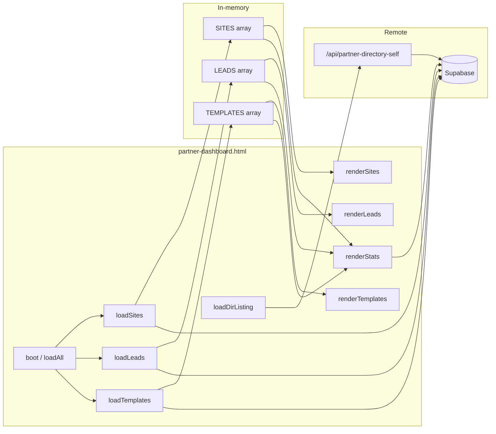
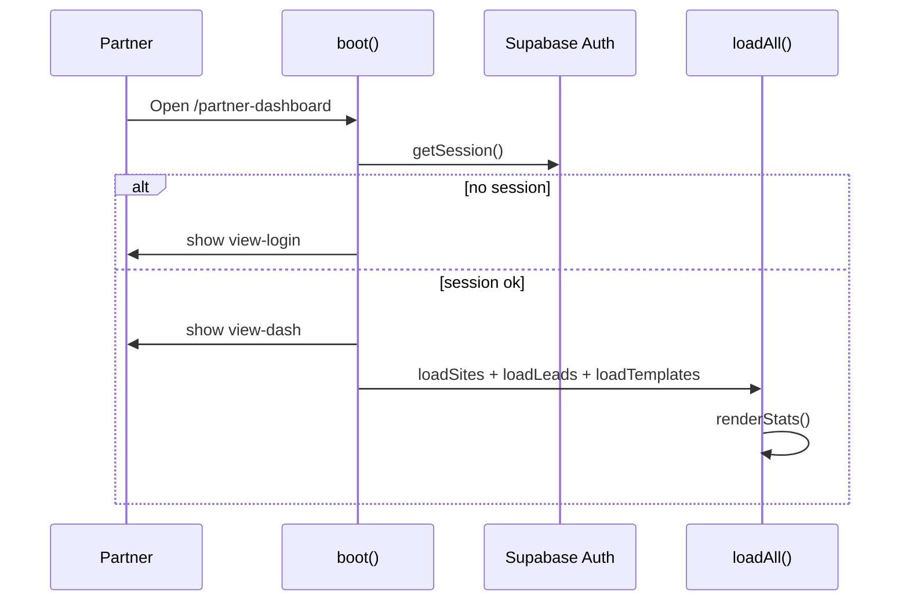
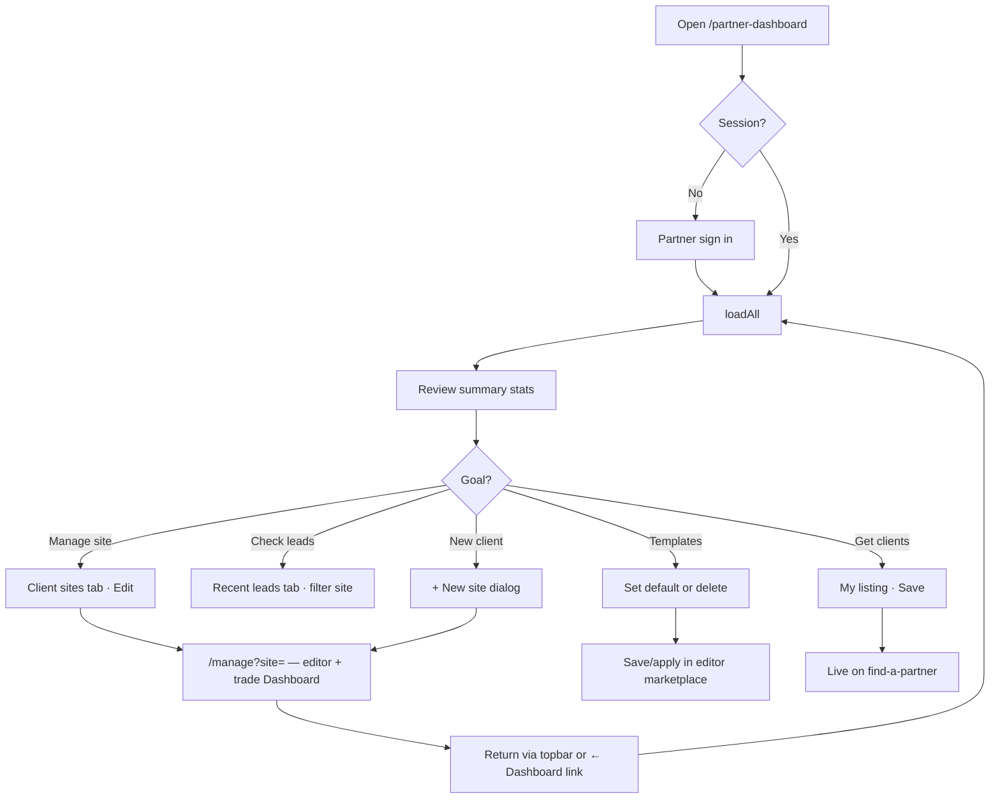
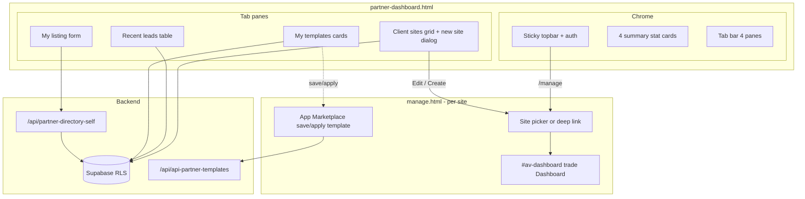
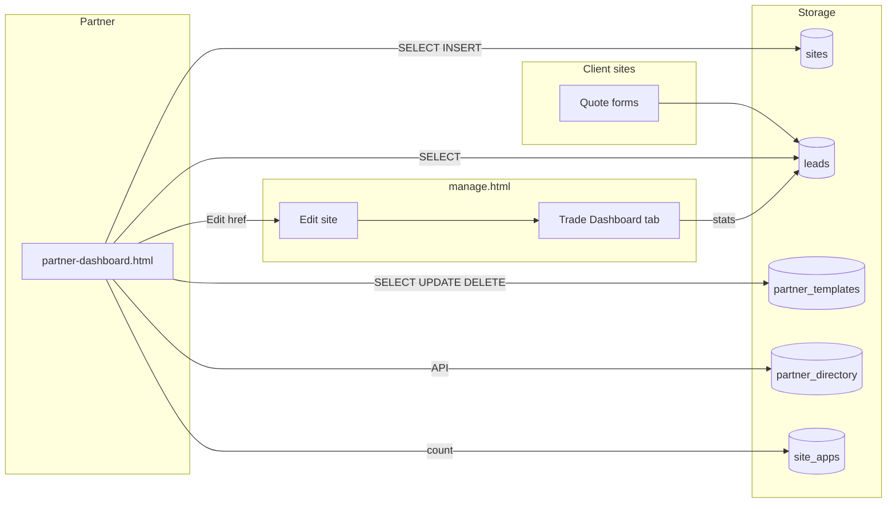
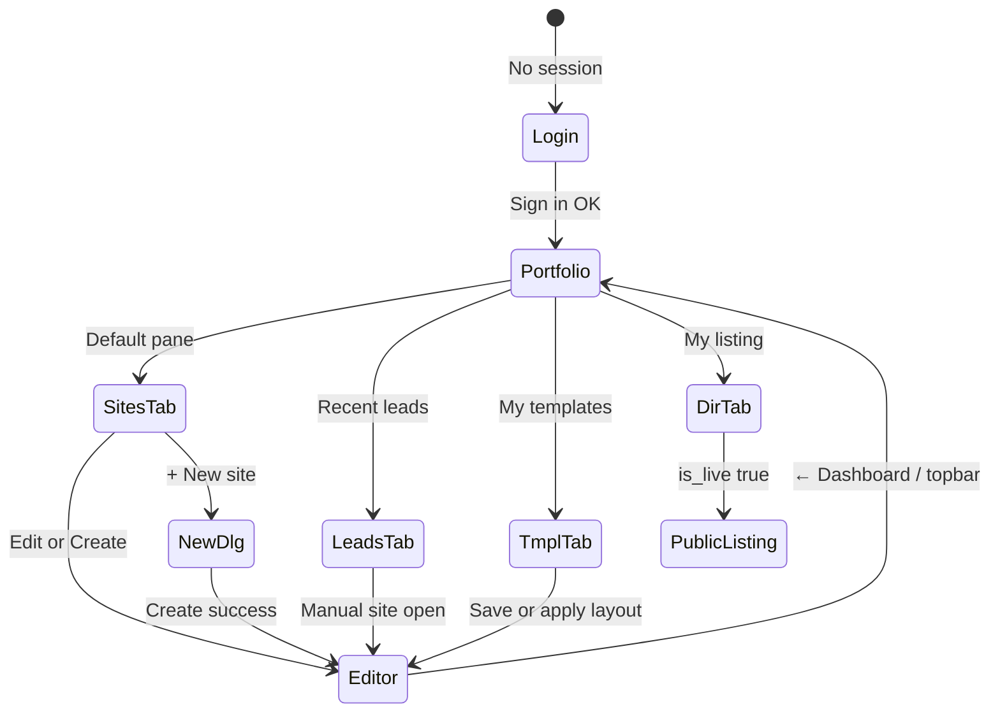

# Partner Dashboard — Complete Engineering Manual

**Document:** `features/Partner Dashboard`  
**Status:** Definitive engineering reference for the partner multi-client overview at `/partner-dashboard`  
**Audience:** Engineers rebuilding, extending, or debugging the Partner Dashboard; AI development agents  
**Prerequisites:** [00-VISION](../00-VISION.md), [01-ARCHITECTURE](../01-ARCHITECTURE.md), [05-PARTNERS](../05-PARTNERS.md), [04-SITE-BUILDER](../04-SITE-BUILDER.md), [09-CRM](../09-CRM.md), [features/Dashboard](Dashboard.md)

> **Scope note:** This document describes **`partner-dashboard.html`** — the partner portfolio home at `/partner-dashboard`. It is **not** the **trade-site Dashboard tab** inside `manage.html` (`#av-dashboard`, documented in [features/Dashboard](Dashboard.md)), **`partner.html`** (commissions, training, showcase builder), **`partners-admin.html`** (super-admin), or marketing pages on `tradies.html` / `brokers.html`.

---

## Executive Summary

The Partner Dashboard is the **default signed-in home** for LeadPages agency partners. It answers portfolio-level questions: how many live client sites exist, how leads are trending this month, which templates are saved, and whether the partner appears on **Find a Partner**. Partners drill into individual sites via **Edit** → `/manage?site={slug}`, where the per-site trade Dashboard tab takes over for operational metrics.

Implementation is **100% client-side** in a single HTML file: one IIFE builds UI from inline CSS, authenticates via Supabase Auth, reads/writes most data through direct Supabase queries (RLS-scoped), and uses one Vercel API (`/api/partner-directory-self`) for directory listing CRUD with server-side partner resolution.

| Fact | Detail |
|------|--------|
| **Route** | `/partner-dashboard` → `partner-dashboard.html` |
| **DOM roots** | `#view-login`, `#view-dash`, four tab panes |
| **Auth** | Supabase email/password; session in `boot()` |
| **Entry** | Successful sign-in → `loadAll()` |
| **Tabs** | Client sites · Recent leads · My templates · My listing |
| **Deep link to editor** | `/manage?site={slug}` (Edit button, new site create) |
| **Data** | `sites`, `leads`, `partner_templates`, `site_apps`, `partner_directory` |
| **API** | `GET/POST /api/partner-directory-self` (directory tab only) |

---

## Purpose

### Product purpose

Partners manage **many client sites**, not one. They need to:

1. **See the portfolio** — live vs draft vs demo sites, domains, client login emails, last updated.
2. **Spot lead activity** — recent enquiries across all clients, filterable by site.
3. **Reuse layouts** — saved marketplace templates (default template, delete stale presets).
4. **Get discovered** — maintain a public directory listing on `/find-a-partner`.
5. **Create new clients** — business name, slug, optional owner email, template type → open editor.

The Partner Dashboard is the **hub**; `manage.html` remains the **workbench** for editing, publishing, mailer, and per-site trade Dashboard KPIs.

### Engineering purpose

- **Separate surface** from the editor SPA — lighter page load, no trade pack / section editor baggage.
- **RLS-first data access** — partner sees only sites/leads their JWT allows; no bespoke portfolio API for core grids.
- **Lazy directory load** — `partner-directory-self` only when **My listing** tab opens.
- **Bridge to builder** — consistent slug-based deep links shared with account landing in `manage.html`.

---

## Business Purpose

| Stakeholder | Value |
|-------------|-------|
| **Partner / agency** | One screen for all clients; faster onboarding of new sites; directory visibility for lead gen |
| **LeadPages (platform)** | Partners self-serve site creation; reduced support for “where are my sites?” |
| **End client (tradie / broker)** | Optional `owner_email` on create → client can log in to their single site |
| **Prospect (Find a Partner)** | Curated live listings drive partner acquisition |

The dashboard supports the reseller model: partners **invoice clients directly** while LeadPages hosts infrastructure. Aggregate lead stats give partners proof of platform value without exporting analytics.

---

## User Types

| User | Sees Partner Dashboard? | Typical journey |
|------|---------------------------|-----------------|
| **Active partner** (`partners.status = active`) | Yes | Sign in → scan stats → Edit site in Command Centre → return via topbar link |
| **Partner applicant** (no `partners` row) | Login works; sites may be empty; directory API returns 404 | Apply via `partners.html`; admin approves |
| **Suspended partner** | Can sign in; directory save returns 403 | Contact support |
| **Super-admin** | May use page if they have partner-linked sites in RLS; primary tools elsewhere | Usually `manage.html` landing + `partners-admin.html` |
| **Site owner (client)** | **No** — uses `/manage` single-site flow | Never routed to partner dashboard |
| **Broker using trade Dashboard tab** | **Different UI** — per-site `#av-dashboard` inside editor | See [features/Dashboard](Dashboard.md) |

**Contrast with trade Dashboard users:** The trade Dashboard tab serves **one site at a time** inside `manage.html` (visitors, chart, backups, scope). The Partner Dashboard serves **all partner-scoped sites** with no analytics chart, backups, or project scope widgets.

---

## Permissions

| Layer | Mechanism |
|-------|-----------|
| **Page access** | Valid Supabase session; unauthenticated users see `#view-login` only |
| **Sites grid** | `sb.from('sites').select(...)` — visibility enforced by Supabase RLS on `sites` |
| **Leads table** | `sb.from('leads').select(...).limit(200)` — RLS must allow partner read on client leads |
| **Templates** | `partner_templates` filtered `.eq('partner_id', UID)` where `UID = auth.users.id` |
| **New site insert** | Direct `sites.insert` — subject to RLS INSERT policy for partners |
| **Directory** | `/api/partner-directory-self` resolves `partners` by `user_id` or email; requires `status = active` |
| **Template delete / default** | Direct Supabase update/delete on `partner_templates` (no API auth wrapper) |

```text
Partner Dashboard visibility ≠ trade Dashboard tab visibility

Partner Dashboard:  any authenticated partner (portfolio page)
Trade Dashboard tab: role ∈ {super, broker} AND template = trade AND inside manage.html
```

Super-admins editing a trade site in `manage.html` see **← Dashboard** in account chrome linking back to `/partner-dashboard` (when `currentRole === 'broker'`).

---

## Dashboard Layout

Vertical structure of `#view-dash`:

```text
┌─────────────────────────────────────────────────────────────┐
│  TOPBAR (sticky): logo · email · App Command Centre ·       │
│  Getting started · Sign out                                 │
├─────────────────────────────────────────────────────────────┤
│  SUMMARY STATS (4 cards)                                    │
│  Active client sites | Leads this month (+ trend) |         │
│  Apps enabled (aggregate) | Saved templates                 │
├─────────────────────────────────────────────────────────────┤
│  TAB BAR: Client sites | Recent leads | My templates |      │
│           My listing                                      │
├─────────────────────────────────────────────────────────────┤
│  ACTIVE PANE (one visible)                                  │
│  · Sites: search, filters, 3-col card grid, + New site      │
│  · Leads: site filter dropdown, read-only table             │
│  · Templates: card grid, default/delete actions             │
│  · Directory: form, specialties, save/hide/publish          │
└─────────────────────────────────────────────────────────────┘
```

**Modals (native `<dialog>`):**

- `#new-site-dlg` — create client site
- `#tmpl-info-dlg` — explains save/apply workflow in editor marketplace

**Login (`#view-login`):** Centred card — email, password, error line, Sign in.

---

## Navigation

### Topbar links

| Element | ID / href | Destination |
|---------|-----------|-------------|
| App Command Centre | `#top-editor` → `/manage` | Editor landing / last site |
| Getting started | `/partner-onboarding` | Onboarding wizard |
| Sign out | `#top-signout` | `sb.auth.signOut()` → reload |

### In-page tabs

```javascript
var PANES = {
  sites: 'pane-sites',
  leads: 'pane-leads',
  templates: 'pane-templates',
  directory: 'pane-directory'
};
```

Click `[data-tab]` → toggle `.on` on tab buttons, hide all panes, show target pane. Opening **directory** additionally calls `loadDirListing()`.

### Cross-links from Partner Dashboard

| UI element | Destination |
|------------|-------------|
| **Edit** on site card | `/manage?site={slug}` |
| **View** on site card | `https://{custom_domain}` or `https://www.leadpages.com.au/{slug}` |
| **+ New site** → Create | Insert row → `/manage?site={slug}` |
| **Open the editor** (empty templates) | `/manage` |
| **Find a Partner** (copy in directory pane) | `/find-a-partner` (public) |
| Trade Dashboard (after Edit) | `#av-dashboard` tab in `manage.html` for that site |

Reverse link from editor: account area **← Dashboard** → `/partner-dashboard`.

---

## Widgets

| Widget | Container ID | Loader | Description |
|--------|--------------|--------|-------------|
| **Summary stats** | `#stats-row` | `renderStats()` | Four KPI tiles after `loadAll()` |
| **Site search** | `#site-search` | input → `renderSites()` | Filters name, slug, domain, owner email |
| **Site filters** | `#site-filters` | click → `renderSites()` | All / Live / Draft / Demo |
| **Site grid** | `#site-grid` | `renderSites()` → `siteCard()` | Card per site with logo, meta, actions |
| **Site empty** | `#site-empty` | `renderSites()` | Shown when filter/search yields zero |
| **Leads table** | `#leads-body` | `renderLeads()` | Up to 100 rows (from 200 loaded) |
| **Lead site filter** | `#lead-site-filter` | populated in `loadSites()` | `<select>` of partner sites |
| **Template grid** | `#tmpl-grid` | `renderTemplates()` | Name, app count, default badge, actions |
| **Template empty** | `#tmpl-empty` | `renderTemplates()` | CTA to editor marketplace |
| **Directory form** | `#dir-form-wrap` | `fillDirForm()` | Business, location, contact, specialties |
| **Directory status** | `#dir-status-badge` | `fillDirForm()` | Live on directory / Hidden |

---

## Statistics

### Summary stat cards

| Card | Element ID | Source | Calculation |
|------|------------|--------|-------------|
| **Active client sites** | `#s-sites` | `SITES` in memory | Count where `!is_demo && !is_mockup && status ∈ {live, active}` |
| **Total leads this month** | `#s-leads` | `LEADS` | `created_at` in current calendar month |
| **Leads trend** | `#s-leads-t` | `LEADS` | `mLeads - lmLeads` vs last month; classes `up` / `dn` / `neu` |
| **Apps enabled across sites** | `#s-apps` | `site_apps` | `count` where `enabled = true` (see Technical Debt — not scoped per partner) |
| **Saved templates** | `#s-tmpl` | `TEMPLATES` | `TEMPLATES.length`; also updated in `renderTemplates()` |

### Site card status badges

`siteStatus(s)` logic:

| Condition | Label | Badge class |
|-----------|-------|-------------|
| `is_demo \|\| is_mockup` | Demo | `demo` |
| `status === live \|\| active` | Live | `ok` |
| `status === draft` | Draft | `warn` |
| else | Setup needed | `warn` |

### Lead row status

Display-only badge: `new` → `warn` styling; other statuses → `ok`.

**Contrast with trade Dashboard stats:** Trade tab shows visitors, calls, forms, conversion %, apps on **one site**, activity SVG chart, and conversion benchmark. Partner Dashboard shows **portfolio aggregates** only — no `/api/stats`, no event chart, no conversion rate.

---

## Quick Actions

| Action | Trigger | Handler |
|--------|---------|---------|
| **Sign in** | `#signin` | `signInWithPassword` → `loadAll()` |
| **Sign out** | `#top-signout` | `signOut` → reload |
| **Search sites** | `#site-search` input | Updates `siteQ` → `renderSites()` |
| **Filter sites** | `#site-filters [data-sf]` | Updates `siteFilter` → `renderSites()` |
| **Edit site** | `[data-edit]` on card | `location.href = /manage?site={slug}` |
| **View live** | card footer link | Opens public URL in new tab |
| **New site** | `#btn-new-site` | Opens `#new-site-dlg` |
| **Auto slug** | `#ns-biz` input | `slugify()` → `#ns-slug` unless manually edited |
| **Create site** | `#ns-create` | `sites.insert` → redirect to editor |
| **Filter leads by site** | `#lead-site-filter` change | `leadSiteFilter` → `renderLeads()` |
| **Set default template** | `[data-set-default]` | Unset all partner templates; set one `is_default` |
| **Delete template** | `[data-del-tmpl]` | confirm → `partner_templates.delete` |
| **Template help** | `#btn-tmpl-info` | Opens `#tmpl-info-dlg` |
| **Save directory listing** | `#df-save` | `saveDirListing('save')` |
| **Hide listing** | `#df-hide` | `saveDirListing('hide')` |
| **Publish listing** | `#df-publish` | `saveDirListing('publish')` |

**Not on Partner Dashboard (trade Dashboard / editor only):** backup save/restore, project scope tasks, chart period toggles, lead refresh to Supabase from dashboard panel, mailer send, publish.

---

## Recent Activity

“Recent activity” on the Partner Dashboard means the **Recent leads** tab, not an event timeline.

### Leads table (`#leads-body`)

- Loads **200** newest leads globally (RLS-scoped) in `loadLeads()`.
- Renders up to **100** rows after optional site filter.
- Columns: Site (business name), Contact (name, email, phone), Message (truncated), Received (`ago()`), Status (badge).

Empty state: “No leads yet — Leads from quote forms will appear here.”

### Site cards “last updated”

Each card shows relative `updated_at` via `ago()` — portfolio freshness signal, not an analytics feed.

### Monthly lead trend

`#s-leads-t` compares current month count to previous month on the summary row (not a chart).

**Broker / trade comparison:** Non-partner trade Dashboard exposes an **activity chart** (`ANA.data`) and expandable lead messages. Partner Dashboard has **no chart** and **no lead message expansion** — partners open the site in the editor for full CRM.

---

## Site Selection

The Partner Dashboard **is** the site selection UI for partners. There is no separate landing grid inside `manage.html` for broker-role partners with many sites — they start at `/partner-dashboard`, pick **Edit**, and land in the editor with `?site=`.

| Mechanism | Behaviour |
|-----------|-----------|
| **Card grid** | All `SITES` after excluding `is_partner_home` |
| **Search** | Client-side filter on business name, slug, custom domain, owner email |
| **Filters** | `all` · `live` · `draft` · `demo` |
| **Edit** | Sets editor context via URL slug (same as `manage.html` `#lp-landing` picker) |

Sites with `is_partner_home: true` (agency showcase homepage) are **excluded** from the grid so the portfolio shows client work only.

Changing site context happens only by leaving the page for `/manage?site=…`. Returning uses topbar **App Command Centre** or browser back to `/partner-dashboard`.

---

## Notifications

The Partner Dashboard has **no notification center**, toast system, or email alerts.

| Type | Mechanism | Relevance |
|------|-----------|-----------|
| **Login error** | `#lerr` text from Supabase auth | Inline only |
| **New site error** | `#ns-err` | Validation / insert failure |
| **Directory save** | `#df-ok` / `#df-err` | 3s auto-clear on success message |
| **Template delete** | `confirm()` dialog | Browser native |
| **Lead NEW badge** | **Not implemented** | Trade Dashboard marks leads &lt; 72h |
| **Partner messages** | **`partner.html`** | Conversations not surfaced here |

Future: unread lead count badge on tab; webhook digest — not implemented.

---

## Data Sources



| Source | Table / endpoint | Fields used |
|--------|------------------|-------------|
| Sites | `sites` SELECT | `id, slug, business_name, custom_domain, owner_email, config, template, is_demo, is_mockup, status, updated_at, is_partner_home` |
| Sites | `sites` INSERT | New client from dialog |
| Leads | `leads` SELECT | `id, site_id, name, email, phone, message, created_at, status` limit 200 |
| Templates | `partner_templates` SELECT | `*` where `partner_id = UID` |
| Templates | `partner_templates` UPDATE/DELETE | Default flag, delete |
| Apps stat | `site_apps` HEAD count | `enabled = true` |
| Directory | `GET /api/partner-directory-self` | `listing`, `partner` |
| Directory | `POST /api/partner-directory-self` | Upsert / hide / publish `partner_directory` |

Template **save** and **apply to site** happen in `manage.html` App Marketplace via `/api/api-partner-templates` — not on this page.

---

## API Calls

| Endpoint | Method | Called by | Body / query | Response used |
|----------|--------|-----------|--------------|---------------|
| Supabase Auth | — | `boot`, `#signin` | email/password | Session JWT |
| Supabase `sites` | SELECT | `loadSites` | order `updated_at` desc | Site grid, lead filter options |
| Supabase `sites` | INSERT | `#ns-create` | slug, business_name, template, owner_email, status draft, minimal config | Redirect on success |
| Supabase `leads` | SELECT | `loadLeads` | order desc, limit 200 | Leads tab + stats |
| Supabase `partner_templates` | SELECT | `loadTemplates` | `partner_id = UID` | Template grid |
| Supabase `partner_templates` | UPDATE | set default handler | `is_default` | Refresh templates |
| Supabase `partner_templates` | DELETE | delete handler | by `id` | Refresh templates |
| Supabase `site_apps` | HEAD count | `renderStats` | `enabled = true` | `#s-apps` figure |
| `/api/partner-directory-self` | GET | `loadDirListing` | Bearer token | `listing` → form |
| `/api/partner-directory-self` | POST | `saveDirListing` | `action`, address fields, `specialties[]` | `{ ok }` / error |

Auth for directory: `authFetch()` attaches `Authorization: Bearer {access_token}` from current session.

**Not used on this page:** `/api/stats`, `/api/partner/*` (add-customer, add-mockup), `/api/api-partner-templates` (used from editor), `/api/send-campaign`.

---

## Database Tables

| Table | Partner Dashboard usage |
|-------|-------------------------|
| **`sites`** | Grid, insert new draft sites; excludes `is_partner_home` from display |
| **`leads`** | Read-only rollup table; stats by month |
| **`partner_templates`** | List, set default, delete; `partner_id` stores auth **user id** (same as editor save) |
| **`site_apps`** | Aggregate enabled count (global query today) |
| **`partner_directory`** | CRUD via API — public listing on Find a Partner |
| **`partners`** | Resolved server-side in directory API (`user_id`, email fallback, `status`) |
| **`profiles`** | Indirect — auth identity only |

Expected site row shape on partner create (client-side insert):

```json
{
  "slug": "smiths-plumbing",
  "business_name": "Smith's Plumbing",
  "template": "trade",
  "owner_email": "client@example.com",
  "status": "draft",
  "config": { "business": "Smith's Plumbing", "slug": "smiths-plumbing" }
}
```

**Note:** Server-side partner flows (`POST /api/partner/add-customer`) also stamp `referring_partner_id` and `servicing_partner_id`. The dashboard dialog insert does **not** set those columns in JS — rely on RLS triggers or treat as debt (see Technical Debt).

Directory specialties: up to **8** strings from fixed list `DIR_SPECS` (Trades & construction, Salons & beauty, …).

---

## Related Files

| File | Relationship |
|------|--------------|
| **`partner-dashboard.html`** | **Primary implementation** — all UI and data logic |
| **`manage.html`** | Site editor; trade Dashboard tab; saves templates via marketplace |
| [features/Dashboard](Dashboard.md) | **Per-site trade Dashboard** — distinct product surface |
| `partner-onboarding.html` | Linked from topbar; shares directory API |
| `partner.html` | Extended partner ops — commissions, showcase, training |
| `find-a-partner.html` | Public consumer of `partner_directory` |
| `api/partner-directory-self.js` | Directory GET/POST with partner resolution |
| `api/partner-directory.js` | Public read of live listings |
| `api/api-partner-templates.js` | Save/apply/delete templates from editor |
| `api/partner/add-customer.js` | Alternative server-side site creation |
| `docs/05-PARTNERS.md` | Partner economics, ownership columns |
| `docs/09-CRM.md` | Full CRM in editor vs read-only leads here |
| `docs/04-SITE-BUILDER.md` | Site creation flows |

---

## Functions

All functions live inside the IIFE in `partner-dashboard.html` (~lines 314–695).

### Core

| Function | Role |
|----------|------|
| `boot()` | Session check → show login or dashboard → `loadAll()` |
| `loadAll()` | `Promise.all([loadSites, loadLeads, loadTemplates])` → `renderStats()` |
| `loadSites()` | Fetch sites, filter out partner home, `renderSites()`, fill lead filter |
| `loadLeads()` | Fetch 200 leads → `renderLeads()` |
| `loadTemplates()` | Fetch `partner_templates` for `UID` → `renderTemplates()` |
| `renderStats()` | Populate four summary cards |
| `renderSites()` | Filter/search → build `#site-grid` HTML |
| `siteCard(s)` | Single site card markup |
| `siteStatus(s)` | Badge label/class from flags |
| `renderLeads()` | Table HTML for filtered leads |
| `renderTemplates()` | Template cards with actions |
| `siteNameById(id)` | Resolve site label for leads table |

### Directory

| Function | Role |
|----------|------|
| `loadDirListing()` | GET directory API → `fillDirForm()` |
| `fillDirForm(l)` | Populate inputs, status badge, show/hide buttons |
| `renderSpecsCheckboxes(selected)` | Specialty chip UI (max 8 enforced server-side) |
| `saveDirListing(action)` | POST save / hide / publish |
| `authFetch(url, opts)` | Attach Bearer token to fetch |

### Utilities

| Function | Role |
|----------|------|
| `esc(s)` | XSS-safe text |
| `slugify(s)` | Auto slug from business name |
| `ago(ts)` | Relative time for leads and site updated |
| `fmt(ts)` | Absolute date `en-AU` for templates |
| `show(id)` | Toggle `#view-login` vs `#view-dash` |

---

## Event Flow

### Page boot



### Create new site

1. User clicks **+ New site** → `#new-site-dlg.showModal()`.
2. Business name auto-fills slug until `#ns-slug` manually edited (`dataset.manual`).
3. **Create site** validates biz + slug → `sites.insert`.
4. On success: close dialog → `window.location = /manage?site={slug}`.
5. Editor `loadSite()` runs trade/broker template flow; trade sites default to **Dashboard tab** (see [features/Dashboard](Dashboard.md)).

### Directory tab first open

1. User clicks **My listing** tab.
2. Second tab listener calls `loadDirListing()`.
3. GET `/api/partner-directory-self` → form fill.
4. Save posts JSON; API upserts `partner_directory` with `is_live: true` on save (hide/publish override).

---

## User Journey



**Partner onboarding path:** `partner-onboarding.html` step `directory_listed` also POSTs directory API; dashboard **My listing** tab is the ongoing edit surface.

---

## Performance Considerations

| Area | Behaviour | Risk |
|------|-----------|------|
| **Parallel load** | `loadAll()` fetches sites, leads, templates concurrently | Good; leads query may be heavy |
| **Leads limit 200** | Fixed cap | Older leads invisible on this page |
| **Re-render** | Full innerHTML on filter/search | Cheap at typical partner portfolio size |
| **site_apps count** | Separate HEAD query after render | Extra round-trip; unscoped count misleading |
| **Directory lazy load** | Only on tab open | Good |
| **No caching** | Every page load refetches all | Acceptable for control plane |
| **Template actions** | Two UPDATEs for set-default | Race if double-clicked |

**Recommendations:** Scope `site_apps` count to partner site IDs; paginate leads; resolve `partners.id` once and reuse for templates.

---

## Security Considerations

| Topic | Detail |
|-------|--------|
| **Authentication** | Supabase email/password; anon key + user JWT |
| **Authorization** | RLS on `sites`, `leads`, `partner_templates`; directory API validates active partner |
| **XSS** | `esc()` on user-generated strings in templates and cards |
| **PII** | Leads table shows name, email, phone, message — partner-scoped by RLS |
| **Template CRUD** | Direct browser writes to `partner_templates` — no Bearer check on Supabase mutations (relies on RLS) |
| **New site insert** | Client-side insert — must be constrained by RLS to partner-owned rows |
| **Directory API** | Service role server-side; validates JWT → partner row → status active |
| **Public listing** | Only `partner_directory.is_live = true` exposed via public API |

Partners must not see other partners’ sites if RLS is correctly configured. Directory hide/publish only toggles `is_live`; row remains in DB.

---

## Technical Debt

| ID | Issue | Location | Impact |
|----|-------|----------|--------|
| TD-PD1 | **`site_apps` count is global** | `renderStats` ~414 | `#s-apps` counts all enabled apps in platform, not partner portfolio |
| TD-PD2 | **New site missing partner FKs** | `#ns-create` insert ~509 | `referring_partner_id` / `servicing_partner_id` not set in JS (unlike `add-customer.js`) |
| TD-PD3 | **`partner_id` = user id** | `loadTemplates`, editor save | Column name implies `partners.id`; stores `auth.users.id` |
| TD-PD4 | **No active-partner gate on boot** | `boot()` | Suspended partner sees empty UI until directory API 403 |
| TD-PD5 | **Leads not filtered by site IDs client-side** | `loadLeads` | Depends entirely on RLS; super-wide JWT could over-fetch |
| TD-PD6 | **CSS class gaps** | `fillDirForm` | `badge grey`, `btn danger` referenced but not defined in stylesheet |
| TD-PD7 | **Read-only CRM** | leads tab | No status update, mailer, or link to lead in editor |
| TD-PD8 | **No mockup/create via API** | — | Mockups created via `partner.html` / API, not dashboard dialog |
| TD-PD9 | **Template save/apply not here** | templates tab | Manage-only; dashboard only lists/deletes/defaults |
| TD-PD10 | **Monthly stats from loaded leads only** | `renderStats` | If &gt;200 leads/month historically, trend may skew |

Tracked in [13-ROADMAP](../13-ROADMAP.md) as NT-5 (Partner dashboard polish).

---

## Future Improvements

1. **Scope apps count** — filter `site_apps` by partner site IDs or server aggregate endpoint.
2. **Stamp partner IDs on create** — align insert with `add-customer.js` or route create through API.
3. **Resolve `partners.id`** — use consistent FK for `partner_templates.partner_id`.
4. **Active partner gate** — redirect suspended accounts with clear message on boot.
5. **Lead actions** — deep link to `/manage?site=&lead=` or inline status chips.
6. **Analytics rollup** — optional portfolio visitors/leads chart (multi-site `/api/stats`).
7. **Mockup filter** — separate mockup sales flow from client sites tab.
8. **Notifications** — badge on Recent leads tab for unseen rows.
9. **Fix CSS** — define `.badge.grey`, `.btn.danger`.
10. **Paginated leads** — infinite scroll beyond 200/100 caps.

---

## Partner Dashboard Architecture



---

## Connections to Other Systems

### Editor (`manage.html`)

| Aspect | Partner Dashboard | Editor |
|--------|-------------------|--------|
| Scope | All partner sites | One `currentSiteId` |
| Create site | Minimal insert + redirect | Full trade pack, publish, sections |
| Templates | List / default / delete | Save layout, apply to site (marketplace) |
| Metrics | Monthly lead count | Trade Dashboard: visitors, chart, backups, scope |
| Mailer | Not available | Email clients tab per site |

Partners loop: **Portfolio → Edit → work → ← Dashboard**.

### Trade Dashboard ([features/Dashboard](Dashboard.md))

| Aspect | Partner Dashboard | Trade Dashboard tab |
|--------|-------------------|---------------------|
| Location | Standalone page | Tab `#av-dashboard` in editor |
| Audience | Partner agency | Tradie site owner / broker editing one trade site |
| Sites shown | Many cards | One site header |
| Analytics | None | `/api/stats`, SVG chart, conversion bench |
| Leads | Cross-site table, read-only | Last 20 for current site, expandable |
| Backups / scope | Not shown | Full widgets |

Link: Partner clicks **Edit** on trade site → lands on trade Dashboard by default (`TEMPLATE_NAV.trade[0] === 'dashboard'`).

### CRM

Partner Dashboard: read-only lead table (200 load / 100 display). Status badges display only — no Won/Lost workflow. Full CRM: `renderLeadsCRM` in `manage.html`. See [09-CRM](../09-CRM.md).

Email campaigns: per-site in editor — not bulk from partner dashboard ([features/Email Campaigns](Email%20Campaigns.md)).

### Analytics

No integration with `ANA` or `/api/stats` on this page. Partners infer activity from lead rows and monthly stat. Per-site analytics require opening the site in the editor trade Dashboard.

### Partner system

| Touchpoint | Connection |
|------------|------------|
| **Onboarding** | `/partner-onboarding` linked from topbar; directory step shares API |
| **Find a Partner** | `partner_directory` managed in **My listing** tab |
| **Commissions / showcase** | `partner.html` — not embedded here |
| **add-customer API** | Alternative create path with partner IDs and intake metadata |
| **Support card on client sites** | `#lp-support-card` in editor — partner contact from `partner_profiles` |

See [05-PARTNERS](../05-PARTNERS.md).

### Templates / marketplace

- **Save:** `manage.html` → `_savePartnerTemplate()` → `POST /api/api-partner-templates` `{ action: 'save' }`.
- **Apply:** marketplace → `{ action: 'apply', template_id, site_id }` → upserts `site_apps`.
- **Dashboard:** display, set default, delete only.

Default template affects partner workflow in editor apply picker (product expectation; not auto-applied on `ns-create` today).

---

## Data Flow



---

## User Flow



---

## Glossary

| Term | Meaning |
|------|---------|
| **Partner Dashboard** | `partner-dashboard.html` — multi-client portfolio at `/partner-dashboard` |
| **Trade Dashboard** | `#av-dashboard` tab in `manage.html` for one trade site |
| **App Command Centre** | Marketing name for `manage.html` |
| **Partner home site** | `sites.is_partner_home` — agency showcase; hidden from client grid |
| **Partner template** | Saved marketplace layout in `partner_templates.apps[]` |
| **Directory listing** | Row in `partner_directory` shown on Find a Partner when `is_live` |

---

*Last updated: July 2026 — reflects `partner-dashboard.html` implementation on branch `main`.*
