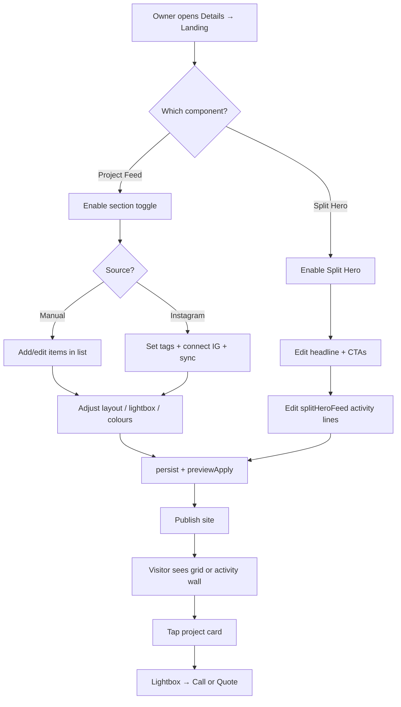
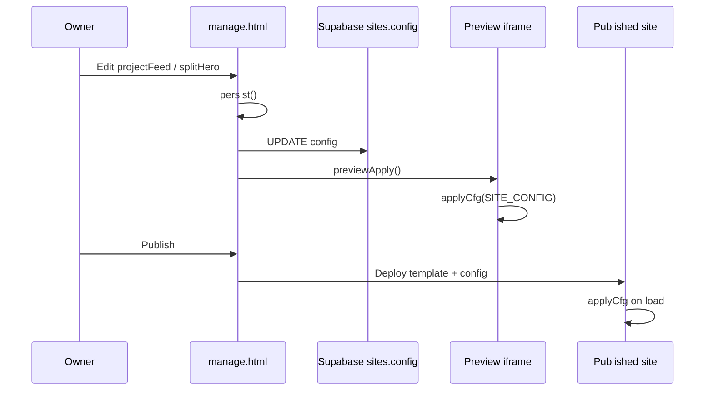

# Project Feed & Split Hero — Complete Engineering Manual

**Document:** `features/Project Feed`  
**Status:** Definitive engineering reference for the **Project Feed** section, **Split Hero** hero variant, and the **`splitHeroFeed`** list editor in the trade site builder  
**Audience:** Engineers rebuilding, extending, or debugging project-proof UI; AI development agents  
**Prerequisites:** [00-VISION](../00-VISION.md), [03-TEMPLATE-SYSTEM](../03-TEMPLATE-SYSTEM.md), [04-SITE-BUILDER](../04-SITE-BUILDER.md), [10-EDITOR](../10-EDITOR.md)

> **Scope note:** This document covers **`config.sections.projectFeed`** (grid + lightbox), **`config.sections.splitHero`** (split hero + live activity wall via **`feed[]`**), and the editor wiring in **`manage.html`**. It also documents **`splitHeroFeed`** as a **`LIST_SCHEMAS`** alias — not a separate section ID. **`igProjectFeed`** is a sibling Instagram-only component; see [Related sections](#related-sections-igprojectfeed-vs-projectfeed).

---

## Executive Summary

**Project Feed** is an optional trade landing-page section that shows recent work as a responsive photo grid. Each card opens a lightbox with project details and Call / Quote / View-original actions. Content can be **manual** (owner-added rows) or **synced from Instagram** via `lib/ig/igSync.mjs`.

**Split Hero** is an optional **hero replacement**: a two-column block with marketing copy + CTAs on the left and a **live activity wall** on the right. Activity items are edited through the **`splitHeroFeed`** list schema, stored at **`sections.splitHero.feed[]`**.

Both sections are **off by default**, seeded from **`DEFAULT_TRADE_SECTIONS`**, rendered client-side in **`trade.template.json`** via **`applyCfg()`**, and edited in the Page editor (**Details → Landing** subtabs).

| Fact | Project Feed | Split Hero |
|------|--------------|------------|
| **`data-sec`** | `projectFeed` | `splitHero` |
| **Default `on`** | `false` (opt-in) | `false` (opt-in) |
| **Editor subtab** | `Project Feed` | `Split Hero` |
| **List data key** | `sections.projectFeed.items[]` | `sections.splitHero.feed[]` |
| **List schema key** | `LIST_SCHEMAS.projectFeed` | `LIST_SCHEMAS.splitHeroFeed` |
| **Hides classic hero** | No | Yes (when `on === true`) |
| **Instagram sync** | Yes (`source: 'instagram'`) | No |

---

## Purpose

### Product purpose

Trades need **visual proof** that work is happening locally. Project Feed answers “What have you done recently?” with job photos, suburbs, and service tags — without requiring the owner to rebuild a portfolio page.

Split Hero answers “Are you active right now?” for urgency-first layouts (especially the **Social Proof Feed** preset). The notification-style activity wall reinforces busyness and trust at the top of the page.

### Engineering purpose

- **One config object** (`sections.projectFeed`) drives manual editing, Instagram sync, card layout, lightbox actions, and publish-time rendering.
- **Split hero variant** reuses the same list-editor infrastructure (`LIST_SCHEMAS`, `listEditor`, `DEFAULT_TRADE_LISTS`) with a different parent section and field shape (`text` + `time` instead of project metadata).
- **Template-local runtime** — no server render step; `applyCfg()` in `trade.template.json` hydrates DOM from `SITE_CONFIG`.

---

## Business Purpose

| Stakeholder | Value |
|-------------|-------|
| **Site owner (tradie)** | Show recent jobs; optional auto-fill from Instagram; tap-to-call from project detail |
| **Partner / broker** | Enable Social Proof Feed preset for high-conversion demos |
| **LeadPages (platform)** | Premium AI caption enrichment upsell; Instagram connection stickiness |
| **Visitor** | Quick scan of local proof; lightbox for detail without leaving the page |

Project Feed supports conversion: grid cards and lightbox both funnel to **Call** (`tel:` + `call_click` tracking) and **Quote** (`#quote` scroll).

---

## Architecture Overview

```mermaid
flowchart TB
  subgraph editor [manage.html Page editor]
    RS[renderLandingSub]
    PF[sub === projectFeed]
    SH[sub === splitHero]
    LE[listEditor]
    WS[wireSec + secCard]
  end

  subgraph config [sites.config JSONB]
    SPFS[sections.projectFeed]
    SPHS[sections.splitHero]
    FEED[splitHero.feed array]
    ITEMS[projectFeed.items array]
  end

  subgraph sync [Instagram pipeline]
    CRON[/api/cron/sync-instagram]
    SYNC[/api/instagram/sync]
    IGS[lib/ig/igSync.mjs]
  end

  subgraph publish [Published trade site]
    TMPL[trade.template.json]
    AC[applyCfg]
    GRID[.pf-grid]
    LB[#pf-lightbox]
    WALL[.sph-wall]
  end

  RS --> PF & SH
  PF --> WS & LE
  SH --> WS & LE
  LE --> ITEMS & FEED
  PF --> SPFS
  SH --> SPHS
  CRON & SYNC --> IGS
  IGS --> ITEMS
  SPFS & SPHS --> TMPL
  TMPL --> AC
  AC --> GRID & LB & WALL
```

---

## DEFAULT_TRADE_SECTIONS

Defined in `manage.html` (~line 1871). These are **fallback defaults** merged by `lpSeedComponent()` when a section is first enabled or preset-toggled.

### `projectFeed`

```javascript
projectFeed: {
  eyebrow: 'Latest work',
  heading: 'Latest Work',
  intro: '',
  source: 'manual',
  postsToShow: 12,
  sortOrder: 'newest'
}
```

| Field | Default | Notes |
|-------|---------|-------|
| `eyebrow` | `'Latest work'` | Section label above heading |
| `heading` | `'Latest Work'` | `<h2>` text |
| `intro` | `''` | Hidden when empty |
| `source` | `'manual'` | Editor also offers `instagram`, `facebook`, and placeholder future sources |
| `postsToShow` | `12` | Public page slices visible cards after sort |
| `sortOrder` | `'newest'` | `'oldest'` reverses list order at render time |

**Not in defaults** (runtime / editor defaults apply when unset):

| Field | Runtime default | Set in editor |
|-------|-----------------|---------------|
| `on` | `false` | Section toggle in `secCard` |
| `cardStyle` | `'overlay'` | Card layout card |
| `showTag`, `showTitle`, `showLocation` | `true` | Card layout checkboxes |
| `showDate`, `showDesc` | `false` | Card layout checkboxes |
| `showCall`, `showQuote`, `showLink` | `true` | Image click / lightbox card |
| `textColor` | `#1a2230` | Card & button styling |
| `textBg` | `#ffffff` | Card & button styling |
| `btnBg` | `#ff7a00` | Card & button styling |
| `btnText` | `#ffffff` | Card & button styling |
| `callLabel` | `'Call now'` | Button labels |
| `quoteLabel` | `'Get a quote'` | Button labels |
| `linkLabel` | `'View original'` | Button labels |
| `includeTags`, `excludeTags` | — | Hashtag filters for sync |
| `igAccount` | — | Shown in Account field (Instagram handle hint) |
| `aiEnrich` | — | Premium AI structuring (see [Technical debt](#technical-debt)) |

### `splitHero`

```javascript
splitHero: {
  eyebrow: 'Active across the ACT today',
  heading: "Canberra's most active drain cleaning team",
  highlightText: 'most active',
  subText: "Real jobs, all day, every day — you'll know the price before we start.",
  primaryCtaText: 'Call Now',
  primaryCtaAction: 'call',
  secondaryCtaText: 'Get A Fast Quote',
  secondaryCtaAction: 'quote'
}
```

| Field | Purpose |
|-------|---------|
| `highlightText` | Substring wrapped in `<span class="hl">` inside the headline (case-insensitive regex) |
| `primaryCtaAction` / `secondaryCtaAction` | `'call'`, `'quote'`, or `'none'` |
| `feed[]` | **Not** in `DEFAULT_TRADE_SECTIONS`; seeded from `DEFAULT_TRADE_LISTS['splitHero.feed']` |

---

## Section visibility & presets

Both IDs appear in:

- **`OFF_BY_DEFAULT_SECTIONS`** — section is hidden unless `sections[id].on === true`
- **`OPTIONAL_COMPONENTS`** — appended to layout order when turned on

Helper **`_secOn(c, id)`**:

```javascript
// OFF_BY_DEFAULT: visible only when on === true
// Core sections: visible unless on === false
```

### Hero interaction

**`_heroReplaced(c)`** returns true when any of these are on:

- `heroSlider.on === true`
- `heroBeforeAfter.on === true`
- **`splitHero.on === true`**
- layout is `quote-first`

When split hero is active, **`applyCfg()`** sets the classic **`[data-sec="hero"]`** node to `display: none`. Enabling split hero therefore **replaces** the standard hero — it does not stack beneath it.

Toggling preset **`classic`** explicitly turns off `heroSlider`, `heroBeforeAfter`, and **`splitHero`**.

### Social Proof Feed layout

The **`social-proof-feed`** layout preset enables both **`splitHero`** and **`projectFeed`** (among other proof components):

```javascript
"social-proof-feed": {
  sections: ["emerg","splitHero","activityCounter","activityTimeline",
    "proofStream","projectFeed","jobsFeed","beforeAfterFeed",
    "videoReels","services","reviews","customerReactions",
    "why","crew","area","quote","faq","footer"],
  features: ["proofStream","splitHero","activityCounter","crew",
    "jobsFeed","beforeAfterFeed","videoReels","activityTimeline",
    "customerReactions","projectFeed"]
}
```

`togglePreset('social-proof-feed')` calls **`lpSeedComponent(c, id)`** for each feature, which copies **`DEFAULT_TRADE_SECTIONS`** scalars and **`DEFAULT_TRADE_LISTS`** arrays.

---

## DEFAULT_TRADE_LISTS & LIST_SCHEMAS

### Seed data: `projectFeed.items`

Three demo projects (Merbau Deck, Composite Deck, Pergola Build) with `title`, `location`, `service`, `date`, `caption`, `image`, `permalink`, and `on: true`. Stored under key **`'projectFeed.items'`** in `DEFAULT_TRADE_LISTS` (~line 2096).

### Seed data: `splitHero.feed`

Four demo activity lines, e.g. `{ on: true, text: 'Drain cleared in Belconnen', time: '2 hours ago' }`. Key: **`'splitHero.feed'`**.

### LIST_SCHEMAS

```javascript
splitHeroFeed: {
  secId: 'splitHero',
  key: 'feed',
  addLabel: 'Add activity',
  item: [
    { k: 'text', label: 'Activity' },
    { k: 'time', label: 'Time' }
  ],
  defaultItem: { text: 'New job completed', time: 'Just now' }
},

projectFeed: {
  secId: 'projectFeed',
  key: 'items',
  addLabel: 'Add project',
  item: [
    { k: 'title', label: 'Project / title' },
    { k: 'location', label: 'Location' },
    { k: 'service', label: 'Service (shown as tag)' },
    { k: 'date', label: 'Date / completed' },
    { k: 'caption', label: 'Description', type: 'ta' },
    { k: 'image', type: 'image', label: 'Image URL' },
    { k: 'permalink', label: 'Source link (post URL)' }
  ],
  defaultItem: {
    title: 'New project', location: '', service: '',
    date: '', caption: '', image: '', permalink: ''
  }
}
```

**Important:** The editor UI label **`splitHeroFeed`** is only the **`LIST_SCHEMAS` map key** passed to `listEditor($('le-splitHeroFeed'), c, 'splitHeroFeed')`. Persisted config path is always **`sections.splitHero.feed[]`**.

---

## Page editor (manage.html)

**Navigation:** Details tab → Landing → section chips under **Projects, Gallery & Before/After** (`projectFeed`) or **Business Identity & Hero Area** (`splitHero`).

**Entry:** `renderLandingSub(c)` when `landingSub === 'projectFeed'` or `'splitHero'`.

### Shared editor primitives

| Function | Role |
|----------|------|
| **`secCard(c, id, title, toggle, fields)`** | Section on/off + eyebrow/heading/intro (and hero text fields for split hero) |
| **`wireSec(c, id, toggle, fields)`** | Two-way bind scalar fields → `persist()` + `previewApply()` |
| **`listCard(sk, title, lede)`** | Wrapper `<div id="le-{sk}">` for list editor |
| **`listEditor(host, c, sk)`** | Renders reorderable rows from `LIST_SCHEMAS[sk]`; writes to `sections[secId][key][]` |

Every field change calls **`persist()`** (debounced save to Supabase `sites.config`) and **`previewApply()`** (postMessage to live preview iframe).

### Project Feed subtab (`sub === 'projectFeed'`)

Built in ~lines 3706–3728. Card stack:

| Card | DOM IDs | Config keys |
|------|---------|-------------|
| **Section header** | via `secCard` | `on`, `eyebrow`, `heading`, `intro` |
| **Source** | `pf-source`, `pf-account`, `pf-count`, `pf-include`, `pf-exclude`, `pf-sort`, `pf-ai` | `source`, `igAccount`, `postsToShow`, `includeTags`, `excludeTags`, `sortOrder`, `aiEnrich` |
| **Card layout** | `pf-cardstyle`, `pf-showtag`, `pf-showtitle`, `pf-showloc`, `pf-showdate`, `pf-showdesc` | `cardStyle`, `showTag`, `showTitle`, `showLocation`, `showDate`, `showDesc` |
| **Image click** | `pf-lbcall`, `pf-lbquote`, `pf-lblink` | `showCall`, `showQuote`, `showLink` |
| **Card & button styling** | `pf-textcolor`, `pf-textbg`, `pf-btnbg`, `pf-btntext`, label fields | colours + `callLabel`, `quoteLabel`, `linkLabel` |
| **Projects list** | `#le-projectFeed` → `listEditor(..., 'projectFeed')` | `items[]` |

**Source dropdown values:**

| Value | Behaviour |
|-------|-----------|
| `manual` | Owner maintains `items[]` only |
| `instagram` | `igSync.mjs` merges IG posts into `items[]` (see [Instagram sync](#instagram-sync)) |
| `facebook` | UI present; auto-sync not implemented in `igSync.mjs` |
| `tiktok`, `google`, `youtube` | Labelled “coming soon” in UI |

### Split Hero subtab (`sub === 'splitHero'`)

Built in ~lines 3681–3689.

| Card | Content |
|------|---------|
| **Section header** | Eyebrow, headline, highlight, sub text, primary/secondary button **text** |
| **CTA buttons** | `sph-pa`, `sph-sa` → `primaryCtaAction`, `secondaryCtaAction` |
| **Live activity wall** | `listCard('splitHeroFeed', ...)` → `listEditor($('le-splitHeroFeed'), c, 'splitHeroFeed')` |

Copy in the list card lede: *“The notification-style items on the right.”*

---

## trade.template.json — static HTML

### Project Feed section

```html
<section data-sec="projectFeed" class="section">
  <div class="wrap">
    <div class="section-head">
      <span class="eyebrow">Latest work</span>
      <h2>Latest Work</h2>
      <p></p>
    </div>
    <div class="pf-grid"></div>
  </div>
</section>
```

Lightbox shell (sibling in template, outside section):

```html
<div class="pf-lb" id="pf-lightbox" role="dialog" aria-modal="true" aria-hidden="true">
  <div class="pf-lb-backdrop"></div>
  <div class="pf-lb-panel">
    <button type="button" class="pf-lb-close" aria-label="Close">×</button>
    <div class="pf-lb-media"></div>
    <div class="pf-lb-side">
      <div class="pf-lb-body"></div>
      <div class="pf-lb-actions"></div>
    </div>
  </div>
</div>
```

CSS uses `--pf-tc`, `--pf-bg`, `--pf-btnbg`, `--pf-btntext` custom properties (set on `:root` and lightbox).

### Split Hero section

```html
<section data-sec="splitHero" class="section">
  <div class="wrap sph">
    <div class="sph-left">
      <span class="eyebrow sph-eyebrow">…</span>
      <h2 class="sph-h">…</h2>
      <p class="sph-sub">…</p>
      <div class="sph-cta"></div>
    </div>
    <div class="sph-right">
      <div class="sph-wall-head"><span class="sph-live"></span> Live activity</div>
      <div class="sph-wall"></div>
    </div>
  </div>
</section>
```

---

## applyCfg() — runtime behaviour

Logic lives in the inline script bundled inside `trade.template.json` (mirrored in `marketplace/demos/demo-shared.js` for demos).

### Split Hero hydration

1. Copy eyebrow, headline (with highlight regex), sub text.
2. Build CTA HTML: Call → `tel:{SITE_CONFIG.phone}` + `trackEvent('call_click', { location: 'splitHero' })`; Quote → `#quote`.
3. Resolve feed: **`SP.feed`** if non-empty array, else hardcoded demo `_spfd`.
4. Filter `on !== false` and non-empty `text` or `time`.
5. Render `.sph-wall` notes with staggered `animation-delay` (0.12s × index).
6. `spNode.style.display = (SP.on === false) ? 'none' : ''`.

### Project Feed hydration

1. Section head from `eyebrow`, `heading`, `intro`.
2. Items: **`PF.items`** if non-empty, else demo `_pfd`.
3. Filter visible rows (image, title, or caption).
4. Sort: reverse if `sortOrder === 'oldest'`.
5. Limit: `postsToShow` (positive int).
6. Expose `window.__PF_ITEMS` and `window.__PF_OPTS` for lightbox.
7. Build grid cards:
   - **`overlay`**: text on photo (`.pf-overlay`).
   - **`below`**: text in `.pf-body` under image.
   - Service tag, title, location · date, caption snippet (120 chars) per toggles.
8. Click delegation on `.pf-card` → **`__pfOpenLightbox(idx)`**.
9. Lightbox: spec rows, caption, optional permalink link, Call / Quote buttons; Call fires `trackEvent('call_click', { location: 'projectFeed' })`.
10. Escape key and backdrop click close lightbox.

### Optional section display pass

Both IDs are in the batch that sets `display: block` when `SEC[id].on === true` (initial show before per-section hide logic).

---

## Config schema reference

### `sections.projectFeed.items[]` row

| Field | Type | Render use |
|-------|------|------------|
| `on` | boolean | `false` hides row |
| `title` | string | Card title, lightbox heading |
| `location` | string | Meta line, lightbox |
| `service` | string | `.pf-tag` pill when `showTag` |
| `date` | string | Meta line (free text, e.g. “2 days ago”) |
| `caption` | string | Card snippet + lightbox body |
| `image` | URL | Card + lightbox media; placeholder if empty |
| `permalink` | URL | “View original” when `showLink` |
| `_ig` | boolean | Set by sync — marks Instagram-sourced row |
| `igId` | string | Instagram media id (sync dedup) |
| `source` | string | `'instagram'` on synced rows |

Manual rows omit `_ig` / `igId`. Sync **never deletes** manual rows.

### `sections.splitHero.feed[]` row

| Field | Type | Render use |
|-------|------|------------|
| `on` | boolean | Hide row when false |
| `text` | string | `.sph-note-t` main line |
| `time` | string | `.sph-note-time` sub line |

---

## Instagram sync

**Module:** `lib/ig/igSync.mjs`  
**Triggers:** `GET /api/instagram/sync?slug=…`, cron `api/cron/sync-instagram.mjs`

| Step | Behaviour |
|------|-----------|
| Gate | Skip unless `projectFeed.source === 'instagram'` (or `force` option) |
| Fetch | Up to 50 media from connected IG account |
| Filter | `includeTags` / `excludeTags` (comma or `#` separated, matched in caption) |
| Merge | Keep all manual items (`!_ig`); upsert IG items by `igId` |
| AI | If `aiEnrich !== false`, new posts call `enrichCaption()` for title/service/location |
| Sort | By `date` field per `sortOrder` |
| Cap | Store up to `max(postsToShow, 24)` capped at 60 IG rows |
| Persist | `pf.items = manual.concat(igItems)` → `saveSiteConfig` |

Connection UI for Instagram lives primarily under the **`igProjectFeed`** subtab; Project Feed reuses the same site connection when `source` is Instagram.

---

## User journey



---

## Event flow (editor → live site)



---

## Tracking & analytics

| Event | Location prop | Trigger |
|-------|---------------|---------|
| `call_click` | `'splitHero'` | Primary CTA when action is `call` |
| `call_click` | `'projectFeed'` | Lightbox Call button |

Quote buttons scroll to `#quote` (no dedicated event in this section).

---

## Related sections: igProjectFeed vs projectFeed

| | **projectFeed** | **igProjectFeed** |
|--|-----------------|-------------------|
| Purpose | General project grid + lightbox | Instagram-native card grid + popup |
| Manual items | Yes | No (IG only) |
| Sync module | `igSync.mjs` → `projectFeed.items` | Separate IG media API at render |
| Editor group | Same chip group | Same chip group |

Owners should enable **one or the other** for most sites to avoid redundant Instagram grids.

---

## Related files

| File | Relationship |
|------|--------------|
| **`manage.html`** | `DEFAULT_TRADE_SECTIONS`, `LIST_SCHEMAS`, `renderLandingSub` projectFeed / splitHero branches |
| **`trade.template.json`** | HTML shell, CSS, `applyCfg()` implementation |
| **`marketplace/demos/demo-shared.js`** | Demo copy of `applyCfg` section handlers |
| **`lib/ig/igSync.mjs`** | Instagram → `projectFeed.items` sync |
| **`api/instagram/sync.mjs`** | On-demand sync endpoint |
| **`api/cron/sync-instagram.mjs`** | Scheduled sync |
| **`api/manage.html`** | Legacy duplicate — treat **`manage.html`** as source of truth |
| **`docs/03-TEMPLATE-SYSTEM.md`** | Optional components list |
| **`docs/10-EDITOR.md`** | Editor overview, `LIST_SCHEMAS` mention |

---

## Functions (manage.html)

| Function | Lines (approx.) | Role |
|----------|-----------------|------|
| `lpSeedComponent(c, id)` | ~2052–2057 | Merge defaults + seed lists when enabling section |
| `renderLandingSub(c)` | ~3600+ | Branch `projectFeed` / `splitHero` |
| `secCard` / `wireSec` | ~2316+ | Scalar section fields |
| `listEditor(host, c, sk)` | ~2543+ | `projectFeed` and `splitHeroFeed` rows |
| `_secOn` / `_setSecOn` | ~2034–2035 | Opt-in visibility |
| `_heroReplaced` | ~2037 | Hide classic hero when split hero on |
| `togglePreset` / `lpSeedComponent` | ~2043+ | Social Proof Feed bulk enable |

---

## Security considerations

| Topic | Detail |
|-------|--------|
| **XSS** | Public render uses `esc()` on text fields; owner-controlled config |
| **External images** | Arbitrary image URLs in `items[].image` — standard CDN/host trust model |
| **Permalinks** | Open in new tab with `rel="noopener noreferrer"` |
| **Instagram tokens** | Stored server-side; not exposed in Project Feed config |
| **AI enrich** | Sends captions to enrichment service — PII in captions possible |

---

## Technical debt

| ID | Issue | Impact |
|----|-------|--------|
| TD-PF1 | **`aiEnrich` default mismatch** — sync treats unset as ON (`!== false`); editor checkbox only checked when truthy | Owners may get AI enrichment without opting in |
| TD-PF2 | **Facebook / TikTok / Google / YouTube sources** in UI without backend sync | Confusing source selector |
| TD-PF3 | **`api/manage.html` drift** | Same as other editor docs — deploy risk |
| TD-PF4 | **Duplicate demo defaults** — `_pfd` / `_spfd` in template AND `DEFAULT_TRADE_LISTS` | Two places to update seed copy |
| TD-PF5 | **Sort on IG sync vs manual** — sync sorts IG subset; public page re-sorts entire visible list | Manual + IG ordering may surprise owners |
| TD-PF6 | **`igAccount` field** | Stored but not consumed by `igSync.mjs` (connection is per-site slug) |

---

## Future improvements

1. Align **`aiEnrich`** default between editor and sync (explicit default in `DEFAULT_TRADE_SECTIONS`).
2. Implement or hide **non-Instagram** source options until backends exist.
3. Single **Instagram connect** panel shared by `projectFeed` and `igProjectFeed`.
4. **Drag order** for project cards independent of date sort.
5. Lazy-load / srcset for large project images.
6. Admin indicator on synced rows (`_ig`) in list editor.
7. Wire **`splitHero`** headline tokens (`{{businessName}}`) like other sections.

---

## Glossary

| Term | Meaning |
|------|---------|
| **`splitHeroFeed`** | `LIST_SCHEMAS` key for editing `sections.splitHero.feed[]` |
| **`applyCfg`** | Client-side function applying `SITE_CONFIG` to the trade template DOM |
| **`lpSeedComponent`** | Copies defaults when optional section first enabled |
| **`OFF_BY_DEFAULT_SECTIONS`** | Sections requiring explicit `on: true` |
| **Overlay / Below** | Project Feed card layout modes (`cardStyle`) |

---

*Last updated: July 2026 — reflects `manage.html`, `trade.template.json`, and `lib/ig/igSync.mjs` on branch `main`.*
