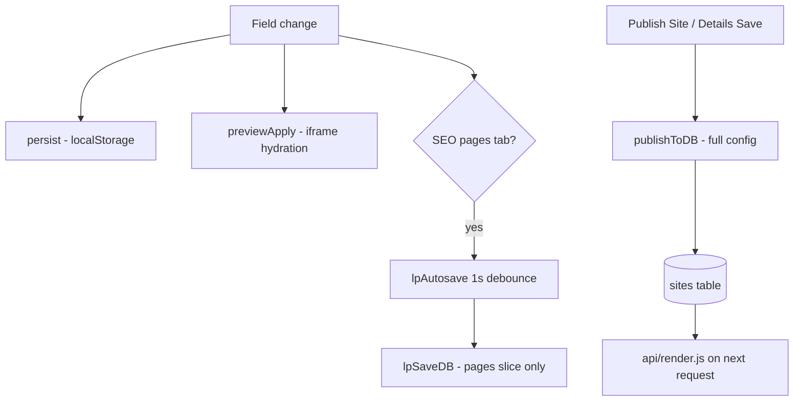
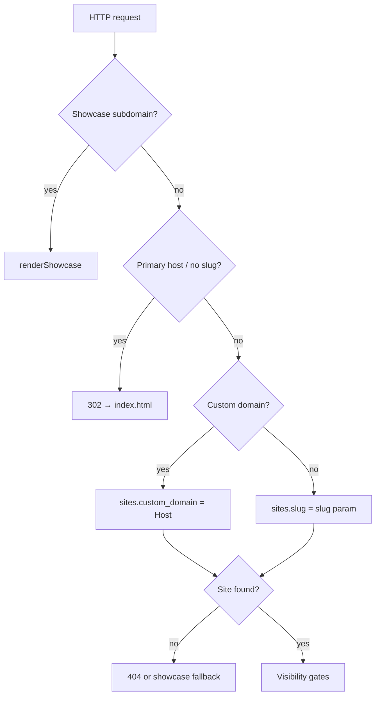
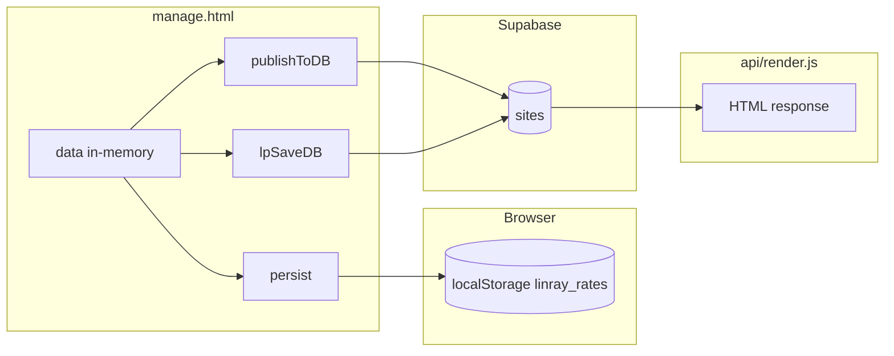
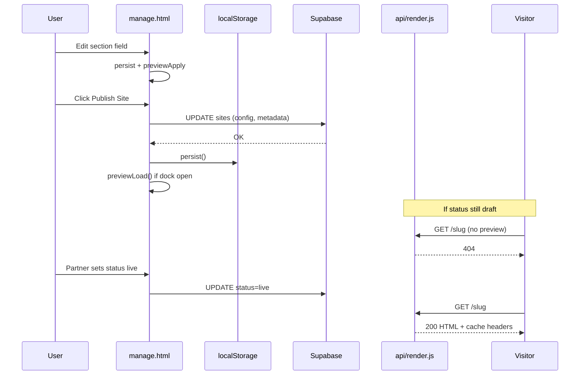
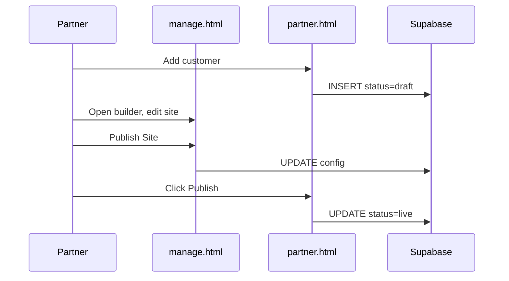
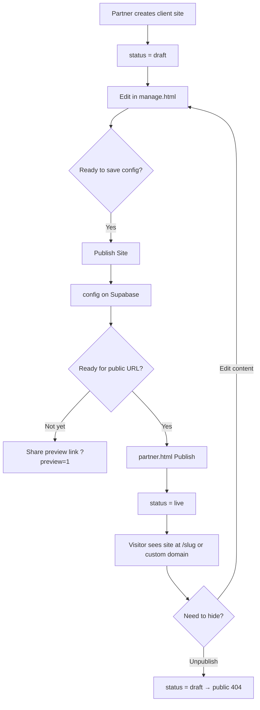
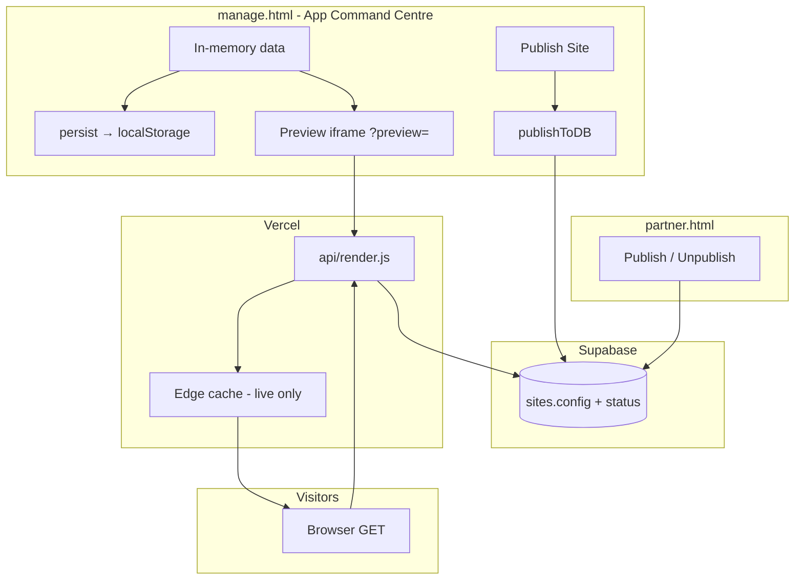
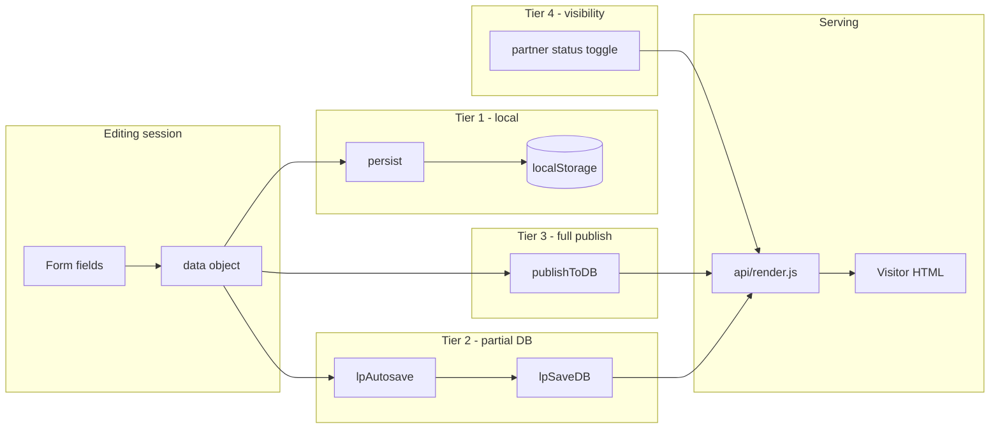
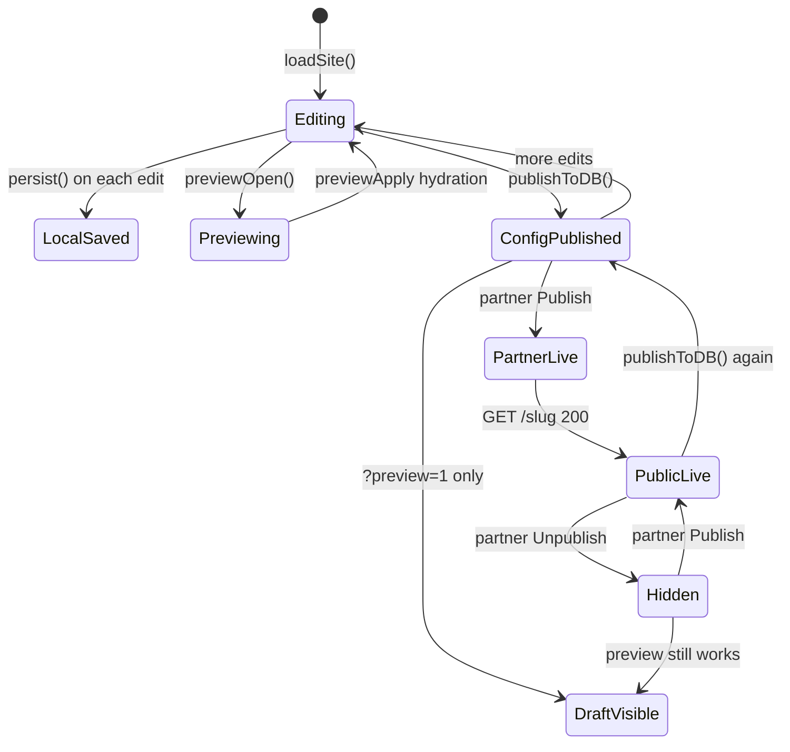

# LeadPages Publishing — Complete Engineering Manual

**Document:** `features/Publishing`  
**Status:** Definitive engineering reference for config persistence, publish, go-live, and public rendering  
**Audience:** Engineers rebuilding, extending, or debugging publish flows; AI development agents  
**Prerequisites:** [00-VISION](../00-VISION.md), [01-ARCHITECTURE](../01-ARCHITECTURE.md), [04-SITE-BUILDER](../04-SITE-BUILDER.md), [03-TEMPLATE-SYSTEM](../03-TEMPLATE-SYSTEM.md), [05-PARTNERS](../05-PARTNERS.md), [10-EDITOR](../10-EDITOR.md)

> **Scope note:** This document covers the **end-to-end path from editor edits to visitor HTML** — `persist`, `publishToDB`, `siteConfigForSave`, partner `sites.status` (`live` / `draft`), and `api/render.js`. It does **not** cover email campaigns, billing checkout, or domain DNS propagation (see linked docs).

---

## Executive Summary

LeadPages separates **two concepts** that operators often conflate:

| Concept | Mechanism | What changes |
|---------|-----------|--------------|
| **Publish (config)** | `publishToDB()` in `manage.html` | Writes `sites.config` (+ metadata) to Supabase |
| **Go live (visibility)** | Partner **Publish** in `partner.html` | Sets `sites.status` to `live` or `draft` |

A site can have fresh config in the database but still return **404** to the public if `status !== 'live'`. The builder preview bypasses that gate via `?preview=1`, using the same `api/render.js` handler as production.

Implementation is **client-side publish** (Supabase JS from `manage.html`) plus **server-side render** (`api/render.js` with service role). There is no dedicated “publish API” route.

| Fact | Detail |
|------|--------|
| **Primary publish fn** | `publishToDB()` (~4047 in `manage.html`) |
| **Broker config sanitizer** | `siteConfigForSave()` (~4041) |
| **Local crash backup** | `persist()` → `localStorage` key `linray_rates` |
| **SEO pages autosave** | `lpSaveDB()` — `config.pages` only, 1s debounce |
| **Public renderer** | `api/render.js` — slug, custom domain, showcase |
| **Preview bypass** | `?preview=1` on any tenant URL |
| **Status column** | `sites.status`: `live` \| `draft` (and legacy `active`) |
| **Command bar** | `#btn-publish` wired by `ensureSiteBar()` |

---

## Purpose

### Product purpose

Site owners and partners need confidence that:

1. **Edits are safe** — work-in-progress does not leak to Google or customers mid-edit.
2. **Publish is intentional** — pushing content to the database is a deliberate action (command bar **Publish Site** or Details **Save**).
3. **Go-live is controlled** — partners decide when a paying client’s URL is publicly reachable.
4. **Preview matches production** — what you see in the iframe is what `api/render.js` serves, modulo hydration timing.

### Engineering purpose

- **Tiered persistence** — localStorage for resilience, optional partial DB writes for SEO pages, full publish for authoritative config.
- **Template-specific payloads** — broker calculator strips rate tables; trade sites send raw `data` plus top-level site columns.
- **Single render pipeline** — one serverless function resolves tenant, applies visibility gates, injects config into templates.
- **CDN-friendly live responses** — cache headers only when `status === 'live'`.

---

## Business Purpose

| Stakeholder | Value |
|-------------|-------|
| **Partner** | Draft client sites during build; flip to live at handover; unpublish if billing lapses |
| **Site owner (tradie)** | Publish button pushes their page content; partner controls public URL |
| **Super-admin** | Creates sites as `live` immediately; can set `owner_email` on publish |
| **LeadPages (platform)** | Clear separation reduces accidental SEO indexing of half-built mockups |
| **Visitor** | Only sees `live` sites (or password-gated demos); suspended billing → 503 |

The two-step model supports the partner workflow: **build in draft → publish config in builder → partner Publish → client site indexed and shareable**.

---

## User Types

| User | Publish config? | Toggle `sites.status`? | Typical flow |
|------|-----------------|------------------------|--------------|
| **Super-admin** | Yes — `publishToDB()` | Implicit on create (`status: 'live'`) | Create site → edit → Publish Site |
| **Broker / partner editor** | Yes — same builder | Yes — `partner.html` Publish / Unpublish | Add customer (draft) → builder → Publish Site → partner Publish |
| **Site owner** | Yes if editor access | No — partner controls | Edit in builder → Publish Site; partner goes live |
| **Public visitor** | — | — | Hits `api/render.js`; 404 if draft |

**Not in scope:** `partner-dashboard.html` lists sites but does not toggle status — use `partner.html` **Clients** panel.

---

## Permissions

| Layer | Mechanism |
|-------|-----------|
| **`publishToDB()`** | Requires authenticated Supabase session; `sb.from('sites').update(...).eq('id', currentSiteId)` — subject to RLS |
| **`owner_email` in payload** | Only when `currentRole === 'super'` |
| **Partner status toggle** | `partner.html` — only sites where `servicing_partner_id === state.partner.id` |
| **`api/render.js`** | Service role read — no JWT; visibility enforced in function logic |
| **Preview** | No auth — `?preview=1` serves draft config to anyone with the URL |
| **Demo password** | `sites.preview_password` — cookie gate before HTML |

Partners cannot publish another partner’s serviced site to `live` from `partner.html` (action buttons hidden when `!mine`).

---

## Persistence Architecture

Three tiers plus export helpers. Every edit also drives the **preview iframe** via `previewApply()` (instant hydration) without waiting for DB.

```text
┌─────────────────────────────────────────────────────────────────┐
│  FIELD EDIT (manage.html)                                       │
│    persist() ──────────► localStorage ('linray_rates')          │
│    previewApply() ─────► iframe __applyTradeConfig / appearance │
├─────────────────────────────────────────────────────────────────┤
│  SEO PAGES TAB ONLY                                             │
│    lpAutosave (1s) ────► lpSaveDB() ──► sites.config.pages      │
├─────────────────────────────────────────────────────────────────┤
│  EXPLICIT PUBLISH                                               │
│    publishToDB() ──────► full sites row update (see payloads)   │
└─────────────────────────────────────────────────────────────────┘
```



---

## `persist()`

**Location:** `manage.html` ~1214  
**Storage key:** `linray_rates`  
**Payload:** Full in-memory `data` object (JSON.stringify)

```javascript
function persist(){
  try{ localStorage.setItem('linray_rates', JSON.stringify(data)); }catch(e){}
}
```

| Property | Detail |
|----------|--------|
| **When** | Called on virtually every editor input — sections, appearance, SEO fields, calculators, contact brokers, etc. |
| **Scope** | Entire `data` graph for the loaded site |
| **Survives refresh?** | Yes, in same browser — but **authoritative source is Supabase** after `loadSite()` |
| **Public exposure** | Never sent to visitors — browser-local only |
| **Failure mode** | Silent catch — quota exceeded does not block editing |

`persist()` does **not** write to Supabase. It is a **crash-recovery and export convenience** layer inherited from the standalone calculator editor.

**Related helpers (broker-app export only):**

| Function | Purpose |
|----------|---------|
| `liveConfig()` | Clone `data`, delete `users` (demo accounts) |
| `liveOut()` | Pretty JSON for download/copy/snippet |
| `jsonOut()` | Full `data` including users — admin export |

---

## `siteConfigForSave()`

**Location:** `manage.html` ~4041  
**Used by:** `publishToDB()` when `currentSiteTemplate === 'broker-app'`

```javascript
function siteConfigForSave(){
  const c = liveConfig();   // strips demo users
  delete c.states;          // sites inherit master rates unless explicitly overriding
  delete c.savedThemes;     // editor-only UI state
  return c;
}
```

| Stripped key | Reason |
|--------------|--------|
| `users` | Demo sign-in accounts with plaintext passwords — via `liveConfig()` |
| `states` | Rate tables belong in platform master config, not per-site copies |
| `savedThemes` | Editor UI cache for Appearance tab — not rendered on public site |

**Trade / broker-leads templates do not call `siteConfigForSave()`.** Their publish path sends nearly full `data` (minus `savedThemes` only).

---

## `publishToDB()`

**Location:** `manage.html` ~4047  
**Triggers:**

| UI | Handler |
|----|---------|
| Command bar **Publish Site** | `#btn-publish` click — inserted by `ensureSiteBar()` |
| Details tab **Save** | `#d-save` click — `await publishToDB()` |
| (Indirect) | SEO **Save** uses `lpSaveDB()`, not full publish |

### Guard and UX

1. If `!currentSiteId` → toast *"No site loaded to publish."* and return.
2. Disable `#btn-publish`, label **Publishing…**
3. Build `payload`, `sb.from('sites').update(payload).eq('id', currentSiteId)`
4. Re-enable button, restore label **Publish Site**
5. On success: `persist()`, sync `allSites[]` cache, optionally `previewLoad()` if preview dock open (trade/non-broker-app), toast **"Published — live on your site"**

⚠️ The success toast says **"live on your site"** even when `sites.status === 'draft'`. That message refers to config being on the server, not public visibility. See Technical Debt.

### Payload by template

**broker-app:**

```javascript
{
  config: siteConfigForSave(),
  updated_at: new Date().toISOString()
}
```

**trade / broker-leads / agency (partner home):**

```javascript
{
  config: lc,  // JSON clone of data, savedThemes deleted
  business_name: currentBusinessName.trim(),
  custom_domain: normalizedHostOrNull,
  updated_at: new Date().toISOString(),
  owner_email: ...  // super-admin only
}
```

**`custom_domain` normalization:**

```javascript
((currentCustomDomain||'').trim().toLowerCase()
  .replace(/^https?:\/\//,'')
  .replace(/\/.*$/,'')
  .replace(/^www\./,'') || null)
```

### What `publishToDB()` does **not** do

| Field / behaviour | Notes |
|-------------------|-------|
| `sites.status` | Unchanged — draft stays draft |
| `sites.slug` | Use partner **Change URL** or super create flow |
| `billing_status` | Billing APIs only |
| Marketplace `site_apps` | Separate reconcile via `/api/api-site-apps` |
| Sub-page `pages[].status` | Editor sets per-page draft/published; render respects `published` only |

### Post-publish cache sync

```javascript
var sref = allSites.find(x => x.id === currentSiteId);
if (sref) {
  if (payload.business_name) sref.business_name = payload.business_name;
  sref.custom_domain = payload.custom_domain;
  if (payload.owner_email !== undefined) sref.owner_email = payload.owner_email;
  sref.config = payload.config;
}
```

---

## `lpSaveDB()` — Partial Autosave

**Location:** `manage.html` ~1215  
**Scope:** `config.pages` array only (SEO landing pages tab)

Unlike `publishToDB()`, `lpSaveDB()` **merges** pages into the existing DB config rather than replacing the whole document:

1. Start from `allSites[].config` if present, else clone `data` (minus `savedThemes`, `users`)
2. Overwrite `cfg.pages` from in-memory `data.pages`
3. `UPDATE sites SET config = cfg`

Debounced via `lpAutosave()` — 1000 ms after last keystroke in SEO editor.

| Action | Function |
|--------|----------|
| New SEO page | `persist()` + `lpSaveDB()` |
| Image upload on page | `persist()` + `lpSaveDB()` |
| **Publish Site** | `publishToDB()` — full config including pages |

Partners editing only main landing sections may never hit `lpSaveDB()` unless they use the **Landing / SEO** tab.

---

## Partner Status: `live` vs `draft`

**Location:** `partner.html` — Clients panel (~590–790)

Partner-created sites start **`draft`**:

| Creation path | Initial `status` |
|---------------|------------------|
| `POST /api/partner/add-customer` | `draft` |
| `POST /api/partner/add-mockup` | `draft` |
| `POST /api/partner/ensure-home` | `draft` |
| Super-admin `createSiteSubmit()` in `manage.html` | `live` |

### UI

| Badge | Condition |
|-------|-----------|
| **Live** (`s-active`) | `c.status === 'live'` |
| **Draft** (`s-pending`) | anything else |

| Button | Effect |
|--------|--------|
| **Publish** (`data-pub`) | `UPDATE sites SET status = 'live'` |
| **Unpublish** (`data-unpub`) | `UPDATE sites SET status = 'draft'` |
| **Preview** (draft only) | Opens `/{slug}?preview=1` |
| **View site** (live) | Opens `/s/{slug}` |

```javascript
var ns = pub ? 'live' : 'draft';
await sb.from('sites').update({ status: ns, updated_at: ... }).eq('id', id);
```

### Two-step go-live checklist

```text
Step 1 — Builder:  Publish Site  →  sites.config updated
Step 2 — Partner:   Publish        →  sites.status = 'live'
```

Either step alone is insufficient for a **new** partner client:

- **Config only, still draft** → preview works; public URL 404
- **Live status, stale config** → old content served until builder publish

Super-admin sites skip step 2 at creation (`status: 'live'` on insert).

---

## Preview System

Preview and production share **`api/render.js`**. The editor iframe loads:

```javascript
fr.src = '/' + lpPrevSlug + '?preview=' + Date.now();
```

(`previewLoad()` ~1365)

| Mode | URL pattern | `isLive` in render | Public cache |
|------|-------------|-------------------|--------------|
| **Builder preview** | `/{slug}?preview=1` | `false` for cache headers | `no-store`, `X-Robots-Tag: noindex` |
| **Production (live)** | `/{slug}` or custom domain | `true` | `public, s-maxage=900, stale-while-revalidate=3600` (+ cache tags; purged on Publish) |
| **Draft without preview** | `/{slug}` | — | **404 Not found** |

**Instant edits:** After iframe load, `previewApply()` calls `__applyTradeConfig(data)` or `__applyAppearance()` without re-fetching HTML — faster than publish for WYSIWYG.

**After full publish (trade):** If `#lp-prev-dock` is open, `publishToDB()` calls `previewLoad()` to reload iframe from server (ensures server-injected config matches DB).

---

## `api/render.js` — Public Rendering

**File:** `api/render.js`  
**Entry:** Vercel rewrites in `vercel.json`:

| Rewrite | Destination |
|---------|-------------|
| `/` (on custom domain) | `/api/render` |
| `/s/:slug` | `/api/render?slug=:slug` |
| `/:slug` | `/api/render?slug=:slug` |
| `/:slug/:page` | `/api/render?slug=:slug&page=:page` |

Primary marketing hosts (`PRIMARY_HOSTS`) redirect `/` to `/home.html` — never tenant HTML.

### Resolution order



### Visibility gates (in order)

| Gate | Code behaviour | If failed |
|------|----------------|-----------|
| **`sites.status`** | `isLive = site.status === 'live'` | 404 unless `?preview=1` |
| **`preview_password`** | SHA1 cookie `lp_pw_{slug}` | Password form HTML |
| **`billing_status`** | `suspended` / `flagged_deletion` on live site | 503 suspended page |
| **`config.pages[].status`** | Sub-route requires `status === 'published'` | 404 for unknown slug |
| **Partner showcase** | `partners.status` suspended/terminated | 404 |

Core gate (~567–572):

```javascript
const isPreview = !!(req.query && req.query.preview);
const isLive = site.status === 'live';
if (!isLive && !isPreview) return notFound(res);
```

Legacy: landing grid treats `active` like live (`_lplStatus` in `manage.html`).

### `sendHtml()` — caching policy

```javascript
function sendHtml(res, html, isLive, cacheMeta) {
  if (isLive) {
    res.setHeader('cache-control', 'public, s-maxage=900, stale-while-revalidate=3600');
    // + Vercel-Cache-Tag: lp-site-{slug}, lp-siteid-{id}
  } else {
    res.setHeader('cache-control', 'no-store');
    res.setHeader('X-Robots-Tag', 'noindex, nofollow');
  }
}
```

Draft previews are never CDN-indexed. Live pages get a 15-minute edge cache with stale revalidation; **Publish** invalidates `lp-site-*` tags via `/api/purge-site-cache` so updates are not stuck waiting for TTL.

### Config injection

**Token templates (`trade`, `broker-leads`):**

```javascript
const cfg = Object.assign(
  { business: site.business_name, slug: site.slug, siteId: site.id },
  site.config || {}
);
html = tpl.replaceAll('__SITE_CONFIG__', safeJson(cfg));
// + {{businessName}}, {{phone}}, {{pageTitle}}, etc.
```

**broker-app:** `__BROKERAPP_CONFIG__` + optional demo theme bar.

**Partner home (`is_partner_home`):** `buildAgencyHtml()` — not token template.

Template selection: `templateFor(site)` — prefers `sites.template`, falls back `vertical === 'trade' ? 'trade' : 'broker-leads'`.

### Sub-page routing

When `?page=` or `/:slug/:page` path is set:

```javascript
_pageRow = _pages.find(p => p && p.slug === page && p.status === 'published');
if (!_pageRow) return notFound(res);
```

SEO title/description overridden from page row (`title`, `meta`).

---

## Publish vs Go-Live Matrix

| `sites.status` | Config published? | Public `/{slug}` | `/{slug}?preview=1` | Google indexing |
|----------------|--------------------|------------------|---------------------|-----------------|
| `draft` | Yes | 404 | Renders (noindex) | Blocked on preview |
| `draft` | No (local only) | 404 | Stale DB or 404 | — |
| `live` | Yes | Renders (cached) | Renders (noindex) | Allowed on live URL |
| `live` | No | Serves **old** config | Serves old + hydration in builder only | Old content |

---

## Command Bar Integration

`ensureSiteBar()` (~4066) injects publish controls when a DB-backed site is loaded:

| Element | ID | Action |
|---------|-----|--------|
| **Publish Site** | `#btn-publish` | `publishToDB` |
| **View Live Site ↗** | `#btn-viewlive` | `window.open(lpLiveUrl())` |
| **Domains** | `#btn-domains` | `manage-domains.html` |
| **Billing** | `#btn-billing` | Billing overlay |
| **Settings** | `#btn-settings` | Super-admin settings page |

`lpLiveUrl()` (~3316):

```javascript
// custom_domain wins; else https://leadpages.com.au/{slug}
```

View Live opens the **public URL** — will 404 if site is still `draft` (unless user manually adds `?preview=1`).

Trade template shows `#lp-cmd` command bar; broker-app hides it and uses calculator export buttons instead.

---

## Data Sources



| Source | Table / store | Fields written on publish |
|--------|---------------|---------------------------|
| Full publish | `sites` | `config`, `business_name`, `custom_domain`, `owner_email`, `updated_at` |
| SEO autosave | `sites` | `config` (pages slice merged) |
| Status toggle | `sites` | `status`, `updated_at` |
| Local only | `localStorage` | Full `data` snapshot |

---

## API Calls

| Endpoint / call | Method | Called by | Notes |
|-----------------|--------|-----------|-------|
| Supabase `sites` UPDATE | — | `publishToDB`, `lpSaveDB`, `partner.html` status | Client JWT + RLS |
| `GET /api/render` (rewrite) | GET | Browser, iframe, visitors | Service role inside handler |
| `POST /api/partner/add-customer` | POST | `partner.html` | Creates `status: 'draft'` |
| `GET /api/billing/status` | GET | `lpBillingGate` | Blocks editor, not render directly |

There is **no** `POST /api/publish` — publish is direct Supabase from the browser.

---

## Database Tables

| Table | Publishing usage |
|-------|------------------|
| **`sites`** | `id`, `slug`, `business_name`, `custom_domain`, `owner_email`, `config` JSONB, `status`, `template`, `updated_at`, `preview_password`, `billing_status`, partner FKs |
| **`site_backups`** | Manual snapshots — restore replaces `config` (separate from publish flow) |
| **`partners`** | `status` gates showcase render |
| **`system_pages`** | Suspended page copy when billing blocks live site |
| **`demo_themes`** | Injected into broker-app demo render only |

### `sites.status` values

| Value | Meaning |
|-------|---------|
| `live` | Public render allowed (subject to billing/password gates) |
| `draft` | Hidden from public; preview OK |
| `active` | Legacy alias — treated as live in some UI badges |

### `config.pages[].status` (SEO sub-pages)

| Value | Render on `/{slug}/{page}` |
|-------|----------------------------|
| `published` | Yes (when site is live) |
| `draft` | No — hard 404 |

Distinct from `sites.status` — controls **individual landing pages** inside a live site.

---

## Related Files

| File | Relationship |
|------|--------------|
| **`manage.html`** | `persist`, `siteConfigForSave`, `publishToDB`, `lpSaveDB`, preview |
| **`api/render.js`** | Public HTML, visibility gates, caching |
| **`partner.html`** | Partner Publish / Unpublish (`sites.status`) |
| **`api/partner/add-customer.js`** | Creates draft client sites |
| **`api/partner/add-mockup.js`** | Creates draft mockups |
| **`vercel.json`** | Rewrites to `/api/render` |
| **`trade.template.json`**, **`broker.template.json`**, **`brokerapp.template.json`** | Injected by render |
| **`docs/04-SITE-BUILDER.md`** | Persistence tiers summary |
| **`docs/03-TEMPLATE-SYSTEM.md`** | Template tokens, preview vs production |
| **`docs/05-PARTNERS.md`** | Partner economics, buy-site → live |
| **`docs/06-DOMAINS.md`** | `custom_domain` routing in render |
| **`api/manage.html`** | Legacy duplicate — same publish functions |

---

## Functions Reference

### Core publish chain

| Function | Lines (approx.) | Role |
|----------|-----------------|------|
| `persist()` | ~1214 | localStorage backup |
| `liveConfig()` | ~1221 | Strip `users` for public-safe export |
| `siteConfigForSave()` | ~4041 | Broker publish sanitizer |
| `publishToDB()` | ~4047 | Full Supabase publish |
| `lpSaveDB()` | ~1215 | SEO pages partial save |
| `lpAutosave()` | ~1216 | 1s debounce → `lpSaveDB` |

### Preview chain

| Function | Role |
|----------|------|
| `previewLoad()` | iframe `?preview=` reload |
| `previewApply()` | Client hydration without reload |
| `previewOpen()` / `previewClose()` | Dock UI |
| `lpLiveUrl()` | Public URL for View Live button |

### Render (server)

| Function | Role |
|----------|------|
| `module.exports` handler | Main request router |
| `sendHtml()` | Cache + robots headers |
| `templateFor()` | Resolve template id |
| `buildTradeHtml()` / token path | Trade + broker-leads HTML |
| `buildAgencyHtml()` | Partner home |
| `notFound()` / `suspendedPage()` | Error surfaces |

### Partner status

| Location | Role |
|----------|------|
| `clientCard()` | Draft/live badges |
| Click handler `[data-pub]` / `[data-unpub]` | Status UPDATE |

---

## Event Flow

### Full publish (trade site)



### Partner handover



---

## User Journey



**Super-admin shortcut:** Create site (`status: live`) → edit → Publish Site → immediately public (assuming billing OK).

---

## Performance Considerations

| Area | Behaviour | Risk |
|------|-----------|------|
| **`persist()` frequency** | Every keystroke | localStorage write churn — negligible at current size |
| **Full publish** | Entire `config` JSONB | Large trade configs (~100KB+) — acceptable for manual action |
| **Live CDN cache** | 30 s `s-maxage` | Published changes may lag up to ~30 s on edge; preview always fresh |
| **`previewApply`** | No network | Fast; can drift from server until `previewLoad()` after publish |
| **Render cold start** | Loads all template JSON | See [03-TEMPLATE-SYSTEM](../03-TEMPLATE-SYSTEM.md) |

**Recommendations (future):** PATCH diffs for large configs; invalidate CDN on publish; optimistic UI for publish button.

---

## Security Considerations

| Topic | Detail |
|-------|--------|
| **RLS on publish** | Users can only update sites they own or partner-manage |
| **Preview URL secrecy** | `?preview=1` exposes draft content to anyone with link — treat as unlisted |
| **`preview_password`** | Per-demo SHA1 cookie — not high security; deters casual browsing |
| **Service role in render** | Never exposed to client — serverless only |
| **`safeJson()`** | Prevents `</script>` breakout in injected config |
| **Demo `users` strip** | `siteConfigForSave` / `liveConfig` prevent password leak in broker config |
| **No publish API** | Cannot bypass RLS via custom endpoint — direct Supabase only |

Draft sites are **security through obscurity** (404 on clean URL), not encryption. Partners should use `preview_password` on sensitive mockups.

---

## Technical Debt

| ID | Issue | Location | Impact |
|----|-------|----------|--------|
| TD-P1 | **Toast says "live" on config publish** | `publishToDB` toast | Partners think site is public when still draft |
| TD-P2 | **Publish vs status split** | Two UIs, two concepts | Missed go-live step; support tickets |
| TD-P3 | **`active` vs `live` status** | `_lplStatus`, render uses `live` only | Inconsistent badges if legacy rows |
| TD-P4 | **CDN purge depends on Vercel env** | `/api/purge-site-cache` | Without `VERCEL_TOKEN` + `VERCEL_PROJECT_ID`, live HTML waits up to s-maxage (15 min) after publish |
| TD-P5 | **`lpSaveDB` merge vs full publish** | SEO tab | Rare race if concurrent editors |
| TD-P6 | **`api/manage.html` drift** | Duplicate file | Wrong docs if wrong file deployed |
| TD-P7 | **View Live ignores draft** | `lpLiveUrl()` no preview param | Button 404s on draft sites |
| TD-P8 | **Super create always live** | `createSiteSubmit` | Accidental public index if empty site |

Tracked in [13-ROADMAP](../13-ROADMAP.md) and [04-SITE-BUILDER](../04-SITE-BUILDER.md) § Technical Debt.

---

## Future Improvements

1. **Unified go-live** — Single "Publish & go live" for partners, or status toggle in builder.
2. **Honest toasts** — "Config saved" vs "Site is now public".
3. **CDN invalidation** — Purge edge on `publishToDB` success for live sites.
4. **Draft-aware View Live** — Open preview URL when `status !== 'live'`.
5. **Publish API** — Server-side validation + audit log (optional).
6. **Diff publish** — Send changed keys only for large trade configs.
7. **Scheduled publish** — Partner sets go-live datetime.
8. **Status in Dashboard header** — Show draft/live badge next to Active (see [Dashboard](Dashboard.md)).
9. **Integration test** — create draft → publish config → partner live → assert render 200.
10. **Deprecate `vertical`** — Single `template` column everywhere.

---

## Publishing Architecture



---

## Connections to Other Systems

### Site builder

[04-SITE-BUILDER](../04-SITE-BUILDER.md) documents creation, trade packs, and persistence tiers. Publishing is step 4–5 of the builder lifecycle summary.

### Template system

[03-TEMPLATE-SYSTEM](../03-TEMPLATE-SYSTEM.md) — `__SITE_CONFIG__` injection, hydration functions, preview vs production parity.

### Partners

[05-PARTNERS](../05-PARTNERS.md) — `add-customer` creates drafts; buy-site flips mockup to owned live site; commission on go-live.

### Domains

[06-DOMAINS](../06-DOMAINS.md) — `custom_domain` on publish updates routing in `api/render.js` (Host header lookup).

### SEO

[08-SEO](../08-SEO.md) — `config.pages` publish states; suburb App Router is **separate** from `api/render.js` sub-pages.

### Editor

[10-EDITOR](../10-EDITOR.md) — Full `manage.html` function index; command bar and Details save wiring.

### Dashboard

[Dashboard](Dashboard.md) — "View live ↗" in trade Dashboard header uses custom domain; does not reflect `sites.status` today (TD-P8 / TD-D9 overlap).

---

## Data Flow



---

## User Flow



---

## Glossary

| Term | Meaning |
|------|---------|
| **Publish (config)** | `publishToDB()` — write content to `sites.config` |
| **Go live** | `sites.status = 'live'` — public URL serves HTML |
| **Preview mode** | `?preview=1` query — bypasses status gate, noindex |
| **Persist** | `persist()` — localStorage only, not Supabase |
| **siteConfigForSave** | Broker-app sanitizer before publish |
| **Token template** | `trade` / `broker-leads` — server injects `__SITE_CONFIG__` |
| **Hard 404** | Render returns 404 for unknown or unpublished paths — no soft fallback |

---

*Last updated: July 2026 — reflects `manage.html`, `partner.html`, and `api/render.js` on branch `main`.*
