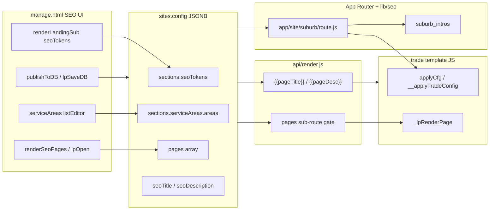
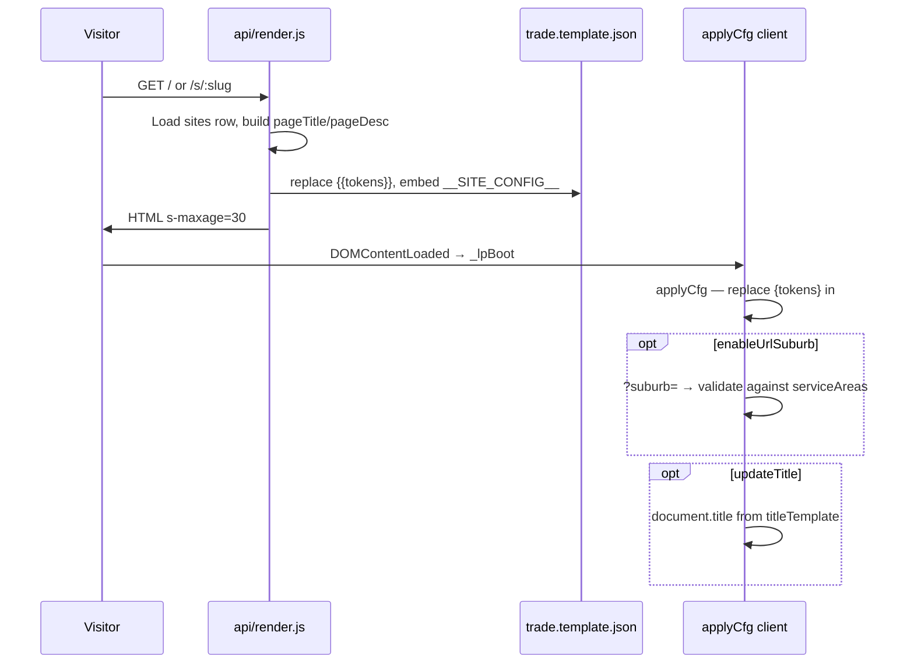
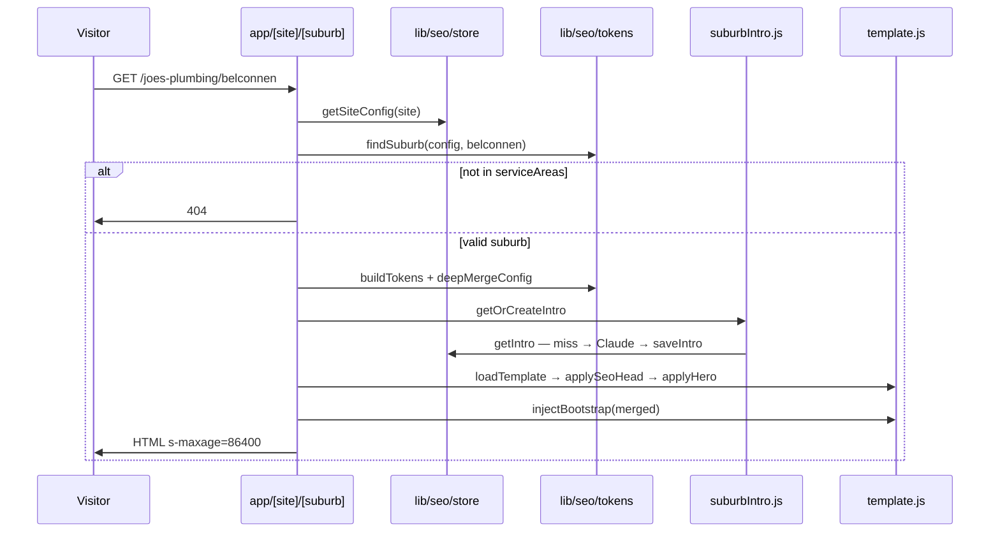
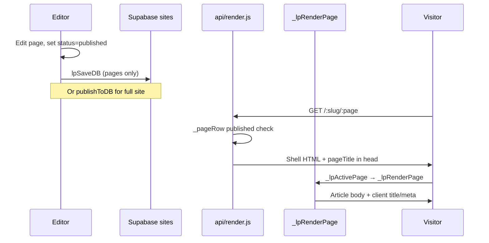
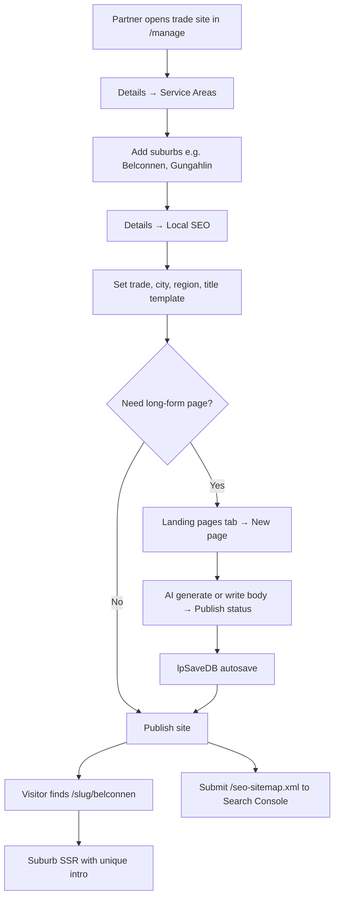
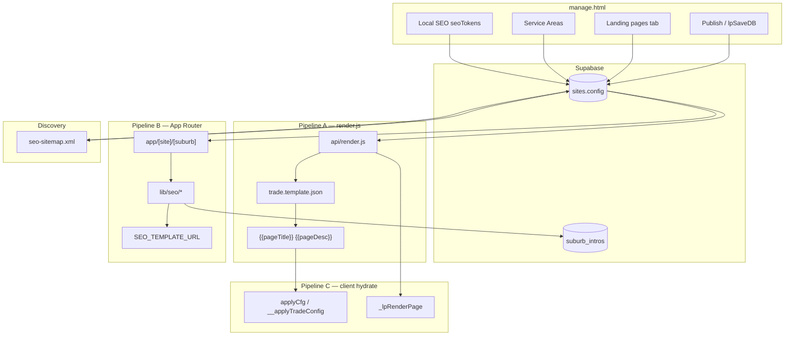
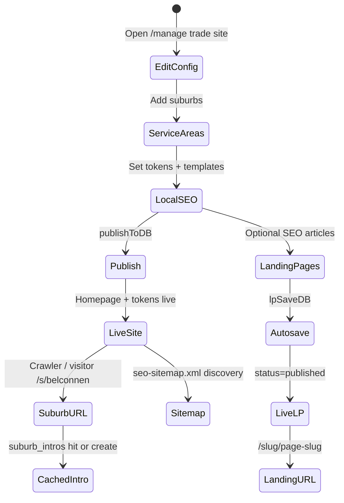

# LeadPages SEO — Complete Engineering Manual

**Document:** `features/SEO`  
**Status:** Definitive engineering reference for titles, meta, suburb pages, landing pages, and sitemaps  
**Audience:** Engineers rebuilding, extending, or debugging SEO rendering; AI development agents  
**Prerequisites:** [00-VISION](../00-VISION.md), [01-ARCHITECTURE](../01-ARCHITECTURE.md), [03-TEMPLATE-SYSTEM](../03-TEMPLATE-SYSTEM.md), [08-SEO](../08-SEO.md), [10-EDITOR](../10-EDITOR.md)  
**AI status:** Suburb intros still direct Anthropic; landing drafts via Brain — [AI/00-STATUS](../AI/00-STATUS.md)

> **Scope note:** This document covers **tenant SEO surfaces** — `api/render.js` double-brace tokens, `config.pages` landing pages, `sections.seoTokens` local SEO, App Router suburb routes (`app/[site]/[suburb]`), and the live-tenant sitemap index (`/seo-sitemap.xml` → `api/seo-sitemap.xml.js`). Marketing host SEO (`home.html`, canonical injection via `api/marketing-html.js`, `/marketing-sitemap.xml`) is summarised where it touches Search Console discovery.

> **Search Intelligence / SEO Command Centre** (research → publish → attribute leads) is specified in [search-intelligence/00-VISION.md](../search-intelligence/00-VISION.md). Keep this manual as the publish-pipeline reference; do not conflate Command Centre warehouse tables (`si_*`) with renderer config.

---

## Executive Summary

LeadPages is **strongly SEO-focused**. Two parallel server pipelines plus one client hydration layer serve crawlers and visitors:

| SEO surface | Pipeline | Cache |
|-------------|----------|-------|
| Tenant homepage | `api/render.js` + `{{pageTitle}}` / `{{pageDesc}}` | 30s CDN (`s-maxage=30`) |
| Suburb pages | `app/[site]/[suburb]/route.js` + `lib/seo/*` | 24h CDN (`s-maxage=86400`) |
| Landing pages (`config.pages`) | `api/render.js` sub-page routing + client `_lpRenderPage` | 30s CDN (HTML shell); title/meta updated client-side |
| Dynamic sitemap | `api/seo-sitemap.xml.js` (rewrite `/seo-sitemap.xml`; App Router mirror kept in `app/`) | 1h CDN |

| Fact | Detail |
|------|--------|
| **Double-brace tokens** | `{{pageTitle}}`, `{{pageDesc}}`, `{{businessName}}`, `{{domain}}` — server-side in `render.js` / template `<head>` |
| **Single-brace tokens** | `{suburb}`, `{trade}`, `{business}`, … — `sections.seoTokens`, `lib/seo/tokens.js`, client `applyCfg` |
| **Suburb gate** | Only suburbs in `sections.serviceAreas.areas` get App Router pages |
| **AI suburb intros** | Cached in `suburb_intros` — one Anthropic generation per `(site, suburb)` (**not yet** via Brain) |
| **AI landing drafts** | Editor → `POST /api/brain/landing-draft` (Brain; flag `BRAIN_LANDING_DRAFT`) — see [Pages](Pages.md) |
| **Landing page gate** | Hard 404 unless `config.pages[].status === 'published'` |
| **Editor — Local SEO** | Page editor subtab `seoTokens` in `#av-details` |
| **Editor — Landing pages** | `#av-landing` tab → `renderSeoPages()` |

### Non-negotiable rules

- Suburb pages **only** for suburbs in `sections.serviceAreas.areas`
- AI intros **cached** in `suburb_intros` — no repeat generation on every request
- No uncontrolled doorway pages — unknown suburb slug → 404
- Draft landing pages → hard 404 at `/{slug}/{page}`
- Keep `serviceAreas.areas` slugs and `pages[].slug` **disjoint** (routing collision risk)

---

## Purpose

### Product purpose

Local trades and service businesses depend on **Google visibility** for suburb-level and service-specific queries. LeadPages gives each tenant:

1. **Crawlable homepage meta** — title, description, canonical, Open Graph in raw HTML.
2. **Programmatic suburb pages** — one URL per service area with unique intro copy.
3. **Editor-controlled landing pages** — long-form SEO articles (services, suburbs, FAQs) without code deploys.
4. **Local token personalisation** — `{trade} in {suburb}` copy across sections; optional `?suburb=` for ad/GBP links.

### Engineering purpose

- **Dual pipeline** isolates fast token-template rendering (`render.js`) from heavier suburb SSR (App Router + AI).
- **Shared token vocabulary** (`lib/seo/tokens.js` mirrors client `applyCfg`) keeps suburb SSR and homepage hydration consistent.
- **Config-driven gates** — service areas and published pages prevent SEO spam patterns.
- **Separation of autosave vs publish** — landing page bodies autosave; trade section edits require explicit Publish.

---

## Business Purpose

| Stakeholder | Value |
|-------------|-------|
| **Site owner (tradie)** | Ranks for “plumber Belconnen” without hiring an SEO agency; landing pages for ad campaigns |
| **Partner / broker** | Differentiated product — local SEO + suburb pages included in hosted sites |
| **LeadPages (platform)** | SEO depth drives hosting retention; sitemap scales discovery across tenant base |
| **Search engines** | Unique intros + gated suburbs reduce thin/duplicate doorway risk |

SEO supports the business model: **hosted sites that capture leads from organic and paid traffic**.

---

## User Types

| User | SEO interaction | Typical journey |
|------|-----------------|-----------------|
| **Super-admin** | Full editor access | Configures service areas → verifies suburb URLs → submits sitemap in Search Console |
| **Broker / partner** | Client site editor | Sets Local SEO tokens; generates AI landing page copy; enables Service Areas section |
| **Site owner** | Trade editor (if granted) | Adds suburbs in Service Areas; writes or AI-generates landing pages |
| **Visitor / crawler** | Public URLs only | Lands on homepage, suburb page, or landing page; no auth |
| **Leads-only demo** (`leads` role) | **No** SEO editor | Calculator demo only |

**Not in scope:** Partners configuring SEO on `partner-dashboard.html` (portfolio grid, not per-page SEO).

---

## Permissions

| Layer | Mechanism |
|-------|-----------|
| **Editor access** | Supabase auth + site-scoped RLS on `sites` UPDATE |
| **Local SEO subtab** | Same as Page editor — `super` / `broker` on trade sites |
| **Landing pages tab** | `TEMPLATE_NAV.trade` and `broker-app` include `landing` |
| **Publish** | `publishToDB()` writes full `sites.config`; trade sections gated separately from `lpAutosave()` |
| **Public suburb routes** | No auth — service role reads `sites.config` + `suburb_intros` server-side |
| **`/api/render`** | No auth — service role reads `sites`; draft sites get `X-Robots-Tag: noindex` |
| **Sitemap** | Public GET — lists all sites × service areas (no live filter today) |

Super-admins can edit any site. Site owners see editor tabs allowed by role ∩ template.

---

## SEO Surfaces & Layout

### Pipeline map

```text
┌─────────────────────────────────────────────────────────────────────────┐
│  HOMEPAGE  https://{host}/  or  https://{slug}.leadpages.com.au/        │
│  Pipeline: api/render.js → trade.template.json                          │
│  Head: {{pageTitle}}, {{pageDesc}}, canonical https://{{domain}}/       │
│  Body: applyCfg() replaces {tokens} in #top; optional ?suburb=          │
├─────────────────────────────────────────────────────────────────────────┤
│  SUBURB PAGE  https://{host}/{site}/{suburb-slug}                       │
│  Pipeline: app/[site]/[suburb]/route.js → lib/seo/*                     │
│  Head: SSR title/description/canonical/OG via applySeoHead()            │
│  Body: SSR hero H1 + AI intro; injectBootstrap → __applyTradeConfig       │
├─────────────────────────────────────────────────────────────────────────┤
│  LANDING PAGE  https://{host}/{slug}/{page-slug}                        │
│  Pipeline: api/render.js (?page=) → shell HTML + _lpRenderPage client   │
│  Head: server {{pageTitle}} from page row; client updates title/meta      │
│  Body: #top replaced with article layout (Markdown → HTML)                │
├─────────────────────────────────────────────────────────────────────────┤
│  SITEMAP  https://{platform}/seo-sitemap.xml                            │
│  Pipeline: api/seo-sitemap.xml.js → live /{slug}/sitemap.xml indexes    │
└─────────────────────────────────────────────────────────────────────────┘
```

### Editor layout (trade sites)

```text
manage.html
├── Details tab (#av-details)
│   └── Subtab: Local SEO (seoTokens)     ← trade, city, region, ?suburb=, title template
│   └── Subtab: Service Areas (serviceAreas) ← suburb list drives App Router + sitemap
│   └── Other subtabs use {tokens} in copy fields
├── Landing pages tab (#av-landing)       ← config.pages[] CRUD + AI generate
└── Publish command bar                   ← full config (except pages autosave separately)
```

---

## Navigation

### Editor tab integration

```javascript
const NAV = [
  ['details', 'av-details', renderDetails],   // includes seoTokens + serviceAreas subtabs
  ['landing', 'av-landing', renderSeoPages], // trade + broker-app
  // ...
];
const TRADE_SUBTABS = [
  // ...
  ['seoTokens', 'Local SEO'],
  ['serviceAreas', 'Service Areas'],
  // ...
];
```

- **Local SEO** lives under **Details → Local SEO** (`renderLandingSub` when `sub === 'seoTokens'`).
- **Service Areas** is a separate subtab but shares the same `sections.serviceAreas.areas` list used by suburb routes.
- **Landing pages** is its own top-level tab (`#nav-landing`).

### Public URL routing

| URL pattern | Handler | Notes |
|-------------|---------|-------|
| `/` (custom domain) | `vercel.json` → `/api/render` | Host lookup by `custom_domain` |
| `/s/:slug` | `/api/render?slug=:slug` | Platform subdomain path |
| `/:slug` | `/api/render?slug=:slug` | Tenant homepage on platform host |
| `/:slug/:page` | `/api/render?slug=:slug&page=:page` | Published landing page |
| `/:site/:suburb` | `app/[site]/[suburb]/route.js` | App Router — typically **precedence** over rewrite |
| `/seo-sitemap.xml` | `api/seo-sitemap.xml.js` | Dynamic live-tenant sitemap index |
| `/marketing-sitemap.xml` | `api/marketing-sitemap.xml.js` | Marketing pages for www.leadpages.com.au |

**Collision rule:** `/{site}/{segment}` matches both App Router (suburb) and `render.js` (landing page). If Belconnen ∈ service areas, `/joes-plumbing/belconnen` → suburb route. If `refinancing` ∈ published `pages`, `/joes-plumbing/refinancing` → render.js. **Keep slugs disjoint.**

---

## Widgets

| Widget | Container / file | Loader | Description |
|--------|------------------|--------|-------------|
| **Local SEO fields** | `#av-details` subtab | `renderLandingSub(c, 'seoTokens')` | Trade, suburb, city, region, checkboxes, title template |
| **Service Areas list** | `#av-details` subtab | `renderLandingSub(c, 'serviceAreas')` | Suburb names — gate for suburb pages + sitemap |
| **Landing page list** | `#lp-list` | `renderSeoPages()` | Title, slug, Live/Draft badge, Edit |
| **Landing page editor** | `#lp-editor` | `lpOpen(id)` | Title, meta, h1, body, image, CTAs, AI generate |
| **Preview iframe** | Editor preview | `previewApply()` → `__applyTradeConfig` | Live token replacement in trade template |
| **SSR suburb head** | Raw HTML | `applySeoHead()` | Title, meta, canonical, OG, robots |
| **SSR suburb hero** | `.hero` section | `applyHero()` | Localised H1 + cached intro paragraph |

---

## Statistics

LeadPages does not expose a dedicated SEO analytics dashboard. Related metrics elsewhere:

| Metric | Source | SEO relevance |
|--------|--------|---------------|
| **Visitors** | `ANA` / `/api/stats` `page_view` | Organic traffic proxy (Dashboard) |
| **Leads** | `leads` table | Conversion from SEO landing pages |
| **Indexed URLs** | External — Google Search Console | Submit `/seo-sitemap.xml` |
| **Suburb intro cache hits** | `suburb_intros` row count | One row per generated suburb |

There is no first-party tracking of which suburb URLs rank or get crawled.

---

## Quick Actions

| Action | Trigger | Handler |
|--------|---------|---------|
| **Save Local SEO fields** | Input in seoTokens subtab | `persist()` + `previewApply()` |
| **Enable ?suburb= token** | `#seo-url` checkbox | `se.enableUrlSuburb` → client `applyCfg` |
| **Update browser title** | `#seo-title` checkbox | `se.updateTitle` + `titleTemplate` |
| **Add suburb** | Service Areas list editor | `listEditor` → `sections.serviceAreas.areas` |
| **New landing page** | `#lp-new` | Push to `data.pages`, `lpSaveDB()` |
| **Autosave page fields** | Input in `#lp-editor` | `lpField` → `lpAutosave()` → `lpSaveDB()` (1s debounce) |
| **AI generate body** | `#lp-ai-go` | `aiGenerate()` → `/api/brain/landing-draft` → approve → `config.pages[].body` |
| **Publish site** | Command bar | `publishToDB()` — full config to Supabase |
| **Verify suburb URL** | Browser | `GET /{slug}/{suburb-slug}` — 404 if not in service areas |

---

## Recent Activity

SEO-specific “activity” is implicit:

### 1. Landing page edits

`lpAutosave()` updates `sites.config.pages` with `updated_at` on the site row when debounced save runs. No per-page audit trail.

### 2. Suburb intro generation

First request to a new suburb URL triggers Claude → `saveIntro()` → `suburb_intros.updated_at`. Subsequent requests read cache only.

### 3. Publish events

Trade section changes (including `seoTokens`, `serviceAreas`) reach live sites only after **Publish** (`publishToDB`). Landing page fields can reach live via autosave without a full publish.

---

## Site Selection

SEO editor state follows **`currentSiteId`** (same as Dashboard):

| Path | Function |
|------|----------|
| Account landing grid | `loadSite(site)` |
| Deep link | `/manage?site={slug}` |
| Command-bar dropdown | `ensureSiteBar()` |

On `loadSite()`:

1. `data` / `data.pages` loaded from `sites.config`
2. Preview iframe receives `__applyTradeConfig(data)`
3. Active tab re-renders (`renderDetails`, `renderSeoPages`, etc.)

Changing sites clears landing page editor (`lpCur`) if user switches mid-edit.

---

## Notifications

| Type | Mechanism | Relevance |
|------|-----------|-----------|
| **Toast** | `toast(msg)` | “Page saved”, AI generate success/fail, upload errors |
| **Meta length hint** | `#lp-meta-count` | Warns when meta description > 165 chars |
| **Draft vs Live badge** | `.lp-badge` on page list | Visual publish state |
| **404 on bad suburb** | HTTP 404 plain text | No user-facing editor notification |

No in-app SEO score, Search Console integration, or index status alerts.

---

## Data Sources



| Source | Table / endpoint | Fields used |
|--------|------------------|-------------|
| Site config | `sites.config` | `seoTitle`, `seoDescription`, `pages[]`, `sections.seoTokens`, `sections.serviceAreas` |
| Suburb intros | `suburb_intros` | `site`, `suburb`, `intro` |
| Trade template | `trade.template.json` or `SEO_TEMPLATE_URL` | `html` with `{{pageTitle}}`, hero markup |
| Sitemap | `listSites()` | All sites' slugs + service area names |
| AI generation | Anthropic API | Landing page body (editor); suburb intro (server) |

---

## API Calls

| Endpoint / call | Method | Called by | Purpose |
|-----------------|--------|-----------|---------|
| **`/api/render`** | GET | Public visitors | Homepage + landing pages; injects `{{pageTitle}}` |
| **`/api/render?slug=&page=`** | GET | Public | Sub-page; 404 if not published |
| **`app/[site]/[suburb]`** | GET | Public / crawlers | SSR suburb page |
| **`/seo-sitemap.xml`** | GET | Crawlers | Dynamic suburb URL list |
| **Supabase `sites` UPDATE** | PATCH | `lpSaveDB`, `publishToDB` | Persist `config.pages` or full config |
| **Supabase REST `suburb_intros`** | GET/POST | `lib/seo/store.js` | Read/write cached intros |
| **Anthropic `/v1/messages`** | POST | `suburbIntro.js` (legacy direct) | Suburb intro AI copy |
| **`POST /api/brain/landing-draft`** | POST | `aiGenerate` in editor | Landing draft via Brain |
| **`SEO_TEMPLATE_URL` fetch** | GET | `lib/seo/template.js` | Load HTML shell for suburb SSR |

Auth: editor writes require Supabase user JWT + RLS. Public SEO routes use service role server-side only.

---

## Database Tables

| Table | SEO usage |
|-------|-----------|
| **`sites`** | `slug`, `config` (JSONB), `status`, `custom_domain`, `business_name`, `template` |
| **`suburb_intros`** | PK `(site, suburb)` — cached AI intro text |
| **`leads`** | Indirect — landing pages drive form submissions (not SEO storage) |

### `sites.config` SEO fields

**Top-level:**

```json
{
  "seoTitle": "Optional override",
  "seoDescription": "Optional override",
  "trade": "Plumber",
  "pages": [{ "id": "uuid", "title": "", "slug": "", "meta": "", "h1": "", "body": "", "menu": "top", "status": "draft", "img": "" }]
}
```

**`sections.seoTokens`:**

```json
{
  "trade": "Plumber",
  "city": "Canberra",
  "region": "ACT",
  "suburb": "Canberra",
  "enableUrlSuburb": false,
  "updateTitle": false,
  "titleTemplate": "{trade} in {suburb} | {business}",
  "metaTemplate": "Optional — used by suburb route only"
}
```

**`sections.serviceAreas.areas`:**

```json
{
  "areas": [{ "name": "Belconnen", "on": true }]
}
```

### `suburb_intros` schema

See [db/suburb_intros.sql](../../db/suburb_intros.sql):

| Column | Purpose |
|--------|---------|
| `site` | Site slug |
| `suburb` | Canonical suburb name (not slug) |
| `intro` | Cached paragraph |
| `updated_at` | Last generation time |

RLS enabled, no public policies — service role only.

---

## Related Files

| File | Relationship |
|------|--------------|
| **`api/render.js`** | **Primary homepage + landing page renderer** — `{{pageTitle}}`, `config.pages` gate |
| **`trade.template.json`** | Token template `<head>` SEO block; `__SITE_CONFIG__` embed |
| **`marketplace/demos/demo-shared.js`** | Client `applyCfg`, seoTokens hydration, `_lpRenderPage`, `_lpActivePage` |
| **`app/[site]/[suburb]/route.js`** | Suburb SSR entry point |
| **`api/seo-sitemap.xml.js`** | Dynamic live-tenant sitemap index (App Router mirror in `app/`) |
| **`lib/seo/store.js`** | Supabase REST — `getSiteConfig`, `listSites`, intro CRUD |
| **`lib/seo/tokens.js`** | `findSuburb`, `buildTokens`, `mergeStr`, `deepMergeConfig`, `slugify` |
| **`lib/seo/suburbIntro.js`** | `getOrCreateIntro` — Claude + cache |
| **`lib/seo/template.js`** | `loadTemplate`, `applySeoHead`, `applyHero`, `injectBootstrap` |
| **`manage.html`** | Local SEO subtab, Service Areas, Landing pages tab, AI generate |
| **`vercel.json`** | Rewrites `/:slug/:page` → render; App Router routes coexist |
| **`robots.txt`** | Platform sitemap pointer (marketing host — point tenant domains at `/seo-sitemap.xml`) |
| **`docs/08-SEO.md`** | Canon summary — this doc expands with engineering detail |
| **`docs/02-DATABASE.md`** | Config shape, `suburb_intros` |
| **`docs/10-EDITOR.md`** | Editor tabs, autosave vs publish |
| **`api/manage.html`** | Legacy duplicate — treat `manage.html` as source of truth |

---

## Functions

### Server — `api/render.js`

| Function / block | Role |
|------------------|------|
| `sendHtml(res, html, isLive)` | Cache headers; `noindex` for non-live |
| Sub-page block (~647–654) | `_pageRow = pages.find(published)`; 404 if missing |
| SEO title block (~656–673) | `cfg.seoTitle` / defaults; landing page overrides |
| Token map (~676–688) | `{{pageTitle}}`, `{{pageDesc}}`, `{{domain}}`, … |

### Server — App Router & lib/seo

| Function | File | Role |
|----------|------|------|
| `GET` handler | `app/[site]/[suburb]/route.js` | Full suburb page pipeline |
| `getSiteConfig(slug)` | `store.js` | Load `sites.config` by slug |
| `listSites()` | `store.js` | Sitemap site enumeration |
| `getIntro` / `saveIntro` | `store.js` | Suburb intro cache |
| `findSuburb(config, slug)` | `tokens.js` | Match slug → service area name or null |
| `buildTokens(config, suburb)` | `tokens.js` | Single-brace token map |
| `mergeStr` / `deepMergeConfig` | `tokens.js` | Template + config token resolution |
| `slugify` / `serviceAreas` | `tokens.js` | URL slugs + area list |
| `getOrCreateIntro` | `suburbIntro.js` | Claude generation + DB cache |
| `loadTemplate` | `template.js` | Fetch `SEO_TEMPLATE_URL` JSON |
| `applyTenantTokens` | `template.js` | `{{businessName}}`, `{{domain}}` |
| `applySeoHead` | `template.js` | SSR `<title>`, meta, canonical, OG |
| `applyHero` | `template.js` | SSR H1 + intro in hero |
| `injectBootstrap` | `template.js` | `__applyTradeConfig(merged)` script |
| `GET` | `seo-sitemap.xml/route.js` | Emit XML urlset |

### Client — trade template (`demo-shared.js`)

| Function | Role |
|----------|------|
| `applyCfg(C)` | Full section hydration; seoTokens block walks `#top` text nodes |
| `__applyTradeConfig(_c)` | Editor preview + suburb bootstrap entry |
| `_lpActivePage()` | Resolve published page from path segment or `?page=` |
| `_lpRenderPage(p)` | Replace `#top` with article; set `document.title` + meta |
| `_lpBoot()` | On load: `applyCfg` → `_lpActivePage` → `_lpRenderPage` |

### Editor — `manage.html`

| Function | Role |
|----------|------|
| `renderLandingSub(c, 'seoTokens')` | Local SEO UI |
| `renderLandingSub(c, 'serviceAreas')` | Suburb list UI |
| `renderSeoPages()` | Landing pages list + wire handlers |
| `lpOpen(id)` / `lpField` / `lpAutosave` | Page editor + debounced save |
| `lpSaveDB()` | Writes `config.pages` only to Supabase |
| `publishToDB()` | Full config publish |
| `aiGenerate()` | Landing page body draft via Brain API |

---

## Event Flow

### Homepage first paint



### Suburb page request



### Landing page publish path



---

## User Journey



**Crawler journey:** Sitemap → suburb URLs → SSR HTML with unique title, meta, intro → index.

**Ad/GBP journey:** Enable `?suburb=` → share `https://domain/?suburb=Belconnen` → client token swap on homepage.

---

## Performance Considerations

| Area | Behaviour | Risk |
|------|-----------|------|
| **Homepage CDN** | 30s cache + SWR 300s | Config changes visible within ~30s on live sites |
| **Suburb CDN** | 24h cache + SWR 12h | New suburb or intro edit slow to propagate |
| **Suburb cold start** | First hit may call Claude (~1–3s) | Only once per (site, suburb); then DB read |
| **Template fetch** | `SEO_TEMPLATE_URL` force-cache | Template deploy must bust cache if hero markup changes |
| **Sitemap** | O(sites × suburbs) string build | Grows with tenant base; no pagination |
| **Client landing page** | Full `#top` innerHTML replace | Cheap for typical article length |
| **deepMergeConfig** | Walks entire config JSON | Acceptable at config size today |
| **listSites sitemap** | Loads all site configs | No `status=live` filter — extra URLs |

**Recommendations:** Filter sitemap by live sites; expose cache purge or shorter s-maxage after intro regen; add `metaTemplate` to editor to avoid deploy for meta tweaks.

---

## Security Considerations

| Topic | Detail |
|-------|--------|
| **Suburb gate** | `findSuburb` prevents arbitrary URL generation — core anti-doorway control |
| **Landing page gate** | Draft pages 404 — prevents accidental index of WIP content |
| **Non-live sites** | `X-Robots-Tag: noindex, nofollow` on render preview |
| **Service role** | Suburb pipeline uses service key server-side only — never exposed to browser |
| **suburb_intros RLS** | No anon access — intros not user-editable from client |
| **?suburb= param** | Validated against `serviceAreas.areas` — junk params ignored |
| **XSS** | Server paths use `esc()` on injected HTML; landing Markdown converted with escaping |
| **AI prompts** | Business/suburb names passed to Claude — no end-user HTML in prompts |
| **Sitemap enumeration** | Lists all tenant slugs × suburbs — acceptable public metadata |

---

## Technical Debt

| ID | Issue | Location | Impact |
|----|-------|----------|--------|
| TD-S1 | **Sitemap is live-only index** | `seo-sitemap.xml/route.js` | Points at `/{slug}/sitemap.xml` (includes suburbs + landing pages) |
| TD-S2 | **`metaTemplate` not in editor** | `manage.html` seoTokens subtab | Suburb meta requires config JSON or deploy |
| TD-S3 | **Two suburb lists** | `sections.area.suburbs` vs `serviceAreas.areas` | Operator confusion; only latter drives SEO routes |
| TD-S4 | **Routing collision** | App Router vs `/:slug/:page` rewrite | Suburb slug = page slug breaks one path |
| TD-S5 | **Landing canonical** | Stays `https://{{domain}}/` | Landing pages may share homepage canonical in template |
| TD-S6 | **Client-only landing meta** | `_lpRenderPage` after shell load | Crawlers that don't execute JS see server `pageTitle` only (partially mitigated by render.js pre-set) |
| TD-S7 | **`seoTitle` / `seoDescription` no editor UI** | Top-level config keys | Must edit JSON or API; defaults hardcode Canberra/ACT |
| TD-S8 | **robots.txt lists marketing + SEO sitemaps** | Root `robots.txt` | Done |
| TD-S9 | **`api/manage.html` drift** | Legacy editor copy | Same seoTokens UI but not source of truth |
| TD-S10 | **Geographic defaults** | `render.js` fallbacks | Non-ACT tenants get Canberra copy unless overridden |

Tracked in [13-ROADMAP](../13-ROADMAP.md): NT-7 (sitemap live index — done), MT-9 (`metaTemplate` editor), MT-10 (align suburb lists).

---

## Future Improvements

1. ~~**Filter sitemap by `sites.status === 'live'`** — NT-7.~~ Done via sitemap index.
2. **Expose `metaTemplate` in Local SEO subtab** — MT-9.
3. **Editor fields for `seoTitle` / `seoDescription`** — site-wide overrides without JSON.
4. **Align `area.suburbs` with `serviceAreas.areas`** — single list UX.
5. **Explicit route prefix** — e.g. `/areas/{suburb}` if slug collisions occur in production.
6. **Per-landing-page canonical** — `<link rel="canonical">` for `/{slug}/{page}`.
7. **Sitemap entries for homepages + landing pages** — not just suburb URLs.
8. **Intro regeneration UI** — delete `suburb_intros` row to force regen.
9. **Search Console / indexing status** — partner-facing SEO health widget (Dashboard tie-in).
10. **SSR landing page body** — reduce reliance on `_lpRenderPage` for crawlers.

---

## SEO Architecture



---

## Connections to Other Systems

### Editor

- **Local SEO** and **Service Areas** are subtabs under `#av-details` (Page editor).
- **Landing pages** is a sibling tab to Dashboard on trade sites.
- Preview iframe calls `__applyTradeConfig` — same hydration as live suburb bootstrap.
- Trade **Publish** (`publishToDB`) persists section config; landing pages use separate **autosave** tier.

See [10-EDITOR](../10-EDITOR.md).

### Template system

- `trade.template.json` defines `<head>` SEO placeholders and hero DOM selectors used by `applyHero`.
- `__SITE_CONFIG__` embedded in HTML for client hydration.
- Token templates documented in [03-TEMPLATE-SYSTEM](../03-TEMPLATE-SYSTEM.md).

### Database

- All SEO config lives in `sites.config` JSONB.
- `suburb_intros` is the only SEO-specific table beyond `sites`.

See [02-DATABASE](../02-DATABASE.md).

### Domains

- Homepage canonical uses request `Host` as `{{domain}}`.
- Custom domain `/` hits `render.js` by host lookup.
- Suburb URLs on platform host: `/{slug}/{suburb-slug}`.

See [06-DOMAINS](../06-DOMAINS.md).

### Analytics

- Public pages fire `events.js` beacons (`page_view`) — no SEO-specific events.
- Landing page visits appear as normal page views.

See [07-TRACKING](../07-TRACKING.md).

### Dashboard

- Dashboard shows traffic KPIs that reflect SEO performance indirectly.
- No SEO-specific widgets today; future indexing status could live on Dashboard.

See [features/Dashboard](Dashboard.md).

### Partner system

- Partners seed service areas and Local SEO via demos / site builder.
- AI trade generation (`api/api-trade-generate.js`) emits `{city}`, `{suburb}`, `{region}` tokens — not hardcoded places.

See [05-PARTNERS](../05-PARTNERS.md).

---

## Data Flow

```mermaid
flowchart LR
  subgraph config_write [Editor writes]
    E1[seoTokens fields]
    E2[serviceAreas.areas]
    E3[pages array]
    E4[publishToDB]
  end

  subgraph store [Storage]
    CFG[(sites.config)]
    INT[(suburb_intros)]
  end

  subgraph serve [Public serve]
    H[Homepage render.js]
    S[Suburb App Router]
    L[Landing render.js + client]
    X[Sitemap XML]
  end

  E1 & E2 & E3 --> CFG
  E4 --> CFG
  CFG --> H & S & L & X
  S -->|first visit| INT
  INT --> S
```



---

## User Flow



---

## Token Systems Reference

### Double-brace tokens (`{{}}`) — server only

| Token | Source | Injected by |
|-------|--------|-------------|
| `{{pageTitle}}` | `seoTitle` or business + trade defaults; landing page title override | `api/render.js` |
| `{{pageDesc}}` | `seoDescription` or defaults; landing `meta` override | `api/render.js` |
| `{{businessName}}` | `site.business_name` | `render.js`, `applyTenantTokens` |
| `{{domain}}` | Request host | `render.js`, `applyTenantTokens` |
| `{{phone}}`, `{{email}}`, `{{trade}}`, `{{favicon}}` | Config | `render.js` |

Defined in `trade.template.json` `<head>`:

```html
<title>{{pageTitle}}</title>
<meta name="description" content="{{pageDesc}}">
<link rel="canonical" href="https://{{domain}}/">
```

### Single-brace tokens (`{}`) — config + SSR + client

| Token | Meaning |
|-------|---------|
| `{business}` | Business name |
| `{trade}` | From `sections.seoTokens.trade` |
| `{suburb}` | Active suburb (config default, `?suburb=`, or suburb route) |
| `{suburbs}` | Comma-separated `serviceAreas.areas` names |
| `{city}` | `seoTokens.city` |
| `{region}` | `seoTokens.region` |
| `{phone}` | Site phone |
| `{year}` | Current year |

**Do not mix** `{}` and `{{}}` without understanding resolution order: server replaces `{{}}` first; client/server suburb pipeline replaces `{}` in config strings.

---

## Glossary

| Term | Meaning |
|------|---------|
| **Pipeline A** | `api/render.js` — homepage and landing pages |
| **Pipeline B** | App Router suburb SSR — `app/[site]/[suburb]` + `lib/seo/*` |
| **seoTokens** | `sections.seoTokens` — Local SEO config object |
| **serviceAreas** | `sections.serviceAreas.areas` — authoritative suburb list for routes |
| **Landing page** | Row in `config.pages` — long-form SEO article at `/{slug}/{page-slug}` |
| **Suburb page** | Programmatic local page at `/{site}/{suburb-slug}` |
| **Doorway page** | SEO spam pattern — mitigated by service area gate |
| **intro** | Unique paragraph in `suburb_intros` — hero subheading on suburb pages |
| **applyCfg** | Client function that hydrates trade template from config |
| **SEO_TEMPLATE_URL** | Env var — URL to fetch `trade.template.json` for suburb SSR |

---

*Last updated: July 2026 — reflects SEO implementation on branch `main`.*
