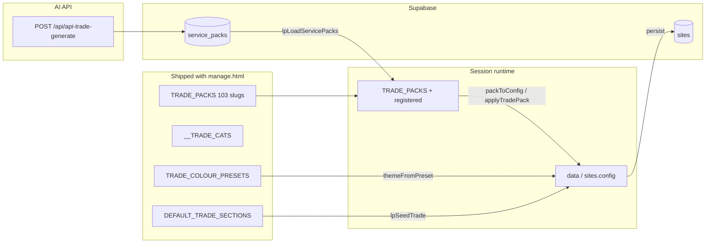
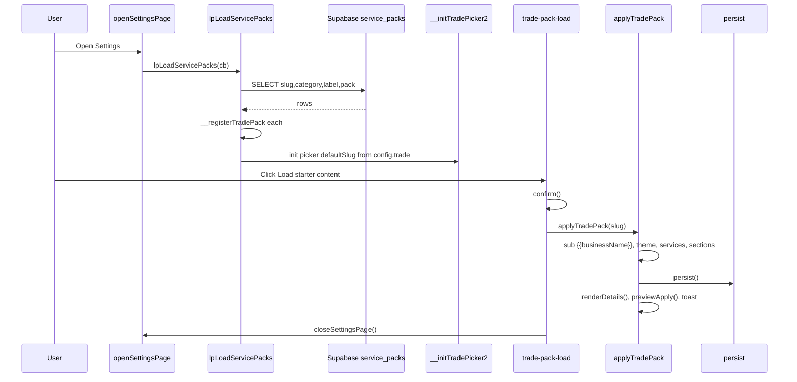
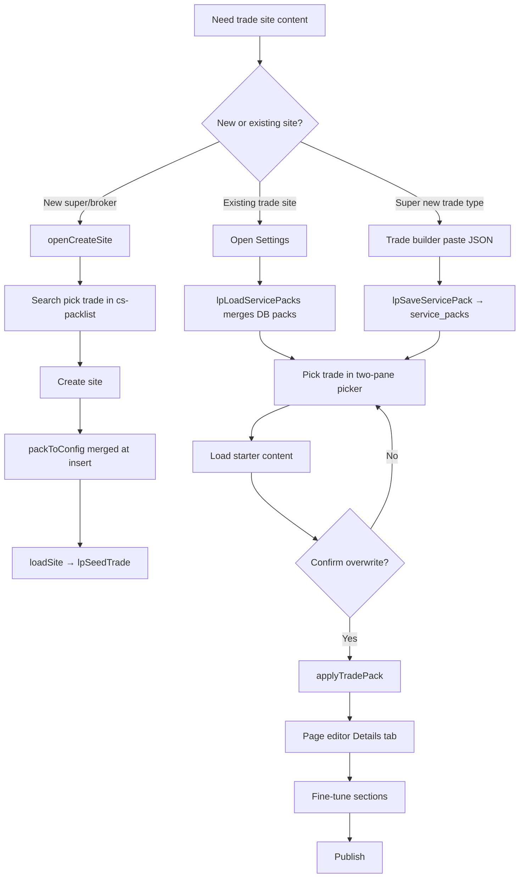
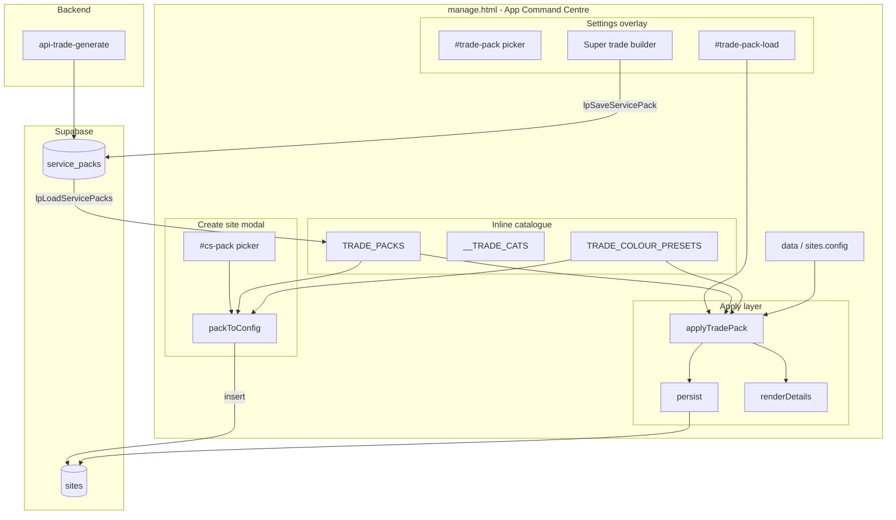
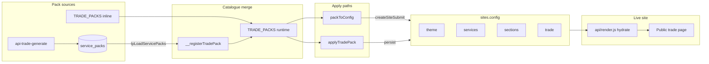
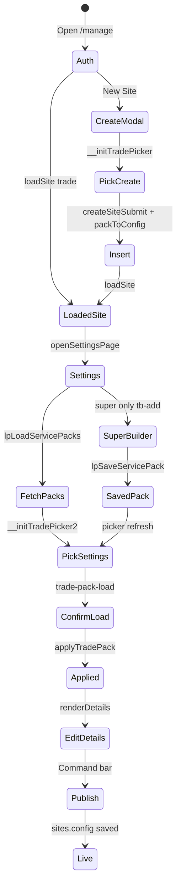

# LeadPages Service Packs / Trade Packs — Complete Engineering Manual

**Document:** `features/Service Packs`  
**Status:** Definitive engineering reference for trade starter content (Service Packs / Trade Packs)  
**Audience:** Engineers rebuilding, extending, or debugging pack seeding, pickers, and the shared catalogue; AI development agents  
**Prerequisites:** [00-VISION](../00-VISION.md), [01-ARCHITECTURE](../01-ARCHITECTURE.md), [04-SITE-BUILDER](../04-SITE-BUILDER.md), [10-EDITOR](../10-EDITOR.md), [02-DATABASE](../02-DATABASE.md)

> **Scope note:** This document describes the **trade starter content system** in `manage.html`: the inline `TRADE_PACKS` catalogue, Supabase `service_packs` table, site-creation picker (`#cs-pack`), Settings “Load starter content” (`#trade-pack-load`), and super-admin trade builder. It is **not** the App Marketplace (`site_apps`), partner theme seeds (`partner_themes`), or broker template defaults.

---

## Executive Summary

Service Packs (also called **Trade Packs** in code and older docs) are **pre-authored starter bundles** that seed a trade-site’s `sites.config`: theme colours, six service cards, and ~10 core section copy blocks (hero, quote form, FAQ, footer, etc.). They let super-admins, brokers, and site owners launch professional tradie landing pages in seconds instead of writing copy from scratch.

Implementation is **100% client-side** in `manage.html` for catalogue and apply logic, with an optional **shared Supabase catalogue** (`service_packs`) merged at runtime. There is no React component or dedicated “packs API” for reads — the editor queries `service_packs` directly via the Supabase JS client.

| Fact | Detail |
|------|--------|
| **Inline catalogue** | `TRADE_PACKS` — 103 slugs embedded at ~line 2131 |
| **Categories** | `window.__TRADE_CATS` — 14 groups, 104 picker slugs (incl. `plumber`) |
| **DB catalogue** | `service_packs` — dynamic / AI / super-admin packs |
| **Create site** | `#cs-pack` → `packToConfig()` → `createSiteSubmit()` |
| **Existing site** | Settings → `#trade-pack-load` → `applyTradePack()` |
| **Boot merge** | `lpLoadServicePacks()` → `__registerTradePack()` |
| **Persist new packs** | `lpSaveServicePack()` upsert `{ onConflict: 'slug' }` |
| **AI path** | `POST /api/api-trade-generate` → insert `service_packs` |

---

## Purpose

### Product purpose

Tradespeople and partners need a site that **looks credible on day one** — correct industry tone, service list, quote form labels, and brand colours — without hiring a copywriter. Service Packs answer:

1. **What trade am I?** — `config.trade` and section copy match the business type.
2. **What do I offer?** — Six toggleable service cards with icons and blurbs.
3. **What does the page say?** — Hero, reviews, FAQ, footer, and quote form seeded with `{{businessName}}` placeholders replaced at apply time.

Packs are **destructive to page content** when applied to an existing site (sections + services + colours replaced) but **preserve** business name, phone, email, and region already in config.

### Engineering purpose

- **Single hydration path** — one JSON shape flows from inline JSON, DB row, or AI output into `sites.config`.
- **Stable template shell** — [03-TEMPLATE-SYSTEM](../03-TEMPLATE-SYSTEM.md): one HTML renderer supports 100+ trades via config, not server-side variants.
- **Extensible catalogue** — inline packs ship with the repo; DB packs and AI generation grow the library without redeploying `manage.html` for every new trade.
- **Shared pickers** — `__initTradePicker` (create modal) and `__initTradePicker2` (Settings two-pane) reuse `__TRADE_CATS` + `TRADE_PACKS`.

---

## Business Purpose

| Stakeholder | Value |
|-------------|-------|
| **Site owner (tradie)** | Professional site in minutes; tweak copy in Page editor afterwards |
| **Partner / broker** | Faster client onboarding; consistent quality across verticals |
| **LeadPages (platform)** | Scalable industry coverage; AI packs compound the catalogue ([00-VISION](../00-VISION.md)) |
| **Super-admin** | Add niches (e.g. coffee cart hire) without engineering; shared DB catalogue |

Service Packs support the business model: **hosted trade sites that capture leads**. Better defaults improve conversion before the owner ever opens the hero section chip.

---

## User Types

| User | Create-site picker (`#cs-pack`) | Settings “Load starter content” | Super trade builder (paste JSON) | AI generate API |
|------|--------------------------------|--------------------------------|----------------------------------|-----------------|
| **Super-admin** | Yes — `openCreateSite()` | Yes — all trade sites | Yes — `__tradeStarterCard(true)` | Yes (Bearer JWT) |
| **Broker / partner** | Yes — if editor access | Yes — on client trade sites | No — builder HTML omitted | Yes (signed-in) |
| **Site owner** | No — no create modal | Yes — Settings on own trade site | No | No (typically) |
| **Leads-only demo** | No | No — no trade editor | No | No |

**Partner site creation** (`partner-dashboard.html`, `/api/partner/add-customer`) often inserts **minimal config** without pack picker — partner may apply a pack later in Settings.

**Not in scope:** Broker templates (`broker-leads`, `broker-app`) — create modal hides `#cs-packwrap` when type ≠ `trade`.

---

## Permissions

| Layer | Mechanism |
|-------|-----------|
| **Create site modal** | Super/broker flows via landing `+ New Site` / `openCreateSite()` — gated by auth + role in editor |
| **Settings pack load** | Any authenticated editor with access to the trade site |
| **`service_packs` SELECT** | Supabase RLS — browser JWT; all editors that open Settings trigger `lpLoadServicePacks()` |
| **`service_packs` UPSERT** | `lpSaveServicePack()` — intended super-admin; failures show “saving for next time failed” toast in builder |
| **`POST /api/api-trade-generate`** | Valid Supabase session required; service role writes approved packs |
| **Apply pack** | Overwrites `data.theme`, `data.services`, `data.sections`, `data.trade` — no extra role check beyond site edit access |

Super-admins see the **“Create a new service / business type (super)”** `<details>` block inside Settings; brokers and site owners see only the picker + **Load starter content** button.

```text
visible trade builder = (currentRole === 'super') ∧ (Settings open) ∧ (trade template site)
```

---

## Layout

Service pack UI appears in **three surfaces** — no dedicated tab.

### 1. Create site modal (`#cs-ov`)

```text
┌─────────────────────────────────────────────────────────────┐
│  Create a new site                                          │
├─────────────────────────────────────────────────────────────┤
│  Business name · Web address · Type (#cs-tpl)               │
├─────────────────────────────────────────────────────────────┤
│  TRADE STARTER CONTENT (#cs-packwrap) — trade type only     │
│  #cs-search · #cs-picked · #cs-packlist (single-pane)       │
│  hidden #cs-pack (default: plumber)                         │
├─────────────────────────────────────────────────────────────┤
│  Phone · Email · Region                                     │
│  [Cancel]  [Create site]                                    │
└─────────────────────────────────────────────────────────────┘
```

`#cs-packwrap` hidden when `#cs-tpl` ≠ `trade`.

### 2. Settings overlay (`#settings-page`)

```text
┌─────────────────────────────────────────────────────────────┐
│  Settings                                              [×]  │
├─────────────────────────────────────────────────────────────┤
│  Site details card (business name, trade field, …)          │
├─────────────────────────────────────────────────────────────┤
│  SERVICE STARTER CONTENT (__tradeStarterCard)               │
│  #tp-search · #tp-picked                                    │
│  ┌──────────────┬─────────────────────────────────────────┐ │
│  │ #tp-cats     │ #tp-packlist (two-pane tp2-wrap)        │ │
│  │ (categories) │ (trades in category)                    │ │
│  └──────────────┴─────────────────────────────────────────┘ │
│  hidden #trade-pack                                         │
│  [#trade-pack-load  Load starter content]                   │
├─────────────────────────────────────────────────────────────┤
│  [super only] Trade builder <details> — paste JSON          │
├─────────────────────────────────────────────────────────────┤
│  [super only] Danger zone · Hosting plans                   │
└─────────────────────────────────────────────────────────────┘
```

### 3. In-memory catalogue (no DOM)

`TRADE_PACKS`, `__TRADE_CATS`, `TRADE_COLOUR_PRESETS`, `DEFAULT_TRADE_SECTIONS` — loaded with `manage.html` script block (~1922–2800).

---

## Navigation

### Entry points

| Path | Handler | Pack UI |
|------|---------|---------|
| Account landing → **+ New Site** | `openCreateSite()` | `#cs-pack` picker |
| Command bar → **Settings** (gear) | `openSettingsPage()` | `#trade-pack` + `#trade-pack-load` |
| Page editor → section chip **details** | `openSettingsPage()` | Same Settings card |
| `#lpl-help-new` / `#lpl-newcard` | `openCreateSite()` | Create modal picker |

### Post-apply navigation

`applyTradePack()` sets `landingSub = 'details'`, calls `renderDetails()`, `previewApply()`, and Settings flow calls `closeSettingsPage()` after confirm.

### Create-site flow

`createSiteSubmit()` → `packToConfig($('cs-pack').value, biz)` merged into insert payload → `loadSite(res.data)` — **no** separate apply step; pack is in initial `config`.

---

## Widgets

| Widget | Container / ID | Loader | Description |
|--------|----------------|--------|-------------|
| **Create picker search** | `#cs-search` | `__initTradePicker` | Filters categorized list |
| **Create picker list** | `#cs-packlist` | `__initTradePicker` | Single-pane grouped rows `.cs-trow` |
| **Create selection** | `#cs-picked`, `#cs-pack` | `__initTradePicker` | Hidden slug + label display |
| **Settings search** | `#tp-search` | `__initTradePicker2` | Filters both panes |
| **Category pane** | `#tp-cats` | `__initTradePicker2` | `.tp2-cat` with match counts |
| **Trade list pane** | `#tp-packlist` | `__initTradePicker2` | `.tp2-trow` for active category |
| **Settings selection** | `#tp-picked`, `#trade-pack` | `__initTradePicker2` | Hidden slug + picked label |
| **Load button** | `#trade-pack-load` | `openSettingsPage` wire | Confirm → `applyTradePack` |
| **Super builder** | `#tb-name`, `#tb-cat`, `#tb-json`, … | `__wireTradeBuilder` | Prompt gen + JSON paste + save |
| **Builder status** | `#tb-status` | `__wireTradeBuilder` | Inline success / error messages |

Shared CSS injected once: `#cs-pack-style` (create), `#tp2-style` (Settings two-pane + builder).

---

## Statistics

### Catalogue scale (approximate, `main` branch)

| Metric | Source | Value |
|--------|--------|-------|
| **Inline pack slugs** | `TRADE_PACKS` keys | 103 |
| **Picker slugs** | `__TRADE_CATS` flat list | 104 (includes `plumber`) |
| **Categories** | `__TRADE_CATS` length | 14 |
| **Core section keys per pack** | Typical pack `sections` | 10 (`header` … `footer`) |
| **Services per pack** | `pack.services` | 6 items |
| **DB packs** | `service_packs` rows | Variable; merged at Settings open |
| **Approved DB packs (marketing)** | `GET /api/api-trade-stats` | `packs`, `trades` (distinct slugs) |

### Pack JSON shape (per slug)

```javascript
{
  label: "Electrician",           // Display + TRADE_COLOUR_PRESETS key
  tradeType: "Electrician",       // → config.trade
  theme: { pipe, hivis, steel, safety },  // Reference; apply uses themeFromPreset(label)
  services: [ { on, icon, title, body } × 6 ],
  sections: { header, emerg, hero, services, why, area, reviews, quote, faq, footer, … }
}
```

### Special case: `plumber`

| Context | Behaviour |
|---------|-----------|
| **`applyTradePack('plumber')`** | Theme from `Plumber` preset; **deletes** `data.services`; **clears** `data.sections`; `trade = 'Plumber'` |
| **`packToConfig('plumber', biz)`** | No `TRADE_PACKS.plumber` entry — falls through to empty sections + Plumber theme defaults |
| **Default picker** | Both pickers default hidden value to `plumber` |

### Slug inference (Settings open)

From `config.trade`, Settings picks default `#trade-pack` slug: exact `plumber`, key in `TRADE_PACKS`, or fuzzy match on label / `tradeType`.

---

## Quick Actions

| Action | Trigger | Handler |
|--------|---------|---------|
| **Pick trade (create)** | Click `.cs-trow` | `__initTradePicker` → `#cs-pack` |
| **Create site with pack** | `#cs-create` | `createSiteSubmit()` → `packToConfig` |
| **Pick trade (settings)** | Click `.tp2-trow` | `__initTradePicker2` → `#trade-pack` |
| **Load starter content** | `#trade-pack-load` | confirm → `applyTradePack(k)` → `closeSettingsPage()` |
| **Generate AI prompt** | `#tb-gen` | `__buildTradePrompt(name, cat)` → `#tb-prompt` |
| **Copy prompt** | `#tb-copy` | clipboard |
| **Add pack to catalogue** | `#tb-add` | parse JSON → `__registerTradePack` → `lpSaveServicePack` |
| **Search trades** | `#cs-search` / `#tp-search` | filter picker lists live |

Command bar **Publish** persists applied config to `sites.config` via existing `persist()` — packs do not auto-publish on load.

---

## Recent Activity

Service Packs have **no activity feed**. User-visible feedback:

| Event | Mechanism |
|-------|-----------|
| **Pack applied** | `toast('Loaded {label} starter content')` |
| **Site created** | `toast('Site "{biz}" created')` |
| **Builder save OK** | `#tb-status` green — “Saved … it’ll be here next time too” |
| **Builder save fail** | Amber warning — session-only register |
| **Invalid JSON** | `#tb-status` red validation messages |
| **Confirm before load** | `window.confirm` — warns copy/services/colours replaced |

No audit log table for pack applies today; `service_packs.use_count` increments on AI API reuse ([api-trade-generate.js](../../api/api-trade-generate.js)).

---

## Site Selection

Packs do not implement a site picker. They operate on **`currentSiteId`** / create-modal context:

| Path | Pack behaviour |
|------|----------------|
| **New site** | User picks pack in modal before insert — independent of `currentSiteId` |
| **Existing trade site** | Settings infers default slug from `data.trade` on `openSettingsPage()` |
| **Switch site** | Settings closed; reopen to re-run slug inference + `lpLoadServicePacks` |
| **Partner minimal create** | Site may have empty sections until owner loads a pack in Settings |

`applyTradePack` uses `currentBusinessName` for `{{businessName}}` substitution, not the picker label.

---

## Notifications

| Type | Mechanism | Relevance |
|------|-----------|-----------|
| **Toast** | `toast(msg)` | Pack loaded, site created |
| **Confirm dialog** | `window.confirm` on `#trade-pack-load` | Destructive overwrite warning |
| **Inline status** | `#tb-status` | Builder register/save |
| **Create errors** | `#cs-err` | Slug collision, validation |
| **No email/push** | — | Pack apply is silent off-editor |

Future: optional “pack applied at” metadata in `config._meta` — not implemented.

---

## Data Sources



| Source | Table / object | Fields used |
|--------|----------------|-------------|
| Inline catalogue | `TRADE_PACKS` | Full pack JSON per slug |
| DB catalogue | `service_packs` | `slug`, `category`, `label`, `pack` JSONB |
| Site working copy | `data` (= `sites.config`) | `theme`, `services`, `sections`, `trade`, `layout` |
| Colour library | `TRADE_COLOUR_PRESETS` | Mapped by pack `label` in apply path |
| Section defaults | `DEFAULT_TRADE_SECTIONS` | Gap-fill via `lpSeedTrade()` after load |
| Business name | `currentBusinessName`, `#cs-biz` | `{{businessName}}` replacement |

**Theme note:** `packToConfig` / `applyTradePack` call `themeFromPreset(p.label)`, not `p.theme` hex values directly — pack `theme` object is informational unless label matches a colour preset key.

---

## API Calls

| Endpoint / call | Method | Called by | Query / body | Response used |
|-----------------|--------|-----------|--------------|-----------------|
| Supabase `service_packs` | SELECT | `lpLoadServicePacks` | `slug,category,label,pack` | Rows merged into `TRADE_PACKS` |
| Supabase `service_packs` | UPSERT | `lpSaveServicePack` | `{ slug, category, label, pack }`, `onConflict: 'slug'` | Success boolean |
| Supabase `sites` | INSERT | `createSiteSubmit` | config includes `packToConfig` merge | New site row |
| Supabase `sites` | UPDATE | `persist()` after apply | Full `data` JSON | Live config |
| `POST /api/api-trade-generate` | POST | External / partner tooling | `{ trade, category?, forceNew? }` | Pack JSON → DB |
| `GET /api/api-trade-stats` | GET | Marketing home | — | `{ packs, trades, sites }` counts |

Auth: Supabase client `sb` uses session JWT from editor login. AI generate validates Bearer token then uses service role for insert.

---

## Database Tables

| Table | Service Pack usage |
|-------|-------------------|
| **`service_packs`** | Shared catalogue — `slug` (unique), `category`, `label`, `pack` JSONB, `variant`, `use_count`, `is_approved`, `generated_by` |
| **`sites`** | `config` JSONB receives merged pack — `trade`, `theme`, `services`, `sections`, `layout` |
| **`profiles`** | Indirect — `is_super_admin` gates super trade builder UI |

### `service_packs.pack` shape

Same as one `TRADE_PACKS[slug]` entry: `label`, `tradeType`, `theme`, `services[]`, `sections{}`.

### `sites.config` after pack apply (trade template)

```json
{
  "phone": "…",
  "phoneText": "…",
  "email": "…",
  "region": "Canberra & the ACT",
  "trade": "Electrician",
  "layout": "classic",
  "theme": { "pipe", "hivis", "steel", "safety", "accent", "lightBg", "presetName", "presetKey" },
  "services": [ "… six items …" ],
  "sections": { "header": {}, "hero": {}, "quote": {}, "…": {} }
}
```

`lpSeedTrade(data)` on `loadSite()` fills missing section keys from `DEFAULT_TRADE_SECTIONS` without overwriting pack content.

---

## Related Files

| File | Relationship |
|------|--------------|
| **`manage.html`** | **Primary implementation** — `TRADE_PACKS`, pickers, apply/save/load |
| `api/manage.html` | Legacy duplicate — keep in sync or treat as drift ([Technical Debt](#technical-debt)) |
| `api/api-trade-generate.js` | Claude pack generation → `service_packs` |
| `api/api-trade-stats.js` | Approved pack / trade counts for marketing |
| `docs/04-SITE-BUILDER.md` | Site creation + trade pack section |
| `docs/10-EDITOR.md` | Editor-wide pack function table |
| `docs/02-DATABASE.md` | `service_packs` schema summary |
| `docs/03-TEMPLATE-SYSTEM.md` | Hydration model for 100+ packs |
| `partner-dashboard.html` | Site create **without** pack picker |
| `api/partner/add-customer.js` | Minimal trade config insert |

---

## Functions

### Core pack pipeline

| Function | Lines (approx.) | Role |
|----------|-----------------|------|
| `TRADE_PACKS` | ~2131 | Inline catalogue object |
| `packToConfig(key, biz)` | ~2587 | Pack → config for **new** site; `{{businessName}}` sub |
| `applyTradePack(key)` | ~2573–2584 | Merge pack into **editor** `data`; persist + render |
| `themeFromPreset(tradeKey)` | ~2025 | `TRADE_COLOUR_PRESETS` → `config.theme` |
| `lpSeedTrade(d)` | ~2132+ | Default missing section keys on site load |
| `presetKeyForSite(c)` | ~2079 | Map `config.trade` → colour preset key |

### Catalogue registration & persistence

| Function | Lines (approx.) | Role |
|----------|-----------------|------|
| `__registerTradePack(slug, cat, pack)` | ~2771–2777 | Add to `TRADE_PACKS` + splice into `__TRADE_CATS` |
| `lpLoadServicePacks(cb)` | ~2781–2793 | Once-per-session SELECT; register each row |
| `lpSaveServicePack(slug, cat, pack)` | ~2794–2801 | UPSERT to `service_packs` |
| `__guessCat(name)` | ~2677–2697 | Keyword → category for new packs |
| `__buildTradePrompt(name, cat)` | ~2803–2838 | Super-admin Claude prompt template |

### Pickers & UI

| Function | Lines (approx.) | Role |
|----------|-----------------|------|
| `__initTradePicker(opts)` | ~2621–2645 | Create modal — `#cs-pack` |
| `__initTradePicker2(opts)` | ~2699–2733 | Settings two-pane — `#trade-pack` |
| `__tradeStarterCard(isSuper)` | ~2735–2769 | Settings HTML for starter card + builder |
| `__wireTradeBuilder(applyFn)` | ~2840–2877 | Super JSON paste workflow |
| `__tradeLabel` / `__tradeType` / `__tradeCat` | ~2618–2620 | Display helpers |
| `openCreateSite()` | ~2879–2906 | Modal + init create picker |
| `createSiteSubmit()` | ~2921–2935 | Insert site with `packToConfig` |
| `openSettingsPage()` | ~2962–3006 | Settings + load packs + wire `#trade-pack-load` |

### Shared dependencies

| Function | Role for packs |
|----------|----------------|
| `loadSite()` | Calls `lpSeedTrade(data)` for trade template |
| `persist()` | Saves `data` after `applyTradePack` |
| `renderDetails()` / `previewApply()` | Refresh editor + preview after apply |
| `closeSettingsPage()` | Dismiss overlay after load |

---

## Event Flow

### Settings — load starter content



### Create site with pack

1. User opens `openCreateSite()`, picks trade in `#cs-packlist`.
2. User submits → `createSiteSubmit()`.
3. If `tpl === 'trade'`: `pc = packToConfig($('cs-pack').value, biz)` merged into `cfg`.
4. `sb.from('sites').insert({ … config: cfg })`.
5. `loadSite(res.data)` → `lpSeedTrade` fills any gaps.

### Super-admin — add DB pack

1. `#tb-gen` builds prompt → user copies to Claude.
2. User pastes JSON → `#tb-add`.
3. Validate → `__registerTradePack` → `lpSaveServicePack`.
4. Picker refresh via `__initTradePicker2(window.__tp2opts)`.

---

## User Journey



**Partner journey:** Create draft site → send client to editor → client or partner opens Settings → load pack matching trade.

**Super journey:** Generate prompt → Claude JSON → add to catalogue → apply to demo sites.

---

## Performance Considerations

| Area | Behaviour | Risk |
|------|-----------|------|
| **`TRADE_PACKS` inline JSON** | ~large single parse at page load | One-time cost; bloats `manage.html` bundle |
| **`lpLoadServicePacks`** | Guarded by `__lpSPLoaded` — one SELECT per session | Re-open Settings does not re-fetch |
| **Picker render** | Full innerHTML rebuild on search | Fine for ~104 slugs |
| **`applyTradePack`** | Deep clone via `JSON.parse(JSON.stringify(...))` | Acceptable for pack size |
| **DB merge** | Synchronous register in SELECT callback | Large `service_packs` table could slow first Settings open |
| **No pack caching** | Inline packs not lazy-loaded | Future: split catalogue to JSON chunk |

**Recommendations:** Lazy-load inline catalogue; index `service_packs.slug`; CDN-cache approved packs JSON for read-heavy marketing.

---

## Security Considerations

| Topic | Detail |
|-------|--------|
| **Authentication** | Pack UI behind editor `gate()` |
| **Authorization** | RLS on `service_packs` and `sites`; upsert failures surfaced in UI |
| **Destructive apply** | Confirm dialog before overwrite; no undo except backups |
| **XSS** | Picker uses `esc()` for labels; pasted JSON fields rendered as text in status |
| **Prompt injection** | Super-admin paste path trusts human review — no server-side re-validation in `manage.html` |
| **AI API** | Service role insert; JWT auth on endpoint |
| **PII** | Packs use placeholders — no customer data in catalogue |

Pack content is **public after publish** on live site — do not embed secrets in `service_packs.pack`.

---

## Technical Debt

| ID | Issue | Location | Impact |
|----|-------|----------|--------|
| TD-SP1 | **`pack.theme` ignored on apply** | `applyTradePack`, `packToConfig` use `themeFromPreset(label)` | Custom hex in pack JSON unused unless preset exists |
| TD-SP2 | **`plumber` not in `TRADE_PACKS`** | Special-cased in apply vs picker list | Inconsistent — empty sections vs full packs |
| TD-SP3 | **`lpLoadServicePacks` only on Settings** | Not called at page boot | Create modal misses DB-only packs until Settings opened once |
| TD-SP4 | **Upsert `onConflict: slug` vs variants** | AI API uses `variant` column | Manual save may overwrite variant rows |
| TD-SP5 | **`api/manage.html` drift** | Duplicate TRADE_PACKS block | Wrong file deployed → stale catalogue |
| TD-SP6 | **No apply audit trail** | — | Cannot trace who reset client copy |
| TD-SP7 | **Location tokens** | AI API uses `{city}`; inline packs hardcode ACT | Inconsistent localisation ([api-trade-generate.js](../../api/api-trade-generate.js) vs `__buildTradePrompt`) |
| TD-SP8 | **Partner create skips picker** | `partner-dashboard.html` | Extra step for partner to load pack manually |

---

## Future Improvements

1. **Call `lpLoadServicePacks()` at editor boot** — DB packs available in create modal without visiting Settings first.
2. **Honor `pack.theme`** when present — fallback to `themeFromPreset(label)`.
3. **Full `plumber` pack entry** — align with other trades or document as intentional minimal seed.
4. **Server-side pack API** — validated read/list; reduce `manage.html` payload via lazy JSON import.
5. **Pack preview modal** — show hero + services before destructive apply.
6. **Variant picker** — expose `service_packs.variant` in UI when multiple AI versions exist.
7. **Apply without closing Settings** — optional; keep preview visible.
8. **Config `_packSlug` metadata** — record applied pack for support and re-apply.
9. **Align location tokens** — unify `{city}` / `{{businessName}}` across inline, AI, and super prompt.
10. **Delete legacy `api/manage.html`** or automate sync from primary `manage.html`.

---

## Service Packs Architecture



---

## Connections to Other Systems

### Site Builder

Service Packs are the **default content seed** for trade sites in [04-SITE-BUILDER](../04-SITE-BUILDER.md). `createSiteSubmit()` merges `packToConfig` into the insert payload; partner flows may skip the picker and rely on Settings apply later.

### Editor / Page editor

After apply, users land on **Details** (`renderDetails`) to edit section chips. Packs populate `config.sections` keys consumed by `renderLandingSub` and layout system (`LAYOUTS`, `_secOn`). `lpSeedTrade` ensures missing keys do not break the renderer.

### Dashboard

The [Dashboard](Dashboard.md) does not expose pack UI. Indirect link: a freshly packed site shows stats/leads once live — pack quality affects conversion shown on Dashboard KPIs.

### Template system

[03-TEMPLATE-SYSTEM](../03-TEMPLATE-SYSTEM.md) — one trade HTML shell hydrates from `config.sections` regardless of which pack slug was used. Optional sections remain off until enabled (`OFF_BY_DEFAULT_SECTIONS`).

### Marketplace

Marketplace apps (`site_apps`) merge **additional** sections via `_reconcileSiteApps()` **after** pack seed on `loadSite`. Order: pack → seed → apps reconcile. Apps and packs both write `config.sections` — potential key overlap requires app design discipline.

### Partners

Partners create draft sites with minimal config; **Service starter content** in Settings is the self-serve path to professional copy. Super trade builder extends catalogue for niche partner verticals. See [05-PARTNERS](../05-PARTNERS.md).

### AI / Anthropic

- **In-editor:** `__buildTradePrompt` + manual Claude paste (super-admin).
- **API:** `POST /api/api-trade-generate` — automated insert with validation and variant cap (`MAX_VARIANTS = 5`).
- **Marketing:** `GET /api/api-trade-stats` counts approved packs.

See [00-VISION](../00-VISION.md) — content library compounds via AI packs.

### Backups

Dashboard / `lpBkSave` snapshots `sites.config` **after** pack apply. Restoring a pre-pack backup is the rollback path — no dedicated “undo pack” action.

### Billing

No direct coupling. Locked sites (`lpBillingGate`) block editor including Settings pack load.

---

## Data Flow



---

## User Flow



---

## Glossary

| Term | Meaning |
|------|---------|
| **Service Pack / Trade Pack** | Starter JSON bundle: theme + services + sections for one trade slug |
| **`TRADE_PACKS`** | In-memory object keyed by slug; inline + DB-registered entries |
| **`service_packs`** | Supabase shared catalogue table |
| **`packToConfig`** | Non-destructive merge for **new** site insert |
| **`applyTradePack`** | Destructive merge into editor `data` for **existing** site |
| **`{{businessName}}`** | Placeholder replaced at apply/create with business name |
| **Starter content** | User-facing label for “Load starter content” |

---

*Last updated: July 2026 — reflects `manage.html` Service Packs implementation on branch `main`.*
