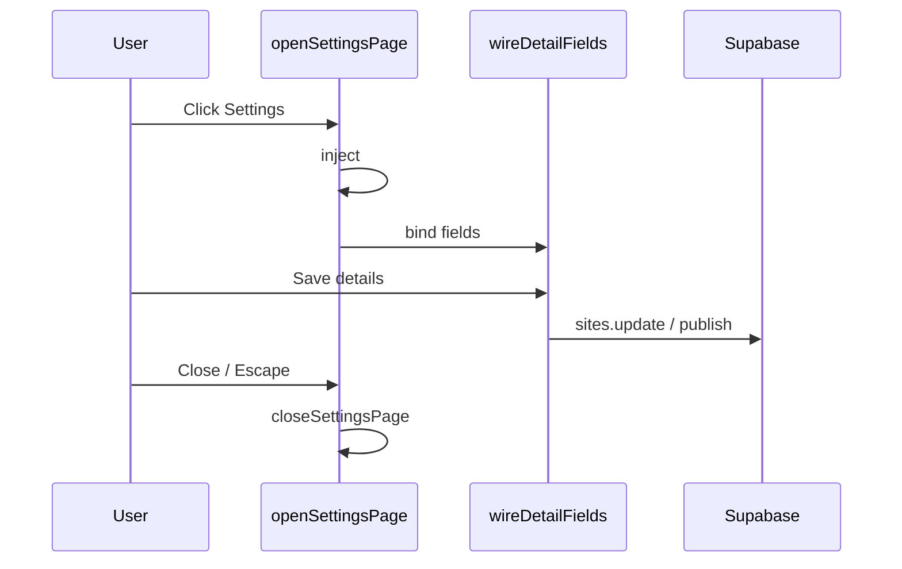
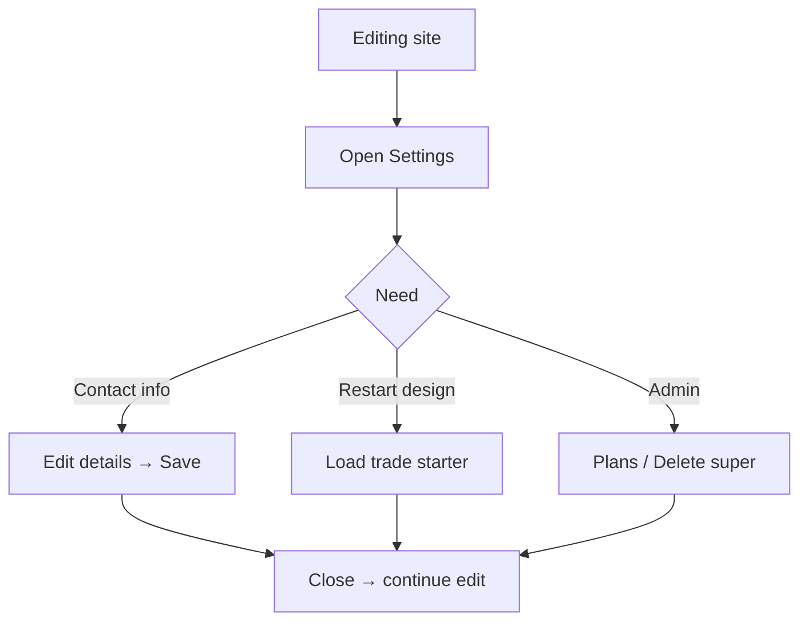
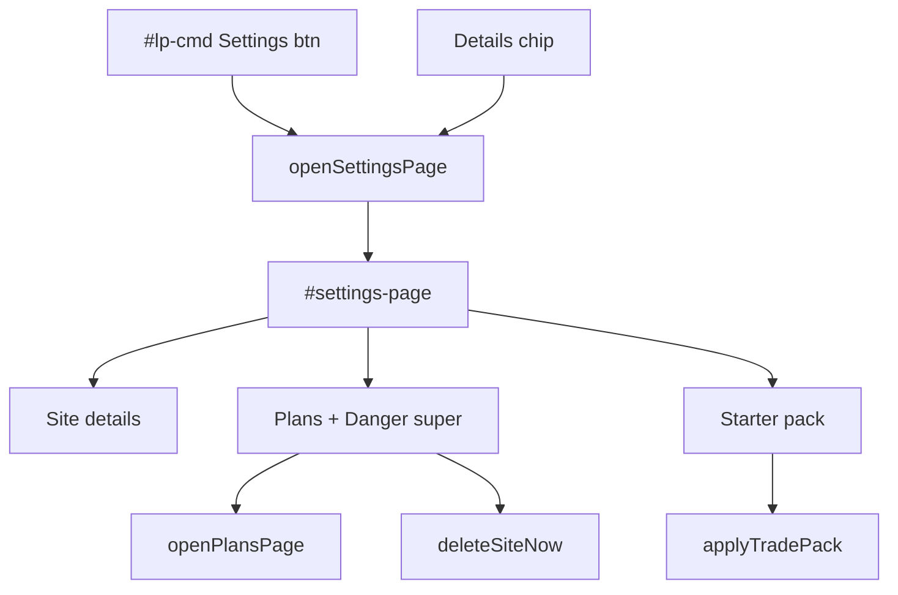
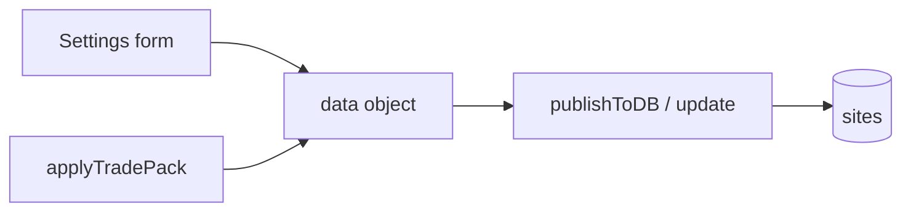
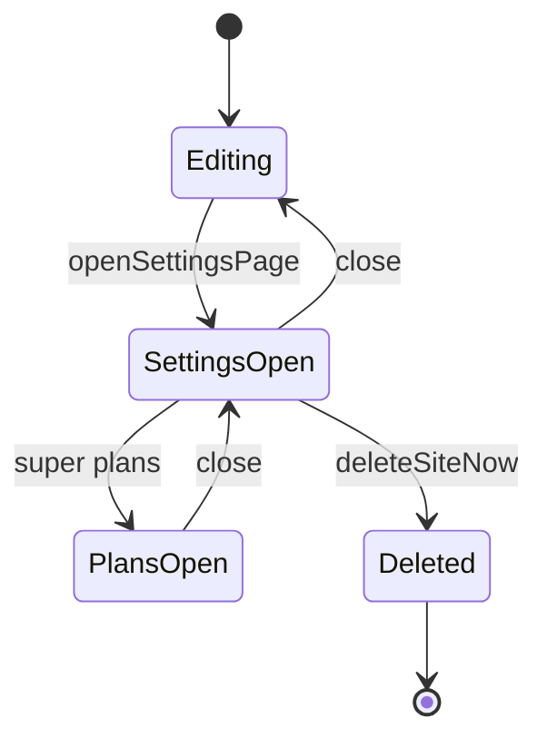

# LeadPages Settings — Complete Engineering Manual

**Document:** `features/Settings`  
**Status:** Definitive engineering reference for the editor Settings overlay  
**Audience:** Engineers extending site metadata, admin tools, or danger-zone flows  
**Prerequisites:** [features/Editor](Editor.md), [features/Site Builder](Site%20Builder.md), [02-DATABASE](../02-DATABASE.md)

> **Scope:** `#settings-page` overlay opened via `openSettingsPage()` from command bar, trade Page editor, or inline **Details** chip. Distinct from **Details** tab fields for broker-leads (inline card).

---

## Executive Summary

Settings is a **full-screen modal overlay** for infrequent site operations: business identity, super-only domain/owner email, demo flag, hosting plan shortcuts, trade starter reload, and super **danger zone** delete. It reuses `wireDetailFields()` and `publishToDB()` patterns from the Page editor.

| Fact | Detail |
|------|--------|
| **Open** | `openSettingsPage()` ~line 2962 |
| **Close** | `closeSettingsPage()` — removes DOM node |
| **Super extras** | Plans, suspended page, delete, domain, owner email |
| **Trade extras** | Service pack picker + load starter |
| **Save** | `#d-save` → updates `data` + `publishToDB` path via detail wiring |

---

## Purpose

### Product purpose

Separate **daily editing** (sections, copy) from **site identity and admin** (slug-level metadata, billing, deletion) so clients do not stumble into destructive actions.

### Engineering purpose

- Single overlay injected on demand (no static HTML)
- Role-conditional sections via `currentRole === 'super'`
- Bridge to plan builder (`openPlansPage`) and suspended editor (`openSuspendedEditor`)

---

## Business Purpose

| Stakeholder | Settings usage |
|-------------|----------------|
| **Client** | Business name, phone, email, region |
| **Partner** | Same; may use trade starter reload |
| **Super-admin** | Domain, owner email, demo flag, delete, plans |

---

## User Types

| Role | Visible sections |
|------|------------------|
| **broker** | Site details, trade starter (if trade) |
| **super** | All + demo toggle, plans, danger zone, domain, owner |
| **leads** | N/A — cannot open settings |

---

## Permissions

- Open: any authenticated user with site loaded (command bar **Settings**)
- **Custom domain / owner email**: super only (HTML omitted for brokers)
- **Danger zone**: super only
- **Demo toggle**: super (`lplToggleDemo`)
- **Delete**: super + unlock + double-tap confirm

---

## Settings Layout

```text
#settings-page (fixed overlay)
└── .sp-card
    ├── Header + Close
    ├── Site details card
    │   ├── Demo checkbox [super]
    │   ├── Business name, domain [super], owner [super]
    │   ├── Phone, email, region, trade, licence
    │   └── Save details (#d-save)
    ├── Hosting plans card [super]
    │   ├── Manage hosting plans → openPlansPage
    │   └── Edit suspended page → openSuspendedEditor
    ├── Trade starter card (__tradeStarterCard)
    │   └── Pack picker + Load starter
    └── Danger zone [super]
        ├── Lock toggle (#btn-dellock)
        └── Delete site (#btn-delsite) double-tap
```

---

## Navigation

| Entry point | Code path |
|-------------|-----------|
| Command bar **Settings** | `ensureSiteBar` → `openSettingsPage` |
| Trade **Details** chip | `sec-editonly` → `openSettingsPage` |
| Inline open settings | `#open-settings-inline` in subtabs |

Close: **Close** button, backdrop click, **Escape** key.

---

## Widgets

| Widget | ID | Role |
|--------|-----|------|
| Overlay root | `#settings-page` | Modal |
| Demo flag | `#set-demo` | `sites.is_demo` |
| Detail fields | `#d-biz`, `#d-domain`, `#d-owner`, … | Config + columns |
| Save | `#d-save` | Persist details |
| Plans button | `#open-plans` | Plan builder overlay |
| Suspended | `#open-susp` | Suspended page editor |
| Trade pack | `#trade-pack`, `#trade-pack-load` | Starter content |
| Delete lock | `#btn-dellock` | Safety |
| Delete | `#btn-delsite` | Two-step delete |

---

## Statistics

None in Settings UI.

---

## Quick Actions

| Action | Handler |
|--------|---------|
| Save details | `wireDetailFields` → publish path |
| Toggle demo | `lplToggleDemo(currentSiteId)` |
| Load trade starter | `applyTradePack(k)` + confirm |
| Open plans | `openPlansPage()` |
| Open suspended editor | `openSuspendedEditor()` |
| Delete site | `deleteSiteNow()` after double tap |

---

## Recent Activity

Not shown in Settings.

---

## Site Selection

Settings always edits **`currentSiteId`**. Switch site via command bar before opening.

---

## Notifications

| Event | Feedback |
|-------|----------|
| Details saved | `#d-saved` green text / toast |
| Delete armed | Button text “Tap again to delete” |
| Starter load | `confirm()` dialog before `applyTradePack` |

---

## Data Sources

- In-memory `data` / `allSites` row for `currentSiteId`
- `wireDetailFields(c0(), 'trade')` binds inputs
- Super plans: `/api/billing/plans` via `openPlansPage`
- Trade packs: `TRADE_PACKS` + `lpLoadServicePacks`

---

## API Calls

| Endpoint | When |
|----------|------|
| Supabase `sites.update` | Save details, demo flag, delete |
| `publishToDB` | Detail save may trigger publish wiring |
| `/api/billing/plans` | Plan builder (from Settings link) |
| `/api/billing/system-pages` | Suspended editor |

---

## Database Tables

| Table / field | Settings touch |
|---------------|----------------|
| `sites.business_name` | Detail save |
| `sites.custom_domain` | Super |
| `sites.owner_email` | Super |
| `sites.config` | Phone, email, region, trade, licence |
| `sites.is_demo` | Demo checkbox |
| `billing_plans` | Via plans overlay |

---

## Related Files

| File | Role |
|------|------|
| `manage.html` | `openSettingsPage`, `wireDetailFields` |
| [features/Billing](Billing.md) | Plans + billing overlays |
| [features/Service Packs](Service%20Packs.md) | Starter loader |
| [features/User Management](User%20Management.md) | Broker-app users (separate tab) |

---

## Functions

| Function | Purpose |
|----------|---------|
| `openSettingsPage()` | Build and show overlay |
| `closeSettingsPage()` | Remove overlay |
| `wireDetailFields(c, template)` | Bind save handlers |
| `c0()` | `return data` shorthand |
| `lplToggleDemo(id)` | Flip `is_demo` |
| `applyTradePack(key)` | Load starter content |
| `deleteSiteNow()` | Execute delete |
| `openPlansPage()` | Hosting plans admin |
| `openSuspendedEditor()` | Suspended copy editor |
| `window.__tradeStarterCard(super)` | HTML for pack section |

---

## Event Flow



---

## User Journey



---

## Performance Considerations

- Overlay created/destroyed each open — no leak if `closeSettingsPage` called
- Trade pack list loads via `lpLoadServicePacks` callback on open
- Plans fetch only when user clicks through to plans overlay

---

## Security Considerations

| Risk | Mitigation |
|------|------------|
| **Delete site** | Super + lock + double confirm |
| **Owner email** | Super only — controls client access |
| **Custom domain** | Super only — DNS misconfiguration risk |
| **Demo flag** | Super — affects public labelling |

---

## Technical Debt

| ID | Issue |
|----|-------|
| TD-ST1 | Settings duplicates some **Details** tab fields for trade |
| TD-ST2 | Injected CSS via JS string (`settings-page-css`) |
| TD-ST3 | No slug edit in Settings (slug set at create only) |
| TD-ST4 | Plan builder nested two overlays deep |

---

## Future Improvements

1. Unified **Site details** — one surface for trade Details chip vs Settings
2. Slug rename with redirect rules
3. Audit log for danger zone actions
4. Client-safe settings view (hide super fields entirely, not just omit HTML)

---

## Settings Architecture



---

## Connections to Other Features

| Feature | Link |
|---------|------|
| [Editor](Editor.md) | Command bar host |
| [Publishing](Publishing.md) | Detail save → live |
| [Billing](Billing.md) | Plans button |
| [Service Packs](Service%20Packs.md) | Starter reload |
| [Domains](Domains.md) | Custom domain field |
| [Authentication](Authentication.md) | Owner email for client login |

---

## Data Flow



---

## User Flow



---

*Last updated: July 2026.*
