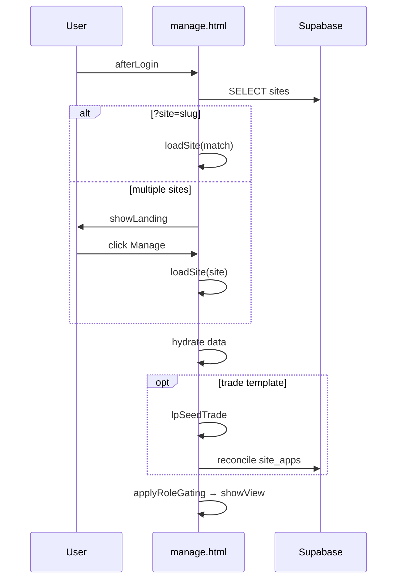
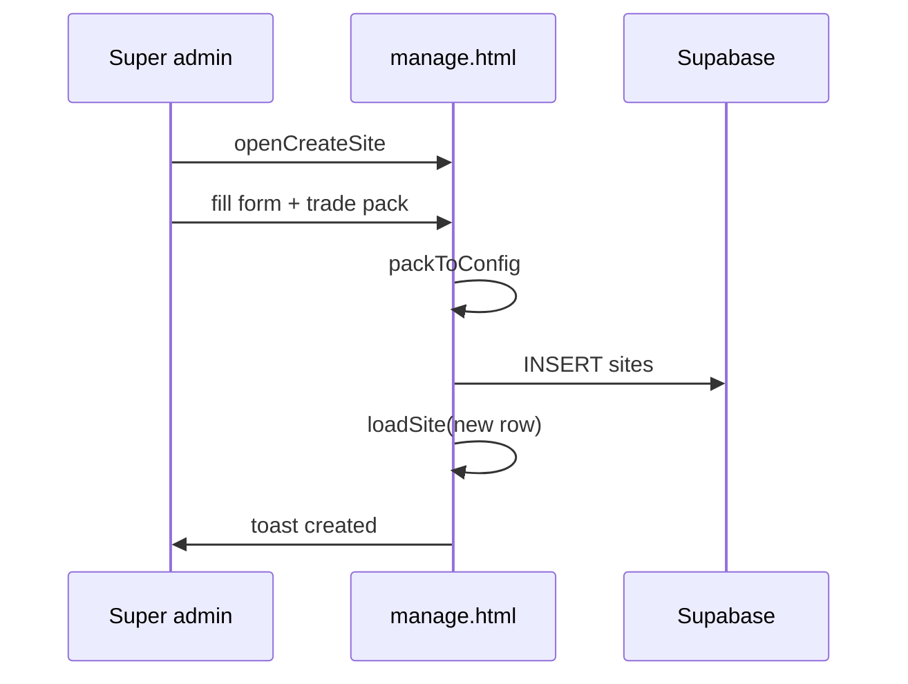
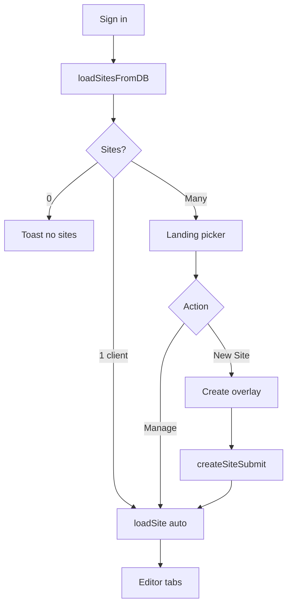
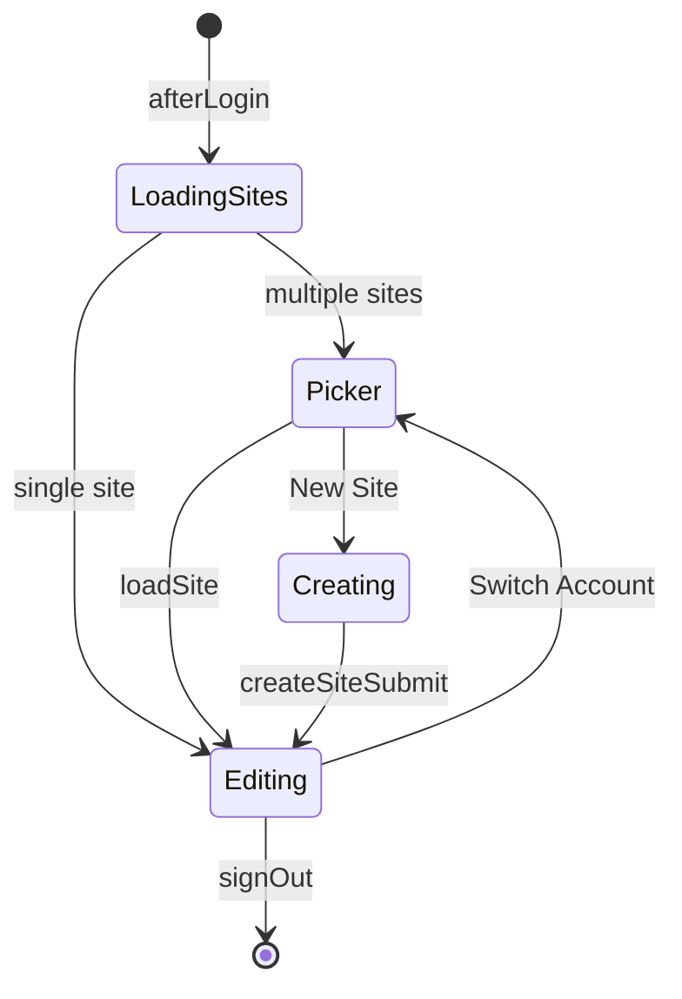

# LeadPages Site Builder — Complete Engineering Manual

**Document:** `features/Site Builder`  
**Status:** Definitive engineering reference for site creation, loading, and lifecycle in the editor  
**Audience:** Engineers rebuilding or extending site creation flows; AI development agents  
**Prerequisites:** [00-VISION](../00-VISION.md), [04-SITE-BUILDER](../04-SITE-BUILDER.md), [features/Editor](Editor.md), [03-TEMPLATE-SYSTEM](../03-TEMPLATE-SYSTEM.md)

> **Scope note:** Site Builder covers **creating and selecting sites** — the `#lp-landing` switcher, `#cs-ov` create modal, `loadSite()`, and partner creation entry points. Day-to-day editing lives in [Editor](Editor.md) and template-specific feature docs.

---

## Executive Summary

The Site Builder is the **first mile** of the LeadPages product: turn a business name and template choice into a `sites` row with seeded `config`, then hydrate the editor via `loadSite()`. Production implementation spans `manage.html` (primary), `partner-dashboard.html`, `partner.html`, and partner APIs.

| Fact | Detail |
|------|--------|
| **Core table** | `sites` — one row per website |
| **Config storage** | `sites.config` JSONB + denormalized columns |
| **Create UI** | `#cs-ov` overlay (`openCreateSite` → `createSiteSubmit`) |
| **Picker UI** | `#lp-landing` (`showLanding` → `renderLanding`) |
| **Hydrate** | `loadSite(site)` — sets globals + `data` |
| **Trade seed** | `packToConfig` + `lpSeedTrade` at create/load |
| **Deep link** | `/manage?site={slug}` |

Lifecycle: **Create → Load → Edit → Publish → Render** (`api/render.js`).

---

## Purpose

### Product purpose

Enable partners and supers to **provision client sites in seconds** with professional defaults (trade packs), while preventing accidental edits to the wrong site via an explicit account picker.

### Engineering purpose

- Centralise site row CRUD and `config` hydration
- Branch by `sites.template` without separate applications
- Stamp partner attribution (`referring_partner_id`, `servicing_partner_id`)
- Separate **config publish** from **status live/draft** for partner workflows

---

## Business Purpose

| Stakeholder | Value |
|-------------|-------|
| **Super-admin** | Instant live sites with trade packs; demo flags |
| **Partner** | Draft client sites, mockups, agency home pages |
| **Client (site owner)** | Single-site accounts skip picker — straight into editor |
| **Platform** | One `sites` model powers hosting, billing, analytics |

---

## User Types

| Actor | Create path | Default `status` |
|-------|-------------|------------------|
| **Super-admin** | `manage.html` + New Site | `live` |
| **Partner** | `partner-dashboard.html`, `partner.html`, APIs | `draft` |
| **Client** | Does not create — assigned `owner_email` | Existing row |
| **API** | `POST /api/partner/add-customer` | `draft` |

---

## Permissions

| Action | Who |
|--------|-----|
| **Create site** | Super (`openCreateSite`); partner surfaces |
| **See site switcher** | Super always; multi-site brokers; not single-site clients |
| **Delete site** | Super only — `deleteSiteFlow()` |
| **Set `owner_email`** | Super in settings / create |
| **Toggle `is_demo`** | Super |
| **Partner publish (status)** | `partner.html` — not in builder alone |

Supabase RLS must scope `sites` SELECT/INSERT to authorised users.

---

## Site Builder Layout

```text
┌─────────────────────────────────────────────────────────────┐
│  #lp-landing (full-screen overlay when active)              │
│  ├── #lpl-seg — segment tabs (role-gated)                   │
│  ├── #lpl-search / #lpl-sort                                │
│  ├── Site cards grid — data-edit → loadSite                 │
│  └── #lpl-newcard — + New Site                              │
├─────────────────────────────────────────────────────────────┤
│  #cs-ov — Create Site overlay (super)                       │
│  ├── #cs-biz, #cs-slug, #cs-tpl, #cs-pack                   │
│  ├── Phone, email, region                                   │
│  └── #cs-create → createSiteSubmit                          │
└─────────────────────────────────────────────────────────────┘
```

After `hideLanding()` + `loadSite()`, the [Editor](Editor.md) shell takes over.

---

## Navigation

| Step | Function | Result |
|------|----------|--------|
| Login | `afterLogin` → `loadSitesFromDB` | `allSites` populated |
| Multi-site | `showLanding()` | Picker visible |
| Pick card | `loadSite(s)` | `hideLanding()`, editor tabs |
| Deep link | `?site=slug` in URL | Skip picker if match found |
| New site | `openCreateSite()` | `#cs-ov` modal |
| Switch later | Command bar **Switch Account** | `showLanding()` |

---

## Widgets

| Widget | ID | Purpose |
|--------|-----|---------|
| **Landing overlay** | `#lp-landing` | Site grid |
| **Segment tabs** | `#lpl-seg` | Customer / Partner / Demos / … |
| **Search** | `#lpl-search` | Filter by name/slug |
| **Sort** | `#lpl-sort` | `updated` / `name` / `leads` |
| **Site card** | `.lpl-card` | Favourite star, Manage button |
| **New site card** | `#lpl-newcard` | Opens create flow |
| **Create overlay** | `#cs-ov` | Form for new row |
| **Slug status** | `#cs-slug-status` | Availability hint |
| **Trade pack row** | `#cs-pack-row` | Shown when template = trade |
| **Site bar dropdown** | In `#lpc-context` | Quick switch between sites |

---

## Statistics

Landing cards can show **lead counts** per site:

- `LPL.leads` map built from `SELECT site_id FROM leads` on first `showLanding()`
- Sort option **leads** uses this map in `renderLanding()`

No other Site Builder-specific metrics UI.

---

## Quick Actions

| Action | Trigger |
|--------|---------|
| **Manage site** | Card `data-edit` → `loadSite` |
| **Toggle favourite** | `data-fav` → `lplToggleFav` → `sites.is_favorite` |
| **Create site** | `#lpl-newcard` or super **+ New Site** |
| **Create submit** | `#cs-create` → `createSiteSubmit` |
| **Sign out from landing** | `#lpl-signout` |

---

## Recent Activity

Site cards display **last updated** from `sites.updated_at` (via `renderLanding` sort/display). No activity feed on the picker itself.

---

## Site Selection

### `loadSitesFromDB()` flow

1. `SELECT` sites visible to user (ordered `created_at`)
2. If `?site=slug` → `loadSite(match)` and return
3. If super or `allSites.length > 1` → `showLanding()`
4. Else → `loadSite(allSites[0])`

### `loadSite(site)` (~2147)

| Step | Action |
|------|--------|
| 1 | Set `currentSiteId`, slug, template, business name, domain, owner |
| 2 | Reset `landingSub = 'details'` |
| 3 | **broker-app:** merge `DEFAULT_RATES` + config → `init()` |
| 4 | **trade:** `data = site.config`; `lpSeedTrade(data)` |
| 5 | **trade:** `_reconcileSiteApps` (async) then chrome + gating |
| 6 | **other:** sync chrome, `renderSiteAnalytics`, scope/backup sync |

### Single-site client shortcut

In `showLanding()`, non-super/non-broker users with exactly one non-partner-home site skip the picker.

---

## Notifications

| Event | Feedback |
|-------|----------|
| Create success | `toast('Site "{biz}" created')` |
| Create error | `#cs-err` inline message |
| Slug taken | `#cs-slug-status` + `csSuggest()` |
| Load error | `toast('Could not load site: …')` |
| Delete success | `toast('Site deleted')` |

---

## Data Sources

```mermaid
flowchart LR
  subgraph create [Creation]
    CS[createSiteSubmit]
    PD[partner-dashboard]
    API[partner APIs]
  end

  subgraph picker [Selection]
    LDB[loadSitesFromDB]
    RL[renderLanding]
    LS[loadSite]
  end

  subgraph memory [Editor state]
    AS[allSites]
    DATA[data]
  end

  subgraph db [(Supabase)]
    SITES[sites]
    LEADS[leads counts]
    PACKS[service_packs]
  end

  CS & PD & API --> SITES
  LDB --> SITES --> AS
  LDB --> LEADS
  RL --> AS
  LS --> DATA
  PACKS --> TRADE_PACKS[TRADE_PACKS memory]
```

---

## API Calls

| Endpoint | Method | Used by |
|----------|--------|---------|
| Supabase `sites` | SELECT | `loadSitesFromDB` |
| Supabase `sites` | INSERT | `createSiteSubmit`, partner UIs |
| Supabase `sites` | UPDATE | favourite, demo flag, publish |
| Supabase `sites` | DELETE | `deleteSiteNow` [super] |
| Supabase `leads` | SELECT `site_id` | Landing lead counts |
| `POST /api/partner/add-customer` | POST | Partner onboarding |
| `POST /api/partner/add-mockup` | POST | Mockup sites |
| `POST /api/partner/ensure-home` | POST | Partner agency home |
| `GET /api/api-site-apps` | GET | `_reconcileSiteApps` on load |

---

## Database Tables

| Table / column | Site Builder usage |
|----------------|-------------------|
| **`sites.id`** | UUID primary key |
| **`sites.slug`** | URL path; unique |
| **`sites.business_name`** | Display; denormalized on publish |
| **`sites.template`** | `trade` \| `broker-leads` \| `broker-app` |
| **`sites.config`** | JSONB — full site configuration |
| **`sites.status`** | `live` \| `draft` — public visibility |
| **`sites.custom_domain`** | Optional custom hostname |
| **`sites.owner_email`** | Client login scope |
| **`sites.is_demo`** | Demo calculator flag |
| **`sites.is_mockup`** | Partner sale mockup |
| **`sites.is_partner_home`** | Agency homepage |
| **`sites.is_favorite`** | Super picker star |
| **`sites.referring_partner_id`** | Attribution |
| **`sites.servicing_partner_id`** | Support partner |
| **`sites.updated_at`** | Sort + display |
| **`service_packs`** | Dynamic trade pack catalogue |

---

## Related Files

| File | Role |
|------|------|
| `manage.html` | Landing, create modal, `loadSite` |
| `partner-dashboard.html` | Partner site grid → `/manage?site=` |
| `partner.html` | Client CRUD, publish/unpublish status |
| `api/partner/add-customer.js` | API site creation |
| `api/partner/add-mockup.js` | Mockup creation |
| `api/partner/ensure-home.js` | Partner home site |
| `api/create-site.js` | Legacy password API |
| `api/render.js` | Public output after publish |
| [04-SITE-BUILDER](../04-SITE-BUILDER.md) | Canon overview |
| [features/Editor](Editor.md) | Post-load editor shell |
| [features/Service Packs](Service%20Packs.md) | Trade pack detail |

---

## Functions

| Function | Purpose |
|----------|---------|
| `loadSitesFromDB()` | Fetch sites; routing to landing vs auto-load |
| `showLanding()` / `hideLanding()` | Toggle `#lp-landing` |
| `renderLanding()` | Paint site cards for current `LPL.grp` |
| `_lplWire(list)` | Wire card click handlers |
| `lplToggleFav(id)` | Flip `is_favorite` |
| `loadSite(site)` | **Hydrate editor** for one site |
| `openCreateSite()` | Build `#cs-ov` once |
| `createSiteSubmit()` | Validate + INSERT site |
| `csCleanSlug` / `csCheckSlug` / `csSuggest` | Slug helpers |
| `packToConfig(key, biz)` | Trade pack → config object |
| `lpSeedTrade(c)` | Default missing section keys |
| `_reconcileSiteApps(siteId, cfg)` | Marketplace merge on load |
| `deleteSiteFlow()` / `deleteSiteNow()` | Super deletion |

---

## Event Flow



### Create flow



---

## User Journey



---

## Performance Considerations

| Area | Behaviour |
|------|-----------|
| **Full site list** | One SELECT on login — cached in `allSites` |
| **Lead counts** | Optional async query; doesn't block first paint |
| **Slug check** | Debounced `csCheckSlug` — avoids spamming DB |
| **Trade reconcile** | Async on load — trade path returns early, UI updates when apps merge |
| **Landing re-render** | Full card HTML on search/sort — fine for tens of sites |

---

## Security Considerations

| Risk | Mitigation |
|------|------------|
| **Create arbitrary sites** | RLS + role UI gating |
| **Slug squatting** | Uniqueness check before INSERT |
| **Cross-tenant load** | RLS on `sites` SELECT |
| **Delete** | Super only + name confirm |
| **Partner APIs** | Must validate partner JWT server-side |

---

## Technical Debt

| ID | Issue |
|----|-------|
| TD-SB1 | **Publish vs `status`** — two-step go-live confuses partners |
| TD-SB2 | **`vertical` column** — legacy; rendering uses `template` |
| TD-SB3 | **`api/create-site.js`** — password gate; prefer UI flows |
| TD-SB4 | **No bulk site ops** — partners with 100+ sites need search only |
| TD-SB5 | **Partner template API auth gap** | See architecture doc |

---

## Future Improvements

1. Unified **go-live** — single Publish sets config + `status: live`
2. **Site folders / tags** for partner organisation
3. **Duplicate site** action from landing card
4. **Archive** instead of hard delete
5. **Server-side create API** with schema validation
6. **Onboarding wizard** after create for trade clients

---

## Site Builder Architecture

```mermaid
flowchart TB
  subgraph entry [Entry Points]
    Manage[manage.html]
    PDash[partner-dashboard.html]
    Partner[partner.html]
    PAPI["/api/partner/*"]
  end

  subgraph builder [Site Builder UI]
    Landing["#lp-landing"]
    Create["#cs-ov"]
    Load[loadSite]
  end

  subgraph seed [Seeding]
    Pack[packToConfig]
    Seed[lpSeedTrade]
    Apps[_reconcileSiteApps]
  end

  subgraph editor [Editor Shell]
    EditorDoc[features/Editor.md]
  end

  subgraph db [(sites)]
    Row[sites row + config]
  end

  Manage --> Landing & Create
  PDash & Partner & PAPI --> Row
  Create --> Pack --> Row
  Landing --> Load
  Load --> Seed --> Apps --> EditorDoc
  Row --> Load
```

---

## Connections to Other Features

| Feature | Connection |
|---------|------------|
| [Editor](Editor.md) | `loadSite` hands off to editor shell |
| [Authentication](Authentication.md) | Who can see landing / create |
| [Settings](Settings.md) | Slug, domain, owner after create |
| [Service Packs](Service%20Packs.md) | `#cs-pack`, `packToConfig` |
| [Publishing](Publishing.md) | `publishToDB` after edits |
| [Partner Dashboard](Partner%20Dashboard.md) | Alternate entry + deep link |
| [Billing](Billing.md) | Site row linked to hosting customer |
| [Dashboard](Dashboard.md) | Default tab after loading trade site |

---

## Data Flow

```mermaid
flowchart LR
  subgraph input [Inputs]
    Form[Create form]
    Pick[Site picker]
  end

  subgraph process [manage.html]
    PTC[packToConfig]
    INS[INSERT sites]
    LS[loadSite]
    PST[publishToDB]
  end

  subgraph storage [(Supabase)]
    Sites[(sites)]
  end

  subgraph output [Public]
    Render[api/render.js]
  end

  Form --> PTC --> INS --> Sites
  Pick --> LS --> Sites
  LS --> Editor[data object]
  Editor --> PST --> Sites
  Sites --> Render
```

---

## User Flow



---

*Last updated: July 2026 — reflects site builder flows in `manage.html` on `main`.*
