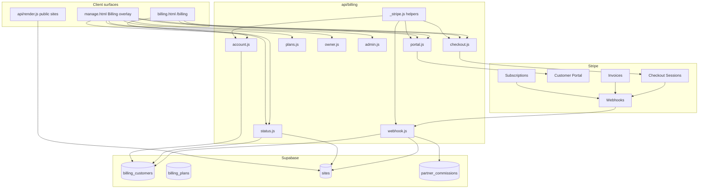
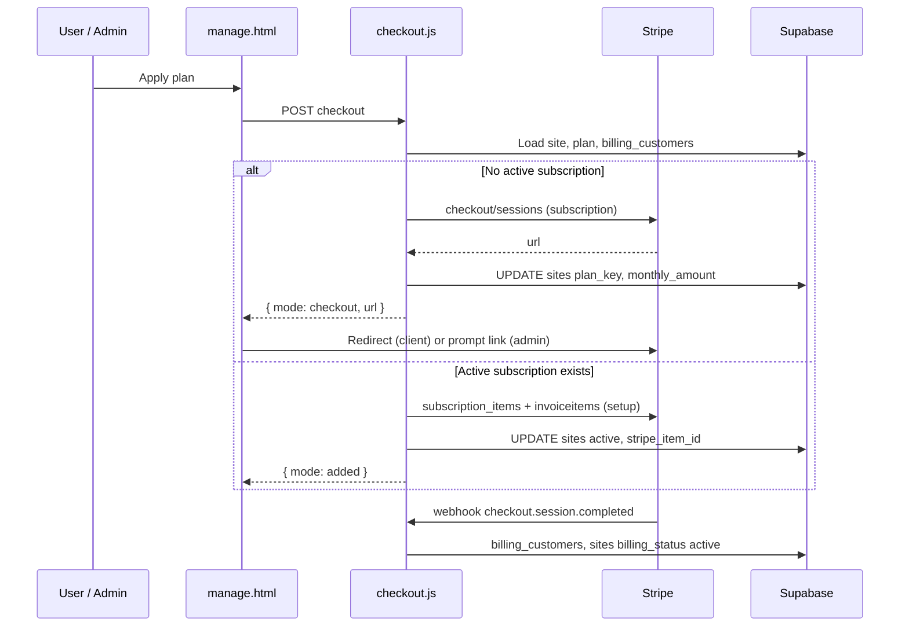
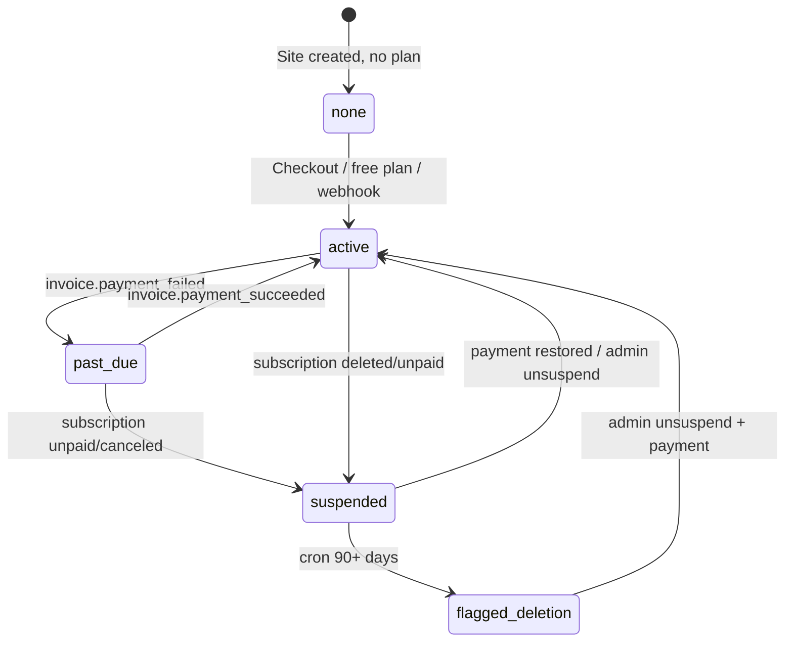
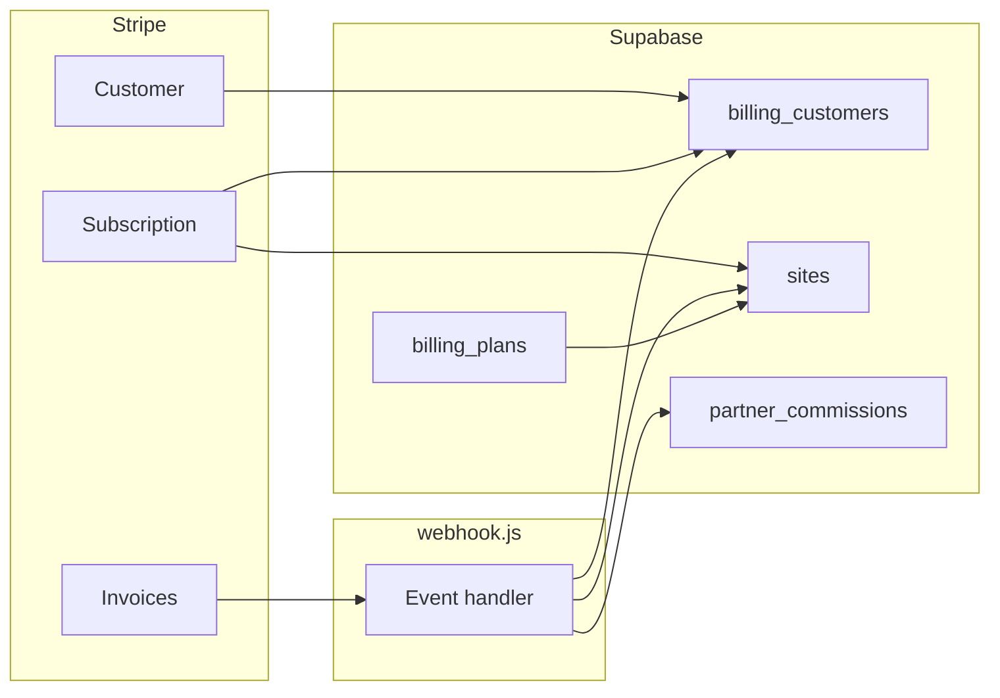
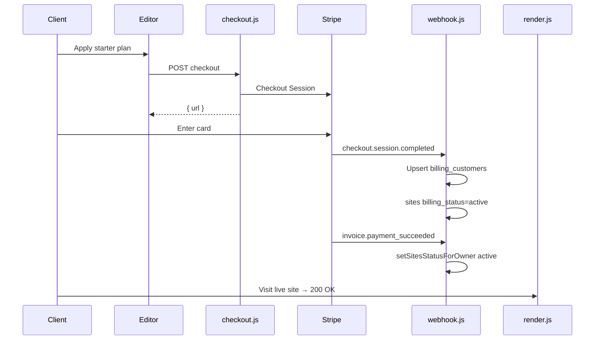
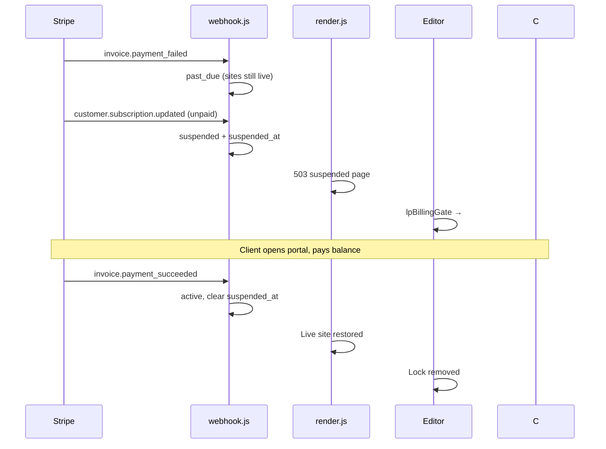
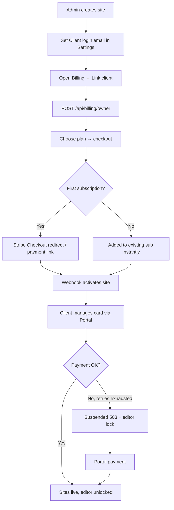
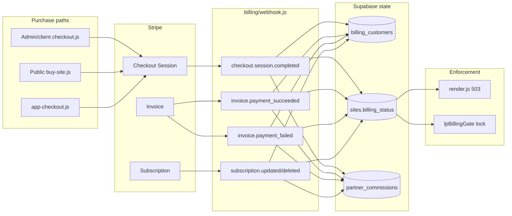
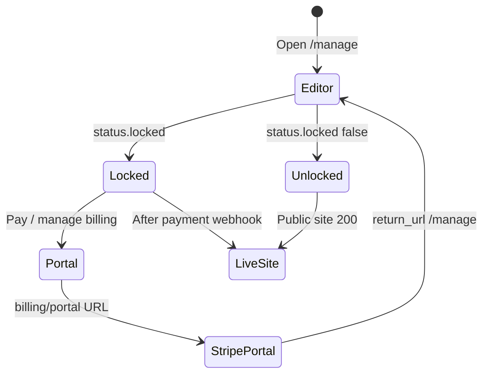

# LeadPages Stripe Billing — Complete Engineering Manual

**Document:** `features/Stripe`  
**Status:** Definitive engineering reference for hosting subscriptions, checkout, portal, and webhooks  
**Audience:** Engineers rebuilding, extending, or debugging billing; AI development agents  
**Prerequisites:** [00-VISION](../00-VISION.md), [01-ARCHITECTURE](../01-ARCHITECTURE.md), [02-DATABASE](../02-DATABASE.md), [05-PARTNERS](../05-PARTNERS.md), [10-EDITOR](../10-EDITOR.md)

> **Scope note:** This document covers **hosting billing** in `api/billing/*` — Stripe Checkout for plans, Customer Portal, subscription webhooks, suspension enforcement, and the in-editor Billing UI. It is **not** domain registration checkout (`api/domains/checkout.js` + `domains/webhook.js`), nor Stripe Connect payouts to partners.

---

## Executive Summary

LeadPages bills **hosting** through Stripe subscriptions. One Supabase user (`owner_user_id`) maps to one Stripe customer (`billing_customers`); each **site** on that account is a **subscription item** on a shared subscription. Payment state flows from Stripe webhooks into `sites.billing_status`; suspended sites return HTTP **503** with a configurable system page instead of live content.

Implementation uses **raw Stripe REST** (no Stripe SDK) in `api/billing/_stripe.js`, plus Vercel serverless routes under `api/billing/`. The editor Billing overlay in `manage.html` and standalone `/billing` page call these APIs with the Supabase session Bearer token.

| Fact | Detail |
|------|--------|
| **Stripe client** | `fetch('https://api.stripe.com/v1/…')` via `_stripe.stripe()` |
| **Auth bridge** | `billing_customers.owner_user_id` ↔ `stripe_customer_id` |
| **Per-site billing** | `sites.stripe_item_id` + `sites.plan_key` |
| **Checkout** | `POST /api/billing/checkout` |
| **Portal** | `POST /api/billing/portal` |
| **Webhooks** | `POST /api/billing/webhook` |
| **Enforcement** | `api/render.js` → `suspendedPage()` when `billing_status` is `suspended` or `flagged_deletion` |
| **Editor lock** | `lpBillingGate()` in `manage.html` when `GET /api/billing/status` → `locked: true` |
| **Amounts** | Stored in **cents** (`monthly_amount`, `setup_amount`, invoice lines) |

---

## Purpose

### Product purpose

Site owners and partners need predictable **recurring hosting revenue** without manual invoicing. The platform must:

1. **Collect** setup fees and monthly hosting via card.
2. **Combine** multiple sites under one client login into one Stripe subscription.
3. **Suspend** live sites when payment fails — after Stripe's retry window — without deleting data.
4. **Restore** access automatically when payment succeeds or the client updates their card in the portal.
5. **Support admin workflows** — assign free plans, send payment links, protect accounts from auto-deletion.

### Engineering purpose

- **Single Stripe customer per owner** — avoids duplicate subscriptions when a client has several sites.
- **Webhook-driven truth** — `billing_status` on sites and `status` on `billing_customers` sync from Stripe events, not from Checkout return URLs alone.
- **No SDK dependency** — `_stripe.js` form-encodes Stripe API calls; underscore prefix excludes it from Vercel routing.
- **Shared helpers** — `partner/buy-site.js` imports `../billing/_stripe` for public demo purchase checkout.

---

## Business Purpose

| Stakeholder | Value |
|-------------|-------|
| **Site owner (client)** | Self-serve card update, invoices, and combined billing for all their sites |
| **Partner / broker** | Demo-to-live purchase via `buy-site`; commissions booked on paid invoices |
| **LeadPages (platform)** | Recurring hosting MRR; automated suspension protects revenue |
| **Super-admin** | Plan builder, free assignments, manual unsuspend, deletion protection |

Hosting billing is distinct from **one-off demo sale** pricing (`sites.sale_price`) and **marketplace app** subscriptions (`site_app_subscriptions` via `app-checkout.js`), though all share the same Stripe customer when possible.

---

## User Types

| User | Billing actions | Typical journey |
|------|-----------------|-----------------|
| **Super-admin** (`SUPER_ADMIN_EMAILS`) | All plans, link client, checkout for any site, admin protect/extend/unsuspend, portal for any `ownerId` | Settings → Billing → apply plan or copy payment link |
| **Site owner** (customer) | View account, Stripe portal, checkout for own sites | Locked editor → Pay → portal → sites live again |
| **Partner** | Indirect — sets demo sale price; client pays via public `buy-site` | Demo preview → Get this site → Stripe Checkout |
| **Anonymous buyer** | Public `POST /api/partner/buy-site` only | No auth; webhook creates auth user from checkout email |

**Not in scope:** Partners do not receive Stripe Connect payouts in-app; partner share is recorded in `partner_commissions` and paid separately.

---

## Permissions

| Layer | Mechanism |
|-------|-----------|
| **API auth** | `getUser(req)` — Supabase `/auth/v1/user` with Bearer token |
| **Admin elevation** | `isAdminEmail(user.email)` vs `SUPER_ADMIN_EMAILS` (comma/space-separated, case-insensitive) |
| **Site ownership** | Non-admin checkout/portal requires `sites.owner_user_id === user.id` |
| **Free plan** | `checkout.js` — only admins may assign `billing_plans.is_free` |
| **Webhook** | No user JWT — `verifyStripeSig()` with `STRIPE_BILLING_WEBHOOK_SECRET` or `STRIPE_WEBHOOK_SECRET` |
| **Cron** | `CRON_SECRET` Bearer on `GET/POST /api/billing/cron` |
| **System pages editor** | `system-pages.js` — `profiles.is_super_admin`, not email list |

```text
checkout allowed =
  admin
  OR (site.owner_user_id IS NULL AND caller is initiating)
  OR site.owner_user_id === caller.id

portal ownerId override = admin only
```

Super-admins **bypass** `lpBillingGate()` — they never see `#bill-lock`.

---

## Billing Architecture



---

## Hosting Subscription Model

### One customer, one subscription, many items

```text
Owner (Supabase auth user)
  └── billing_customers (1 row)
        stripe_customer_id
        stripe_subscription_id  ← single subscription
              ├── subscription_item → site A (sites.stripe_item_id)
              ├── subscription_item → site B
              └── subscription_item → app (site_app_subscriptions; optional)
```

| Scenario | `checkout.js` behaviour |
|----------|-------------------------|
| **First paid site** | Creates Stripe Customer (if needed) → **Checkout Session** (`mode: 'checkout'`, `{ url }`) |
| **Owner already subscribed** | Adds **subscription item** + optional setup **invoice item** → `{ mode: 'added' }` |
| **Free plan** (admin only) | No Stripe — updates `sites` directly → `{ mode: 'free' }` |

### Plan definitions (`billing_plans`)

| Column | Purpose |
|--------|---------|
| `key` | Primary key; stored on `sites.plan_key` |
| `monthly_amount` | Recurring fee in **cents** |
| `setup_amount` | One-time setup in **cents** |
| `stripe_price_id` | Optional pre-created Stripe Price; else inline `price_data` at checkout |
| `stripe_setup_price_id` | Optional setup line in Checkout |
| `is_free` | Admin-assigned; never suspended by billing |
| `volume_tiers` | JSON tier pricing (plan builder; checkout uses flat `monthly_amount` today) |
| `active`, `sort` | Listing order in UI |

Prices can be created **on the fly** during checkout — Stripe Price objects in the Dashboard are optional.

---

## Checkout

### Endpoint: `POST /api/billing/checkout`

**Body:** `{ siteId, planKey, returnUrl? }`

**Auth:** Site owner or super-admin.

**Flow:**



**Checkout Session parameters (first subscription):**

| Field | Value |
|-------|-------|
| `mode` | `subscription` |
| `customer` | Existing or newly created Stripe customer |
| `line_items[0]` | Plan recurring price (`stripe_price_id` or inline `price_data`) |
| `line_items[1]` | Setup fee (optional one-time price) |
| `allow_promotion_codes` | `true` |
| `success_url` | `{returnUrl}/manage?billing=success` |
| `cancel_url` | `{returnUrl}/manage?billing=cancelled` |
| `metadata` / `subscription_data.metadata` | `site_id`, `owner_user_id`, `plan_key` |

**Admin UX:** On `{ mode: 'checkout', url }`, `manage.html` shows `window.prompt('Send this payment link…')` instead of redirecting.

### Related checkout entry points (not `billing/checkout.js`)

| Endpoint | Purpose | Webhook path |
|----------|---------|--------------|
| `POST /api/partner/buy-site` | Public demo purchase; metadata `purchase: 'site'` | `webhook.js` → creates owner, activates mockup |
| `POST /api/billing/app-checkout` | Marketplace app subscription; `billing_type: 'app'` | Same webhook, separate branch |
| `POST /api/domains/checkout` | Domain registration | **`domains/webhook.js`** — separate endpoint |

---

## Customer Portal

### Endpoint: `POST /api/billing/portal`

**Body:** `{ returnUrl?, ownerId? }` — `ownerId` only for admins.

**Response:** `{ url }` — Stripe Billing Portal session.

**Behaviour:**

1. Loads `billing_customers.stripe_customer_id` for resolved owner.
2. Creates `billing_portal/sessions` with `return_url: {returnUrl}/manage`.
3. Client updates card, pays open invoices, views receipts in Stripe-hosted UI.

**UI triggers:**

| Surface | Button | Notes |
|---------|--------|-------|
| `manage.html` Billing overlay | **Pay / manage billing** or **Update card in Stripe** | `#bl-portal` |
| `#bill-lock` overlay | **Pay / manage billing** | Calls portal when account `locked` |
| `billing.html` | Portal button | Standalone client billing page |

Card collection **must** go through Stripe (PCI); `account.js` is read-only for display in the overlay.

---

## Webhooks

### Endpoint: `POST /api/billing/webhook`

**Configure in Stripe Dashboard:** point a webhook at `https://{host}/api/billing/webhook`.

**Env:** `STRIPE_BILLING_WEBHOOK_SECRET` (preferred) or fallback `STRIPE_WEBHOOK_SECRET`.

**Signature:** HMAC-SHA256 via `verifyStripeSig()` — 5-minute timestamp tolerance.

### Events handled

| Event | Action |
|-------|--------|
| `checkout.session.completed` | Link customer + subscription; activate site; handle app checkout; demo purchase (`purchase: 'site'`) |
| `invoice.payment_succeeded` | Set owner sites → `active`; accrue partner commissions |
| `invoice.payment_failed` | Set owner sites → `past_due` (warning only — **no suspend yet**) |
| `customer.subscription.updated` | Map Stripe status → `billing_status` on all owner's billed sites |
| `customer.subscription.deleted` | Suspend all billed sites for owner |

### Status mapping (`siteStatusFor`)

| Stripe subscription status | `sites.billing_status` |
|-----------------------------|------------------------|
| `active`, `trialing` | `active` |
| `past_due` | `past_due` (site stays live — grace) |
| `unpaid`, `canceled`, `incomplete_expired` | `suspended` |
| Other | unchanged |

**Policy:** Sites are **not** suspended on the first failed charge. Suspension happens when Stripe exhausts retries (`unpaid` / `canceled`). `invoice.payment_failed` only sets `past_due`.

### `setSitesStatusForOwner`

Updates **all** sites where `owner_user_id` matches and `plan_key IS NOT NULL`:

- `suspended` → sets `suspended_at`
- `active` → clears `suspended_at`, `delete_flagged_at`
- Also updates `billing_customers.status`

### Demo purchase branch (`metadata.purchase === 'site'`)

On `checkout.session.completed`:

1. `ensureAuthUser(email)` — create or find Supabase auth user.
2. Update site: `is_mockup: false`, `status: 'live'`, `billing_status: 'active'`, partner attribution.
3. Upsert `billing_customers`.
4. Book **build** commission via `lpSplitCents` (LeadPages keeps max($750, half); partner gets remainder minus 10% if not GST-registered).
5. If `quote_id` in metadata — merge quote contact into `sites.config`, mark quote `paid`.

### Partner commissions on invoices (`accrueCommissions`)

| Type | Rate / rule | Attribution |
|------|-------------|-------------|
| **build** | `lpSplitCents` on one-off line items | `referring_partner_id` |
| **recurring** | 20% (`PARTNER_RECUR_RATE`, default 0.20) | `commission_partner_id` or `referring_partner_id`; requires `recurring_commission_active !== false` |

Idempotent via unique indexes on `partner_commissions` (site+type for build; invoice+site+type for recurring).

**Site resolution for invoice:** line `metadata.site_id` → subscription metadata → `sites.stripe_item_id` → owner's single billed site.

### Error handling

Webhook handler catches errors, logs, and still returns **`200 { received: true }`** to avoid Stripe retry storms on transient DB failures.

---

## Billing Status Lifecycle



| Status | Public site | Editor |
|--------|-------------|--------|
| `none` | Live (if `status=live`) | Full access |
| `active` | Live | Full access |
| `past_due` | Live | Full access; warning in Billing UI |
| `suspended` | **503 suspended page** | **Locked** (`locked: true`) for non-super |
| `flagged_deletion` | **503 suspended page** | **Locked** |

### Suspension page (`api/render.js`)

When `isLive && billing_status in (suspended, flagged_deletion)`:

```javascript
const key = site.is_system ? 'suspended_system'
  : (site.is_demo ? 'suspended_demo' : 'suspended_client');
// Load system_pages.content → suspendedPage(res, site, tpl)
```

Returns HTTP **503**, `Retry-After: 86400`, `noindex`. Template supports `{{businessName}}` token replacement.

Variants edited in super-admin **Suspended page** editor → `GET/POST /api/billing/system-pages`.

---

## Client UI Surfaces

### Billing overlay (`manage.html`)

Opened from command bar **Billing** (`#btn-billing` → `openBillingPage()`).

**Load sequence (admin on a site):**

1. `GET /api/billing/owner?siteId=` — client linked?
2. If no `owner_email` → gate: set Client login email in Settings.
3. If not `linked` → **Link client & enable billing** → `POST /api/billing/owner`.
4. Parallel fetch: `status`, `plans`, `contra`, `account`.

**Per-site row actions:**

| Action | API |
|--------|-----|
| Apply / switch plan | `POST /api/billing/checkout` |
| Protect / unprotect | `POST /api/billing/admin` `{ action: 'protect' }` |
| Extend auto-delete 90d | `{ action: 'extend', days: 90 }` |
| Unsuspend (manual) | `{ action: 'unsuspend' }` |

**Stripe detail block** (`_billStripeHTML`): subscription items, card last4, customer info, invoice history from `account.js`.

### Billing gate (`lpBillingGate`)

Called from `renderSiteAnalytics()` on every site load.

```javascript
GET /api/billing/status  // caller's own account
if (s.locked) → show #bill-lock full-screen overlay
```

`locked === true` when `accountStatus` is `suspended` or `flagged_deletion`.

### Plan builder (super-admin)

Settings card → **Manage hosting plans** → `openPlansPanel()` using `GET/POST /api/billing/plans`.

### Standalone `/billing` (`billing.html`)

Client-facing page for hosting summary and app subscriptions; uses same `/api/billing/*` endpoints with Supabase auth.

---

## Data Sources



| Source | Used by |
|--------|---------|
| `billing_plans` | Checkout pricing, plan picker, buy-site |
| `billing_customers` | Checkout, portal, account, webhook sync |
| `sites.plan_key`, `monthly_amount`, `stripe_item_id`, `billing_status` | Status, render gate, checkout |
| Stripe API (live) | `account.js` — subscription, PM, invoices |
| `system_pages` | Suspended 503 HTML |
| `partner_commissions` | Webhook accrual |

---

## API Reference (`api/billing/`)

| Route | Method | Auth | Purpose |
|-------|--------|------|---------|
| **`checkout.js`** | POST | Owner or admin | Start hosting checkout or add site to subscription |
| **`portal.js`** | POST | Owner; admin + `ownerId` | Stripe Customer Portal URL |
| **`webhook.js`** | POST | Stripe signature | Subscription lifecycle + commissions |
| **`status.js`** | GET | Bearer; admin `?ownerId=` / `?siteId=` | Account summary, `locked`, site list |
| **`account.js`** | GET | Bearer; admin scope | Live Stripe subscription + invoices (read-only) |
| **`plans.js`** | GET / POST | GET all; POST admin | Plan builder CRUD |
| **`owner.js`** | GET / POST | Admin | Link `owner_email` → auth user |
| **`admin.js`** | POST | Admin | protect, extend, unsuspend, system flag |
| **`cron.js`** | GET/POST | `CRON_SECRET` | Contra accrual; flag 90-day suspended sites |
| **`system-pages.js`** | GET / POST | Super-admin JWT | Suspended page variants |
| **`contra.js`** | GET / POST | Owner / admin | Contra ledger (adjacent to billing UI) |
| **`app-checkout.js`** | POST | Owner or admin | App marketplace checkout (shared customer) |
| **`app-cancel.js`** | POST | Owner or admin | Cancel app subscription item |
| **`app-status.js`** | GET | Owner or admin | List app subs for site |
| **`_stripe.js`** | — | (not routed) | Shared helpers |
| **`_accrual.js`** | — | (not routed) | Contra monthly accrual helper for cron |

### `status.js` response shape

```json
{
  "accountStatus": "active | past_due | suspended | flagged_deletion | none",
  "locked": false,
  "hasBillingAccount": true,
  "currency": "aud",
  "total": 4900,
  "sites": [{
    "id": "…", "business_name": "…", "slug": "…",
    "plan_key": "starter", "monthly_amount": 4900,
    "billing_status": "active", "setup_paid": true,
    "suspended_at": null, "delete_flagged_at": null
  }]
}
```

`accountStatus` = worst status across billed sites and `billing_customers.status`.

---

## Database Tables

| Table | Stripe billing role |
|-------|---------------------|
| **`billing_plans`** | Plan catalog; amounts in cents |
| **`billing_customers`** | `owner_user_id` → `stripe_customer_id`, `stripe_subscription_id`, `status` |
| **`sites`** | `plan_key`, `monthly_amount`, `stripe_item_id`, `billing_status`, `setup_paid`, `suspended_at`, `delete_flagged_at`, `delete_protected`, `delete_extend_until`, `owner_user_id`, `owner_email` |
| **`partner_commissions`** | Build + recurring rows from webhook |
| **`system_pages`** | Suspended page HTML fragments |
| **`site_app_subscriptions`** | App items on same Stripe subscription (webhook app branch) |
| **`partner_quotes`** | Updated to `paid` on quote checkout completion |

See [02-DATABASE](../02-DATABASE.md) for full column lists and ER diagram.

---

## Environment Variables

| Variable | Required | Purpose |
|----------|----------|---------|
| `STRIPE_SECRET_KEY` | Yes (paid billing) | All Stripe API calls |
| `STRIPE_BILLING_WEBHOOK_SECRET` | Yes (production) | Verify hosting webhook |
| `STRIPE_WEBHOOK_SECRET` | Fallback | Used if billing-specific secret unset |
| `SUPABASE_URL`, `SUPABASE_SERVICE_ROLE_KEY` | Yes | DB + admin user creation |
| `SUPABASE_ANON_KEY` | Yes | JWT validation in `getUser` |
| `SUPER_ADMIN_EMAILS` | Yes | Admin elevation |
| `CRON_SECRET` | Recommended | Secure `/api/billing/cron` |
| `PARTNER_BUILD_RATE` | Optional | Default 0.50 (legacy; build uses lpSplit) |
| `PARTNER_RECUR_RATE` | Optional | Default 0.20 recurring commission |

---

## Related Files

| File | Relationship |
|------|--------------|
| **`api/billing/_stripe.js`** | Stripe REST, auth, webhook signature |
| **`api/billing/checkout.js`** | Hosting checkout |
| **`api/billing/portal.js`** | Customer Portal |
| **`api/billing/webhook.js`** | Stripe event handler |
| **`api/billing/status.js`** | Account summary + editor lock |
| **`api/billing/account.js`** | In-app Stripe detail |
| **`api/billing/plans.js`** | Plan builder API |
| **`api/billing/owner.js`** | Client login linking |
| **`api/billing/admin.js`** | Admin overrides |
| **`api/billing/cron.js`** | Daily maintenance |
| **`api/billing/system-pages.js`** | Suspended page CMS |
| **`manage.html`** | Billing overlay, gate, plan builder, suspended editor |
| **`billing.html`** | Standalone client billing |
| **`api/render.js`** | Public suspension enforcement |
| **`api/partner/buy-site.js`** | Public demo checkout → same webhook |
| **`api/domains/webhook.js`** | **Separate** Stripe webhook for domains |
| **`vercel.json`** | Cron schedule for `billing/cron`; `/billing` rewrite |
| **`docs/01-ARCHITECTURE.md`** | Platform billing overview |
| **`docs/02-DATABASE.md`** | Table reference |
| **`docs/05-PARTNERS.md`** | Commissions, buy-site |
| **`docs/features/Dashboard.md`** | `lpBillingGate` interaction |

---

## Functions

### Server (`api/billing/`)

| Function | File | Role |
|----------|------|------|
| `stripe(path, method, params)` | `_stripe.js` | Raw REST to Stripe |
| `getUser(req)` | `_stripe.js` | Validate Supabase Bearer token |
| `isAdminEmail(email)` | `_stripe.js` | Check `SUPER_ADMIN_EMAILS` |
| `verifyStripeSig(raw, sig, secret)` | `_stripe.js` | Webhook HMAC verification |
| `siteStatusFor(subStatus)` | `webhook.js` | Map Stripe → site status |
| `setSitesStatusForOwner(ownerId, status)` | `webhook.js` | Bulk site status update |
| `accrueCommissions(inv)` | `webhook.js` | Partner commission inserts |
| `ensureAuthUser(email)` | `webhook.js` | Create buyer auth on demo purchase |
| `lpSplitCents(price, gstReg)` | `webhook.js` | Build commission split |

### Client (`manage.html`)

| Function | Role |
|----------|------|
| `openBillingPage()` | Mount `#billing-page` overlay |
| `_billLoadAll()` | Parallel status/plans/contra/account fetch |
| `_billRender()` | Site rows, portal button, Stripe HTML |
| `_billStripeHTML()` | Subscription + invoice display |
| `lpBillingGate()` | `#bill-lock` when suspended |
| `openPlansPanel()` / `_bp*` | Plan builder UI |
| `openSuspendedEditor()` / `_susp*` | Suspended page editor |
| `_billFetch(path, opts)` | Authenticated fetch wrapper |

---

## Event Flow

### First paid site (client self-serve)



### Payment failure and recovery



---

## User Journey



**Partner demo purchase journey:** Client on mockup → **Get this site** → `buy-site` Checkout → webhook converts mockup to live site + creates login — no prior `owner.js` link required.

---

## Cron (`/api/billing/cron`)

**Schedule:** `0 3 * * *` UTC (see `vercel.json`).

| Task | Behaviour |
|------|-----------|
| **Contra accrual** | For `contra_accounts` with `accrue_monthly`, run `_accrual.accrueOwner` |
| **Deletion flag** | Sites `billing_status=suspended` and `suspended_at` > 90 days ago → `flagged_deletion` unless `delete_protected` or `delete_extend_until` |

Cron does **not** delete sites — it only flags them for admin review.

---

## Performance Considerations

| Area | Behaviour | Risk |
|------|-----------|------|
| **`account.js`** | Up to 3 Stripe GETs + 12 invoices | Acceptable for overlay open; no caching |
| **Webhook** | Sequential DB + Stripe fetches per event | Stripe expects fast 200; errors swallowed |
| **`status.js`** | Single owner query + sites list | Called on every analytics load (`lpBillingGate`) |
| **Inline Stripe prices** | Created per checkout if no `stripe_price_id` | Price proliferation in Stripe Dashboard |
| **Owner user lookup** | Paginated admin API scan up to 12×200 users | Slow for large auth tables |

---

## Security Considerations

| Topic | Detail |
|-------|--------|
| **Webhook authenticity** | HMAC + timing-safe compare; reject missing/invalid sig with 400 |
| **Service role** | All billing routes use Supabase service role — never expose to browser |
| **Admin list** | `SUPER_ADMIN_EMAILS` is env-only; not stored in DB |
| **Portal scope** | Non-admins can only open portal for own `billing_customers` row |
| **Manual unsuspend** | Admin can reactivate without payment — intentional override; confirm in UI |
| **Webhook 200 on error** | Prevents retry loops but may hide failures — monitor logs |
| **PII in Stripe** | Customer name/email mirrored from site; invoices may contain business names |
| **Separate webhooks** | Use distinct signing secrets for billing vs domains endpoints |

---

## Technical Debt

| ID | Issue | Location | Impact |
|----|-------|----------|--------|
| TD-S1 | **Duplicate webhook branch** | `webhook.js` ~221–222 | `if (obj.mode !== 'subscription') break;` repeated twice — harmless dead code |
| TD-S2 | **No Stripe SDK** | `_stripe.js` | Manual form encoding; harder to maintain vs official SDK |
| TD-S3 | **Inline price creation** | `checkout.js`, `app-checkout.js` | Many duplicate Stripe Price objects |
| TD-S4 | **`monthly_amount` on sites** | Cached from plan | Can drift if plan price changes without migration |
| TD-S5 | **Volume tiers unused in checkout** | `billing_plans.volume_tiers` | Plan builder field not applied at checkout |
| TD-S6 | **Webhook swallows errors** | `webhook.js` catch → 200 | Silent commission or activation failures |
| TD-S7 | **`api/manage.html` drift** | Legacy duplicate of billing UI | Same risk as Dashboard doc TD-D7 |
| TD-S8 | **Two webhook secrets** | Env naming | Easy to misconfigure billing vs legacy `STRIPE_WEBHOOK_SECRET` |
| TD-S9 | **Admin portal `ownerId`** | `portal.js` | Admin must know UUID; no email lookup |

---

## Future Improvements

1. **Stripe SDK** — replace hand-rolled `formEncode` when package policy allows.
2. **Pre-sync Stripe Prices** — admin saves plan → create/update Price IDs automatically.
3. **Volume tier checkout** — apply `volume_tiers` by site count on same owner.
4. **Webhook idempotency table** — store `event.id` to guarantee exactly-once side effects.
5. **Alerting** — log webhook errors to external monitor instead of silent 200.
6. **Subscription item removal** — API to remove a site from subscription without full cancel.
7. **Client email portal link** — magic link to `/billing` when invoice fails.
8. **Align `api/manage.html`** or remove legacy copy.
9. **GST line items** — explicit tax handling on Australian invoices.
10. **Test mode documentation** — separate Stripe keys and webhook endpoints for staging.

---

## Connections to Other Systems

### Editor (`manage.html`)

- Command bar **Billing** opens overlay; not a separate tab.
- `lpBillingGate()` runs on analytics load — blocks all editor UI when locked.
- Super-admin **Settings** hosts plan builder and suspended page editor.

See [10-EDITOR](../10-EDITOR.md), [features/Dashboard.md](./Dashboard.md).

### Public render (`api/render.js`)

Billing enforcement is **server-side** on every live request — clients cannot bypass suspension via cached HTML.

### Partners

- Demo sales → `buy-site.js` + webhook `purchase: 'site'`.
- Commissions → `partner_commissions` on build and recurring invoice lines.
- See [05-PARTNERS](../05-PARTNERS.md).

### Marketplace apps

- `app-checkout.js` adds items to the **same** subscription when possible.
- Webhook `billing_type: 'app'` upserts `site_app_subscriptions`.
- Hosting doc scope: apps share customer/subscription but have separate status rows.

### Domains

- Domain purchases use **`api/domains/checkout.js`** and **`api/domains/webhook.js`**.
- Do not point domain Stripe events at `billing/webhook.js`.

See [06-DOMAINS](../06-DOMAINS.md).

### Contra ledger

- **`contra.js`** + **`cron.js`** handle non-Stripe “barter” accounts shown in the Billing overlay.
- When contra limit exceeded, hosting bills the card normally.

---

## Data Flow



---

## User Flow (Client locked account)



---

## Glossary

| Term | Meaning |
|------|---------|
| **Hosting plan** | Row in `billing_plans`; recurring site fee |
| **Subscription item** | One site (or app) line on a Stripe subscription; `sites.stripe_item_id` |
| **Owner** | Supabase auth user in `sites.owner_user_id`; one `billing_customers` row |
| **Grace (`past_due`)** | Payment failed but site still live; Stripe retrying |
| **Suspended** | Live site shows 503; editor locked for clients |
| **Flagged for deletion** | Suspended > 90 days (cron); still 503, admin review |
| **lpSplit** | Build commission split: platform max($750, half), partner remainder |
| **Contra** | Non-cash ledger between platform and client; adjacent to Stripe billing |

---

*Last updated: July 2026 — reflects `api/billing/*` and `manage.html` billing implementation on branch `main`.*
