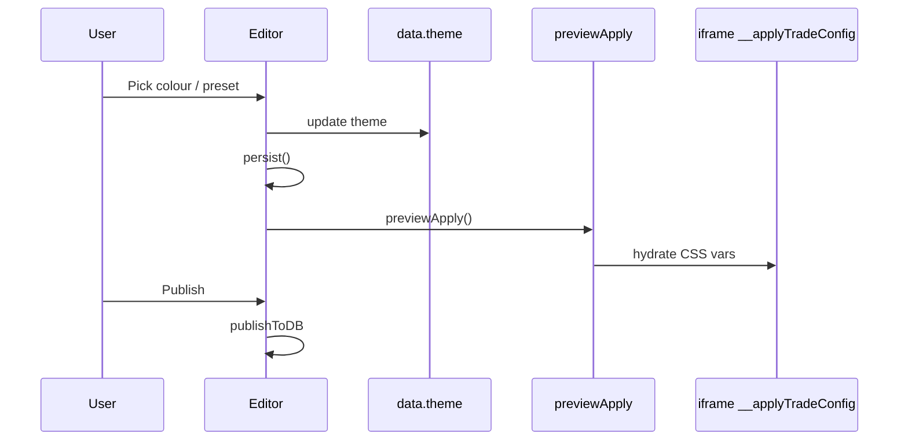
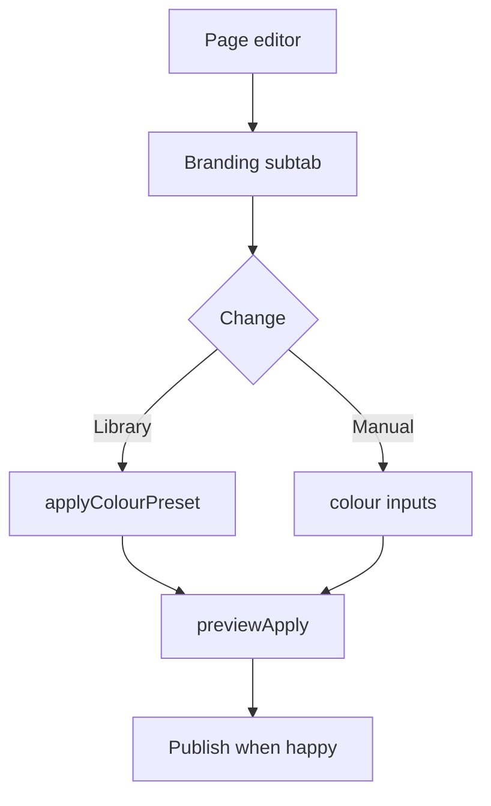
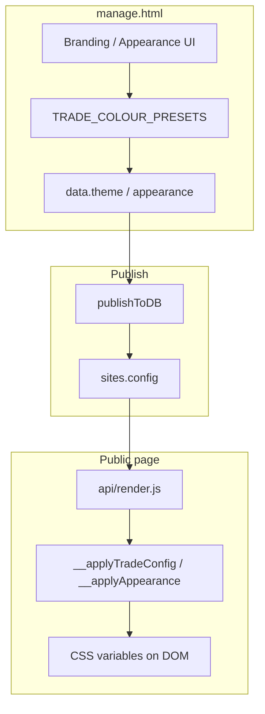
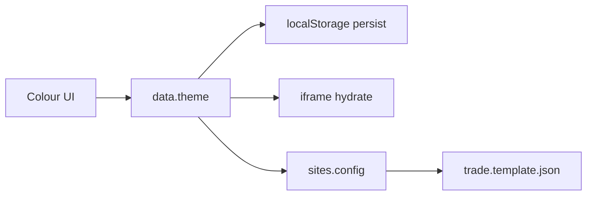
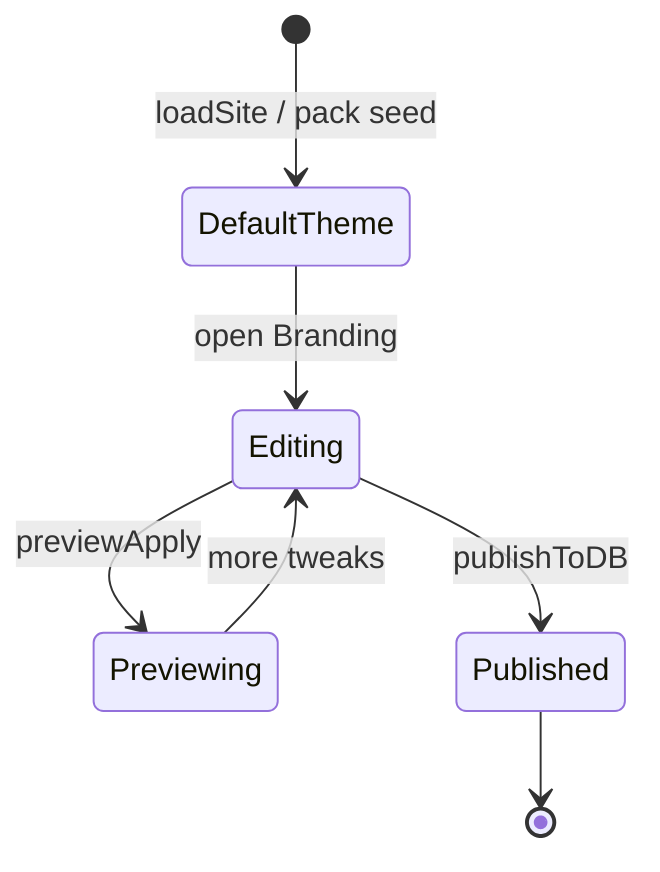

# LeadPages Theme Engine — Complete Engineering Manual

**Document:** `features/Theme Engine`  
**Status:** Definitive reference for trade colour tokens and broker appearance theming  
**Audience:** Engineers changing how sites look in editor + public render  
**Prerequisites:** [11-DESIGN-SYSTEM](../11-DESIGN-SYSTEM.md), [features/Editor](Editor.md), [03-TEMPLATE-SYSTEM](../03-TEMPLATE-SYSTEM.md)

> **Scope:** How `data.theme` (trade) and `data.appearance` (broker-app) are edited, stored, and applied to live pages via hydration — not the separate [Theme Packs](Theme%20Packs.md) library UI.

---

## Executive Summary

LeadPages has **two theme systems** in one editor:

| Template | Config key | Editor UI | Public apply |
|----------|------------|-----------|--------------|
| **trade** | `data.theme` | Branding subtab — colour pickers + `TRADE_COLOUR_PRESETS` | `__applyTradeConfig` sets CSS vars |
| **broker-app** | `data.appearance` | Appearance tab | `__applyAppearance` |

Trade tokens: `pipe`, `hivis`, `steel`, `safety`, `lightBg`, `h1`, `h2`, `paragraph`, `accent`, `presetKey`, `presetName`.

Typography colours (`h1` / `h2` / `paragraph`) map to CSS `--h1`, `--h2`, `--paragraph` for hero headlines, section titles, and body/intro copy.

---

## Purpose

Let non-designers rebrand sites in minutes while keeping contrast-safe defaults from trade packs and colour libraries.

---

## Business Purpose

Partners rebrand client sites quickly; tradies pick industry-appropriate palettes without CSS knowledge.

---

## User Types

| Role | Access |
|------|--------|
| **broker / super** | Full theme controls on allowed templates |
| **client** | Same if editor access |
| **leads** | No theme access |

---

## Permissions

- Trade colours: **Page editor → Branding** (trade template)
- Broker appearance: **Appearance** tab (`broker-app` only in `TEMPLATE_NAV`)
- Super trade builder can edit `TRADE_COLOUR_PRESETS` source in code / service packs

---

## Theme Engine Layout

**Trade — Branding subtab**

```text
Colour pickers (TRADE_COLOURS × 8)
├── pipe — Brand
├── hivis — CTA
├── steel — Header/footer
├── safety — Highlights
└── lightBg — Page background
Layout preset chips (TRADE_PRESETS / LAYOUTS)
Colour library grid (#trade-colour-library)
```

**Broker-app — Appearance tab**

```text
10 colour + font fields (DEFAULT_APPEARANCE)
Preset chips (APPR_PRESETS)
Import theme JSON
```

---

## Navigation

| Path | Function |
|------|----------|
| Trade | Details → Branding chip → `renderLandingSub` branding case |
| Broker | Appearance tab → `renderAppearance()` |

---

## Widgets

| Widget | Purpose |
|--------|---------|
| `#col-{token}` | Colour input |
| `#colt-{token}` | Hex text sync |
| `.lib-btn[data-trade]` | Library preset button |
| Layout chips | `renderTradePresets` |
| `#ap-*` | Broker appearance fields |

---

## Statistics

None.

---

## Quick Actions

| Action | Function |
|--------|----------|
| Pick library colour | `applyColourPreset(c, name)` |
| Adjust picker | `wireTradeColours` → `persist` + `previewApply` |
| Apply layout preset | `applyTradePack` / layout toggles |
| Reset broker theme | Appearance reset → `DEFAULT_APPEARANCE` |

---

## Recent Activity

N/A.

---

## Site Selection

Theme is per-site in `data` loaded by `loadSite()`.

---

## Notifications

`toast('"{presetName}" applied')` on preset apply.

---

## Data Sources

- `data.theme` / `data.appearance` in memory
- `TRADE_COLOUR_PRESETS`, `TRADE_PRESETS`, `LAYOUTS` constants in `manage.html`
- `themeFromPreset(tradeLabel)` mapping
- Published via `publishToDB()` → `sites.config`

---

## API Calls

None direct — theme is config JSON only. Images in theme use [Cloudinary](Cloudinary.md).

---

## Database Tables

| Storage | Fields |
|---------|--------|
| `sites.config.theme` | Trade tokens object |
| `sites.config.appearance` | Broker palette |
| `sites.config.layout` | Layout preset id |

---

## Related Files

| File | Role |
|------|------|
| `manage.html` | All theme UI + constants |
| `trade.template.json` | Consumes theme in hydration |
| `brokerapp.template.json` | `__applyAppearance` |
| [11-DESIGN-SYSTEM](../11-DESIGN-SYSTEM.md) | Token semantics |

---

## Functions

| Function | Purpose |
|----------|---------|
| `syncColourInputs(c)` | Pickers ← `c.theme` |
| `wireTradeColours(c)` | Picker change → theme |
| `applyColourPreset(c, name)` | Apply `TRADE_COLOUR_PRESETS` entry |
| `getTradeColourPreset(name)` | Lookup preset |
| `renderColourLibrary(c)` | Library grid HTML |
| `renderTradePresets(c)` | Layout/theme chips |
| `markActiveTheme(c)` | UI active state |
| `themeFromPreset(label)` | Trade name → theme object |
| `renderAppearance()` | Broker tab |
| `applyApprAdmin(a)` | Editor chrome CSS vars |
| `curAppr()` | Merge with `DEFAULT_APPEARANCE` |

---

## Event Flow



---

## User Journey



---

## Performance Considerations

- `previewApply` avoids full iframe reload
- Library grid is static HTML from presets object — no network
- Font loads lazy via `apprLoadFont` (broker)

---

## Security Considerations

- Theme values are hex strings — escaped on output via `esc()`
- No user-supplied CSS injection — token mapping only in templates

---

## Technical Debt

| ID | Issue |
|----|-------|
| TD-TE1 | Two parallel systems (theme vs appearance) |
| TD-TE2 | Presets hardcoded in `manage.html` — large file |
| TD-TE3 | `accent` token inconsistently named vs design doc |

---

## Future Improvements

1. Unified theme model across templates
2. DB-backed colour libraries per partner
3. Contrast checker before publish
4. Dark mode tokens

---

## Theme Engine Architecture



---

## Connections

| Feature | Link |
|---------|------|
| [Theme Packs](Theme%20Packs.md) | Saved/demo themes |
| [Service Packs](Service%20Packs.md) | Seeds `theme` at create |
| [Live Preview](Live%20Preview.md) | `previewApply` |
| [Publishing](Publishing.md) | Persist to DB |

---

## Data Flow



---

## User Flow



---

*Last updated: July 2026.*
