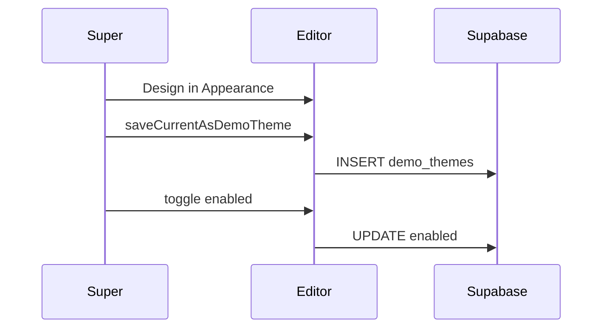
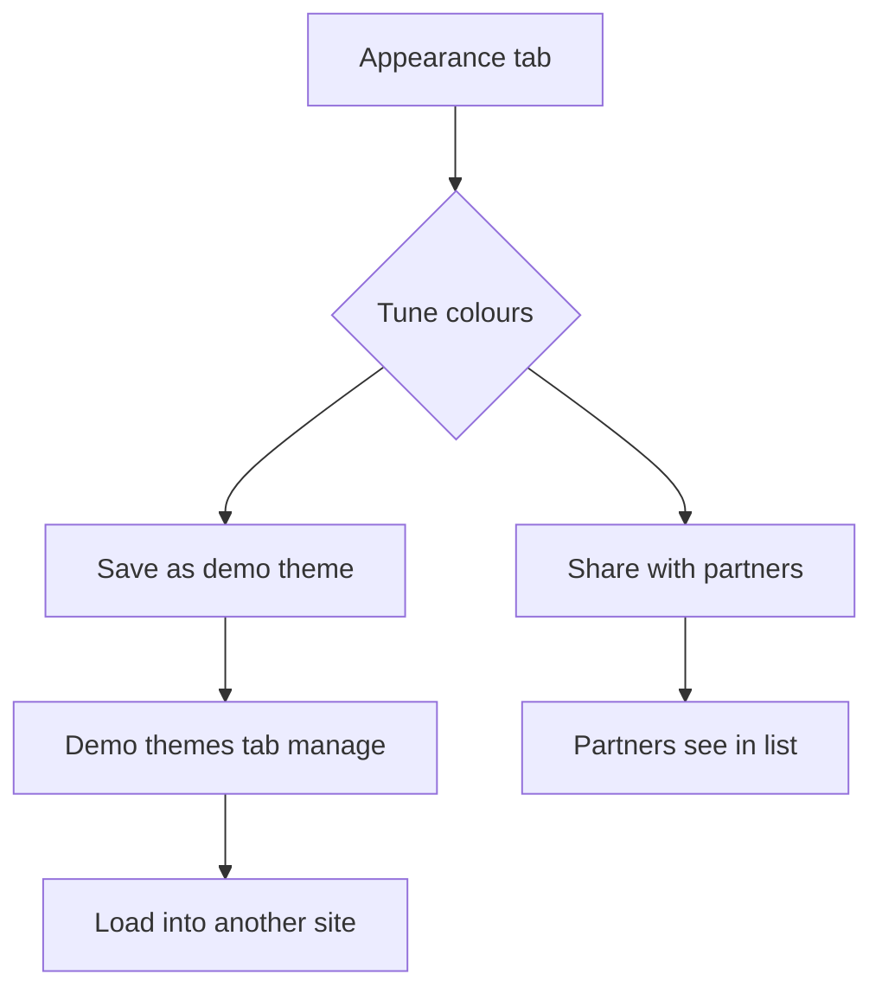
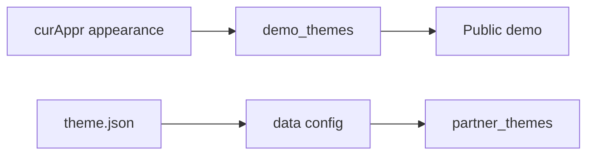
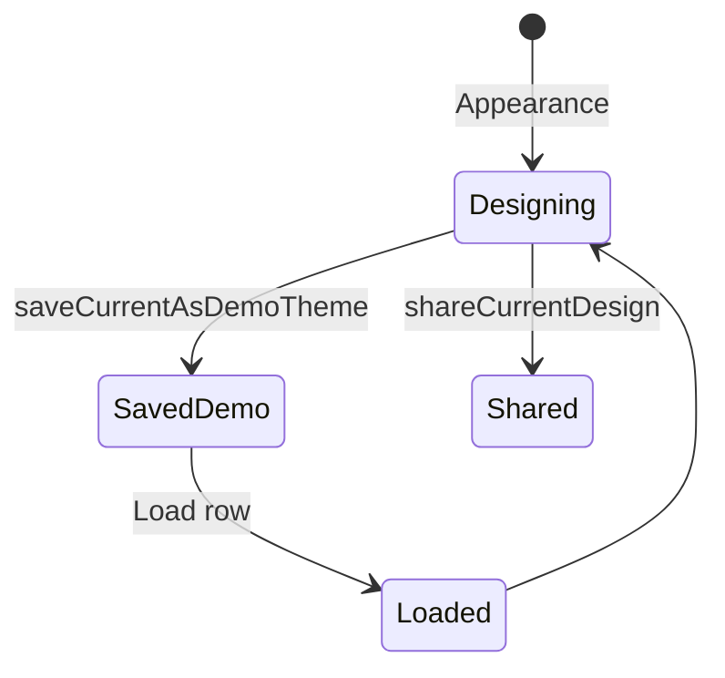

# LeadPages Theme Packs — Complete Engineering Manual

**Document:** `features/Theme Packs`  
**Status:** Reference for demo themes, shared partner themes, and JSON theme import/export  
**Audience:** Engineers working on broker appearance libraries and partner design sharing  
**Prerequisites:** [features/Theme Engine](Theme%20Engine.md), [features/Editor](Editor.md)

> **Scope:** `demo_themes`, `partner_themes`, and Appearance-tab JSON themes — **not** trade colour presets ([Theme Engine](Theme%20Engine.md)) or trade starter content ([Service Packs](Service%20Packs.md)).

---

## Executive Summary

Theme Packs are **reusable appearance bundles** for **broker-app** calculator sites:

| Pack type | Storage | UI tab |
|-----------|---------|--------|
| **Demo themes** | `demo_themes` table | Demo themes (`#av-demothemes`) [super] |
| **Shared partner themes** | `partner_themes` (`shared_with_partners`) | Same tab — shared list |
| **File export/import** | JSON download/upload | Appearance tab (`renderSavedThemes`) |

Shape: `appearance` object matching `DEFAULT_APPEARANCE` (10 colour/font keys) or full `config` for partner shares.

---

## Purpose

Let supers curate public `/demo` looks and let partners share proven broker designs without copying sites manually.

---

## Business Purpose

| Stakeholder | Value |
|-------------|-------|
| **Super-admin** | Control demo calculator themes |
| **Partner** | Share winning layouts with network |
| **Prospect** | Consistent demo experience |

---

## User Types

| Role | Access |
|------|--------|
| **super** | Demo themes CRUD, enable/disable on demo |
| **broker** | View shared themes list; share current design |
| **trade** | Tab hidden (`demothemes` not in `TEMPLATE_NAV.trade`) |

---

## Permissions

- `demothemes` in `ALLOWED` for super only (broker-app nav)
- `shareCurrentDesign` requires loaded `currentSiteId`
- RLS on `demo_themes`, `partner_themes`

---

## Layout

**Demo themes tab (`#av-demothemes`)**

```text
Save current look (dt-name, dt-label, dt-save)
Demo theme list (#dt-list)
  ├── Colour dots preview
  ├── Shown on demo toggle
  ├── Load → Appearance tab
  └── Remove

Share with partners (sht-name, sht-save)
Shared themes list (#sht-list)
```

**Appearance tab — file themes**

```text
Download custom-theme.json (ap-download)
Upload JSON (ap-upload)
```

---

## Navigation

`showView('demothemes')` → `renderDemoThemes()` + `renderSharedThemes()`

---

## Widgets

| ID | Role |
|----|------|
| `#dt-list` | Demo theme rows |
| `#dt-save` | `saveCurrentAsDemoTheme` |
| `#sht-list` | Partner shared themes |
| `#sht-save` | `shareCurrentDesign` |
| `#ap-download` / `#ap-upload` | JSON file pack |

---

## Statistics

None.

---

## Quick Actions

| Action | Function |
|--------|----------|
| Save demo theme | `saveCurrentAsDemoTheme()` |
| Toggle demo visibility | `toggleDemoTheme(id, enabled)` |
| Load demo theme | Apply `appearance` → `renderAppearance` |
| Share design | `shareCurrentDesign()` — full `config` snapshot |
| Remove shared | `removeSharedTheme` |
| Import JSON | `renderSavedThemes` upload handler |

---

## Recent Activity

Shared themes show `created_at` date in list.

---

## Site Selection

Share/import applies to **`currentSiteId`** config.

---

## Notifications

Toasts: “Added to demo”, “Shared with partners”, “Theme loaded”, etc.

---

## Data Sources

| Source | Content |
|--------|---------|
| `demo_themes.appearance` | Broker palette JSON |
| `partner_themes.config` | Full site config minus `users`, `savedThemes` |
| Local file | `{ name, palette, logoUrl? }` |

---

## API Calls

Direct Supabase only:

- `demo_themes` SELECT, INSERT, UPDATE, DELETE
- `partner_themes` SELECT, INSERT, DELETE

---

## Database Tables

| Table | Columns used |
|-------|----------------|
| **`demo_themes`** | `id`, `name`, `label`, `appearance`, `enabled`, `sort`, `created_at` |
| **`partner_themes`** | `id`, `name`, `config`, `shared_with_partners`, `source_site_id`, `partner_id` |

---

## Related Files

| File | Role |
|------|------|
| `manage.html` | All theme pack UI |
| Public `/demo` | Consumes enabled `demo_themes` |
| [features/Theme Engine](Theme%20Engine.md) | `curAppr()`, `data.appearance` |

---

## Functions

| Function | Purpose |
|----------|---------|
| `renderDemoThemes()` | List + wire demo rows |
| `saveCurrentAsDemoTheme()` | Upsert by name |
| `toggleDemoTheme` / `removeDemoTheme` | Enable/delete |
| `renderSharedThemes()` | Partner shared list |
| `shareCurrentDesign()` | INSERT `partner_themes` |
| `removeSharedTheme()` | DELETE shared row |
| `renderSavedThemes()` | File download/upload wire-once |

---

## Event Flow



---

## User Journey



---

## Performance Considerations

- Small row count — full SELECT on tab open
- Share serialises full `config` — can be large JSON

---

## Security Considerations

- Super-only demo management in UI
- Shared themes expose full config — partners only via RLS
- JSON import validates `palette.brand` exists

---

## Technical Debt

| ID | Issue |
|----|-------|
| TD-TP1 | Trade sites have no equivalent “theme pack” DB table |
| TD-TP2 | Partner share stores full config — not diffable |
| TD-TP3 | No version history on shared themes |

---

## Future Improvements

1. Trade theme packs in DB (parity with service packs)
2. Preview thumbnail screenshots per pack
3. Partner-only share ACL (not global `shared_with_partners`)

---

## Architecture

```mermaid
flowchart TB
  subgraph editor [manage.html]
    App[Appearance tab]
    Demo[Demo themes tab]
    File[JSON import/export]
  end

  subgraph db [(Supabase)]
    DT[demo_themes]
    PT[partner_themes]
  end

  subgraph public [Public]
    DemoSite[/demo route]
  end

  App --> DT
  Demo --> DT & PT
  File --> App
  DT --> DemoSite
```

---

## Connections

| Feature | Link |
|---------|------|
| [Theme Engine](Theme%20Engine.md) | `appearance` shape |
| [Service Packs](Service%20Packs.md) | Trade content packs (different) |
| [Partner System](Partner%20CRM.md) | Share workflow |

---

## Data Flow



---

## User Flow



---

*Last updated: July 2026.*
